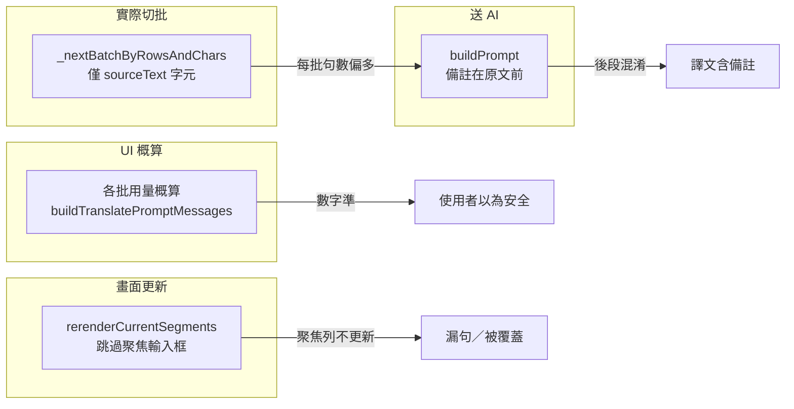

# CAT AI 批次翻譯 — 穩定修正規劃

> 建立：2026-06-27  
> 狀態：**已實作**（A–D；待驗收）  
> 相關：[`CAT_AI_BATCH_TOKEN_UX_2026-05.md`](CAT_AI_BATCH_TOKEN_UX_2026-05.md)、[`CAT_AI_BATCH_SURROUNDING_CONTEXT_PLAN_2026-06.md`](CAT_AI_BATCH_SURROUNDING_CONTEXT_PLAN_2026-06.md)、[`bug-report_ai-batch-parse-error-no-retry_2026-06.md`](bug-report_ai-batch-parse-error-no-retry_2026-06.md)

---

## 1. 背景

2026-06 實務回報兩類與「分批送出」無關、或僅部分相關的問題：

1. **譯文品質**：批次翻譯後，部分句段把「額外資訊」欄的英文描述翻進譯文，而非只翻「原文」；量稍多時後段句段較常發生，類似聊天室長對話後半段注意力衰退。
2. **漏句**：全文批次翻譯後，**第一句**或**當下選取／聚焦**的句段經常仍為空白或舊譯文。

右側「各批用量概算」若顯示 token 很低（例如每批提示語約 150、翻譯內容約 500–850），仍可能出現上述現象——**概算表與實際切批邏輯、prompt 結構、UI 刷新規則並非同一條管線**。

本文件彙整四項修正（A–D），供後續實作與驗收。

---

## 2. 問題總覽

| 代號 | 現象 | 根因摘要 | 主要觸點 |
|------|------|----------|----------|
| **A** | 譯文含額外資訊內容 | prompt 中 `備註` 排在 `原文` 前且常更長，模型混淆翻譯目標 | `cat-tool/js/ai-translate.js` `buildPrompt` |
| **B** | 概算小但後段仍漂移／偶發過長 | 切批只計 `sourceText`，未計 `extraValue`／Key 等實際送入字元 | `cat-tool/app.js` `_segmentSourceCharCount`、`_nextBatchByRowsAndChars` |
| **C** | 「詢問確認」路徑一次送太多句 | `confirmAskSegs` 未走分批迴圈 | `cat-tool/app.js` `runAiBatchTranslate` |
| **D** | 聚焦句段翻完卻漏顯示／被蓋回 | `rerenderCurrentSegments` 跳過 `activeElement`；blur 寫回舊內容 | `cat-tool/app.js` `runAiBatchTranslate`、`rerenderCurrentSegments` |



---

## 3. 問題 A — Prompt 結構：備註誤當翻譯主體

### 3.1 現象

- 原文極短（例如 `Simple·door`），額外資訊欄含長段英文說明。
- AI 譯文變成整段說明的中文，而非道具名稱等簡短譯法。
- 同一批內越靠後的句段越容易出錯（與 LLM 長 user message 注意力衰退一致）。
- **與 API 429／context 爆掉無必然關係**；概算 token 很低時仍可能發生。

### 3.2 根因

[`cat-tool/js/ai-translate.js`](../cat-tool/js/ai-translate.js) `buildPrompt` 每句結構（約第 185–193 行）：

```
[句段 N]
Key: ...
備註: <extraValue，常遠長於原文>
前文: ...
原文: <真正要翻譯的短文>
後文: ...
TM 參考: ...
```

系統訊息僅在開頭要求「翻譯句段」，但 user message 內 **`備註` 視覺與位置上優先於 `原文`**，且字數常為原文數倍至數十倍。

### 3.3 修正規格

**檔案**：[`cat-tool/js/ai-translate.js`](../cat-tool/js/ai-translate.js) — `buildPrompt`

1. **調整每句欄位順序**：`原文` 緊接 `Key`（若有）之後、置於最醒目位置。
2. **`備註` 降格**：移於 `原文` 之後，並加明確標示「僅供參考、請勿翻譯」，與「上文脈／下文脈」區塊用語一致。
3. **系統訊息加強**（`【回傳格式要求】` 區塊內或直前）：明確寫出「只翻譯每句的 `原文` 欄；`備註`、前文、後文、TM 參考、上下文區塊均不得寫入 `translation`」。

**建議每句結構**：

```
[句段 N]
Key: ...
原文: <要翻譯的內容>
（備註，請勿翻譯：<extraValue>）
前文: ...        ← 若 includeContext
後文: ...        ← 若 includeContext
TM 參考（N%）：...
```

**邊界**：

- `includeExtraValue === false` 時不輸出備註行（行為與現有一致）。
- 變更後須同步更新「預覽提示語」與「各批用量概算」——兩者皆呼叫 `buildTranslatePromptMessages`，無需另改估算公式。

### 3.4 驗收（白話）

1. 開啟含長「額外資訊」、短原文的檔案（遊戲道具／I2Loc 類樣本）。
2. 批次翻譯全文，每批 10 句、勾選「額外資訊」參照。
3. 檢查原先錯誤列（如 `Simple·door`、`Knickknack·shelf`）：譯文應為簡短名稱，**不得**為額外資訊整段描述的中文。
4. 點「預覽提示語」：確認每句為「原文」在前、「備註，請勿翻譯」在後。

---

## 4. 問題 B — 切批字元數未含額外資訊

### 4.1 現象

- Modal 右側「各批用量概算」顯示每批 token 很低且全綠。
- 實務仍可能因**單批句數過多**加劇問題 A（後段漂移）。
- 與 [`_computeAiBatchRefTokens`](cat-tool/app.js) 的 **extra token 顯示** 無矛盾：該函式有算 `extraValue`，但 **切批函式未使用同一套字元加總**。

### 4.2 根因

[`cat-tool/app.js`](../cat-tool/app.js)：

```javascript
function _segmentSourceCharCount(seg) {
    return [...String(seg?.sourceText || '')].length;
}

function _nextBatchByRowsAndChars(list, startIdx, rowLimit, charLimit) {
    // ...
    const c = _segmentSourceCharCount(seg);  // 僅原文
}
```

`charLimit`（預設 2500）因此代表「原文總字元上限」，非「送進 user message 的句段本體字元上限」。

### 4.3 修正規格

**檔案**：[`cat-tool/app.js`](../cat-tool/app.js)

1. 擴充 `_segmentSourceCharCount(seg, opts)`：

```javascript
function _segmentSourceCharCount(seg, opts) {
    let c = [...String(seg?.sourceText || '')].length;
    if (opts?.extra) c += [...String(seg?.extraValue || '')].length;
    if (opts?.key) c += [...String((seg?.keys || []).join(' / '))].length;
    // TM hint 為執行期附加，切批前若已掛 _tmHint 可選計入（與 refOptions.useTm 一致）
    if (opts?.tm && seg?._tmHint?.targetText) {
        c += [...String(seg._tmHint.targetText)].length + 16; // 標籤 overhead 粗估
    }
    return c;
}
```

2. `_nextBatchByRowsAndChars(list, startIdx, rowLimit, charLimit, opts)` 將 `opts` 傳入 `_segmentSourceCharCount`。

3. **呼叫端對齊 refOptions**（與 `_buildAiOptions` / `config.refOptions` 一致）：

| opts 欄位 | 對應 UI／config |
|-----------|-----------------|
| `extra` | `aiBatchRefExtra` / `refOptions.useExtra` |
| `key` | `aiBatchRefKey` / `refOptions.useKey` |
| `tm` | `aiBatchRefTm` 且該句已有 `_tmHint` |

4. **須更新的呼叫點**（至少）：

- `runAiBatchTranslate` 主迴圈與重試切批
- `_updateBatchStats` 的 `estBatches`／`firstBatch`（讓「預估約 N 批」與實際一致）
- `_runAiBatchBreakdown`（各批概算表的批次邊界）
- `_openAiBatchPromptPreview` 取第一批

5. **不納入切批的字元**（維持現狀、與 system prompt 共用）：

- 準則、風格範例、TB 術語庫、專案準則、批次特殊指示——這些在每批固定 overhead，已由「各批用量概算」的 `buildTranslatePromptMessages` 反映。

### 4.4 驗收（白話）

1. 同一長額外資訊檔案：將「每批字元」維持 2500、「每批句數」20。
2. 修正前後對照「範圍內共 N 句…預估約 M 批」：修正後 **M 應變大**（因每句計入備註字元）。
3. 各批概算表每批句數應少於修正前；單批「翻譯內容」token 應更接近 2500 字元設計意圖。
4. 全文翻譯後，問題 A 類錯誤句數應下降（與 A 併用驗收）。

---

## 5. 問題 C — `confirmAskSegs` 未分批

### 5.1 現象

「已確認句段／已輸入未確認句段」設為 **詢問** 時，該路徑可能一次對數十至數百句呼叫 `CatAiTranslate.translate`，不受「每批句數／每批字元」限制。

### 5.2 根因

[`cat-tool/app.js`](../cat-tool/app.js) `runAiBatchTranslate`（約第 34746–34764 行）：

```javascript
const aiResult = await window.CatAiTranslate.translate(
    confirmAskSegs,
    await _buildAiOptions(...)
);
```

主流程 `finalAiSegs` 有 `while` + `_nextBatchByRowsAndChars`；**詢問路徑沒有**。

### 5.3 修正規格

1. 抽出共用函式（建議名稱 `_runAiBatchTranslateChunks`）：

- 輸入：`segments`、`options`、`rowLimit`、`charLimit`、`charCountOpts`（問題 B）、`refOptions`（surroundingContext 等）
- 輸出：合併的 `{ results, missing, error }`
- 邏輯：與主迴圈相同——切批、`translate`、可選降載重試（`guardRetry`）、累積 `missing`

2. `confirmAskSegs` 改為呼叫上述函式，再將合併結果餵入 `_showBatchAskModal`。

3. **建議一併納入**（本文件延伸項，非原討論四項但同一類缺陷）：

- `retryMissing(allMissing, ...)` 目前對 subset 單次 `translate`；遺漏句多時應走同一 chunk 函式。

### 5.4 驗收（白話）

1. 選 50+ 句已確認、設為「詢問」。
2. 執行批次翻譯：任務 log／toast 應出現多批進度，而非單次長時間等待。
3. 故意製造 API 速率或 parse 錯誤：詢問路徑應能降載重試，而非整段失敗。

---

## 6. 問題 D — 聚焦輸入框導致漏句／譯文被蓋回

### 6.1 現象

- 全文批次翻譯後，**第 1 句**或**啟動前游標所在句**常仍空白或舊譯文。
- 其他句正常；重新整理或稍後可能發現資料庫曾有 AI 譯文又被蓋掉。

### 6.2 根因

[`cat-tool/app.js`](../cat-tool/app.js) `rerenderCurrentSegments`（約第 35179–35187 行）：

```javascript
if (ta && document.activeElement !== ta) {
    ta.innerHTML = newHtml;
}
```

設計意圖：避免覆寫使用者正在編輯的格子。但 AI 批次期間：

1. `applyUpdateSegmentTarget` 已寫入記憶體與 DB ✓  
2. 聚焦列跳過 DOM 更新 ✗  
3. 使用者點他處 → `blur` 將畫面上舊（空）內容寫回 → **覆蓋 AI 譯文** ✗  

開檔後預設選取第一列，故第一句命中率高。

### 6.3 修正規格

**檔案**：[`cat-tool/app.js`](../cat-tool/app.js) `runAiBatchTranslate`

1. 在 `_acquireAiFlowLock()` 成功後、任何 AI 呼叫前：

```javascript
if (document.activeElement?.classList.contains('grid-textarea')) {
    document.activeElement.blur();
}
```

2. **可選加強**（若 blur 後仍有競態）：在批次進行中對「本批已寫入的 segId」強制更新該列 DOM（即使曾聚焦），或於 `rerenderCurrentSegments` 增加參數 `forceSegIds: Set`。

3. **不建議**完全移除 `activeElement` 保護——單句編輯與協作鎖定仍需要；僅在 AI 批次流程入口統一 blur。

### 6.4 驗收（白話）

1. 開檔後**不要點其他地方**，游標停在第 1 句譯文格。
2. 立即開啟 AI 批次翻譯 → 全文 → 執行。
3. 完成後第 1 句應顯示 AI 譯文，不需手動點開再關閉。
4. 重複測試：游標停在第 54 句（或任意列）再執行全文批次，該列譯文應保留。

---

## 7. 實作順序建議

| 順序 | 項目 | 理由 |
|------|------|------|
| 1 | **D** blur | 改動小、立刻消除漏句 |
| 2 | **A** prompt 結構 | 直接針對譯文含備註 |
| 3 | **B** 切批字元 | 降低每批負載、輔助 A |
| 4 | **C** 詢問路徑分批 | 邊界路徑與主流程一致 |

每步完成後執行 `npm run sync:cat`，提交 `cat-tool/` 與 `public/cat/`。

---

## 8. 相關檔案索引

| 路徑 | 角色 |
|------|------|
| [`cat-tool/js/ai-translate.js`](../cat-tool/js/ai-translate.js) | `buildPrompt`、`translate`、`buildTranslatePromptMessages` |
| [`cat-tool/app.js`](../cat-tool/app.js) | `runAiBatchTranslate`、`_nextBatchByRowsAndChars`、`_segmentSourceCharCount`、`_computeAiBatchRefTokens`、`rerenderCurrentSegments` |
| [`docs/CAT_AI_BATCH_TOKEN_UX_2026-05.md`](CAT_AI_BATCH_TOKEN_UX_2026-05.md) | 批次 Modal token UX、參照來源勾選 |
| [`docs/CAT_AI_BATCH_MQ_TM_REF_PLAN_2026-06.md`](CAT_AI_BATCH_MQ_TM_REF_PLAN_2026-06.md) | memoQ insertedmatch 併入參考門檻候選池（與 A–D 獨立） |
| [`docs/bug-report_ai-batch-parse-error-no-retry_2026-06.md`](bug-report_ai-batch-parse-error-no-retry_2026-06.md) | parse_error 重試、逐批 rerender（已修） |

---

## 9. 開發紀錄

| 日期 | 說明 |
|------|------|
| 2026-06-27 | 建立本規劃：整理問題 A–D、根因、修正規格與驗收步驟（對話調查：長備註誤譯、概算低仍錯、聚焦漏句） |
| 2026-06-27 | **已實作** A–D：`buildPrompt` 原文優先／備註降格；`_segmentSourceCharCount` + 切批 opts；`_translateAiBatchChunks`（詢問路徑＋遺漏重試）；`runAiBatchTranslate` 開頭 blur |
