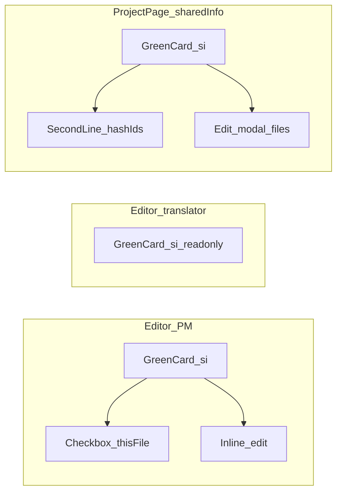

# CAT：本案／檔案特殊指示 — 共用資訊 UI 實作計畫

> 狀態：**規劃文件**（共用資訊區視覺與互動尚未依本檔全面改寫）。  
> 資料欄位、批次候選池與雲端遷移見 [CAT_AI_FILE_SPECIAL_VS_PROJECT_INSTRUCTIONS_PLAN.md](./CAT_AI_FILE_SPECIAL_VS_PROJECT_INSTRUCTIONS_PLAN.md)。

---

## 1. 與現有計畫的關係

- **`specialInstructions`**（本機／`special_instructions` 雲端）＝**檔案特殊指示**；**`projectAiInstructions`**＝**專案 AI 指示**（僅 AI 批次設定）。
- 本檔僅規範**共用資訊**分頁：`loadSharedInfoAiPanel` → `renderSpecialInstructions`、相關 HTML／CSS、以及專案頁專用編輯 Modal。

---

## 2. 視覺對齊（綠卡＋同款按鈕）

- 條目外觀對齊「翻譯準則／文風／專案準則」**已選列**：優先使用 **`ai-selected-guideline-item`**，必要時加 **`ai-pg-shared-card`**；右側操作使用 **`ai-pg-shared-actions`** 內 **`secondary-btn btn-sm`「編輯」** 與**刪除**（與 [`cat-tool/app.js`](../cat-tool/app.js) `renderSelectedGuidelines` 之 `renderRow`、約 28021–28035 行；專案準則約 28416 行起）。
- 避免 `renderSpecialInstructions`（約 28199–28258 行）繼續以裸 **`guideline-item`** 為主體造成風格斷裂。
- 樣式優先**復用** [`.ai-selected-guideline-item`](../cat-tool/style.css)（約 3364–3374 行）；若需微調可新增極小修飾 class（例如 `.ai-si-shared-card`），勿複製整段色碼。

---

## 3. 專案頁 vs 編輯器（行為矩陣）

| 項目 | 專案頁（標題「檔案特殊指示」） | 編輯器內（標題「本案特殊指示」） |
|------|--------------------------------|----------------------------------|
| 條目外框 | 綠卡（同上） | 綠卡（同上） |
| **譯者（非 PM）** | **唯讀**：只顯示適用於專案規則下可見的條目與 `#` 序號；**無**勾選框、**無**編輯／刪除 | **唯讀**：只顯示已套用於**目前檔**的條目與內文；**無**勾選框、**無**編輯／刪除 |
| 列首「啟用」勾選（僅 PM） | **有**（列表上逐條啟用，與現行 `ai-si-checkbox` 一致） | **有**：**本檔套用**勾選（`si-applies-local`／`_setFileHasInstructionId`） |
| 適用檔案顯示（PM／譯者） | **第二行**：`#1、#2…`（譯者唯讀；PM 在專案頁可逐檔勾選，見現行 `si-applies-file`） | **不顯示**（譯者與 PM 皆不在此列檔號；PM 用本檔勾選） |
| `#` 與檔名 | 序號可 hover：**無延遲**工具提示顯示**完整檔名**（見第 5 節） | — |
| 按「編輯」（僅 PM） | 開**專屬 Modal**（規劃中）：內文＋完整檔案清單多選（Shift／Ctrl 見第 4 節）；**落地前**可沿用卡片內編輯 | **不開 Modal**：PM 在**卡片上**編輯內文（`textarea` 須 **`form-input`**） |
| 內文共用 | 同一 `specialInstructions` 列 id 多檔共用：**任一處改內文，全專案同步** | 同上 |

---

## 4. 專案頁：編輯 Modal

- **觸發**：僅 **PM 以上**（`isCatSharedMutator()`）可開啟；譯者僅唯讀或隱藏編輯（與現有共用資訊權限一致）。
- **結構**：新建 overlay（建議靜態骨架於 [`cat-tool/index.html`](../cat-tool/index.html)，風格對齊既有確認／精靈 Modal）。
- **內容**：**內文**欄位；可捲動**檔案表**（序號、檔名、勾選＝該檔是否納入此指示 id）。
- **寫入**：更新各檔 `applicableSpecialInstructionIds`（可沿用 `_setFileHasInstructionId` 逐檔或批次 `DBService.updateFile`）；內文變更走 `saveAiProjectSettings` 之 `specialInstructions` patch。
- **Shift／Ctrl**：勾選列需支援範圍／不連續多選慣例；實作時對照 [`cat-tool/app.js`](../cat-tool/app.js) 既有 checkbox 行為（例如約 5755 行附近 `shiftKey`）；必要時抽出共用 helper。

---

## 5. 工具提示（`#` 序號 → 檔名）

- 使用全域 **[CAT_TOOLTIP_SYSTEM.md](./CAT_TOOLTIP_SYSTEM.md)**：`data-tip` 由 `initGlobalTooltip` 顯示**無延遲**提示。
- 每個 `#x` 元素設 `data-tip` 為該檔**完整檔名**（注意轉義與過長字串）。
- 若產品要求**黑色**底提示：需擴充 tooltip（例如 `data-tip-theme="dark"`）並在 [`cat-tool/style.css`](../cat-tool/style.css) 與 `initGlobalTooltip` 分支樣式，避免與預設外觀衝突。

---

## 6. 權限（已定案）

- **譯者**：僅**檢視**對自己可見的有效指示；**不**顯示任何勾選框（含「啟用」「本檔套用」）、**不**顯示編輯／刪除；**不可**改內文或套用關係。
- **PM 以上**（`isCatSharedMutator()`／`isPm`）：專案頁與編輯器內維持列表編輯、檔案套用勾選、新增指示（`pm-only-ui` 按鈕）等既有能力；詳見第 3 節矩陣「僅 PM」列。

---

## 7. 程式觸點（實作勾選用）

- [`cat-tool/app.js`](../cat-tool/app.js)：`renderSpecialInstructions`、`bindSiListHandlers`、新增列（約 28526 行起）、`_refreshSharedInfoUi`、Modal 開關與存檔。
- [`cat-tool/index.html`](../cat-tool/index.html)：檔案特殊指示編輯 Modal 骨架（若採靜態 HTML）。
- [`cat-tool/style.css`](../cat-tool/style.css)：僅必要 class。
- 變更 Vanilla CAT 後執行 **`npm run sync:cat`**，一併提交 [`public/cat/`](../public/cat/)。

---

## 8. 驗收清單（白話）

1. 專案頁與編輯器條目皆為**綠卡**，編輯／刪除位置與翻譯準則區一致。
2. 專案頁：第二行為 `#` 序號；滑鼠移上序號即時顯示**完整檔名**。
3. 專案頁：編輯開 Modal，可改內文並多選檔案，Shift／Ctrl 行為正確。
4. 編輯器：譯者**不**顯示勾選框與編輯／刪除，僅內文；PM 有本檔勾選與編輯／刪除（見第 3 節）。

---

## 9. 流程示意

---

## 10. 不在本檔第一次落地範圍

- AI 批次候選池版面（已與資料分欄落地）；除非需與「本案特殊指示」文案做視覺對齊再開小變更。
