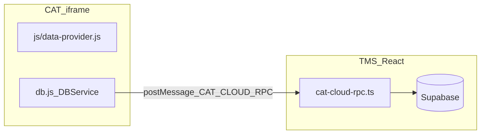

# CAT：準則、專案準則與團隊版 AI 資料 — 變更與修正紀錄

> 本文件記錄 **2026-04** 前後與「準則庫／共用資訊／專案準則／團隊版雲端 AI」相關的設計、實作與踩坑，供維運與後續迭代對照。  
> 與分階段重建總覽的關係：見 [CAT-phased-rebuild-audit.md](./CAT-phased-rebuild-audit.md)（較偏進度稽核）；**本文件**偏 **行為、資料表、部署與 AI 組字**。

---

## 1. 團隊版：AI 準則／標籤／設定的權威在雲端

### 1.1 行為摘要

- **個人離線版**（`/cat/offline`）：AI 相關資料在 **IndexedDB**（`LocalCatDB`），與既有 Dexie 路徑一致。
- **團隊線上版**（`/cat/team`）：`DBService` 的 AI 方法（準則、分類標籤、全域設定、專案設定、學習範例等）改走 **父頁 `postMessage` → `handleCatCloudRpc` → Supabase**；本機 `LocalCatTeamDB` 的 AI 表**不作為**團隊日常讀寫來源。

### 1.2 Supabase 資料表（`public`）

| 表名 | 用途（簡述） |
|------|----------------|
| `cat_ai_guidelines` | 準則條目（翻譯／文風、互斥群組、預設旗標等） |
| `cat_ai_category_tags` | 準則「類別」標籤（含預設「通用」） |
| `cat_ai_settings` | 全站 AI 連線／模型／prompt 等（單列 `id = 1`） |
| `cat_ai_project_settings` | 每專案：已選準則 ID、文風 ID、`special_instructions`、`project_guidelines`（見第 5 節）、更新時間等 |
| `cat_ai_style_examples` | AI 學習範例 |

**Migrations（起點與擴充）**

- [`supabase/migrations/20260426143000_cat_ai_cloud.sql`](../supabase/migrations/20260426143000_cat_ai_cloud.sql) — 建立上述核心表與 RLS。
- [`supabase/migrations/20260426220000_cat_ai_project_guidelines.sql`](../supabase/migrations/20260426220000_cat_ai_project_guidelines.sql) — 為 `cat_ai_project_settings` 新增 **`project_guidelines`**（JSONB，預設 `[]`）。
- [`supabase/migrations/20260427153000_cat_ai_category_tags_list_hidden.sql`](../supabase/migrations/20260427153000_cat_ai_category_tags_list_hidden.sql) — `cat_ai_category_tags` 新增 **`list_hidden`**（軟隱藏自清單，見第 9 節）。

### 1.3 程式對照

| 層 | 檔案 | 說明 |
|----|------|------|
| TMS RPC | [`src/lib/cat-cloud-rpc.ts`](../src/lib/cat-cloud-rpc.ts) | `db.getAiGuidelines`、`db.saveAiProjectSettings`、`mapAiProjectSettingsRow`（含 `project_guidelines` ↔ `projectGuidelines`）等 |
| CAT 團隊綁定 | [`cat-tool/db.js`](../cat-tool/db.js) | `enableTeamCloudProvider`：團隊模式將 AI 相關 `DBService.*` 改為 `rpc(...)` |
| CAT 殼 | [`src/pages/CatToolPage.tsx`](../src/pages/CatToolPage.tsx) | iframe、`postMessage` 身分與團隊指派；**不再**觸發已移除的一次性遷移（見第 2 節） |
| 靜態輸出 | `public/cat/*` | **`npm run sync:cat`** 自 `cat-tool/` 覆寫；勿只改 `public/cat` |

### 1.4 團隊版資料流（簡圖）

---

## 2. 已移除：本機快照整批覆寫雲端（`replaceAiDataset`）

### 2.1 背景與風險（白話）

曾有一次性「把本機 AI 快照 **整批 replace** 寫回雲端」的設計，但團隊版日常準則**並未**寫入本機 Dexie 的 `aiGuidelines`（寫的是雲端），遷移若讀 Dexie 常得到**空集合**，卻仍執行「先刪雲端再寫入」，會造成 **雲端準則被清空**。因此該路徑已全面停用。

### 2.2 程式現況

- [`cat-tool/app.js`](../cat-tool/app.js)：已刪 `migrateLocalAiToCloudOnce`、`TMS_TRIGGER_AI_CLOUD_MIGRATION` 處理。
- [`src/pages/CatToolPage.tsx`](../src/pages/CatToolPage.tsx)：iframe `onLoad` **不再** `postMessage` 觸發遷移。
- [`src/lib/cat-cloud-rpc.ts`](../src/lib/cat-cloud-rpc.ts)：`db.replaceAiDataset` 改為 **直接丟錯**（明確停用），避免誤呼叫。

---

## 3. 準則管理（UI／操作）

### 3.1 載入失敗提示

若雲端表未建立或 RPC 失敗，`loadAiGuidelinesView` 可能無法綁定「新增」按鈕。已在進入準則管理時 **`.catch` + `alert`** 提示錯誤，避免靜默無反應（見 `cat-tool/app.js` 內 `loadAiGuidelinesView` 呼叫處）。

### 3.2 加入互斥群組：改為頁內 Modal

- **先前**：`window.prompt` 輸入群組名（瀏覽器原生對話框）。
- **現在**：[`cat-tool/index.html`](../cat-tool/index.html) `#agMutexJoinModal` — **單選**既有群組或「建立新群組…」並可輸入新名稱；邏輯在 [`cat-tool/app.js`](../cat-tool/app.js) `openAgMutexJoinChoiceModal`。

### 3.3 編輯準則條目、脫離互斥、通用確認（摘要）

- **編輯條目（庫內）**：`#agEditGuidelineModal`（內容、標籤、性質、互斥群組、預設條目），見 `cat-tool/index.html`／`app.js` `openAgEditGuidelineModal`。  
- **編輯條目（專案準則）**：`#pgEditProjectGuidelineModal`（內容、標籤；無性質／互斥／預設），見 `openPgEditProjectGuidelineModal`。  
- **脫離互斥**：`#agLeaveMutexConfirmModal`，文案 **「是否確定要讓此條目脫離互斥群組？」**；無單獨「確認」標題列（見 **§9.4**）。  
- **全 CAT 共用**：`#catGenericConfirmModal`、`#catGenericPromptModal` 與 `openCatConfirmModal`／`openCatPromptModal`（詳見 **第 9 節**、**§9.4**）。

---

## 4. 共用資訊：文案調整

「庫內翻譯準則／庫內文風偏好」改為 **「翻譯準則／文風偏好」**（專案頁與編輯器側欄「共用資訊」、準則管理頁標題）。  
僅改 [`cat-tool/index.html`](../cat-tool/index.html)；發布前請 **`npm run sync:cat`**。

---

## 5. 專案準則（全專案檔案套用）

### 5.1 產品定義

- **位置**：專案詳情「共用資訊」與編輯器「共用資訊」**右欄**，在「本案／檔案特殊指示」**上方**。
- **行為**：與「特殊指示」類似可新增／編輯／刪除／啟用（PM／主管），但 **不需** 勾選適用檔案；儲存後 **同一專案內所有檔案** 的 AI 流程都會帶入（見 5.5）。

### 5.2 資料

- 欄位：`cat_ai_project_settings.project_guidelines`（JSONB 陣列）。
- 元素建議欄位：`id`、`content`、`enabled`、`createdAt`（與 `special_instructions` 條目風格一致，語意為「專案層文字準則」）。**未來**可再納入與 **議題群組** 之關聯（欄名與 JSON 形狀待該功能實作時定稿；產品邊界見 **§5.4**）。

### 5.3 程式

| 項目 | 位置 |
|------|------|
| UI 區塊 | `cat-tool/index.html`（`aiProjectGuidelinesList`、`btnManageAiProjectGuideline` 與 Project 後綴版；**管理**為 `#pgManageProjectGuidelinesModal`；**單筆編輯**為 `#pgEditProjectGuidelineModal`） |
| 列表／儲存 | `cat-tool/app.js` — `loadSharedInfoAiPanel`、`renderProjectGuidelines`、`openPgEditProjectGuidelineModal`、`savePSettings` |
| 雲端 RPC | `src/lib/cat-cloud-rpc.ts` — `mapAiProjectSettingsRow`、`db.saveAiProjectSettings` 合併 `project_guidelines` |
| 離線合併 | `cat-tool/db.js` — `saveAiProjectSettings` **合併** patch，避免只更新準則 ID 時清空 `projectGuidelines` |

### 5.4 階段 1：專案準則編輯介面—欄位範圍（產品定稿）

階段 1 目標為：專案準則之**新增／編輯**改為與**準則管理**相近的**頁內大表單／modal 體驗**（見 [`cat-tool/index.html`](../cat-tool/index.html) 庫內條目 `#agEditGuidelineModal` 之版型參考），但**欄位範圍與庫內準則刻意不同**，如下。

**應包含（編輯單一專案準則條目時）**

- **內文**（對應儲存欄位仍為 `content` 等既有元素欄位）。
- **標籤**（與庫內準則條目之「類別／標籤」語意一致：文字類型標籤，供篩選與 AI 行為一致）。
- **議題群組**：全站 **議題群組** 功能**目前尚未實作**；實作完成後，專案準則條目**必須**一併支援選擇／顯示所屬議題群組，並寫入 `project_guidelines`（或關聯欄位，細節於該功能之 migration／RPC 章節另述）。本節先作**文件層承諾**，不要求立即改 DB。

**不包含（專案準則編輯介面不顯示、不提供）**

- **性質**（翻譯準則 vs 文風偏好）：條目語意已固定為「**專案準則**」，無需再選 scope。
- **互斥群組**：庫內互斥為**跨專案共用準則庫**語意；專案準則已限定為**本專案**，不沿用互斥群組模型。
- **預設條目**：套用範圍已為**全專案內所有檔案**，無「庫內多條擇一為預設」之需求。
- **檔案勾選／適用檔案**：已確立為**全專案共用**，不提供「僅適用部分檔案」之勾選。

**與庫內準則編輯（`#agEditGuidelineModal`）對照**

| 項目 | 庫內準則 | 專案準則（階段 1 規格） |
|------|----------|-------------------------|
| 內文／內容 | 有 | 有 |
| 標籤（類別） | 有 | 有 |
| 性質（翻譯／文風） | 有 | **無**（固定為專案準則） |
| 互斥群組 | 有 | **無** |
| 預設條目 | 有 | **無** |
| 議題群組 | 尚未於庫內條目實作（全站功能另開） | **預留；完成後必納入** |

### 5.5 AI 組字（固定標題「專案準則」）

- [`cat-tool/app.js`](../cat-tool/app.js) `_buildAiOptions`：除 `batchNote`（本批輸入 + **檔案已套用**的特殊指示內文）外，另組 **`projectGuidelinesNote`**（僅多條內文，**不含**標題字串）。
- [`cat-tool/js/ai-translate.js`](../cat-tool/js/ai-translate.js) `buildPrompt`：在 **「【本批次特殊指示】」** 區塊**之前**，插入獨立一段：第一行固定 **`專案準則`**，換行後為各條內文（多條以空行分隔）。
- **掃描全文**：`cat-tool/app.js` `_runAiScan` 將 `projectGuidelinesNote` 傳入 `scanFullText`，於 system 中同樣以「專案準則」標題區塊呈現。

---

## 6. 部署與維運

1. **新環境或新 Supabase 專案**：須套用含 **`cat_ai_*`**、**`project_guidelines`** 與 **`cat_ai_category_tags.list_hidden`** 的 migrations（見第 1.2 節檔名）。未套用時，PostgREST 可能回類似 **「Could not find the table … in the schema cache」** 或請求失敗。
2. **Vercel／TMS**：部署後若 CAT 團隊版讀不到表，優先確認 **連到的 Supabase 專案** 是否已 `db push` / 執行 migration。
3. 與上線檢查清單的關係：仍請搭配 [`DEPLOYMENT_CHECKLIST.md`](./DEPLOYMENT_CHECKLIST.md)；**CAT AI 表與欄位**以本文件第 1–2、5–6 節為準。

---

## 7. 後續／待辦（維護預留）

以下為**尚未全面完成**、但與準則／操作體驗相關的後續方向，實作時可刪改本列表。

1. **`alert` 等非確認類提示**：`cat-tool/app.js` 仍有不少 **`alert`**（驗證失敗、載入失敗、匯入結果等）；若需與頁內 modal 完全統一，可再改為 toast 或非阻斷式訊息（與第 9 節「短期」已完成的 `confirm`／`prompt` 分開處理）。
2. **TMS 主站**：[`src/components/settings/ToolbarButtonStyleSection.tsx`](../src/components/settings/ToolbarButtonStyleSection.tsx) 仍使用瀏覽器 **`confirm`**（文案已與「是否確定要…？」一致）；若全站要改為 React 對話元件，可另開任務。
3. **稽核與舊 plan 對齊**：若需對照「分階段重建」與本檔差異，見 [CAT-phased-rebuild-audit.md](./CAT-phased-rebuild-audit.md)。

---

## 9. 短期計畫與執行狀況（頁內對話框／標籤軟隱藏／文案）

### 9.1 計畫摘要（2026-04-27）

| 項目 | 說明 |
|------|------|
| 頁內化 | `cat-tool` 內多數 **`confirm`／`prompt`** 改為 **`#catGenericConfirmModal`／`#catGenericPromptModal`**（`openCatConfirmModal`／`openCatPromptModal`，見 `cat-tool/app.js` 檔首與 `cat-tool/index.html`）。**特例**：版面無法用「標題＋內文＋確定／取消」表達者（例如 `#agMutexJoinModal`、準則編輯 `#agEditGuidelineModal`）維持專用 modal。 |
| 確認框標題 | 通用 **`#catGenericConfirmModal`** 預設**不顯示**僅「確認」二字之標題列（見 **§9.4**）；脫離互斥 **`#agLeaveMutexConfirmModal`** 亦無冗餘標題。少數流程若需標題可傳 `openCatConfirmModal(..., { title: '…' })`。 |
| 確認文案 | 破壞性操作之確認句統一為 **「是否確定要……？」**（含專案／檔案／TM／TB／句段／筆記／準則條目／學習範例／常用篩選組合等）。TMS **工具列按鈕樣式**頁之 `confirm` 文案一併統一。 |
| 類別標籤 | `cat_ai_category_tags.list_hidden`：**僅自清單隱藏**時列保留、`list_hidden = true`；AI 管理清單中該列 **反灰**，「更名」改為 **「復原」**；「刪除」在已隱藏列上代表 **從參考徹底移除並刪列**（見 9.2）。離線 **Dexie v18**；團隊 **`db.restoreAiCategoryTag`**／`db.deleteAiCategoryTag`／`db.addAiCategoryTag`（撞隱藏同名則復原）見 `cat-tool/db.js`、`src/lib/cat-cloud-rpc.ts`。 |
| 準則管理（先前已做） | 編輯條目頁內 modal、脫離互斥 **`#agLeaveMutexConfirmModal`**、卡片「預設條目」文案等（見第 3 節與程式註解）。 |

### 9.2 類別標籤：兩種操作差異（白話）

- **從參考一併移除並刪除標籤列**：會掃 **準則條目** 與 **AI 學習範例** 的類別欄位，把該標籤名稱拿掉（必要時後備為「通用」等），並 **刪除** `cat_ai_category_tags` 該列。  
- **僅自清單隱藏**：**不**改條目與範例內已存的類別字串；只把該標籤列標成 **`list_hidden`**。清單上 **反灰**，新增準則時的類別多選 **不列出**該名稱，可按 **「復原」** 立刻恢復為一般標籤。

### 9.3 執行狀況（勾選）

- [x] Supabase migration `list_hidden`  
- [x] `cat-cloud-rpc`：`mapAiCategoryTagRow`、`add`／`rename`／`delete`／`restore`；刪除且一併移除時同步 **style examples** 之 `categories`（與離線 `db.js` 行為對齊）  
- [x] `cat-tool/db.js`：Dexie v18、`deleteAiCategoryTag` 軟／硬路徑、`restoreAiCategoryTag`、團隊 RPC 轉發  
- [x] `cat-tool/index.html`：通用 confirm／prompt modal  
- [x] `cat-tool/app.js`：`confirm`／`prompt` 替換、AI 管理標籤 UI、準則篩選／新增類別多選略過 `list_hidden`  
- [x] `ToolbarButtonStyleSection.tsx`：確認文案統一  
- [x] 通用／脫離互斥確認：**不顯示**僅「確認」二字之標題列（見 **§9.4**）  
- [ ] 其餘僅 **`alert`** 之非阻斷體驗（選做，見第 7 節）  
- [ ] 部署：既有 Supabase 專案須套用 **第 1.2 節** 含 `20260427153000` 之 migration  

**驗收（手動）**：團隊版執行 migration 後，於 **AI 管理** 測標籤「僅隱藏／復原／從參考刪除」；於 **準則管理／學習範例／專案刪除** 等操作確認皆出現 **頁內** 確認框且文案為「是否確定要…？」；`npm run sync:cat` 後提交 `cat-tool` 與 `public/cat`。

### 9.4 對話框標題：不顯示「確認」

**原則**：破壞性確認以**內文**「是否確定要……？」為主，**不**顯示僅兩字「確認」之標題列（避免與按鈕「確定／取消」語意重疊、且無額外資訊）。

**實作**：

- **`openCatConfirmModal`**（`cat-tool/app.js`）：`options.title` 預設視為空；僅在非空 trimmed 字串時顯示 `#catGenericConfirmTitle`。  
- **`#catGenericConfirmModal`**（`cat-tool/index.html`）：標題 `h3` 預設 `hidden`；外層 `modal-box` 設 `role="dialog"`、`aria-modal="true"`、`aria-describedby="catGenericConfirmMsg"`。  
- **`#agLeaveMutexConfirmModal`**：移除僅「確認」之 `h3`，內文段落設 `id="agLeaveMutexConfirmMsg"` 並以 `aria-describedby` 關聯。

**例外**：若未來某流程**必須**有標題，可呼叫 `openCatConfirmModal(message, { title: '自訂標題' })`。

---

## 8. 修訂紀錄（文件本身）

| 日期（約） | 說明 |
|------------|------|
| 2026-04-26 | 初版：雲端表、移除 replace、互斥 modal、共用資訊文案、專案準則與 AI 組字、部署注意、後續待辦 |
| 2026-04-27 | 第 9 節：短期計畫（頁內 confirm／prompt、標籤 `list_hidden`、文案「是否確定要…？」）；第 1.2 節補 migration；第 3.3 節補編輯／脫離互斥／通用 modal 摘要；第 7 節更新待辦。**§9.4**：通用／脫離互斥確認不顯示標題「確認」；§9.1／§9.3 補列；§3.3 與 §9.4 互相引用 |
| 2026-04-28 | **§5.4**：階段 1 專案準則編輯介面欄位範圍（含／不含、議題群組預留、與 `#agEditGuidelineModal` 對照）；§5.2 補議題群組預留一句；原 §5.4 AI 組字改編為 **§5.5**。**§5.3**／**§3.3**：實作 `#pgEditProjectGuidelineModal`（內文、標籤、`category` JSON；議題群組 UI 預留） |
| 2026-04-29 | **§5.3**：共用資訊專案準則改綠卡列＋「管理準則」`#pgManageProjectGuidelinesModal`（啟用僅於管理列表）；準則管理互斥副標改「下列條目限選其一」、文風單條不顯示內文「預設條目」徽章 |
| 2026-04-29（補強） | **專案準則穩定性補強**：權限顯示與操作守門一致（專案頁/編輯器同規則）、新增/編輯防呆（空白/重複）、刪除/新增/編輯儲存失敗回滾與錯誤提示、並發採 **Last write wins**（最後儲存者為準）並於程式註解明示；新增精簡回歸驗收清單（見下方 §10）。 |

---

## 10. 專案準則補強：精簡回歸驗收清單

> 目標：確認「不追求同款視覺」前提下，專案準則在兩個入口（專案頁與編輯器）都穩定可維運。

- [ ] **權限一致**：以譯者帳號驗證「管理準則／編輯／刪除」均不可用；以 PM/主管驗證兩入口皆可操作。  
- [ ] **新增防呆**：空白內容不可存；與既有內容（忽略前後空白與多空白）重複時不可存。  
- [ ] **編輯防呆**：編輯成重複內容時提示錯誤，且不覆寫原資料。  
- [ ] **失敗回滾**：模擬網路/後端失敗時，新增/編輯/刪除皆會回復畫面，並顯示錯誤提示。  
- [ ] **並發規則**：兩位管理者近乎同時修改同一條時，以最後成功儲存者內容為最終結果（Last write wins）。  
- [ ] **同步檢查**：`npm run sync:cat` 後，`cat-tool/` 與 `public/cat/` 變更一致且可正常操作。
