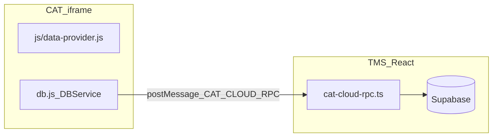

# CAT：準則、專案準則與團隊版 AI 資料 — 變更與修正紀錄

> 本文件記錄 **2026-04** 前後與「準則庫／共用資訊／專案準則／團隊版雲端 AI」相關的設計、實作與踩坑，供維運與後續迭代對照。  
> 與分階段重建總覽的關係：見 [CAT-phased-rebuild-audit.md](./CAT-phased-rebuild-audit.md)（較偏進度稽核）；**本文件**偏 **行為、資料表、部署與 AI 組字**。**議題群組**之產品與技術權威見 **§5.6**。**準則條目上的範例卡於各 AI 路徑是否併入提示語**，見 **§11.2**（分情境；批次候選池見 **§12**）。**本主題之後續波次（§7 `alert` 收斂、§13 維運與主站對話框等）** 之**建議順序**見 **§13**。

---

## 1. 團隊版：AI 準則／標籤／設定的權威在雲端

### 1.1 行為摘要

- **個人離線版**（`/cat/offline`）：AI 相關資料在 **IndexedDB**（`LocalCatDB`），與既有 Dexie 路徑一致。
- **團隊線上版**（`/cat/team`）：`DBService` 的 AI 方法（準則、分類標籤、全域設定、專案設定、學習範例等）改走 **父頁 `postMessage` → `handleCatCloudRpc` → Supabase**；本機 `LocalCatTeamDB` 的 AI 表**不作為**團隊日常讀寫來源。

### 1.2 Supabase 資料表（`public`）

| 表名 | 用途（簡述） |
|------|----------------|
| `cat_ai_guidelines` | 準則條目（翻譯／文風、互斥群組、預設旗標、**`examples` 範例卡** 等） |
| `cat_ai_category_tags` | 準則「類別」標籤（含預設「通用」） |
| `cat_ai_settings` | 全站 AI 連線／模型／prompt 等（單列 `id = 1`） |
| `cat_ai_project_settings` | 每專案：已選準則 ID、文風 ID、`special_instructions`、`project_guidelines`（見第 5 節）、更新時間等 |
| `cat_ai_style_examples` | AI 學習範例 |
| `cat_ai_issue_groups` | **議題群組**定義（依 **scope** 區分翻譯準則／文風／專案；專案 scope 時綁定 `project_id`，見 **§5.6**） |

**Migrations（起點與擴充）**

- [`supabase/migrations/20260426143000_cat_ai_cloud.sql`](../supabase/migrations/20260426143000_cat_ai_cloud.sql) — 建立上述核心表與 RLS。
- [`supabase/migrations/20260426220000_cat_ai_project_guidelines.sql`](../supabase/migrations/20260426220000_cat_ai_project_guidelines.sql) — 為 `cat_ai_project_settings` 新增 **`project_guidelines`**（JSONB，預設 `[]`）。
- [`supabase/migrations/20260427153000_cat_ai_category_tags_list_hidden.sql`](../supabase/migrations/20260427153000_cat_ai_category_tags_list_hidden.sql) — `cat_ai_category_tags` 新增 **`list_hidden`**（軟隱藏自清單，見第 9 節）。
- [`supabase/migrations/20260429203000_cat_ai_guidelines_examples.sql`](../supabase/migrations/20260429203000_cat_ai_guidelines_examples.sql) — `cat_ai_guidelines` 新增 **`examples`**（JSONB，預設 `[]`；陣列元素含 `id`、`state`（`ok` \| `bad` \| `neutral`）、`src`、`tgt`、`note`，見第 11 節）。
- [`supabase/migrations/20260502120000_cat_ai_issue_groups.sql`](../supabase/migrations/20260502120000_cat_ai_issue_groups.sql) — **`cat_ai_issue_groups`**、`cat_ai_guidelines.issue_group_id`；專案準則 JSON 元素之 **`issueGroupId`**（見 **§5.6**）。

### 1.3 程式對照

| 層 | 檔案 | 說明 |
|----|------|------|
| TMS RPC | [`src/lib/cat-cloud-rpc.ts`](../src/lib/cat-cloud-rpc.ts) | `db.getAiGuidelines`、`db.saveAiProjectSettings`、`mapAiProjectSettingsRow`（含 `project_guidelines` ↔ `projectGuidelines`）等 |
| CAT 團隊綁定 | [`cat-tool/db.js`](../cat-tool/db.js) | `enableTeamCloudProvider`：團隊模式將 AI 相關 `DBService.*` 改為 `rpc(...)` |
| CAT 殼 | [`src/pages/CatToolPage.tsx`](../src/pages/CatToolPage.tsx) | iframe、`postMessage` 身分與團隊指派；**不再**觸發已移除的一次性遷移（見第 2 節） |
| 靜態輸出 | `public/cat/*` | **`npm run sync:cat`** 自 `cat-tool/` 覆寫；勿只改 `public/cat` |

### 1.4 團隊版資料流（簡圖）

---

## 2. 已移除：本機快照整批覆寫雲端（`replaceAiDataset`）

### 2.1 背景與風險（白話）

曾有一次性「把本機 AI 快照 **整批 replace** 寫回雲端」的設計，但團隊版日常準則**並未**寫入本機 Dexie 的 `aiGuidelines`（寫的是雲端），遷移若讀 Dexie 常得到**空集合**，卻仍執行「先刪雲端再寫入」，會造成 **雲端準則被清空**。因此該路徑已全面停用。

### 2.2 程式現況

- [`cat-tool/app.js`](../cat-tool/app.js)：已刪 `migrateLocalAiToCloudOnce`、`TMS_TRIGGER_AI_CLOUD_MIGRATION` 處理。
- [`src/pages/CatToolPage.tsx`](../src/pages/CatToolPage.tsx)：iframe `onLoad` **不再** `postMessage` 觸發遷移。
- [`src/lib/cat-cloud-rpc.ts`](../src/lib/cat-cloud-rpc.ts)：`db.replaceAiDataset` 改為 **直接丟錯**（明確停用），避免誤呼叫。

---

## 3. 準則管理（UI／操作）

### 3.1 載入失敗提示

若雲端表未建立或 RPC 失敗，`loadAiGuidelinesView` 可能無法綁定「新增」按鈕。已在進入準則管理時 **`.catch` + `alert`** 提示錯誤，避免靜默無反應（見 `cat-tool/app.js` 內 `loadAiGuidelinesView` 呼叫處）。

### 3.2 加入互斥群組：改為頁內 Modal

- **先前**：`window.prompt` 輸入群組名（瀏覽器原生對話框）。
- **現在**：[`cat-tool/index.html`](../cat-tool/index.html) `#agMutexJoinModal` — **單選**既有群組或「建立新群組…」並可輸入新名稱；邏輯在 [`cat-tool/app.js`](../cat-tool/app.js) `openAgMutexJoinChoiceModal`。

### 3.3 編輯準則條目、脫離互斥、通用確認（摘要）

- **編輯條目（庫內）**：`#agEditGuidelineModal`（內容、標籤、性質、互斥群組、預設條目），見 `cat-tool/index.html`／`app.js` `openAgEditGuidelineModal`。  
- **編輯條目（專案準則）**：`#pgEditProjectGuidelineModal`（內容、標籤；無性質／互斥／預設），見 `openPgEditProjectGuidelineModal`。  
- **脫離互斥**：`#agLeaveMutexConfirmModal`，文案 **「是否確定要讓此條目脫離互斥群組？」**；無單獨「確認」標題列（見 **§9.4**）。  
- **全 CAT 共用**：`#catGenericConfirmModal`、`#catGenericPromptModal` 與 `openCatConfirmModal`／`openCatPromptModal`（詳見 **第 9 節**、**§9.4**）。

---

## 4. 共用資訊：文案調整

「庫內翻譯準則／庫內文風偏好」改為 **「翻譯準則／文風偏好」**（專案頁與編輯器側欄「共用資訊」、準則管理頁標題）。  
僅改 [`cat-tool/index.html`](../cat-tool/index.html)；發布前請 **`npm run sync:cat`**。

---

## 5. 專案準則（全專案檔案套用）

### 5.1 產品定義

- **位置**：專案詳情「共用資訊」與編輯器「共用資訊」**右欄**，在「本案／檔案特殊指示」**上方**。
- **行為**：與「特殊指示」類似可新增／編輯／刪除／啟用（PM／主管），但 **不需** 勾選適用檔案；儲存後 **同一專案內所有檔案** 的 AI 流程都會帶入（見 5.5）。

### 5.2 資料

- 欄位：`cat_ai_project_settings.project_guidelines`（JSONB 陣列）。
- 元素欄位：`id`、`content`、`enabled`、`createdAt`（與 `special_instructions` 條目風格一致），以及 **`issueGroupId`**（可選，UUID 字串，指向該專案 scope 之 `cat_ai_issue_groups`；見 **§5.6**）。

### 5.3 程式

| 項目 | 位置 |
|------|------|
| UI 區塊 | `cat-tool/index.html`（`aiProjectGuidelinesList`、`btnManageAiProjectGuideline` 與 Project 後綴版；**管理**為 `#pgManageProjectGuidelinesModal`；**單筆編輯**為 `#pgEditProjectGuidelineModal`） |
| 列表／儲存 | `cat-tool/app.js` — `loadSharedInfoAiPanel`、`renderProjectGuidelines`、`openPgEditProjectGuidelineModal`、`savePSettings` |
| 雲端 RPC | `src/lib/cat-cloud-rpc.ts` — `mapAiProjectSettingsRow`、`db.saveAiProjectSettings` 合併 `project_guidelines` |
| 離線合併 | `cat-tool/db.js` — `saveAiProjectSettings` **合併** patch，避免只更新準則 ID 時清空 `projectGuidelines` |

### 5.4 階段 1：專案準則編輯介面—欄位範圍（產品定稿）

階段 1 目標為：專案準則之**新增／編輯**改為與**準則管理**相近的**頁內大表單／modal 體驗**（見 [`cat-tool/index.html`](../cat-tool/index.html) 庫內條目 `#agEditGuidelineModal` 之版型參考），但**欄位範圍與庫內準則刻意不同**，如下。

**應包含（編輯單一專案準則條目時）**

- **內文**（對應儲存欄位仍為 `content` 等既有元素欄位）。
- **標籤**（與庫內準則條目之「類別／標籤」語意一致：文字類型標籤，供篩選與 AI 行為一致）。
- **議題群組**：規格與資料形狀見 **§5.6**；實作後於編輯 modal 選擇／顯示，並寫入 `project_guidelines` 元素之 **`issueGroupId`**（migration 見 **§1.2** `20260502120000`）。

**不包含（專案準則編輯介面不顯示、不提供）**

- **性質**（翻譯準則 vs 文風偏好）：條目語意已固定為「**專案準則**」，無需再選 scope。
- **互斥群組**：庫內互斥為**跨專案共用準則庫**語意；專案準則已限定為**本專案**，不沿用互斥群組模型。
- **預設條目**：套用範圍已為**全專案內所有檔案**，無「庫內多條擇一為預設」之需求。
- **檔案勾選／適用檔案**：已確立為**全專案共用**，不提供「僅適用部分檔案」之勾選。

**與庫內準則編輯（`#agEditGuidelineModal`）對照**

| 項目 | 庫內準則 | 專案準則（階段 1 規格） |
|------|----------|-------------------------|
| 內文／內容 | 有 | 有 |
| 標籤（類別） | 有 | 有 |
| 性質（翻譯／文風） | 有 | **無**（固定為專案準則） |
| 互斥群組 | 有 | **無** |
| 預設條目 | 有 | **無** |
| 議題群組 | 規格／實作見 **§5.6**（庫內與專案準則皆支援） | 與互斥群組並存但語意不同 |

### 5.5 AI 組字（固定標題「專案準則」）

- [`cat-tool/app.js`](../cat-tool/app.js) `_buildAiOptions`：除 `batchNote`（本批輸入 + **檔案已套用**的特殊指示內文）外，另組 **`projectGuidelinesNote`**（僅多條內文，**不含**標題字串）。
- [`cat-tool/js/ai-translate.js`](../cat-tool/js/ai-translate.js) `buildPrompt`：在 **「【本批次特殊指示】」** 區塊**之前**，插入獨立一段：第一行固定 **`專案準則`**，換行後為各條內文（多條以空行分隔）。
- **掃描全文**：`cat-tool/app.js` `_runAiScan` 將 `projectGuidelinesNote` 傳入 `scanFullText`，於 system 中同樣以「專案準則」標題區塊呈現。

### 5.6 議題群組（產品規格與技術對照）

本節為 **階段 B** 之權威規格；與 **互斥群組** 並存為另一套機制（專案準則列仍 **不包含**互斥群組欄位，見 **§5.4**「不包含」列）。

#### 5.6.1 範圍與語意

- 可為 **庫內翻譯準則**、**庫內文風偏好**、**專案準則**條目各自指定 **議題群組**（類似互斥群組之「把條目歸類」），但 **不得跨類型共用**同一筆議題群組定義（命名空間依 **scope** 區分：`translation`／`style`／`project`，其中 `project` 綁定 **`project_id`**）。
- 與互斥不同：**議題群組**為閱讀／整理用；**所有人皆可見**列表與群組卡片（互斥仍維持「擇一」語意）。
- 每條目 **最多一個**議題群組，或 **無群組**。

#### 5.6.2 權限

- **群組定義**（新增／更名／刪除議題群組名稱）：**僅 PM 以上**（與既有 `_isCatPmOrExecutive()`／共用資訊可編輯者一致）。
- **選群組**：編輯條目時指定／變更／移除所屬議題群組；與群組定義 CRUD **同為 PM 以上**（譯者不得變更條目所屬議題群組）。

#### 5.6.3 資料概要

- **庫內**：`cat_ai_guidelines.issue_group_id` → `cat_ai_issue_groups`（`scope` 須與該列 `scope` 一致）。
- **專案準則**：`project_guidelines[]` 元素之 **`issueGroupId`**（UUID 字串，可缺省）；對應 `cat_ai_issue_groups` 中 **`scope = 'project'`** 且 **`project_id`** 為該專案之列。
- **刪除議題群組定義**：該群引用之條目／JSON 元素 **清空** `issue_group_id`／`issueGroupId`；若已無任何引用則 **自動刪除**該群組列。

#### 5.6.4 管理介面：雙視圖與 Session

- **互斥群組視圖**與 **議題群組視圖**兩種列表呈現，以 **開關**切換；狀態 **僅 Session**（例如 `sessionStorage`，不寫入使用者設定檔）；**預設為互斥群組視圖**。
- 在當前視圖下，另一套群組屬性以 **與該類卡片同色系的標籤**呈現（互斥視圖下顯示議題名；議題視圖下顯示互斥群組名）。

#### 5.6.5 列表排序與「僅一條」規則

- **無群組**之條目在 **兩種視圖**中皆排在 **有群組之條目之後**（同一欄／同一列表）。
- **「群內僅一條不顯示議題卡」** 僅適用於 **專案頁／編輯器** 向 **案件參與者** 展示之專案準則列表（一般成員視圖）：僅一條時 **不以議題卡片包裝**，避免冗餘。
- **準則管理**與 **專案準則管理介面**（含 `#pgManageProjectGuidelinesModal` 等）：在議題群組視圖下 **仍顯示**該議題群組卡片（**即使群內僅一條**），供維運辨識。

#### 5.6.6 視覺

- 議題群組卡片 **標題僅顯示群組名稱**（例如「空格規則」），**不加**「議題：」等前綴。
- **色票**（與互斥群組區隔）：以預覽稿提供多版本比對後定稿；文件不定死色碼。

#### 5.6.7 AI 組字（寫入 prompt）

- 議題群組名稱 **寫入**翻譯／掃描所用之 system 片段：於 [`cat-tool/js/ai-translate.js`](../cat-tool/js/ai-translate.js) `buildPrompt`、`scanFullText` 路徑中，對已套用之庫內準則／文風／專案準則條目，在條目前綴 **〔群組名〕**（僅當該條目有議題群組時）。
- 與 **§5.5**「專案準則」區塊並存：專案準則仍可有獨立「專案準則」標題區塊；議題前綴標示語意為 **分類**，不改互斥或預設條目邏輯。

#### 5.6.8 離線／團隊

- **團隊**：[`src/lib/cat-cloud-rpc.ts`](../src/lib/cat-cloud-rpc.ts) 讀寫時帶入 `issue_group_id`／`issueGroupId`；`saveAiProjectSettings` 合併 patch 時 **不得**覆寫清空未傳入之 `project_guidelines` 子欄。
- **離線**：[`cat-tool/db.js`](../cat-tool/db.js) Dexie 升級、`aiGuidelines` 與本地議題群組快取；舊資料預設無群組。

#### 5.6.9 本波次收斂（2026-04-28 晚間）

本段補記「規格已落地後」的收斂修正，避免後續只看 §5.6 規格卻不知實際踩坑與最終行為。

- **準則管理頁切換**：`列表依` 由下拉改為二態開關（互斥／議題），並維持 Session 記憶。
- **互斥／議題操作分流**：加入群組、脫離群組、modal 文案與事件綁定改為兩條路徑，避免誤觸互斥邏輯。
- **排序一致性**：互斥視圖與議題視圖皆強制「有群組在前、無群組在後」。
- **專案頁／編輯器管理介面（選擇準則／文風）**：
  - 勾選語意僅代表「是否套用到本專案」，不再混入庫內「預設條目」控制。
  - 議題群組採「整張卡片一個勾選框」，同群條目全進全出；不做群內逐條勾選。
- **共用資訊欄（準則／文風）**：改為依議題群組卡片聚合顯示（不再僅以標籤散列）。
- **新增條目工具列**：議題群組下拉補 `+ 新增群組` 入口，並在建立後即時回填與選取。
- **空群組回收**：條目脫離／刪除後，若群組無任何引用，於本機與團隊 RPC 路徑皆自動清理空群組。
- **429 保護**：翻譯呼叫加入 retry（exponential backoff + jitter）；`insufficient_quota` 不重試。
- **例行維運（migration 對照）**：以 `npm run verify:supabase-migrations` 確認 **Local／Remote** 版本一致且含 **`20260502120000`**（議題群組）等；linked 專案若一致即代表環境與規格 **§1.2** 對齊，無需另改程式。

---

## 6. 部署與維運

1. **新環境或新 Supabase 專案**：須套用含 **`cat_ai_*`**、**`project_guidelines`**、**`cat_ai_guidelines.examples`**（`20260429203000`）、**議題群組**（`20260502120000`，見 **§5.6**）與 **`cat_ai_category_tags.list_hidden`** 的 migrations（見第 1.2 節檔名）。未套用時，PostgREST 可能回類似 **「Could not find the table … in the schema cache」** 或請求失敗。
2. **Vercel／TMS**：部署後若 CAT 團隊版讀不到表，優先確認 **連到的 Supabase 專案** 是否已 `db push` / 執行 migration。
3. 與上線檢查清單的關係：仍請搭配 [`DEPLOYMENT_CHECKLIST.md`](./DEPLOYMENT_CHECKLIST.md)；**CAT AI 表與欄位**以本文件第 1–2、5–6 節為準。
4. **本波次額外驗證（議題群組）**：
   - 驗證「選擇準則／選擇文風」modal 能正常開啟（避免初始化錯誤造成按鈕無反應）。
   - 驗證共用資訊欄與管理介面的議題群組顯示一致（卡片聚合 vs. 套用勾選語意）。
   - 驗證新增條目之議題群組下拉可即時更新，且含 `+ 新增群組`。
   - 驗證整卡勾選後 `selected*Ids` 型別一致（number-only）：重整後仍能完整顯示整張議題卡，避免「只剩第一筆」。
5. **429/速率過快**：現況見 **§12.2**（`Retry-After`、批次 cooldown、互斥、降載）；**可恢復重跑**（同檔同設定接續批次）見 **§12.2**。
6. **Migration 線上對照（例行）**：於開發機執行 `npm run verify:supabase-migrations`，確認 Local 與 Remote 一致；與 **§5.6.9**「例行維運」互補。

---

## 7. 後續／待辦（維護預留）

以下為**尚未全面完成**、但與準則／操作體驗相關的後續方向，實作時可刪改本列表。

1. **`alert` 等非確認類提示（剩餘項）**：專案準則管理視窗的新增驗證已改為頁內錯誤訊息（不再使用瀏覽器 `alert`）；其餘模組在 `cat-tool/app.js` 仍有不少 **`alert`**（載入失敗、匯入結果等），若需全站一致可再逐步改為 toast 或非阻斷式訊息（與第 9 節已完成的 `confirm`／`prompt` 分開處理）。
2. **TMS 主站**：[`src/components/settings/ToolbarButtonStyleSection.tsx`](../src/components/settings/ToolbarButtonStyleSection.tsx) 仍使用瀏覽器 **`confirm`**（文案已與「是否確定要…？」一致）；若全站要改為 React 對話元件，可另開任務。
3. **稽核與舊 plan 對齊**：若需對照「分階段重建」與本檔差異，見 [CAT-phased-rebuild-audit.md](./CAT-phased-rebuild-audit.md)。

---

## 9. 短期計畫與執行狀況（頁內對話框／標籤軟隱藏／文案）

### 9.1 計畫摘要（2026-04-27）

| 項目 | 說明 |
|------|------|
| 頁內化 | `cat-tool` 內多數 **`confirm`／`prompt`** 改為 **`#catGenericConfirmModal`／`#catGenericPromptModal`**（`openCatConfirmModal`／`openCatPromptModal`，見 `cat-tool/app.js` 檔首與 `cat-tool/index.html`）。**特例**：版面無法用「標題＋內文＋確定／取消」表達者（例如 `#agMutexJoinModal`、準則編輯 `#agEditGuidelineModal`）維持專用 modal。 |
| 確認框標題 | 通用 **`#catGenericConfirmModal`** 預設**不顯示**僅「確認」二字之標題列（見 **§9.4**）；脫離互斥 **`#agLeaveMutexConfirmModal`** 亦無冗餘標題。少數流程若需標題可傳 `openCatConfirmModal(..., { title: '…' })`。 |
| 確認文案 | 破壞性操作之確認句統一為 **「是否確定要……？」**（含專案／檔案／TM／TB／句段／筆記／準則條目／學習範例／常用篩選組合等）。TMS **工具列按鈕樣式**頁之 `confirm` 文案一併統一。 |
| 類別標籤 | `cat_ai_category_tags.list_hidden`：**僅自清單隱藏**時列保留、`list_hidden = true`；AI 管理清單中該列 **反灰**，「更名」改為 **「復原」**；「刪除」在已隱藏列上代表 **從參考徹底移除並刪列**（見 9.2）。離線 **Dexie v18**；團隊 **`db.restoreAiCategoryTag`**／`db.deleteAiCategoryTag`／`db.addAiCategoryTag`（撞隱藏同名則復原）見 `cat-tool/db.js`、`src/lib/cat-cloud-rpc.ts`。 |
| 準則管理（先前已做） | 編輯條目頁內 modal、脫離互斥 **`#agLeaveMutexConfirmModal`**、卡片「預設條目」文案等（見第 3 節與程式註解）。 |

### 9.2 類別標籤：兩種操作差異（白話）

- **從參考一併移除並刪除標籤列**：會掃 **準則條目** 與 **AI 學習範例** 的類別欄位，把該標籤名稱拿掉（必要時後備為「通用」等），並 **刪除** `cat_ai_category_tags` 該列。  
- **僅自清單隱藏**：**不**改條目與範例內已存的類別字串；只把該標籤列標成 **`list_hidden`**。清單上 **反灰**，新增準則時的類別多選 **不列出**該名稱，可按 **「復原」** 立刻恢復為一般標籤。

### 9.3 執行狀況（勾選）

- [x] Supabase migration `list_hidden`  
- [x] `cat-cloud-rpc`：`mapAiCategoryTagRow`、`add`／`rename`／`delete`／`restore`；刪除且一併移除時同步 **style examples** 之 `categories`（與離線 `db.js` 行為對齊）  
- [x] `cat-tool/db.js`：Dexie v18、`deleteAiCategoryTag` 軟／硬路徑、`restoreAiCategoryTag`、團隊 RPC 轉發  
- [x] `cat-tool/index.html`：通用 confirm／prompt modal  
- [x] `cat-tool/app.js`：`confirm`／`prompt` 替換、AI 管理標籤 UI、準則篩選／新增類別多選略過 `list_hidden`  
- [x] `ToolbarButtonStyleSection.tsx`：確認文案統一  
- [x] 通用／脫離互斥確認：**不顯示**僅「確認」二字之標題列（見 **§9.4**）  
- [ ] 其餘僅 **`alert`** 之非阻斷體驗（選做，見第 7 節）  
- [ ] 部署：既有 Supabase 專案須套用 **第 1.2 節** 含 `20260427153000` 及（若使用庫內範例卡）`20260429203000` 之 migration  

**驗收（手動）**：團隊版執行 migration 後，於 **AI 管理** 測標籤「僅隱藏／復原／從參考刪除」；於 **準則管理／學習範例／專案刪除** 等操作確認皆出現 **頁內** 確認框且文案為「是否確定要…？」；`npm run sync:cat` 後提交 `cat-tool` 與 `public/cat`。

### 9.4 對話框標題：不顯示「確認」

**原則**：破壞性確認以**內文**「是否確定要……？」為主，**不**顯示僅兩字「確認」之標題列（避免與按鈕「確定／取消」語意重疊、且無額外資訊）。

**實作**：

- **`openCatConfirmModal`**（`cat-tool/app.js`）：`options.title` 預設視為空；僅在非空 trimmed 字串時顯示 `#catGenericConfirmTitle`。  
- **`#catGenericConfirmModal`**（`cat-tool/index.html`）：標題 `h3` 預設 `hidden`；外層 `modal-box` 設 `role="dialog"`、`aria-modal="true"`、`aria-describedby="catGenericConfirmMsg"`。  
- **`#agLeaveMutexConfirmModal`**：移除僅「確認」之 `h3`，內文段落設 `id="agLeaveMutexConfirmMsg"` 並以 `aria-describedby` 關聯。

**例外**：若未來某流程**必須**有標題，可呼叫 `openCatConfirmModal(message, { title: '自訂標題' })`。

---

## 8. 修訂紀錄（文件本身）

| 日期（約） | 說明 |
|------------|------|
| 2026-04-26 | 初版：雲端表、移除 replace、互斥 modal、共用資訊文案、專案準則與 AI 組字、部署注意、後續待辦 |
| 2026-04-27 | 第 9 節：短期計畫（頁內 confirm／prompt、標籤 `list_hidden`、文案「是否確定要…？」）；第 1.2 節補 migration；第 3.3 節補編輯／脫離互斥／通用 modal 摘要；第 7 節更新待辦。**§9.4**：通用／脫離互斥確認不顯示標題「確認」；§9.1／§9.3 補列；§3.3 與 §9.4 互相引用 |
| 2026-04-28 | **§5.4**：階段 1 專案準則編輯介面欄位範圍（含／不含、議題群組預留、與 `#agEditGuidelineModal` 對照）；§5.2 補議題群組預留一句；原 §5.4 AI 組字改編為 **§5.5**。**§5.3**／**§3.3**：實作 `#pgEditProjectGuidelineModal`（內文、標籤、`category` JSON；議題群組 UI 預留） |
| 2026-04-29 | **§5.3**：共用資訊專案準則改綠卡列＋「管理準則」`#pgManageProjectGuidelinesModal`（啟用僅於管理列表）；準則管理互斥副標改「下列條目限選其一」、文風單條不顯示內文「預設條目」徽章 |
| 2026-04-29（補強） | **專案準則穩定性補強**：權限顯示與操作守門一致（專案頁/編輯器同規則）、新增/編輯防呆（空白/重複）、刪除/新增/編輯儲存失敗回滾與錯誤提示、並發採 **Last write wins**（最後儲存者為準）並於程式註解明示；新增精簡回歸驗收清單（見下方 §10）。 |
| 2026-04-29（驗收收斂） | 專案準則管理視窗新增改為**頁內錯誤訊息**（`#pgManageProjectGuidelineErr`，不再彈瀏覽器 `alert`）；通用確認／提示框與脫離互斥確認框 `z-index` 提升（`10100`），修正「刪除專案準則時確認框被管理視窗遮蓋」問題。 |
| 2026-04-30 | **§1.2** 補列 `20260429203000`（`cat_ai_guidelines.examples`）；**§6** 部署清單併列該 migration。**§11** 自「下一階段」改為 **MVP 已實作**，補 `state`、專案準則列內 `examples`、§11.3 驗收勾選；**新增 §12** 分階段執行建議與主計畫 §9～10 邊界說明。 |
| 2026-04-28 | **階段 A 維運**：linked 遠端補齊 `20260428120000`（`--include-all`）並確認至 `20260429203000`；基線與手動驗收提示見 [`CAT_AI_PHASE_A_BASELINE.md`](./CAT_AI_PHASE_A_BASELINE.md) |
| 2026-05-02 | **新增 §5.6** 議題群組完整規格（Session 雙視圖、管理／參與者「僅一條」差異、排序、權限、prompt、離線／團隊）；**§1.2／§5.2／§5.4／§12** 交叉引用；**§6** 部署補 **`20260502120000`** |
| 2026-04-28（晚間收斂） | 議題群組實作收斂：雙視圖開關化、互斥/議題操作分流、無群組後排一致、共用資訊欄改議題卡片聚合、管理介面改整卡全進全出與套用語意分離、下拉補 `+ 新增群組`、空群組自動回收、429 重試保護。同步更新 **§5.6.9／§6／§12**。本輪整合來源為 [本次執行對話](b5283eac-a4e1-47c6-a2d2-7375992aad23)；`docs/mirror/*.plan.md` 維持不動。 |
| 2026-04-28（議題群組缺陷修復） | 修正「管理介面勾選**議題群組整卡**後，共用資訊僅顯示首筆」：根因為 `selectedGuidelineIds` / `selectedStyleGuidelineIds` 混入 `number` 與 `string`，`Set.has` 嚴格比對導致群組成員漏命中。修復為**全路徑 id 正規化為 number**（初始化、群組勾選、確認回傳、套用預設、共用資訊渲染比對）。另修正一次回歸時引入的 `normalizeGuidelineId` 作用域遺漏（曾造成共用資訊區塊按鈕失效與內容清空）。 |
| 2026-04-28（C 階段預覽定稿） | 新增 **§12**：AI 批次翻譯介面重製定稿（範圍切換、參照來源、修改案例庫、token 口徑）與實作入口；原分階段建議順延為 **§13**，並將 C/D 階段改為「C：已定稿待落地」「D：速率保護 MVP（`Retry-After`/cooldown/互斥/降載）」。另於 **§6** 補 429 維運策略。整合來源：[本次執行對話](b5283eac-a4e1-47c6-a2d2-7375992aad23)。 |
| 2026-04-29（C／D 收斂） | **§12**：標示 **§12.1** 已落地；**§12.2** 改為「MVP 已涵蓋／可恢復重跑為加值」並對照 `ai-translate.js`／`app.js`；**§12.4** 驗收項勾選；**§13** 更新 **C** 為已驗收、**D** 為 MVP 已涵蓋。程式修正：`cat-tool/app.js` 補上 **`_acquireAiFlowLock`**（掃描／批次互斥）、**`_aiSleep`** 改為真正 `setTimeout` 延遲（cooldown／降載退避生效）。 |
| 2026-04-29（加值收斂） | **範例拖曳排序**：庫內／專案準則編輯 modal 左側 ⋮⋮ 拖曳，`style.css` 三欄版面。**批次接續**：`runAiBatchTranslate` 以 `sessionStorage` 儲存進度，成功收尾或取消恢復時清除。**§5.6.9**／**§6** 補 migration 例行對照說明。**§12.2**／**§12.4**／**§13** 更新。 |
| 2026-04-29（§11 與實作對齊） | **修改內容**：首段第 4 行改為指向 **§11.2** 與 **§13**（alert／維運等），不再暗示「範例送 prompt」仍屬未決波次；**§11** 節首改為敘明議題群組／拖曳已落地，並以 **§11.2**／**§12** 分擔「範例是否進提示語」之說明；**§11.2** 改為分情境（批次＋`candidatePool` vs 未傳 pool 之路徑），刪除「MVP 一律不送範例／啟用見 §13 階段 C」之過時句（**§13** 已標 **C** 落地）；**§11.3** 最後一條驗收改為兩路徑分別回歸；**§13** 表前說明改為含 **§11.2**、不以「範例進 prompt」籠統帶過。**緣由**：實作上批次候選條目池已可將勾選之條目與範例經 `_buildAiOptions` 併入提示語，舊 §11 敘述易使讀者誤以為範例從不進 prompt 或仍待「階段 C」；本次**僅修正文件**，**不變更程式**。 |

---

## 10. 專案準則補強：精簡回歸驗收清單

> 目標：確認「不追求同款視覺」前提下，專案準則在兩個入口（專案頁與編輯器）都穩定可維運。

- [x] **權限一致**：以譯者帳號驗證「管理準則／編輯／刪除」均不可用；以 PM/主管驗證兩入口皆可操作。  
- [x] **新增防呆**：空白內容不可存；與既有內容（忽略前後空白與多空白）重複時不可存。  
- [x] **編輯防呆**：編輯成重複內容時提示錯誤，且不覆寫原資料。  
- [x] **失敗回滾**：模擬網路/後端失敗時，新增/編輯/刪除皆會回復畫面，並顯示錯誤提示。  
- [x] **並發規則**：兩位管理者近乎同時修改同一條時，以最後成功儲存者內容為最終結果（Last write wins）。  
- [x] **同步檢查**：`npm run sync:cat` 後，`cat-tool/` 與 `public/cat/` 變更一致且可正常操作。

---

## 11. 庫內／專案準則條目範例卡片（MVP，已實作）

本節所述 **MVP 已落地**（`cat-tool`、團隊 RPC、離線合併）。**議題群組**（§5.6）、**範例卡拖曳排序**已程式落地；**條目與範例是否進入送給模型的提示語**依 **§11.2** 分情境說明（批次介面與候選條目池之細節見 **§12**）。**§13** 表列之剩餘項主要為 **alert 收斂、維運 migration、主站對話框** 等，與本節資料模型無衝突。

### 11.1 實作範圍（事實）

1. **資料層**
   - **庫內準則**：`public.cat_ai_guidelines.examples`（JSONB，預設 `[]`），見 [`supabase/migrations/20260429203000_cat_ai_guidelines_examples.sql`](../supabase/migrations/20260429203000_cat_ai_guidelines_examples.sql)。陣列元素欄位包含：`id`、`src`、`tgt`、`note`（備註可空），以及實作所採 **`state`**：`ok` | `bad` | `neutral`（UI 以 O／X／- 與薄荷綠卡呈現，見 [`cat-tool/app.js`](../cat-tool/app.js) 之 `_guidelineExamplesHtml`、`_guidelineExampleStateGlyph` 等）。
   - **專案準則**：`cat_ai_project_settings.project_guidelines` 為 JSON 陣列，**單一條目**物件可含同結構之 **`examples`** 陣列，與 [`#pgEditProjectGuidelineModal`](../cat-tool/index.html) 儲存路徑一致（不另加表欄，與專案準則條目一併寫入 `project_guidelines`）。
   - **RPC／離線**：[`src/lib/cat-cloud-rpc.ts`](../src/lib/cat-cloud-rpc.ts) 對 guideline 的 `examples` 讀寫與 patch；[`cat-tool/db.js`](../cat-tool/db.js) 於相關 `saveAiProjectSettings` 等路徑合併 `patch.examples`，避免覆寫。

2. **編輯介面**
   - 庫內：[`#agEditGuidelineModal`](../cat-tool/index.html) 內「範例」區塊，支援新增、編輯、刪除；權限與條目一致（PM／主管可編，譯者唯讀）。
   - 專案：[`#pgEditProjectGuidelineModal`](../cat-tool/index.html) 同結構之範例區塊（如「＋ 新增範例」按鈕與內聯卡）。

3. **列表（準則管理）**
   - 條目卡顯示 **「N 個範例」** 徽章；完整內容於編輯 modal 內維護。

4. **視覺樣式**
   - 預設採 **薄荷綠**系（`ag-shared-ex-*` 等，與原草案一致）；若僅改 token 不影響資料形狀。

### 11.2 AI 組字（現行策略）

以下區分「有無走批次**候選條目池**」，避免與 **§12** 已落地行為混淆。

1. **批次翻譯＋候選條目池（`candidatePool`）**  
   使用者在批次翻譯介面勾選之庫內翻譯準則／文風偏好／專案準則條目，以及各條目下之範例勾選，會經 [`cat-tool/app.js`](../cat-tool/app.js) `_buildAiOptions` 併入 `projectGuidelinesNote`、準則內文等，再進入 `buildPrompt`（介面與驗收見 **§12.1**、**§12.4**）。**此路徑下，勾選的範例會依實作展開為提示語片段。**

2. **未經候選池之路徑**（例如 `_buildAiOptions(..., candidatePool === null)` 之全文掃描、或其他未傳入 pool 的呼叫）  
   **不適用**「批次池內逐條勾選條目與範例」之 UI 與篩選邏輯；條目上儲存之 **範例卡**仍主要供**編輯 modal、列表徽章、維運對照**，組字以該路徑之 `_buildAiOptions` 實作為準（通常為條目內文與專案／庫內套用規則，與批次池勾選無關）。

3. **若未來要擴充**（例如：全文掃描亦需與批次同級之「逐條範例勾選」，或單句翻譯預設帶齊範例卡）  
   屬**新產品決策**與**另列驗收**；與本節 **§11.1** 資料形狀相容，但**非**本文件舊版「一律不送範例」所能概括。

### 11.3 MVP 驗收要點（已對齊實作；產品回歸由維運／QA 執行）

- [x] PM/主管可在 `#agEditGuidelineModal` 與 `#pgEditProjectGuidelineModal` 管理範例；譯者唯讀。
- [x] 空白 `src`／`tgt` 阻擋儲存，以頁內驗證為主（與全站減少原生 `alert` 之目標一致）。
- [x] 重新載入後範例持續存在（雲端與離線讀寫路徑已接）。
- [x] 準則主列表可見範例數徽章，且不影響互斥／預設條目既有行為。
- [x] **批次候選池路徑**與**未經池之路徑**分別回歸：範例資料存在時，AI 翻譯／掃描等不因本功能資料結構而異常；**批次＋池＋勾選**時範例進提示語之行為以 **§11.2**／**§12** 為準。若擴充其他路徑之送範例行為，另列驗收。

---

## 12. C 階段（AI 批次翻譯介面重製）定稿與實作入口

本節為 2026-04-28 晚間預覽收斂定稿，用於把「對話決策」轉為可直接實作之規格，避免後續再以聊天紀錄回推。

**現況（2026-04）**：**§12.1** 介面與互動（含 **候選條目池**、預覽／批次 `_buildAiOptions`）已程式落地並經驗收；**§12.2** 見下列「已涵蓋／仍為加值」。

### 12.1 介面與互動定稿（已程式落地）

1. **批次範圍與分批**
   - 「全文」與「指定範圍」為互斥按鈕。
   - 指定範圍使用 `start - end` 兩欄；輸入任一欄即切換為指定範圍；切回全文時清空兩欄。
   - 錯誤輸入（單邊缺值、非正整數、`end < start`）需阻擋「產生提示語」。
   - 文案需明示：大範圍內容會依「每批句數上限 + 每批字元上限」自動拆成多批逐批送出。

2. **候選條目池**
   - 四大類分區：翻譯準則／文風偏好／專案準則／本案特殊指示。
   - 條目/範例勾選關係維持 A/B/C/D 規則（條目全選範例、取消條目清空範例、取消範例不反取消條目、條目未勾時範例鎖定）。
   - 每行條目與範例顯示字元數與 token 估算。

3. **專案 AI 指示**
   - 每列為「勾選框 + 文字輸入框同列」，右側同列保留刪除操作。
   - 維持**即時寫入**（輸入即更新），不改成 blur 才寫入。
   - 顯示建議字元與即時計數（字元 + token 估算）。

4. **參照來源區塊**
   - 來源項目：TM、TB（含「參照註解」）、句段 Key、句段額外資訊、修改案例、同檔案已確認句段。
   - 版面：`TM/TB` 同列、`句段 Key/句段額外資訊` 同列、`修改案例/同檔案已確認句段` 同列；窄畫面自動單欄。
   - 該區標題定稿為 **「參照來源（附估計 token 數）」**。
   - **僅此區顯示純數字**；其他區維持「約 xx tokens」文案。

5. **修改案例入口**
   - 由數字輸入框改為「AI 學習範例庫」視窗（可檢視/搜尋/勾選）。
   - 上限 15 行，按鈕顯示 `xx/15`；套用後回填來源估算。

### 12.2 速率控制策略（定稿；MVP 與接續重跑已涵蓋）

> 目標：降低 429（`rate_limit_exceeded`）導致的「翻譯失敗：請求速率超過上限，請稍後再試」。

- **單次 API 呼叫**：[`cat-tool/js/ai-translate.js`](../cat-tool/js/ai-translate.js) `postChatCompletionsWithRetry` — retry（exponential backoff + jitter）、`insufficient_quota` 不重試、**429 時與 backoff 取較大延遲並優先解析 `Retry-After`**（`_retryAfterToMs`）。
- **批次翻譯迴圈**：[`cat-tool/app.js`](../cat-tool/app.js) `runAiBatchTranslate` — 批次間 **cooldown + jitter**（`AI_BATCH_COOLDOWN_MS`／可選 `settings.aiBatchCooldownMs`）；遇速率錯誤時 **降載**（縮小每批句數／字元上限並有限次重試）。
- **全域互斥**：`_acquireAiFlowLock` — **全文掃描**與**批次翻譯**同一鎖，避免並行搶配額。
- **可恢復重跑（同工作階段）**：當同一檔案、同一批次設定與同一 **AI 句段順序**（`finalAiSegs`）之翻譯未跑完（含 API 失敗提前結束），進度寫入 **`sessionStorage`**（`catAiBatchResumeV1`）；下次按下批次翻譯並通過前置流程後，若條件相符會詢問是否**從下一批繼續**。完成整輪或選「取消並清除進度」會移除快照。**限制**：不含「TM／確認句」等前置 modal 中途跳出之復原；亦未做跨裝置／永久持久化。

### 12.3 實作對照檔案與順序（不破壞既有行為）

**對照檔案**

- [`cat-tool/index.html`](../cat-tool/index.html)
- [`cat-tool/app.js`](../cat-tool/app.js)
- [`cat-tool/js/ai-translate.js`](../cat-tool/js/ai-translate.js)

**建議順序**

1. 先落地 UI 排版與文案（不改資料結構）。
2. 接參照來源與「修改案例」挑選器（15 筆上限）。
3. 補速率控制（`Retry-After` + cooldown + 互斥 + 降載）。
4. 做回歸（大檔多批、429 模擬、失敗可恢復）。

### 12.4 驗收清單（程式實作完成後）

- [x] 1,000+ 字與 30,000 字情境皆能自動拆批並逐批送出。
- [x] 遇 429 時不立即整輪失敗，能看到重試與節流效果。
- [x] 「參照來源（附估計 token 數）」顯示純數字；其他區維持「約 xx tokens」。
- [x] 修改案例可開啟 AI 學習範例庫、勾選（<=15）並回填。
- [x] 全文/指定範圍切換與驗證阻擋行為符合定稿。
- [x] 準則／專案準則 **範例卡**可拖曳排序（左側 ⋮⋮），存檔後寫入 `examples` 陣列順序。
- [x] 批次翻譯中斷後，相同檔案／相同設定下可提示 **接續進度**（見 **§12.2**）。

---

## 13. 本主題之後續分階段執行建議

以下彙整本檔內**分散**之待辦（含 §5 議題群組、§7、§9.3、alert 收斂等）；**準則範例於提示語之分情境說明**見 **§11.2**。**不取代**主計畫，只作**本主題**之執行順序參考。

| 階段 | 內容 | 依賴／說明 |
|------|------|------------|
| **A** | 維運：既有 Supabase 專案須已套用至 **`20260429203000`**（與 §1.2 一致）；團隊版手動驗收「範例可存、重載不丟」。**已用 CLI 驗之 linked 專案**：見 [`CAT_AI_PHASE_A_BASELINE.md`](./CAT_AI_PHASE_A_BASELINE.md)（`npm run verify:supabase-migrations`） | 未套用則雲端無法讀寫 `cat_ai_guidelines.examples` |
| **B** | **全站「議題群組」**：規格 **§5.6**；migration [`20260502120000_cat_ai_issue_groups.sql`](../supabase/migrations/20260502120000_cat_ai_issue_groups.sql)、RPC、`cat-tool` UI（雙視圖 Session、管理／參與者差異）、prompt 前綴 | **核心已完成**；目前進入收斂維運（見 **§5.6.9** 與 **§6**） |
| **C** | **AI 批次翻譯介面重製**（規格定稿見 **§12**）：範圍切換、參照來源、修改案例庫、token 呈現口徑、**候選條目池 → prompt**、驗證文案 | **已落地並驗收**（見 **§12.1**／**§12.4**） |
| **（加值）** | 範例卡 **拖曳排序**（陣列順序、無額外 schema 變更） | **已落地**（`#agEditGuidelineModal`／`#pgEditProjectGuidelineModal`） |
| **D** | **速率保護**：`Retry-After`、批次 cooldown、AI 任務互斥、連續 429 降載；**可恢復重跑**（sessionStorage） | **已涵蓋**（§12.2） |
| **E** | **§7**／**§9.3** 剩餘僅 **`alert`** 之處，改非阻斷 toast 等，與全站一致 | 與 AI 規則邏輯可平行 |
| **F** | TMS 主站 [`src/components/settings/ToolbarButtonStyleSection.tsx`](../src/components/settings/ToolbarButtonStyleSection.tsx) 之瀏覽器 **`confirm`** 改 React 對話（§7 第 2 點） | 獨立於 CAT iframe，不阻塞 **A～E** |

**與主計畫邊界**：**術語 TBX `matchFlags` IO、編輯器內改 TB 條目**（主計畫 **§9～10**）以 [`docs/mirror/cat_工具綜合改版_42ac9451.plan.md`](./mirror/cat_工具綜合改版_42ac9451.plan.md) 為準，**本檔不重複**展開細部 backlog，避免兩份文件打架。
