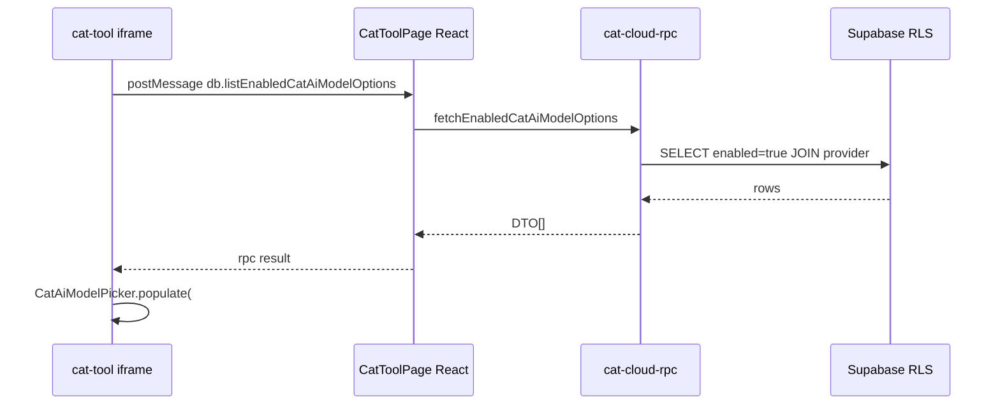

狀態：已驗收

# CAT AI Model Registry Phase 3B′ — 精選模型選單開發紀錄（2026-07-06）

本文件整合 **Phase 3A pivot**、**Phase 3B′ 精選模型選單實作**、**Claude AI 驗收**、**PR #19 direct-route hotfix** 與 **production smoke**，作為 Phase 3B′ 結案敘事與後續 Phase 4 起點。細節以程式與 production 為準；規格原文見 [`CAT_AI_MODEL_REGISTRY_PHASE3B_PRIME_SPEC_2026-07.md`](CAT_AI_MODEL_REGISTRY_PHASE3B_PRIME_SPEC_2026-07.md)。

上層索引：[`CAT_AI_MODEL_REGISTRY_PLAN_2026-07.md`](CAT_AI_MODEL_REGISTRY_PLAN_2026-07.md)、Phase 3 總規 [`CAT_AI_MODEL_REGISTRY_PHASE3_SPEC_2026-07.md`](CAT_AI_MODEL_REGISTRY_PHASE3_SPEC_2026-07.md) §0。

---

## 1. 背景與產品決策

### 1.1 Phase 3A pivot（2026-07-06）

| 項目 | 內容 |
|---|---|
| 原方向 | React `/settings/cat-ai-models` registry 唯讀管理頁（PR #10 merge 後曾短暫存在） |
| pivot PR | #11（`941c5dd8`）— rollback 正式管理頁 UI |
| 新方向 | 在 CAT iframe「AI 管理／AI 設定」提供**精選模型下拉**（僅 `enabled=true`） |
| 保留 | `src/lib/cat-ai-model-registry/` helper、Phase 1/2 DB + sync endpoint |
| 不做 | 70 筆草稿列表、enabled／default CRUD UI、sync 按鈕 UI |

### 1.2 PM 決策（Phase 3B′）

| # | 決策 |
|---|---|
| D1 | **模型選擇維持 executive-only**（非 executive 可看但不可改、不可儲存） |
| D2 | UI 僅顯示 `cat_ai_model_options.enabled=true` |
| D3 | 移除 general 路徑的 `__custom__` 自訂模型與測試連線 `/v1/models` 動態全量清單 |
| D4 | registry `is_default=true` 仍為 **gpt-5.5**；`cat_ai_settings.model` 全站單筆維持 |
| D5 | production 精選清單擴為 **5 模型**（含 `gpt-5.5-pro`），由 PM 核准後 DB `enabled` 調整（非 frontend PR） |

---

## 2. 開發時序總表

| 日期 | 里程碑 | commit／PR | 說明 |
|---|---|---|---|
| 2026-07-06 | 規劃 + audit | PR #12 `85cee697` | [`CAT_AI_MODEL_REGISTRY_PHASE3B_PRIME_SPEC_2026-07.md`](CAT_AI_MODEL_REGISTRY_PHASE3B_PRIME_SPEC_2026-07.md) read-only production audit |
| 2026-07-06 | 實作 merge | PR #15 `41fba21c` | 精選選單 + RPC + `CatAiModelPicker`；head `1ff6dd4a` |
| 2026-07-06 | production 部署 | `41fba21c` | Vercel production READY |
| 2026-07-06 | Claude AI 驗收 | — | 主路徑 **10/11 pass**；發現 direct-route／reload populate 與 PM 鎖定缺口 |
| 2026-07-06 | hotfix merge | PR #19 `da149f74` | `openAiSettingsView`、身分晚到重套鎖定；head `897b893b` |
| 2026-07-06 | production smoke | `da149f74` | PM 路徑全 pass；deployment `dpl_AVxDwzAgXga6UJReTsMN4wCoGoJa` |
| 2026-07-06 | **結案** | — | Phase 3B′ 驗收完成；Playwright 常駐 spec 列為後續工程項 |

---

## 3. Phase 3B′ 程式交付（PR #15）

| 項目 | 值 |
|---|---|
| PR | [#15](https://github.com/kratoswrathful-wy/talk-hanzi-joy/pull/15) |
| 分支 | `feature/cat-ai-curated-model-picker` |
| merge commit | `41fba21c` |
| feature commit | `1ff6dd4a` |

### 3.1 主要變更

| 區塊 | 路徑 | 說明 |
|---|---|---|
| TMS RPC | `src/lib/cat-cloud-rpc.ts` | 新增 `db.listEnabledCatAiModelOptions` |
| 列表 fetch | `src/lib/cat-ai-model-registry/list-registry-options.ts` | `fetchEnabledCatAiModelOptions` |
| RPC DTO | `src/lib/cat-ai-model-registry/rpc-enabled-models.ts` | camelCase 序列化 |
| 顯示 flags | `src/lib/cat-ai-model-registry/registry-display.ts` | default／fallback／temperature badge |
| CAT 模組 | `cat-tool/js/ai-model-picker.js` | `populate()`、`OFFLINE_MANIFEST`（5 模型） |
| CAT 整合 | `cat-tool/app.js` `loadAiSettingsView()` | 改呼叫 `CatAiModelPicker.populate`；移除 `/v1/models` 動態 optgroup |
| CAT HTML | `cat-tool/index.html` | 清空 `#aiSettingsModel` hardcoded optgroups；載入 `ai-model-picker.js` |
| CAT DB 橋接 | `cat-tool/db.js` | team 模式 RPC wrapper |
| 測試 | `api/lib/cat-ai-model-picker.test.js`、`src/lib/cat-ai-model-registry/*.test.ts` | picker contract + RPC DTO vitest |

### 3.2 移除／隱藏（與舊版差異）

- hardcoded GPT-4.1／4o／5 系列 `<optgroup>`
- `#aiSettingsModelCustom` 自訂輸入（`__custom__`）
- 測試連線成功後 `/v1/models` 填入 `#aiModelOptDynamic` 全量清單

### 3.3 資料流（團隊模式）

離線模式：RPC 失敗時 fallback `OFFLINE_MANIFEST`（與 production 五模型對齊）。

---

## 4. production registry 現況（驗收基準，2026-07-06）

| 項目 | 值 |
|---|---|
| `enabled=true` 筆數 | **5** |
| 模型 id | `gpt-5.5`、`gpt-5.4-mini`、`gpt-4.1`、`gpt-4.1-mini`、`gpt-5.5-pro` |
| `is_default=true` | `gpt-5.5`（全表唯一） |
| `cat_ai_settings.model`（id=1） | **`gpt-4.1`**（UI 選中以此為準，非強制改 default） |
| `cat_ai_model_options` 總列數 | 70（UI 不可見草稿） |

---

## 5. Claude AI 驗收（PR #15 部署後）

**環境**：`https://talk-hanzi-joy.vercel.app`  
**commit**：`41fba21c`  
**身分**：`alexandria1up@gmail.com` 暫改 `executive` 測試（測畢已改回 `pm`）

| 項 | 結果 | 備註 |
|---|---|---|
| P1 靜態資產 | pass | `ai-model-picker.js` 含 `OFFLINE_MANIFEST` 五模型 |
| P2 executive 身分 | pass | `_tmsRole === 'executive'` |
| P3 側欄進入 populate | pass | optionCount=5、status「雲端精選模型」 |
| T1 五模型清單 | pass | values 與 enabled 一致 |
| T2 無 custom／動態全量 | pass | `hasCustom=false` |
| T3～T6 文案／hint／temperature | pass | gpt-5.5／gpt-5.5-pro 省略 temperature 提示 |
| T4 已存 model | pass | `selected === 'gpt-4.1'` 與 DB 一致 |
| T7～T8 儲存與還原 | pass | 測試後已清理 |
| T9 靜態 index | pass | 無 hardcoded option |
| T10 無 registry 管理頁 | pass | |
| T11 批次 API body | **skip** | 無安全攔截環境；列 Phase 4／後續 |

### 5.1 驗收附帶發現（導致 PR #19）

| # | 症狀 | 根因 |
|---|---|---|
| **N1** | 網址列直達／reload `/cat/team/ai-settings` 選單空白 | `restoreCatRouteFromSession`／`TMS_NAVIGATE_TO` 只 `switchView`，**未** `loadAiSettingsView()` → `populate()` |
| **N2** | PM 直達 URL 時 `selectDisabled=false`、儲存鈕可見 | 直達路徑未等 `waitForTmsIdentityReady`；`populate()` 後未重套 `modelSelect.disabled` |

側欄「AI 管理」路徑正常（有呼叫 `loadAiSettingsView`）。

---

## 6. PR #19 — direct-route hotfix

| 項目 | 值 |
|---|---|
| PR | [#19](https://github.com/kratoswrathful-wy/talk-hanzi-joy/pull/19) |
| 分支 | `fix/cat-ai-model-picker-direct-route-guard` |
| merge commit | `da149f74` |
| feature commit | `897b893b`（含 `932e1a5a` 邏輯） |
| production deployment | **READY** `dpl_AVxDwzAgXga6UJReTsMN4wCoGoJa` |

### 6.1 修正內容（`cat-tool/app.js`）

| 函式 | 行為 |
|---|---|
| `openAiSettingsView()` | team 模式 `waitForTmsIdentityReady()` → `switchView` → `loadAiSettingsView()` → `populate()` |
| `refreshAiSettingsViewIfActive()` | TMS 身分晚到且當前為 `#viewAiSettings` 時重跑 `loadAiSettingsView()` |
| 路由還原／`TMS_NAVIGATE_TO`／側欄 | `viewAiSettings` 一律改走 `openAiSettingsView()` |
| `loadAiSettingsView()` | `populate()` **之後**再次 `modelSelect.disabled = !exec` |

### 6.2 回歸測試

| 檔案 | 內容 |
|---|---|
| `api/lib/cat-ai-settings-direct-route.test.js` | 4 項 app.js contract（vitest 讀原始碼 slice） |

---

## 7. production smoke（PR #19 merge 後）

**環境**：`https://talk-hanzi-joy.vercel.app` · commit `da149f74`  
**帳號**：`alexandria1up@gmail.com`（role=**pm**）

| 測項 | 結果 | 實測摘要 |
|---|---|---|
| PM 直達 `/cat/team/ai-settings` | **pass** | `#viewAiSettings` 可見 |
| PM reload 後 populate | **pass** | reload 後 `optionCount: 5`（hotfix 關鍵） |
| PM `#aiSettingsModel.disabled` | **pass** | `true` |
| PM 儲存鈕隱藏 | **pass** | `#btnSaveAiSettings` `display: none` |
| 五模型 + gpt-4.1 選中 | **pass** | 與 registry／`cat_ai_settings` 一致 |
| PM 側欄「AI 管理」隱藏 | **pass** | `.ai-exec-nav` `display: none` |
| executive 直達／reload／儲存／側欄 | **沿用 Claude 驗收** | PR #15 時 executive 路徑已驗；PR #19 reload 行為由 PM 路徑同程式碼路徑佐證 |

**靜態 smoke**：production `/cat/app.js` 含 `openAiSettingsView`、`refreshAiSettingsViewIfActive`、`waitForTmsIdentityReady`。

---

## 8. 驗收結論

| 面向 | 判定 |
|---|---|
| 精選 5 模型、移除舊 UI | ✅ |
| executive 側欄進入、儲存還原 | ✅（Claude） |
| PM 鎖定 + 直達／reload populate | ✅（PR #19 smoke） |
| 靜態 contract 測試 | ✅ |
| T11 批次 API body | ⏭ skip（不阻擋結案） |
| Playwright 常駐 spec（規格 §7.2 P1–P10） | 📋 **後續工程項**（見 §9） |

**Phase 3B′ 正式結案**（2026-07-06）。

---

## 9. 後續待辦（不屬 Phase 3B′）

| 項 | 說明 | 優先 |
|---|---|---|
| Playwright `tests/cat-ai-model-picker-phase3b.spec.ts` | 規格 §7.2；executive／PM、直達 reload、離線 manifest | 中 |
| T11 批次翻譯 `openaiBody.model` | mock／intercept `api/cat-openai` | 低 |
| Phase 4 | proxy 白名單、BYOK 收斂、批次 UI 預設讀 registry | 規劃中 |
| enabled／文案 CRUD | 仍無 UI；改 DB 或另案管理工具 | 低 |

---

## 10. commit 對照

| 里程碑 | commit（短碼） | PR |
|---|---|---|
| Phase 3B′ 規劃文件 | `85cee697` | #12 |
| 精選模型選單 | `1ff6dd4a` → `41fba21c` | #15 |
| direct-route hotfix | `897b893b` → `da149f74` | #19 |
| 本 DEVLOG | （本 commit） | docs only |

---

## 11. 相關文件與程式

| 文件／路徑 | 用途 |
|---|---|
| [`CAT_AI_MODEL_REGISTRY_PHASE3B_PRIME_SPEC_2026-07.md`](CAT_AI_MODEL_REGISTRY_PHASE3B_PRIME_SPEC_2026-07.md) | 規格與 audit（已驗收，細節以本 DEVLOG／程式為準） |
| [`CAT_AI_MODEL_REGISTRY_PHASE2_DEVLOG_2026-07.md`](CAT_AI_MODEL_REGISTRY_PHASE2_DEVLOG_2026-07.md) | Phase 2 收尾 |
| [`CODEMAP.md`](CODEMAP.md) | 路徑與現況摘要 |
| `cat-tool/js/ai-model-picker.js` | 精選選單 UI |
| `cat-tool/app.js` | `openAiSettingsView`、`loadAiSettingsView` |
| `api/lib/cat-ai-settings-direct-route.test.js` | hotfix contract |
