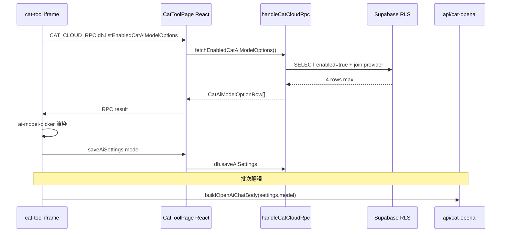

狀態：Phase 3B′ 精選模型選單已實作（2026-07-06）；production enabled=5；待 merge PR

# CAT AI Model Registry Phase 3B′ — CAT 精選模型選單規格

背景：PR #11（`941c5dd8`）已 merge，Phase 3A registry 管理頁 pivot rollback 完成。PM 決策改在 CAT「AI 管理／AI 設定」提供**精選模型選單**（`enabled=true` only）；**2026-07-06 production** 已啟用 **5** 個精選模型（含 gpt-5.5-pro）。不做完整 registry 管理頁、不顯示 70 筆草稿。

上層索引：[`CAT_AI_MODEL_REGISTRY_PLAN_2026-07.md`](CAT_AI_MODEL_REGISTRY_PLAN_2026-07.md)、Phase 3 總規 [`CAT_AI_MODEL_REGISTRY_PHASE3_SPEC_2026-07.md`](CAT_AI_MODEL_REGISTRY_PHASE3_SPEC_2026-07.md) §0。

**本文件範圍**：read-only production audit（2026-07-06）+ Phase 3B′ 實作規劃。**不含**實作、migration、production DB 變更。

---

## 1. Read-only audit（production，2026-07-06）

查詢來源：`cat_ai_model_options` JOIN `ai_provider_models`（Supabase MCP `execute_sql`，唯讀 SELECT）。

### 1.1 總覽

| 項目 | 值 |
|---|---|
| `cat_ai_model_options` 總列數 | 70 |
| `ai_provider_models` 總列數 | 74 |
| 目前 `enabled=true` | **2**（gpt-5.5、gpt-4.1-mini） |
| 目前 `is_default=true` | **1**（gpt-5.5，全表恰好一筆） |
| PM 目標 UI 可見 | **4**（需後續 DB 啟用 gpt-5.4-mini、gpt-4.1） |

### 1.2 五個候選模型明細

| model_id | 存在 | provider 可用 | enabled | is_default | sort_order | tier | use_case | display_name_zh | short_label_zh | usage_hint_zh |
|---|---|---|---|---|---|---|---|---|---|---|
| **gpt-5.5** | ✅ | ✅ | **true** | **true** | 999 | standard | general | GPT-5.5 | **null** | **null** |
| **gpt-5.4-mini** | ✅ | ✅ | false | false | 999 | standard | general | GPT-5.4 mini | **null** | **null** |
| **gpt-4.1** | ✅ | ✅ | false | false | 999 | standard | general | GPT-4.1 | **null** | **null** |
| **gpt-4.1-mini** | ✅ | ✅ | **true** | false | 10 | fast | pretranslate | GPT-4.1 mini | 快速省錢 | 快速省錢，適合大量預翻、一般句段初稿與低成本批次處理。 |
| gpt-5.5-pro | ✅ | ✅ | false | false | 999 | standard | general | GPT-5.5 pro | **null** | **null** |

### 1.3 Audit 結論

1. **四個 PM 精選候選皆已存在**於 registry，且 provider 端 `is_currently_available=true`。
2. **gpt-5.5 仍為唯一 default**；gpt-4.1-mini 仍 **enabled=true**（fallback 語意，見 `registry-display.ts` 的 `FALLBACK_MODEL_ID`）。
3. **gpt-5.4-mini、gpt-4.1 存在但尚未 enabled** — 實作 4 模型選單前需 PM 核准後執行 DB UPDATE（見 §6）。
4. **文案缺漏**：除 gpt-4.1-mini 外，四模型中 **gpt-5.5／gpt-5.4-mini／gpt-4.1 的 short_label_zh、usage_hint_zh 皆為 null**；gpt-5.5-pro 亦 null（暫不 UI，可後補草稿文案）。
5. **sort_order**：enabled 列目前為 gpt-4.1-mini=10、gpt-5.5=999；啟用 4 模型後應一併正規化排序（§6.2）。
6. **程式 default 不一致**：`cat_ai_settings` fallback、`loadAiSettingsView`、offline `_defaultAiSettingsRow()` 仍硬編 `gpt-4.1-mini`，與 registry default **gpt-5.5** 未對齊 — Phase 3B′-3 需修正。

---

## 2. Phase 3B′ 目標與範圍

### 2.1 要做

| # | 項目 |
|---|---|
| 1 | CAT「AI 管理／AI 設定」模型區改為**精選下拉**（僅 `enabled=true`） |
| 2 | 每項顯示繁中文案 + model_id + default／fallback badge + temperature 提示 |
| 3 | 儲存至既有 `cat_ai_settings.model`（team）或 localStorage（offline） |
| 4 | 批次翻譯／QA 沿用 `settings.model` → `CatAiModelTemperature.buildOpenAiChatBody` |
| 5 | 無手動選擇時使用 registry `is_default=true`（gpt-5.5） |

### 2.2 不做

- 完整 `/settings/cat-ai-models` registry 管理頁
- 顯示 70 筆 provider／草稿模型
- enabled／default／文案 CRUD UI
- sync 按鈕 UI
- `POST /api/cat-ai-model-sync` 行為變更
- migration、RLS 變更（既有 policy 足夠）
- BYOK 收斂（僅文件註記現況）
- Phase 4（proxy 強制白名單等）

---

## 3. 建議 UX（CAT AI 設定）

### 3.1 入口

- 既有 `#viewAiSettings`（`cat-tool/index.html`）
- 左欄 `.ai-exec-nav` →「AI 設定」
- **現況**：整頁多數欄位僅 executive 可編；模型 `<select>` 亦 `disabled` 非 executive（§8 待決策）

### 3.2 模型選單（取代 hardcoded optgroups）

**資料來源**：`enabled=true` 的 `cat_ai_model_options`（目標 4 筆）。

**每個 `<option>` 或自訂列建議呈現**：

| 元素 | 來源 |
|---|---|
| 主標題 | `display_name_zh`（null → model_id） |
| 副標 | `short_label_zh`（null → `formatNullableZh` →「（未設定）」） |
| 說明 | `usage_hint_zh`（同上；可放在 `<option title>` 或選取後下方 hint 區） |
| 技術 ID | `model_id`（小字、`monospace`） |
| **預設** badge | `is_default=true` |
| **備援** badge | `model_id === 'gpt-4.1-mini' && enabled && !is_default`（沿用 `getRegistryRowFlags`） |
| temperature 提示 | `shouldOmitTemperature(model_id)` → 顯示 `GPT55_TEMPERATURE_HINT_ZH` |

**移除或隱藏**（與 PM 方向衝突）：

- hardcoded GPT-4.1／4o／5 全系列 optgroups
- 「測試連線」成功後 `/v1/models` 動態填入 `#aiModelOptDynamic`（暴露全量模型）
- 「自訂輸入 `__custom__`」— **建議 Phase 3B′ 移除一般路徑**；若 BYOK 仍需自訂，僅 executive 進階區保留（待決策 §8）

**預設選中**：

1. 若 `cat_ai_settings.model` 仍在 enabled 清單 → 選該值
2. 否則 → `pickDefaultModelOption()`（gpt-5.5）

---

## 4. 資料流與技術方案

### 4.1 架構總覽



### 4.2 建議主路徑：**cat-cloud-rpc**（非 React postMessage 直查）

| 方案 | 評估 |
|---|---|
| **A. 新增 `db.listEnabledCatAiModelOptions` RPC case** | ✅ **建議**。CAT team 模式已走 `DBService` → `CAT_CLOUD_RPC` → `handleCatCloudRpc`；與 `getAiSettings` 一致 |
| B. React 外層 Supabase 查詢 + postMessage | ❌ 多一層、iframe 仍須新 listener；無明顯優勢 |
| C. iframe 內直接 Supabase JS | ❌ CAT vanilla 無 auth client；不符現架構 |

**實作要點**：

```typescript
// src/lib/cat-cloud-rpc.ts（規劃，未實作）
case "db.listEnabledCatAiModelOptions": {
  const rows = await fetchEnabledCatAiModelOptions();
  return rows.map((row) => ({
    modelId: row.model_id,
    displayNameZh: row.display_name_zh,
    shortLabelZh: row.short_label_zh,
    usageHintZh: row.usage_hint_zh,
    isDefault: row.is_default,
    enabled: row.enabled,
    sortOrder: row.sort_order,
    providerAvailable: row.providerAvailable,
    tier: row.tier,
    useCase: row.use_case,
  }));
}
```

- **可重用** `src/lib/cat-ai-model-registry/list-registry-options.ts` 的 `fetchEnabledCatAiModelOptions()`
- **可重用** `registry-display.ts`：`pickDefaultModelOption`、`getRegistryRowFlags`、`formatNullableZh`
- **可重用** `model-capabilities.ts`：`shouldOmitTemperature`、`GPT55_TEMPERATURE_HINT_ZH`
- RLS：authenticated member 已可 SELECT `enabled=true`；無需新 policy

### 4.3 CAT iframe 模組（遵守 W7 app.js 凍結）

| 檔案 | 變更 |
|---|---|
| **`cat-tool/js/ai-model-picker.js`**（新建 IIFE） | `listEnabledModels()`、`renderModelSelect(el, rows, selectedId)`、hint／badge DOM、offline fallback |
| **`cat-tool/index.html`** | 精簡 `#aiSettingsModel` 區塊；加 `<script>`；移除 hardcoded optgroups |
| **`cat-tool/db.js`** | team：`DBService.listEnabledCatAiModelOptions`；offline：靜態 4 模型 fallback 或 localStorage 快取 |
| **`cat-tool/app.js`** | **最小觸點**：`loadAiSettingsView()` 改呼叫 `CatAiModelPicker.populate(...)`；移除 `/v1/models` 動態選單邏輯 |
| **`cat-tool/js/ai-translate.js`** | 預期 **無行為變更**（已用 `settings.model`）；3B′-3 僅對齊 default fallback 字串 |
| **`src/lib/cat-cloud-rpc.ts`** | 新增 RPC case + `getAiSettings` default 對齊 gpt-5.5（optional 3B′-3） |

### 4.4 offline / local 模式

| 模式 | 行為 |
|---|---|
| **Team（RPC）** | 即時查 registry enabled 列 |
| **Offline LocalCatDB** | 不連 Supabase；使用 **靜態精選 manifest**（4 model_id + 文案快照，與 DB 同步更新）或上次 team 快取 `localStorage.catAiModelOptionsCache` |
| **失效模型** | 若已存 `settings.model` 不在 enabled 清單 → UI 顯示警告並 fallback 至 default |

**local/offline 不得壞掉**：offline 仍可選 manifest 內 4 模型並寫入 localStorage；不要求 live registry。

### 4.5 是否需要 `npm run sync:cat`

**是。** 新增／修改 `cat-tool/js/`、`index.html`、`db.js` 後必須 sync 至 `public/cat/` 並一併提交。

### 4.6 是否需要 migration / RLS

**否**（Phase 3B′ UI plumbing）。文案補齊與 `enabled=true` 為 **資料 UPDATE**（§6），非 schema 變更。

---

## 5. 建議 UI 文案（PM 草案）

實作前可寫入 DB；offline manifest 應同步相同文案。

| model_id | display_name_zh | short_label_zh | usage_hint_zh |
|---|---|---|---|
| **gpt-5.5** | GPT-5.5 | 高品質預設 | 品質優先，適合正式譯稿、QA 複查與需較高語意準確度的句段。此模型呼叫時**不送自訂 temperature**。 |
| **gpt-5.4-mini** | GPT-5.4 mini | 快速省用 | 速度與成本較平衡，適合日常批次翻譯與大量句段初稿。 |
| **gpt-4.1** | GPT-4.1 | 穩定通用 | GPT-5 系列以外的穩定選項，輸出風格可預期，適合一般翻譯與確認作業。 |
| **gpt-4.1-mini** | GPT-4.1 mini | 低成本備援 | 成本最低，適合大量預翻、初稿與可接受較輕量品質的批次；亦作系統備援模型。 |

**gpt-5.5-pro**（暫不 UI，草稿留存）：

- display_name_zh：GPT-5.5 pro
- short_label_zh：最高品質（草稿）
- usage_hint_zh：最高品質選項；僅在 PM 另案啟用後顯示。

---

## 6. DB update plan（僅規劃；**本次不可執行**）

**前置**：PM 書面核准啟用 gpt-5.4-mini、gpt-4.1；建議與 Phase 3B′ 實作 PR **同週**完成，避免 UI 長期只顯示 2 模型。

### 6.1 目標狀態

| model_id | enabled | is_default | 備註 |
|---|---|---|---|
| gpt-5.5 | true | **true** | 維持 |
| gpt-5.4-mini | **true** | false | PM 核准後啟用 |
| gpt-4.1 | **true** | false | PM 核准後啟用 |
| gpt-4.1-mini | true | false | fallback，維持 |
| gpt-5.5-pro | false | false | 草稿 |

### 6.2 建議 sort_order（UI 排序）

| model_id | sort_order |
|---|---|
| gpt-5.5 | 10 |
| gpt-5.4-mini | 20 |
| gpt-4.1 | 30 |
| gpt-4.1-mini | 40 |

### 6.3 建議 SQL（production；**勿在本次執行**）

```sql
-- 0) 驗證：default 恰好 1 筆
SELECT model_id, enabled, is_default FROM cat_ai_model_options WHERE is_default = true;

-- 1) 文案 + 啟用 gpt-5.4-mini
UPDATE cat_ai_model_options SET
  enabled = true,
  sort_order = 20,
  short_label_zh = '快速省用',
  usage_hint_zh = '速度與成本較平衡，適合日常批次翻譯與大量句段初稿。',
  updated_at = now()
WHERE model_id = 'gpt-5.4-mini';

-- 2) 文案 + 啟用 gpt-4.1
UPDATE cat_ai_model_options SET
  enabled = true,
  sort_order = 30,
  short_label_zh = '穩定通用',
  usage_hint_zh = 'GPT-5 系列以外的穩定選項，輸出風格可預期，適合一般翻譯與確認作業。',
  updated_at = now()
WHERE model_id = 'gpt-4.1';

-- 3) gpt-5.5 文案 + 排序
UPDATE cat_ai_model_options SET
  enabled = true,
  is_default = true,
  sort_order = 10,
  short_label_zh = '高品質預設',
  usage_hint_zh = '品質優先，適合正式譯稿、QA 複查與需較高語意準確度的句段。此模型呼叫時不送自訂 temperature。',
  updated_at = now()
WHERE model_id = 'gpt-5.5';

-- 4) gpt-4.1-mini 文案微調 + 排序
UPDATE cat_ai_model_options SET
  sort_order = 40,
  short_label_zh = '低成本備援',
  usage_hint_zh = '成本最低，適合大量預翻、初稿與可接受較輕量品質的批次；亦作系統備援模型。',
  updated_at = now()
WHERE model_id = 'gpt-4.1-mini';

-- 5) 確保僅 gpt-5.5 為 default
UPDATE cat_ai_model_options SET is_default = false, updated_at = now()
WHERE model_id <> 'gpt-5.5' AND is_default = true;

-- 6) 驗收
SELECT model_id, enabled, is_default, sort_order, short_label_zh IS NOT NULL AS has_short
FROM cat_ai_model_options
WHERE enabled = true
ORDER BY sort_order;
-- 預期：4 列；is_default 僅 gpt-5.5
```

### 6.4 `cat_ai_settings` 既有列（optional）

若 id=1 的 `model` 仍為 `gpt-4.1-mini` 且 PM 希望全站預設切到 gpt-5.5：

```sql
-- 僅在 PM 要求「已存設定也改 default」時執行
UPDATE cat_ai_settings SET model = 'gpt-5.5', updated_at = now()
WHERE id = 1 AND model = 'gpt-4.1-mini';
```

否則 UI 層以 registry default 填空白即可，不強改已存設定。

---

## 7. 測試計畫

### 7.1 Vitest（src/lib）

| ID | 項目 | 通過條件 |
|---|---|---|
| V1 | `fetchEnabledCatAiModelOptions` mock | 僅回 enabled；排序依 sort_order |
| V2 | RPC DTO 序列化 | camelCase 欄位完整 |
| V3 | `pickDefaultModelOption` | 有 is_default 選該筆；無則第一筆 |
| V4 | `getRegistryRowFlags` | gpt-4.1-mini → isFallback；gpt-5.5 → omitTemperature |
| V5 | null 文案 | `formatNullableZh(null)` →「（未設定）」 |

### 7.2 Playwright（測試模式）

| ID | 項目 | 通過條件 |
|---|---|---|
| P1 | enabled 數量 | AI 設定下拉 **僅** 顯示 enabled 列（DB 準備 4 後 assert count=4） |
| P2 | disabled 不顯示 | gpt-5.5-pro 不在 DOM option 中 |
| P3 | default 選中 | 新環境／清空 model 後選中 gpt-5.5 |
| P4 | 切換模型 | 儲存後 `cat_ai_settings.model` 更新 |
| P5 | API body | 批次翻譯 mock／intercept：`openaiBody.model` = 選定 model_id |
| P6 | GPT-5.5 temperature | body **不含** temperature |
| P7 | gpt-4.1 / gpt-4.1-mini | body **含** temperature（若 settings 有值） |
| P8 | null 文案 fallback | 缺 short_label 仍可渲染 option（未設定提示） |
| P9 | offline | 切 offline 模式開 AI 設定不 throw；manifest 4 項可選 |
| P10 | 角色 | 見 §8；若維持 executive-only 編輯，member 為 disabled + 唯讀 hint |

**測試模式注意**（規則 §6）：路由守衛看真實帳號；AI 設定在 iframe 內，executive gating 看 `window._tmsRole` — 切假人後須 assert active persona。

### 7.3 手動／AI 體感抽查

- 選單文案可讀性、badge 不擠壓
- 切模型後批次翻譯延遲無異常回歸

---

## 8. 風險與待 PM 決策

| # | 議題 | 選項 | 建議 |
|---|---|---|---|
| D1 | **誰能改模型？** | A) 維持 executive-only 設全域 B) 所有登入譯者可選 | **B** 較符合「日常批次用 5.4-mini」；A 則 PM／執行長代設 |
| D2 | **DB 啟用 2 模型時機** | 實作前／與 3B′ PR 同 merge／上線後 | **與 3B′ 第一個可驗收 PR 同週** |
| D3 | **移除「自訂模型」與 /v1/models 動態清單？** | 全移除 vs executive 保留 | **全移除** general 路徑；BYOK 另案 |
| D4 | **已存 model 不在 enabled 清單** | 靜默改 default vs 警告 | 顯示警告 + fallback default |
| D5 | **BYOK 繞過 registry** | Phase 3B′ 不擋；Phase 4 再議 | 文件註記即可 |
| D6 | **`cat_ai_settings.model` 全站單筆** | 維持 vs 改 per-user | 維持（現架構） |

---

## 9. 實作拆工建議

| 子階段 | 內容 | 交付物 |
|---|---|---|
| **3B′-1** plumbing | RPC case、`db.js` wrapper、DTO、offline manifest、vitest | 無 UI 變化可單測 |
| **3B′-2** UI | `ai-model-picker.js`、index.html、loadAiSettingsView 整合、badge／hint | 選單可見可存 |
| **3B′-3** 呼叫對齊 | default fallback gpt-5.5、移除動態 /v1/models、批次／QA 回歸測試 | API body 正確 |

**依賴**：3B′-2 依 3B′-1；3B′-3 可與 3B′-2 同 PR 若變更小。

**不建議**把 DB UPDATE 混進 frontend PR — 資料變更獨立 commit／操作紀錄（或 Phase 2 DEVLOG 附錄）。

---

## 10. 是否建議進入 Phase 3B′ 實作

**建議進入**，條件：

1. PM 確認 **D1（角色）** 與 **D3（自訂模型）**
2. PM 核准 **§6 DB update** 時程（至少 2 模型啟用 + 文案）
3. 從 **3B′-1** 開始；PR #11 已保留所需 lib helper

預估：3 個子 PR 或 1 個 PR 三 commit；含 Playwright 約 1–2 個工作 session。

---

## 11. 相關程式對照

| 項目 | 路徑 |
|---|---|
| 精選列表 fetch | `src/lib/cat-ai-model-registry/list-registry-options.ts` |
| 顯示 flags | `src/lib/cat-ai-model-registry/registry-display.ts` |
| temperature | `src/lib/cat-ai-model-registry/model-capabilities.ts`、`cat-tool/js/ai-model-temperature.js` |
| AI 設定 UI | `cat-tool/index.html` `#viewAiSettings`、`app.js` `loadAiSettingsView` |
| 設定持久化 | `cat-cloud-rpc.ts` `db.getAiSettings`／`saveAiSettings` |
| 批次呼叫 | `cat-tool/js/ai-translate.js` |
