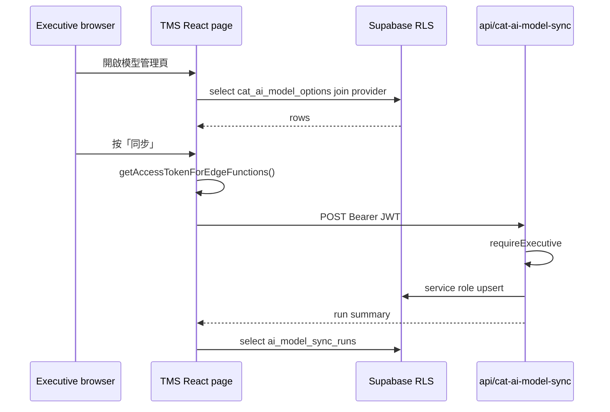

狀態：Phase 3A 已 pivot（2026-07-06）；新方向：CAT 精選模型選單（非 registry 管理頁）

# CAT AI Model Registry Phase 3 — 管理 UI 規格（2026-07）

本文件為 **Level 2 規劃**（僅規格，不含實作）。背景見 [`CAT_AI_MODEL_REGISTRY_PLAN_2026-07.md`](CAT_AI_MODEL_REGISTRY_PLAN_2026-07.md)、Phase 2 收尾 [`CAT_AI_MODEL_REGISTRY_PHASE2_DEVLOG_2026-07.md`](CAT_AI_MODEL_REGISTRY_PHASE2_DEVLOG_2026-07.md)。

**Phase 3 目標（2026-07-06 調整後）**：在 CAT 既有「AI 管理／AI 設定」提供**精選模型選單**（約 4～5 個 `enabled=true` 模型），**不**做完整 registry 管理頁、**不**在 UI 顯示 70 筆草稿。

**Phase 3 不做**（調整後仍適用）：

- 完整 React `/settings/cat-ai-models` registry 管理頁（Phase 3A 已 merge 後 rollback，見 §0）
- enabled／default／文案的 CRUD 編輯 UI
- sync 按鈕 UI
- 前台 AI 批次翻譯模型選單全面改讀 registry（留 Phase 4 或另案）
- BYOK 收斂（僅可在文件註記現況）
- 新增 migration／RLS（除非實作階段證明必要）

---

## 0. PM 方向調整（2026-07-06）

### 新決策摘要

| 項目 | 定案 |
|---|---|
| **不要** | 完整 `/settings/cat-ai-models` 模型管理頁；AI 管理中看到 70 個模型 |
| **要** | CAT「AI 管理／AI 設定」內**精選模型選單**（約 4～5 個） |
| **backend** | 保留 registry + sync；`ai_provider_models` 可存全部 OpenAI models；`cat_ai_model_options` 可存草稿（`enabled=false`） |
| **UI 可見** | 僅 `cat_ai_model_options` 且 **`enabled=true`** |
| **default** | **gpt-5.5**（維持） |
| **fallback** | **gpt-4.1-mini**（`enabled=true`，維持） |
| **後續精選** | 另案決定再啟用 2～3 個模型（改 DB `enabled`，**無** enabled 編輯 UI） |

### Phase 3A（PR #10）處置

- merge commit `d87e6e77` 曾新增 React 唯讀管理頁 + 側欄入口 + `/settings/cat-ai-models`
- **2026-07-06 pivot PR** 移除上述正式 UI；保留 `src/lib/cat-ai-model-registry/` helper 供精選模型選單使用
- **不修改 production DB**

### 後續 Phase 3 新工項（規劃中）

**Phase 3B′ — CAT AI 設定精選模型選單**（詳細規格見 [`CAT_AI_MODEL_REGISTRY_PHASE3B_PRIME_SPEC_2026-07.md`](CAT_AI_MODEL_REGISTRY_PHASE3B_PRIME_SPEC_2026-07.md)）：

- 讀取 `fetchEnabledCatAiModelOptions()`（`enabled=true` only）
- 顯示 `display_name_zh`／`short_label_zh`／`usage_hint_zh`
- 預設選中 `is_default=true`（gpt-5.5）
- GPT-5.5 family temperature 提示沿用 `model-capabilities.ts`
- **不做** CRUD、sync 按鈕、70 列表格
- **2026-07-06**：production read-only audit 完成；4 候選皆存在；目前僅 2 個 enabled；文案多數 null

---

## 1. 現況摘要

### Phase 1 / 2 已完成

| 項目 | 狀態 |
|---|---|
| DB 四張表 + RLS + seed | ✅ merge `0737bf2`；production 已套用 |
| `POST /api/cat-ai-model-sync` | ✅ merge `7b8ea65d`（PR #6） |
| 首次 production sync | ✅ runId `a8e4b19a-6115-4a7e-8620-2a4cdd1117f5` |
| GPT-5.5 temperature hotfix | ✅ merge `ab4b9005`（PR #7）；production smoke 通過 |
| Phase 2 收尾文件 | ✅ merge `95cb9c37`（PR #8） |

### production registry 現況（2026-07-06 audit）

| 項目 | 值 |
|---|---|
| `enabled=true` | `gpt-4.1-mini`、`gpt-5.5` |
| `is_default=true` | `gpt-5.5`（全表恰好 1 筆） |
| `ai_provider_models` | 74 列 |
| `cat_ai_model_options` | 70 列 |
| PM 精選待啟用 | `gpt-5.4-mini`、`gpt-4.1`（存在、`enabled=false`） |
| 文案 | gpt-5.5／gpt-5.4-mini／gpt-4.1 的 short／usage 仍 null；gpt-4.1-mini 已有 |

完整 audit 表見 [`CAT_AI_MODEL_REGISTRY_PHASE3B_PRIME_SPEC_2026-07.md`](CAT_AI_MODEL_REGISTRY_PHASE3B_PRIME_SPEC_2026-07.md) §1。

### PM 決策（已採納）

- **正式 default**：`gpt-5.5`
- **fallback**：`gpt-4.1-mini` 保留 `enabled=true`
- **UI 精選模型**：只顯示 `enabled=true`（目標約 4～5 個；目前 2 個）
- **不做**完整 registry 管理頁（2026-07-06 pivot）
- **enabled／default 變更**：仍由 DB／sync 後台處理，**無**產品 CRUD UI

### Phase 3 要解決的問題（2026-07-06 調整後）

1. CAT「AI 管理／AI 設定」模型選單仍為 hardcoded，未讀 registry 精選列
2. 使用者不應看到 70 筆草稿模型
3. 需顯示 `display_name_zh`／`short_label_zh`／`usage_hint_zh` 與 default（gpt-5.5）
4. GPT-5.5 省略 temperature 需在選單或提示中表達

### 程式現況（盤點）

| 區域 | 現況 |
|---|---|
| CAT「AI 管理」 | `viewAiSettings`（`cat-tool/index.html`）；左欄 `.ai-exec-nav` 僅 executive 可見（`_isCatExecutive()` → `window._tmsRole`） |
| 模型下拉 | 仍為 **hardcoded HTML** + `app.js` 瀏覽器端 `/v1/models` 動態選項；**未讀 registry** |
| `cat-cloud-rpc.ts` | 大量 `db.*` case；**尚無** `cat_ai_model_options` 相關 action |
| `CatToolPage.tsx` | 轉發 `CAT_CLOUD_RPC` → `handleCatCloudRpc`；`TMS_IDENTITY` 帶 `primaryRole` |
| RLS | executive 可讀寫全部 options；member 僅讀 `enabled=true`；sync_runs 僅 executive 可讀 |
| Sync | `/api/cat-ai-model-sync` + `requireExecutive`（JWT → DB `user_roles`） |
| temperature 規則 | `cat-tool/js/ai-model-temperature.js`（程式判斷，非 DB 欄位） |

---

## 2. 建議 UX（白話）

Executive 進入 CAT「AI 管理」後，看到新分頁或區塊 **「模型 registry」**：

### 模型列表（表格）

每列顯示：

- **model_id**（技術 ID，小字）
- **display_name_zh**（主標題）
- **short_label_zh**／**usage_hint_zh**（缺值時顯示「未設定」）
- **enabled**（開關；default 列禁用關閉並 tooltip 說明）
- **default**（星號或 radio；僅 enabled 列可設）
- **tier**／**use_case**／**sort_order**
- **supports_chat_completions**／**supports_responses_api**
- **provider 可用性**：join `ai_provider_models.is_currently_available`（不可用時橘色警示）
- **特殊限制**：若為 GPT-5.5 家族，顯示「不支援自訂 temperature（CAT 已自動省略）」

預設排序：`sort_order` 升冪，其次 `display_name_zh`。

篩選（Phase 3C 後）：全部／僅 enabled／僅草稿。

### 編輯文案

列上「編輯」開 modal 或 inline 表單：

- `display_name_zh`（必填）
- `usage_hint_zh`、`short_label_zh`（選填，建議 gpt-5.5 優先補）
- Phase 3A 可先唯讀；Phase 3B 開放編輯

### 改 default

- 僅 enabled 列可設為 default
- 確認對話框說明：**成本／品質／延遲可能改變**；目前 default 為 gpt-5.5
- 成功後列表刷新，恰好一列 `is_default=true`

### 改 enabled

- 關閉前檢查：不可關閉 **目前 default**；不可關閉 **最後一個 enabled**
- 關閉 default 前先引導改 default

### Sync 區塊（Phase 3D）

- 按鈕「同步 OpenAI 模型清單」
- 執行中 disabled + spinner（防重複點擊）
- 成功 toast：discovered／new／marked unavailable
- **下方 sync 歷史表**：最近 N 筆 `ai_model_sync_runs`（時間、status、discovered、new、missing、error_message）
- 文案：**sync 只新增草稿，不會自動 enabled**

### 離線／本機模式

- 團隊模式（`catStorage=team`）才顯示 registry 管理
- 離線模式：整區隱藏或顯示「僅團隊模式可用」（與 registry 設計一致）

---

## 3. 技術方案比較

### 方案 A：在 cat-tool「AI 管理」內做（iframe UI + 外層 RPC）

**作法**：新增 `cat-tool/js/ai-model-registry-admin.js`（IIFE）；在 `viewAiSettings` 加 HTML 區塊；經 `CAT_CLOUD_RPC` 呼叫 `handleCatCloudRpc` 新 action 讀寫 Supabase（RLS 把關）。

| 面向 | 說明 |
|---|---|
| **優點** | 符合 Phase 1 計畫「管理 UI 在 cat-tool」；executive 已在 CAT 脈絡操作 AI；與「AI 管理」相鄰 |
| **缺點** | vanilla JS 表格／modal 開發成本高；sync 需 iframe→parent→`fetch('/api/cat-ai-model-sync')` 轉發；`_isCatExecutive()` 僅 UI gating |
| **必改檔案** | `cat-tool/js/ai-model-registry-admin.js`、`cat-tool/index.html`、`public/cat/*`（sync:cat）；`src/lib/cat-cloud-rpc.ts`（新 action）；`src/lib/cat-ai-model-registry/*.ts`（純函式）；`cat-tool/js/data-provider.js` 或 RPC 包裝（若已有 postMessage  helper） |
| **可能改** | `cat-tool/app.js` **最小**掛鉤（例如 AI 管理 init 呼叫 `CatAiModelRegistryAdmin.init()`）；**禁止**在 app.js 寫業務邏輯 |
| **風險** | app.js 觸點；iframe 內 JWT 不可用，所有寫入必須 RPC；UI 與 React 設計系統不一致 |

### 方案 B：React 外層 executive-only 管理 panel

**作法**：新增 `src/pages/CatAiModelRegistryPage.tsx`（或 Settings 子區），`RequireExecutive` 路由守衛；React 直接 `supabase.from(...)` + `getAccessTokenForEdgeFunctions()` 呼叫 sync API。

| 面向 | 說明 |
|---|---|
| **優點** | 表格／表單／toast 與 TMS 一致；sync JWT 路徑清晰；**不必改 cat-tool**；typecheck 友善 |
| **缺點** | 偏離原「AI 管理在 cat-tool」決策；executive 需離開 CAT iframe 或開新分頁；CAT 內仍看不到 registry（除非加連結） |
| **必改檔案** | `src/pages/CatAiModelRegistryPage.tsx`、`src/App.tsx` 路由、`src/lib/cat-ai-model-registry/`（client + 純函式）、可能 `src/components/settings/` |
| **可能改** | `CatToolPage.tsx` 加「開啟模型管理」連結（optional） |
| **風險** | 低；RLS 仍為授權底層 |

### 方案 A′（推薦）：cat-tool 入口 + React 管理 panel

**作法**：CAT「AI 管理」僅加 **連結／按鈕**「開啟模型 registry 管理」→ 外層 React 全頁或 modal（`/cat/model-registry` 或 `/settings/cat-ai-models`）。資料與 sync **全在 React**；iframe 不持有 service role。

| 面向 | 說明 |
|---|---|
| **優點** | 保留「從 AI 管理進入」動線；實作集中在 React；sync／表格 UX 最佳；**可不碰 app.js**（僅 index.html 加連結 + postMessage 導航） |
| **缺點** | 兩段 UI（iframe 按鈕 + React 頁）；需處理 CAT shell 內導航 |
| **是否推薦** | **是** — 平衡原決策與工程成本 |

---

## 4. 權限／資料流設計

### UI 可見性（前端 gating）

| 層級 | 機制 | 用途 |
|---|---|---|
| CAT iframe | `_isCatExecutive()` + `.ai-exec-nav` | 隱藏非 executive 的入口；**非安全邊界** |
| React 路由 | `RequireExecutive`（`useAuth` → `user_roles`） | 阻擋 member／pm 進管理頁 |
| 測試 | Playwright 須用 **真實 executive 帳號** 或 DB 層 RLS 腳本（見 testing.mdc §6） |

### 實際寫入授權

| 操作 | 建議路徑 | 授權 |
|---|---|---|
| 讀全部 options + provider join | React `supabase.from('cat_ai_model_options').select('*, ai_provider_models(...)')` 或 RPC case + **handler 內查 executive** | RLS `select_executive` |
| 更新文案／enabled | React `.update()` 或 RPC | RLS `update_executive` |
| 設 default | 應用層兩步 update（見 §5）+ 業務驗證 | RLS + 唯一 partial index |
| Sync | `POST /api/cat-ai-model-sync` + Bearer JWT | `requireExecutive`（與 Phase 2 相同） |
| 讀 sync_runs | React `.from('ai_model_sync_runs')` | RLS `select_executive` |

**不信任**：`window._tmsRole`、postMessage payload 內 role、body 內 userId。

**禁止**：service role key 進前端 bundle；`VITE_*` 暴露 service role。

### 是否需要新 Vercel endpoint？

| 需求 | 判定 |
|---|---|
| Sync | **否** — 沿用 `/api/cat-ai-model-sync` |
| CRUD options | **否** — 既有 RLS + authenticated client 足夠 |
| 原子 set-default | **視實作** — 若兩步 update 競態不可接受，再評估 migration 加 RPC function（Phase 3C 前決策） |

### 是否需要 cat-cloud-rpc？

| 方案 | 需要？ |
|---|---|
| **B / A′（React 直查）** | **否**（Phase 3）；Phase 4 仍計畫 `db.getCatAiModelOptions` 給 iframe 唯讀 enabled 清單 |
| **純 A（iframe 內 CRUD）** | **是** — 新增 `db.listCatAiModelOptionsAdmin`、`db.patchCatAiModelOption` 等，handler 內 `assertExecutive(userId)` |

### Sync 資料流（A′ / B）

---

## 5. DB / RLS 是否需要變更

### Schema

**現有 schema 足夠** Phase 3 功能（文案、enabled、default、tier、use_case、sort_order、capability 旗標均已存在）。

| 缺口 | 判定 |
|---|---|
| `supports_custom_temperature` 欄位 | **不需要** — 沿用 `ai-model-temperature.js` 規則在 UI 顯示 |
| registry 操作 audit log | **非必要** — 見 §9 PM 決策；若要做則 Phase 3+ migration |
| `updated_at` 自動 trigger | migration **未**建 trigger；應用層 update 時帶 `updated_at: new Date().toISOString()` |

### RLS

**既有 RLS 足夠** executive CRUD + executive 讀 sync_runs。

| 操作 | RLS |
|---|---|
| member 讀 enabled | ✅ |
| member 寫 options | ❌ 已拒 |
| executive 讀全部 | ✅ |
| executive 更新 | ✅ |
| pm sync | ❌ endpoint 403 |

### Migration

**Phase 3 預設不新增 migration。**

**可能例外（Phase 3C 實作前再評估）**：

- **`set_cat_ai_model_default(option_id uuid)`** SECURITY DEFINER function：原子切換 default，避免兩步 update 短暫零 default 或 unique 衝突
- **理由**：partial unique index 只允許一筆 `is_default=true`；先設新再清舊會失敗，必須先清舊
- **若不做 migration**：在 server 端（Vercel 小 endpoint 或 Supabase RPC 單檔 migration）封裝順序；React 兩步仍可行但需整合錯誤處理

### 業務規則（應用層，非 DB）

| 規則 | 實作位置 |
|---|---|
| default 不可停用 | UI disable + server 拒絕 |
| 至少一個 enabled | update 前 count enabled |
| default 必須 enabled=true | 設 default 時一併 `enabled=true` |
| sync 不自動 enabled | 不變 Phase 2 行為 |

---

## 6. 檔案影響範圍

### 必改（方案 A′ 推薦）

| 檔案 | 用途 |
|---|---|
| `src/pages/CatAiModelRegistryPage.tsx`（新） | 管理 UI 主頁 |
| `src/lib/cat-ai-model-registry/admin-queries.ts`（新） | list／patch／setDefault 封裝 |
| `src/lib/cat-ai-model-registry/model-capabilities.ts`（新） | temperature 等 UI 提示（可 re-export 規則，與 cat-tool 同源邏輯） |
| `src/lib/cat-ai-model-registry/*.test.ts`（新） | 純函式 vitest |
| `src/App.tsx` | 路由 + `RequireExecutive` |
| `docs/CODEMAP.md` | 現況摘要 |

### 視方案可能要改

| 檔案 | 方案 A | 方案 A′ / B |
|---|---|---|
| `cat-tool/index.html` | 大量 HTML | 僅入口連結 |
| `cat-tool/js/ai-model-registry-admin.js` | 是 | 否 |
| `src/lib/cat-cloud-rpc.ts` | 新 admin cases | Phase 4 再說 |
| `src/pages/CatToolPage.tsx` | RPC 轉發 sync optional | postMessage 導航 optional |
| `src/lib/supabase-access-token.ts` | — | sync 呼叫 |
| `tests/cat-ai-model-registry-admin.spec.ts`（新） | Playwright |

### 不應修改（Phase 3）

| 項目 |
|---|
| `cat-tool/app.js`（**除非** A 方案且僅 1～3 行 init 掛鉤 — 需 PM 核准） |
| `cat-tool/js/ai-translate.js`、批次翻譯模型選單 |
| `public/cat/` 手改（僅 sync:cat 產物時除外） |
| `supabase/migrations/*`、RLS（預設） |
| `api/cat-ai-model-sync.js` 行為（非 bug） |
| production DB 資料 |

### 其他標註

| 問題 | 答案 |
|---|---|
| 是否需要 `npm run sync:cat` | **方案 A′/B：否**；方案 A：**是** |
| 是否需要更新 `types.ts` | **否**（無新 DB 物件）；若只加 TS 型別別名可選 |
| 是否需要新增測試 | **是** — vitest 業務規則 + Playwright executive 流程 + RLS SQL 腳本延伸 |

---

## 7. 建議拆工（PR）— **2026-07-06 已調整**

~~採方案 A′（React 管理頁 + CAT 入口）~~ → **已 pivot**。以下舊 3A～3E 章節保留作歷史參考；**現行路線見 §0**。

### Phase 3A — 唯讀模型列表（executive）— **已 rollback（2026-07-06）**

| 項目 | 內容 |
|---|---|
| **原 PR** | #10 merge `d87e6e77` |
| **處置** | 移除 `/settings/cat-ai-models`、側欄入口、`CatAiModelRegistryPage`；保留 lib helper |
| **production DB** | 未變更 |

### Phase 3B′ — CAT AI 設定精選模型選單（**下一工項，規劃中**）

| 項目 | 內容 |
|---|---|
| **目的** | CAT iframe「AI 管理／AI 設定」只顯示 `enabled=true` 精選模型（約 4～5 個） |
| **資料** | `fetchEnabledCatAiModelOptions()`；RLS 已允許 member 讀 enabled 列 |
| **UI** | 模型選單 + 文案；預設 gpt-5.5；temperature 提示 |
| **不做** | 70 列表格、CRUD、sync 按鈕 |
| **sync:cat** | **是**（改 cat-tool AI 設定 UI） |

### ~~Phase 3B～3E~~（舊規格，**不再執行**；以下保留查證用）

展開舊 Phase 3A～3E 規格（已 superseded）

#### 舊 Phase 3A（React 管理頁，已 rollback）

| 項目 | 內容 |
|---|---|
| **路由** | `/settings/cat-ai-models`（D8，已廢止） |
| **處置** | pivot PR 移除 |

#### 舊 Phase 3B — 文案編輯

| 項目 | 內容 |
|---|---|
| **目的** | 編輯 `display_name_zh`、`usage_hint_zh`、`short_label_zh` |
| **修改檔案** | 同上 + 編輯 modal／表單 |
| **驗收** | 儲存後 RLS 允許欄位更新；`updated_at` 刷新；gpt-5.5 可補文案 |
| **風險** | 低 |
| **production DB 寫入** | **是**（文案）— 需 PM 知悉，非 sync |

### Phase 3C — enabled / default 管理

| 項目 | 內容 |
|---|---|
| **目的** | toggle enabled、設 default、業務規則護欄 |
| **修改檔案** | `admin-queries.ts`（setDefault 順序）、UI 確認對話框 |
| **驗收** | 不可關閉 default／最後 enabled；設 default 後恰好 1 筆；改 default 有成本提示 |
| **風險** | **中**（default 原子性） |
| **production DB 寫入** | **是** — 需 PM 核准 |

### Phase 3D — sync 按鈕與 sync history

| 項目 | 內容 |
|---|---|
| **目的** | 觸發 Phase 2 sync + 顯示 `ai_model_sync_runs` |
| **修改檔案** | sync client helper、`CatAiModelRegistryPage.tsx` history 區 |
| **驗收** | 僅 executive 200；重複點擊防護；history 顯示 runId `a8e4b19a...` 類資料；**不自動 enabled 新模型** |
| **風險** | **中**（production sync 需 PM 每次核准？或 executive 自助 — 見 §9） |
| **production DB 寫入** | **是**（sync）— **每次 production sync 需 PM 核准**（延續 Phase 2 慣例） |

### Phase 3E — CAT 入口（可併 3A）

| 項目 | 內容 |
|---|---|
| **目的** | `viewAiSettings` 加「模型 registry 管理」→ 導向 React 頁 |
| **修改檔案** | `cat-tool/index.html` 小改、`CatToolPage.tsx` 導航 hook |
| **驗收** | executive 在 CAT 可一鍵進管理頁；非 executive 不見入口 |
| **風險** | 低 |
| **sync:cat** | **是**（若改 index.html） |

### Phase 3 刻意延後

- `tier`／`use_case`／`sort_order` 編輯 → **Phase 3B+ 或 3C 子項**（見 §9）
- audit log → 獨立工項

---

## 8. 測試計畫

### Unit tests（vitest）

| 測試 | 內容 |
|---|---|
| `validateDisableOption` | default 不可關、最後 enabled 不可關 |
| `validateSetDefault` | 目標必须 enabled |
| `orderDefaultSwapUpdates` | 先清舊 default 再設新 |
| `shouldOmitTemperature` | UI capability 提示與 cat-tool 規則一致 |
| `formatRegistryRow` | join provider availability 顯示 |

### Integration

| 測試 | 內容 |
|---|---|
| `admin-queries` mock Supabase | patch 欄位、錯誤映射 |
| sync client mock fetch | 401／403／200 |

### Playwright（測試模式 + 真實 executive）

| 測試 | 內容 |
|---|---|
| 路由守衛 | pm／member 開 `/cat/model-registry` → 拒絕 |
| 3A 列表 | executive 看見 gpt-5.5 default 列 |
| 3B 編輯 | 改 usage_hint 後 reload 仍在 |
| 3C default | 改 default 需確認；舊 default 星號移除 |
| 3D sync | mock 或 staging；production sync **不納入 CI** |

### DB 層（`supabase/tests/`）

延伸 [`cat_ai_model_registry_rls_check.sql`](../supabase/tests/cat_ai_model_registry_rls_check.sql)：

- executive 可 update enabled
- member 不可 update
- executive 可讀 sync_runs

### Production smoke（手動／AI 驗收）

- 3B 後 gpt-5.5 文案非 null
- 3C 後 default 仍恰好 1 筆
- 3D sync 後 new 草稿仍 enabled=false

---

## 9. 風險與待決策

### 已定案（2026-07-05，部分已 pivot 2026-07-06）

| # | 決策 | 定案 | 備註 |
|---|---|---|---|
| D1 | **UI 位置** | ~~A′ React 管理頁~~ → **CAT AI 設定精選模型選單** | 2026-07-06 pivot |
| D8 | **路由路徑** | ~~`/settings/cat-ai-models`~~ **廢止** | 無 registry 管理頁 |

### 仍待決策

| # | 待決策 | 建議 |
|---|---|---|
| D2 | **Phase 3 是否含 sync 按鈕** | **含（3D）**；production 執行仍 **PM 核准** |
| D3 | **tier／use_case／sort_order 是否 Phase 3 可編** | **3A–3B 不做**；3C 後 optional 子 PR |
| D4 | **audit log** | Phase 3 **不做**；若需合規再加 migration |
| D5 | **先補 gpt-5.5 文案** | **建議 3B 第一筆驗收資料**（可在 3B merge 後立即填） |
| D6 | **成本提醒文案** | 設 default 確認框必含；gpt-5.5 vs mini 對照一句話 |
| D7 | **set-default 原子性** | 先兩步 update + 測試；有競態再 migration RPC |

### 風險登記

| 風險 | 等級 |  mitigation |
|---|---|---|
| 手動 DB 再發 | 高 | Phase 3 完成前禁止非 migration 直接改 registry |
| default 切換競態 | 中 | 原子 RPC 或 retry |
| 測試模式假人誤判 executive | 中 | 路由守衛用真實 `user_roles`（testing.mdc §6） |
| sync 誤啟用新模型 | 低 | Phase 2 已禁止；UI 文案強調 |

---

## 10. 建議結論

1. **採方案 A′**：React executive 管理頁為主；CAT「AI 管理」只提供入口；**不**在 iframe 內做完整 CRUD 表格。
2. **拆工 3A → 3B → 3C → 3D**（3E 入口可併 3A）；**不**在 Phase 3 改批次翻譯選單（Phase 4）。
3. **不新增 migration** 為預設；default 原子性問題實作時再驗證。
4. **授權**：React `RequireExecutive` + Supabase RLS；sync 沿用 `/api/cat-ai-model-sync` + JWT。
5. **優先補 gpt-5.5 文案** 作為 3B 第一個驗收案例。

Phase 3 完成後，executive 可在 UI 管理 default／enabled／文案並查看 sync 歷史，**無需再手動改 DB**；Phase 4 再讓譯者端模型選單讀 registry。

---

## 附錄：與 Phase 4 邊界

| Phase | 範圍 |
|---|---|
| **Phase 3** | executive 管理 UI；讀寫 `cat_ai_model_options`；sync 觸發與 history |
| **Phase 4** | `db.getCatAiModelOptions`；CAT 模型下拉改 registry；移除 BYOK／瀏覽器 `/v1/models`；測試連線走 proxy |
| **Phase 3 不做** | 批次翻譯預設模型讀 `is_default`（Phase 4 產品決策已記於 Phase 2 spec §9） |
