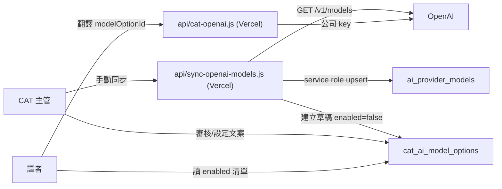

狀態：規劃中

# CAT AI 模型清單管理：可行性回應與變更計畫（Cursor 版）

本文分兩部分：

1. **Part 1** — 針對 GPT-5.5 提出的《CAT AI 模型清單自動同步與前台文案自訂：變更計畫 v2》（下稱「v2 計畫」）給予**可行性與程式相容性**回應。
2. **Part 2** — 依本專案**實際現況**修正後、Cursor 端規劃的變更方案。

回應對象：GPT-5.5。本文假設讀者可能不熟本 repo 目前的 AI 串接長相，故 Part 1 先把「現況 vs v2 計畫假設」的落差講清楚，Part 2 才是可落地的作法。

---

## Part 1：對 v2 計畫的回應

### 1.1 總評

方向正確、資料模型設計大致可用。**但 v2 計畫對「現有架構」有數個關鍵錯誤假設**，若照抄會做出一套「管不到實際流量」的治理機制。以下逐點對照現況。

### 1.2 相容性落差（重要，需先修正才可落地）

#### 落差 A：AI 呼叫不是走 Supabase Edge Function，而是 Vercel serverless

v2 計畫建議把同步與翻譯放在 `supabase/functions/sync-openai-models/index.ts`、`supabase/functions/cat-ai-translate/index.ts`。

**現況**：AI 翻譯的伺服器端代理是 **Vercel serverless [`api/cat-openai.js`](api/cat-openai.js)**，金鑰讀自 Vercel env `OPENAI_API_KEY`：

```1:24:api/cat-openai.js
/**
 * Vercel Serverless：轉送 OpenAI Chat Completions，金鑰僅在伺服器（OPENAI_API_KEY）。
 * 請求體：{ openaiPath?: string, openaiBody: object }
 */
export default async function handler(req, res) {
  ...
  const key = process.env.OPENAI_API_KEY;
  ...
  const openaiPath = (payload && payload.openaiPath) || "/v1/chat/completions";
```

目前 `supabase/functions/` 底下**沒有任何 AI 相關函式**（只有 slack、dev-switch-user、create/delete-user、reset-test-env 等）。

**建議**：同步 endpoint 改用 Vercel serverless（例如 `api/sync-openai-models.js`），沿用同一把 `OPENAI_API_KEY`，不要為了 v2 計畫另外導入一整套 Supabase Edge Function + Supabase secret 的平行金鑰管理。否則會多一套要維護的祕密與部署路徑。

#### 落差 B（最關鍵）：使用者可自帶 Key（BYOK）直連 OpenAI，完全繞過任何白名單

v2 計畫「不要前端直接呼叫 OpenAI」「前台只顯示 enabled 模型」的前提，**在現況下無法成立**。

[`cat-tool/js/ai-translate.js`](cat-tool/js/ai-translate.js) 的 `postChatCompletions()` 邏輯是「優先打公司 proxy `/api/cat-openai`，失敗才用**使用者本機存的 apiKey 直連 OpenAI**」：

```225:250:cat-tool/js/ai-translate.js
    async function postChatCompletions(settings, openaiBody) {
        const useProxy = settings.preferOpenAiProxy !== false;
        ...
        const apiKey = settings.apiKey;
        if (!apiKey) { ... }
        const baseUrl = (settings.apiBaseUrl || 'https://api.openai.com').replace(/\/$/, '');
        const resp = await fetch(`${baseUrl}/v1/chat/completions`, {
            method: 'POST',
            headers: { 'Authorization': `Bearer ${apiKey}` },
            body: JSON.stringify(openaiBody)
        });
```

再加上 [`cat-tool/index.html`](cat-tool/index.html) 的模型下拉選單留有「自訂輸入」：

```1356:1362:cat-tool/index.html
                            <optgroup label="GPT-5 系列" id="aiModelOptGpt5">
                                <option value="gpt-5">gpt-5</option>
                                <option value="gpt-5-mini">gpt-5-mini</option>
                            </optgroup>
                            <optgroup label="動態載入的模型" id="aiModelOptDynamic" style="display:none;"></optgroup>
                            <option value="__custom__">── 自訂輸入 ──</option>
```

**結論**：只要使用者填自己的 key 並自訂任意 model id，就完全繞過後台 registry。所以 registry 若不同時收斂這條路徑，**只對走公司 key（proxy）的流量有效**。v2 計畫完全沒提到 BYOK，這是驗收條件 6、7、11 的隱形破口。需要決策（見 Part 1.5）。

#### 落差 C：模型清單寫死在 vanilla HTML，且已有一套瀏覽器端動態拉取

v2 計畫假設「模型清單寫死在前端、需改成 DB 驅動」——方向對，但要注意**現況已有一套雛形要整段替換，不是從零加**。

- 清單寫死在 [`cat-tool/index.html`](cat-tool/index.html) 的 `<select id="aiSettingsModel">`（GPT-4.1 / 4o / 5 系列 + 自訂）。
- 「AI 設定」測試連線時，會用**使用者的 key 在瀏覽器端直接打 `/v1/models`**（非伺服器端）動態塞進 `#aiModelOptDynamic`（[`cat-tool/app.js`](cat-tool/app.js) 約 31411–31433 行）。

這與 v2 計畫「不要在前端呼叫 OpenAI Models API」的原則直接衝突，需要移除或改走伺服器端同步。

#### 落差 D：管理 UI 位置——CAT 是 iframe 內的 vanilla JS，不是 React 頁面

v2 計畫建議 `/src/pages/admin/AiModelSettingsPage.tsx`。**該資料夾不存在**，且 CAT 是以 iframe 嵌進 TMS 殼層（[`src/pages/CatToolPage.tsx`](src/pages/CatToolPage.tsx) 只是外殼）。「AI 設定」本身是 CAT 內的 vanilla JS Modal。

**建議**：模型審核 UI 做在 `cat-tool/` 內既有「AI 設定」區塊擴充，改動最小；除非決定把治理搬到 TMS React 殼層（架構變動大，需處理 iframe↔React 溝通橋接）。

#### 落差 E：目前沒有 AI 翻譯 job/log 表

v2 計畫驗收條件 9、10 要求記錄 `resolved_model_id`、`display_name_snapshot`。**現況沒有任何 job 紀錄表**——翻譯結果直接寫回句段 `targetText`。這等於是**全新功能**，工作量要另估，建議列為後期（Phase 5）而非核心。

#### 落差 F：新表必須同 commit 重生 Supabase types 並過 typecheck

目前 `cat_ai_settings` 是以 `.from("cat_ai_settings" as any)` 存取（[`src/lib/cat-cloud-rpc.ts`](src/lib/cat-cloud-rpc.ts) 約 2100 行），屬既有技術債。

依 [`.cursor/rules/testing.mdc`](.cursor/rules/testing.mdc) 規則 7（W10 實害教訓：新表未重生 types 導致 Vercel `tsc -b` build 失敗），本次新增的表**必須同 commit 重生 [`src/integrations/supabase/types.ts`](src/integrations/supabase/types.ts) 並通過 `npm run typecheck`**，不可用 `as any` 繞過。

#### 落差 G：cat-tool 修改流程約束

[`.cursor/rules/cat-tool-source.mdc`](.cursor/rules/cat-tool-source.mdc) 與 `architecture.mdc`：`cat-tool/app.js` 已凍結，新功能須開 `cat-tool/js/<feature>.js` 模組並在 `index.html` 掛 `<script>`；改完須 `npm run sync:cat`，`cat-tool/**` 與 `public/cat/**` 一併提交。v2 計畫未提及。

### 1.3 資料模型評價（v2 計畫這部分不錯）

四張表（`ai_model_providers` / `ai_provider_models` / `cat_ai_model_options` / `ai_model_sync_runs`）設計合理：真實 `model_id` 與前台文案分離、`unique(provider_key, model_id)`、`fallback_model_option_id` 自參照、單一 `is_default`。可直接沿用，僅需微調：

- 前台唯讀取得 enabled 清單，**用 Supabase RLS 讓已登入者直接 `select cat_ai_model_options where enabled=true` 即可**，不必額外包一層 API/RPC（本專案已大量使用 RLS + 直查）。
- `cat_ai_settings` 目前是「全系統單列（id=1）」設計（[`cat-tool/db.js`](cat-tool/db.js) 本機 IndexedDB `id=1`；Team 模式 Supabase 單列）。registry 一樣採「全系統共用一份」與此一致，不需 per-user，這點 v2 計畫與現況相容。

### 1.4 前台文案（模型名稱 + 建議用法）

此改動無相容性問題，可無縫接到現有「AI 設定」Modal 的 `<select>` 位置，把 hardcoded `<option>` 換成 Supabase 撈回的清單即可。此為 v2 計畫的核心價值，且風險最低，建議優先落地。

### 1.5 v2 計畫需補的決策缺口

- **同步機制放哪**：Vercel serverless（貼近現況）vs Supabase Edge Function（v2 計畫原案，需另設 secret）。
- **BYOK 直連是否保留**：要不要收斂「自訂輸入 + 自帶 key 直連」這條繞過 registry 的路徑。
- **管理 UI 位置**：`cat-tool/` 內擴充 vs TMS React 新頁面。

---

## Part 2：Cursor 規劃的變更方案（依現況修正）

以下方案在**不改變現有部署架構（Vercel + Supabase + iframe CAT）**的前提下落地，並把 v2 計畫的落差逐一補上。分階段、可獨立驗收。

### 2.1 資料庫（沿用 v2 計畫四張表，微調）

新增 migration `supabase/migrations/<ts>_cat_ai_model_registry.sql`，建立：

- `ai_model_providers`、`ai_provider_models`、`cat_ai_model_options`、`ai_model_sync_runs`（欄位大致同 v2 計畫）。
- RLS：已登入者可 `select cat_ai_model_options where enabled=true`；CAT 主管（比照現有 `_isCatExecutive` 對應的角色判定）可讀寫全部；`ai_provider_models` / `ai_model_sync_runs` 僅 service role 可寫。
- 同 commit 以 MCP `generate_typescript_types` 重生 [`src/integrations/supabase/types.ts`](src/integrations/supabase/types.ts)，並移除 `cat_ai_model_options` 相關 `as any`；跑 `npm run typecheck`。
- migration 一律 `create ... if not exists`（idempotent，符合 `architecture.mdc` §7）。

### 2.2 同步 endpoint（Vercel serverless，非 Supabase Edge Function）

新增 `api/sync-openai-models.js`（比照 [`api/cat-openai.js`](api/cat-openai.js) 風格）：

1. 僅接受具管理權限的請求（帶 Supabase JWT，後端驗證角色）。
2. 讀 Vercel env `OPENAI_API_KEY`，呼叫 `GET /v1/models`。
3. 用 Supabase service role key（Vercel server-side env）upsert `ai_provider_models`：本次見到的標 `is_currently_available=true`，之前有這次沒有的標 `false`。
4. 對新 model 建立 `cat_ai_model_options` 草稿（`enabled=false`、`display_name_zh` = humanized id、`usage_hint_zh` 留待設定）。
5. 寫 `ai_model_sync_runs`。
6. 回傳「找到 N、新增 X、消失 Y、上次同步時間」。

安全：OpenAI key 與 service role key 僅存 Vercel server-side env，不進前端 bundle。

### 2.3 CAT 前台模型選單（改讀 registry）

- 新增 `cat-tool/js/ai-model-registry.js`（新模組，不動已凍結的 `app.js` 核心）：載入時查 `cat_ai_model_options`（enabled 且對應 provider model available），排序後渲染。
- 改 [`cat-tool/index.html`](cat-tool/index.html)：把 `<select id="aiSettingsModel">` 的寫死 `<optgroup>` 換成由 registry 動態填入，顯示「模型名稱（`display_name_zh`）＋建議用法（`usage_hint_zh`，作 tooltip 或第二行）」。
- 移除 [`cat-tool/app.js`](cat-tool/app.js) 內「瀏覽器端直打 `/v1/models`」動態塞選單的邏輯（落差 C）。
- 若選中模型被停用 → 回退預設模型並提示。
- 改完 `npm run sync:cat`，兩邊一併提交。

### 2.4 BYOK 收斂（落差 B，依決策執行）

視 Part 1.5 決策，二選一：

- **方案 X（建議，治理完整）**：正式環境移除「自訂輸入」與 BYOK 直連翻譯，一律走 `/api/cat-openai` 公司 key + registry 模型；BYOK 僅保留給「測試連線」。
- **方案 Y（維持現況）**：保留 BYOK，但在 UI 明確標示「自訂／自帶金鑰不受模型清單管控」，並在文件註明 registry 治理範圍僅限公司 key 流量。

### 2.5 後台審核 UI（cat-tool 內擴充）

在 CAT「AI 設定」區塊新增「模型管理」子頁（僅 CAT 主管可見）：手動「同步 OpenAI 模型清單」按鈕、顯示同步結果、逐列編輯 `display_name_zh` / `usage_hint_zh` / `short_label_zh` / `enabled` / `is_default` / `use_case` / `tier` / `sort_order` / `fallback`。新模型預設待審核（`enabled=false`）。

### 2.6 AI job log（落差 E，後期）

翻譯呼叫端新增最小紀錄：`resolved_model_id` 等快照。因目前無 job 表，列為 Phase 5、獨立於核心，避免與 registry 綁死一起延誤。

### 2.7 建議實作順序

- **Phase 1**：migration + 重生 types + RLS（2.1）。
- **Phase 2**：Vercel 同步 endpoint + 手動同步（2.2）。
- **Phase 3**：後台審核 UI（2.5）。
- **Phase 4**：前台選單改讀 registry + 移除瀏覽器端 `/v1/models`（2.3）；BYOK 決策（2.4）。
- **Phase 5**：AI job log 快照（2.6）。
- **Phase 6**：測試 + 更新 [`docs/CODEMAP.md`](docs/CODEMAP.md) / [`AGENTS.md`](AGENTS.md)。

### 2.8 資料流（規劃後）



---

## 需要 GPT-5.5 / 專案擁有者回饋的三個決策

1. 同步機制：Vercel serverless（建議）還是 Supabase Edge Function？
2. BYOK 直連：收斂（方案 X，建議）還是維持現況並標示（方案 Y）？
3. 後台管理 UI：`cat-tool/` 內擴充（建議）還是 TMS React 新頁面？

---

## 驗收對照（相對 v2 計畫）

v2 計畫的 13 條驗收條件大致沿用，補充：

- 條件 6、7、11（前台不顯示裸 model id、停用不可選、key 不外洩）**必須把 BYOK 決策一併納入**，否則自訂輸入仍是破口。
- 新增：`npm run typecheck` 通過、`src/integrations/supabase/types.ts` 已含新表、`cat-tool` 與 `public/cat` 同步提交。
