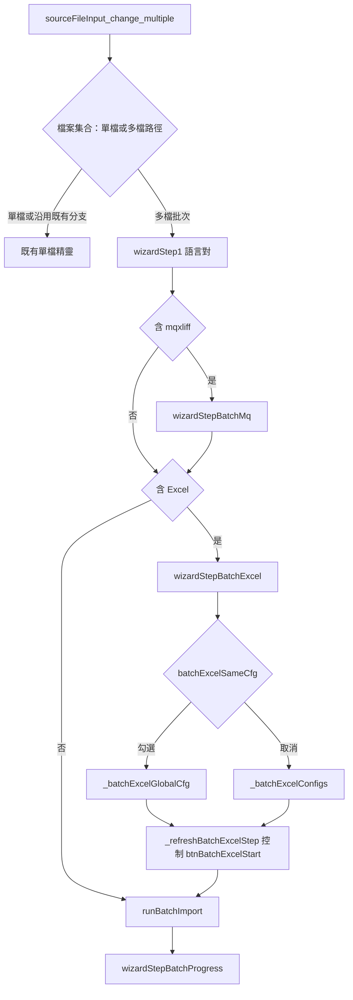

# CAT 批次匯入作業檔精靈：構想、實作與驗收備忘

本文件整理 **2026-05 前後** 關於「專案詳情 → 匯入」**多檔批次流程**的產品構想、實作對照、開發時序、已修問題與手動測試方式，供維運與後續接手對照程式（[`cat-tool/app.js`](../cat-tool/app.js)、[`cat-tool/index.html`](../cat-tool/index.html)、[`cat-tool/style.css`](../cat-tool/style.css)）。改動 CAT 資產後請依 [`AGENTS.md`](../AGENTS.md) 於專案根目錄執行 `npm run sync:cat`，並一併提交 `cat-tool/` 與 `public/cat/`。

---

## 一、功能構想（產品）

1. **多檔選取**  
   匯入來源 `<input type="file">` 支援 **multiple**，一次選入多個 CAT 作業檔（含 XLIFF／mqxliff、PO、Excel 等既有格式組合）。

2. **精靈步驟泛化**  
   `showWizardStep` 改為以 `.wizard-step` 集中切換，新增批次專用步驟節點，例如：
   - `wizardStepBatchMq`：多個 **mqxliff** 各自選角色（T／Allow／R1…）。
   - `wizardStepBatchExcel`：多個 **Excel** 的欄位對應（全域同一組 vs 每檔各自設定）。
   - `wizardStepBatchProgress`：逐檔匯入進度與摘要。

3. **語言對與格式驗證**  
   維持既有單檔語意；批次時對每一檔套用相同閘門（不支援的檔名／副檔名、語言對不符等）。

4. **Excel 欄位設定模式**  
   - **「全部使用相同欄位設定」**（預設勾選）：以清單中**第一個 Excel** 開欄位編輯預覽；儲存後 `_batchExcelGlobalCfg` 生效；每檔匯入時仍讀取**該檔自己的工作簿**（不是只匯第一檔）。  
   - **取消勾選**：改為每檔個別 `_batchExcelConfigs`（`Map<file, config>`）。

5. **狀態清理規則（避免殘留「已設定」）**  
   - 勾回「全部相同」：清空**個別檔**設定與各列「✓ 設定完畢」。  
   - 取消「全部相同」：清空**全域**設定與全域「✓ 設定完畢」。  
   （與 `_refreshBatchExcelStep` 的啟用條件一致。）

6. **開始匯入按鈕**  
   `#btnBatchExcelStart` 是否可按由 `_refreshBatchExcelStep()` 統一計算：全域模式須 `_batchExcelGlobalCfg`；個別模式須**每一個** Excel 檔都在 `_batchExcelConfigs` 内。  
   **視覺**：`disabled` 時須呈現反灰（見 [`cat-tool/style.css`](../cat-tool/style.css) `.primary-btn:disabled`），避免與可點主色按鈕混淆。

7. **實際匯入**  
   `runBatchImport` 逐檔呼叫既有單檔路徑（例如 `_importSingleExcelFile`、`xliffImportCtx({ suppressWizardHide: true })` 等），更新進度文案與錯誤／成功摘要。

8. **刻意不做（對話收斂）**  
   **不在**「儲存欄位設定」時依「原文欄是否整欄空白」阻擋匯入或標註檔名／工作表（單檔與批次皆不實作）。若未來要加，應另開規格與驗收項。

---

## 二、主要程式錨點（維運）

### 2.1 `index.html` DOM／ID

| 項目 | 說明 |
|------|------|
| `#sourceFileInput` | `type="file"`、`multiple`、`accept` 含 xlsx／xlf／mqxliff／po 等 |
| `#wizardStepBatchMq` | 批次 mqxliff 角色表（動態填入） |
| `#wizardStepBatchExcel` | 批次 Excel 欄位設定 UI（動態填入）；內含 `#batchExcelSameCfg`、`#btnBatchExcelGlobalCfg`、`#spanBatchExcelGlobalStatus`、`#btnBatchExcelCancel`、`#btnBatchExcelStart`、各列 `#batchExcelStatus-{i}` |
| `#wizardStepBatchProgress` | 批次匯入進度與摘要 |
| `.wizard-step` | `showWizardStep` 以類別切換顯示／隱藏 |

### 2.2 `app.js` 函式與狀態變數（代表性）

| 類別 | 符號 |
|------|------|
| 精靈切換 | `showWizardStep` |
| 批次 Excel | `_refreshBatchExcelStep`、`showBatchExcelConfigModal`、`onBatchExcelSameCfgToggle`、`_openBatchExcelColumnEditor` |
| 批次 mqxliff | `showBatchMqRoleModal`（及相關 `_batchMqRoles` 等，依實際宣告為準） |
| 狀態 | `_batchExcelGlobalCfg`、`_batchExcelConfigs`（`Map`）、`_batchExcelModalExcelFiles`、`_batchExcelDataStore`、`_batchExcelConfigMode`、`_batchExcelConfigTarget`、`_batchExcelGlobalSheetMode` |
| 匯入 | `runBatchImport`、`_importSingleExcelFile`、`xliffImportCtx({ suppressWizardHide: true })` |

### 2.3 對照表（摘要）

| 主題 | 位置（`cat-tool/`） |
|------|---------------------|
| 精靈 HTML 骨架、多選 input、`wizardStepBatch*` | `index.html` |
| 批次狀態與 Excel／mq 批次 UI | `app.js` |
| 重新計算 Excel 步驟 UI 與「開始匯入」`disabled` | `app.js` → `_refreshBatchExcelStep` |
| 批次 Excel 設定畫面建構與解析 `Promise` | `app.js` → `showBatchExcelConfigModal` |
| 「全部相同」勾選時清空／同步按鈕狀態 | `app.js` → `onBatchExcelSameCfgToggle`（綁 `change` + `input`） |
| 開啟欄位編輯（讀取緩衝、塞入精靈第二步） | `app.js` → `_openBatchExcelColumnEditor` |
| 批次匯入主迴圈 | `app.js` → `runBatchImport` |
| XLIFF 匯入不強制關閉精靈 overlay | `app.js` → `xliffImportCtx` 選項 `suppressWizardHide` |
| 主色／次要／危險／成功按鈕的 `disabled` 反灰與游標 | `style.css` → `.primary-btn` 等之 `:disabled`、`:hover:not(:disabled)`；全域 `button:not(:disabled)`／`button:disabled` 游標 |

更短的路徑索引見 [`CODEMAP.md`](./CODEMAP.md)「CAT：批次匯入作業檔精靈」。

---

## 三、精靈流程（概念）

---

## 四、實作清單對照（開發 todo → 程式錨點 → Commit）

以下為本功能開發過程中的工作項拆票與落地對照；**主線皆於 `3348922` 一次提交**（`cat-tool/app.js` 大量新增、`index.html` 小改）。

| Todo ID（工作項） | 程式／標記錨點 | Commit |
|-------------------|----------------|--------|
| `html-multiselect` | `#sourceFileInput` 加 `multiple`、label 補說明、`wizardStepBatchMq`／`BatchExcel`／`BatchProgress` | `3348922` |
| `app-showwizardstep` | `showWizardStep` 改為 `querySelectorAll('.wizard-step')` 泛化 | `3348922` |
| `app-state-vars` | `_batchExcelConfigMode`、`_batchExcelDataStore`、`_batchExcelConfigs`、`_batchMqRoles` 等批次狀態 | `3348922` |
| `app-read-helper` | `_readExcelConfigFromStep2()`（或等效 helper） | `3348922` |
| `app-wizfinish-branch` | `btnWizFinish`／`btnWizBack1` 頂端批次子模式分支 | `3348922` |
| `app-source-change` | `sourceFileInput.change` 改為批次入口（格式驗證 → 語言對 → mq → excel → 匯入） | `3348922` |
| `app-batch-mq-modal` | `showBatchMqRoleModal`、動態填充 `wizardStepBatchMq` | `3348922` |
| `app-batch-excel-modal` | `showBatchExcelConfigModal`、`wizardStepBatchExcel`、`_refreshBatchExcelStep` | `3348922` |
| `app-import-single-excel` | `_importSingleExcelFile(file, config, langChoice)` 自既有 finish 邏輯抽出 | `3348922` |
| `app-run-batch` | `runBatchImport`、進度／摘要 | `3348922` |
| `app-xliff-ctx` | `xliffImportCtx({ suppressWizardHide: true })` | `3348922` |
| `sync-cat` | 提交前 `npm run sync:cat`，`public/cat` 與 `cat-tool` 同步 | `3348922`（慣例） |

後續修正另見第五節。

---

## 五、開發過程時序

### 5.1 主線交付（`3348922`，2026-05-01）

- **範圍**：約 `cat-tool/app.js` +591／−87 行、`cat-tool/index.html` +14 行級別的改動（以 `git show --stat 3348922` 為準）。
- **內容摘要**：多檔選取、三個批次 wizard 節點、mqxliff 每檔角色、Excel 全域／逐檔欄位、`runBatchImport`、單檔匯入抽出、`suppressWizardHide` 避免批次中途關掉 overlay。

### 5.2 `ReferenceError: label is not defined`（`e11bbe0`）

- **現象**：批次流程開啟 Excel「欄位設定」時，觸發按鈕暫時改為載入文案的路徑使用了未定義變數 `label`。  
- **修正**：`_openBatchExcelColumnEditor` 內改為字面 **`'讀取中…'`**（與 `finally` 還原按鈕文字邏輯一致）。  
- **Commit**：`e11bbe0`。

### 5.3 已討論但未採納：原文範圍「全空白」阻擋

- **構想**：曾在對話中討論是否在「儲存欄位設定」時偵測原文欄是否整欄空白，並阻擋或標示檔名／工作表（意圖避免誤對應）。  
- **決策**：**不實作**（單檔與批次共用之路徑亦不強加）。理由簡述：避免規格膨脹與誤擋（例如工作表選取與預覽檔不一致時之邊界）；若日後有明確誤匯案例，再開獨立規格與驗收。  
- **文件**：與第一節第 8 點一致。

### 5.4 協作模式插曲（Ask／Agent）

- 某一輪助理在 **Ask 模式**下嘗試直接修改 `cat-tool/app.js`，工具拒絕寫檔，磁碟上未留下該次 patch。  
- **後續**：使用者切換 **Agent 模式**後才完成勾選同步修正與文件入庫。維運時若以對話紀錄對照程式，應以 **實際 commit** 為準，不以對話內嵌程式碼區塊為唯一真相來源。

### 5.5 「全部相同」取消勾選後「開始匯入」仍可按（`1d82a97`）

- **現象**：先勾「全部使用相同欄位設定」並完成全域欄位設定後，**取消勾選**，預期須改為每檔各自設定，但「開始匯入」仍維持可點。  
- **原因**：僅監聽 `change`，且 handler 內以 `querySelector(...).checked` 再讀 DOM；部分瀏覽器／操作順序下與事件目標狀態不同步，未能穩定觸發 `_refreshBatchExcelStep` 與資料清理後的按鈕狀態。  
- **修正**：  
  - 抽出 `onBatchExcelSameCfgToggle(e)`，以 **`!!e.target.checked`** 為準。  
  - 同時監聽 **`change`** 與 **`input`**。  
  - 保留資料清理：勾選→清 `_batchExcelConfigs` 與各列狀態；取消→清 `_batchExcelGlobalCfg` 與全域狀態列；結尾一律 **`_refreshBatchExcelStep()`**。  
- **Commit**：`1d82a97`（並同步 `public/cat/app.js` 經 `npm run sync:cat`）。

### 5.6 「開始匯入」已 `disabled` 卻仍像可點（樣式）

- **現象**：`_refreshBatchExcelStep` 已設 `startBtn.disabled = !ok`，但 `.primary-btn` 未定義 `:disabled`，畫面上仍與啟用態同色，使用者誤以為未鎖定。  
- **修正**：於 `style.css` 為 `.primary-btn`／`.secondary-btn`／`.danger-btn`／`.success-btn` 補 `:disabled`（並將 `:hover` 改為 `:hover:not(:disabled)`）；`button` 預設游標改為僅 `:not(:disabled)` 使用 `pointer`。  
- **Commit**：`9d739b4`。

---

## 六、手動測試建議（驗收）

| 步驟 | 驗收重點 | 主要對應 Commit |
|------|-----------|-----------------|
| 1 | **批次多檔**：選 2+ 作業檔（含至少一個 Excel），走完語言對 → mqxliff（若有）→ Excel 設定 → 進度／摘要 | `3348922` |
| 2 | **全域欄位**：勾「全部使用相同欄位設定」，只開全域「欄位設定」一次 →「開始匯入」啟用；匯入後各 Excel 皆有資料（非僅第一檔） | `3348922` |
| 3 | **切換模式**：全域設定完成後 **取消**「全部相同」→「開始匯入」**disabled**（且按鈕應**視覺反灰**）；逐檔「欄位設定」並儲存至最後一檔 →「開始匯入」**enabled** | `1d82a97` + `style.css` `:disabled` |
| 4 | **切回全域**：再次勾選「全部相同」→ 個別「✓ 設定完畢」清除；須重新完成全域設定才可匯入 | `3348922` + `1d82a97`（清理＋刷新） |
| 5 | **取消**：批次流程「取消」終止並回到合理畫面（與既有精靈一致） | `3348922` |
| — | **回歸**：開批次 Excel「欄位設定」時按鈕顯示「讀取中…」不拋 `ReferenceError` | `e11bbe0` |

---

## 七、已知限制與非目標

1. **全域欄位預覽**：以清單中**第一個 Excel** 作欄位編輯預覽；若各檔欄位排版差異大，應取消「全部相同」改逐檔設定。  
2. **原文全空白阻擋**：非目標，見第一節第 8 點與第五節 5.3。  
3. **取消與資料一致性**：使用者於精靈中途「取消」不意味已開始的 DB 寫入會整批回滾；`runBatchImport` 為逐檔處理，已成功的檔案不會因後續檔失敗而自動還原（與一般單檔匯入一致之務實行為）。

---

## 八、文件與規範交叉引用

- 單一來源與 sync：`AGENTS.md`、`cat-tool/README.md`。  
- 交接摘要表：`HANDOFF.md`「其他近期落地」（含 `3348922`、`e11bbe0`、`1d82a97`）。  
- 功能路徑：`CODEMAP.md`。  
- 介面用語（避免簡中「匹配」等）：`CAT_VIEW_SPEC.md`（該文件內對 TM 否定表述之約定）。

---

## 九、修訂紀錄

| 日期（約） | 內容 |
|------------|------|
| 2026-05-01 | 初稿：構想、錨點、`label` 錯誤、「開始匯入」勾選同步、驗收項、「原文全空白阻擋」不實作。 |
| 2026-05-01 | 程式：`3348922` 批次匯入主線；`e11bbe0` `label` → `'讀取中…'`；`1d82a97` `onBatchExcelSameCfgToggle`（`change` + `input`、`e.target.checked`）。 |
| 2026-05-01 | 擴寫：流程圖、`index.html`／狀態變數錨點、todo→commit 對照表、開發時序（含未採納項目與 Ask／Agent 插曲）、測試與 commit 對應欄、已知限制與非目標（提交 `a594f90`；[`HANDOFF.md`](./HANDOFF.md)「其他近期落地」已列 `a594f90`）。 |
| 2026-05-01 | `style.css`：主色等按鈕 `:disabled` 反灰與游標；第五節 5.6、驗收步驟 3 補視覺說明（`9d739b4`）。 |
