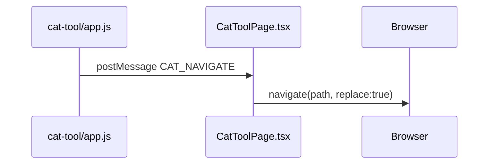
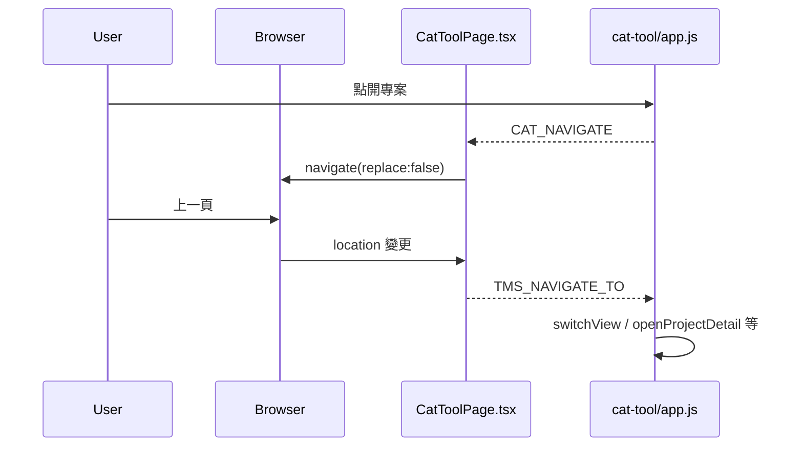

# CAT 深連結與歷史導覽修正（2026-06）

## 背景與目標

CAT 嵌入 TMS 時，使用者希望：

1. **每個畫面都有可分享、可書籤的網址**（專案、檔案、TM、TB、AI 頁等）
2. **瀏覽器上一頁／下一頁**能正確切換 CAT 內畫面
3. **重新整理**或直接貼上網址後，能穩定回到同一畫面，而非誤跳儀表板或其他頁

本文件記錄現況架構、問題根因、修正方案與驗收步驟。

---

## 現況架構（修正前）

### 雙層路由

| 層級 | 技術 | 說明 |
|------|------|------|
| **TMS 外殼** | React Router `BrowserRouter` | 路徑如 `/cat/team/projects/:id` |
| **CAT 本體** | Vanilla JS `switchView()` + DOM `hidden` | 畫面切換不直接操作 History API |

### 單向橋接

- iframe 的 `src` 僅在**首次掛載**時依外層 URL 組 query（`catView`、`catProjectId` 等），之後畫面切換不重載 iframe。
- CAT 內 `persistCatRoute()` 會寫 `sessionStorage` 並 `postMessage` 給父頁。
- 父頁 `buildCatPath()` / `parseCatViewParams()` 已支援各畫面 URL 格式（見下表）。

### 問題根因

1. **`navigate(..., { replace: true })`**：每次 CAT 切畫面都覆寫同一筆歷史，上一頁無 CAT 內紀錄可回。
2. **無反向通道**：使用者按上一頁時外層 URL 變了，iframe 未收到指令，畫面與網址不同步。
3. **重新整理偶發跳錯頁**：外層 URL 與 iframe 內部狀態若曾不同步，或初始還原與 `enforceTeamRoleLayout` 等訊息競態，可能短暫或最終顯示儀表板。

---

## 修正方案（雙向橋接）

### 1. 外層改為堆疊歷史

[`src/pages/CatToolPage.tsx`](../src/pages/CatToolPage.tsx)：

- `CAT_NAVIGATE` 處理改為 `navigate(nextPath, { replace: false })`。
- 以 `navigatingFromCatRef` 標記「此次 URL 變化來自 CAT」，避免反向同步迴圈。

### 2. 父頁 → iframe 反向同步

外層 `location` 變化且**非** CAT 主動觸發時（上一頁／下一頁、手動改網址）：

- `parseCatViewParams()` 還原 payload
- `postMessage({ type: 'TMS_NAVIGATE_TO', payload })` 給 iframe

### 3. iframe 接收 `TMS_NAVIGATE_TO`

[`cat-tool/app.js`](../cat-tool/app.js) 在既有 `message` listener 新增分支：

- 僅在 `catTmsParentRouteSyncReady` 為 true 後處理（避免與 `restoreCatRouteFromSession` 競態）
- 呼叫與 `restoreCatRouteFromSession` 相同的導覽函式（`openProjectDetail`、`openEditor` 等）

---

## 已支援的 URL 格式

離線版前綴：`/cat/offline`；團隊版：`/cat/team`。

| 畫面 | 路徑範例 |
|------|----------|
| 儀表板 | `/cat/team` |
| 專案清單 | `/cat/team/projects` |
| 個別專案（檔案列表） | `/cat/team/projects/:projectId` |
| 個別檔案（編輯器） | `/cat/team/files/:fileId?p=:projectId`（`p` 選填但建議帶上） |
| TM 清單 | `/cat/team/tm` |
| 個別 TM | `/cat/team/tm/:tmId` |
| TB 清單 | `/cat/team/tb` |
| 個別 TB | `/cat/team/tb/:tbId` |
| AI 準則 | `/cat/team/ai-guidelines` |
| AI 設定 | `/cat/team/ai-settings` |
| AI 範例 | `/cat/team/ai-examples` |

離線版將 `team` 改為 `offline` 即可，結構相同。

對應程式：`parseCatViewParams()`、`buildCatPath()`（`CatToolPage.tsx`）；iframe 啟動時 `restoreCatRouteFromSession()`（`cat-tool/app.js`）。

---

## 程式觸點

| 檔案 | 職責 |
|------|------|
| `src/pages/CatToolPage.tsx` | 外層 URL ↔ iframe query 轉換；`CAT_NAVIGATE` / `TMS_NAVIGATE_TO` |
| `cat-tool/app.js` | `persistCatRoute()`、`restoreCatRouteFromSession()`、`TMS_NAVIGATE_TO` 處理 |
| `public/cat/` | `npm run sync:cat` 同步產物，須與 `cat-tool/` 一併提交 |

---

## 驗收步驟（白話）

### 團隊版 `/cat/team`

1. 開啟 CAT → 點進任一專案 → 確認網址為 `/cat/team/projects/（專案編號）`。
2. 再點開一個檔案 → 網址應為 `/cat/team/files/（檔案編號）?p=（專案編號）`。
3. 按瀏覽器**上一頁** → 應回到該專案的檔案列表，畫面與網址一致。
4. 再按**上一頁** → 應回到專案清單（或你實際經過的上一頁）。
5. 在編輯器畫面按 **F5 重新整理** → 應仍停在同一檔案編輯器，而非儀表板。
6. 複製目前網址，新分頁貼上 → 應直接開到同一畫面。
7. 側欄進入 **TM** → 點某一筆 → 網址 `/cat/team/tm/（編號）`；上一頁可回 TM 清單。
8. 重複 7 於 **TB**、**AI 相關頁**（若帳號可見）。

### 離線版 `/cat/offline`

9. 將上述 1～6 在 `/cat/offline` 下重複（無需登入團隊指派邏輯）。

### 異常情境

10. 開啟已刪除或無權限的檔案深連結 → 應 toast 提示並回到儀表板（既有 `restoreCatRouteFromSession` 行為，不應白屏）。

---

## 維護邊界

- 新增 CAT 畫面（新 `view-section`）時，須同步更新：`persistCatRoute`、`restoreCatRouteFromSession`、`TMS_NAVIGATE_TO` 處理、`parseCatViewParams`、`buildCatPath`。
- 勿在 iframe 內直接使用 `pushState`；維持「CAT 通知父頁、父頁管 History」的單一真相。
- 修改 `cat-tool/app.js` 後執行 `npm run sync:cat` 並提交 `public/cat/`。

---

## 相關文件

- [`docs/LMS_CAT_SHELL_SIDEBAR_UX_2026-05.md`](LMS_CAT_SHELL_SIDEBAR_UX_2026-05.md) — LMS 殼層與 CAT iframe 側欄
- [`docs/CODEMAP.md`](CODEMAP.md) — 路徑對照
- [`AGENTS.md`](../AGENTS.md) — CAT 單一來源與 sync 慣例
