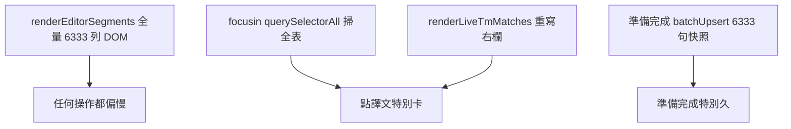

# CAT 編輯器大檔效能問題 — 調查與修正規劃（2026-06）

> 本文件目的：記錄大檔（六千句級）編輯器**全面遲鈍**的症狀、根因、已排除假設、分階修正與驗收。格式對照 [`CAT_SCROLL_INSTANT_NAVIGATION_2026-06.md`](./CAT_SCROLL_INSTANT_NAVIGATION_2026-06.md)。

---

## 背景與症狀

- **樣本**：`54316_02_WORDNT_RiftboundCoreRulesRUP4Sta_v2_zh_TW.docx_zho-TW.mqxliff`（**6333 句**；6126 句含 `<mq:insertedmatch>`）。
- **使用者回報（2026-06-28）**：不只捲動慢；**點譯文、Ctrl+G 跳行、準備完成**等幾乎所有操作都「非常非常慢」。
- **對照實驗**：專案**移除 TM** 並關檔重開後，體感**幾乎無改善** → 主因**不是**即時 TM 比對。

---

## 根因分析

### 1. 全量 DOM（主因 · 治本需 Phase 2）

[`cat-tool/app.js`](../cat-tool/app.js) `renderEditorSegments()` 對 `currentSegmentsList` **每一句**建立完整列（原文／譯文 `contenteditable`、tag pill、多欄）。6333 句 ≈ 數萬 DOM 節點；瀏覽器版面與事件成本使**整頁**互動變慢。

相關紀錄：[`CAT_LOCKED_SEGMENT_CONFIRM_UX_2026-06.md`](./CAT_LOCKED_SEGMENT_CONFIRM_UX_2026-06.md) §6–§7（3381 句時已記載；6333 句更嚴重）。

### 2. focusin 熱路徑掃全表（主因 · Phase 1 目標）

每列 `focusin`（約 L22776）原先：

- `querySelectorAll('.grid-data-row')` 移除／設定 `active-row`（**全表**）
- 再 `querySelectorAll` 同步 `selected-row`（**全表**）
- `syncSelectedRowAbutmentTopClass` 再掃全表
- 同步呼叫 `renderLiveTmMatches`（重寫右欄多區 `innerHTML`）

點譯文 = 上述每輪都跑 → 大檔體感「點一下卡一下」。

### 3. 準備完成／Workflow 快照（獨立問題 · Phase 3）

[`enqueueStageSnapshot`](../cat-tool/app.js) → [`CatStageSnapshot.batchUpsertSnapshots`](../cat-tool/js/stage-snapshot.js) 一次處理**全檔句段**（6333 句）。與 TM、focus 無關；按「準備完成」慢屬預期，需分批與進度 UI。

### 已排除

| 假設 | 結果 |
|------|------|
| Supabase migration 未 push | 已 push |
| TM 即時比對拖慢一切 | 移除 TM + 重開仍慢 |
| memoQ 預翻讀回 bug | `8e187d3` 已修；驗收通過（見 [`CAT_MQXLIFF_INSERTED_MATCH_UI_2026-06.md`](./CAT_MQXLIFF_INSERTED_MATCH_UI_2026-06.md)） |

---

## 分階修正規劃

| Phase | 範圍 | 狀態 |
|-------|------|------|
| **Phase 1** | focus 增量更新 active/selected；`syncSelectedRowAbutmentTopClass` 僅清既有 abut class；`scheduleRenderLiveTmMatches` debounce；預翻面板同句快取 | **已實作**（見下方 §Phase 1） |
| **Phase 2** | **虛擬捲動**（可見 ~40 列）；跳行／多選／協作／假游標整合 | 規劃中 |
| **Phase 3** | Workflow 快照分批；減少 `renderEditorSegments` 全表重建 | 規劃中 |

---

## Phase 1 實作摘要

**Commit**：`2d32f1b`

**觸點**（[`cat-tool/app.js`](../cat-tool/app.js)）：

| 項目 | 說明 |
|------|------|
| `resetGridRowUiTracking` | `renderEditorSegments` 清空 `gridBody` 時重設 active/selected DOM 追蹤 |
| `setActiveGridRow` | 僅對上一列／新列切換 `active-row`，不掃全表 |
| `syncSelectedRowClassesFromIds` | 依 `selectedRowIds` 以 `data-seg-id` 查單列更新 class |
| `syncSelectedRowAbutmentTopClass` | 先 `querySelectorAll('.selected-abut-top')` 清除，再掃可見列（少一次全表 remove） |
| `scheduleRenderLiveTmMatches` | ~150ms debounce；`renderMqInsertedMatchPanel` 仍即時 |
| `_mqPanelLastSegId` | 同句 skip 預翻 diff 重算 |

**預期體驗**：大檔點譯文、換句、Ctrl+G 後右欄更新**明顯較順**；**無法**徹底消除 6333 列 DOM 帶來的上限（需 Phase 2）。

**風險控管**：多選／批次路徑仍可用全表或 `syncSelectedRowClassesFromIds`；Shift 多選錨點問題見 [`CAT_LOCKED_SEGMENT_CONFIRM_UX_2026-06.md`](./CAT_LOCKED_SEGMENT_CONFIRM_UX_2026-06.md) §7（與 Phase 1 無關，未修）。

---

## Phase 2 規劃（虛擬捲動）

### 必驗觸點

- Ctrl+G／`_qaJumpToSegment`、QA 跳句（[`CAT_SCROLL_INSTANT_NAVIGATION_2026-06.md`](./CAT_SCROLL_INSTANT_NAVIGATION_2026-06.md)）
- Shift 多選、批次確認／取代
- 協作 `emitCollabFocus`、遠端編輯高亮
- 假游標 [`cat-tool/js/cat-fake-caret.js`](../cat-tool/js/cat-fake-caret.js)
- 篩選 `runSearchAndFilter`、`sfRowRenderCache`
- F8 tag、TB 原文 inline 提示

### 風險

- 畫面外句段不在 DOM → 瀏覽器 Ctrl+F 找不到（可接受；沿用 CAT 尋找／篩選）
- 跳行失敗或焦點錯列 → **必測** regression

---

## Phase 3 規劃（Workflow 與整表重繪）

- `batchUpsertSegmentSnapshots` 改分批（例 200～500 句）+ 進度 toast
- 盤點 `renderEditorSegments()` 後漏接 `runSearchAndFilter()` 之路徑（見 [`CAT第四波主記錄.md`](./CAT第四波主記錄.md)）

---

## 驗收清單（Riftbound 6333 句）

### Phase 1（本輪）

1. 開啟 `54316_...Riftbound...mqxliff`；硬重新整理。
2. **連點 10 句譯文**：體感明顯快於 Phase 1 前（仍可能不如小檔順）。
3. **Ctrl+G** 輸入第 82 句編號：可跳轉；**memoQ 預翻記錄**仍正常（`8e187d3`）。
4. **Shift 多選** 序號欄 5～15 句：外框無明顯錯位（已知 Shift 錨點 bug 另計）。
5. **準備完成**：仍可能較久 → **非 Phase 1 目標**（Phase 3）。

### Phase 2（日後）

- 捲動與點選在 6333 句下接近小檔體感
- 上述必驗觸點 regression 通過

---

## 相關文件

- [`CAT_MQXLIFF_INSERTED_MATCH_UI_2026-06.md`](./CAT_MQXLIFF_INSERTED_MATCH_UI_2026-06.md) — 預翻顯示（已驗收）
- [`CAT_LOCKED_SEGMENT_CONFIRM_UX_2026-06.md`](./CAT_LOCKED_SEGMENT_CONFIRM_UX_2026-06.md) §7 — 大檔／虛擬捲動待辦
- [`bug-report_team-large-file-editor-stuck-loading_2026-05-26.md`](./bug-report_team-large-file-editor-stuck-loading_2026-05-26.md) — 大檔**開檔**卡住（已修；與本檔**編輯中**卡頓不同）

---

*文件建立：2026-06-28。*
