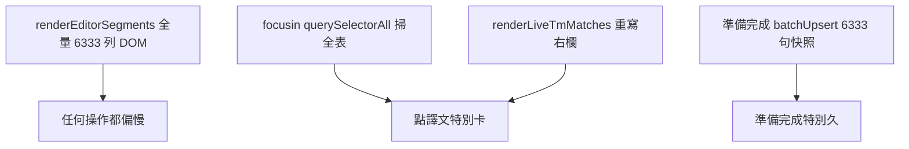
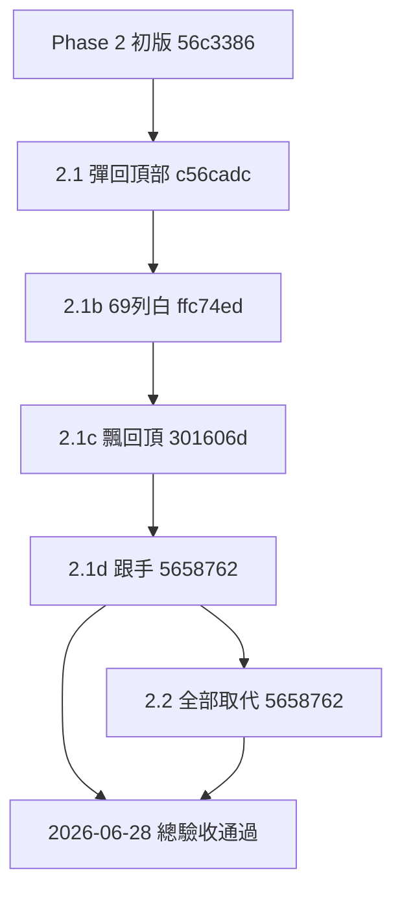
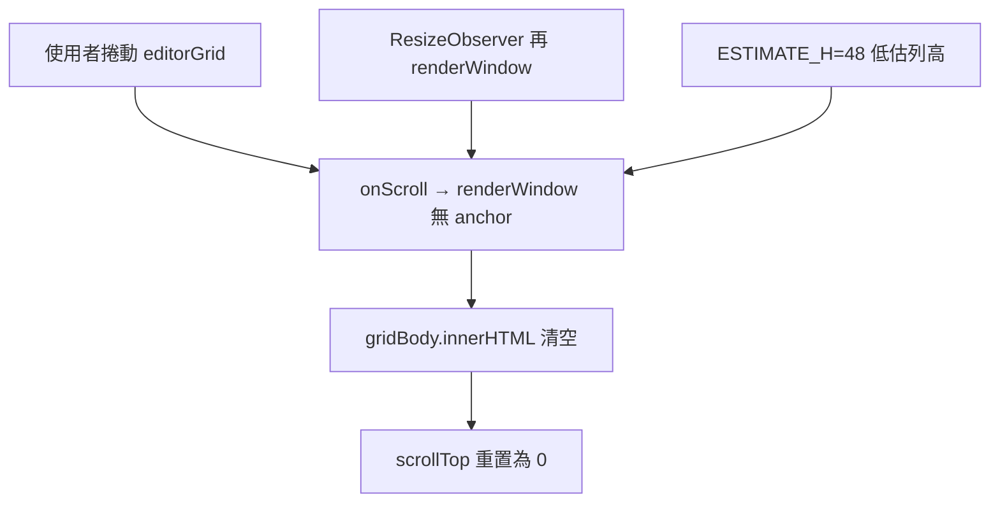
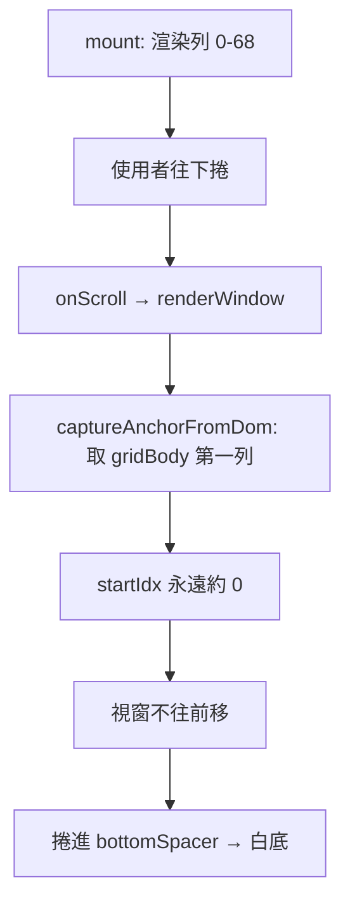
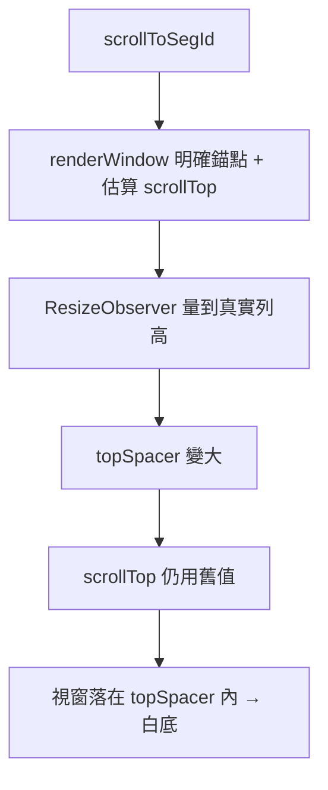
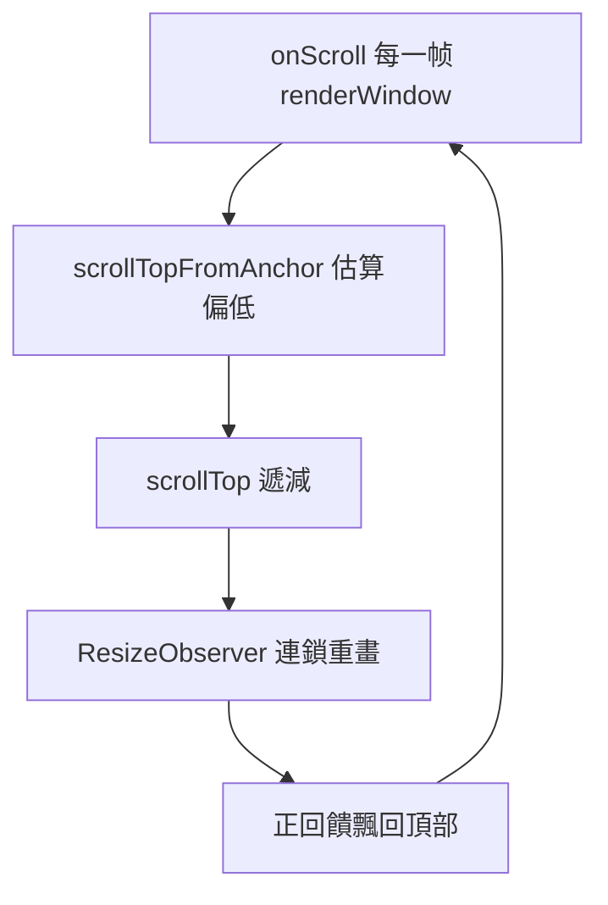

# CAT 編輯器大檔效能問題 — 調查與修正規劃（2026-06）

> 本文件目的：記錄大檔（六千句級）編輯器**全面遲鈍**的症狀、根因、分階修正、**開發時序**與**驗收**。Phase 2 虛擬捲動已於 **2026-06-28** 由專案擁有者驗收通過（Riftbound 6333 句）。格式對照 [`CAT_SCROLL_INSTANT_NAVIGATION_2026-06.md`](./CAT_SCROLL_INSTANT_NAVIGATION_2026-06.md)。

---

## 背景與症狀

- **樣本**：`54316_02_WORDNT_RiftboundCoreRulesRUP4Sta_v2_zh_TW.docx_zho-TW.mqxliff`（**6333 句**；6126 句含 `<mq:insertedmatch>`）。
- **使用者回報（2026-06-28）**：不只捲動慢；**點譯文、Ctrl+G 跳行、準備完成**等幾乎所有操作都「非常非常慢」。
- **對照實驗**：專案**移除 TM** 並關檔重開後，體感**幾乎無改善** → 主因**不是**即時 TM 比對。

---

## 根因分析



### 1. 全量 DOM（主因 · 治本需 Phase 2）

[`cat-tool/app.js`](../cat-tool/app.js) `renderEditorSegments()` 對 `currentSegmentsList` **每一句**建立完整列（原文／譯文 `contenteditable`、tag pill、多欄）。6333 句 ≈ 數萬 DOM 節點；瀏覽器版面與事件成本使**整頁**互動變慢。

相關紀錄：[`CAT_LOCKED_SEGMENT_CONFIRM_UX_2026-06.md`](./CAT_LOCKED_SEGMENT_CONFIRM_UX_2026-06.md) §6–§7（3381 句時已記載；6333 句更嚴重）。

### 2. focusin 熱路徑掃全表（主因 · Phase 1 目標）

每列 `focusin`（約 L22776）原先：

- `querySelectorAll('.grid-data-row')` 移除／設定 `active-row`（**全表**）
- 再 `querySelectorAll` 同步 `selected-row`（**全表**）
- `syncSelectedRowAbutmentTopClass` 再掃全表
- 同步呼叫 `renderLiveTmMatches`（重寫右欄多區 `innerHTML`）

點譯文 = 上述每輪都跑 → 大檔體感「點一下卡一下」。

### 3. 準備完成／Workflow 快照（獨立問題 · Phase 3）

[`enqueueStageSnapshot`](../cat-tool/app.js) → [`CatStageSnapshot.batchUpsertSnapshots`](../cat-tool/js/stage-snapshot.js) 一次處理**全檔句段**（6333 句）。與 TM、focus 無關；按「準備完成」慢屬預期，需分批與進度 UI。

### 已排除

| 假設 | 結果 |
|------|------|
| Supabase migration 未 push | 已 push |
| TM 即時比對拖慢一切 | 移除 TM + 重開仍慢 |
| memoQ 預翻讀回 bug | `8e187d3` 已修；驗收通過（見 [`CAT_MQXLIFF_INSERTED_MATCH_UI_2026-06.md`](./CAT_MQXLIFF_INSERTED_MATCH_UI_2026-06.md)） |

---

## 分階修正規劃

| Phase | 範圍 | 狀態 |
|-------|------|------|
| **Phase 1** | focus 增量更新 active/selected；`scheduleRenderLiveTmMatches` debounce | **已驗收** `2d32f1b` |
| **Phase 2 初版** | 虛擬捲動（~45 列 + buffer；門檻 >800 句） | **已取代**（初版有缺陷 `56c3386`；後續 2.1～2.1d 修正） |
| **Phase 2.1** | scroll 鎖 + 錨點保留 + 跳行修正 | **已納入總驗收** `c56cadc` |
| **Phase 2.1b** | 視窗頂端錨點 + scrollTop 推窗 + 量高後重算 | **已納入總驗收** `ffc74ed` |
| **Phase 2.1c** | 捲動 debounce + 保留 savedScrollTop + resize 合批 | **已驗收** `301606d` |
| **Phase 2.1d** | 窗口邊界一變即重畫（捲動跟手） | **已驗收** `5658762` |
| **Phase 2.2** | 全部取代／批次操作改資料層（虛擬相容） | **首批已驗收** `5658762`（`performReplaceAll`）；其餘規劃中 |
| **rowIdx 修正** | 確認跳行、重複 DOM、批次可見性 | **已驗收** `51815db`（2026-06-29；見 [`bug-report_virt-scroll-confirm-nav-rowidx_2026-06.md`](./bug-report_virt-scroll-confirm-nav-rowidx_2026-06.md)） |
| **Phase 2.3** | tag 著色 id 假陽性、假游標、清除篩選跳頂、確認 focus／置中 | **已實作** `0670242`（見 [`CAT_EDITOR_TAG_COLOR_AND_NAV_FIX_2026-06.md`](./CAT_EDITOR_TAG_COLOR_AND_NAV_FIX_2026-06.md)） |
| **Phase 2.3b** | 假游標 show 搶 scrollTop；Ctrl+G 與暫存句競態 | **已驗收** `694fa81`（同檔 §2.2b） |
| **Phase 2.3c** | virt 重畫後 focus 競態；離屏 tip 方向 | **已推送 `0a073ea`；驗收未通過**（同檔 §3.3） |
| **Phase 2.3d** | 跨重畫 preserve 焦點；↑ DOM 索引；清除篩選 anchor | **已實作，待驗收**（同檔 §2.7） |
| **Phase 2.3d** | 跨重畫 preserve 焦點；↑ DOM 索引誤導覽；清除篩選空白 | **已實作，待驗收**（同檔 §2.7） |
| **Phase 3** | Workflow 快照分批；減少 `renderEditorSegments` 全表重建 | 規劃中 |

---

## 開發與驗收時序總表

以下為 Phase 1～Phase 2.2 首批的**問題發現 → 修正 → 驗收**一表貫穿；詳細 mermaid 與根因見下方各 Phase 附錄。

| 階段 | Commit | 主要症狀 | 根因（一句） | 修正要點 | 驗收 |
|------|--------|----------|--------------|----------|------|
| **Phase 1** | `2d32f1b` | 點譯文卡、換句慢 | `focusin` 每次 `querySelectorAll` 掃全表 | 增量 active/selected；TM debounce | **已驗收** |
| **Phase 2 初版** | `56c3386` | 全面遲鈍（6333 列 DOM） | 全量 `renderEditorSegments` | 虛擬捲動 ~69 列 + spacer | 有缺陷 |
| **Phase 2.1** | `c56cadc` | `scrollTop` 無預警歸 **0**、往回跳 | 重畫清空 `gridBody`、無 scroll 鎖 | `_suppressScroll`、spacer 先設後清 | 部分 → 2.1b |
| **Phase 2.1b** | `ffc74ed` | 第 **69** 列後白底；Ctrl+G 空白 | 錨點誤取 `gridBody` **第一列** | `inferAnchorFromDom`、`scrollTopToStartIdx` 推窗 | 部分 → 2.1c |
| **Phase 2.1c** | `301606d` | 快速捲動後**一路飄回第一行**、無法點選 | `scrollTopFromAnchor` 估算偏低 + 重畫風暴 | `savedScrollTop` 還原、scroll/resize debounce | 部分 → 2.1d |
| **Phase 2.1d** | `5658762` | 新句段約 **0.12s** 空等 | 120ms scroll debounce | 窗口邊界一變即重畫 | **已驗收** |
| **Phase 2.2 首批** | `5658762` | F4 全部取代只改 ~69 列 | `performReplaceAll` 依 DOM 列存在與否 | `seg.targetText` + `isSegmentEligibleForReplace` | **已驗收** |
| **rowIdx／確認跳行** | `51815db` | 大檔確認不跳行、重複句不刷新、批次操作 silently 失效 | virt `renderWindow` 用篩選 list 索引污染 `rowIdx`；`getAfterConfirmFocusIndex` 用 `gRows[idx]` | bulk rowIdx、`getGlobalIndex`、五態 helper、`getGridRowBySegId` | **已驗收**（2026-06-29） |
| **Phase 2.3** | `0670242` | tag 全紅橘（id 假陽性）、假游標失效、清除篩選跳頂、確認無 scroll／焦點消失 | 著色未略 id；假游標綁 DOM；`rows[idx]` 跳位；virt focus 無 center | 見 [`CAT_EDITOR_TAG_COLOR_AND_NAV_FIX_2026-06.md`](./CAT_EDITOR_TAG_COLOR_AND_NAV_FIX_2026-06.md) | **待驗收** |
| **Phase 2.3b** | `694fa81` | 往下捲被拉回第一行；Ctrl+G 無效 | 假游標 `show()` 每次 scroll 呼叫 `scrollToSegId(暫存句)` | mount 雙模式；Ctrl+G → `focusTargetEditorAtSegmentIndex` | **已驗收** |
| **Phase 2.3c** | `0a073ea` | 確認／清除篩選只選列 | focus 後 scrollIntoView 再吃焦點 | `scheduleEditorFocus` + onAfterRender flush | **驗收未通過** |
| **Phase 2.3d** | （待 commit） | 滾輪／手動點譯文格掉焦點；↑ 誤跳 #17；清除篩選空白 | 無 preserve；DOM indexOf；invalidate 無 anchor | `_preserveFocusAcrossVirtRender`；`focusAdjacentTargetRow`；`invalidateHeights(anchor)` | **待驗收** |

**問題族譜**（虛擬捲動子迭代）：



**驗收環境共通條件**：Riftbound 6333 句 mqxliff；**非進階篩選**（除非該列另有註明）；`CatVirtGrid.isEnabled() === true`；DOM 約 69 列。

---

## Phase 2 虛擬捲動總驗收（2026-06-28）

**結論**：專案擁有者驗收 **通過**。最終可用 commit：`5658762`（含 2.1d 捲動跟手 + 2.2 首批全部取代）。

### 通過項目

| 項目 | 結果 |
|------|------|
| 快速滾輪捲動 | 新句段較跟手；停手後 **不**再飄回第一行 |
| 捲動深度 | 可捲至數百～數千列並編輯 |
| Ctrl+G 跳行 | 可跳至畫面外句段（如 82、3000、582） |
| F4 全部取代（無篩選） | 可改到**整檔**含畫面外句段 |
| F4（進階篩選） | 仍只改篩選內句段 |
| 2.1 regression | 無預警 `scrollTop 0`；第 69 列後不再整片白 |
| 其他 | memoQ 預翻列正常；小檔 ≤800 句仍全量 DOM |

### 主控台診斷（驗收時可選）

```js
const g = document.getElementById('editorGrid');
const rows = [...document.querySelectorAll('#gridBody .grid-data-row')];
console.log({ scrollTop: g.scrollTop, n: rows.length,
  first: rows[0]?.querySelector('.col-id')?.textContent,
  last: rows.at(-1)?.querySelector('.col-id')?.textContent });
```

捲動時 `first`／`last` 序號應隨視窗改變；停手後 `scrollTop` 不應階梯式遞減。

### 仍屬已知限制（非驗收失敗）

- 瀏覽器 Ctrl+F 找不到畫面外句段
- 大檔 F4 全部取代仍逐句寫庫，極大量命中可能需數秒
- Phase 2.2 **延伸**未做：`runTextOpOnSelection`、批次確認改資料層

---

## Phase 1 實作摘要

**Commit**：`2d32f1b`

**觸點**（[`cat-tool/app.js`](../cat-tool/app.js)）：`setActiveGridRow`、`syncSelectedRowClassesFromIds`、`scheduleRenderLiveTmMatches` debounce 等。

**預期體驗**：大檔點譯文、換句後右欄更新**明顯較順**；無法徹底消除 6333 列 DOM 上限（需 Phase 2）。

---

## Phase 2 初版實作摘要（虛擬捲動）

> **附錄**：以下 Phase 2～2.2 各節保留**當時缺陷與修正細節**，供維護者追溯；總覽見 §開發與驗收時序總表。

**Commit**：`56c3386`

**模組**：[`cat-tool/js/grid-virtual-scroll.js`](../cat-tool/js/grid-virtual-scroll.js)（`CatVirtGrid`）

| 項目 | 說明 |
|------|------|
| 啟用門檻 | `currentSegmentsList.length > 800` |
| DOM | `#gridVirtualSpacerTop` + `#gridBody` + `#gridVirtualSpacerBottom` |
| `buildGridDataRow` | 自 `renderEditorSegments` 抽出 |

---

## Phase 2 缺陷（2026-06-28 驗證）

使用者於 Riftbound 6333 句驗證（**非進階篩選**）：

| 症狀 | 證據 |
|------|------|
| 捲到約二十幾行被彈回頂部 | 主控台 `#editorGrid` `scrollTop` 出現 **`0`** |
| 捲動不穩定 | `1000 → 515 → 176` 往回跳 |
| Ctrl+G 無法跳到畫面外句段 | 與 `scrollToSegId` 共用缺陷的 `renderWindow` |



**根因**（[`grid-virtual-scroll.js`](../cat-tool/js/grid-virtual-scroll.js)）：

1. `onScroll` / `ResizeObserver` 觸發**無 anchor** 的 `renderWindow`
2. `gridBody.innerHTML = ''` 導致捲動容器高度塌陷、`scrollTop` 歸零
3. `ESTIMATE_H = 48` 與實際列高（tag pill、多行譯文）不符 → spacer 算錯
4. `scrollToSegId` 內 `scrollIntoView` 加劇 scroll 競態

---

## Phase 2.1 修正摘要

**Commit**：`c56cadc`

**觸點**：[`grid-virtual-scroll.js`](../cat-tool/js/grid-virtual-scroll.js)、[`app.js`](../cat-tool/app.js) `_qaJumpToSegment` / `focusTargetEditorAtSegmentIndex`

| 項目 | 說明 |
|------|------|
| `_suppressScroll` | `renderWindow` / `scrollToSegId` 期間忽略 `onScroll` |
| 錨點 | `_anchorSegId`；重畫前自 DOM 或 scrollTop 推斷 |
| 重畫順序 | 先更新 spacer → 再 `replaceChildren` → 鎖內還原 `scrollTop` |
| `ResizeObserver` | 列高變更後 `renderWindow(null)`，保留當前 `scrollTop` |
| 列高預估 | 快取 ≥3 筆時用中位數 |
| `scrollToSegId` | 移除 `scrollIntoView`；由 app.js `focus({ preventScroll: true })` |
| 錯誤訊息 | 篩選隱藏 vs 跳行失敗分開提示 |

**部分驗收（2026-06-28，`c56cadc` 部署後）**：無預警 `scrollTop 0` 彈回頂部已改善；**視窗不推進**與 **Ctrl+G 跳行空白** 未解 → Phase 2.1b。

---

## Phase 2.1 殘留缺陷（2026-06-28 驗收）

使用者於 Riftbound 6333 句驗證（**非進階篩選**；`CatVirtGrid.isEnabled() === true`）：

| 症狀 | 說明 |
|------|------|
| 手動捲過約第 69 列 | 下方整片白，無後續句段 |
| Ctrl+G 跳到 82 或更大編號 | 畫面空白，看不到目標句段 |
| 與 Phase 2 初版差異 | **不再**無預警 `scrollTop 0` 彈回頂部 |

**數字對應**：`WINDOW(45) + BUFFER×2(24) = 69` — 初版視窗大小；卡住後使用者其實在捲 `#gridVirtualSpacerBottom` 空白區。



**Ctrl+G 空白**：



**根因**（[`grid-virtual-scroll.js`](../cat-tool/js/grid-virtual-scroll.js)）：

1. `captureAnchorFromDom` 取 **`#gridBody` 第一列**，非視窗頂端列 → `startIdx` 不隨捲動前進
2. `scrollTopToStartIdx` 僅在 `_anchorSegId` 為空時才用，實務上永遠被 `captureAnchorFromDom` 搶先
3. 原計畫 `_anchorOffsetPx` / `inferAnchorFromDom` 未實作
4. `ResizeObserver` 重算 spacer 後盲還原舊 `scrollTop`，跳行後視窗落在 spacer 空白區

---

## Phase 2.1b 修正摘要

**Commit**：`ffc74ed`

**觸點**：[`grid-virtual-scroll.js`](../cat-tool/js/grid-virtual-scroll.js)

| 項目 | 說明 |
|------|------|
| `_anchorOffsetPx` | 視窗頂端錨點列頂，距 `#editorGrid` 可視區頂的像素偏移 |
| `inferAnchorFromDom()` | `getBoundingClientRect` 取最靠近視窗頂且仍可見的列 |
| `scrollTopFromAnchor()` | `sumRange(0, anchorIdx) - offsetPx` 還原捲動位置 |
| `renderWindow` 算窗 | 非明確跳行時**優先** `scrollTopToStartIdx`；禁止只用 gridBody 第一列 |
| `ResizeObserver` | 量高後 `inferAnchorFromDom` → 依錨點+偏移重算 `scrollTop` |
| `scrollToSegId` | 設錨點 `offsetPx = 0`；後續量高重畫仍維持目標列可見 |

**部分驗收（2026-06-28，`ffc74ed` 部署後）**：第 69 列後空白、Ctrl+G 跳行已改善；**快速滾輪捲至四百列後 `scrollTop` 一路遞減飄回第一行**、無法點選編輯 → Phase 2.1c。

---

## Phase 2.1b 殘留缺陷（2026-06-28 驗收）

| 症狀 | 證據 |
|------|------|
| 快速捲至 ~400 列後畫面慢慢往上帶 | 主控台 `scrollTop 12496 → 10425 → 8453 → 5856` |
| 一路飄回第一行 | `scrollTop` 持續遞減至 ≈0 |
| 無法點選／編輯 | 重畫風暴 + `onBeforeRender` 持續清 DOM |



**根因**：

1. 一般捲動重畫後用 `scrollTopFromAnchor`（未量高列估算偏低）取代 `savedScrollTop`
2. `onScroll` / `ResizeObserver` 無 debounce，69 列量高連續觸發全量重畫
3. 設 `scrollTop` 後立即解鎖 `_suppressScroll` → scroll 回饋迴圈

---

## Phase 2.1c 修正摘要

**Commit**：`301606d`

**觸點**：[`grid-virtual-scroll.js`](../cat-tool/js/grid-virtual-scroll.js)

| 項目 | 說明 |
|------|------|
| 捲動 debounce | 120ms 無新 scroll 事件才 `renderWindow` |
| 窗口未變跳過 | `startIdx`/`endIdx` 相同 → 不 `replaceChildren` |
| 捲動還原 | 非跳行：`targetTop = savedScrollTop` |
| Resize 合批 | debounce 80ms；窗口未變只更新 spacer |
| 跳行 | `scrollToSegId` 仍用 `scrollTopFromAnchor` |
| suppress | 設 `scrollTop` 後延至下一 frame 解鎖 |

**驗收（2026-06-28）**：飄回頂部已解；快速捲動新句段跟手 → **已驗收**（納入 §Phase 2 虛擬捲動總驗收）。

---

## Phase 2.1d 修正摘要

**Commit**：`5658762`

**觸點**：[`grid-virtual-scroll.js`](../cat-tool/js/grid-virtual-scroll.js)

| 項目 | 說明 |
|------|------|
| 窗口變更即重畫 | `onScroll` RAF 內若 `startIdx`/`endIdx` 變更 → 立即 `renderWindow` |
| 移除 scroll debounce | 不再等待 120ms |
| 保留 2.1c | 窗口未變跳過、`savedScrollTop` 還原、resize 合批 80ms |

**驗收（2026-06-28）**：捲動跟手、無 0.12s 空等 → **已驗收**。

## Phase 2.2 首批修正摘要（全部取代虛擬相容）

**Commit**：`5658762`

**觸點**：[`app.js`](../cat-tool/app.js) `getSegmentFieldText`、`isSegmentEligibleForReplace`、`performReplaceAll`

| 項目 | 說明 |
|------|------|
| 譯文讀取 | 無 DOM 列時 fallback `seg.targetText` |
| 取代範圍 | 虛擬模式用 `isSegmentVisibleInEditor`（非 filter ＝整檔） |
| 大量取代 | `>200` 句時 toast 提示完成句數 |

**Phase 2.2 延伸（未做）**：`runTextOpOnSelection`、批次確認改資料層

**驗收（2026-06-28）**：F4 全部取代可改整檔（無篩選）→ **已驗收**。

**已知限制**：

- 瀏覽器 Ctrl+F 找不到畫面外句段
- 大檔全部取代仍逐句寫庫，極大量可能較慢

---

## Phase 3 規劃（Workflow 與整表重繪）

- `batchUpsertSegmentSnapshots` 改分批（例 200～500 句）+ 進度 toast

---

## 驗收紀錄附錄（各 Phase 逐步驗收）

> 總驗收結論見 §Phase 2 虛擬捲動總驗收。以下為開發過程中**各次部署**的逐步紀錄。

### Phase 2.1d + 2.2 首批（`5658762`）— **已驗收**

1. 快速滾輪捲動 → 新句段較快出現
2. 停手後 `scrollTop` 不持續遞減飄回頂部
3. 無進階篩選時 **F4** 可改整檔（含畫面外句段）
4. 進階篩選下 F4 仍只改篩選內句段

### Phase 2.1c（`301606d`）— 部分通過 → 2.1d 收尾

- 飄回頂部已解；新句段仍有 0.12s 空等 → 由 2.1d 解決

### Phase 2.1b（`ffc74ed`）— 部分通過 → 2.1c 收尾

- 第 69 列後空白、Ctrl+G 已改善；快速捲動飄回頂部 → 由 2.1c 解決

### Phase 2.1（`c56cadc`）— 部分通過 → 2.1b 收尾

- `scrollTop 0` 彈回已改善；視窗不推進／跳行空白 → 由 2.1b 解決

### Phase 1（`2d32f1b`）— **已驗收**

- 連點譯文、換句右欄更新明顯較順

### Regression 清單（後續變更時建議重測）

1. `CatVirtGrid.isEnabled()` 大檔為 true；`#gridBody .grid-data-row` 遠少於總句數
2. memoQ 預翻列仍為比對表第一筆
3. 小檔 ≤800 句：全量 DOM，行為不變
4. 連續往下捲不得無預警 `scrollTop 0`

---

## 相關文件

- [`CAT_MQXLIFF_INSERTED_MATCH_UI_2026-06.md`](./CAT_MQXLIFF_INSERTED_MATCH_UI_2026-06.md) — 預翻比對表整合
- [`CAT_LOCKED_SEGMENT_CONFIRM_UX_2026-06.md`](./CAT_LOCKED_SEGMENT_CONFIRM_UX_2026-06.md) §7 — 大檔／虛擬捲動
- [`bug-report_team-large-file-editor-stuck-loading_2026-05-26.md`](./bug-report_team-large-file-editor-stuck-loading_2026-05-26.md) — 大檔**開檔**卡住（與本檔**編輯中**卡頓不同）

---

*文件建立：2026-06-28。Phase 2 虛擬捲動總驗收通過：2026-06-28（`5658762`）。*
