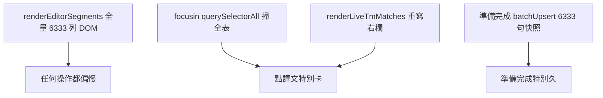
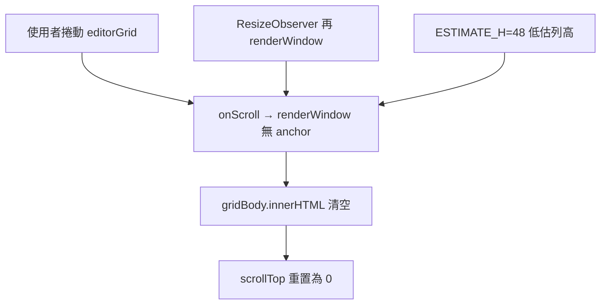

# CAT 編輯器大檔效能問題 — 調查與修正規劃（2026-06）

> 本文件目的：記錄大檔（六千句級）編輯器**全面遲鈍**的症狀、根因、已排除假設、分階修正與驗收。格式對照 [`CAT_SCROLL_INSTANT_NAVIGATION_2026-06.md`](./CAT_SCROLL_INSTANT_NAVIGATION_2026-06.md)。

---

## 背景與症狀

- **樣本**：`54316_02_WORDNT_RiftboundCoreRulesRUP4Sta_v2_zh_TW.docx_zho-TW.mqxliff`（**6333 句**；6126 句含 `<mq:insertedmatch>`）。
- **使用者回報（2026-06-28）**：不只捲動慢；**點譯文、Ctrl+G 跳行、準備完成**等幾乎所有操作都「非常非常慢」。
- **對照實驗**：專案**移除 TM** 並關檔重開後，體感**幾乎無改善** → 主因**不是**即時 TM 比對。

---

## 根因分析

### 1. 全量 DOM（主因 · 治本需 Phase 2）

[`cat-tool/app.js`](../cat-tool/app.js) `renderEditorSegments()` 對 `currentSegmentsList` **每一句**建立完整列（原文／譯文 `contenteditable`、tag pill、多欄）。6333 句 ≈ 數萬 DOM 節點；瀏覽器版面與事件成本使**整頁**互動變慢。

相關紀錄：[`CAT_LOCKED_SEGMENT_CONFIRM_UX_2026-06.md`](./CAT_LOCKED_SEGMENT_CONFIRM_UX_2026-06.md) §6–§7（3381 句時已記載；6333 句更嚴重）。

### 2. focusin 熱路徑掃全表（主因 · Phase 1 目標）

每列 `focusin`（約 L22776）原先：

- `querySelectorAll('.grid-data-row')` 移除／設定 `active-row`（**全表**）
- 再 `querySelectorAll` 同步 `selected-row`（**全表**）
- `syncSelectedRowAbutmentTopClass` 再掃全表
- 同步呼叫 `renderLiveTmMatches`（重寫右欄多區 `innerHTML`）

點譯文 = 上述每輪都跑 → 大檔體感「點一下卡一下」。

### 3. 準備完成／Workflow 快照（獨立問題 · Phase 3）

[`enqueueStageSnapshot`](../cat-tool/app.js) → [`CatStageSnapshot.batchUpsertSnapshots`](../cat-tool/js/stage-snapshot.js) 一次處理**全檔句段**（6333 句）。與 TM、focus 無關；按「準備完成」慢屬預期，需分批與進度 UI。

### 已排除

| 假設 | 結果 |
|------|------|
| Supabase migration 未 push | 已 push |
| TM 即時比對拖慢一切 | 移除 TM + 重開仍慢 |
| memoQ 預翻讀回 bug | `8e187d3` 已修；驗收通過（見 [`CAT_MQXLIFF_INSERTED_MATCH_UI_2026-06.md`](./CAT_MQXLIFF_INSERTED_MATCH_UI_2026-06.md)） |

---

## 分階修正規劃

| Phase | 範圍 | 狀態 |
|-------|------|------|
| **Phase 1** | focus 增量更新 active/selected；`scheduleRenderLiveTmMatches` debounce | **已實作** `2d32f1b` |
| **Phase 2 初版** | 虛擬捲動（~45 列 + buffer；門檻 >800 句） | **已實作但有缺陷** `56c3386` |
| **Phase 2.1** | scroll 鎖 + 錨點保留 + 跳行修正 | **本輪**（見 §Phase 2.1） |
| **Phase 2.2** | 全部取代／批次操作改資料層（虛擬相容） | 規劃中 |
| **Phase 3** | Workflow 快照分批；減少 `renderEditorSegments` 全表重建 | 規劃中 |

---

## Phase 1 實作摘要

**Commit**：`2d32f1b`

**觸點**（[`cat-tool/app.js`](../cat-tool/app.js)）：`setActiveGridRow`、`syncSelectedRowClassesFromIds`、`scheduleRenderLiveTmMatches` debounce 等。

**預期體驗**：大檔點譯文、換句後右欄更新**明顯較順**；無法徹底消除 6333 列 DOM 上限（需 Phase 2）。

---

## Phase 2 初版實作摘要（虛擬捲動）

**Commit**：`56c3386`

**模組**：[`cat-tool/js/grid-virtual-scroll.js`](../cat-tool/js/grid-virtual-scroll.js)（`CatVirtGrid`）

| 項目 | 說明 |
|------|------|
| 啟用門檻 | `currentSegmentsList.length > 800` |
| DOM | `#gridVirtualSpacerTop` + `#gridBody` + `#gridVirtualSpacerBottom` |
| `buildGridDataRow` | 自 `renderEditorSegments` 抽出 |

---

## Phase 2 缺陷（2026-06-28 驗證）

使用者於 Riftbound 6333 句驗證（**非進階篩選**）：

| 症狀 | 證據 |
|------|------|
| 捲到約二十幾行被彈回頂部 | 主控台 `#editorGrid` `scrollTop` 出現 **`0`** |
| 捲動不穩定 | `1000 → 515 → 176` 往回跳 |
| Ctrl+G 無法跳到畫面外句段 | 與 `scrollToSegId` 共用缺陷的 `renderWindow` |

**根因**（[`grid-virtual-scroll.js`](../cat-tool/js/grid-virtual-scroll.js)）：

1. `onScroll` / `ResizeObserver` 觸發**無 anchor** 的 `renderWindow`
2. `gridBody.innerHTML = ''` 導致捲動容器高度塌陷、`scrollTop` 歸零
3. `ESTIMATE_H = 48` 與實際列高（tag pill、多行譯文）不符 → spacer 算錯
4. `scrollToSegId` 內 `scrollIntoView` 加劇 scroll 競態

---

## Phase 2.1 修正摘要

**觸點**：[`grid-virtual-scroll.js`](../cat-tool/js/grid-virtual-scroll.js)、[`app.js`](../cat-tool/app.js) `_qaJumpToSegment` / `focusTargetEditorAtSegmentIndex`

| 項目 | 說明 |
|------|------|
| `_suppressScroll` | `renderWindow` / `scrollToSegId` 期間忽略 `onScroll` |
| 錨點 | `_anchorSegId`；重畫前自 DOM 或 scrollTop 推斷 |
| 重畫順序 | 先更新 spacer → 再 `replaceChildren` → 鎖內還原 `scrollTop` |
| `ResizeObserver` | 改 `renderWindow(_anchorSegId)` |
| 列高預估 | 快取 ≥3 筆時用中位數 |
| `scrollToSegId` | 移除 `scrollIntoView`；由 app.js `focus({ preventScroll: true })` |
| 錯誤訊息 | 篩選隱藏 vs 跳行失敗分開提示 |

**已知限制（Phase 2.2 前）**：

- 瀏覽器 Ctrl+F 找不到畫面外句段
- 大檔「全部取代」可能漏改或極慢（仍依 DOM 讀寫譯文）

---

## Phase 2.2 規劃（虛擬相容批次）

- `performReplaceAll` / 批次確認改為只讀寫 `seg.targetText`，可見範圍用 `isSegmentVisibleInEditor`

---

## Phase 3 規劃（Workflow 與整表重繪）

- `batchUpsertSegmentSnapshots` 改分批（例 200～500 句）+ 進度 toast

---

## 驗收清單（Riftbound 6333 句）

### Phase 2.1（本輪）

1. 硬重新整理；開檔；`CatVirtGrid.isEnabled()` 為 true
2. CAT iframe 主控台監聽 `#editorGrid` scroll；連續往下捲 → **不得**無預警 `scrollTop 0`
3. 可捲至約第 500 / 2000 / 5000 句並停留
4. **Ctrl+G** `82`、`3000` 可跳轉並編輯譯文
5. memoQ 預翻列仍為比對表第一筆
6. 小檔 ≤800 句：全量 DOM 不變

### Phase 1（已完成）

- 連點譯文較順；`2d32f1b`

---

## 相關文件

- [`CAT_MQXLIFF_INSERTED_MATCH_UI_2026-06.md`](./CAT_MQXLIFF_INSERTED_MATCH_UI_2026-06.md) — 預翻比對表整合
- [`CAT_LOCKED_SEGMENT_CONFIRM_UX_2026-06.md`](./CAT_LOCKED_SEGMENT_CONFIRM_UX_2026-06.md) §7 — 大檔／虛擬捲動
- [`bug-report_team-large-file-editor-stuck-loading_2026-05-26.md`](./bug-report_team-large-file-editor-stuck-loading_2026-05-26.md) — 大檔**開檔**卡住（與本檔**編輯中**卡頓不同）

---

*文件建立：2026-06-28。Phase 2.1 章節：2026-06-28。*
