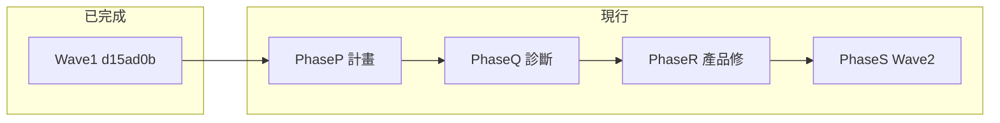

# Phase 2.3q Playwright 驗收計畫

> **狀態**：**Wave 1 已完成**（`d15ad0b`）— 見 §測試執行報告 Wave 1；**現行接續 Phase P→Q→R→S**（產品修復 + 測試擴網）  
> **定案問題**：大檔 virt **explicit centering 不穩** — Test A 穩定 fail（`≈+71px`）；Test B 間歇 fail（`≈-32px`）；C/E/D/G/H/I 首輪 pass
> **對應實作**：Phase 2.3q `6344baa`（[`CAT_EDITOR_NAV_PHASE_2_3Q_PLAN.md`](./CAT_EDITOR_NAV_PHASE_2_3Q_PLAN.md)）  
> **主紀錄**：[`CAT_EDITOR_TAG_COLOR_AND_NAV_FIX_2026-06.md`](./CAT_EDITOR_TAG_COLOR_AND_NAV_FIX_2026-06.md) §3.18

---

## 目的

以 Playwright 自動化驗收 Phase 2.3q 共用 explicit 導覽管線修正，涵蓋：

1. Ctrl+Enter 確認跳行
2. 清除篩選回到目標句
3. 手動點擊取消 stale 導覽
4. 小檔非 virt 回歸
5. （第二輪）Ctrl+F 不搶焦點、Ctrl+G／F3／QA smoke
6. **F8 於已確認句段**：viewport 不應甩到無關區、假游標離屏 tip 不應誤導焦點（Test G／H）
7. **手動點開譯文格**：viewport 不應「亂跳一陣」（Test I；與 Test C 互補）

**禁止**只靠截圖判斷。測試須在 CAT iframe 內檢查 DOM 焦點、列置中、內部 debug 狀態與 console log。

---

## 決策摘要（已確認）

| 項目 | 決定 |
|------|------|
| CAT 模式 | **優先離線版** [`/cat/offline`](../src/pages/CatToolPage.tsx)（無 Supabase／Team RPC 依賴） |
| 大檔樣本 | `Test_Big.mqxliff` — **6333 句**，~10.7 MB，`CatVirtGrid.isEnabled() === true` |
| 小檔樣本 | `Test_Small.mqxliff` — **33 句**，~64 KB，非 virt 路徑 |
| 測試環境 | **強制**只在測試環境跑；禁止預設打 production |
| 本文件範圍 | 計畫 + **初版 Playwright 程式**（`npm run test:e2e`） |

樣本來源（PM 提供）：本機 `Downloads/Test_Big.mqxliff`、`Downloads/Test_Small.mqxliff`，可匯入離線版 CAT。`Test_Big`（6333 句）與產品樣本 `54316_02_WORDNT_RiftboundCoreRulesRUP4Sta_v2_zh_TW.docx_zho-TW.mqxliff` 同屬大檔 virt 路徑；可選 `PLAYWRIGHT_CAT_RIFTBOUND_FIXTURE` 指向後者做手動對照。

---

## 症狀與根因（PM 回報 2026-07）

**「亂跳一陣」是不是虛擬網格的副作用？**

**部分是，但不只是。** 大檔（≥800 句）啟用 virt 後，任何觸發 **重畫** 的事件都可能讓 viewport 跳到別處：

| 機制 | 程式觸點 | PM 回報對照 |
|------|----------|-------------|
| **navAnchorLock 重畫** | [`grid-virtual-scroll.js`](../cat-tool/js/grid-virtual-scroll.js) `scheduleResizeRepaint` L200–203 | 舊錨點在列高變化重畫時把畫面拉回遠端句（如 #3200） |
| **假游標與 viewport 脫節** | [`cat-fake-caret.js`](../cat-tool/js/cat-fake-caret.js) `showOffScreenFakeTip` | 畫面在 ~#20，藍卡顯示「暫存游標位於第 3200 號句段」 |
| **手動點擊 stale nav** | 2.3q `cancelPendingNavigationForUserInteraction` | 來回拉扯、最終選取與假游標錯列（Test C／I） |
| **F8 間接重畫** | [`insertNextMissingTag`](../cat-tool/app.js) L18666 | F8 不直接 scroll；插入 tag → 列高變 → `ResizeObserver` → virt 重畫 |

**F8 是觸發器，virt 重畫 + 舊錨點／假游標狀態是放大器**；與 2.3q explicit 導覽管線重疊但不完全相同，須以 Test G～I 獨立覆蓋。已確認句 F8 若觸發 workflow revoke，**允許**句段變未確認，但 **viewport 與焦點須停在同一句**（不要求 `centeredOk`）。

---

## 安全規則

- Ctrl+Enter **會確認句段**；僅對專用 fixture 檔執行。
- **禁止**對 production 正式案件檔跑破壞性測試。
- 第一版僅 `/cat/offline` + 本機 IndexedDB，不接正式雲端資料。

---

## 測試環境策略（強制）

Playwright **可以且應該**指定只在測試環境工作。三層隔離：

### 第一版（離線版）— 天然隔離

| 項目 | 設定 |
|------|------|
| 預設 baseURL | `http://localhost:8080`（與 `vite.config.ts` 一致） |
| 啟動方式 | `playwright.config.ts` 的 `webServer` 自動跑 `npm run dev` |
| CAT 路徑 | `/cat/offline` only |
| 資料 | 本機 IndexedDB + 匯入 fixture |
| 破壞性操作 | Ctrl+Enter 只對 `Test_Big` / `Test_Small` |

### URL 守門（`globalSetup`）

**允許**（白名單）：

- `http://localhost:*` / `http://127.0.0.1:*`
- `http://[::1]:*`（可選）
- Vercel **Preview** URL（CI 以 `PLAYWRIGHT_BASE_URL` 指定；勿用 production alias）

**禁止**（除非明確覆寫）：

- `https://talk-hanzi-joy.vercel.app`（production）

```ts
// tests/global-setup.ts（已實作）
const url = process.env.PLAYWRIGHT_BASE_URL ?? 'http://localhost:8080';
const isProd = /^https:\/\/talk-hanzi-joy\.vercel\.app/.test(url);
if (isProd && process.env.PLAYWRIGHT_ALLOW_PRODUCTION !== '1') {
  throw new Error('Playwright 禁止對 production 執行；請設 PLAYWRIGHT_BASE_URL=localhost');
}
```

`package.json` 腳本：

```json
"test:e2e": "playwright test",
"test:e2e:ui": "playwright test --ui",
"typecheck:e2e": "tsc -p tsconfig.playwright.json"
```

### 第二階段（Team 模式）

若日後改測 `/cat/team`，須搭配產品**測試模式**（[`CAT_LMS_TEST_MODE_IMPL_PLAN_2026-06.md`](./CAT_LMS_TEST_MODE_IMPL_PLAN_2026-06.md)）：

- 真人執行長切換假人身分 → 資料 `env=test`
- **不可**用真人 PM 在 production 跑確認句段測試
- `storageState` 來自測試模式登入，非正式營運帳號

---

## Fixture 策略

| 檔案 | 句數 | 建議存放 | 理由 |
|------|------|----------|------|
| `Test_Small.mqxliff` | 33 | **`tests/fixtures/` 並 commit** | ~64 KB，CI 可直接用 |
| `Test_Big.mqxliff` | 6333 | **`tests/fixtures/`** 或 `PLAYWRIGHT_CAT_LARGE_FIXTURE` 環境變數 | ~10.7 MB；若不入 git，本機預設可指 `Downloads/Test_Big.mqxliff` |

環境變數備援：

- `PLAYWRIGHT_CAT_LARGE_FIXTURE` — 大檔路徑
- `PLAYWRIGHT_CAT_SMALL_FIXTURE` — 小檔路徑

### 離線版開檔流程 `openOfflineCatWithFile(page, fixturePath)`

1. `page.goto('/cat/offline')`
2. 等待 iframe `iframe[src*="/cat/"]`
3. iframe 內 `localStorage.setItem('catNavDebug','1')`（**不需 reload**）
4. `frame.locator('#sourceFileInput').setInputFiles(fixturePath)`
5. 完成匯入精靈／開檔 UI（第一輪實作需 codegen 記錄 selector）
6. 等待 `#editorGrid` 與 `.grid-data-row`
7. 大檔 assert：`CatVirtGrid.isEnabled() === true`；小檔 assert：`=== false`

匯入觸點：[`cat-tool/index.html`](../cat-tool/index.html) `#sourceFileInput`（L2117）。

---

## 與 GPT5-5 草稿的差異

對照外部草稿 `cursor_playwright_cat_2_3q_acceptance.md`，本 repo 定案如下：

| 議題 | GPT5-5 草稿 | 本計畫定案 |
|------|-------------|------------|
| 預設 baseURL | production | **`http://localhost:8080`** + URL 守門 |
| webServer | 未提及 | **自動 `npm run dev`** |
| 假游標 selector | 多個不存在 id/class | **`.cat-fake-caret:not(.hidden)`** |
| 手動取消 log | `user interaction cancelled...` | **`[catNav] manual cancel`** + `[catVirt] cancelNavigationAnchor` |
| 篩選 UI | placeholder 猜測 | **`#sfInput`**、**`#sfModeFilter`**、**`#btnSfClearNav`** |
| Ctrl+F | 泛用 input | **`#sfInput`** focused |
| 鍵盤 | `page.keyboard.press` | **iframe 內** `.grid-textarea` 的 `.press(...)` |
| stale nav | `waitForTimeout(1000)` | **`expect.poll`** + **`getDebugState().navAnchorLock === false`** |
| 內部狀態 | 僅 DOM + console | DOM 主斷言；輔助 **`getDebugState()`**、**`__catNavState`** |
| console 解析 | 字串搜 `centerOk: false` | **不作唯一 pass 條件** |
| 與 vitest | 未說明 | 獨立 **`npm run test:e2e`** |

---

## Playwright 基礎建設（已實作）

**依賴**：

```bash
npm install -D @playwright/test
npx playwright install chromium
```

**執行前**：在 `.env` 加入 `PLAYWRIGHT_TEST_EMAIL`、`PLAYWRIGHT_TEST_PASSWORD`（TMS 登入帳密）。

```bash
npm run test:e2e
```

**建議檔案結構**：

```text
playwright.config.ts
tests/
  global-setup.ts
  cat-navigation-2-3q.spec.ts
  helpers/
    cat-frame.ts
    cat-nav-assert.ts
    cat-nav-debug.ts
    cat-offline-open.ts
  fixtures/
    Test_Small.mqxliff
    Test_Big.mqxliff          # 或 .gitignore + env
playwright/.auth/             # 第二階段 Team；加入 .gitignore
```

**`playwright.config.ts` 要點**：

- `testDir: './tests'`
- `globalSetup: './tests/global-setup.ts'`
- `webServer: { command: 'npm run dev', url: 'http://localhost:8080', reuseExistingServer: !process.env.CI }`
- `timeout: 120_000`；`expect.timeout: 15_000`
- `retries: process.env.CI ? 1 : 0`
- `use.trace / screenshot / video: 'retain-on-failure'`
- `baseURL: process.env.PLAYWRIGHT_BASE_URL ?? 'http://localhost:8080'`
- `workers: 1`；`fullyParallel: false`
- Typecheck：`npm run typecheck`（`tsc -b`，不含 tests）；`npm run typecheck:e2e`（[`tsconfig.playwright.json`](../tsconfig.playwright.json)）

**`.gitignore` 增項**：`playwright/.auth/`、`test-results/`、`playwright-report/`

---

## Helper 規格

### `catFrame(page)`

```ts
return page.frameLocator('iframe[src*="/cat/"], iframe[src*="cat/index.html"]');
```

### `enableCatNavDebug(frame)`

```ts
await frame.locator('body').evaluate(() => {
  localStorage.setItem('catNavDebug', '1');
});
```

### `getCatNavigationState(frame)`

在 iframe 內 `evaluate`，回傳：

- `activeIsGridTextarea`、`activeInTargetCol`、`activeSegId`
- `rowCenterDeltaPx`（row 中心 vs `#editorGrid` 中心）
- `centeredOk`（`|delta| <= 16`）
- `fakeCaretVisible`（`.cat-fake-caret:not(.hidden)` 可見）

置中量測須對齊 [`cat-tool/app.js`](../cat-tool/app.js) `measureRowCenterDeltaPx`。

### `getVirtDebugState(frame)`

```ts
await frame.locator('body').evaluate(() => window.CatVirtGrid?.getDebugState?.());
```

Test C 須 assert `navAnchorLock === false`。

### `attachCatConsoleCollector(page)`

收集含 `[catNav]`、`[catVirt]`、`[catFakeCaret]` 的 console；失敗時 `dumpRecent(50)`。**僅作診斷**，不作唯一 pass／fail 依據。

### `pollViewportStable(frame, ms?, interval?)`

在 iframe 內每 `interval`（預設 100ms）記錄 `#editorGrid.scrollTop` 與第一個可見 `.grid-data-row` 的 `data-seg-id`；於 `ms`（預設 2000）內若 scrollTop 或 firstVisibleSegId **變動超過 2 次** → `stable: false`。

### `jumpToDisplayIndex(frame, displayId)`（2026-07-02 實作）

大檔 virt 下手動捲動不可靠；改點 `#btnJumpToSegmentToolbar`（Ctrl+G）→ `#catGenericPromptModal` 填 display # → `#btnCatGenericPromptOk`。跳轉後 `pollViewportStable` 再回傳該列 `data-seg-id`。呼叫前須 `dismissBlockingModals`。

### `dismissBlockingModals(frame)`（2026-07-02 實作）

依序關閉擋住點擊的 overlay：

- `#highMatchGuardModal` → `#btnHighMatchGuardOk`（高相符度句段編輯確認）
- `#catGenericConfirmModal` → `#btnCatGenericConfirmCancel`（Workflow「檔案準備中」；標題「檔案準備中」，不阻擋編輯）

### `clickConfirmedTargetNearDisplay(frame, centerDisplay, radius?)`（2026-07-02 實作）

`jumpToDisplayIndex` 後在可見 DOM 掃 `.grid-data-row.row-bg-confirmed`（display 落在 `center ± radius`；fallback 掃 display # 小於 500），點該列 `.col-target .grid-textarea`，回傳 `segId`。Test G／H 前置步驟 2 用此取代僅 `findConfirmedTargetSegId`。

### `getCatNavSnapshot(frame)`

在 `getCatNavigationState` 基礎上擴充：

- `savedFakeCaretSegId`：`catFakeCaret?.getSaved?.()?.segId`
- `fakeOffScreenTipVisible`：`.cat-fake-caret-scroll-tip:not(.hidden)` 且文字含「暫存游標」
- `virt`：`CatVirtGrid?.getDebugState?.()`
- `scrollTop`、`firstVisibleDisplayId`（`.col-id` 文字）

失敗時 dump 完整 snapshot + 最近 console。

---

## 驗收測項（對應 2.3q A～I）

### 共用通過條件

**Explicit 置中導覽**（A、B、D）：

```js
activeIsGridTextarea === true
activeInTargetCol === true
centeredOk === true   // |rowCenterDeltaPx| <= 16
```

**手動點擊**（C、I）— **不要求置中**：

```js
activeSegId === clickedSegId
activeIsGridTextarea === true
fakeCaretVisible === false   // 或無離屏 tip
CatVirtGrid.getDebugState().navAnchorLock === false
```

**F8／編輯中**（G、H）— **不要求 centeredOk**（F8 非 explicit 導覽）：

```js
activeSegId === f8SegId
activeIsGridTextarea === true
activeInTargetCol === true
pollViewportStable === true
```

使用 `expect.poll`（timeout 5～8s），失敗訊息附 `getCatNavSnapshot` + console dump。

### Test A — 大檔 Ctrl+Enter 置中

- Fixture：`Test_Big.mqxliff`
- 前置：`CatVirtGrid.isEnabled() === true`；`jumpToDisplayIndex` 至 display #20 並以 `data-seg-id` 點譯文格
- 每輪：iframe 內 `Control+Enter` → poll 置中 + 焦點
- **spec 初版 ×3**（規格原稿 ×5；Wave 1 維持 ×3 以縮短大檔耗時）

### Test B — 大檔清除篩選

1. 點譯文格，記 `editedSegId`
2. `#sfModeFilter` → `#sfInput` 填篩選條件
3. `#btnSfClearNav` 清除
4. 預期：`activeSegId === editedSegId`、置中、無假游標

### Test C — 手動取消 stale nav

1. Ctrl+Enter 啟動 explicit nav
2. **立即**點另一可見 `.col-target .grid-textarea`
3. poll：`activeSegId === clickedSegId`；`navAnchorLock === false`
4. 再 poll 2s：segId 不變（防 stale navGen）
5. console 含 `manual cancel`

### Test D — 小檔回歸

- Fixture：`Test_Small.mqxliff`
- `CatVirtGrid.isEnabled() === false`
- Ctrl+Enter；可選 clear filter

### Test E — Ctrl+F 不搶焦點（第二輪）

- 大檔開啟後 iframe 內 Ctrl+F
- `#sfInput` 保持 focused；填字後仍 focused

### Test F — 失敗可見性（第二輪）

- 難以穩定觸發 `[catNav] flush failed`
- 第一版僅記錄需 debug hook；不做脆弱字串 log 斷言

### Test G — F8 於已確認句段：viewport 不應甩到無關區（PM 1(1)）

**Fixture**：`Test_Big.mqxliff`

**前置**：

1. 捲到中段（display #3000–3200），點譯文格編輯（自然保存暫存游標）
2. 捲到前段（約 display #13–22），點 **已確認**（綠底／✓）句段譯文格
3. 記 `f8SegId` = `activeSegId`

**動作**：iframe 內對 active `.grid-textarea` 按 `F8`

**通過**（poll 3s）：

- `activeSegId === f8SegId` 且 `activeIsGridTextarea === true`
- `pollViewportStable` 為 stable
- 若 `savedFakeCaretSegId !== f8SegId` 且出現離屏 tip：允許 tip，但 **不得** 在 3s 內把 `activeSegId` 改成 `savedFakeCaretSegId`
- 可選：`firstVisibleDisplayId` 仍落在 #13–30（±5），不應整窗跳到 #3200

**子項**：G-a（tag 已齊、reconcile 短路）；G-b（會插入 tag、可能 unconfirm）— 見 [`insertNextMissingTag`](../cat-tool/app.js) L18674。

### Test H — F8 後來回拉扯 + 假游標錯列（PM 1(2)）

**前置**：同 Test G 步驟 1–2

**動作**：`F8` ×1

**通過**（poll 3s，每 100ms 取樣）：

- `scrollTop` 取樣變動次數 **≤ 2**
- 最終 `activeSegId === f8SegId`
- 焦點在 `f8SegId` 時，假游標／離屏 tip **不得** 指向步驟 1 的遠端 `savedFakeCaretSegId`
- `getDebugState().navAnchorLock === false`

### Test I — 手動點譯文格：viewport 穩定（PM 2；加強 Test C）

**前置**：`Test_Big`；可選先 `Ctrl+Enter` 或僅手動捲動

**動作**：點另一可見 `.col-target .grid-textarea`（**不要求**緊接 Ctrl+Enter）

**通過**：

- `pollViewportStable` 2s
- `activeSegId === clickedSegId`
- stable 後不得再跳走；**不要求** `centeredOk`
- 焦點在 clicked 列時 `fakeOffScreenTipVisible === false`

與 Test C：C 測「取消 stale explicit nav」；I 測「日常手動點擊不亂跳」。

### Test I′ — 重複手動點擊壓力（**規劃中**，Wave 2）

取代現有弱 Test I：3 range × 3 click（20、1500、3200）；不要求 `centeredOk`。詳見 §Wave 2 W2-1。

### Test N — explicit jump 後手動點擊（**規劃中**，Wave 2）

Ctrl+G 跳句後手動點另一可見譯文格；舊 nav 不得覆蓋。詳見 §Wave 2 W2-2。

### Test J / K — 輸入觸發重畫（**規劃中**，Wave 2）

已確認／未確認句輸入 1～2 字；`activeSegId` 不變、viewport stable。詳見 §Wave 2 W2-3。

### Test L / M — backlog

TM／高相符 guard（L）、tag 行高（M）；待 Wave 1／2 證據再開。詳見 §Wave 2 W2-4。

**第一版實作優先序**：D（冒煙）→ A → B → C → **G → H → I** → E → F。**現行接續**：§下一波執行計畫 Wave 1 → Wave 2。

---

## 與現有驗收流程

| 階段 | 執行者 | 用途 |
|------|--------|------|
| Playwright A～I | 本機／CI | 開發期回歸（含 F8／viewport 穩定 G～I） |
| Claude AI Slack | 部署後 | 全量驗收（見 [`.cursor/rules/claude-ai-acceptance-slack.mdc`](../.cursor/rules/claude-ai-acceptance-slack.mdc)） |

---

## 程式觸點索引

| 檔案 | 區段 |
|------|------|
| [`cat-tool/app.js`](../cat-tool/app.js) | `flushPendingEditorFocus`、`insertNextMissingTag`（F8）、`focusin`、confirm-jump、`window.__catNavState` |
| [`cat-tool/js/grid-virtual-scroll.js`](../cat-tool/js/grid-virtual-scroll.js) | `cancelNavigationAnchor`、`getDebugState`、`scheduleResizeRepaint`（navAnchorLock） |
| [`cat-tool/js/cat-fake-caret.js`](../cat-tool/js/cat-fake-caret.js) | `.cat-fake-caret`、`refreshAfterVirtRender` |
| [`cat-tool/index.html`](../cat-tool/index.html) | `#sourceFileInput`、`#sfInput`、`#btnSfClearNav` |
| [`src/pages/CatToolPage.tsx`](../src/pages/CatToolPage.tsx) | `/cat/offline` iframe 嵌入 |

---

## 實作順序（Playwright 本身）

**初版（已完成，`70a807d`）**：

```text
1. 安裝 @playwright/test + config + globalSetup 守門
2. helpers + fixtures（Test_Small commit；Test_Big 依 env）
3. Test D 冒煙 → A～I 初版
```

**現行接續（權威）**：§下一波執行計畫 **Phase P→Q→R→S**（Wave 1 已完成 → 產品修復 → Wave 2 擴網）

---

## 測試執行報告（2026-07-02）

> **審查對象**：GPT 5.5（或後續 AI 代理）— 本節為可機讀的執行紀錄與接續指引，非給 PM 手動點 UI 的步驟清單。  
> **執行者**：Cursor 代理（本機 Windows + PowerShell）  
> **環境**：`PLAYWRIGHT_BASE_URL` 預設 `http://localhost:8080`；`webServer` 自動 `npm run dev`；帳密自 `.env`（`PLAYWRIGHT_TEST_EMAIL`／`PLAYWRIGHT_TEST_PASSWORD`，**勿 commit**）  
> **大檔 fixture**：`Test_Big.mqxliff`（6333 句）；小檔 `tests/fixtures/Test_Small.mqxliff`  
> **程式狀態**：已推送 `main`（`70a807d` tests／helpers、`c442196` `tsconfig.playwright.json`）；執行需 `.env` 帳密與大檔 `PLAYWRIGHT_CAT_LARGE_FIXTURE`（**勿 commit `.env`**）

### 失敗分類（審查時請先讀）

| 類型 | 定義 | 本輪是否出現 |
|------|------|--------------|
| **L0 跑不起來** | 語法錯誤、`No tests found`、登入失敗、fixture 缺失 | 早期 G 輪有（重複 import）；已修 |
| **L1 基礎設施 timeout** | 測試腳本／selector／modal 未處理導致 180s timeout | 早期 G 輪有；已修（見 §基礎設施修正） |
| **L2 斷言未通過** | 流程跑完，`expect`／`expect.poll` 條件不成立 | **Test A**（`centeredOk: false`） |
| **L3 未執行** | `describe.serial` 前項失敗而 skip | **Test B**（A 失敗後）；**C／E** 本輪未單獨 invoke |

**結論（給審查者）**：本輪**不是**「Playwright 整體跑不起來」；多數測項已完成驗收流程並得出 pass／fail。**唯一產品向 fail 為 Test A**（大檔 explicit 置中）。G／H／I pass 表示 F8→virt 重畫路徑在目前 fixture 上可接受。

### 執行結果總表

| 測項 | 結果 | 耗時（約） | 備註 |
|------|------|-----------|------|
| `auth.setup` | ✅ pass | ~3s | 等 `iframe[title="CAT 個人離線版"]`，勿用 `not.toHaveURL(/login/)` |
| **Test D** | ✅ pass | ~29s | 小檔；`CatVirtGrid.isEnabled() === false`；`centeredOk === true` |
| **Test A** | ❌ fail | ~33s | 大檔；`Ctrl+Enter` 後 30s poll：`centeredOk` 仍 `false`；焦點在譯文格 |
| **Test B** | ⏭ skip | — | 與 A 同 `describe.serial` |
| **Test C** | ⏭ 未跑 | — | 本輪未 `-g` 單獨執行 |
| **Test G** | ✅ pass | ~11s | 見 §GHI 最終輪 |
| **Test H** | ✅ pass | ~11s | |
| **Test I** | ✅ pass | ~3s | |
| **Test E** | ⏭ 未跑 | — | |

**最終可宣告通過**：setup + D + G + H + I（**5+1 項**）。  
**明確未通過**：A。**待跑**：B（依賴 A 或拆 serial）、C、E。

### 代表性指令與 exit code

```powershell
Set-Location "c:\Homemade Apps\1UP TMS"
npx playwright test -g "Test D" --project=chromium                    # exit 0
npx playwright test -g "Test G —|Test H —|Test I —" --project=chromium  # exit 0（最終輪）
npx playwright test -g "Test A —|Test B —" --project=chromium          # exit 1（A fail）
npm run test:e2e                                                      # 全套；大檔 beforeAll 可達 3～10+ min
```

失敗 trace（Test A）：`test-results/cat-navigation-2-3q-Phase--4627d-*-Test-A-*-chromium/trace.zip`  
診斷：`npx playwright show-trace <path>` → 查 `rowCenterDeltaPx`、`getCatNavSnapshot`。

### Test A 失敗細節（L2，產品／量測待釐清）

- **檔案**：`tests/cat-navigation-2-3q.spec.ts` Test A
- **前置**：`openOfflineCatWithFile` + `assertVirtEnabled(true)`；`scrollToDisplayIndex(20)`；點譯文格
- **動作**：`Control+Enter`（規格寫 ×5；spec 實作 ×3）
- **失敗斷言**：

```js
expect.poll(getCatNavigationState).toMatchObject({
  activeIsGridTextarea: true,
  activeInTargetCol: true,
  centeredOk: true,   // 收到 false
});
```

- **已排除**：登入、開檔、virt 啟用、焦點不在譯文格
- **審查假說**（擇一或並存）：
  1. **產品**：大檔 virt 下 `flushPendingEditorFocus`／置中捲動在 headless 仍未在 30s 內收斂（2.3q 置中回歸）
  2. **測試**：`measureRowCenterDeltaPx` 與 virt 重畫時序競態；可試拉長 poll、先 `pollViewportStable`、或記錄 `rowCenterDeltaPx` 數值再定門檻
  3. **環境**：`resetEditorView` 每測前 `scrollTop=0` 是否干擾 A（GHI 未要求 `centeredOk` 故不受影響）

**與 G/H/I 的關係**：G/H/I 依計畫**不要求** `centeredOk`；A fail **不推翻** G/H/I pass 對 F8／viewport 的結論。

### 基礎設施修正（L1，已寫入 helpers／spec）

審查接續時請假設下列已存在於 `tests/helpers/` 與 `cat-navigation-2-3q.spec.ts`：

| 問題 | 症狀 | 修正 |
|------|------|------|
| 專案歡迎 Modal | 擋「匯入檔案」 | `dismissProjectWelcome` → `#btnProjectWelcomeSkip` |
| 語言對不符 | 匯入 wizard 卡住 | 匯入選 `en-us`／`zh-tw`；`#batchImportLangMismatchDialog` 確定 |
| mq 身分 Modal 晚出現 | 句段 0/0 | `confirmMqRoleOnOpen` 輪詢至 120s |
| 大檔 virt 捲動 | `scrollToDisplayIndex` 回傳 null | 改 `jumpToDisplayIndex`（Ctrl+G） |
| 高相符度 guard | `#highMatchGuardModal` 擋點擊 | `dismissHighMatchGuard` → 仍要編輯 |
| Workflow 檔案準備中 | `#catGenericConfirmModal` 擋工具列 | `dismissCatGenericConfirm` → 取消 |
| G 找不到已確認句 | `findConfirmedTargetSegId` 僅掃可見列且範圍過窄 | `clickConfirmedTargetNearDisplay(frame, 17, 10)` |
| virt 點 `.first()` 譯文格 | DOM detach 重試至 timeout | 改以 `jumpToDisplayIndex` 回傳之 `data-seg-id` 點擊 |

`describe.serial` 僅套在 **Test A–I 大檔**區塊；Test D 獨立。

### G/H/I 迭代紀錄（供審查者略讀）

| 輪次 | exit | 主因 |
|------|------|------|
| 1 | 1 | `clickTargetTextareaAtDisplay(3100)` → virt DOM detach |
| 2 | 1 | `#catGenericConfirmModal`（檔案準備中）擋 `#btnJumpToSegmentToolbar` |
| 3 | 1 | `findConfirmedTargetSegId` 回傳 null（jump 至 15 後可見列無綠底） |
| **4** | **0** | 上述修正 + `clickConfirmedTargetNearDisplay`；**4 passed ~1.1 min** |

### 給 GPT 5.5 的接續任務（建議優先序）

**已整併至 §下一波執行計畫 Phase P/Q/R/S**；請以該節為執行權威，本節僅保留首輪紀錄。

1. ~~Test A 根因~~ → Wave 1 §W1-1～W1-2
2. ~~拆 serial、單跑 B/C/E~~ → Wave 1 §W1-3～W1-4
3. ~~commit~~ → 已完成（`70a807d`、`c442196`）
4. Wave 2 壓力擴網 → §Wave 2

### 與 Slack Claude 驗收的邊界

- 本 Playwright 套件：**本機／CI 回歸**；目前**未**接 Slack `#development` AI 驗收流程
- 部署後全量驗收仍依 [`.cursor/rules/claude-ai-acceptance-slack.mdc`](../.cursor/rules/claude-ai-acceptance-slack.mdc)；若 PM 要 AI 驗收 2.3q，須另發任務並含 commit 短碼

---

## 下一波執行計畫（Phase P／Q／R／S）

> **審查對象**：GPT 5.5／後續 AI 代理 — **本節為現行執行權威**（整併 GPT 5.5 三版建議 + Wave 1 報告，2026-07-02 定案）。  
> **Wave 1**：**已完成**（`d15ad0b`）；見 §測試執行報告 Wave 1。  
> **現行目標**：修復大檔 virt **explicit centering** 不穩；並行擴充 Wave 2 壓力測試。

### 定案問題陳述

```text
大檔 virtual-scroll explicit centering 管線不穩。
Test A（Ctrl+Enter confirm-jump）：穩定 fail，rowCenterDeltaPx ≈ +71。
Test B（clear-filter return-to-target）：間歇 fail（批次曾 pass、單跑 fail、同批又 pass），rowCenterDeltaPx ≈ -32。
C/E/D/G/H/I：首輪 pass（產品修後 C/E 需重跑）。
```

### 總決策

| 要做 | 不做 |
|------|------|
| Phase Q：diagnostic log + `repeat-each` 量化 A/B | 整包重寫 virt／導覽架構 |
| Phase R：修 **shared** explicit centering timing | 只硬修 Ctrl+Enter 分支、忽略 B |
| Phase S（Wave 2）：I′、Test N、最小 J/K | 一次實作 J～N 全套 |
| 對照 A/B 路徑差異後最小修復 | 放寬 16px 門檻或盲目增加 retry |

**優先序**：Phase P（計畫對齊）→ **Phase Q**（診斷量化）→ **Phase R**（產品修復）→ **Phase S**（Wave 2 擴網；可與 R 尾端並行）→ **Backlog** L/M



---

### Phase P — 計畫對齊（**本輪文件**）

**目標**：兩份權威計畫與 Wave 1 事實一致；移除過時前提。

**不要再使用的說法**：

```text
Test B 穩定 pass
B pass 表示 clear-filter 路徑安全
這只是 Ctrl+Enter confirm-jump bug
這不是 shared explicit-centering 問題
因為 B pass 所以與 filter-clear 無關
Wave 1 完成前不可改 cat-tool
```

**應採用**：

```text
Test A = 穩定 reproducer（L2 產品向）
Test B = 間歇 sibling failure
問題範圍 = 大檔 virt explicit centering 不穩
修復入口 = shared path（以 A 為主、B 納入對照與驗收）
```

**交叉引用**：[`CAT_EDITOR_NAV_PHASE_2_3Q_PLAN.md`](./CAT_EDITOR_NAV_PHASE_2_3Q_PLAN.md) §產品修復波。

---

### Wave 1 — 診斷與補齊證據（**已完成**）

| 項目 | 狀態 |
|------|------|
| W1-1 Test A trace 診斷 | ✅ `rowCenterDeltaPx ≈ 71`、L2 |
| W1-2 `clickTargetAtDisplay` 修正 | ✅ 仍 fail → 非 L1 |
| W1-3 單跑 B/C/E | ✅ B 間歇、C/E pass |
| W1-5 拆 serial | ✅ |
| W1-6 回歸 D/G/H/I | ✅ |
| §測試執行報告 Wave 1 | ✅ `516566d`、`d15ad0b` |

細節見 §測試執行報告 Wave 1；W1-* 步驟保留供審查追溯。

---

### Phase Q — 診斷量化（**下一實作代理**）

**目標**：用 log + `repeat-each` 判斷 A/B 是否在同一 shared path 偏掉；填 §Phase Q 報告。

#### Q-1 暫時性 diagnostic log

在 shared explicit-center 路徑加 log（**僅** `localStorage.catNavDebug === '1'` 或開發期）：

```js
console.log('[catNav] explicit center diagnostic', {
  phase,
  intent,
  navGen,
  targetSegId,
  activeSegId,
  requestedScrollBlock,
  scrollTop,
  firstVisibleDisplayId,
  rowCenterDeltaPx,
  rowRect,
  gridRect,
  centerRetryCount,
  focusOk,
  centerOk,
  virt: window.CatVirtGrid?.getDebugState?.(),
});
```

**建議 phase**：`before navigation scheduled` → `after target selected` → `after scrollToSegId/centerOnSegId` → `after renderWindow` → `after setScrollTopDeferred` → `after focus preventScroll` → `after ResizeObserver/invalidateHeights` → `before retry` → `before flush failed`

**觸點**：[`cat-tool/app.js`](../cat-tool/app.js) `flushPendingEditorFocus`、`scheduleEditorFocus`；必要時 [`grid-virtual-scroll.js`](../cat-tool/js/grid-virtual-scroll.js)。

#### Q-2 repeat-each 量化

```powershell
Set-Location "c:\Homemade Apps\1UP TMS"
npx playwright test -g "Test A —" --project=chromium --repeat-each=3
npx playwright test -g "Test B —" --project=chromium --repeat-each=5
```

每次記錄：`pass/fail`、`activeSegId`、`targetSegId`、`rowCenterDeltaPx`、`scrollTop`、`navAnchorLock`、`centerRetryCount`、`failureReason`。

**判讀**：

```text
A 全 fail、B 部分 fail → A 穩定主症狀，B 間歇 sibling
A/B 全 fail → shared explicit-centering 問題更強
A fail、B 全 pass → B 可能狀態污染；仍以 repeat 統計為準，單次不作結論
```

**注意**：B 間歇（批次 pass／單跑 fail／同批又 pass）；**以 repeat-each pass rate 為準**。

#### Q-3 A vs B 路徑對照（修復前必做）

| 欄位 | Test A（confirm-jump） | Test B（clear-filter） |
|------|------------------------|------------------------|
| 典型 delta | **+71px**（偏下） | **-32px**（偏上） |
| intent | confirm-jump | filter-clear return |
| 對照項 | `explicitNav`、`forceVirtScroll`、`scrollBlock`、focus/center 順序、`invalidateHeights`、anchor release 時機 |

**重點問題**：delta 是否在 `setScrollTopDeferred` 後被 layout／ResizeObserver 覆蓋？center retry 是否過早（僅 rAF×3）？

#### Phase Q 交付物

```text
1. diagnostic log（可關閉）
2. §測試執行報告 Phase Q（pass rate、delta 分布）
3. A/B 路徑對照摘要（仍無產品修復或僅 log）
```

---

### Phase R — 產品修復與驗收（**Phase Q 後**）

**範圍**：`pending.explicitNav && scrollBlock === 'center'` 的 **shared** 路徑；**不是**只修 Ctrl+Enter。

**修復原則**（勿違反）：

```text
1. target row mount
2. CatVirtGrid scroll / center
3. wait renderWindow + setScrollTopDeferred + invalidateHeights settle
4. focus target editor（preventScroll）
5. measure center；focusOk && centerOk 才完成
6. retry 掛在 layout 事件後，非僅同 stack rAF×3
```

**次要改善**：`flush failed` 時 `cancelNavigationAnchor` 勿標 `nav-complete`；改區分 `nav-failed-center`（診斷用）。

**修完必跑**：

```powershell
npx playwright test -g "Test A —" --project=chromium --repeat-each=3
npx playwright test -g "Test B —" --project=chromium --repeat-each=5
npx playwright test -g "Test C —|Test E —" --project=chromium
npx playwright test -g "Test D" --project=chromium
npx playwright test -g "Test G —|Test H —|Test I —" --project=chromium
```

若改 `cat-tool/`：**必須** `npm run sync:cat` 並提交 `cat-tool/` + `public/cat/`。

**不要求** Wave 2 擋住 Phase R 結案。

---

### Phase S — Wave 2 擴充壓力覆蓋（repaint／機率性手動點擊）

**前提**：Wave 1 完成；Phase R 進行中或 A/B 改善後可**並行**；**仍不建議整包重寫 virt**。

PM 補充：任何重畫都可能 viewport／焦點亂跳；**手動點譯文格也有機率觸發**。A～I 是**代表性回歸網**，不是全面 repaint stress suite。

#### W2-1 Test I′ — 重複手動點擊壓力（優先）

取代現有弱 Test I（reset + 點一次 `nth(3)` ≈3s）。

**第一版規模**（避免 CI 過長／flaky）：

```text
3 display ranges × 3 clicks = 9 attempts
ranges: 20、1500、3200
```

穩定後可擴至 `5×5=25`（20、500、1500、3200、5000）。

**實作規則**：

- 每 range：`jumpToDisplayIndex` → 點**可見**列時先解析 `data-seg-id` 再點
- **禁止** virt 跳轉後裸用 `.first()`／`.nth(n)` 猜列
- 失敗 log 須含：`range`、`attempt #`、`clickedSegId`、`getCatNavSnapshot()`、最近 console

**通過條件**（不要求 `centeredOk`）：

```js
activeSegId === clickedSegId
activeIsGridTextarea === true
activeInTargetCol === true
pollViewportStable === true
CatVirtGrid.getDebugState().navAnchorLock === false
fakeOffScreenTipVisible === false
// 或：real focus 在 clickedSegId 時，假游標／離屏 tip 不得指向不同 savedSegId
```

機率性失敗可選：`test.describe.configure({ retries: 1 })` **僅套 I′ stress 區塊**。

#### W2-2 Test N — explicit jump 後手動點擊

在 J/K/L/M 之前實作（與 C／I 相關、較易寫穩）。

**最小路徑**：

```text
Ctrl+G（jumpToDisplayIndex）到句段 A
手動點另一可見譯文格 B
舊 explicit nav 不得再改 viewport／activeSegId
```

**通過**：同 I′（`activeSegId === clickedSegId`、viewport stable、`navAnchorLock === false`）。

**延後**：F3、QA jump → manual click。

#### W2-3 Test J / K — 最小輸入重畫（條件式）

**僅在** I′、N 穩定且 fixture 句段可穩定選定後：

| 測項 | 意圖 |
|------|------|
| **J** | 已確認句輸入 1～2 字 → workflow revoke／列重畫 → **activeSegId 不變**、viewport stable |
| **K** | 未確認句輸入（對照組）→ 同樣不跳 |

不要求 `centeredOk`。

#### W2-4 Backlog — Test L / M

| 測項 | 暫緩原因 |
|------|----------|
| **L** TM／高相符 guard 後編輯 | fixture／TM 依賴、flaky |
| **M** tag／行高壓力 | 與 G/H 重疊、需已知 tag 列 |

Wave 1／2 證據指向時再開。

---

### 測試原則（Wave 1／2 共用）

**1. virt 下目標列須 deterministic**

```text
jumpToDisplayIndex → data-seg-id → click → assert activeSegId
```

**2. 僅 explicit navigation 要求 `centeredOk`**

要求置中：Ctrl+Enter、清除篩選回句、規格要求置中的 Ctrl+G／F3／QA jump。  
不要求置中：手動點擊、輸入、F8、TM、workflow revoke、假游標顯示。

**3. assert 以 DOM／debug 為主**

`getCatNavigationState`、`getCatNavSnapshot`、`CatVirtGrid.getDebugState()`；console 僅作失敗附件。

**4. Typecheck 邊界**

- `npm run typecheck` → `tsc -b`（**不含** `tests/`）
- `npm run typecheck:e2e` → `tsconfig.playwright.json`

---

### 風險與限制

| 風險 | 緩解 |
|------|------|
| 大檔 `beforeAll` 匯入 3～10+ min | 大檔 describe 共用 context；CI 可只跑 D + 抽樣 |
| I′ 機率性 flaky | 先 9 attempts；失敗附 range／attempt；stress 區塊 retries |
| B 間歇 fail | 以 `repeat-each` pass rate 為準；勿假設「B 穩定 pass」或「只限 Ctrl+Enter」 |
| Test A 修寫法後 pass | 勿誤以為產品已全修；仍須跑 I′／N |
| Team 模式 | 本計畫仍僅 `/cat/offline`；Team 另波 |

---

### 暫不做

```text
- 重寫 grid-virtual-scroll 或整條 navigation 架構
- 一次實作 L/M 或全部 J～N
- 只硬修 Ctrl+Enter、忽略 Test B 間歇 fail
- 放寬 centeredOk 門檻（16px）或盲目增加 centerRetryCount
- 把手動點擊 / F8 / typing 改成 force center
- 把 console log 字串當唯一 pass/fail
- production URL 跑破壞性測試
```

---

### Agent 執行指令範本（複製給下一個 Cursor／GPT 5.5）

```markdown
請以 repo 為準（commit 見本檔案首狀態列）：

必讀：
1. docs/CAT_EDITOR_NAV_PHASE_2_3Q_PLAYWRIGHT_PLAN.md — §測試執行報告 Wave 1、§Phase P/Q/R/S
2. docs/CAT_EDITOR_NAV_PHASE_2_3Q_PLAN.md — §產品修復波

定案問題：大檔 virt explicit centering 不穩；Test A 穩定 fail；Test B 間歇 fail。
勿用「B 穩定 pass」或「只修 Ctrl+Enter」舊前提。

若執行 Phase Q：
- 加 [catNav] explicit center diagnostic（catNavDebug gate）
- npx playwright test -g "Test A —" --repeat-each=3
- npx playwright test -g "Test B —" --repeat-each=5
- 填 §測試執行報告 Phase Q

若執行 Phase R：
- 修 shared explicit centering timing（非 Ctrl+Enter-only）
- npm run sync:cat；重跑 A/B/C/E/D/G/H/I
- 更新兩份計畫驗收狀態

Phase S（Wave 2）：I′（3×3）、Test N、最小 J/K — 可與 R 尾端並行。見 §Phase S W2-*。
```

---

## 測試執行報告 Wave 1

> **狀態**：**已完成**（2026-07-02）  
> **執行者**：Cursor 代理  
> **前置報告**：§測試執行報告（2026-07-02）首輪結果

### Test A 診斷

| 項目 | 修正前（首輪） | Wave 1 修正後 |
|------|----------------|---------------|
| 點擊方式 | `scrollToDisplayIndex(20)` + `.first()` | `clickTargetAtDisplay(20)` → `data-seg-id` |
| 結果 | fail `centeredOk: false` | **仍 fail** `centeredOk: false` |
| `rowCenterDeltaPx`（失敗時） | 未記錄 | **約 71px**（穩定偏大，非門檻抖動） |
| `activeSegId` | 在譯文格 | 確認後 **21**（`targetSegId: 20` → 跳至下一句） |
| console | — | `[catNav] flush failed { failureReason: center, centerRetryCount: 3 }` ×2 |
| 分類 | L2 疑似 | **L2 產品向**（測試點擊已排除） |

**解讀**：修正點擊目標後仍無法置中 → **非** L1 測試寫法問題。大檔 virt 下 `Ctrl+Enter` confirm-jump 的 explicit 置中管線在 30s 內無法收斂（`|delta| ≈ 71` >> 16）。

### Test B / C / E 結果

| 測項 | Wave 1 批次跑 | 驗收重跑（單獨 `-g`） | 備註 |
|------|---------------|----------------------|------|
| Test B | ✅ pass (~4s) | ❌ **fail** (~23s) | `activeSegId=25` 正確，但 `centeredOk: false`；`rowCenterDeltaPx ≈ -32`；`flush failed { failureReason: center }` |
| Test C | ✅ pass (~7s) | （未重跑） | stale nav 取消、`navAnchorLock: false` |
| Test E | ✅ pass (~1s) | （未重跑） | `#sfInput` 保持焦點 |

**解讀（更新）**：Test A 穩定 fail（`|delta| ≈ 71`）。Test B 在 Wave 1 批次曾 pass，但**驗收重跑單獨執行時也 fail** → 大檔 virt **explicit 置中**問題可能**不限於 Ctrl+Enter**，清除篩選回句路徑亦可能失敗（間歇或環境敏感，待 Wave 2／產品修復時再釐清）。

### 驗收重跑（2026-07-02，PM 請求）

指令（第二次單獨、第三次同批）：

```powershell
npx playwright test -g "Test B —" --project=chromium
npx playwright test -g "Test A —" --project=chromium
npx playwright test -g "Test A —|Test B —" --project=chromium
```

| 測項 | 第二次（單獨 `-g`） | 第三次（A+B 同批 `-g`） | 關鍵數值 |
|------|---------------------|-------------------------|----------|
| Test B | ❌ fail | ✅ pass | fail 時：`rowCenterDeltaPx ≈ -32`；pass 時無 artifact（僅 fail 留 trace） |
| Test A | ❌ fail（符合預期） | ❌ fail | `rowCenterDeltaPx ≈ 71.6`（穩定） |

**本機 artifact**（`test-results/` 在 `.gitignore`，**不會隨 git 推送**；給 GPT 5.5 需另傳檔）：

| 類型 | Test A | Test B |
|------|--------|--------|
| 失敗截圖 | `c:\Homemade Apps\1UP TMS\test-results\cat-navigation-2-3q-Phase--4627d-檔-Test-A-—-Ctrl-Enter-×3-置中-chromium\test-failed-1.png` | `c:\Homemade Apps\1UP TMS\test-results\cat-navigation-2-3q-Phase--957aa-A–I-—-大檔-Test-B-—-清除篩選回到編輯句-chromium\test-failed-1.png` |
| trace | `c:\Homemade Apps\1UP TMS\test-results\cat-navigation-2-3q-Phase--4627d-檔-Test-A-—-Ctrl-Enter-×3-置中-chromium\trace.zip` | `c:\Homemade Apps\1UP TMS\test-results\cat-navigation-2-3q-Phase--957aa-A–I-—-大檔-Test-B-—-清除篩選回到編輯句-chromium\trace.zip` |

#### trace 是什麼？GPT 5.5 如何讀？

**trace**（`trace.zip`）是 Playwright 在測試失敗時錄下的**互動回放包**：含每一步截圖、DOM 快照、console、網路請求與時間軸，可在瀏覽器裡逐步重播，比單張失敗截圖更完整。

GPT 5.5 **無法直接讀 git 裡的路徑**（artifact 未入庫）。可行做法：

1. **線上 Trace Viewer**（推薦）：開 [https://trace.playwright.dev](https://trace.playwright.dev)，把 `trace.zip` 拖進去；人類或代理在瀏覽器逐步查看後，把關鍵畫面／console 摘要貼給 GPT。
2. **上傳給 GPT**：在 ChatGPT／支援附件的介面直接上傳 `trace.zip` 或 `test-failed-1.png`（zip 支援度因產品而異；截圖最穩）。
3. **請 GPT 5.5 自己重跑**：在有 `.env`、大檔 fixture 的環境執行相同 `-g` 指令，失敗後用 `npx playwright show-trace <path>\trace.zip` 本機檢視。
4. **Slack／雲端**：將 `trace.zip` 上傳 Slack thread 或雲端連結，再請 GPT 依連結下載（若其環境允許）。

本機開啟 trace：

```powershell
npx playwright show-trace "c:\Homemade Apps\1UP TMS\test-results\cat-navigation-2-3q-Phase--4627d-檔-Test-A-—-Ctrl-Enter-×3-置中-chromium\trace.zip"
```

### 回歸（spec/helpers 變更後）

| 測項 | 結果 |
|------|------|
| Test D | ✅ pass (~29s) |
| Test G / H / I | ✅ pass（4 passed ~1.1min） |

### Wave 1 結論

```text
是否進入 cat-tool 產品修復：是（Test A L2 穩定 fail；Test B 驗收重跑亦 fail）
修復焦點：大檔 virt 下 explicit 置中（flush center retry 耗盡）；含 Ctrl+Enter confirm-jump，清除篩選回句路徑亦需納入
是否開 Wave 2（I′、N）：是（與產品修復可並行；I′ 驗證 PM 機率性手動點擊）
本輪變更：拆 serial、clickTargetAtDisplay、Test A/B/C/I deterministic 點擊
Wave 1 commit：516566d、3b4bf02
驗收重跑：2026-07-02（A/B 皆 fail；見上表 artifact 路徑）
```

### 分類決策樹（本輪落地）

```text
A 修正點擊後仍 fail → L2 產品向（本輪已證實，可穩定重現）
B 批次 pass、驗收重跑 fail → 置中問題可能間歇或單跑／批次狀態差異；不再假設「僅 Ctrl+Enter 路徑」
C/E pass（首輪）     → stale 取消、Ctrl+F 路徑目前可接受（產品修後需重跑）
```

---

## 測試執行報告 Phase Q

> **狀態**：**待執行**（Phase Q 代理填寫）  
> **前置**：§測試執行報告 Wave 1；§Phase Q 規格

### repeat-each 結果（模板）

| 測項 | repeat | pass | fail | pass rate | 備註 |
|------|--------|------|------|-----------|------|
| Test A | 3 | | | | `rowCenterDeltaPx` 分布 |
| Test B | 5 | | | | 間歇性統計 |

### A vs B 路徑對照摘要（模板）

```text
（填寫 scheduleEditorFocus / scrollToSegId / renderWindow / setScrollTopDeferred 時序差異）
delta 偏掉發生在哪個 phase：
```

### Phase Q 結論（模板）

```text
是否進入 Phase R 產品修復：
修復假說（shared timing / height invalidate / deferred scroll）：
本輪 commit：
```

---

## 注意事項

- **`Test_Big.mqxliff` ~10.7 MB**：commit 前請 PM 確認；可用 `PLAYWRIGHT_CAT_LARGE_FIXTURE` 備援。
- **匯入精靈**：離線版匯入後可能有確認步驟，實作時以 codegen 記錄 selector。
- **Debug**：CAT iframe Console：`localStorage.setItem('catNavDebug','1')`。
- **F8 副作用**：插入 tag 可能 `unconfirmSegmentVisualAfterReplace`；G／H 須在 fixture 上跑，優先 tag 已齊句段。
- **display # vs segId**：藍卡「第 3200 號句段」為 display index；assert 同時記 `data-seg-id` 與 `.col-id` 文字。
- **G～I 若 6344baa 後仍失敗**：可能未涵蓋 F8→resize→`navAnchorLock` 路徑，需另開修復任務；Playwright 先鎖定回歸。
