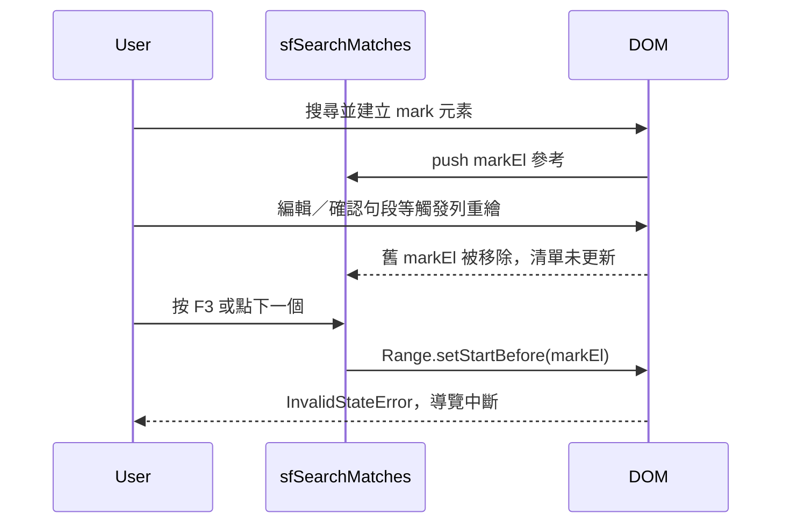

# CAT：F3／Shift+F3 搜尋導航過期 DOM 參考修正 — 開發紀錄（2026-05）

> 本文件目的：將「問題症狀、調查過程、根因、方案取捨、實作落點、驗收方式」寫成可追溯紀錄，方便日後維運或回頭查找。

---

## 背景與需求緣起

- **使用者回報**：在 CAT 編輯器中搜尋並有高亮命中後，於句段內編輯（或類似會重繪譯文／原文格的操作），再按 **F3**（下一個命中）或 **Shift+F3**（上一個命中），捷徑失效。
- **開發者工具（Console）**：瀏覽器拋出類似下列錯誤（訊息依引擎版本略異）：
  - `InvalidStateError`：對 `Range` 呼叫 `setStartBefore`／`setStartAfter` 時，傳入的節點已無父節點（detached node）。
- **影響範圍**：與 `goToSearchMatchStep` 相同路徑的工具列「下一個／上一個」按鈕亦會受同一根因影響。

---

## 調查過程（摘要）

1. 由 stack trace 對應至 [`cat-tool/app.js`](cat-tool/app.js) 內搜尋導覽相關函式：`findNextGlobalMatchIndexAfterAnchor`、`findPrevGlobalMatchIndexBeforeAnchor`、`goToSearchMatchStep`、`getSearchNavAnchorCollapsed`。
2. 確認命中清單 `sfSearchMatches` 條目內保存 **`markEl`（`<mark class="search-match">`）的 DOM 參考**。
3. 對照 `runSearchAndFilter`：當列需要重畫時會對來源／譯文格呼叫 `setEditorHtml` 等，**舊高亮節點被移除**，但若未重新跑完整搜尋流程，`sfSearchMatches` 仍可能指向已不在文件樹中的節點。
4. 結論：問題為 **「記憶體中的清單與畫面上的 DOM 不同步」**，非鍵盤事件本身未綁定。

---

## 根因分析

- **直接原因**：對已從 `document` 卸載的節點建立 `Range` 邊界（`setStartBefore`／`setStartAfter`），規範上不允許。
- **結構原因**：`sfSearchMatches` 為跨操作的快取；任何會重建格子 inner HTML 的路徑都可能使其中 `markEl` 失效，除非同步清空或重建清單。

### 同一份清單的其他引用點（調查時一併記錄）

下列路徑亦依賴 `sfSearchMatches[*].markEl` 或列參考；本次修正以 **導覽入口刷新 + 取錨／比對時守衛** 為主，降低 `InvalidStateError` 風險：

| 用途 | 約略位置（以目前 `cat-tool/app.js` 為準） |
|------|------------------------------------------|
| F3／Shift+F3 | `keydown` → `goToSearchMatchStep` |
| 工具列下一個／上一個 | 綁定同一 `goToSearchMatchStep` |
| `updateMatchHighlightFocus` | 呼叫 `applySearchMatchNavigationFocus` |
| 「取代此筆」前算出現次序 | `occurrenceIndexOfMarkInEditor(taPre, match.markEl)`（約第 16578 行） |
| 捲動至命中列 | `applySearchMatchNavigationFocus` 內 `match.rowEl.scrollIntoView` |

---

## 方案決策

### 採用方案

1. **在 `goToSearchMatchStep` 開頭偵測 stale**：若任一 `markEl` 已不在 `document.body`，先呼叫 `runSearchAndFilter({ keepFilterSnapshot: true })` 重建命中清單與高亮，再繼續導覽。
2. **防線函式**：在 `getSearchNavAnchorCollapsed`、`findNextGlobalMatchIndexAfterAnchor`、`findPrevGlobalMatchIndexBeforeAnchor` 內，對每個 `markEl` 使用前先 `document.body.contains(...)`，避免殘留 detach 節點造成例外。

**`keepFilterSnapshot: true` 用意**：在「篩選」模式下避免僅因刷新高亮而重算篩選快照，維持使用者預期的可見列集合（與取代流程既有慣例一致）。

### 未採用／延後方案

- **在每個會重繪 row 的呼叫點手動清空 `sfSearchMatches`**：改動面大、易漏改，長期維護成本高。
- **全面改為以「句段 id + 欄位 + 字元偏移」描述命中**：資料模型改動大，超出本次 hotfix 範圍。

---

## 實作落點

> 變更已透過 `npm run sync:cat` 同步至 `public/cat/`；**單一來源仍為 `cat-tool/`**。

### 修改檔案

- [`cat-tool/app.js`](cat-tool/app.js)（同步副本：[`public/cat/app.js`](public/cat/app.js)）

### 函式與行號（約略；若檔案後續增刪行請以 `grep` 為準）

| 函式 | 說明 |
|------|------|
| `goToSearchMatchStep`（約第 15449 行） | stale 偵測後 `runSearchAndFilter({ keepFilterSnapshot: true })` |
| `getSearchNavAnchorCollapsed`（約第 15369 行） | `markEl` 不在 DOM 時回傳 `null`，改走後續 fallback |
| `findNextGlobalMatchIndexAfterAnchor`（約第 15408 行） | 迴圈內 `contains` 守衛 |
| `findPrevGlobalMatchIndexBeforeAnchor`（約第 15423 行） | 同上 |

### 版本控制

- **Commit**：`4f25698` — `fix(cat): refresh stale search marks before F3 navigation`

---

## 驗收清單（已回報成功）

1. 開啟任意作業檔，於頂部搜尋輸入字串，確認畫面上出現搜尋高亮（`<mark class="search-match">`）。
2. 在任一譯文格內打字（或會觸發該列重繪的操作），**不要**手動清空搜尋再搜一次。
3. 按 **F3**：應跳到下一個命中；按 **Shift+F3**：應跳到上一個命中。
4. 開啟 DevTools **Console**，確認不再出現 `InvalidStateError` 與 `setStartBefore`／`setStartAfter` 相關堆疊。
5. （選擇性）在「篩選」模式下重複上述步驟，確認可見列集合未被意外改寫（依賴 `keepFilterSnapshot: true`）。

---

## 延伸與未來注意

- **`performReplaceThis`**（約第 16578 行）仍以 `match.markEl` 搭配 `occurrenceIndexOfMarkInEditor`；若日後出現「取代打到錯誤字串」，可優先懷疑 **過期 `markEl` 或列索引與資料不同步**，並評估是否在該路徑補上與 F3 相同的刷新策略。
- **假游標模組** [`cat-tool/js/cat-fake-caret.js`](cat-tool/js/cat-fake-caret.js) 已對 `saved.editor` 使用 `document.body.contains`，屬同類問題的既有防線，本次無需變更。
- **文件索引**：本檔為單次修正紀錄；若希望從 [`AGENTS.md`](AGENTS.md) 主索引一鍵連入，可後續於「領域與深文件」區塊自行增列連結。

---

## 變更時間線（方便對照對話／ PR）

| 日期（約） | 事項 |
|------------|------|
| 2026-05-07 | 使用者回報 F3 失效與 Console 錯誤；完成根因分析與修正計畫 |
| 2026-05-07 | 實作、執行 `npm run sync:cat`、提交並推送 `4f25698` |
| 2026-05-08 | 使用者驗收成功；補本開發紀錄文件 |
