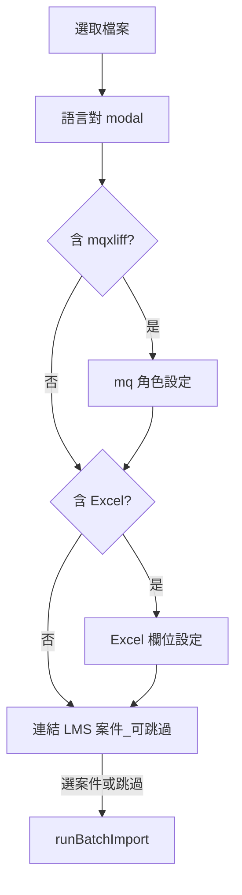
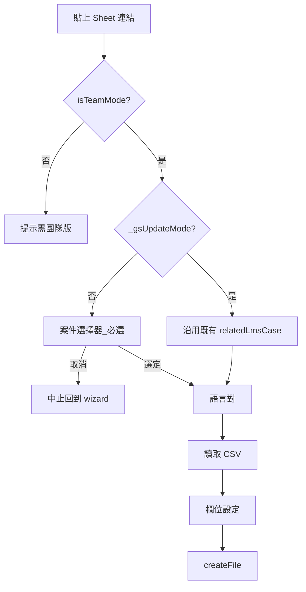

# CAT：一般匯入時選填連結 LMS 案件 — 開發紀錄（2026-06）

> 本文件記錄 **2026-06-10** 落地之「批次／一般檔案匯入完成設定後，可選填連結 LMS 案件」功能。屬於 TMS／CAT 整合大計畫的第一個小步，總覽見 [`CAT_WORKFLOW_STAGES_AND_REVISION_TRACKING_PLAN_2026-06.md`](./CAT_WORKFLOW_STAGES_AND_REVISION_TRACKING_PLAN_2026-06.md) **§4.1**。

---

## 背景與需求

- **既有行為**：專案詳情頁可事後勾選檔案 → 工具列「連結案件」；Google Sheet 作業檔匯入時會跳出案件選擇器（**A-2**：團隊版**必選**案件，與 A-1 一般匯入選填不同）。
- **缺口**：一般檔案匯入（`sourceFileInput` 多選：Excel、XLIFF／mqxliff、PO）在語言對、mq 角色、Excel 欄位設定完成後，**直接開始匯入**，無法在匯入當下綁定 LMS 案件。
- **需求**：在一般匯入流程末尾插入與現有案件選擇器相同的對話，**可跳過**；選定後，本批新建立的作業檔皆寫入 `related_lms_case_id`／`related_lms_case_title`。

---

## 方案決策

| 項目 | 決策 |
|------|------|
| UI | 沿用 `#casePickerDialog` 與 `showCasePickerForImport()`，不新增 HTML |
| 時機 | Excel 欄位設定（若有）之後、`wizardStepBatchProgress` 之前 |
| 跳過語意 | `showCasePickerForImport()` resolve `null`（按「取消」或關閉）→ **繼續匯入、不連結** |
| 團隊／離線 | 僅 **`isTeamMode()`** 顯示（離線無 LMS 案件可搜尋） |
| 綁定粒度 | 同一批匯入的所有新檔共用**同一個**選定案件 |
| 與 GS 匯入差異 | **A-1 一般匯入**：選填（取消＝跳過連結、繼續匯入）。**A-2 GS 匯入**：僅團隊版、**必選**案件（取消＝中止匯入）；離線版提示需團隊版 |

---

## 實作落點（已完成）

> 單一來源：`cat-tool/`；變更後 `npm run sync:cat` → `public/cat/`。

### 修改檔案

| 檔案 | 變更 |
|------|------|
| [`cat-tool/app.js`](../cat-tool/app.js) | `sourceFileInput.change` 插入案件選擇；`runBatchImport(..., caseInfo)`；`xliffImportCtx` 傳 `caseInfo`；`_importSingleExcelFile` 建檔後 `updateFile`；`showCasePickerForImport` 提示文案 |
| [`cat-tool/js/xliff-import.js`](../cat-tool/js/xliff-import.js) | `handleXliffLikeImport` 讀 `ctx.caseInfo`，`createFile` 後補 `relatedLmsCaseId` |
| [`cat-tool/js/po-import.js`](../cat-tool/js/po-import.js) | `handlePoImport` 同上 |

### 程式錨點

| 符號 | 說明 |
|------|------|
| `showCasePickerForImport(opts?)` | Promise；`opts.required` 為 GS 必填；`casePickerMode = 'import'` |
| `btnGsImportStart` | 團隊版 + `required: true`；`_gsUpdateMode` 沿用既有 `relatedLmsCase*` |
| `batchImportCaseInfo` | `sourceFileInput.change` 內組裝 `{ caseId, caseTitle }` 或 `null` |
| `runBatchImport(..., caseInfo)` | 第五參數；傳入 Excel／XLIFF／PO 各匯入路徑 |
| `xliffImportCtx({ suppressWizardHide, caseInfo })` | 橋接至 `xliff-import.js`／`po-import.js` |
| `DBService.updateFile` | 寫入 `relatedLmsCaseId`、`relatedLmsCaseTitle`（雲端映射 `related_lms_case_*`） |

### 流程（團隊版一般匯入）

---

## 驗收（2026-06-10 已通過）

1. **CAT 團隊線上版** → 專案詳情 → 匯入檔案（Excel 或 XLIFF）。
2. 完成語言對（及 Excel 欄位／mq 角色，若有）後，出現「連結案件」對話框；提示含「可直接按取消跳過」。
3. **跳過**：按取消 → 匯入成功，檔案清單「連結案件」仍為未綁定。
4. **連結**：搜尋並選定案件 → 匯入成功，本批新檔皆顯示該案件名稱。
5. **離線版**（`/cat/offline`）匯入時不出現此步驟。

---

## 提交對照

| Commit | 摘要 | 狀態 |
|--------|------|------|
| `49db7c2` | `feat(cat): 一般匯入時可選填連結 LMS 案件` | 已推送；驗收通過 |

---

## 交叉引用

- 批次匯入精靈總覽：[`CAT_BATCH_IMPORT_WIZARD_SESSION.md`](./CAT_BATCH_IMPORT_WIZARD_SESSION.md) §十一
- 案件綁定欄位 migration：[`20260429220000_cat_project_client_form_and_file_case_binding.sql`](../supabase/migrations/20260429220000_cat_project_client_form_and_file_case_binding.sql)
- 雲端 RPC：`src/lib/cat-cloud-rpc.ts` → `db.searchLmsCases`、`db.updateFile`
- TMS／CAT 大計畫：[`CAT_WORKFLOW_STAGES_AND_REVISION_TRACKING_PLAN_2026-06.md`](./CAT_WORKFLOW_STAGES_AND_REVISION_TRACKING_PLAN_2026-06.md)

---

## A-2：Google Sheet 匯入（必選連結案件）

### 流程（團隊版）

### 驗收

1. 團隊版 GS 匯入：未選案件按取消 → 不讀取 Sheet、回到 wizard。
2. 選定案件後匯入 → `related_lms_case_*` 有值、檔名為案件標題。
3. 離線版點 GS「匯入」→ 提示需團隊版。
4. 一般 Excel/XLIFF 匯入仍可取消跳過（A-1 回歸）。

---

## 修訂紀錄

| 日期 | 內容 |
|------|------|
| 2026-06-10 | 初稿：需求、決策、錨點、驗收、`49db7c2` |
| 2026-06-12 | A-2：GS 必選連結、離線阻擋、更新模式沿用既有案件；A-5 見主計畫 [`CAT_WORKFLOW_STAGES_AND_REVISION_TRACKING_PLAN_2026-06.md`](./CAT_WORKFLOW_STAGES_AND_REVISION_TRACKING_PLAN_2026-06.md) §4.1（`ab04381`） |
