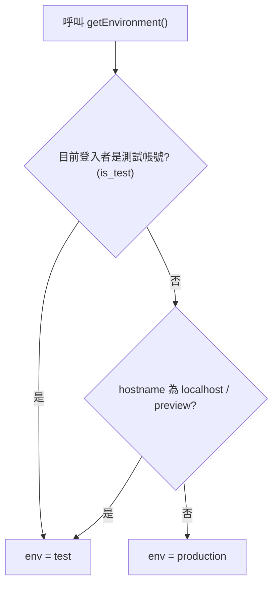
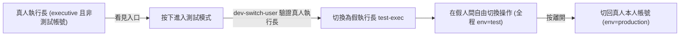
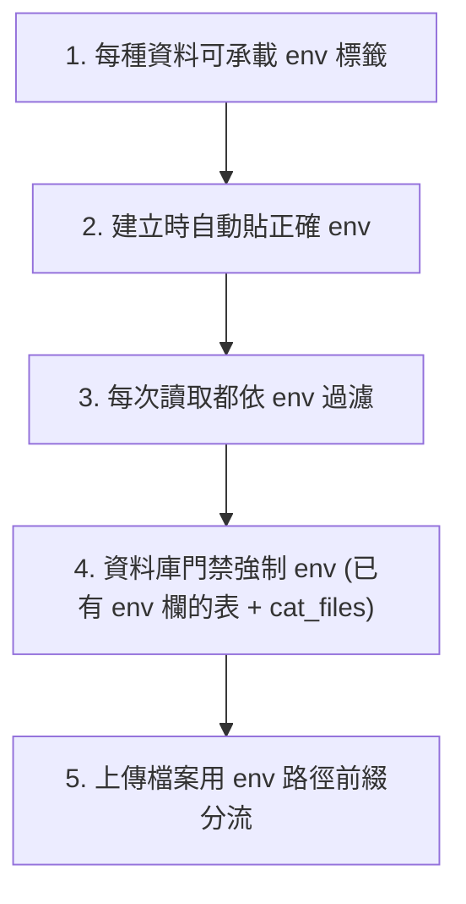

# 測試模式（環境隔離）實作規劃 2026-06

> 狀態：**已落地並驗收結案**（功能 `bfa5cdc`、UI 微調 `d7abef0`；2026-06-30）。本文件為測試模式**單一主紀錄**。
>
> **閱讀導覽**：§1–§9 規劃藍圖（§3 為實作前快照）｜§10 落地與取捨｜§11 時序｜§12 三輪驗收｜§13 **權威 backlog**｜§14 頂欄 UI｜§15 問題與解法
> 語言：台灣正體中文。Shell 為 Windows PowerShell（指令分開呼叫、勿用 `&&`）。
> 相關常駐規則：[`.cursor/rules/language-zh-tw.mdc`](../.cursor/rules/language-zh-tw.mdc)、[`.cursor/rules/shell-windows.mdc`](../.cursor/rules/shell-windows.mdc)。

---

## 1. 目標與白話說明

為**執行長**新增一個「測試模式」：執行長可在系統內自由切換成各種「假人」身分（假執行長、假 PM、假譯者等），以真實操作的方式驗收各種功能修改。這些假人在測試模式中被視為系統內的真實人物，在「團隊成員」頁自成一區，只有真人執行長看得到、可管理。

測試模式所產生的一切資料（案件、請款、費用、CAT 翻譯專案、檔案）一律歸入**測試區**，與正式營運資料**確實隔離**，不會誤刪誤改線上資料。

「白話對照」：本文出現的技術名詞，首次出現時以一句白話說明其與使用者的關係。

---

## 2. 核心設計決策（已與專案擁有者確認）

| 項目 | 決策 |
| --- | --- |
| 整體方案 | **方案 A**：測試與正式共用同一個後端（Supabase），靠 `env`（`test`/`production`）標籤分區。不另開獨立後端。 |
| 環境綁定 | **綁定身分**：假帳號永遠在測試區（`env=test`）、真帳號永遠在正式區（`env=production`）。不做與身分無關的開關。 |
| 身分模型 | **混合**：真人執行長「開門」→ 進去自動變成假執行長 → 在假人間自由切換 → 「離開」切回真人本人。 |
| 入口閘 | 看得到入口的條件＝「`executive` 角色」**且**「非測試帳號」。 |
| 範圍 | LMS（案件／請款／費用）＋ CAT 翻譯專案 ＋ 上傳檔案，**全包**。 |
| 隔離強度 | **聰明折衷**：前端全面帶 `env`；已有 `env` 欄的表＋`cat_files` 在資料庫層強制把關；高量葉子表（如 `cat_segments`）靠母層＋前端＋入口一致性檢查保護。 |
| 種子資料 | 預先放代表性案件、費用與一個 CAT 專案＋檔案。 |
| Slack 通知 | 測試模式導到測試頻道（訊息加 `[測試]` 前綴，可選測試頻道）。 |
| 重置 | 執行長可按「重置測試環境」按鈕，連測試上傳檔案一起清（含 CAT），加防呆確認。 |
| 持續性 | 重整頁面仍維持測試模式（因綁身分，登入者沒變就維持）；切回本人即離開。 |
| 假人名單起始 | 沿用現有四個：執行長、PM、譯者一、譯者二；日後可在團隊成員頁增減。 |

> 名詞白話：
> - **env / 環境標籤**：每筆資料上「這是測試還是正式」的記號。
> - **RLS（資料列存取規則）**：資料庫層級的門禁，後端強制「誰能讀／改哪些資料」，前端 bug 也擋得住。
> - **service role**：系統最高權限金鑰，後端函式用；**RLS 對它無效**，故用到它的函式須自行嚴格驗證呼叫者。

---

## 3. 現況盤點（實作前的事實基礎，歷史快照）

> **歷史快照**，供對照用；實作後現況見 §10–§15。

### 3.1 角色與身分

- 角色定義於 PostgreSQL enum `app_role`：`member` | `pm` | `executive`（執行長＝`executive`，最高權限）。見 [`supabase/migrations/20260305092158_c333bc05-afc1-4728-96d7-a26aae40c810.sql`](../supabase/migrations/20260305092158_c333bc05-afc1-4728-96d7-a26aae40c810.sql)。
- 輔助函式 `has_role(uid, role)`、`is_admin(uid)`（`pm` 或 `executive`）定義於同一 migration（行 41–66）。
- 前端 [`src/hooks/use-auth.ts`](../src/hooks/use-auth.ts) 計算 `isAdmin`、`primaryRole`（行 146–153）；**目前沒有** `isExecutive` 匯出、**沒有**測試帳號旗標。

### 3.2 環境判定（目前只看網址）

[`src/lib/environment.ts`](../src/lib/environment.ts)：`getEnvironment()` 依 hostname 判斷，結果快取在模組級 `_env`（第一次呼叫後不再重算，直到整頁 reload）。

- localhost / `*.lovableproject.com` / `*-preview--*` → `test`；其餘 → `production`。
- `envKey(key)` 用於 `app_settings` 的鍵前綴。

### 3.3 既有的 env 過濾與寫入（LMS 已做、CAT 未做）

- **LMS 已做**：[`src/stores/case-store.ts`](../src/stores/case-store.ts)、[`fee-store.ts`](../src/stores/fee-store.ts)、[`invoice-store.ts`](../src/stores/invoice-store.ts)、[`client-invoice-store.ts`](../src/stores/client-invoice-store.ts)、[`internal-notes-store.ts`](../src/stores/internal-notes-store.ts)、[`icon-library-store.ts`](../src/stores/icon-library-store.ts) 查詢時 `.eq("env", env)`、insert 時帶 `env`。權限 [`src/hooks/use-permissions.ts`](../src/hooks/use-permissions.ts) 依 env 讀 `permission_settings`。Realtime fallback [`src/lib/realtime-poll.ts`](../src/lib/realtime-poll.ts) 依 env 過濾。
- **CAT 未做（主要缺口）**：[`src/lib/cat-cloud-rpc.ts`](../src/lib/cat-cloud-rpc.ts)
  - `db.getProjects`（行 741–743）、`db.getTMs`（行 1498–1500）、`db.getTBs`（行 1652–1654）全表查詢，**無** `.eq("env", …)`。
  - `db.createProject`（行 670–688）、`db.createTM`、`db.createTB`、`db.createFile` insert **不帶 env** → 落 DB 預設 `production`（即使在 localhost 測試）。
  - `db.searchLmsCases`（行 888–907）無 `projectId` 時 hardcode `"production"`。
  - Storage 路徑無 env 前綴：`buildCatOriginalStoragePath`（行 101–103）→ `{projectId}/{fileId}/original`；`cat-notes-images` 同。

### 3.4 RLS 現況（資料庫門禁很鬆，且未含 env）

依 migration 鏈最終狀態（[`supabase/migrations/20260502140000_rls_initplan_fix.sql`](../supabase/migrations/20260502140000_rls_initplan_fix.sql) 等）：

| 表 | SELECT | INSERT / UPDATE / DELETE | 有 `env` 欄 | policy 用 `env` |
| --- | --- | --- | --- | --- |
| `cases` | 所有已登入 | INSERT/DELETE 限 admin；**UPDATE 所有已登入（`USING(true)`，隱患）** | 是 | 否 |
| `fees` | 所有已登入 | 限 admin | 是 | 否 |
| `invoices` | 所有已登入 | admin 或譯者改自己的 | 是 | 否 |
| `client_invoices` / `_fees` | 限 admin | 限 admin | 是 | 否 |
| `cat_projects` / `cat_tms` / `cat_tbs` | 所有已登入全 CRUD | 同左 | 是 | 否 |
| `cat_files` / `cat_segments` / `cat_views` / `cat_stage_assignments` | 所有已登入全 CRUD | 同左 | **否** | 否 |
| `cat_file_assignments` | admin 或受派者本人 | 同左 | 否 | 否 |
| `profiles` / `user_roles` / `invitations` / `member_translator_settings` | 已登入可讀（帳號全域） | 管理類依 admin | 否 | 否 |

- **確認**：沒有任何 RLS policy 用到 `env`。隔離完全靠前端。
- `env` 在多數表已有索引（如 `idx_cases_env_created`、`idx_fees_env`），但**所有 CAT 表都沒有 env 索引**。

### 3.5 身分切換現況

- [`src/components/DevRoleSwitcher.tsx`](../src/components/DevRoleSwitcher.tsx)：四個白名單測試帳（`test-exec@test.local` 等），流程為 `dev-switch-user` 取 magic link → `signOut` → `verifyOtp`。
- 顯示條件 `import.meta.env.DEV`（[`src/components/AppLayout.tsx`](../src/components/AppLayout.tsx) 行 58–63），正式站不顯示。
- [`supabase/functions/dev-switch-user/index.ts`](../supabase/functions/dev-switch-user/index.ts)：**只檢查目標 email 白名單，未驗證呼叫者** → 安全隱患。
- 對照可參考 [`supabase/functions/delete-user/index.ts`](../supabase/functions/delete-user/index.ts)（行 38–50）已驗證呼叫者為 `executive`。

### 3.6 團隊成員與 Slack

- [`src/pages/MembersPage.tsx`](../src/pages/MembersPage.tsx) 合併 `profiles`＋`user_roles`＋`invitations`＋`member_translator_settings`；列級隱藏既有模式為 `member.frozen && !canViewFrozen`（行 396–397）。
- Slack 通知（[`InquirySlackDialog.tsx`](../src/components/InquirySlackDialog.tsx)、[`NoteReminderSlackDialog.tsx`](../src/components/NoteReminderSlackDialog.tsx)、[`src/lib/slack-case-reply-notify.ts`](../src/lib/slack-case-reply-notify.ts)、cat-cloud-rpc）走使用者 OAuth token 發 DM，**無 env 分流**。

---

## 4. 目標流程圖

### 4.1 環境判定改為「身分優先」



### 4.2 進入／離開測試模式



### 4.3 隔離五件事（缺一則漏）



---

## 5. 實作工項

### 工項一：環境判定改為「身分優先」

- [`src/lib/environment.ts`](../src/lib/environment.ts)
  - `getEnvironment()` 先判斷目前登入者是否為測試帳號（讀已快取的旗標），是則回 `test`；否則沿用 hostname 規則。
  - 新增 `resetEnvironmentCache()`：清 `_env = null`，供登入者切換後重算。
- [`src/hooks/use-auth.ts`](../src/hooks/use-auth.ts)
  - 取得使用者時一併載入 `profiles.is_test`；提供 `isTestAccount`、`isRealExecutive`（`executive` 且非測試帳號）。
- 切換登入者（進／出測試模式）後一律 `location.reload()`：一次清掉所有 store 記憶體與 realtime 訂閱，避免跨 env 殘留。

> 注意：`_env` 模組快取是最大陷阱。覆寫必須在第一次 `getEnvironment()` 之前生效，或於切換後 reset／reload。

### 工項二：資料庫 — 測試帳號旗標與 RLS env 把關

新增一支 migration（`supabase/migrations/<timestamp>_test_mode_env_isolation.sql`）：

1. `ALTER TABLE public.profiles ADD COLUMN is_test boolean NOT NULL DEFAULT false;`
2. 輔助函式 `public.current_env()`：依 `profiles.is_test`（對應 `auth.uid()`）回傳 `'test'`／`'production'`（`SECURITY DEFINER`、`STABLE`）。
3. **已有 `env` 欄的表**併入 RLS 條件 `env = public.current_env()`（SELECT/UPDATE/DELETE 的 `USING`，INSERT/UPDATE 的 `WITH CHECK`）：
   `cases`、`fees`、`invoices`、`invoice_fees`、`client_invoices`、`client_invoice_fees`、`internal_notes`、`icon_library`、`cat_projects`、`cat_tms`、`cat_tbs`、`permission_settings`。
4. **`cat_files` 加 `env` 欄 + 索引 + RLS**（檔案是子表中最危險的單位）。
5. 收緊現有隱患：`cases` 的 `UPDATE USING(true)` 改為限 PM／執行長或案件相關人，並併入 env。
6. env 索引：`idx_cat_projects_env_created`、`idx_cat_tms_env_created`、`idx_cat_tbs_env_created`、`idx_cat_files_env_project`。
7. 依專案慣例執行 `supabase db push`（依 [`docs/HANDOFF.md`](HANDOFF.md)、[`docs/DEPLOYMENT_CHECKLIST.md`](DEPLOYMENT_CHECKLIST.md)）。

> 高量葉子表（`cat_segments`、workflow 子表等）**不加** RLS env，避免「每行往上追問」的效能與誤鎖風險；改靠母層（`cat_projects`/`cat_files` 已鎖）＋前端＋工項三的入口一致性檢查保護。

### 工項三：補滿 CAT 的 env 隔離（前端 + RPC）

- [`src/lib/cat-cloud-rpc.ts`](../src/lib/cat-cloud-rpc.ts)
  - 入口 `handleCatCloudRpc` 取 `const env = getEnvironment()`。
  - 列表過濾：`db.getProjects`、`db.getTMs`、`db.getTBs` 加 `.eq("env", env)`。
  - 建立帶標籤：`db.createProject`、`db.createTM`、`db.createTB`、`db.createFile`（含新 `cat_files.env`）寫入 `env`。
  - `db.searchLmsCases` 改為一律 `getEnvironment()`（移除 hardcode `production`）。
  - **新增 env 一致性檢查**：`patchProject`/`deleteProject`/`updateProject*`、`updateFile`/`deleteFile`/`refreshFileSegments` 等修改前，先確認目標 `cat_projects.env`（或 `cat_files.env`）等於當前 env，不符則拋錯並拒絕（防程式誤帶跨區 ID）。
  - Storage：`buildCatOriginalStoragePath` → `{env}/{projectId}/{fileId}/original`；`db.uploadNoteImage` → `{env}/{userId}/…`；同步 `deleteProject` 的路徑收集邏輯。
- React 直查補 env：[`src/components/case/CatProjectFilePickerModal.tsx`](../src/components/case/CatProjectFilePickerModal.tsx) 等加 `.eq("env", getEnvironment())`。
- CAT iframe 指派同步：[`src/pages/CatToolPage.tsx`](../src/pages/CatToolPage.tsx) 的 `sendAssignments` 等直查改經 env 過濾的母層。
- 規劃時預期改 `cat-tool/` 後執行 `npm run sync:cat`；**實作後**確認 env 由母層 RPC 強制，**未改** `cat-tool/`，故不需 sync（見 §10 取捨）。

### 工項四：身分切換入口（執行長專用、限真人）

- [`src/components/DevRoleSwitcher.tsx`](../src/components/DevRoleSwitcher.tsx) 升級為正式「測試模式」面板：
  - 顯示條件由 `import.meta.env.DEV` 改為 `isRealExecutive`。
  - 新增「離開測試模式（切回本人）」。
- [`supabase/functions/dev-switch-user/index.ts`](../supabase/functions/dev-switch-user/index.ts)：比照 `delete-user` 驗證呼叫者為 `executive` 且**非測試帳號**；維持 magic link + `verifyOtp`。
- 入口掛點：[`src/components/AppLayout.tsx`](../src/components/AppLayout.tsx) header 常駐「測試模式」banner ＋顯示目前扮演身分。
- 「切回本人」：需設計安全的免密碼回切（magic link 機制延伸，且僅限本來就是真人執行長者觸發）。

### 工項五：團隊成員「假人專區」

- [`src/pages/MembersPage.tsx`](../src/pages/MembersPage.tsx)
  - 載入帶 `profiles.is_test`；把測試帳號獨立成一區，**只對真人執行長顯示**（沿用 `frozen` 隱藏列模式）。
  - 真人執行長可新增／刪除假人、改其角色。
- 建帳走 [`supabase/functions/create-user/`](../supabase/functions/create-user/index.ts)：補執行長驗證，且建立時自動標 `is_test=true`。

### 工項六：Slack 測試分流

- 前端所有 Slack invoke（[`InquirySlackDialog.tsx`](../src/components/InquirySlackDialog.tsx)、[`NoteReminderSlackDialog.tsx`](../src/components/NoteReminderSlackDialog.tsx)、[`slack-case-reply-notify.ts`](../src/lib/slack-case-reply-notify.ts)、cat-cloud-rpc）加 `env: getEnvironment()`。
- Slack edge function：`env==='test'` 時訊息加 `[測試]` 前綴；可選新增 Secret `SLACK_TEST_CHANNEL_ID` 改 post 測試頻道。
- 連結 URL 仍為正式網域，建議測試訊息明確標記避免誤判。

### 工項七：種子資料與一鍵重置

- **種子**：migration 或腳本建立 `env=test` 的代表性案件、費用、一個 CAT 專案＋檔案；確保假人 `display_name` 與案件 `translator`／費用 `assignee` 對齊（系統部分視角靠人名比對）。
- **重置**：執行長專用「重置測試環境」按鈕 ＋ edge function（service role）：
  - 刪除所有 `env='test'` 業務資料（含 CAT 專案／檔案／句段）。
  - 刪除 `cat-original-files`、`cat-notes-images` 的 `test/` 路徑物件。
  - 加防呆二次確認（不可逆）。
  - 延伸現有清理樣板 [`supabase/migrations/20260311114006_38e11f69-3062-4e18-8ec9-0bd61fce6e7a.sql`](../supabase/migrations/20260311114006_38e11f69-3062-4e18-8ec9-0bd61fce6e7a.sql)。

---

## 6. 建議實作順序

1. 工項二（資料庫：`is_test`、`current_env()`、`cat_files.env`、RLS、索引）— 基礎。
2. 工項一（環境判定身分優先）＋工項三（CAT 前端／RPC 補 env）— 讓資料正確分流。
3. 工項四（執行長入口＋安全閘）— 開門機制。
4. 工項五（假人專區）。
5. 工項七（種子＋重置）。
6. 工項六（Slack 分流）。
7. 全面驗收（見 §8）。

---

## 7. 風險與注意事項

- **殘留風險**：`cat_segments` 等葉子表未加 RLS env，靠母層＋前端＋RPC 一致性檢查；其 ID 為不可猜的亂碼，惡意跨區風險極低，主要防的是程式 bug 誤帶 ID。
- **同瀏覽器單一身分**：切換假人影響所有分頁；需同時對照不同身分得用不同瀏覽器或無痕視窗。
- **service role 繞過 RLS**：`dev-switch-user`、`create-user`、重置 function 等必須嚴格驗證呼叫者。
- **既有 localhost 誤寫**：過去在 localhost 建立的 CAT 專案 `env` 可能為 `production`，需評估是否 backfill 為 `test`。
- **`_env` 模組快取**：切換登入者後務必 `resetEnvironmentCache()` 或整頁 reload。
- **`settings-persistence` legacy fallback**：新 key 無資料時會讀無前綴舊 key（[`src/stores/settings-persistence.ts`](../src/stores/settings-persistence.ts) 行 54–67），測試模式可能誤讀正式設定，需留意。
- **CAT 改動後**：若動到 `cat-tool/` 才需 `npm run sync:cat`；本功能僅改 React 母層 RPC，見 §10。

---

## 8. 驗收方式（白話）

1. **隔離**：以真人執行長登入正式站，記下某真實案件。進測試模式（變假執行長），確認**看不到**該真實案件；在測試模式新建一筆案件，離開測試模式後，正式區**看不到**這筆測試案件。
2. **假人視角**：在測試模式切成假譯者，確認只看得到指派給該譯者的工作。
3. **CAT**：測試模式新建一個 CAT 專案與檔案；離開後在正式區的 CAT 專案清單**看不到**它。
4. **團隊專區**：以真人執行長在團隊成員頁看得到「測試帳號」專區並可增減；以 PM／譯者登入則**完全看不到**該專區與測試模式入口。
5. **重置**：按「重置測試環境」並確認後，測試區案件／CAT／檔案清空，正式區**毫髮無傷**。
6. **Slack**：測試模式觸發通知，訊息帶 `[測試]` 標記或進測試頻道，不打擾正式收件者。

---

## 9. 待決與後續

已移至 **§13**（選擇性補測試與日後修正 backlog）。本節保留編號，避免舊連結失效。

---

## 10. 實作完成狀態（2026-06-30）

七個工項已落地；TypeScript 型別檢查通過；migration 與 Edge Functions **已部署至正式環境**。

| 工項 | 內容 | 觸點 |
| --- | --- | --- |
| 一 | 環境判定改身分優先、`resetEnvironmentCache()`、`isTestAccount`/`isRealExecutive` | [`src/lib/environment.ts`](../src/lib/environment.ts)、[`src/hooks/use-auth.ts`](../src/hooks/use-auth.ts)、[`src/lib/profile-columns.ts`](../src/lib/profile-columns.ts) |
| 二 | `profiles.is_test`、`public.current_env()`、`cat_files.env` + backfill + 索引、對有 env 欄的表與 `cat_files` 併入 `env = current_env()` 的 RLS | [`supabase/migrations/20260630120000_test_mode_env_isolation.sql`](../supabase/migrations/20260630120000_test_mode_env_isolation.sql) |
| 三 | CAT 雲端 RPC 全面補 env（建立帶標籤、列表過濾、`searchLmsCases`、Storage 路徑 env 前綴、一致性檢查），React 直查補 env | [`src/lib/cat-cloud-rpc.ts`](../src/lib/cat-cloud-rpc.ts)、[`src/components/case/CatProjectFilePickerModal.tsx`](../src/components/case/CatProjectFilePickerModal.tsx) |
| 四 | 測試模式控制項（真人執行長入口 / 假人切換 / 離開）、常駐警示條、`dev-switch-user` 加呼叫者授權；**`d7abef0` 起內嵌頂欄**（見 §14） | [`src/components/DevRoleSwitcher.tsx`](../src/components/DevRoleSwitcher.tsx)、[`src/components/AppLayout.tsx`](../src/components/AppLayout.tsx)、[`supabase/functions/dev-switch-user/index.ts`](../supabase/functions/dev-switch-user/index.ts)、[`supabase/config.toml`](../supabase/config.toml) |
| 五 | 團隊成員頁假人專區（僅真人執行長可見）、`create-user` 加授權與 `is_test` 標記 + 直接指派角色 | [`src/pages/MembersPage.tsx`](../src/pages/MembersPage.tsx)、[`supabase/functions/create-user/index.ts`](../supabase/functions/create-user/index.ts) |
| 六 | Slack 測試分流：前端帶 `env`，函式於 `env='test'` 時加 `[測試]` 前綴 | [`supabase/functions/slack-send-dm/index.ts`](../supabase/functions/slack-send-dm/index.ts)、`InquirySlackDialog`／`NoteReminderSlackDialog`／`slack-case-reply-notify.ts`／`cat-cloud-rpc.ts` |
| 七 | 重置測試環境 Edge Function（僅真人執行長、僅刪 `env='test'`、含 Storage、可選種子）+ 雙重確認按鈕；**種子實作範圍縮減**見下 | [`supabase/functions/reset-test-env/index.ts`](../supabase/functions/reset-test-env/index.ts)、[`src/pages/MembersPage.tsx`](../src/pages/MembersPage.tsx) |

### 實作取捨（與原規劃的差異）

- **`cases` UPDATE RLS**：原規劃提到「收緊為 PM／相關人」。為避免破壞譯者協作列更新等既有流程，實作改為**維持「已登入皆可改」但加上同 env 限制**（跨環境無法互改）。進一步限縮留待日後以精確的「相關人」定義處理（見 §13 FIX-4）。
- **免密碼返回本人**：採「進入測試模式前先為自己預先取得一張 magic-link 返回票（存 `sessionStorage`，關閉分頁即失效）」。`dev-switch-user` 後端僅允許「切到自己」或「切到 `@test.local`」，因此假帳號無法藉切換跳進任何真人帳號。返回票逾時則退回登入頁。
- **CAT 內嵌前端（`cat-tool/`）未改動**：所有雲端讀寫都經由母層 `handleCatCloudRpc` 強制 env，iframe 無需傳 env，故**不需** `npm run sync:cat`。
- **型別**：`profiles.is_test`、`cat_files.env` 尚未進 generated types，少數直查以 `as any` 規避 TS「型別過深」（與既有慣例一致）。
- **種子資料範圍**：§2 決策為「案件、費用、CAT 專案＋檔案」；實作僅在 `reset-test-env` 可選插入 **2 筆 LMS 示範案件**，無 CAT／費用種子 → 見 §13 **FIX-9**。

### 部署紀錄（2026-06-30 已完成）

| 項目 | 狀態 |
| --- | --- |
| Git 功能 | `bfa5cdc` on `main` |
| Git 文件初版 | `6a7ac00`（§11–§13 驗收紀錄） |
| Git 文件補全 | `8e8cd1a`（§12–§15 完整紀錄） |
| Git UI | `d7abef0`（頂欄控制項） |
| Vercel production | READY（Claude 驗收第一輪確認） |
| Migration | `20260630120000_test_mode_env_isolation.sql` 已 `supabase db push` |
| Edge Functions | `dev-switch-user`、`create-user`、`reset-test-env`、`slack-send-dm` 已部署 |

**首次使用**：由真人執行長在「團隊成員 → 測試成員（假人）」新增 `test-exec@test.local`（角色：執行長）等假人，即可由頂欄「進入測試模式」。

---

## 11. 開發與驗收時序（2026-06-30）


| 時間 | 事件 |
| --- | --- |
| 2026-06-30 早 | 規劃文件初版、七工項實作 |
| 2026-06-30 | `bfa5cdc` 推送；migration + 4 個 Edge Function 部署 |
| 2026-06-30 09:59 | Slack `#development` 張貼驗收任務（[thread 一～二輪](https://1up-studio.slack.com/archives/C0BDSDCT9B5/p1782784797.711929)） |
| 2026-06-30 12:57 | Claude **第一輪**回報：核心 7/9 PASS；CAT 部分；Slack SKIP（§12.4） |
| 2026-06-30 13:01 | Cursor 回覆第二輪指引（R1–R4） |
| 2026-06-30 13:31 | Claude **第二輪**回報：R1/R2/R3 PASS；R4 SKIP；附 FIX-1（§12.5） |
| 2026-06-30 | 專案擁有者手動移除 08:41 誤建正式區 `[AI驗收]` 草稿（H4 完成） |
| 2026-06-30 | `6a7ac00` 推送：§11–§13 驗收紀錄與 OPT/FIX backlog 初版 |
| 2026-06-30 14:35 | Slack 張貼**第三輪**結案確認 + 選性補測（[thread](https://1up-studio.slack.com/archives/C0BDSDCT9B5/p1782801351711309)） |
| 2026-06-30 22:28 | Claude **第三輪**回報：C 組 PASS；OPT-1 PASS；OPT-2 FAIL；FIX-1 仍重現（§12.3） |
| 2026-06-30 | `d7abef0` 推送：測試模式控制項移入頂欄、移除多餘面板列（§14） |
| 2026-06-30 | 專案擁有者**手動驗收通過**頂欄 UI（CAT 編輯器不再因多一行面板偏移） |
| 2026-06-30 | `8e8cd1a` 推送：主文件補全 §12.4–§12.5、§13 結構化 backlog、§15 開發紀錄 |

---

## 12. 驗收結論（2026-06-30）

執行者：Claude AI Agent（瀏覽器自動化 + `Runtime.evaluate`／`fetch`）；環境：`https://talk-hanzi-joy.vercel.app`。

### 12.1 核心驗收（已通過，可視為結案）

對照 §8 六項白話標準：

| §8 項 | 結果 | 證據摘要 |
| --- | --- | --- |
| 1 隔離（LMS 案件） | PASS | 進出測試模式互不可見 |
| 2 假人視角 | PASS（部分） | 假譯者警示條、無管理入口；**指派過濾 FAIL**（第三輪 OPT-2；見 §12.3、§13 FIX-8） |
| 3 CAT 隔離 | PASS | R1：專案 `[測試模式驗收] CAT-R1`（UUID `1808d3e2-a022-4d55-a153-5784c72c1e61`）；正式清單不含；直接 URL 導回 |
| 4 團隊專區／入口 | PASS（部分） | 執行長可見假人專區；Claude 自測 member 無入口；正式 PM 帳未獨立測（見 §13 OPT-3） |
| 5 重置 | PASS | 重置測試環境不動正式資料 |
| 6 Slack | PASS | 第三輪 OPT-1：測試模式 DM 開頭 `[測試]`（第一輪 SKIP 因當時未 OAuth） |
| 安全 API | PASS | `dev-switch-user` 切真人 email → `403 forbidden` |

**結論**：測試模式**主線功能可上線使用**；譯者指派過濾與 CAT 變更紀錄等小缺口**不阻擋結案**（見 §13 backlog）。

### 12.2 驗收中發現、不阻擋上線的小缺口

- **CAT「變更紀錄」未依 env 過濾**（FIX-1）：正式環境儀表板／專案頁的 `cat_module_logs`（`db.getModuleLogs`）仍可能顯示測試操作摘要（專案名、操作者、時間；**不含譯文**）。第三輪 C2 **仍重現**。觸點：[`src/lib/cat-cloud-rpc.ts`](../src/lib/cat-cloud-rpc.ts) `db.getModuleLogs`、[`cat-tool/app.js`](../cat-tool/app.js) 變更紀錄側欄。
- **譯者案件清單未依指派過濾**（FIX-8）：第三輪 OPT-2 **FAIL**——假譯者登入後，案件清單（UI 與 `window.__lmsAgent`）仍回傳全部案件，未只顯示被指派的案。此為 LMS 既有行為缺口，測試模式驗收時才明確暴露。

### 12.3 第三輪驗收明細（2026-06-30 22:28）

Slack thread：[第三輪](https://1up-studio.slack.com/archives/C0BDSDCT9B5/p1782801351711309)。對照規格 §8、§12、§13。

| 項 | 結果 | 證據摘要 |
| --- | --- | --- |
| **C1** 結案複查 §8 第 1、3、5 項 | PASS | 與 §12.1 一致，無新增退化 |
| **C2** FIX-1 觀察 | 已知狀態 | 正式 CAT「變更紀錄」仍洩漏測試操作摘要；**不判 FAIL** |
| **OPT-1** Slack `[測試]` 前綴 | PASS | 測試模式觸發 DM 帶前綴（較第一輪 SKIP 已補驗） |
| **OPT-2** 譯者指派過濾 | **FAIL** | 建案 `[測試模式驗收] OPT-2 指派過濾測試案`（id `69d27121-075a-40cc-a792-4157cbca870c`）指派假譯者後，切 `test-t1` 仍見全部案 |
| **OPT-3** 正式 PM 視角 | N/A | 需人工帳密 |
| **OPT-4** 正式譯者視角 | N/A | 需人工帳密 |
| **安全複查** | 已確認 | 假執行長 `dev-switch-user` 切真人 → `403`，與第二輪 R3 一致 |

**第三輪結案判定**：✅ **維持可結案**（C 組無退化；OPT-2 為選性補測 FAIL，依指引不推翻結案）。可執行項 5 項中 4 項通過／維持預期。

### 12.4 第一輪驗收明細（2026-06-30 12:57）

Slack thread：[一～二輪](https://1up-studio.slack.com/archives/C0BDSDCT9B5/p1782784797.711929)。Claude 回報 **7/9 PASS**（自訂 TM 編號與 §8 六項並用，見 Cursor 第二輪指引回覆）。

| 類別 | 項 | 結果 | 證據摘要 | 後續 |
| --- | --- | --- | --- | --- |
| 部署 | Vercel 含 `bfa5cdc` | PASS | production READY | — |
| 身分 | 進入／離開測試模式 | PASS | magic link 切換 + reload | — |
| LMS | §8-1 案件隔離 | PASS | 進出互不可見 | 第三輪 C1 複查 |
| LMS | §8-5 重置 | PASS | 測試區清空、正式無傷 | 第三輪 C1 複查 |
| 團隊 | 假人專區（執行長） | PASS | 可見測試成員區 | — |
| 安全 UI | 假人無真人 email 選項 | PASS | 切換清單僅假人 | — |
| CAT | §8-3 跨環境隔離 | **部分** | 第一輪未完整建專案驗證 | → 第二輪 **R1** |
| 假人 | §8-2 譯者視角 | **部分** | 警示條 OK；指派過濾未測 | → 第二輪 R2 SKIP；第三輪 OPT-2 FAIL |
| 團隊 | §8-4 PM／譯者無入口 | **未獨立測** | 無正式 PM 帳密 | OPT-3/4；Claude 曾自測改角色 |
| Slack | §8-6 `[測試]` 前綴 | SKIP | 假人未 OAuth | → 第三輪 **OPT-1 PASS** |
| 安全 API | `dev-switch-user` | 未測 | — | → 第二輪 **R3** |

**附註（H4）**：08:41 前以**真人執行長**在正式區誤建 `[AI驗收]` 草稿（`env=production`），不會被「重置測試環境」清除；專案擁有者已手動刪除。

### 12.5 第二輪驗收明細（2026-06-30 13:31）

同一 Slack thread；Cursor 於 13:01 發布 R1–R4 指引。

| 項 | 結果 | 證據摘要 | 後續 |
| --- | --- | --- | --- |
| **R1** CAT 隔離 | PASS | 專案 `[測試模式驗收] CAT-R1`（UUID `1808d3e2-a022-4d55-a153-5784c72c1e61`）；正式清單不含；直連 URL 導回 | §12.1 項 3 |
| **R2** 假譯者視角 | PASS（部分） | 黃色警示條、無重置／假人管理；**指派過濾 SKIP**（僅 2 筆示範案、譯者欄「—」） | 第三輪 OPT-2 |
| **R3** 安全 API | PASS | 假執行長 `fetch` 切真人 email → `403` | 第三輪安全複查 |
| **R4** Slack 前綴 | SKIP | 四假人未 OAuth | 第三輪 OPT-1 |
| 附帶 | FIX-1 發現 | 正式 CAT「變更紀錄」出現測試操作摘要 | §13 FIX-1；第三輪 C2 |

**人工項 H1–H4（第二輪後狀態）**：

| ID | 項目 | 狀態 |
| --- | --- | --- |
| H4 | 清理誤建正式區 `[AI驗收]` | ✅ 專案擁有者手動完成 |
| H1 | 正式 PM 無測試入口 | ⚠️ Claude 曾暫改執行長→譯者自測 PASS；**不等同**威儀 PM 獨立驗 → OPT-3 |
| H2 | 正式譯者無測試入口 | 待人工 → OPT-4 |
| H3 | Slack `[測試]` 前綴 | 第二輪 SKIP → 第三輪 OPT-1 PASS |

---

## 13. 權威 backlog（選性補測與日後修正）

**與結案關係（§13.3）**：測試模式**主線已可日常使用**；下列 FIX 為日後排程，**不阻擋**目前結案。OPT 失敗項已升格 FIX 或標待人工。

### 13.1 選性補測（OPT）

| ID | 項目 | 狀態 | 備註 |
| --- | --- | --- | --- |
| OPT-1 | Slack `[測試]` 前綴 | ✅ 第三輪 PASS | §12.3 |
| OPT-2 | 譯者案件指派過濾 | ❌ 第三輪 FAIL → **FIX-8** | §12.3 |
| OPT-3 | 正式 PM 視角（H1） | 待人工 | 無測試入口、無假人專區 |
| OPT-4 | 其他譯者視角（H2） | 待人工 | 同上 |

### 13.2 日後修正（FIX）— 結構化條目

#### FIX-1｜CAT 變更紀錄未依 env 過濾

| 欄位 | 內容 |
| --- | --- |
| 優先級 | **高** |
| 狀態 | open |
| 現象 | 正式環境 CAT 儀表板／專案頁「變更紀錄」側欄出現測試專案名、操作者、時間（**不含譯文**） |
| 根因 | `db.getModuleLogs` 查 `cat_module_logs` 無 `.eq("env", …)`（[`src/lib/cat-cloud-rpc.ts`](../src/lib/cat-cloud-rpc.ts) 約 681–689 行）；表可能亦無 `env` 欄或寫入未帶 env |
| 建議修法 | 為 log 寫入與查詢補 `env`；`getModuleLogs` 依 `getEnvironment()` 過濾；必要時 migration backfill |
| 驗收條件 | 正式區開 CAT → 變更紀錄**不含**名稱含 `[測試模式驗收]` 或操作者含「測試」的列 |
| 發現來源 | 第二輪 R1 附帶；第三輪 C2 **仍重現** |

#### FIX-8｜譯者案件清單未依指派過濾

| 欄位 | 內容 |
| --- | --- |
| 優先級 | **中** |
| 狀態 | open |
| 現象 | `member`／假譯者登入後，案件清單與 `window.__lmsAgent` 仍回傳**全部**同 env 案件 |
| 根因 | LMS 載入案件時僅 `.eq("env", env)`，未依 `translator`／角色過濾（[`src/stores/case-store.ts`](../src/stores/case-store.ts)、[`src/lib/ai-agent-bridge.ts`](../src/lib/ai-agent-bridge.ts)） |
| 建議修法 | `member` 角色查詢／前端列表過濾：僅顯示 `translator` 含本人 `display_name` 的案；`__lmsAgent` 同步 |
| 驗收條件 | 測試案 `[測試模式驗收] OPT-2 指派過濾測試案`（id `69d27121-075a-40cc-a792-4157cbca870c`）指派 `test-t1` 後，假譯者清單**僅含該案** |
| 發現來源 | 第三輪 OPT-2 FAIL（**LMS 既有缺口**，非測試模式 env 回歸） |

#### FIX-9｜種子資料未含 CAT／費用

| 欄位 | 內容 |
| --- | --- |
| 優先級 | 低 |
| 狀態 | open |
| 現象 | 重置後勾選種子僅得 2 筆 LMS 示範案，無 CAT 專案、費用單 |
| 根因 | [`reset-test-env/index.ts`](../supabase/functions/reset-test-env/index.ts) `seed` 分支僅 `cases.insert` 兩筆 |
| 建議修法 | 擴充 seed：至少 1 個 `cat_projects`+檔案、1–2 筆 `fees`；`display_name` 與 `translator` 對齊 |
| 驗收條件 | 重置＋勾選種子後，測試區有可開的 CAT 專案與費用列 |
| 發現來源 | 實作取捨 §10 vs §2 決策；第二輪 R2 指派過濾 SKIP 亦受影響 |

#### FIX-2｜localhost 誤標 production 的 CAT 專案

| 欄位 | 內容 |
| --- | --- |
| 優先級 | 低 |
| 狀態 | open |
| 現象 | 舊 localhost 建立的 CAT 專案 `env=production`，與預期測試區混淆 |
| 根因 | 實作前 `createProject` 不帶 env，落 DB 預設 |
| 建議修法 | 一次性 SQL backfill 或手動標記 |
| 驗收條件 | 已知測試用專案在正式清單行為符合預期 |
| 發現來源 | §7 風險盤點 |

#### FIX-3｜settings-persistence 跨 env 誤讀

| 欄位 | 內容 |
| --- | --- |
| 優先級 | 低 |
| 狀態 | open |
| 現象 | 測試模式可能讀到無前綴 legacy 設定 |
| 根因 | [`settings-persistence.ts`](../src/stores/settings-persistence.ts) legacy fallback |
| 建議修法 | 測試 env 禁止 fallback 正式 key，或 key 一律經 `envKey()` |
| 驗收條件 | 測試區與正式區 UI 設定互不干擾 |
| 發現來源 | §7 |

#### FIX-4｜cases UPDATE 限縮為 PM／相關人

| 欄位 | 內容 |
| --- | --- |
| 優先級 | 低 |
| 狀態 | open |
| 現象 | 同 env 內任一登入者可 UPDATE 任一案件 |
| 根因 | 實作取捨：維持譯者協作列更新，僅加 env 限制 |
| 建議修法 | 定義「相關人」後收緊 RLS `USING` |
| 驗收條件 | 譯者無法改非相關案件欄位（需產品定義） |
| 發現來源 | §10 實作取捨 |

#### FIX-5｜Slack 測試頻道

| 欄位 | 內容 |
| --- | --- |
| 優先級 | 低 |
| 狀態 | open |
| 現象 | 測試通知仍進收件者 DM，僅有 `[測試]` 前綴 |
| 根因 | 未設定 `SLACK_TEST_CHANNEL_ID` |
| 建議修法 | Edge function 於 `env=test` 改 post 測試頻道（可選） |
| 驗收條件 | 測試模式通知不進正式工作 DM（若產品要頻道分流） |
| 發現來源 | §2 決策；OPT-1 前綴已 PASS |

#### FIX-6｜CAT AI API key 測試／正式分離

| 欄位 | 內容 |
| --- | --- |
| 優先級 | 低 |
| 狀態 | open |
| 現象 | 測試模式 AI 批次可能共用正式 API 額度 |
| 根因 | `cat_ai_*` 設定未分 env |
| 建議修法 | 測試專用 key 或 env 前綴設定 |
| 驗收條件 | 測試區 AI 呼叫不扣正式配額（若需隔離） |
| 發現來源 | 原規劃 §9 |

#### FIX-7｜葉子表全表 RLS env

| 欄位 | 內容 |
| --- | --- |
| 優先級 | 低 |
| 狀態 | open（預留） |
| 現象 | `cat_segments` 等無 env 欄 RLS |
| 根因 | 效能與複雜度折衷，靠母層 + RPC |
| 建議修法 | 僅在稽核要求升級時再加 |
| 驗收條件 | 跨 env 直連 segment ID 無法讀寫 |
| 發現來源 | §7、§10 |

### 13.3 backlog 與結案關係（白話）

- **可結案**：進出測試模式、LMS／CAT **資料隔離**、重置、假人專區、Slack 前綴、API 安全邊界均已驗收（§12）。
- **不必為 FIX 再擋一輪上線**：FIX-1、FIX-8 等屬**體驗／資訊干擾／既有 LMS 行為**，修完後可單獨補驗對應條目。
- **日後開工**：以 §13.2 各 FIX 的「建議修法」「驗收條件」為工單，無需翻 Slack。

### 13.4 FIX 索引表（速查）

| ID | 優先 | 狀態 | 摘要 |
| --- | --- | --- | --- |
| FIX-1 | 高 | open | CAT 變更紀錄 env |
| FIX-8 | 中 | open | 譯者案件指派過濾 |
| FIX-9 | 低 | open | 種子含 CAT／費用 |
| FIX-2 | 低 | open | localhost CAT backfill |
| FIX-3 | 低 | open | settings legacy key |
| FIX-4 | 低 | open | cases UPDATE 限縮 |
| FIX-5 | 低 | open | Slack 測試頻道 |
| FIX-6 | 低 | open | CAT AI key 分離 |
| FIX-7 | 低 | open | 葉子表 RLS env |

---

## 14. UI 調整紀錄：測試模式控制項移入頂欄（`d7abef0`）

### 14.1 問題與動機

初版（`bfa5cdc`）將 [`DevRoleSwitcher`](../src/components/DevRoleSwitcher.tsx) 掛在 [`AppLayout`](../src/components/AppLayout.tsx) 的 `header` **下方**獨立一列（`px-6 pt-3` 容器，含虛線框樣式）。專案擁有者於 CAT 句段集編輯器驗收時回報：

- 多出的這一行會把主內容區整體往下推；
- CAT iframe 與周邊版面出現**視窗偏移**，操作不便。

### 14.2 變更內容（`d7abef0`）

| 檔案 | 變更 |
| --- | --- |
| [`src/components/AppLayout.tsx`](../src/components/AppLayout.tsx) | 刪除 `header` 下方 `{showTestModePanel && <div className="px-6 pt-3">…}` 整列；改在 `header` 內、`SidebarTrigger` 右側直接渲染 `<DevRoleSwitcher />`；`header` 加 `shrink-0`、`gap-2` |
| [`src/components/DevRoleSwitcher.tsx`](../src/components/DevRoleSwitcher.tsx) | 移除獨立面板用的虛線框／底色／`py-2`；改頂欄內嵌緊湊樣式；測試中多假人按鈕改 `overflow-x-auto` 橫向捲動，避免撐高 `header` |

**未變更**：黃色常駐警示條（`isTestAccount` 時顯示於最上方）、測試模式邏輯、`dev-switch-user` 流程。

### 14.3 驗收

| 驗收者 | 時間 | 結果 |
| --- | --- | --- |
| 專案擁有者（手動） | 2026-06-30 | ✅ 通過——頂欄左側折疊鈕右邊即為測試模式按鈕，CAT 編輯器無多餘偏移 |
| Claude AI（第三輪） | — | 未單獨複測此 UI；第三輪於 `d7abef0` 推送前執行 |

### 14.4 版面示意（變更後）

```
┌─ 黃色警示條（僅測試帳號）────────────────────────────┐
├─ header h-12 ─────────────────────────────────────────┤
│ [≡ 折疊]  🧪 測試模式： [進入測試模式]                │
├─ main 內容（CAT / LMS）───────────────────────────────┤
│ …                                                      │
└────────────────────────────────────────────────────────┘
```

---

## 15. 開發過程：問題與解決方案

本節集中記錄**規劃 → 實作 → 驗收 → UI 微調**中遭遇的問題與採取的解法。細節驗收表見 §12；待修工單見 §13。

### 15.1 規劃與設計階段

| # | 現象／議題 | 根因或背景 | 解法／決策 |
| --- | --- | --- | --- |
| P1 | 正式站無法安全驗收各角色 | 舊 `DevRoleSwitcher` 僅 `import.meta.env.DEV`；CAT 無 env | 測試模式綁定假帳號 + 全面補 env（§2） |
| P2 | 測試與正式是否分庫 | 成本與維運 | **方案 A**：同 Supabase、靠 `env` 標籤（§2） |
| P3 | 進入後是本人還是假執行長 | 願景「假人自成一區」 | **混合**：真人開門 → 預設假執行長 → 假人間切換（§2） |
| P4 | 假執行長能否再開測試入口 | 角色皆為 `executive` | 入口＝`executive` **且** 非測試帳號（`isRealExecutive`） |
| P5 | 切回真人需密碼 | 切換即 `signOut` | **返回票**：進入前 `sessionStorage` 存 magic link；失效則登出（§10） |
| P6 | 全表 RLS env 效能疑慮 | `cat_segments` 量大 | **折衷**：母表 + `cat_files.env` + RPC 一致性檢查（§7、§10） |
| P7 | `cases` UPDATE 過寬 | 原 RLS `USING(true)` | 實作僅加 **同 env**；PM／相關人限縮延後（FIX-4） |

### 15.2 實作階段（`bfa5cdc`）

| # | 現象／議題 | 根因 | 解法 |
| --- | --- | --- | --- |
| I1 | 任何人可呼叫 `dev-switch-user` 切假人 | 舊版僅白名單目標 email | 驗證呼叫者：切自己或切 `@test.local`；假人切真人 → 403 |
| I2 | 切換身分後 env 可能錯 | `getEnvironment()` 模組快取 `_env` | `resetEnvironmentCache()` + 切換後 `location.reload()` |
| I3 | CAT iframe 是否要改 | 規劃假設改 `cat-tool/` | **不改**；`handleCatCloudRpc` 統一 env → 免 `sync:cat` |
| I4 | TS 編譯 `profiles.is_test` | 未進 generated types | 少數直查 `as any` |
| I5 | 種子應含 CAT＋費用 | §2 決策 | 實作僅 2 筆 LMS case → **FIX-9** |
| I6 | Slack 應進測試頻道 | §2 決策 | 實作僅 `[測試]` 前綴 → **FIX-5**；前綴第三輪已驗 |
| I7 | 首次使用無假人 | 需執行長建帳 | 團隊成員「測試成員」專區 + `create-user` 標 `is_test` |

### 15.3 驗收與上線後調整

| # | 現象／議題 | 根因 | 解法 |
| --- | --- | --- | --- |
| V1 | 第一輪 CAT 隔離未完整 | 時間與步驟不足 | 第二輪 **R1** PASS |
| V2 | 第一輪 Slack SKIP | 假人未 OAuth | 第三輪 **OPT-1** PASS |
| V3 | 正式 CAT 變更紀錄見測試摘要 | `getModuleLogs` 無 env | 記 **FIX-1**；第三輪 C2 仍重現 |
| V4 | 08:41 正式區 `[AI驗收]` 草稿 | 上線前真人建案、`env=production` | 專案擁有者手動刪（H4）；驗收資料用 `[測試模式驗收]` |
| V5 | 譯者見全部測試案 | LMS 未做指派過濾 | **FIX-8**（第三輪 OPT-2 FAIL） |
| V6 | 頂欄下多一行致 CAT 偏移 | `AppLayout` 獨立面板列 | **`d7abef0`** 移入 header；專案擁有者驗收通過（§14） |

### 15.4 相關 commit 一覽

| Commit | 內容 |
| --- | --- |
| `bfa5cdc` | 測試模式七工項完整實作 |
| `6a7ac00` | 文件：§11–§13 驗收紀錄初版 |
| `d7abef0` | UI：測試模式控制項移入頂欄 |
| `8e8cd1a` | 文件：§12.4–§12.5、§13 結構化 backlog、§15 開發紀錄 |
