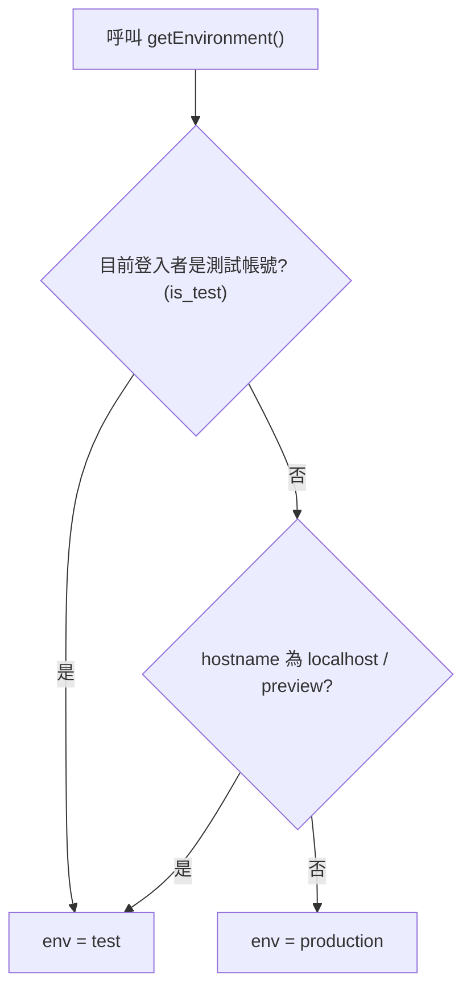
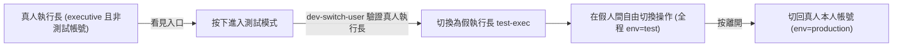
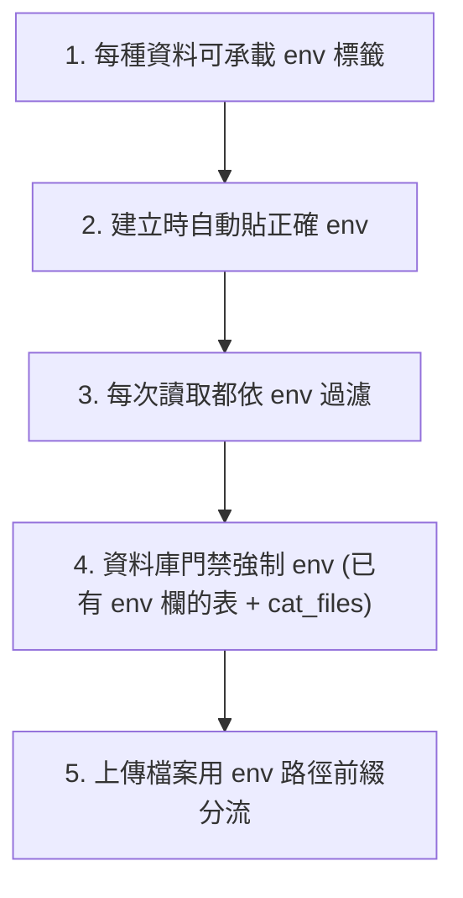

# 測試模式（環境隔離）實作規劃 2026-06

> 狀態：**規劃中（尚未動程式）**。本文件為設計藍圖，供日後實作與驗收對照。
> 語言：台灣正體中文。Shell 為 Windows PowerShell（指令分開呼叫、勿用 `&&`）。
> 相關常駐規則：[`.cursor/rules/language-zh-tw.mdc`](../.cursor/rules/language-zh-tw.mdc)、[`.cursor/rules/shell-windows.mdc`](../.cursor/rules/shell-windows.mdc)。

---

## 1. 目標與白話說明

為**執行長**新增一個「測試模式」：執行長可在系統內自由切換成各種「假人」身分（假執行長、假 PM、假譯者等），以真實操作的方式驗收各種功能修改。這些假人在測試模式中被視為系統內的真實人物，在「團隊成員」頁自成一區，只有真人執行長看得到、可管理。

測試模式所產生的一切資料（案件、請款、費用、CAT 翻譯專案、檔案）一律歸入**測試區**，與正式營運資料**確實隔離**，不會誤刪誤改線上資料。

「白話對照」：本文出現的技術名詞，首次出現時以一句白話說明其與使用者的關係。

---

## 2. 核心設計決策（已與專案擁有者確認）

| 項目 | 決策 |
| --- | --- |
| 整體方案 | **方案 A**：測試與正式共用同一個後端（Supabase），靠 `env`（`test`/`production`）標籤分區。不另開獨立後端。 |
| 環境綁定 | **綁定身分**：假帳號永遠在測試區（`env=test`）、真帳號永遠在正式區（`env=production`）。不做與身分無關的開關。 |
| 身分模型 | **混合**：真人執行長「開門」→ 進去自動變成假執行長 → 在假人間自由切換 → 「離開」切回真人本人。 |
| 入口閘 | 看得到入口的條件＝「`executive` 角色」**且**「非測試帳號」。 |
| 範圍 | LMS（案件／請款／費用）＋ CAT 翻譯專案 ＋ 上傳檔案，**全包**。 |
| 隔離強度 | **聰明折衷**：前端全面帶 `env`；已有 `env` 欄的表＋`cat_files` 在資料庫層強制把關；高量葉子表（如 `cat_segments`）靠母層＋前端＋入口一致性檢查保護。 |
| 種子資料 | 預先放代表性案件、費用與一個 CAT 專案＋檔案。 |
| Slack 通知 | 測試模式導到測試頻道（訊息加 `[測試]` 前綴，可選測試頻道）。 |
| 重置 | 執行長可按「重置測試環境」按鈕，連測試上傳檔案一起清（含 CAT），加防呆確認。 |
| 持續性 | 重整頁面仍維持測試模式（因綁身分，登入者沒變就維持）；切回本人即離開。 |
| 假人名單起始 | 沿用現有四個：執行長、PM、譯者一、譯者二；日後可在團隊成員頁增減。 |

> 名詞白話：
> - **env / 環境標籤**：每筆資料上「這是測試還是正式」的記號。
> - **RLS（資料列存取規則）**：資料庫層級的門禁，後端強制「誰能讀／改哪些資料」，前端 bug 也擋得住。
> - **service role**：系統最高權限金鑰，後端函式用；**RLS 對它無效**，故用到它的函式須自行嚴格驗證呼叫者。

---

## 3. 現況盤點（實作前的事實基礎）

### 3.1 角色與身分

- 角色定義於 PostgreSQL enum `app_role`：`member` | `pm` | `executive`（執行長＝`executive`，最高權限）。見 [`supabase/migrations/20260305092158_c333bc05-afc1-4728-96d7-a26aae40c810.sql`](../supabase/migrations/20260305092158_c333bc05-afc1-4728-96d7-a26aae40c810.sql)。
- 輔助函式 `has_role(uid, role)`、`is_admin(uid)`（`pm` 或 `executive`）定義於同一 migration（行 41–66）。
- 前端 [`src/hooks/use-auth.ts`](../src/hooks/use-auth.ts) 計算 `isAdmin`、`primaryRole`（行 146–153）；**目前沒有** `isExecutive` 匯出、**沒有**測試帳號旗標。

### 3.2 環境判定（目前只看網址）

[`src/lib/environment.ts`](../src/lib/environment.ts)：`getEnvironment()` 依 hostname 判斷，結果快取在模組級 `_env`（第一次呼叫後不再重算，直到整頁 reload）。

- localhost / `*.lovableproject.com` / `*-preview--*` → `test`；其餘 → `production`。
- `envKey(key)` 用於 `app_settings` 的鍵前綴。

### 3.3 既有的 env 過濾與寫入（LMS 已做、CAT 未做）

- **LMS 已做**：[`src/stores/case-store.ts`](../src/stores/case-store.ts)、[`fee-store.ts`](../src/stores/fee-store.ts)、[`invoice-store.ts`](../src/stores/invoice-store.ts)、[`client-invoice-store.ts`](../src/stores/client-invoice-store.ts)、[`internal-notes-store.ts`](../src/stores/internal-notes-store.ts)、[`icon-library-store.ts`](../src/stores/icon-library-store.ts) 查詢時 `.eq("env", env)`、insert 時帶 `env`。權限 [`src/hooks/use-permissions.ts`](../src/hooks/use-permissions.ts) 依 env 讀 `permission_settings`。Realtime fallback [`src/lib/realtime-poll.ts`](../src/lib/realtime-poll.ts) 依 env 過濾。
- **CAT 未做（主要缺口）**：[`src/lib/cat-cloud-rpc.ts`](../src/lib/cat-cloud-rpc.ts)
  - `db.getProjects`（行 741–743）、`db.getTMs`（行 1498–1500）、`db.getTBs`（行 1652–1654）全表查詢，**無** `.eq("env", …)`。
  - `db.createProject`（行 670–688）、`db.createTM`、`db.createTB`、`db.createFile` insert **不帶 env** → 落 DB 預設 `production`（即使在 localhost 測試）。
  - `db.searchLmsCases`（行 888–907）無 `projectId` 時 hardcode `"production"`。
  - Storage 路徑無 env 前綴：`buildCatOriginalStoragePath`（行 101–103）→ `{projectId}/{fileId}/original`；`cat-notes-images` 同。

### 3.4 RLS 現況（資料庫門禁很鬆，且未含 env）

依 migration 鏈最終狀態（[`supabase/migrations/20260502140000_rls_initplan_fix.sql`](../supabase/migrations/20260502140000_rls_initplan_fix.sql) 等）：

| 表 | SELECT | INSERT / UPDATE / DELETE | 有 `env` 欄 | policy 用 `env` |
| --- | --- | --- | --- | --- |
| `cases` | 所有已登入 | INSERT/DELETE 限 admin；**UPDATE 所有已登入（`USING(true)`，隱患）** | 是 | 否 |
| `fees` | 所有已登入 | 限 admin | 是 | 否 |
| `invoices` | 所有已登入 | admin 或譯者改自己的 | 是 | 否 |
| `client_invoices` / `_fees` | 限 admin | 限 admin | 是 | 否 |
| `cat_projects` / `cat_tms` / `cat_tbs` | 所有已登入全 CRUD | 同左 | 是 | 否 |
| `cat_files` / `cat_segments` / `cat_views` / `cat_stage_assignments` | 所有已登入全 CRUD | 同左 | **否** | 否 |
| `cat_file_assignments` | admin 或受派者本人 | 同左 | 否 | 否 |
| `profiles` / `user_roles` / `invitations` / `member_translator_settings` | 已登入可讀（帳號全域） | 管理類依 admin | 否 | 否 |

- **確認**：沒有任何 RLS policy 用到 `env`。隔離完全靠前端。
- `env` 在多數表已有索引（如 `idx_cases_env_created`、`idx_fees_env`），但**所有 CAT 表都沒有 env 索引**。

### 3.5 身分切換現況

- [`src/components/DevRoleSwitcher.tsx`](../src/components/DevRoleSwitcher.tsx)：四個白名單測試帳（`test-exec@test.local` 等），流程為 `dev-switch-user` 取 magic link → `signOut` → `verifyOtp`。
- 顯示條件 `import.meta.env.DEV`（[`src/components/AppLayout.tsx`](../src/components/AppLayout.tsx) 行 58–63），正式站不顯示。
- [`supabase/functions/dev-switch-user/index.ts`](../supabase/functions/dev-switch-user/index.ts)：**只檢查目標 email 白名單，未驗證呼叫者** → 安全隱患。
- 對照可參考 [`supabase/functions/delete-user/index.ts`](../supabase/functions/delete-user/index.ts)（行 38–50）已驗證呼叫者為 `executive`。

### 3.6 團隊成員與 Slack

- [`src/pages/MembersPage.tsx`](../src/pages/MembersPage.tsx) 合併 `profiles`＋`user_roles`＋`invitations`＋`member_translator_settings`；列級隱藏既有模式為 `member.frozen && !canViewFrozen`（行 396–397）。
- Slack 通知（[`InquirySlackDialog.tsx`](../src/components/InquirySlackDialog.tsx)、[`NoteReminderSlackDialog.tsx`](../src/components/NoteReminderSlackDialog.tsx)、[`src/lib/slack-case-reply-notify.ts`](../src/lib/slack-case-reply-notify.ts)、cat-cloud-rpc）走使用者 OAuth token 發 DM，**無 env 分流**。

---

## 4. 目標流程圖

### 4.1 環境判定改為「身分優先」

### 4.2 進入／離開測試模式

### 4.3 隔離五件事（缺一則漏）

---

## 5. 實作工項

### 工項一：環境判定改為「身分優先」

- [`src/lib/environment.ts`](../src/lib/environment.ts)
  - `getEnvironment()` 先判斷目前登入者是否為測試帳號（讀已快取的旗標），是則回 `test`；否則沿用 hostname 規則。
  - 新增 `resetEnvironmentCache()`：清 `_env = null`，供登入者切換後重算。
- [`src/hooks/use-auth.ts`](../src/hooks/use-auth.ts)
  - 取得使用者時一併載入 `profiles.is_test`；提供 `isTestAccount`、`isRealExecutive`（`executive` 且非測試帳號）。
- 切換登入者（進／出測試模式）後一律 `location.reload()`：一次清掉所有 store 記憶體與 realtime 訂閱，避免跨 env 殘留。

> 注意：`_env` 模組快取是最大陷阱。覆寫必須在第一次 `getEnvironment()` 之前生效，或於切換後 reset／reload。

### 工項二：資料庫 — 測試帳號旗標與 RLS env 把關

新增一支 migration（`supabase/migrations/<timestamp>_test_mode_env_isolation.sql`）：

1. `ALTER TABLE public.profiles ADD COLUMN is_test boolean NOT NULL DEFAULT false;`
2. 輔助函式 `public.current_env()`：依 `profiles.is_test`（對應 `auth.uid()`）回傳 `'test'`／`'production'`（`SECURITY DEFINER`、`STABLE`）。
3. **已有 `env` 欄的表**併入 RLS 條件 `env = public.current_env()`（SELECT/UPDATE/DELETE 的 `USING`，INSERT/UPDATE 的 `WITH CHECK`）：
   `cases`、`fees`、`invoices`、`invoice_fees`、`client_invoices`、`client_invoice_fees`、`internal_notes`、`icon_library`、`cat_projects`、`cat_tms`、`cat_tbs`、`permission_settings`。
4. **`cat_files` 加 `env` 欄 + 索引 + RLS**（檔案是子表中最危險的單位）。
5. 收緊現有隱患：`cases` 的 `UPDATE USING(true)` 改為限 PM／執行長或案件相關人，並併入 env。
6. env 索引：`idx_cat_projects_env_created`、`idx_cat_tms_env_created`、`idx_cat_tbs_env_created`、`idx_cat_files_env_project`。
7. 依專案慣例執行 `supabase db push`（依 [`docs/HANDOFF.md`](HANDOFF.md)、[`docs/DEPLOYMENT_CHECKLIST.md`](DEPLOYMENT_CHECKLIST.md)）。

> 高量葉子表（`cat_segments`、workflow 子表等）**不加** RLS env，避免「每行往上追問」的效能與誤鎖風險；改靠母層（`cat_projects`/`cat_files` 已鎖）＋前端＋工項三的入口一致性檢查保護。

### 工項三：補滿 CAT 的 env 隔離（前端 + RPC）

- [`src/lib/cat-cloud-rpc.ts`](../src/lib/cat-cloud-rpc.ts)
  - 入口 `handleCatCloudRpc` 取 `const env = getEnvironment()`。
  - 列表過濾：`db.getProjects`、`db.getTMs`、`db.getTBs` 加 `.eq("env", env)`。
  - 建立帶標籤：`db.createProject`、`db.createTM`、`db.createTB`、`db.createFile`（含新 `cat_files.env`）寫入 `env`。
  - `db.searchLmsCases` 改為一律 `getEnvironment()`（移除 hardcode `production`）。
  - **新增 env 一致性檢查**：`patchProject`/`deleteProject`/`updateProject*`、`updateFile`/`deleteFile`/`refreshFileSegments` 等修改前，先確認目標 `cat_projects.env`（或 `cat_files.env`）等於當前 env，不符則拋錯並拒絕（防程式誤帶跨區 ID）。
  - Storage：`buildCatOriginalStoragePath` → `{env}/{projectId}/{fileId}/original`；`db.uploadNoteImage` → `{env}/{userId}/…`；同步 `deleteProject` 的路徑收集邏輯。
- React 直查補 env：[`src/components/case/CatProjectFilePickerModal.tsx`](../src/components/case/CatProjectFilePickerModal.tsx) 等加 `.eq("env", getEnvironment())`。
- CAT iframe 指派同步：[`src/pages/CatToolPage.tsx`](../src/pages/CatToolPage.tsx) 的 `sendAssignments` 等直查改經 env 過濾的母層。
- 改完於專案根目錄執行 `npm run sync:cat`，一併提交 `cat-tool` 與 `public/cat`。

### 工項四：身分切換入口（執行長專用、限真人）

- [`src/components/DevRoleSwitcher.tsx`](../src/components/DevRoleSwitcher.tsx) 升級為正式「測試模式」面板：
  - 顯示條件由 `import.meta.env.DEV` 改為 `isRealExecutive`。
  - 新增「離開測試模式（切回本人）」。
- [`supabase/functions/dev-switch-user/index.ts`](../supabase/functions/dev-switch-user/index.ts)：比照 `delete-user` 驗證呼叫者為 `executive` 且**非測試帳號**；維持 magic link + `verifyOtp`。
- 入口掛點：[`src/components/AppLayout.tsx`](../src/components/AppLayout.tsx) header 常駐「測試模式」banner ＋顯示目前扮演身分。
- 「切回本人」：需設計安全的免密碼回切（magic link 機制延伸，且僅限本來就是真人執行長者觸發）。

### 工項五：團隊成員「假人專區」

- [`src/pages/MembersPage.tsx`](../src/pages/MembersPage.tsx)
  - 載入帶 `profiles.is_test`；把測試帳號獨立成一區，**只對真人執行長顯示**（沿用 `frozen` 隱藏列模式）。
  - 真人執行長可新增／刪除假人、改其角色。
- 建帳走 [`supabase/functions/create-user/`](../supabase/functions/create-user/index.ts)：補執行長驗證，且建立時自動標 `is_test=true`。

### 工項六：Slack 測試分流

- 前端所有 Slack invoke（[`InquirySlackDialog.tsx`](../src/components/InquirySlackDialog.tsx)、[`NoteReminderSlackDialog.tsx`](../src/components/NoteReminderSlackDialog.tsx)、[`slack-case-reply-notify.ts`](../src/lib/slack-case-reply-notify.ts)、cat-cloud-rpc）加 `env: getEnvironment()`。
- Slack edge function：`env==='test'` 時訊息加 `[測試]` 前綴；可選新增 Secret `SLACK_TEST_CHANNEL_ID` 改 post 測試頻道。
- 連結 URL 仍為正式網域，建議測試訊息明確標記避免誤判。

### 工項七：種子資料與一鍵重置

- **種子**：migration 或腳本建立 `env=test` 的代表性案件、費用、一個 CAT 專案＋檔案；確保假人 `display_name` 與案件 `translator`／費用 `assignee` 對齊（系統部分視角靠人名比對）。
- **重置**：執行長專用「重置測試環境」按鈕 ＋ edge function（service role）：
  - 刪除所有 `env='test'` 業務資料（含 CAT 專案／檔案／句段）。
  - 刪除 `cat-original-files`、`cat-notes-images` 的 `test/` 路徑物件。
  - 加防呆二次確認（不可逆）。
  - 延伸現有清理樣板 [`supabase/migrations/20260311114006_38e11f69-3062-4e18-8ec9-0bd61fce6e7a.sql`](../supabase/migrations/20260311114006_38e11f69-3062-4e18-8ec9-0bd61fce6e7a.sql)。

---

## 6. 建議實作順序

1. 工項二（資料庫：`is_test`、`current_env()`、`cat_files.env`、RLS、索引）— 基礎。
2. 工項一（環境判定身分優先）＋工項三（CAT 前端／RPC 補 env）— 讓資料正確分流。
3. 工項四（執行長入口＋安全閘）— 開門機制。
4. 工項五（假人專區）。
5. 工項七（種子＋重置）。
6. 工項六（Slack 分流）。
7. 全面驗收（見 §8）。

---

## 7. 風險與注意事項

- **殘留風險**：`cat_segments` 等葉子表未加 RLS env，靠母層＋前端＋RPC 一致性檢查；其 ID 為不可猜的亂碼，惡意跨區風險極低，主要防的是程式 bug 誤帶 ID。
- **同瀏覽器單一身分**：切換假人影響所有分頁；需同時對照不同身分得用不同瀏覽器或無痕視窗。
- **service role 繞過 RLS**：`dev-switch-user`、`create-user`、重置 function 等必須嚴格驗證呼叫者。
- **既有 localhost 誤寫**：過去在 localhost 建立的 CAT 專案 `env` 可能為 `production`，需評估是否 backfill 為 `test`。
- **`_env` 模組快取**：切換登入者後務必 `resetEnvironmentCache()` 或整頁 reload。
- **`settings-persistence` legacy fallback**：新 key 無資料時會讀無前綴舊 key（[`src/stores/settings-persistence.ts`](../src/stores/settings-persistence.ts) 行 54–67），測試模式可能誤讀正式設定，需留意。
- **CAT 改動後**務必 `npm run sync:cat` 再提交。

---

## 8. 驗收方式（白話）

1. **隔離**：以真人執行長登入正式站，記下某真實案件。進測試模式（變假執行長），確認**看不到**該真實案件；在測試模式新建一筆案件，離開測試模式後，正式區**看不到**這筆測試案件。
2. **假人視角**：在測試模式切成假譯者，確認只看得到指派給該譯者的工作。
3. **CAT**：測試模式新建一個 CAT 專案與檔案；離開後在正式區的 CAT 專案清單**看不到**它。
4. **團隊專區**：以真人執行長在團隊成員頁看得到「測試帳號」專區並可增減；以 PM／譯者登入則**完全看不到**該專區與測試模式入口。
5. **重置**：按「重置測試環境」並確認後，測試區案件／CAT／檔案清空，正式區**毫髮無傷**。
6. **Slack**：測試模式觸發通知，訊息帶 `[測試]` 標記或進測試頻道，不打擾正式收件者。

---

## 9. 待決與後續

- 是否將過去 localhost 誤標 `production` 的 CAT 專案 backfill 為 `test`。
- Slack 測試分流採「訊息前綴」或「測試頻道」或「獨立工作區」（本規劃預設前綴＋可選測試頻道）。
- 全域 AI 設定（`cat_ai_*`）測試與正式是否共用 API key（預設共用；若要分離需另加 env）。
- 日後若要升級為「全表 RLS env」，本設計已預留路徑（補各子表 JOIN 條件或 denormalize env 欄）。

---

## 10. 實作完成狀態（2026-06-30）

七個工項的程式與 migration 皆已寫好、TypeScript 型別檢查通過；**尚未** 推上正式資料庫與部署 Edge Function（屬高風險正式環境操作，待確認後執行）。

| 工項 | 內容 | 觸點 |
| --- | --- | --- |
| 一 | 環境判定改身分優先、`resetEnvironmentCache()`、`isTestAccount`/`isRealExecutive` | [`src/lib/environment.ts`](../src/lib/environment.ts)、[`src/hooks/use-auth.ts`](../src/hooks/use-auth.ts)、[`src/lib/profile-columns.ts`](../src/lib/profile-columns.ts) |
| 二 | `profiles.is_test`、`public.current_env()`、`cat_files.env` + backfill + 索引、對有 env 欄的表與 `cat_files` 併入 `env = current_env()` 的 RLS | [`supabase/migrations/20260630120000_test_mode_env_isolation.sql`](../supabase/migrations/20260630120000_test_mode_env_isolation.sql) |
| 三 | CAT 雲端 RPC 全面補 env（建立帶標籤、列表過濾、`searchLmsCases`、Storage 路徑 env 前綴、一致性檢查），React 直查補 env | [`src/lib/cat-cloud-rpc.ts`](../src/lib/cat-cloud-rpc.ts)、[`src/components/case/CatProjectFilePickerModal.tsx`](../src/components/case/CatProjectFilePickerModal.tsx) |
| 四 | 測試模式面板（真人執行長入口 / 假人切換 / 離開）、常駐警示條、`dev-switch-user` 加呼叫者授權 | [`src/components/DevRoleSwitcher.tsx`](../src/components/DevRoleSwitcher.tsx)、[`src/components/AppLayout.tsx`](../src/components/AppLayout.tsx)、[`supabase/functions/dev-switch-user/index.ts`](../supabase/functions/dev-switch-user/index.ts)、[`supabase/config.toml`](../supabase/config.toml) |
| 五 | 團隊成員頁假人專區（僅真人執行長可見）、`create-user` 加授權與 `is_test` 標記 + 直接指派角色 | [`src/pages/MembersPage.tsx`](../src/pages/MembersPage.tsx)、[`supabase/functions/create-user/index.ts`](../supabase/functions/create-user/index.ts) |
| 六 | Slack 測試分流：前端帶 `env`，函式於 `env='test'` 時加 `[測試]` 前綴 | [`supabase/functions/slack-send-dm/index.ts`](../supabase/functions/slack-send-dm/index.ts)、`InquirySlackDialog`／`NoteReminderSlackDialog`／`slack-case-reply-notify.ts`／`cat-cloud-rpc.ts` |
| 七 | 重置測試環境 Edge Function（僅真人執行長、僅刪 `env='test'`、含 Storage、可選種子）+ 雙重確認按鈕 | [`supabase/functions/reset-test-env/index.ts`](../supabase/functions/reset-test-env/index.ts)、[`src/pages/MembersPage.tsx`](../src/pages/MembersPage.tsx) |

### 實作取捨（與原規劃的差異）

- **`cases` UPDATE RLS**：原規劃提到「收緊為 PM／相關人」。為避免破壞譯者協作列更新等既有流程，實作改為**維持「已登入皆可改」但加上同 env 限制**（跨環境無法互改）。進一步限縮留待日後以精確的「相關人」定義處理。
- **免密碼返回本人**：採「進入測試模式前先為自己預先取得一張 magic-link 返回票（存 `sessionStorage`，關閉分頁即失效）」。`dev-switch-user` 後端僅允許「切到自己」或「切到 `@test.local`」，因此假帳號無法藉切換跳進任何真人帳號。返回票逾時則退回登入頁。
- **CAT 內嵌前端（`cat-tool/`）未改動**：所有雲端讀寫都經由母層 `handleCatCloudRpc` 強制 env，iframe 無需傳 env，故**不需** `npm run sync:cat`。
- **型別**：`profiles.is_test`、`cat_files.env` 尚未進 generated types，少數直查以 `as any` 規避 TS「型別過深」（與既有慣例一致）。

### 部署順序（高風險，待確認後執行）

1. `supabase db push`（套用 migration；正式 RLS 變更，務必先確認）。**前端依賴此 migration**（`MembersPage` 讀 `is_test`），請先於前端上線前或同時套用。
2. 部署 Edge Functions：`dev-switch-user`、`create-user`、`reset-test-env`、`slack-send-dm`。
3. 由真人執行長在「團隊成員 → 測試成員（假人）」新增 `test-exec@test.local`（角色：執行長）等假人，即可由頂端面板「進入測試模式」。
