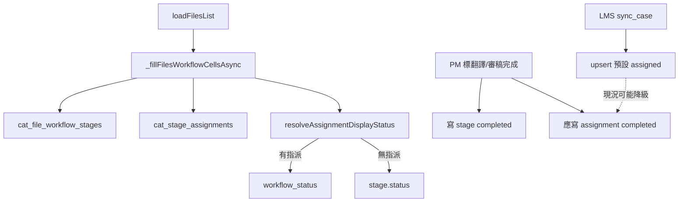

狀態：實作中

# CAT：檔案狀態修復 + 額外資訊自訂／限高

日期：2026-07-14  
來源工單：`CAT_修改工單_額外資訊自訂與檔案狀態修復_2026-07-14.md`（Claude 交辦；本機 Cursor plan：`額外資訊與檔案狀態_3f1f9ca0`）

## 總覽

依工單分三工項：

1. **工項一（Bug）**：檔案清單「完成後重整變待開始」（實為 stage／assignment 不同步，非未讀 stages）
2. **工項三第一階段**：額外資訊限高截斷
3. **工項二 + 工項三第二階段**：中繼資料結構化與欄位對應，並接上 chip 顯示

---

## 工項二進度（2026-07-14）— 階段 A+B

- 分支：`feat/meta-items-display-map`
- Migration（**已套用正式庫**）：`20260714130000_cat_meta_items_display_map.sql`；延伸 `20260714140000_cat_segments_patch_meta_items.sql`（batch patch 含 `meta_items`）
- types.ts 已 MCP 重生核對；Dexie v29／`cat-cloud-rpc` 已對齊
- Collector／apply：`meta-items-collector.js`、`meta-display-apply.js`；更新作業檔 merge 會同步 `metaItems`（舊句段無 meta → 刷新後補齊）
- UI：`meta-display-map-ui.js`＋編輯器 chip；未設 config 或句段無 meta_items → 舊行為
- Vitest：顯示套用、混合 fallback、merge、三格式匯出安全；Playwright：`tests/cat-meta-display-map.spec.ts`

---

## 工項三第一階段進度（2026-07-14）

- 分支：`fix/extra-info-clamp`
- `ExtraInfoDisplay`（`cat-tool/js/extra-info-display.js`）：三行 clamp／展開、長 token 頭8…尾6、可複製
- `CatVirtGrid.remeasureSegHeight`：展開後重測列高
- 純顯示層：不改 `extraValue`／搜尋／匯出

---

## 工項一實作進度（2026-07-14）

- 分支：`fix/wf-stage-assignment-sync`
- 只讀清單：[`CAT_WF_ASSIGNMENT_BACKFILL_INVENTORY_2026-07-14.md`](./CAT_WF_ASSIGNMENT_BACKFILL_INVENTORY_2026-07-14.md)（225 筆，review 199／translate 26）
- 程式：PM 整檔完成／重開改以 `listStageAssignmentsForFile` 同步指派；migration `20260714120000_cat_wf_assignment_sync_no_downgrade.sql` 防降級＋反向路徑；Vitest `wf-assignment-sync-policy`
- **Backfill**：已寫入 migration，**待人工確認 inventory 後才可 `supabase db push`／套用到正式庫**

---

## 工單結論修正（實作前必讀）

工項一寫「讀取端沒抓到 `cat_file_workflow_stages`」——**與現行程式不符**。清單每次 `loadFilesList` → `_fillFilesWorkflowCellsAsync` 都會抓 stages + assignments（見 [`cat-tool/app.js`](../cat-tool/app.js)、[`src/lib/cat-cloud-rpc.ts`](../src/lib/cat-cloud-rpc.ts)）。

真正規則（已文件化於 [`CAT_WORKFLOW_B7_UNIFIED_STATUS_AND_LIST_UX_2026-06.md`](./CAT_WORKFLOW_B7_UNIFIED_STATUS_AND_LIST_UX_2026-06.md) §14.3–14.4）：

```
有 assignment → 只看 assignment.workflow_status
無 assignment → 才看 stage.status === 'completed'
```

因此「DB stage 已 completed、重整後變待開始」的典型原因是：**同檔同階段的 `cat_stage_assignments.workflow_status` 仍是 `assigned`**。PM 整檔完成路徑（`_pmApplyWholeFile*State`）雖會盡力更新 in-memory context 裡的指派，但：

1. context 漏抓／空陣列時只寫了 stage；
2. LMS `sync_cat_workflow_assignments_for_case` 呼叫 `cat_upsert_review_stage_assignment(..., 'assigned')` 會**強制覆寫**既有 `workflow_status`（見 migration `20260629140000`／`cat_upsert_review_stage_assignment`）。

**預設修法（寫入端同步，不動「每人一狀態」產品規則）**：標完成時一定同步該階段所有 assignment；LMS sync 在 stage 已 completed 時不得把指派降回 `assigned`；並對既有髒資料做一次 backfill。若產品改為「stage completed 一律顯示完成」，再改 `resolveAssignmentDisplayStatus`。



---

## 分支策略

一工項一分支（自最新 `main`），順序：

| 順序 | 分支建議 | 內容 |
|------|----------|------|
| 1 | `fix/wf-stage-assignment-sync` | 工項一 |
| 2 | `fix/extra-info-clamp` | 工項三第一階段（可不依赖 W2） |
| 3 | `feat/meta-items-display-map` | 工項二 + 工項三第二階段（chip） |

禁止三工項堆同一 feature 分支。

---

## 工項一：檔案狀態重整後變「待開始」

### A. 實作前只讀驗證（不重查「stage 是否 completed」，改查 assignment）

對工單點名檔案（如 040／420／470）執行：

```sql
SELECT f.name, s.stage_kind, s.status AS stage_status,
       a.assignee_user_id, a.workflow_status, a.updated_at
FROM cat_files f
JOIN cat_file_workflow_stages s ON s.file_id = f.id
LEFT JOIN cat_stage_assignments a ON a.file_workflow_stage_id = s.id
WHERE f.name ILIKE '%040%' OR f.name ILIKE '%420%' OR f.name ILIKE '%470%';
```

預期：`stage_status = completed` 且 `workflow_status` 為 `assigned`（或審稿被 LMS sync 洗回）。

### B. 程式修復

1. **PM／任務完成寫入**：在 [`cat-tool/app.js`](../cat-tool/app.js) `_pmApplyWholeFileTranslateState`／`_pmApplyWholeFileReviewState`（及審稿任務完成 `_maybeCompleteReviewStageForFile` 等）改為：
   - 以 `DBService.listStageAssignmentsForFile(fileId)`（或依 `file_workflow_stage_id` 過濾）為真相來源，**不要只依賴** `_wf*AssignmentsInContext`；
   - stage → `completed` 時，同階段所有整檔指派一併 `workflow_status = 'completed'`；改回 active 時對應降回 `assigned`（維持現有語意）。

2. **LMS sync 防降級**：新 migration 調整 `sync_cat_workflow_assignments_for_case`／`cat_upsert_review_stage_assignment`（idempotent）：
   - 若該檔 `review`（或 translate）stage 已 `completed`，upsert 時傳入／保留 `completed`，**禁止**用字面 `'assigned'` 覆蓋已完成指派；
   - 或：既有列已是 `completed` 且 stage 仍 completed → UPDATE 跳過 status。

3. **既有髒資料 backfill**（同一 migration 或獨立可重跑 SQL，比照 B-7 §14.3）：
   - `stage.status = 'completed'` 且 assignment ≠ `completed` → 設為 `completed`。
   - `supabase db push` 與 migration 檔同分支進 `main`。

4. **顯示層**：`resolveAssignmentDisplayStatus` **預設不改**（維持每人狀態）。若驗證發現「無指派卻仍錯」再另查。

5. **回歸測試**：
   - Vitest：抽純函式「stage completed + assignments 應同步成什麼」或擴充 `wf-display-status` 既有行為測（確認有 assignment + assigned + stage completed → 仍為待開始；有 assignment + completed → 完成）。
   - 可選：SQL 測試檔驗證 upsert 不降級（比照 `supabase/tests/`）。

6. 文件：更新 B-7 或短 DEVLOG／CODEMAP 一句「LMS sync 不得降級已完成指派」；工單結論更正寫入本檔開頭。

### C. 驗收

- 設定「審稿完成」→ 回清單 → 重新整理 → 仍顯示完成。
- 換專案頁再回來仍正確。
- 另一帳號看同一專案仍正確。

---

## 工項三第一階段：額外資訊限高（先於 W2 可獨立上線）

**範圍**：僅顯示層；不改 `extraValue` 儲存、搜尋、匯出。

觸點：[`cat-tool/app.js`](../cat-tool/app.js) 組列 `col-extra`、[`cat-tool/style.css`](../cat-tool/style.css)、虛擬列高 [`cat-tool/js/grid-virtual-scroll.js`](../cat-tool/js/grid-virtual-scroll.js)。

實作定案：

1. **3 行 line-clamp**：`.col-extra` 預設 `-webkit-line-clamp: 3`；點擊格內切換 `.is-expanded` 取消 clamp（格內展開，不做 popover）。
2. **長 token 縮短**：無空白且長度 ≥24 的 token 顯示 `頭8…尾6`；`title`／展開態顯示全文；點縮短片段可複製完整值。
3. 展開／收合後重測虛擬捲動列高。
4. 搜尋／取代仍比對完整 `extraValue`。
5. 最小回歸：長 extra → clamp class；點擊後可見全文。

---

## 工項二：Key／額外資訊結構化與欄位對應

### 現況錨點

| 項目 | 現況 |
|------|------|
| Key | `idValue` → 開檔拆 `seg.keys[]` |
| 額外資訊 | `extraValue`（`\n` 合併字串） |
| 匯出對句 | **`xliffTuId`** + `originalFileBuffer`（[`xliff-tag-pipeline.js`](../cat-tool/js/xliff-tag-pipeline.js)） |
| XLIFF 抽取 | [`xliff-build-segments.js`](../cat-tool/js/xliff-build-segments.js)：`x-mmq-context`→Key，其餘 context／note→extra |
| 可复用 UI | Excel 精靈 `configIdCol`／`configExtraCol` |
| `meta_items` | **不存在**，需 migration |

**硬限制**：對應只影響顯示用 Key／額外資訊渲染；**禁止**改寫匯出用的 `xliffTuId`／原 XML context。

**定案**：持久化仍保留匯入時的原始 `idValue`／`extraValue` 作 fallback；顯示 Key／額外由 `meta_items` + `meta_display_config` 在**渲染時**算出。更新作業檔對鍵繼續用原始 `idValue`／`xliffTuId`。

### D. Schema

- `cat_segments.meta_items jsonb`（default `[]`）：`[{ sourceType, name, value }, …]`
- `cat_files.meta_display_config jsonb`（nullable）：`{ keyItem, extraItems, hiddenItems }`（item key＝`sourceType::name`）
- 專案層範本：`cat_projects.meta_display_templates jsonb` 陣列（`name`、`sourceFormat`、`config`）
- 同步 Dexie + `cat-cloud-rpc`；同 commit 重生 `types.ts` + typecheck
- 既有 `extraValue`／`idValue` **保留不動**

### E. 解析

- 新模組：`cat-tool/js/meta-items-collector.js`（不進 `app.js` 巨檔）
- 匯入填 `meta_items`，同時仍寫 `idValue`／`extraValue`
- mqxliff／sdlxliff／xliff／mxliff／xliff2 統一結構

### F. 欄位對應 UI

- 匯入後可開；檔案設定可再開
- 前 20 句彙總種類 + 範例值
- 單選 Key／多選額外（可排序）／不顯示
- 未設定 → 行為＝現況
- 「存成範本」寫入專案 templates

### G. 編輯器渲染

- 有 config → 自 `meta_items` 顯示 Key／額外；否則舊欄位 + 第一階段 clamp
- 搜尋比對完整值

### H. 測試

- Vitest：collector、display apply、未設 config ≡ 舊行為
- 匯出：三格式設對應前後（譯文以外）diff 空
- Playwright：對應視窗 + Key 欄（測試模式）

### I. 關聯文件

- 實作細節定案後可另拆 `CAT_META_ITEMS_DISPLAY_MAP_PLAN_2026-07.md`；現以本檔為總計畫。
- 驗收後摘要寫入 [`CODEMAP.md`](./CODEMAP.md)。

---

## 工項三第二階段（依賴 W2）

- 有 `meta_items`＋config 時 `col-extra` 改 chip
- 與第一階段 clamp 並存（無 config 舊檔仍用 clamp）

---

## 實作優先順序

1. 工項一（bug）→ 可獨立驗收、先上線  
2. 工項三第一階段 → 可緊接或與 1 平行（不同分支）  
3. 工項二 → 完成後做三－2  

## 需要注意的事項

- 工項一：既有髒資料需 backfill 才立刻正確；單修程式只保證之後不再搞砸。
- 工項二：勿用顯示 Key 覆蓋 `xliffTuId`／匯出 XML。
- 平行代理勿共用同一 working tree（架構 §10）。
