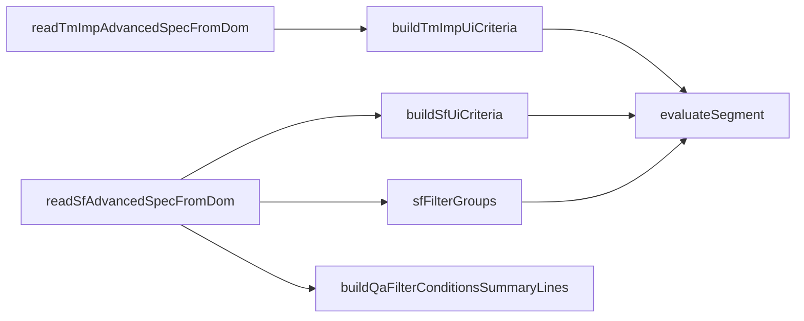

# mqxliff 進階篩選「確認身分」— 開發過程記錄與實作依據

> 本文件為產品／工程單一依據：記錄決策、共用篩選引擎、所有 UI 與程式觸點、行為規格與驗收。  
> 相關：**身分持久化**見 [`bug-report_mqxliff-team-role-persistence.md`](bug-report_mqxliff-team-role-persistence.md)；**靜態排版預覽**見 [`preview-mqxliff-filter-status-options/index.html`](preview-mqxliff-filter-status-options/index.html)。

---

## 1. 背景與時序

| 事項 | 說明 |
|------|------|
| Team 模式 `confirmationRole`／`originalRole` 遺失 | 已於 `cat_segments` 新增欄位並修正 [`src/lib/cat-cloud-rpc.ts`](../src/lib/cat-cloud-rpc.ts)（commit `d9295c1`）。篩選與格線圖示依賴讀回的 `confirmationRole`。 |
| 篩選 UI 預覽 | `docs/preview-mqxliff-filter-status-options/index.html` 收錄多變體；產品定案採 **變體 A 調整版**（見 §3）。 |
| 定案（版面） | **第一列**：空白、非空白、已確認、未確認、鎖定、未鎖定（同一 `sf-adv-grid`）。**第二列**：前綴文案「memoQ 確認身分」+ T／R1／R2 勾選；僅 **mqxliff 開檔** 時顯示。非 mqxliff 須清除 memoQ 勾選，避免幽靈條件。 |

---

## 2. 篩選引擎（單一真相）

所有句段是否符合搜尋／篩選，最終皆經 [`cat-tool/app.js`](../cat-tool/app.js) 的 **`evaluateSegment(seg, term, scopes, isRegex, isInvert, statuses, tmVal, evalOpts)`**。

### 2.1 狀態維度（維度內 OR，維度間 AND）

既有三維（見程式內 `contentKeys` / `confirmKeys` / `lockKeys`）：

| 維度 | 鍵值 |
|------|------|
| 內容 | `empty`, `not_empty` |
| 確認 | `confirmed`, `unconfirmed` |
| 鎖定 | `locked`, `unlocked` |

**第四維（memoQ 原檔確認，本功能新增）**

| 鍵值 | 意義 |
|------|------|
| `mq_t` | 已確認且原檔確認身分為譯者 T（比對 `originalRole`，fallback `confirmationRole`；空值視同 T） |
| `mq_r1` | 已確認且原檔為 R1 |
| `mq_r2` | 已確認且原檔為 R2 |

**語意（產品定案；2026-06-24 修正，`61e8fc2`）**

1. **未確認句段**：第四維**不通過**（勾選 T／R1／R2 時會被隱藏）。UI 文案改為「memoQ **原檔**確認」。
2. **已確認句段**：若第四維有任一勾選，則須滿足 **OR**（所勾身分之一與 `_mqOriginalRoleForFilter(seg)` 相符）；若第四維無勾選，則此維度不參與。
3. **隱含**：僅勾 `mq_*` 而未勾「已確認」時，只顯示「已確認且原檔身分相符」的列；未確認列不會因第四維通過而出現。

`originalRole`／`confirmationRole` 來源：匯入解析與使用者確認寫入；Team 模式見 `cat-cloud-rpc` 欄位 `original_role`、`confirmation_role`。格線狀態欄外圈勾選優先顯示 `originalRole`。

### 2.2 資料流（mermaid）

### 2.3 第五維（內部 Workflow 標記，Phase B 規劃）

> **狀態**：**已落地**於 `evaluateSegment`（Phase B B-5）。完整規格見 [`CAT_WORKFLOW_PHASE_B_SPEC_2026-06.md`](./CAT_WORKFLOW_PHASE_B_SPEC_2026-06.md) §3、§7 B-5。

與第四維（memoQ `mq_t`／`mq_r1`／`mq_r2`）**分開**；僅在 Phase B 落地後啟用。

| 鍵值 | 意義 |
|------|------|
| `wf_trans_marked` | 句段已標記內部**翻譯**步（對應狀態欄實心綠點） |
| `wf_review_marked` | 句段已標記內部**審稿**步（對應狀態欄綠外圈） |

**語意（草案）**

1. 與 memoQ 第四維獨立：勾選 `wf_*` 不隱含 `confirmed`／`mq_*` 條件。
2. 維度內 OR、維度間 AND，與 §2.1 既有三維＋第四維相同。
3. 非 mqxliff 開檔時仍可套用 `wf_*`（若 Phase B 對通用檔啟用內部標記）；memoQ 第四維仍僅 mqxliff 顯示。
4. 左欄 ID（全清單列序）見 [`CAT_SORT_AND_DISPLAY_ORDER_SPEC_2026-06.md`](./CAT_SORT_AND_DISPLAY_ORDER_SPEC_2026-06.md) §3。

---

## 3. 定案 UI（編輯器 `#sfAdvancedPanel`）

- **區塊標題**：維持「句段狀態」。
- **列 1**（`sf-adv-status-row1`）：六個 `<label>`，class **`sf-status-cb`**，value 同現有 + 鎖定自原 row2 移入。
- **列 2**（`id="sfMqRoleFilterRow"`**）**：`display` 由 `currentFileFormat === 'mqxliff'` 控制。內含：
  - 非互動文字「memoQ 原檔確認」（勿用 `sf-status-cb`，避免被全選讀取邏輯誤掃）。
  - 三個 checkbox：`class="sf-status-cb sf-mq-role-cb"`，`value` 分別為 `mq_t`、`mq_r1`、`mq_r2`；標籤文案與格線圖示對齊（T ✓、R1 ✓+、R2 ✓✓）。
  - 可選一行 `role-note` 說明（僅顯示原檔已確認且身分相符的句段；未確認句段不會列入）。
- **樣式**：[`cat-tool/style.css`](../cat-tool/style.css) — 列 2 與列 1 間虛線分隔；`memoQ` 標籤 `white-space: nowrap`、`align-items: center`。

---

## 4. 程式與 HTML 觸點清單（實作時逐項打勾）

### 4.1 HTML

| 檔案 | 區塊 |
|------|------|
| [`cat-tool/index.html`](../cat-tool/index.html) | `#sfAdvancedPanel` 句段狀態：列 1／列 2 結構如上。 |
| 同上 | `#tmXliffImportDialog`：與編輯器**相同順序與選項**；列 2 容器建議 `id="tmMqRoleFilterRow"`，於 `showModal` 前依 `pendingTmXliffFile.name` 是否 `.mqxliff` 顯示／隱藏並清除勾選。 |

### 4.2 JavaScript（[`cat-tool/app.js`](../cat-tool/app.js)）

| 區塊 | 動作 |
|------|------|
| `evaluateSegment` | 加入第四維 `mqRoleKeys` 迴圈分支（§2.1）。 |
| `statusNames` | 補 `mq_t`、`mq_r1`、`mq_r2` 中文顯示字串。 |
| `getSfFilterSpecHash` | 已含 `adv.statuses` 則自動含新鍵；確認 hash 重建正確。 |
| `readSfAdvancedSpecFromDom` | 維持讀取所有 `.sf-status-cb:checked`（含 `sf-mq-role-cb`）。 |
| `clearSfAdvancedSpecOnDom` | 不變（仍清全部 `sf-status-cb`）。 |
| `applySfAdvancedSpecToDom` | 不變（`statuses.includes(c.value)` 含 mq 鍵）。 |
| **`syncSfMqRoleFilterRowVisibility`**（新建） | 依 `currentFileFormat` 顯示／隱藏 `#sfMqRoleFilterRow`；非 mqxliff 時取消勾選 `.sf-mq-role-cb`。 |
| 呼叫 sync | `openEditorForFile` 在格式與 mq 圖示設定後；句段集載入 `currentFileFormat = 'excel'` 後；`resetEditorTransientUi` 結尾（或 `clearUIFilters` 後一併）。 |
| `readTmImpAdvancedSpecFromDom` / `resetTmXliffImportDialogDefaults` | TM 對話框第二列三格：預設**不**勾 mq；重置時清除 mq 勾選。 |
| **TM `showModal` 前** | 依檔名顯示／隱藏 `#tmMqRoleFilterRow` 並清除隱藏時之 mq 勾選。 |
| `isSfAdvancedFilterInUse` | 若 `statuses` 含任一 `mq_*` 視為進階篩選使用中（或依現有 `adv.statuses.length` 已涵蓋）。 |
| `getSfFilterGroupConditionLines` / `buildQaFilterConditionsSummaryLines` | 依賴 `statusNames`，補鍵後即通。 |

### 4.3 註解

`ADVANCED_SF_SPEC_KEYS` 註解（約 15049 行）：本功能未新增獨立 spec 鍵（仍用 `statuses` 陣列），可於註解加一句「memoQ 身分鍵 mq_t／mq_r1／mq_r2 存於 statuses」。

### 4.4 建置

變更 `cat-tool/` 後執行 **`npm run sync:cat`**，並提交 `public/cat/`。

---

## 5. 驗收清單

1. mqxliff 開檔：進階篩選列 2 顯示；Excel／XLIFF 等列 2 隱藏且 mq 勾選被清除。  
2. 列 1 順序：空白、非空白、已確認、未確認、鎖定、未鎖定。  
3. 僅勾 R1：已確認且 `originalRole === 'R1'` 的列通過；未確認列**不**因第四維通過而出現。  
4. TM mqxliff 匯入對話：列與行為與編輯器一致；非 mqxliff 匯入時列 2 隱藏。  
5. 篩選群組／常用組合／QA 範圍摘要：出現可讀的 memoQ 身分描述。  
6. 切換檔案後篩選快照 hash 與實際列一致（無殘留 mq 條件）。

---

## 6. 修訂紀錄

| 日期 | 說明 |
|------|------|
| 2026-05-10 | 初版：整合計畫書、觸點表與 `evaluateSegment` 規格。 |
| 2026-06-12 | §2.3：Phase B 內部 Workflow 篩選第五維草案（`wf_trans_marked`／`wf_review_marked`）。 |
| 2026-06-10 | §2.3：**已落地** B-5：`evaluateSegment` 第五維；進階面板「內部 Workflow」列；語意與 `_isWfTransMarkedEffective`／`_isWfReviewMarkedEffective` 一致。 |
| 2026-06-24 | §2.1 第四維語意修正（`61e8fc2`）：改比對 `originalRole`、未確認句段不通過；UI「memoQ 原檔確認」；Team `addSegments` 持久化 `wf_*_confirmed_*`。匯入疊層／TM 去重見 [`bug-report_import-confirmed-tm-write-progress-overlay_2026-06.md`](./bug-report_import-confirmed-tm-write-progress-overlay_2026-06.md)。 |
