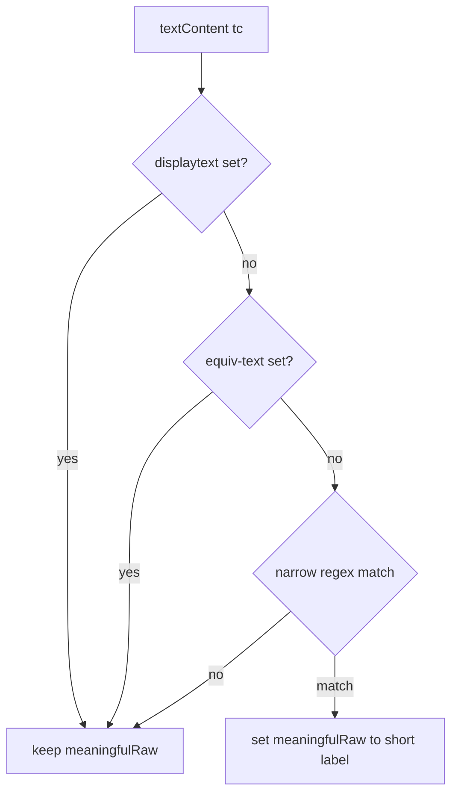
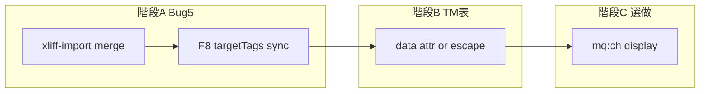

# CAT：mqxliff／TM 修正實作計畫

> 建立日期：2026-05-03  
> 專案：1UP TMS — Vanilla CAT（[`cat-tool/`](../cat-tool/)）  
> 相關調查：[`bug-report_mqxliff-partial-target-tags.md`](bug-report_mqxliff-partial-target-tags.md)（Bug #5）、[`bug-report_mqxliff-tag-issues.md`](bug-report_mqxliff-tag-issues.md)

本文件為**實作與驗收總表**；核准後依階段修改程式，並依 [`AGENTS.md`](../AGENTS.md) 執行 `npm run sync:cat`、一併提交 `public/cat/`。

---

## 1. 背景與範圍

問題分三線，可**分階段**實作，不必一次全上：

| 線 | 主題 | 對照 |
|----|------|------|
| A | 部分譯文 `targetTags` 缺漏、F8 未同步 | Bug #5 |
| B | TM 比對表 `ondblclick` 內嵌譯文含 `"` 時破壞 HTML | 建議列為 Bug #6 |
| C | memoQ **`mq:ch` pill display** 友善標示（換行／Tab／NBSP 等，見 §4） | 選做 |
| D | 匯出長句：字面 `&lt;…&gt;` 與多 `<ph>` 混用 | 後續調查 |

**說明**：不以客戶檔名推斷檔案是否「斷尾」；若需判斷資料是否截斷，應直接檢視該句 `<source>`／`<target>` XML。

---

## 2. 階段 A — Bug #5（優先）

| 步驟 | 動作 | 檔案 |
|------|------|------|
| A1 | mqxliff **單段** TU：若 `sourceTags.length > targetTags.length`，依原文 `sourceTags` 順序合併缺漏 `ph`；已自 `<target>` 解析到的條目保留**原物件**（維持該 ph 的 `xml`） | [`cat-tool/js/xliff-import.js`](../cat-tool/js/xliff-import.js) — 新增 `mergeMqxliffPartialTargetTagsFromSource`，於 `augmentTargetTagsForPlainInlineMemoQ` **之後**呼叫 |
| A2 | `insertNextMissingTag`：插入後將本次插入的 tag（standalone 或成對）併入 `seg.targetTags`；呼叫 `applyUpdateSegmentTarget(seg, seg.targetText, { targetTags: seg.targetTags })` | [`cat-tool/app.js`](../cat-tool/app.js) |
| A3 | **成對**插入（選取範圍包 open/close）時，兩筆 tag 皆需寫入 `targetTags` | 同上 |

**驗收**

1. 匯入「譯文僅含部分 `<ph>`」的 mqxliff → 句段 `targetTags` 與原文 ph 編號**對齊**（筆數／`ph` 鍵完整）。
2. F8 補缺漏 tag → 觸發搜尋重畫、失焦寫庫、重新開檔後，譯文欄仍為 **pill**，非純文字 `{N}`。
3. Team 模式：RPC／`target_tags` 映射仍寫入（見 [`.cursor/rules/xliff-tag-export.mdc`](../.cursor/rules/xliff-tag-export.mdc)）。

---

## 3. 階段 B — TM 比對表 HTML（優先）

| 步驟 | 動作 | 檔案 |
|------|------|------|
| B1 | 問題：`buildCatMatchRowsHtml` 以 `ondblclick="… \`${tgtEsc}\` …"` 內嵌譯文；`tgtEsc` 僅跳脫 `\`、`` ` ``、`$`，**未**處理 `"`**。**譯文含 `id="Jump"` 等雙引號時，HTML 屬性被截斷**，出現 `", 100, 0)">` 類殘段（多為**顯示**錯亂，非必然 DB 髒資料） | [`cat-tool/app.js`](../cat-tool/app.js)（約 `buildCatMatchRowsHtml`／17220 行附近） |
| B2 | **建議**：改為 `data-*` 只存**索引**，雙擊時從 `currentTmMatches[idx].targetText` 讀取；或對必須嵌入屬性的字串做**完整** HTML 屬性跳脫（含 `"`、`&`）。一併檢查 `handleCatResultApply` 所有呼叫點 | 同上 |

**驗收**：TM 譯文含雙引號（如 ``）時，比對表四欄排版正常、無殘段；雙擊套用與鍵盤路徑（約 17460、18992 行）仍正確。

---

## 4. 階段 C — memoQ `mq:ch` pill 友善標示（選做）

### 4.1 與既有文件的關係

- 調查背景：[bug-report_mqxliff-partial-target-tags.md](bug-report_mqxliff-partial-target-tags.md) Part 2.5。
- **唯一實作點**：[`cat-tool/js/xliff-tag-pipeline.js`](../cat-tool/js/xliff-tag-pipeline.js) 內 `extractTaggedText` → `processNode` 的 **`ph` / `it` / `x`** 分支：先算 `meaningfulRaw`，再算 `display`，最後 `xml = new XMLSerializer().serializeToString(child)` **不得改動**。

### 4.2 觸發條件（四項須**同時**成立，降低誤判）

| # | 條件 | 說明 |
|---|------|------|
| 1 | 節點為 `ph`、`it` 或 `x` | `bpt` / `ept` / `g` 走不同分支，本功能**不**套用 |
| 2 | **無**可用 `displaytext` | `displaytext` 有值則沿用 memoQ／既有邏輯，**不**覆寫為短標示（見 [xliff-tag-export.mdc](../.cursor/rules/xliff-tag-export.mdc) 之 `display` 解析順序） |
| 3 | **無**可用 `equiv-text` | Trados 等路徑；`equiv-text` 有值則不覆寫 |
| 4 | `child.textContent`（建議變數 `tc`）符合**窄正則** | 比對對象為 DOM **解析後**的 `textContent`（實體已解碼，換行為真實 `\n`／`\r\n`）；見 §4.3 |

若 2 或 3 已採用 `displaytext`／`equiv-text`，**不**做 `mq:ch` 短標示覆寫。僅在通過 1–4 後，覆寫將進入 pill 的 `meaningfulRaw`（再經既有的 25 字截斷等邏輯得到 `display`）。

### 4.3 字元類型與建議 `display`（第一版可只做「換行」）

| 類型 | `tc` 匹配概念（實作時固定為單一或少量正則） | 建議 `display` |
|------|------------------------------------------|----------------|
| 換行 | `<mq:ch` 且 `val` 內**僅**換行類字元（`\n`、`\r\n`、單獨 `\r`） | `↵ 換行`（或產品定案之短文案） |
| Tab | `val` 為單一 `\t` | `→ Tab` |
| NBSP | `val` 為 `\u00A0` | `[NBSP]` |

**換行**建議正則方向（實作時以實際 `tc` 樣本微調）：

- 例如：`/^<mq:ch val="(?:\r\n|\n|\r)" \/>$/`（或與 DOM 字面結構一致的變體，必要時加 `s` 旗標）。
- **禁止**以過寬的 `[\s\S]*` 一次匹配所有 `mq:ch`，避免誤標非換行內容。

### 4.4 安全性與匯出

- **只**修改用於 UI 的 **`display` 計算鏈**：在現有「超過 25 字截斷」**之前**對 `meaningfulRaw` 做替換。
- **不得**修改 `xml`（`serializeToString` 結果）。與 [`docs/XLIFF_TAG_PIPELINE.md`](XLIFF_TAG_PIPELINE.md) 一致：**匯出依 `xml`／`replacePlaceholders`，不依 pill 上的 display 文案**。

### 4.5 實作步驟（建議函式抽取）

1. 在 [`xliff-tag-pipeline.js`](../cat-tool/js/xliff-tag-pipeline.js) 新增小函式（名稱自訂），例如 `maybeMemoQChDisplayOnly(tc, meaningfulRaw, { hadDisplayText, hadEquivText })`：
   - 若 `hadDisplayText` 或 `hadEquivText` 為 true → 回傳原 `meaningfulRaw`。
   - 否則依序嘗試換行／Tab／NBSP 窄匹配 → 回傳對應短字串；皆不符則回傳原 `meaningfulRaw`。
2. 在 `ph`／`it`／`x` 分支中，於算出 `meaningfulRaw` 之後、`const display = …` 之前呼叫。
3. 若 `tc` 為空但 `<ph>` 內僅巢狀 memoQ 的 `ch` 元素（`localName === 'ch'`），可額外讀取該元素之 `val` 屬性（已解碼之單一字元或換行序列）做**同一套**換行／Tab／NBSP 判斷——仍不修改 `xml`，且僅在無 `displaytext`／`equiv-text` 時套用。
4. **選做**：第一版僅實作「換行」一列；Tab／NBSP 可列為 C2 小步或同批次上線。

### 4.6 驗收

- 匯入含 `mq:ch` 換行之 mqxliff：pill 顯示短標示，非整段 XML。
- 匯出同一檔：與匯入前對照，`source`／`target` 內 `<ph>` 結構與 memoQ 可讀性不劣化。
- 設有 `displaytext` 之 ph：**不**被覆寫為 `↵ 換行`。

### 4.7 決策流程（概覽）

---

## 5. 階段 D — 匯出長句／混用字面與 ph（後續）

- 與 Bug #5 **分開**：多個 `<ph>` 與譯文內**字面**角括號並存時，`replacePlaceholders` → `prepareRestoredFragmentForXmlParse` → `setXmlTargetContent` 可能失敗或產生雙重實體。
- 本階段僅列**調查入口**；待 A／B 完成後，以 **TUT 長句**（多 ph + 字面 `&lt;img&gt;`）做 mqxliff 匯出回歸。

**相關符號**：`replacePlaceholders`、`setXmlTargetContent`、`setExportTargetPlainOrFragment`（[`xliff-tag-pipeline.js`](../cat-tool/js/xliff-tag-pipeline.js)）。

---

## 6. 建置與文件維護

1. 變更僅限 [`cat-tool/`](../cat-tool/) 原始碼；完成後於專案根目錄執行 **`npm run sync:cat`**，並提交同步後的 [`public/cat/`](../public/cat/)。
2. 程式上線後更新：
   - [`bug-report_mqxliff-tag-issues.md`](bug-report_mqxliff-tag-issues.md) — Bug #5／#6 **狀態**欄、commit 短碼（可選）。
   - [`bug-report_mqxliff-partial-target-tags.md`](bug-report_mqxliff-partial-target-tags.md) — Part 2.4 標註「已實作」與日期／commit。

---

## 7. 依賴與風險

- **Team 模式**：`target_tags` 與 `segmentExtraCamelToSnake` 映射不可漏（見 xliff-tag-export 規則）。
- **B 階段**：重構後須確認鍵盤套用 TM 不依賴已移除的 inline 字串。

---

## 階段依賴（概覽）

