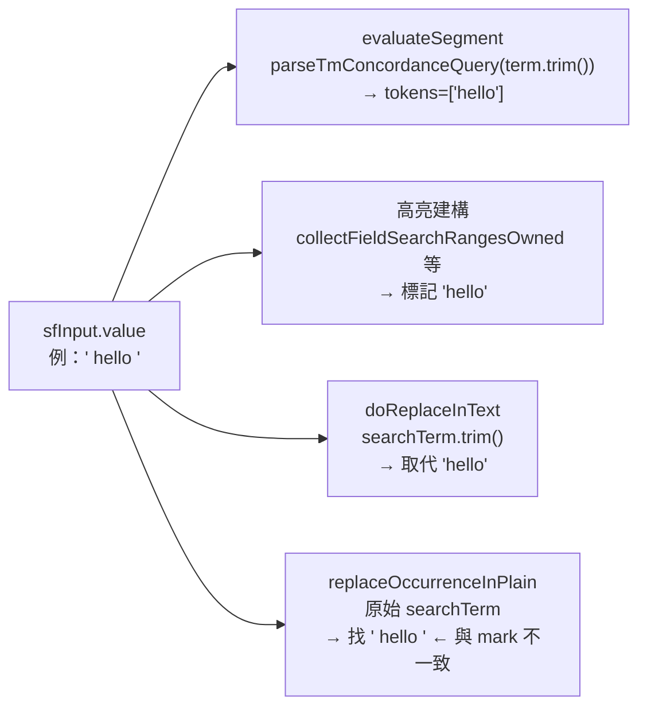

# CAT：整段取代頭尾空格與引號取代 Bug 修正 — 開發紀錄（2026-06）

> 本文件目的：記錄「整段取代」模式下，搜尋詞頭尾空格或手動加引號時，搜尋標記與取代行為不一致的症狀、根因、修正方式與驗收結果，方便日後維運或回頭查找。

---

## 背景與需求緣起

- **功能**：CAT 編輯器頂部搜尋列的「整段取代」按鈕（`#btnPhraseReplace`，狀態變數 `sfPhraseReplaceWhole`）。開啟時，尋找詞應視為**單一整段片語**取代，而非依空白拆成多個詞各自取代。
- **使用者回報**：
  1. 開啟整段取代後，在尋找欄輸入頭尾含空格的關鍵字（例如 ` 你好 `），直接取代時**空格被排除**，只取代中間文字。
  2. 若改用手動加引號（例如 `" 你好 "`），畫面上可能仍有標記，但按「取代這個」或「全部取代」**完全沒反應**。
- **驗收狀態**：2026-06-08 使用者驗收成功。

---

## 症狀整理

### Bug A：輸入 ` hello `（頭尾空格、無引號）

| 步驟 | 修正前行為 |
|------|------------|
| 句段篩選／高亮標記 | `parseTmConcordanceQuery(term.trim())` 丟棄頭尾空格 → 只標記 `hello` |
| 全部取代（`doReplaceInText`） | `searchTerm.trim()` → 取代 `hello`，空格被排除 |
| 取代這個（`replaceOccurrenceInPlain`） | 使用原始 `searchTerm`（含空格）去找 ` hello `，但 `<mark>` 打在 `hello` 上 → **找不到、無反應** |

### Bug B：輸入 `" hello "`（手動加引號）

| 步驟 | 修正前行為 |
|------|------------|
| 句段篩選／高亮標記 | `parseTmConcordanceQuery` 懂引號 → 正確以 ` hello `（保留空格）標記 |
| 全部取代 | `searchTerm.trim()` 得到 `"hello"`（**含引號字元**）→ 原文無此字串 → **無反應** |
| 取代這個 | 同上，以 `"hello"` 比對 → **無反應** |

---

## 根因分析

搜尋詞從 `#sfInput` 讀出後，在**四條獨立路徑**上被不同規則處理，導致「畫面上標記什麼」與「實際取代什麼」脫鉤：



- **搜尋／篩選／高亮**路徑普遍先 `.trim()` 再交給 `parseTmConcordanceQuery`（空白當 AND、引號當片語），與「整段取代應保留頭尾空格」的產品語意衝突。
- **取代**路徑在整段取代開啟時也未統一：全部取代會 trim、取代這個不 trim；兩者皆未與高亮路徑共用同一套「有效搜尋詞」解析。

---

## 方案決策

### 採用方案

新增共用 helper **`getPhraseWholeTerm(rawTerm)`**，僅在 **`sfPhraseReplaceWhole === true`** 時使用：

```js
function getPhraseWholeTerm(rawTerm) {
    const trimmed = (rawTerm || '').trim();
    if (trimmed.length >= 2 && trimmed[0] === '"' && trimmed[trimmed.length - 1] === '"') {
        return trimmed.slice(1, -1);  // 剝引號，保留引號內內容（含空格）
    }
    return rawTerm || '';             // 無引號：保留原始頭尾空格
}
```

四個觸點改為同一規則：

| 觸點 | 函式 | 修正要點 |
|------|------|----------|
| 句段篩選 | `evaluateSegment` | `sfPhraseReplaceWhole` 時以 `getPhraseWholeTerm(term)` 做 `includes` 比對，不走 `parseTmConcordanceQuery` |
| 高亮（一般格） | `highlightCell` 內非 regex 分支 | `parts = [getPhraseWholeTerm(req.term)].filter(p => p.trim())` |
| 高亮（rt-editor） | `collectFieldSearchRangesOwned` | 同上 |
| 全部取代 | `doReplaceInText` | `q = getPhraseWholeTerm(searchTerm)`；空字串以 `!q.trim()` 判斷 |
| 取代這個 | `performReplaceThis` | `effectiveTerm = sfPhraseReplaceWhole ? getPhraseWholeTerm(term) : term` 再傳入 `replaceOccurrenceInPlain` |

**整段取代關閉時**：仍走既有 `parseTmConcordanceQuery`（空白 = AND、引號 = 片語），行為不變。

### 修改後預期

| 輸入 | 搜尋標記 | 全部取代 | 取代這個 |
|------|----------|----------|----------|
| ` hello `（空格，無引號） | ` hello ` | ` hello ` | ` hello ` |
| `" hello "`（有引號） | ` hello ` | ` hello ` | ` hello ` |
| `hello`（一般） | `hello` | `hello` | `hello` |

---

## 實作落點

> 變更已透過 `npm run sync:cat` 同步至 `public/cat/`；**單一來源仍為 `cat-tool/`**。

### 修改檔案

- [`cat-tool/app.js`](../cat-tool/app.js)（同步副本：[`public/cat/app.js`](../public/cat/app.js)）

### 函式與行號（約略；若檔案後續增刪行請以 `grep getPhraseWholeTerm` 為準）

| 符號 | 說明 |
|------|------|
| `getPhraseWholeTerm` | 整段取代專用：剝引號或保留原始空格 |
| `evaluateSegment` | `sfPhraseReplaceWhole` 分支改 `phraseWhole` 直接比對 |
| `highlightCell`（`highlightRequests.forEach` 內） | 整段取代時 `parts` 來自 `getPhraseWholeTerm` |
| `collectFieldSearchRangesOwned` | 同上（原文／譯文 rt-editor 高亮） |
| `doReplaceInText` | 整段取代分支 `q = getPhraseWholeTerm(searchTerm)` |
| `performReplaceThis` | `effectiveTerm` 再呼叫 `replaceOccurrenceInPlain` |

### 版本控制

- **Commit**：`6a99c2a` — `fix(cat): 整段取代保留頭尾空格並正確解析引號`

---

## 驗收清單（已回報成功）

1. 開啟 CAT 編輯器，確認「整段取代」按鈕已亮起（ON）。
2. 在搜尋欄輸入 ` 你好 `（頭尾各一個空格），確認只有含 ` 你好 `（帶空格）的句段被標記。
3. 按「全部取代」，確認取代的是帶空格的 ` 你好 `，而非無空格的 `你好`。
4. 按「取代這個」，確認能正確取代（不再沒反應）。
5. 改輸入 `" 你好 "`（手動加引號），確認標記行為與步驟 2 相同。
6. 再按「取代這個」或「全部取代」，確認能正常取代且空格有被納入。
7. 關閉「整段取代」，確認分詞搜尋行為與修正前一致。

---

## 延伸與未來注意

- **UI 文案**：`#btnPhraseReplace` 的 tooltip 仍寫「執行取代時自動對尋找詞加引號」；實作上改為程式內 `getPhraseWholeTerm` 統一語意，**不要求**使用者在輸入框手動加引號。若產品要調整 tooltip 用語，可另開 UI 文案議題。
- **分詞模式（整段取代關閉）**：仍使用 `parseTmConcordanceQuery`；頭尾空格行為與 TM concordance 搜尋一致，本次未變更。
- **正則模式**：不受 `sfPhraseReplaceWhole` 影響，維持既有 `isRegex` 路徑。
- **相關文件**：F3 搜尋導覽 stale mark 修正見 [`CAT_F3_SEARCH_NAVIGATION_FIX_2026-05.md`](./CAT_F3_SEARCH_NAVIGATION_FIX_2026-05.md)；`performReplaceThis` 依賴 `match.markEl` 與 `occurrenceIndexOfMarkInEditor`，若日後出現「標記與取代次序錯位」，可一併檢查高亮重建是否與 F3 刷新策略同步。

---

## 變更時間線

| 日期（約） | 事項 |
|------------|------|
| 2026-06-08 | 使用者回報整段取代空格／引號問題；完成根因分析與修正計畫 |
| 2026-06-08 | 實作 `getPhraseWholeTerm` 與四觸點同步、`npm run sync:cat`、提交並推送 `6a99c2a` |
| 2026-06-08 | 使用者驗收成功；補本開發紀錄文件 |
