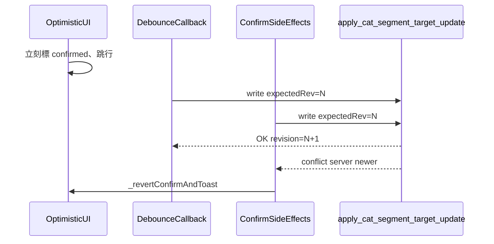

# CAT 句段 revision 衝突：規劃與修正方向

**狀態**：Phase A–D 已於 [`cat-tool/app.js`](../cat-tool/app.js) 落地（改後請 `npm run sync:cat`）；行為說明見下「實作摘要」。

**相關既有設計**：編輯器「確認跳行」採 **方案 B**（先更新 UI、後台再寫庫），見 [HANDOFF.md](./HANDOFF.md)「CAT：編輯器非列印字元、IME、確認跳行修復（2026-04-30）」。本文件說明與方案 B 並存時，為何仍會出現「伺服器版本較新」類 toast，以及建議的修正 phase（**不**要求放棄立即回饋）。

### 實作摘要（2026-05-01）

- **A**：`segmentTargetWriteTails` 對每句 `applyUpdateSegmentTarget` 串行化（鏈結尾 promise 吞錯以維持順序）。
- **B**：`enqueueConfirmSideEffects` 內先 `await awaitPendingSegmentTargetWritesForSeg(seg.id)`，與已啟動之 debounce 寫庫銜接。
- **C**：團隊模式下首次 `SEGMENT_REVISION_CONFLICT` 後 `hydrateSegmentRevisionFromDb` 再重送 RPC 一次（同次呼叫內）。
- **D**：`_revertConfirmAndToast(..., 'revision'|'other')` 區分樂觀鎖與其他錯誤文案。

---

## 現象

使用者（含僅一人操作時）在確認句段後，偶發右下角錯誤 toast：

> 第 N 句確認失敗：伺服器版本較新，請重新確認

（句號 N 可能為 `globalId` 或列號 + 1，依 [`cat-tool/app.js`](../cat-tool/app.js) 顯示邏輯而定。）

---

## 機制概要

1. **樂觀鎖**：團隊模式下，譯文目標寫入經父頁 [`src/lib/cat-cloud-rpc.ts`](../src/lib/cat-cloud-rpc.ts) 的 `db.updateSegmentTarget`，呼叫 RPC `apply_cat_segment_target_update`，並帶 **`expectedSegmentRevision`**。與資料庫目前 `segment_revision` 不符時，前端視為衝突（`SEGMENT_REVISION_CONFLICT`）。
2. **Schema**：見 migration [`supabase/migrations/20260421120000_cat_segments_segment_revision.sql`](../supabase/migrations/20260421120000_cat_segments_segment_revision.sql)。
3. **方案 B**：[`cat-tool/app.js`](../cat-tool/app.js) 中 Ctrl+Enter／狀態圖示確認會 **立刻** 將該句標為已確認、更新進度與焦點跳行；實際 `applyUpdateSegmentTarget` 與後續狀態／TM 等寫入排入 **`enqueueConfirmSideEffects`**。若寫庫失敗，呼叫 **`_revertConfirmAndToast`** 還原樂觀 UI 並 **`showCatToast`**。

---

## 根因與常見觸發情境（白話）

- **單人、單分頁仍可能發生**：譯文欄有 **debounce 寫庫**（約 500ms）。`clearTimeout(targetDebounceTimer)` 只能取消「尚未執行的計時」，**無法取消已開始執行的 async callback**（其中含 `await applyUpdateSegmentTarget`）。若 debounce 回呼已送出 RPC、尚未返回，使用者立刻 **Ctrl+Enter**，確認鏈會再送一次 `applyUpdateSegmentTarget`，兩次請求可能都帶 **同一個舊的預期 revision**，先完成者將伺服器版本加一，後到者即失敗——與「房間裡有沒有第二個人」無必然關係。
- **多分頁／多裝置**：同一檔案在不同分頁載入時，各自記憶體中的 `seg.segmentRevision` 可能落後於伺服器。
- **其他寫入路徑**：任何會先成功更新該句 target 並推進 revision 的操作（例如重複句傳播、批次操作、協作事件等），若本機仍握舊 revision 再確認，也可能觸發。
- **確認失敗 toast 文案（Phase D）**：Ctrl+Enter／狀態圖示確認寫庫失敗時，已依 `_revertConfirmAndToast(..., 'revision'|'other')` 區分樂觀鎖與連線／伺服器等其他錯誤，不再一律顯示「伺服器版本較新」。其他程式路徑若仍共用較概括之錯誤提示，可另行收斂。

---

## 時序示意（race）

---

## 建議實作 Phase（可分步落地）

以下 phase **不要求**改成「先 await RPC 成功才更新 UI」。除非產品明確要放棄方案 B，否則應維持「先有感、後台跟上」；修正應集中在 **寫庫排序、重試與錯誤表述**。

### Phase A：每句串行化寫庫

以 `Map<segmentId, Promise>`（或同句專用 queue）包裝對外的 `applyUpdateSegmentTarget`（或更底層單句寫入）：同一 `seg.id` 的 RPC **串行**，後續呼叫 await 前一個完成後再送出，並使用更新後的 `seg.segmentRevision`。

- **對體驗**：不改 Ctrl+Enter 當下 UI 順序；極端連續觸發時可能多短暫排隊，一般翻譯節奏影響很小。

### Phase B：確認鏈前 flush in-flight

維護「該句目前正在進行的寫庫 Promise」（debounce callback 內進入 `applyUpdateSegmentTarget` 時登記，結束時清除）。**`enqueueConfirmSideEffects` 內、第一次 `applyUpdateSegmentTarget` 之前** await 該 promise，避免與「已啟動、無法被 clearTimeout 取消」的 debounce 寫庫並行。

- **對體驗**：與 Phase A 類似，後台多一次順序保證，不阻擋樂觀 UI。

### Phase C：衝突自動重試（建議上限一次）

在確認鏈路（或共用 helper）中，若收到 `SEGMENT_REVISION_CONFLICT`，依既有 **`resolvePendingRemoteConflict`** 類精神：重新取得該句最新 revision／譯文策略後，再送一次目標更新（必要時再寫狀態）。仍失敗則維持現有 toast 與還原。

- **對體驗**：多數誤觸 race 的使用者可能完全無感；需注意「兩邊真實內容分歧」時的合併策略，避免靜默覆蓋錯誤內容。

### Phase D：錯誤分類與文案（已落地）

僅在確認為 revision 衝突時使用「伺服器版本較新」；網路錯誤、權限、RPC 其他錯誤改用不同 toast（見 `_revertConfirmAndToast` 之 `failureKind === 'other'`）。

---

## 程式錨點（實作時從此搜）

| 區域 | 檔案與符號 |
|------|------------|
| 樂觀確認與 toast | [`cat-tool/app.js`](../cat-tool/app.js)：`enqueueConfirmSideEffects`、`applyUpdateSegmentTarget`、`_revertConfirmAndToast`、`showCatToast` |
| Debounce 寫庫 | 同上：`scheduleTargetDebouncedPersistAndUndo`、`targetDebounceTimer`、`targetWriteGeneration` |
| 遠端 RPC | [`src/lib/cat-cloud-rpc.ts`](../src/lib/cat-cloud-rpc.ts)：`db.updateSegmentTarget`、`apply_cat_segment_target_update` |

實作完成後依根目錄 [AGENTS.md](../AGENTS.md)：**僅於 `cat-tool/` 修改**，執行 `npm run sync:cat`，並一併提交 `public/cat`。

---

## 驗收清單（手動）

1. **單頁**：快速鍵入譯文後立即 Ctrl+Enter，重複多次；不應較現行更易出現紅色 toast（Phase A+B+C 落地後預期明顯改善）。
2. **與 debounce 交錯**：在 debounce 約 500ms 剛觸發後極短時間內確認同一句；不應穩定復現 revision 衝突 toast。
3. **兩分頁**：同一團隊檔、兩個瀏覽器分頁交替修改並確認同一句；行為符合預期（至少不無故覆蓋；衝突時有清楚後備）。
4. **迴歸**：確認仍為「按下確認後立刻跳行／進度更新」，無回到「整句 await 寫庫才動 UI」的延遲體驗（除非產品改需求）。

### 驗收（紀錄）

- **2026-05-01**：依上列驗收清單手動驗收通過（含團隊模式 revision／toast 與方案 B 迴歸）；紀錄於 [`HANDOFF.md`](./HANDOFF.md)「近期已落地變更紀錄」與本文件修訂紀錄。

---

## 修訂紀錄

| 日期 | 說明 |
|------|------|
| 2026-05-01 | 初稿：規劃文件與 HANDOFF／CODEMAP 索引 |
| 2026-05-01 | 落地 Phase A–D 於 `cat-tool/app.js`，並補本節實作摘要 |
| 2026-05-01 | 根因段更新 Phase D 現況；補「驗收（紀錄）」；HANDOFF／CODEMAP 同步 |
