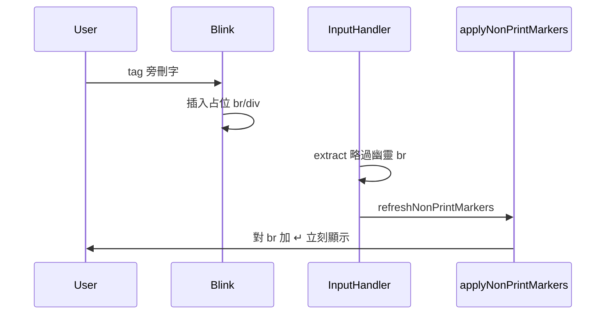
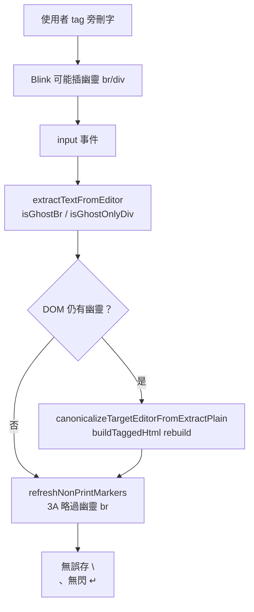
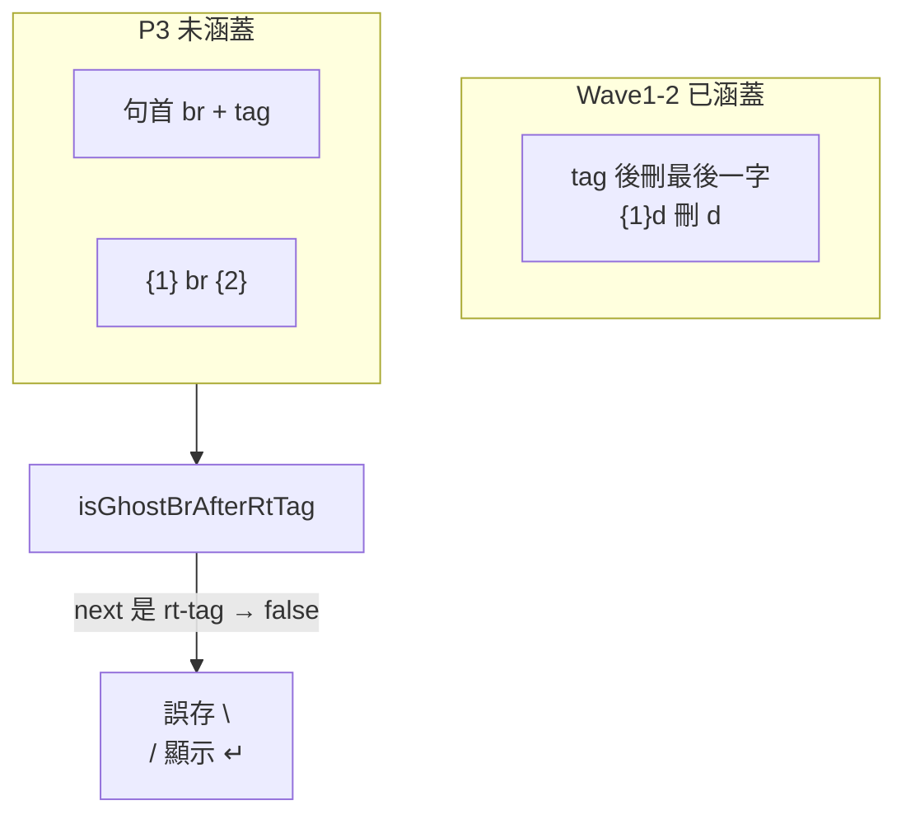

# CAT 譯文欄換行編輯補修 — tag 旁刪字與 NP 模式可刪換行

> **建立**：2026-05-27  
> **狀態**：**P1、P2、P3 均已修復並驗收**（Wave 2：2026-05-27；Wave 3／P3：2026-06-26，`bedb855`）  
> **前置**：[`bug-report_contenteditable-newline-artifacts.md`](./bug-report_contenteditable-newline-artifacts.md)（2026-05-02，`c4f865d` 幽靈 BR、Shift+Enter、`data-cat-nl`、blur rebuild）  
> **程式**：[`cat-tool/app.js`](../cat-tool/app.js)；同步 `npm run sync:cat` → `public/cat/`

---

## 修正歷程總覽

本議題橫跨四個階段：2026-05-02 的**基礎換行政策**、2026-05-27 **Wave 1**（資料與 NP 刪除）、2026-05-27 **Wave 2**（畫面即時 ↵ 與 DOM 清洗）、2026-06-26 **Wave 3**（tag 前／tag 間刪字幽靈 br，**已修並驗收**）。下表為時間軸；細節見各節。

| 階段 | 日期 | commit | 解決了什麼 | 仍留下的缺口（當時） |
|------|------|--------|------------|----------------------|
| **基礎** | 2026-05-02 | `c4f865d` | 幽靈 br 抽取、`data-cat-nl`、Shift+Enter、blur／確認前 rebuild、貼上換行→空格 | tag 旁刪字仍可能誤存 `\n`；¶ 模式 ↵ 難刪 |
| **Wave 1** | 2026-05-27 | `d8b5cfc` | P2：NP 下可刪語意換行；P1 **extract** 層忽略 tag 後幽靈 br | P1 **畫面**：刪字當下仍閃 ↵（NP 對 DOM 內 br 加裝飾） |
| **Wave 2** | 2026-05-27 | `21e14ee` | P1 完整：不顯示 ↵、input 當下清 DOM、根層 ghost div 不插虛擬 `\n` | tag **前**刪光、**兩 tag 相貼**時 br 仍可能誤存（見 Wave 3） |
| **Wave 3** | 2026-06-26 | `bedb855` | P3：`isGhostBrBeforeRtTag`、tag 間 br（Fix 4A／4B） | **P3 全項通過**（2026-06-26 手動驗收） |
| **文件** | 2026-05-27 | `bcbfabe` | 實作紀錄 commit 編號、`bug-report` §2.5 交叉引用 | — |
| **文件** | 2026-06-26 | （本版） | Wave 3／P3 規格與驗收清單 | — |

```mermaid
flowchart LR
    subgraph base ["2026-05-02 c4f865d"]
        A1["isGhostBr 基礎規則"]
        A2["Shift+Enter data-cat-nl"]
        A3["blur rebuild"]
    end
    subgraph w1 ["2026-05-27 Wave 1"]
        B1["isGhostBrAfterRtTag"]
        B2["tryDeleteSemanticNewlineAtCaret"]
    end
    subgraph w2 ["2026-05-27 Wave 2"]
        C1["Fix 3A NP 略過幽靈 br"]
        C2["Fix 3C input canonicalize"]
        C3["Fix 3B isGhostOnlyDiv"]
    end
    subgraph w3 ["2026-06-26 Wave 3"]
        D1["Fix 4A isGhostBrBeforeRtTag"]
        D2["Fix 4B tag 間 br"]
    end
    base --> w1 --> w2 --> w3
```

---

## 問題摘要（白話）

| # | 現象 | 典型操作 | 最終狀態 |
|---|------|----------|----------|
| **P1** | tag 旁刪最後一字後**多出一個換行**；¶ 開時可見 **↵ 當下閃出** | `{1}d` 刪 `d`；單一或成對 tag 皆可能 | **已修**（Wave 1 extract + Wave 2 畫面／DOM） |
| **P2** | **↵ 標記**用 Del／Backspace **刪不掉**，或刪了又出現 | ¶ 恆開時對語意換行按刪除鍵 | **已修**（Wave 1） |
| **P3** | 從左**刪光 tag 前文字**（抵句首或上一顆 tag）後**多換行**；¶ 可見 ↵ | `hello{1}…` 刪 `hello`；`{1}middle{2}` 刪 `middle` | **已修**（Wave 3，`bedb855`） |

P1 與 P3 不同：P1 是 tag **後**刪最後一字；P3 是 tag **前**刪光或刪到**兩 tag 相貼**。P1 若只修 extract，資料可能正確但使用者仍見幽靈 ↵；P2 則是 NP 裝飾與語意 `\n` 脫鉤。

---

## 階段一：2026-05-02 基礎換行政策（`c4f865d`）

**背景**：Blink 在 contenteditable 與 `.rt-tag` 旁自動插入占位 ` `／`
`，舊版 extract 幾乎把所有 ` ` 當 `\n` 寫庫，形成「幽靈 DOM → 誤存 → 重開更髒」迴圈。

**已定案行為**（詳見 `bug-report` Part 1.3）：

- 允許句段內多行；**Shift+Enter** 插入 ` `；單按 **Enter** 不插入換行。
- **`isGhostBr`**：根節點唯一子 br、根下空 div 內唯一 br 等不計入 plain。
- **blur／確認前** `rebuildTargetEditorFromExtractedPlain` 以 `buildTaggedHtml` 洗 DOM。
- 純文字貼上：換行→空格。

**與本議題的關係**：基礎已區分「語意換行」與「幽靈 br」，但未涵蓋 **tag 正後方** 的占位 br，也未處理 **NP 模式只撕 ↵ 不刪 `\n`**，故 2026-05-27 另開 Wave 1／2。

---

## 階段二：Wave 1（`d8b5cfc`）

### 修改過程

1. **調查**：使用者回報兩類問題——tag 旁刪字多換行、¶ 下 ↵ 刪不掉。
2. **P2 根因**：`applyNonPrintMarkers` 在 ` ` 前插 `↵`；keydown 遇 overlay 常只 `remove()` span，**語意 `\n` 仍在 plain**，`refreshNonPrintMarkers` 又畫回 ↵。
3. **P1 根因（第一版）**：`isGhostBr` 未涵蓋 **tag 晶片後** Blink 插入的占位 ` `，extract 仍輸出 `\n`。
4. **實作**：
   - **Fix 1** `tryDeleteSemanticNewlineAtCaret`：¶ 模式下 Backspace／Delete 以 `getNpCaretOffset` + plain 切片刪 `\n`，`buildTaggedHtml` rebuild，還原游標。
   - **Fix 2** `isGhostBrAfterRtTag`：併入 `isGhostBr`，tag 後、br 後無使用者文字 → extract 不輸出 `\n`。

### Wave 1 驗收結果

| 項目 | 結果 |
|------|------|
| **P2** 換行可 Del／Backspace 刪除 | **通過** |
| **P1** tag 旁刪字仍**立刻**出現 ↵ | **未完全通過** |
| 使用情境 | **¶ 恆開**；**任何** `.rt-tag`；↵ **刪字當下**即出現（非等失焦） |

### Wave 1 未解根因（為何還會閃 ↵）

Wave 1 只保證 **extract → `seg.targetText` 可能已正確**；DOM 內幽靈 ` ` 仍在，且每次 `input` 會 `refreshNonPrintMarkers`：

| 缺口 | 位置 | 說明 |
|------|------|------|
| **A** | `applyNonPrintMarkers` | 對**所有** `br:not(.np-br)` 加 ↵，**未**呼叫 `isGhostBr` |
| **B** | `extractTextFromEditor` | 根層相鄰 `
` 仍插入虛擬 `\n` |
| **C** | 譯文格 `input` | 只 refresh NP，**不** rebuild；幽靈 br 留到 blur |

---

## 階段三：Wave 2（`21e14ee`）

### 修改過程

1. **依 Wave 1 回饋定案**：幽靈 br **不**寫 plain、**不**顯示 ↵、**input 當下**清 DOM；Shift+Enter 行為不 regress。
2. **實作順序** 3A → 3C → 3B（先止視覺跳動，再洗 DOM，再補 div 邊界）：

| ID | 符號 | 做了什麼 |
|----|------|----------|
| **Fix 3A** | `applyNonPrintMarkers` | 加 ↵ 前 `if (isGhostBr(br, el)) return` |
| **Fix 3C** | `editorDomHasGhostNewlineArtifacts`、`canonicalizeTargetEditorFromExtractPlain` | 譯文 `input`（`!_isComposing`）偵測幽靈 br／ghost div → `setEditorHtml(buildTaggedHtml(plain))`，還原 NP 游標；在 `refreshNonPrintMarkers` **之前** |
| **Fix 3B** | `isGhostOnlyDiv` | `extractTextFromEditor`、`getRtEditorTextSegmentsForHighlightMap`：根層 div 若僅空白／幽靈 br／overlay → **不**前綴虛擬 `\n` |

3. **IME**：canonicalize **僅**在非組字（`!_isComposing`）執行，避免干擾注音組字。
4. **同步**：`npm run sync:cat` → `public/cat/app.js`。

### Wave 2 驗收結果（2026-05-27）

專案擁有者確認 **驗收成功**（¶ 恆開情境）：

| # | 項目 | 結果 |
|---|------|------|
| 1 | `{1}d` 或 `{1}…{/1}x` 刪最後一字 → **當下**不出 ↵ | **通過** |
| 2 | Shift+Enter 真換行 → 仍出 ↵，Backspace 可刪 | **通過** |
| 3 | 失焦後 `target_text` 無多餘 `\n` | **通過** |
| 4 | 搜尋高亮無長度警告 | **通過** |

### 修復後資料流（簡圖）

---

## 階段四：Wave 3 — P3（tag 前刪光／tag 間幽靈 br，已修並驗收）

### 問題摘要（2026-06-26 回報）

| 項目 | 說明 |
|------|------|
| **操作** | 用 Delete／Backspace **從左邊吃掉**某 tag **前面**所有文字，直到游標抵**句首**或**上一顆 tag** |
| **現象** | 未按 Shift+Enter 卻多句內換行；¶ 開啟時可見 **↵**；失焦後 `\n` 可能寫入 `target_text` |
| **與 P1 差異** | P1 驗收為 `{1}d` **刪 tag 後**最後一字；P3 為 **刪 tag 前**文字或刪到 `{1}{2}` 相鄰 |

### 根因

[`isGhostBrAfterRtTag`](../cat-tool/app.js)（約 21494–21531 行）僅在「br **前**是 `.rt-tag`、br **後**無使用者文字」時視為幽靈。下列 DOM **不**符合，故 `isGhostBr` 回 false → extract 輸出 `\n`：

| DOM 結構 | 典型情境 | Wave 1–2 | Wave 3（`bedb855`） |
|----------|----------|----------|---------------------|
| `[br][{1}]…` | 刪光 tag 前文字，Blink 在句首插 br | 未涵蓋 | **已涵蓋**（Fix 4A） |
| `[{1}][br][{2}]…` | 刪光兩 tag 間文字，br 夾在 tag 之間 | 未涵蓋 | **已涵蓋**（Fix 4B） |
| `[{1}][br]` 結尾 | tag 後刪最後一字 | 已涵蓋（Wave 1） | 迴歸通過 |

### 為何 Wave 2 未根治

Wave 2 的 Fix 3A／3C 皆依 **`isGhostBr` 判定**；Wave 2 **未擴充**判定規則，只強化「已判定為 ghost 時」不顯示 ↵、input 當下 canonicalize。P3 的 br 從未被判為 ghost，故三管線皆不觸發。

### 修正方案（已實作 `bedb855`）

**檔案**：[`cat-tool/app.js`](../cat-tool/app.js)；`npm run sync:cat` → `public/cat/`。

| ID | 符號 | 動作 |
|----|------|------|
| **Fix 4A** | `isGhostBrBeforeRtTag(br, root)` | br **前**僅空白／NP overlay／句首；**後**方（略過空白）第一個有效節點為 `.rt-tag` → ghost；併入 `isGhostBr` |
| **Fix 4B** | 擴充 `isGhostBrAfterRtTag` | br **前**為 `.rt-tag` 且 **後**（略過空白）亦為 `.rt-tag` → ghost（兩 tag 相貼時 Blink 占位 br） |

**不變**：`data-cat-nl="1"` 的 br **永不**視為 ghost；Shift+Enter／Enter 政策不變。

**觸點**（與 Wave 2 相同三管線，無新事件）：

- `extractSubtree`／`extractTextFromEditor` — 經 `isGhostBr` 不輸出 `\n`
- `applyNonPrintMarkers` — 略過幽靈 br
- `editorDomHasGhostNewlineArtifacts` + `canonicalizeTargetEditorFromExtractPlain` — input 當下 rebuild
- `getNpCaretOffset`／`setNpCaretOffset` — 若已走 `isGhostBr` 則自動受益

**迴歸邊界（實作時必測）**

- 使用者在 `{1}` 與 `{2}` **之間**以 **Shift+Enter** 插入的真換行（`data-cat-nl="1"`）**不可**被 Fix 4B 誤判為 ghost。
- Wave 2 案例 `{1}d` 刪 `d` 仍須通過。

### Wave 3 驗收結果（2026-06-26）

專案擁有者確認 **驗收成功**（¶ 恆開情境；含 P1／P2 迴歸）：

| # | 項目 | 結果 |
|---|------|------|
| 1 | `hello{1}tail` → 刪光 `hello` | **通過** |
| 2 | `{1}middle{2}` → 刪光 `middle` | **通過** |
| 3 | 句首 `{1}…` → 刪到僅 tag 開頭 | **通過** |
| 4 | Shift+Enter 在 tag 間插入換行 | **通過**（P2 迴歸） |
| 5 | `{1}d` 刪 `d` | **通過**（P1 迴歸） |
| 6 | 搜尋高亮 | **通過** |

### Wave 3 驗收步驟（規格對照）

| # | 項目 | 預期 |
|---|------|------|
| 1 | `hello{1}tail` → 刪光 `hello` | 當下無 ↵；失焦後 `target_text` 無前導 `\n` |
| 2 | `{1}middle{2}` → 刪光 `middle` | `{1}{2}` 相鄰時無 `\n`／↵ |
| 3 | 句首 `{1}…` → 刪到僅 tag 開頭 | 同上 |
| 4 | Shift+Enter 在 tag 間插入換行 | 仍有 ↵，Backspace 可刪（P2 迴歸） |
| 5 | `{1}d` 刪 `d` | 當下不出 ↵（P1 迴歸） |
| 6 | 搜尋高亮 | 無「字元索引長度與內文不符」警告 |

---

## 定案行為（全波次合併）

| 項目 | 行為 |
|------|------|
| Shift+Enter 換行 | 唯一鍵盤插入路徑；`data-cat-nl="1"`；¶ 開啟時 **可** Backspace／Delete 刪除（plain 模型） |
| 幽靈 br（含 tag 後、根層 ghost div） | **不**寫入 `targetText`、**不**顯示 ↵、**input 當下** canonicalize（不必等失焦） |
| 幽靈 br（tag **前**句首、**兩 tag 相貼**，P3） | 與上列相同：**不**寫入 `targetText`、**不**顯示 ↵、**input 當下** canonicalize |
| 單按 Enter | 不插入換行（`c4f865d`） |
| 純文字貼上換行→空格 | 不變 |
| blur／確認 | 仍保留 `rebuildTargetEditorFromExtractedPlain` 作最後防線 |

---

## 程式觸點（維運對照）

| 符號 | 波次 | 職責 |
|------|------|------|
| `isGhostBr` / `isGhostBrAfterRtTag` | 基礎 + W1 | extract／NP offset 判定幽靈 br |
| `isGhostBrBeforeRtTag` / tag 間 br（Fix 4B） | W3 | tag 前句首、兩 tag 相貼時占位 br |
| `isGhostOnlyDiv` | W2 | 根層占位 div 不產虛擬 `\n` |
| `tryDeleteSemanticNewlineAtCaret` | W1 | ¶ 下刪語意 `\n` |
| `applyNonPrintMarkers` | W2 Fix 3A | 不對幽靈 br 插 ↵ |
| `editorDomHasGhostNewlineArtifacts` | W2 Fix 3C | 判斷是否需 input 當下 rebuild |
| `canonicalizeTargetEditorFromExtractPlain` | W2 Fix 3C | 以 extract plain rebuild DOM |
| `extractTextFromEditor` / `getRtEditorTextSegmentsForHighlightMap` | 基礎 + W2 | 線性文字與搜尋高亮一致 |
| `rebuildTargetEditorFromExtractedPlain` | 基礎 | blur／確認前重建 |

譯文格事件：`.rt-editor.grid-textarea` 的 `keydown`（Shift+Enter、NP 刪換行）、`input`（canonicalize + NP refresh）、`blur`（rebuild）。

---

## 驗收清單（留存）

### Wave 1（仍適用回歸）

1. Shift+Enter → Backspace／Delete 可刪換行。  
2. 含 tag 長句、多次 blur（`bug-report` §2.6 案例 2）。  
3. 搜尋高亮無長度警告。

### Wave 2（¶ 恆開 — 已通過）

1. tag 旁刪最後一字 → **當下**不出 ↵。  
2. Shift+Enter 真換行 → 仍出 ↵，Backspace 可刪。  
3. 失焦後 `target_text` 無多餘 `\n`。  
4. 搜尋高亮無長度警告。

### Wave 3（P3 — 已驗收 2026-06-26）

見 **§階段四** 驗收表 6 項；含 P1／P2 迴歸。

---

## 已知限制與後續

- **P3（Wave 3）**：Fix 4A／4B（`bedb855`）**已修並驗收**（2026-06-26）。
- **游標線性化**：`getNpCaretOffset` 與 extract 在極端 DOM 邊界仍可能不完全一致；若 P3 後仍收到回報，可改為與 extract **共用單一走訪器**（見 `bug-report` §2.5）。
- **不建議**移除 `isGhostBr` 或恢復「所有 br 皆真換行」——會復發 P1／P2／P3。

---

## 實作紀錄

| 日期 | commit | 說明 |
|------|--------|------|
| 2026-05-02 | `c4f865d` | 基礎：受控 BR、Enter 政策、blur rebuild（見 `bug-report`） |
| 2026-05-27 | `d8b5cfc` | Wave 1：Fix 1 `tryDeleteSemanticNewlineAtCaret` + Fix 2 `isGhostBrAfterRtTag` |
| 2026-05-27 | `21e14ee` | Wave 2：Fix 3A / 3C / 3B |
| 2026-05-27 | `bcbfabe` | 文件：Wave 2 commit 紀錄交叉引用 |
| 2026-05-27 | （本版文件） | 補齊三階段歷程、修改過程、Wave 2 驗收通過 |
| 2026-06-26 | （本版文件） | Wave 3／P3 規格：tag 前／tag 間刪字幽靈 br；Fix 4A／4B；驗收清單 |
| 2026-06-26 | `bedb855` | Fix 4A `isGhostBrBeforeRtTag` + Fix 4B tag 間 br |
| 2026-06-26 | `1ac65fe` | 文件：Wave 3 實作紀錄與 `bug-report`／`CODEMAP` 交叉引用 |
| 2026-06-26 | （驗收） | P3 全 6 項通過；專案擁有者手動驗收 |
