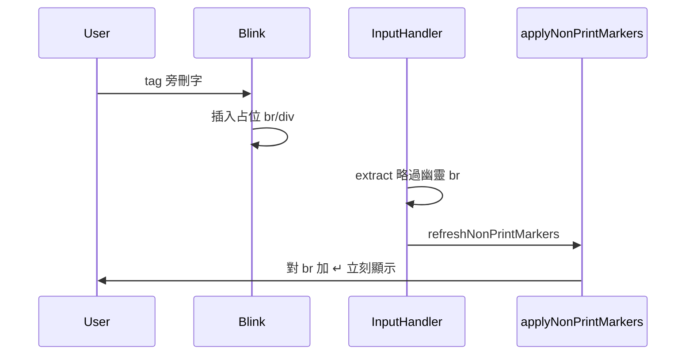

# CAT 譯文欄換行編輯補修 — tag 旁刪字與 NP 模式可刪換行

> **建立**：2026-05-27  
> **前置**：[`bug-report_contenteditable-newline-artifacts.md`](./bug-report_contenteditable-newline-artifacts.md)（2026-05-02，`c4f865d` 幽靈 BR、Shift+Enter、`data-cat-nl`、blur rebuild）  
> **程式**：[`cat-tool/app.js`](../cat-tool/app.js)；同步 `npm run sync:cat` → `public/cat/`

---

## 問題摘要（白話）

| # | 現象 | 使用者操作 |
|---|------|------------|
| **P1** | 整行只有 **tag + 旁邊一個字**，用 Del／Backspace 刪掉那個字後，**自動多出一個換行**（¶ 模式下可見 ↵） | 例：`[1]d` 刪 `d` |
| **P2** | **換行（↵）无法用 Del／Backspace 刪掉**，或刪了又出現 | 開啟「顯示非列印字元」¶ 時最常見 |

兩者相關：P1 把錯誤 `\n` 寫進資料或畫面；P2 讓既有／錯誤換行難以用鍵盤清除。

---

## Wave 1 — 根因與實作（2026-05-27，`d8b5cfc`）

### P1 — tag 後刪字誤存換行（extract 層）

- Blink 在 **tag 晶片（`.rt-tag`）** 旁常插入占位 ` `。
- **Fix 2**：`isGhostBrAfterRtTag` — extract 時 tag 後占位 br 不輸出 `\n`。

### P2 — NP 模式只刪 ↵ 裝飾、不刪語意換行

- **Fix 1**：`tryDeleteSemanticNewlineAtCaret` — 以 plain 線性偏移刪除 `\n` 並 rebuild。

### Wave 1 驗收結果（使用者回饋）

| 項目 | 結果 |
|------|------|
| **P2** 換行可 Del／Backspace 刪除 | **通過** |
| **P1** tag 旁刪字仍**立刻**出現 ↵ | **未完全通過** |
| 使用情境 | **¶ 恆開**；**任何** `.rt-tag`（單一或成對）皆觸發；↵ **刪字當下**即出現（非等失焦） |

Wave 1 僅在 **extract** 忽略 tag 後幽靈 br；**NP 畫面仍對 DOM 內幽靈 br 加 ↵**，故使用者仍見「亂跳」。

### Wave 1 未解根因（技術）

| 缺口 | 位置 | 說明 |
|------|------|------|
| **A** | `applyNonPrintMarkers`（約 1356–1363） | 對**所有** `br:not(.np-br)` 加 ↵，**未**呼叫 `isGhostBr` |
| **B** | `extractTextFromEditor`（約 18473–18475） | 根層相鄰 `
` 仍插入虛擬 `\n`，與 tag 分包無關 |
| **C** | 譯文格 `input`（約 19599–19608） | 只 `refreshNonPrintMarkers`，**不** rebuild；幽靈 br 留到 blur |

---

## Wave 2 — 定案行為

| 項目 | 行為 |
|------|------|
| 幽靈 br | **不**寫入 plain、**不**顯示 ↵、**input 當下**清 DOM（不必等失焦） |
| Shift+Enter `data-cat-nl="1"` | 仍顯示 ↵、仍可刪（Wave 1 不 regress） |
| 單按 Enter | 仍不插入換行（維持 `c4f865d`） |
| 純文字貼上換行→空格 | 不變 |

---

## Wave 2 — 實作方案

| ID | 符號／位置 | 內容 |
|----|------------|------|
| **Fix 3A** | `applyNonPrintMarkers` | 對 ` ` 加 ↵ 前：`if (isGhostBr(br, el)) return` |
| **Fix 3C** | `canonicalizeTargetEditorFromExtractPlain` + 譯文 `input` | DOM 含幽靈 br 時以 `extract` 的 plain rebuild；`!_isComposing`；於 `refreshNonPrintMarkers` 前 |
| **Fix 3B** | `extractTextFromEditor` + `getRtEditorTextSegmentsForHighlightMap` | `isGhostOnlyDiv(div, root)`：根層 div 前綴 `\n` 僅在 div 內有非幽靈內容時插入 |

實作順序：**3A → 3C → 3B**。

---

## 定案行為（全波次）

| 項目 | 行為 |
|------|------|
| Shift+Enter 換行 | 仍為唯一鍵盤插入路徑；`data-cat-nl="1"`；**可**用 Backspace／Delete 刪除（¶ 開啟時走 plain 模型） |
| 幽靈 br（含 tag 後占位） | **不**寫入 `targetText`、**不**顯示 ↵、input 當下清 DOM |
| 單按 Enter | 仍不插入換行（維持 `c4f865d`） |
| 純文字貼上換行→空格 | 不變 |

---

## 觸點

| 符號 | 檔案 |
|------|------|
| `isGhostBr` / `isGhostBrAfterRtTag` | `cat-tool/app.js` |
| `tryDeleteSemanticNewlineAtCaret` | `cat-tool/app.js`（Wave 1） |
| `applyNonPrintMarkers` | `cat-tool/app.js`（Fix 3A） |
| `canonicalizeTargetEditorFromExtractPlain` | `cat-tool/app.js`（Fix 3C） |
| `isGhostOnlyDiv` | `cat-tool/app.js`（Fix 3B） |
| `extractTextFromEditor` / `getRtEditorTextSegmentsForHighlightMap` | `cat-tool/app.js`（Fix 3B） |

---

## 驗收清單

### Wave 1

1. `[1]d` 刪 `d`（¶ 開）→ 失焦後 `target_text` 無多餘 `\n`。  
2. Shift+Enter → Backspace／Delete 可刪換行。  
3. 含 tag 長句、多次 blur（`bug-report_contenteditable-newline-artifacts.md` §2.6 案例 2）。  
4. 搜尋高亮無長度警告。

### Wave 2（¶ 恆開）

1. `{1}d` 或 `{1}…{/1}x` 刪最後一字 → **當下**不出 ↵。  
2. Shift+Enter 真換行 → 仍出 ↵，Backspace 可刪。  
3. 失焦後 `target_text` 無多餘 `\n`。  
4. 搜尋高亮無長度警告。

---

## 實作紀錄

| 日期 | commit | 說明 |
|------|--------|------|
| 2026-05-27 | `d8b5cfc` | Wave 1：Fix 1 `tryDeleteSemanticNewlineAtCaret` + Fix 2 `isGhostBrAfterRtTag` |
| 2026-05-27 | `21e14ee` | Wave 2：Fix 3A / 3C / 3B |
