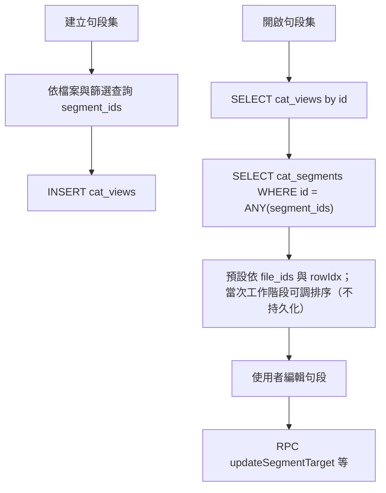
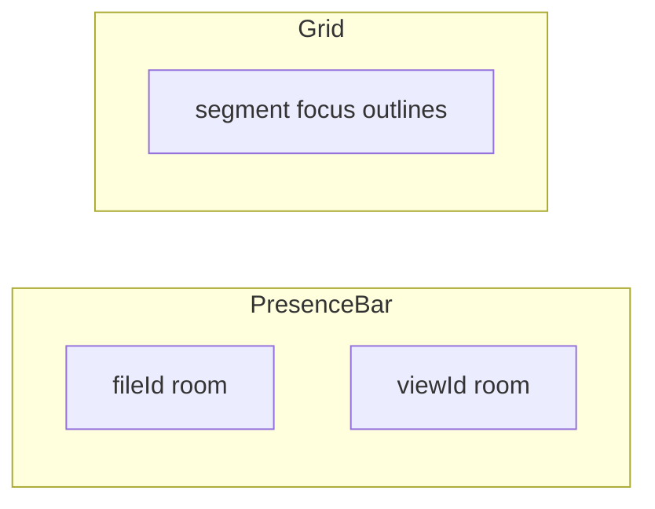

# 句段集（View）功能規格

本文件彙整「句段集」功能的設計決策，供後續實作與審查使用。實作時請遵守 [AGENTS.md](../AGENTS.md)：`cat-tool/` 為 CAT 原始碼，`npm run sync:cat` 同步至 `public/cat/`。

---

## 1. 背景與術語

| 項目 | 說明 |
|------|------|
| **中文名稱** | 句段集 |
| **英文名稱** | View（內部／API 可用 `cat_views`） |
| **概念** | 從專案內一個或多個檔案中，依條件或「快速結合」擷取句段，形成**凍結的句段 ID 名單**；每次開啟時再即時載入各句段的**最新內容**（含協作修改）。 |

### 1.1 與業界作法對照（摘要）

- **Phrase／Trados QuickMerge**：多檔句段在同一編輯視窗內依順序拼接，邊界可辨識。
- **memoQ View**：多檔＋篩選條件產生靜態清單；本專案採「名單靜態、內容動態」，避免 memoQ 靜態快照與實際狀態脫節的問題。
- **Déjà Vu All Files**：專案級全檔格線；本專案為「專案內子集」，由使用者定義範圍。

### 1.2 本專案選定方向

**靜態名單 + 動態內容**

- 建立時寫入 `segment_ids[]`（與建立當下的 `file_ids[]` 順序），之後不隨篩選條件重跑而變動。
- 開啟時以 `segment_ids` 向資料庫查詢最新句段列，排序依儲存的 `file_ids` 與各句段 `rowIdx`。
- **跨裝置同步**：團隊模式資料存 Supabase；離線模式存 IndexedDB（本機）。

### 1.3 介面用語（繁體正體）

- **禁用「匹配」**：此詞為簡中慣用語；**使用者可見**之 CAT／TMS 文案、錯誤訊息、篩選摘要、說明文件均不得出現「匹配」。與 TM 語意相當之否定表述用「**無相符**」等正體慣用語（與既有「翻譯記憶**相符**度」一致）。
- **技術註解／變數名**：若需描述演算法「pairing、比對規則」，優先使用「比對」「相符」「成對」等詞；仍無把握時請先與產品確認再下字。**新撰寫之程式註解**亦不得使用「匹配」；既有註解不強制回溯修改。
- 本條為全專案長期約束；亦見根目錄 [AGENTS.md](../AGENTS.md)。

---

## 2. 資料結構

### 2.1 Supabase：`public.cat_views`（建議欄位）

| 欄位 | 型別 | 說明 |
|------|------|------|
| `id` | `uuid` PK | `gen_random_uuid()` |
| `project_id` | `uuid` FK | `cat_projects(id)`，`ON DELETE CASCADE` |
| `owner_user_id` | `uuid` FK | `profiles(id)`，建立者 |
| `name` | `text` | 句段集顯示名稱 |
| `file_ids` | `uuid[]` | 建立時選取之檔案**順序**（對應專案檔案清單當時的 1、2、3… 順序；不可僅依 `created_at` 推斷，見下） |
| `segment_ids` | `uuid[]` | 凍結的句段成員（`cat_segments.id`） |
| `filter_summary` | `jsonb` | 建立時篩選條件快照，供清單「條件摘要」欄渲染（結構需與前端產生文字行的邏輯一致） |
| `file_roles` | `jsonb` | 選填；`{ "<fileId>": "T_ALLOW_R1" \| "T_DENY_R1" \| "R1" \| "R2" }`，僅 mqxliff 檔需有意義 |
| `created_at` | `timestamptz` | 建立時間 |
| `last_modified` | `timestamptz` | 最後更新（更名、編輯 `file_roles` 等） |

**為何需要 `file_ids[]`**

專案檔案清單的「序號」來自列表渲染順序（見 [`cat-tool/app.js`](../cat-tool/app.js) `loadFilesList`），非 DB 固定欄位；若僅用檔案 `created_at` 排序，與使用者畫面上 1、2、3 的認知可能不一致。建立句段集時應**明確儲存**當時的檔案 UUID 順序。

### 2.1.1 清單可見性與 `owner_user_id`

- **專案級、全團隊可見**：同一專案內，凡對該專案具備與「檔案清單」相同語意之已授權成員，皆可於句段集分頁看到該專案之所有 `cat_views` 列（`listViews` 不應依 `owner_user_id` 篩成「僅本人」）。
- **`owner_user_id`**：僅供清單「建立者」欄位顯示與稽核，**不作**「僅建立者可讀／可改」的篩選條件。
- **`listViews`／RLS**：`SELECT` 須允許上述成員讀取該 `project_id` 下之列；`INSERT`／`UPDATE`／`DELETE` 與專案內建立／管理句段集之權限對齊——建議與既有 `cat_files` 或專案角色矩陣一致（實作時沿用現有 migration／policy 慣例，於 PR 註明）。
- **與 §3.1 之銜接**：§2.1.1 指「**已進入該專案**」後，專案內句段集分頁對已授權成員之可見性。譯者於**專案清單**僅能看見 §3.1 篩選後之專案；若無法進入某專案，即無法自 UI 開啟該專案之句段集分頁—與「進入專案後可瀏覽全部句段集列」並存。

### 2.2 離線模式：`cat-tool/db.js`（Dexie）

新增 `views` 表（版本號遞增），建議欄位與雲端語意對齊，至少：

- `++id`（本機整數 PK）
- `projectId`
- `name`
- `fileIds`（陣列，離線檔案 id 為 number）
- `segmentIds`（陣列）
- `filterSummary`（JSON 或可序列化物件）
- `fileRoles`（JSON）
- `createdAt`

（實作時可依現有 `files` / `segments` 的命名慣例微調 camelCase。）

**離線個人版與句段集**：第一版即納入句段集—`views` 表與建立／開啟／列表流程須與本機 `files`、`segments` 一併設計（同步、匯出／備份策略若與現有離線 CAT 一致則於實作 PR 註明）；**不**將句段集延後為「僅團隊線上」專屬功能。

### 2.3 RLS 與安全

- 新表 policy **必須**使用 `(SELECT auth.uid())` initplan 寫法，避免 [`docs/incident-report_2026-05-01_rls-and-db-load.md`](incident-report_2026-05-01_rls-and-db-load.md) 所述之每列重算 `auth.uid()` 問題。
- 範例模式（與現有 `cat_segments_rw_authenticated` 一致）：`USING ((SELECT auth.uid()) IS NOT NULL)`，若需限專案成員再擴充為 EXISTS 子查詢（同樣對 `auth.uid()` 包 `(SELECT …)`）。
- `cat_views` 之讀寫範圍另須符合 **§2.1.1**（專案成員可讀清單；寫入／刪除依專案角色）。`cat_view_assignments`（§13）之 RLS 建議比照 [`supabase/migrations/20260415150000_cat_file_assignments.sql`](../supabase/migrations/20260415150000_cat_file_assignments.sql) 與後續 initplan 修正 migration 之模式（受派者可讀自己的列、管理員／指派權限由既有角色函式延伸）。
- **管理操作（產品決策）**：建立／刪除／更名句段集、管理 `cat_view_assignments`（指派／取消）及專案內相關 UI 之寫入操作—**限 PM 以上**（`pm`、`executive` 等，與 `public.user_roles` 慣例對齊；實作 PR 明列 policy 與前端按鈕隱藏條件）。細節與譯者體驗見 **§3.1**、**§13.6**。

### 2.4 團隊模式 RPC

[`src/lib/cat-cloud-rpc.ts`](../src/lib/cat-cloud-rpc.ts) 需新增／擴充：`listViews`、`getView`、`createView`、`updateView`（更名、`file_roles`）、`deleteView`，以及**依 `segment_ids` 批次載入句段**（`WHERE id = ANY($1::uuid[])` 或等效 `.in('id', ids)`）。

---

## 3. 介面位置

- 區塊：[`cat-tool/index.html`](../cat-tool/index.html) 內 `#viewProjectDetail`（專案詳細頁）。
- 在「檔案清單」標題列（約與 `h2`「檔案清單」同一列）旁，新增**並排分頁**：「檔案清單」↔「句段集」。
- 句段集工具列之 **「分析」**、檔案清單勾選後之分析，以及編輯器工具列 **「字數」**，皆開啟同一 **「字數與 TM 加權分析」** Modal（`#wordCountModal`）。勾選**多個**句段集時，合併範圍與各集**分開**分析之語意見 [`CAT_WORD_COUNT_WORKER_AND_UI.md`](CAT_WORD_COUNT_WORKER_AND_UI.md) **§9**；編輯器專用行為（全文／篩選範圍、不儲存報告）見同檔 **§9.6**。
- 切換時顯示對應表格區塊；目前 URL 路由若以專案為錨點，可另存 `projectTab=files|views`（實作細節與 `persistCatRoute` 一併評估）。

### 3.1 譯者（團隊模式）專案與導覽

以下適用角色語意為 **`translatorOnly`／`member`（譯者）** 與既有團隊模式導覽；實作時對照 [`cat-tool/app.js`](../cat-tool/app.js) 之 `enforceTeamRoleLayout` 等。

| 議題 | 規格 |
|------|------|
| **專案清單** | 譯者於**專案清單**僅顯示「至少有一筆 **`cat_file_assignments` 或 `cat_view_assignments`**，且 `status` **非** `cancelled`」之專案。TMS／CAT iframe 橋接若需 `projectIds` 一併評估，於實作 PR 註明。 |
| **左欄導覽** | 譯者可見並切換：**儀表板**、**專案**。其餘 TM／TB／準則／AI 等維持隱藏；**非**將整個側欄清空，而是**兩項**入口（與過往「全隱 nav」方向區隔）。 |
| **專案內** | 進入專案後，譯者可瀏覽該專案內**全部**檔案與句段集清單並可點開（與 §2.1.1 專案內可讀語意一致）。 |
| **未受指派而開啟** | 若開啟之檔案或句段集**非**本人受派：當下顯示系統訊息，編輯器為**唯讀**；**mqxliff 不跳出**身分選擇（`showMqRoleModal` 等）。 |
| **管理操作按鈕** | 譯者**不顯示**專案／檔案／句段集清單上之管理類操作（例如：儲存、移除、欄位設定、指派、連結案件、分析、拆分、建立／刪除句段集、句段集「編輯」設定等—以產品截圖與實作 PR 對照清單為準）；**PM 以上**維持可見。 |
| **筆記** | 譯者得依既有權限**檢視並在權限內操作**筆記面板（RLS／前端邏輯與單檔模式對齊，細節於實作 PR 註明）。 |

---

## 4. 句段集清單（表格欄位）

| 欄位 | 內容 |
|------|------|
| **名稱** | `name` |
| **涉及檔案** | 多行文字，每行 `#<序號> <檔名>`。**≤5** 個檔案時**全部列出**。**>5** 時：先列出前 **5** 行；第 **6** 行為 **`…等共 x 個檔案`**（`x` 為總檔數）與**展開／收合**控制，**預設收合**（第 6 筆起之檔名隱藏至展開）；箭頭以旋轉表示收合（朝右）／展開（朝下）。檔名過長時可於格內截斷；**建議**必要時以 `title`／tooltip 顯示完整檔名（與專案檔案清單一致）。**不得**在資料或 UI 寫入固定占位字串如「（名稱過長時截斷…）」—該類文字僅供 mock／設計稿示意。 |
| **篩選條件** | 小字、灰色（建議 `font-size: 0.82rem`、`color: #64748b`），與專案頁輔助文字風格一致；**純文字行**，不使用篩選群組「卡片」元件 |
| **建立者** | 顯示名稱或 email（依 `profiles` 可得欄位） |
| **建立時間** | `created_at` 本地化 |
| **整體進度** | 例如已確認句段數／總句段數或百分比（計算方式與單檔進度條一致，跨檔加總） |
| **操作** | 開啟、更名、刪除；**編輯**（設定／變更 mqxliff `file_roles`） |

### 4.1 篩選條件摘要文案

- 產生邏輯應與編輯器篩選一致，可重用或對齊 [`cat-tool/app.js`](../cat-tool/app.js) 之 `getSfFilterGroupConditionLines`（約 L10382 起）的**用語**（例如「句段狀態：…」「翻譯記憶相符度：…」）。TM 語意之否定表述須符合 **§1.3**（例如「無相符」，禁用「無匹配」）。
- **快速結合**：顯示單行，例如「全部句段（快速結合）」。
- **自訂篩選**：每條件一行或多行純文字，**不加**粗體區塊底、不加卡片邊框。

---

## 5. 建立流程

### 5.1 快速結合

1. 使用者在檔案清單勾選一個或多個檔案。
2. 選擇「快速結合建立句段集」（按鈕文案實作時可再縮短）。
3. 跳**命名**（及 mqxliff 各檔 `file_roles` 若需要）→ 系統將所選檔案之**全部句段**依 `file_ids` 順序與各檔 `rowIdx` 收集為 `segment_ids`，寫入 `cat_views`；`filter_summary` 標記為快速結合。

### 5.2 自訂篩選

1. **步驟一（設定）**：名稱、涵蓋檔案（可由目前勾選帶入）、篩選條件（與編輯器進階篩選語意對齊）、mqxliff 各檔 `file_roles`。
2. **步驟二（預覽）**：
   - **預覽區上方**須為與編輯器相同的**完整搜尋／進階篩選工具列**（含模式切換、`#sfInput`、翻譯記憶相符度條件、句段狀態、句段編號範圍等；與 [`cat-tool/index.html`](../cat-tool/index.html) 編輯器內既有結構對齊），**不得**以精簡版代替。
   - 其下為**唯讀**格線：**欄位集合與編輯器主格線一致**（含譯文欄，**唯讀展示**；**不另發明**預覽專用之新欄型）。並須顯示**額外資料欄**（至少含：所屬檔案／`#` 序號對照、TM 相符度或專案慣用之輔助欄—實作前列清單與欄寬策略於 PR 註明）。若產品後續決定「預覽完全不顯示譯文欄」可再修訂本句；目前定案為**顯示唯讀譯文**。篩選條件變更時**即時**更新預覽列。
3. 確認後寫入 `segment_ids`、`file_ids`、`filter_summary`、`file_roles`。

#### 5.2.1 預覽為選項（產品決策）

- 使用者可選擇**不經預覽**即建立句段集（與 **§5.1**「快速結合」體感對齊：確認後直接寫入）。
- 若選擇**預覽**，則確認後進入**獨立預覽流程**（與單檔編輯器主畫面分離）；預覽畫面最終仍須符合上列**步驟二**之格線與篩選條件之語意（完整體驗可**分階段**落地，見 [`CAT_VIEW_CREATE_ROADMAP.md`](./CAT_VIEW_CREATE_ROADMAP.md)）。
- **捷徑路徑**：略過步驟二畫面即建立時，篩選條件語意與 `filter_summary` 之對應以**實作與 PR** 為準，並應與本節及 roadmap 後續修訂一致。

建立完成後，**句段成員不可**於清單或編輯器內手動增刪；需刪除句段集後重建。

---

## 6. 開啟句段集後的編輯器行為

| 項目 | 行為 |
|------|------|
| 版面 | 與單檔編輯器相同主格線；來源檔案由「所屬檔案」欄（§12.2）顯示，**不插入**整行式檔案分隔標頭列。 |
| 排序 | 預設：`file_ids` 順序 → 同檔 `rowIdx` 升冪；**支援使用者於當次工作階段調整排序**（排序後仍以 §12.2 欄辨識句段所屬檔）。**不寫回** `cat_views`（僅記憶體／session 狀態）。 |
| 儲存 | 沿用既有 `updateSegmentTarget` / `updateSegmentStatus` 等，以句段 `id` 寫回 `cat_segments` |
| **匯出檔案** | **不顯示**匯出按鈕（跨多檔、多格式，避免誤導單檔匯出）；其餘工具列動作（內部註記、提問表單、預先翻譯、AI 等）維持與單檔同一**工具列動作列**排版習慣。 |
| **內部註記** | 依**目前焦點／上下文句段**的 `fileId` 載入對應 `cat_files` 列，使用其 `relatedLmsCaseId`／`relatedLmsCaseTitle` 呼叫既有 `openInternalNoteFromEditor`（見 [`cat-tool/app.js`](../cat-tool/app.js) 約 L8922） |
| **標題列（左槽）** | 與單檔模式相同區塊僅顯示**單一行**標題：`句段集：（專案名稱 — 句段集名稱）` 或等效單行格式（專案與句段集名皆須可辨識）；**不得**另增第二行重複「句段集：…」文案。 |

開啟句段集時須在記憶體保留「本句段集涉及之 `files`」映射，供內部註記與所屬檔案欄顯示。

### 6.1 每次進入句段集編輯器之說明

- **每次**進入句段集編輯器時，須顯示需使用者按「確定」方可關閉之系統說明（modal 或等效），內容至少包含：目前為**句段集模式**；「所屬檔案」欄（§12.2，`col-source-file`）**預設顯示**，可於工具列「檢視句段所屬檔案」關閉。

---

## 7. mqxliff 身分（`file_roles`）

- 現行單檔編輯使用全域 `currentMqConfirmationRole`（約 L8287）與 `computeForbiddenForRole(seg, role)`。
- 句段集模式：對 mqxliff 句段，優先使用 `file_roles[seg.fileId]`；缺省時再 fallback 至既有 session 變數（實作時明確註解語意）。
- **開啟句段集時不再跳出**身分選擇視窗（`showMqRoleModal`）；身分必須已於建立時或清單「編輯」中設定完畢。譯者以 **§3.1** 所述**唯讀**路徑開啟檔案或句段集時，**同樣不跳出** `showMqRoleModal`。
- 清單「編輯」：僅調整 `name`、`file_roles`（不變更 `segment_ids`）。

---

## 8. 資料流（團隊模式）

---

## 9. 效能與營運注意（Supabase）

- `WHERE id = ANY($1::uuid[])` 走 `cat_segments` **主鍵**，非 full table scan。
- `segment_ids` 單列約數萬 bytes 級以下（例如 800 UUID ≈ 12 KB），遠低於歷史問題之 `original_file_base64` 列表 payload；詳見 [incident 報告](incident-report_2026-05-01_rls-and-db-load.md)。
- 監控與容量仍依 [`docs/SUPABASE_HEALTH_RUNBOOK.md`](SUPABASE_HEALTH_RUNBOOK.md)。

### 9.1 已刪除句段

若某 `segment_id` 已不存在（檔案刪除等），載入時應過濾並可選擇提示使用者「句段集內有 N 筆已失效」。

---

## 10. 實作檢查清單（後續）

- [ ] Migration：`cat_views` 表 + RLS + 必要索引（例如 `(project_id, created_at)`）
- [ ] Migration：`cat_view_assignments` 表 + RLS + 索引（§13）；與 `cat_file_assignments` policy 模式對齊
- [ ] `cat-cloud-rpc.ts`：CRUD + 批次載入句段；句段集指派之讀寫（若不走直連表則於 RPC 註明）
- [ ] `cat-tool/db.js`：Dexie `views` + `DBService` 方法
- [ ] `cat-tool/index.html` / `app.js`：分頁、清單、建立精靈、開啟句段集之 `openEditor` 變體或平行路徑（§13.4 `viewId` 入口）
- [ ] `CatToolPage.tsx`：`sendAssignments`／`TMS_ASSIGNMENTS` 併送句段集指派；儀表板／iframe 渲染受派句段集
- [ ] 協作：`CAT_COLLAB_*` 與 `CatToolPage` 即時頻道支援 **view 房**（§14）；`joinCollab`／`renderCollabPresence` 改為 roomType + roomId
- [ ] 全產品 UI 用語符合 **§1.3**（禁用「匹配」、TM 否定用「無相符」等）；相關選項值／篩選摘要掃描
- [ ] 句段集編輯器 UI：§12（筆記 header 同行雙卡、所屬檔案欄、§12.3 標題單行＋勾選於動作列）
- [ ] 建立句段集步驟二：§5.2 完整篩選列＋唯讀格線（欄與編輯器一致、譯文唯讀）＋額外欄
- [ ] 譯者專案清單篩選（至少一筆檔案或句段集指派且非 `cancelled`）；TMS／CAT 橋接若需 `projectIds` 一併評估
- [ ] 譯者左欄：儀表板＋專案兩入口；`enforceTeamRoleLayout`（或等效）調整
- [ ] 未受派唯讀開啟＋系統訊息；mqxliff 唯讀時不跳 `showMqRoleModal`
- [ ] 管理按鈕依角色隱藏（專案／檔案／句段集清單；§3.1）
- [ ] 句段集編輯器**每次**進入之說明 modal（§6.1）
- [ ] 離線：`views` Dexie 表與本機建立／開啟／同步流程（§2.2）
- [ ] `npm run sync:cat` 並提交 `cat-tool` 與 `public/cat`
- [ ] 手動驗收：快速結合、自訂篩選、跨裝置讀取、內部註記案件對應、mqxliff 確認規則、**僅句段集指派**之開啟與編輯、**view 房**底欄成員與格線框線、譯者專案清單／唯讀／左欄兩入口

---

## 11. 相關檔案索引

| 用途 | 路徑 |
|------|------|
| 專案檔案列表 | [`cat-tool/app.js`](../cat-tool/app.js) `loadFilesList` |
| 開啟編輯器 | 同上 `openEditor` |
| 篩選條件文字行 | 同上 `getSfFilterGroupConditionLines` |
| 內部註記 | 同上 `openInternalNoteFromEditor` |
| 專案頁 HTML | [`cat-tool/index.html`](../cat-tool/index.html) `#viewProjectDetail` |
| 編輯器版面（格線、筆記、`#editorFileName`） | [`cat-tool/index.html`](../cat-tool/index.html) `#viewEditor` |
| 格線欄位與渲染 | [`cat-tool/app.js`](../cat-tool/app.js) `colSettings`、`defaultCols`、格線列更新／焦點 |
| 團隊 RPC | [`src/lib/cat-cloud-rpc.ts`](../src/lib/cat-cloud-rpc.ts) |
| DB 核心表 | [`supabase/migrations/20260415133000_cat_cloud_core.sql`](../supabase/migrations/20260415133000_cat_cloud_core.sql) |
| 檔案層指派（對照 §13） | [`supabase/migrations/20260415150000_cat_file_assignments.sql`](../supabase/migrations/20260415150000_cat_file_assignments.sql) |
| TMS iframe：身分與受派橋接、協作 postMessage | [`src/pages/CatToolPage.tsx`](../src/pages/CatToolPage.tsx)（`sendAssignments`、`CAT_COLLAB_*`、Realtime `cat-collab:*`） |
| 譯者專案清單／左欄兩入口、`enforceTeamRoleLayout` | [`cat-tool/app.js`](../cat-tool/app.js)；父頁橋接見 [`src/pages/CatToolPage.tsx`](../src/pages/CatToolPage.tsx)（實作 PR 對照 §3.1） |
| CAT：協作 join／底欄 presence | [`cat-tool/app.js`](../cat-tool/app.js) `joinCollabForFile`、`renderCollabPresence`、`applyCollabFocusOutlines` |
| 句段集指派表（實作後補 migration 檔名） | `supabase/migrations/…_cat_view_assignments.sql`（新建） |
| 介面靜態預覽（HTML mock） | [`docs/previews/cat-view-spec-ui-preview.html`](../docs/previews/cat-view-spec-ui-preview.html) |

---

## 12. 句段集編輯器介面補充

以下僅在**句段集模式**啟用；單檔開啟編輯器時不顯示、不新增欄位。

### 12.1 筆記面板標題列旁之兩張資訊卡

- **插入位置**：[`cat-tool/index.html`](../cat-tool/index.html) 之 `#notesPanelHeader`（與「私人筆記／共用資訊／…」**分頁標籤同一列**）：建議以橫向 flex 配置——**左側**為既有 `notes-panel-tabs`，**右側**（或佔滿剩餘寬度處）並排兩張資訊卡；窄視窗時允許分頁與卡片**換行**仍維持同一 header 區塊內。
- **顯示條件**：僅句段集模式；單檔模式不顯示此二卡（或整段右側區隱藏）。
- **內容**（兩張卡片，文案範例）：
  - 「句段所屬檔案：#x yyyyyy」（`x` 為專案檔案清單序號對應、`yyyyyy` 為檔名；與句段集 `file_ids` 順序一致。）
  - 「句段綁定案件：zzzzzzz」（來自該句段所屬檔案之 `relatedLmsCaseTitle` 或同等顯示欄位；無綁定時顯示占位如「—」或「未綁定」。）
- **更新時機**：隨**目前焦點句段**（或與內部註記相同的「錨點句段」解析順序）更新兩卡文字。
- **資料來源**：與 §6「內部註記」相同——`seg.fileId` → `cat_files` 列（檔名、案件標題）。
- **視覺**：對齊專案詳細頁資訊區（例如淺灰底 `#f8fafc`、邊框 `#e2e8f0`、圓角 `8px`），**不要**使用篩選群組 `sf-group-chip` 樣式。

### 12.2 格線專屬欄「所屬檔案」

- **欄位 id 建議**：`col-source-file`（或專案內約定之唯一 id）。
- **加入時機**：僅在句段集模式組 [`cat-tool/app.js`](../cat-tool/app.js) 之 `defaultCols` 時額外 `push`；**單檔模式不加入**，避免一般使用者看到多餘欄位，並減少與 `localStorage` `catToolColSettings` 的交互影響。
- **儲存格內容**：依 `seg.fileId` 從記憶體內 `fileId → 檔名`（及可選 `#序號`）Map 顯示；實作時與 §12.1 卡片用同一套對照表。
- **與「欄位設定」**：可選擇此欄不進入一般 ⚙️ 欄位設定清單，改由 §12.3 勾選專控；若進入設定，需確保單檔模式永遠不載入該欄定義。

### 12.3 工具列標題與「檢視句段所屬檔案」

- **左側標題槽（與單檔同一區）**：句段集模式下，[`cat-tool/index.html`](../cat-tool/index.html) 之 `#editorFileName`（或與返回鍵同一列之等效容器）僅顯示**單一行**：`句段集：（專案名稱 — 句段集名稱）`（分隔符號實作可微調，但須同列呈現專案與句段集名）；**不**再於他處重複一行「句段集：…」。
- **「檢視句段所屬檔案」勾選方塊**：置於與「內部註記」「提問表單」「預先翻譯」「AI 輔助」等**同一工具列動作列**（右側按鈕群所在列），與單檔編輯器慣例對齊；**不**放在左側標題旁，以免與返回鍵／標題搶位。
  - **勾選**：將 `col-source-file` 之 `visible` 設為 `true`，並觸發與既有欄位顯示切換相同之格線重繪流程。
  - **取消勾選**：`visible` 為 `false`，重繪。
- **單檔模式**：隱藏此 checkbox；`#editorFileName` 維持現行檔名行為。

---

## 13. 句段集指派（`cat_view_assignments`）

### 13.1 目的

- 可將**句段集**指派給譯者，作為與**整檔**不同的**工作入口**；**不要求**同時存在 `cat_file_assignments`。
- 譯者可僅受派句段集、從句段集進入編輯器，完成與底層 `cat_segments` 之讀寫（仍須滿足 §2.3／§13 之 RLS 與專案成員資格）。

### 13.2 建議表：`public.cat_view_assignments`

欄位語意對齊 [`supabase/migrations/20260415150000_cat_file_assignments.sql`](../supabase/migrations/20260415150000_cat_file_assignments.sql) 之 `cat_file_assignments`，僅將主體由檔案改為句段集：

| 欄位 | 說明 |
|------|------|
| `id` | `uuid` PK |
| `view_id` | `uuid` NOT NULL，FK → `cat_views(id)`，`ON DELETE CASCADE` |
| `assignee_user_id` | `uuid` NOT NULL，FK → `profiles(id)`，`ON DELETE CASCADE` |
| `status` | `text`，與檔案指派相同枚舉：`assigned` \| `in_progress` \| `completed` \| `cancelled` |
| `assigned_by` | `uuid` NULLABLE → `profiles(id)` |
| `assigned_at` / `updated_at` | `timestamptz` |

- **唯一性**：`UNIQUE(view_id, assignee_user_id)`。
- **索引**：至少 `(view_id)`、`(assignee_user_id)`、`(status)`，與檔案指派表對稱。

### 13.3 譯者體驗與父頁橋接

- 儀表板「我的受派」須同時呈現：**受派檔案**（既有 `cat_file_assignments`）與**受派句段集**（本表）。
- [`src/pages/CatToolPage.tsx`](../src/pages/CatToolPage.tsx) 之 `sendAssignments`／`TMS_ASSIGNMENTS`（及 iframe 內對應處理）應擴充 payload，例如併送 `viewAssignments` 或等效結構；`cat-tool` 內 `renderAssignedFilesView` 或新區塊負責渲染句段集列與「開啟」動作。

### 13.4 開啟編輯器

- 明訂 **`viewId` 入口**（例如 `openEditorFromView(viewId)` 或與 `openEditor` 並行之參數化路徑）：依 `getView` 取得 `segment_ids` 與 `file_ids`，載入格線；**不依賴**該使用者必在 `cat_file_assignments` 有一列。

### 13.5 與檔案指派之關係

- **可獨立或並存**：同一人可僅有檔案指派、僅有句段集指派，或兩者皆有；產品上不強制互斥。
- 若未來需禁止「同一句段同時經兩種入口的衝突編輯」等規則，另開議題；本規格不預設業務層互斥。

### 13.6 管理權限（PM 以上）

- **建立／刪除句段集**、**管理 `cat_view_assignments`**（新增／更新／取消指派等）及專案內隱藏之管理按鈕（與 §2.3、§3.1 表格一致）—**PM 以上**；譯者僅能於受派範圍內編輯內容、唯讀瀏覽其餘，不得變更指派或句段集結構。

---

## 14. 協作房間與底欄使用者標籤

### 14.1 原則（已定案）

| 層級 | 單位 | 行為摘要 |
|------|------|----------|
| **底欄使用者標籤** | **入口房間** | 單檔編輯：房間＝`fileId`。句段集編輯：房間＝`viewId`。同一使用者**同一時間只應 join 一個房**（進句段集編輯器時 join view 房並 leave 檔案房，離開或改入口時反之），避免底欄重複顯示。 |
| **格線焦點／協作框線** | **句段（列）** | 維持既有 `collabFocusBySession`、`applyCollabFocusOutlines` 等語意；事件 payload 須含 `segmentId`，**建議同時帶 `fileId`** 以利句段集多檔格線對列還原。 |

### 14.2 現況與實作方向

- **CAT iframe**（[`cat-tool/app.js`](../cat-tool/app.js)）：`renderCollabPresence` 依 `collabCurrentFileId` 與 `collabMembers`；`joinCollabForFile` 以 `CAT_COLLAB_JOIN` 傳 `fileId`。句段集實作時應擴充為 **roomType**（`file` \| `view`）與 **roomId**（對應 `fileId` 或 `viewId`），底欄僅渲染**當前房**成員。
- **父頁**（[`src/pages/CatToolPage.tsx`](../src/pages/CatToolPage.tsx)）：即時頻道目前為 `supabase.channel(\`cat-collab:${fileId}\`)`。實作時須支援 **view 房**（例如 `cat-collab:view:${viewId}` 或全專案內唯一之 topic 字串），並使 `CAT_COLLAB_JOIN`／`CAT_COLLAB_LEAVE`／`CAT_COLLAB_FOCUS`／`CAT_COLLAB_EDIT` 與回傳 iframe 之 `TMS_COLLAB_STATE` 在 **roomType + roomId** 上對齊；細節由實作 PR 載明。

---

*文件版本：2026-05-01 起稿；2026-05-02 增修 §1.3、§5.2、§12；2026-05-02 晚：**§6 移除檔案分隔標頭列**（改賴所屬檔案欄＋可調排序）；含 §13、§14；**2026-05-01（本輯）**：§3.1 譯者專案清單／左欄／唯讀開啟／管理按鈕隱藏；§2.2 離線句段集第一版納入；§5.2 預覽欄與編輯器一致（譯文唯讀）；§6 排序不持久化、§6.1 每次進入說明；§7 唯讀不跳 mqxliff modal；§8 mermaid 與 §6 一致；§2.1.1／§2.3／§13.6 PM+ 管理；§10 檢查清單增量。實作時若與程式分歧，以 PR 說明為準。*
