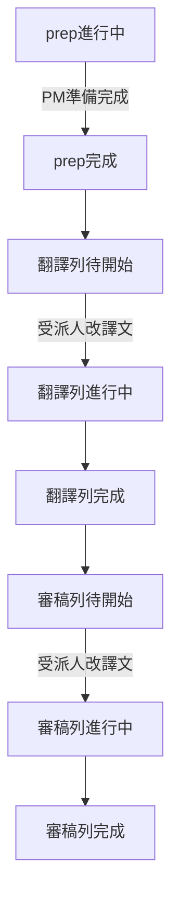

# Phase B-7 — 統一顯示狀態 + 檔案清單／儀表板 UX（2026-06）

> **狀態**：**B-7a～c／f 已實作**；**B-7d／B-7e 已實作**（2026-06-19）。  
> **上層路線圖**：[`CAT_WORKFLOW_STAGES_AND_REVISION_TRACKING_PLAN_2026-06.md`](./CAT_WORKFLOW_STAGES_AND_REVISION_TRACKING_PLAN_2026-06.md) §4.2.2。  
> **前置**：Phase B 已落地；**B-6 已實作**（`fd67332`、migration `20260616120000` 已 push）— 見 [`CAT_WORKFLOW_PREP_AND_REVIEW_B6_SPEC_2026-06.md`](./CAT_WORKFLOW_PREP_AND_REVIEW_B6_SPEC_2026-06.md)。  
> **延伸**：Phase B 檔案清單步驟欄改版構想見 [`CAT_WORKFLOW_PHASE_B_SPEC_2026-06.md`](./CAT_WORKFLOW_PHASE_B_SPEC_2026-06.md) §11.2；本規格為**產品定案版**並含儀表板。  
> **列號／鎖定**：見 §11 與 [`CAT_SORT_AND_DISPLAY_ORDER_SPEC_2026-06.md`](./CAT_SORT_AND_DISPLAY_ORDER_SPEC_2026-06.md) §6；誤鎖調查見 [`bug-report_workflow-whole-file-assign-edit-lock_2026-06.md`](./bug-report_workflow-whole-file-assign-edit-lock_2026-06.md)。  
> **狀態欄匯入**：見 §12；調查 [`bug-report_workflow-import-confirmed-status-column_2026-06.md`](./bug-report_workflow-import-confirmed-status-column_2026-06.md)（**B-7e 待排程**）。

本文件為 B-7 的**完整實作依據**；欄位命名為草案，**實作前以 migration 與 `cat-cloud-rpc.ts` 為準**，變更時須同步回寫本文件與上層大計畫。

---

## 1. 背景與目標

B-6 已提供 `prep` 步驟、派出閘門與審稿任務完成，但**使用者可見狀態**仍分散：

- 專案檔案清單：Workflow 步驟欄顯示語意（B-7a／b 已對齊 §3.1）。
- 儀表板「我的受派檔案」：讀 **`cat_stage_assignments`** + `resolveAssignmentDisplayStatus`（**B-7c 已實作**）。

B-7 目標：

1. **儀表板與檔案清單共用同一套顯示狀態**（產品層，與 DB `stage.status` 可分離）。
2. 釐清 **準備中** vs **待開始**（含派出後、開檔後、尚未改句）。
3. 改版檔案清單「指派對象」欄與儀表板兩區塊（受派檔案、最近使用）。
4. PM 狀態階梯（畫面＋寫入）、準備完成按鈕、離開閘門。
5. 新增 **`first_edited_at`**、**`cat_file_user_access`**；**退役** `cat_file_assignments.status` 作為進度燈號。
6. **指派與列號鎖定**對齊（B-7d）：CAT 整檔指派同步 Workflow、檔內／句段集內列號。

**不納入 B-7**：刪除 `cat_file_assignments` 表、合併 `sync_cat_file_assignments_for_case` 與 `sync_cat_workflow_assignments_for_case`（技術債另議）。

---

## 2. 已鎖定產品決策（2026-06-16）

| # | 議題 | 定案 |
|---|------|------|
| 1 | 準備／翻譯語意 | **準備中**：PM 做 MT／填譯文、定翻譯前基準。**待開始**（翻譯列）：`prep` 完成後至**首次在受派範圍內修改譯文**前（含 LMS 派出後、僅開檔未改句） |
| 2 | 開始編輯判定 | 對譯文**任何修改**即算；**不要求**句段確認 |
| 3 | 狀態粒度 | **每人、每階段**（拆段時各自待開始／進行中） |
| 4 | 審稿 | 可**提前改句**；審稿列 **待開始**／**進行中** 依 `first_edited_at`；**等待翻譯完成** 依翻譯指派任務完成（§3.1） |
| 5 | 顯示統一 | 儀表板與檔案清單共用 **`resolveAssignmentDisplayStatus()`**（[`cat-tool/js/wf-display-status.js`](../cat-tool/js/wf-display-status.js)） |
| 6 | PM 改回準備中 | **不**重置翻譯／審稿指派；**不**回寫 LMS `collab_rows[].taskCompleted` |
| 7 | 離開閘門 | **檔案清單**：PM 離開專案頁時，若專案內**任一檔**仍 `prep` 進行中 → 拒絕並列檔名。**編輯器**：僅檢查**目前開啟的檔** |
| 8 | `cat_file_assignments.status` | **不再驅動 UI**；停止「按開啟 → `in_progress`」；保留 `cancelled` 與新建預設 `assigned`（簿記／篩選） |
| 9 | 每人最後開檔 | 新表 **`cat_file_user_access`**（`user_id`, `file_id`, `last_opened_at`） |
| 10 | 首次改句 | **`cat_stage_assignments.first_edited_at`**（nullable timestamptz） |

### 2.1 與 B-6 顯示差異（B-7 取代）

| B-6 現行 | B-7 定案 |
|----------|----------|
| `prep` 完成顯示「準備完成」 | **不顯示** prep 完成列；翻譯列顯示「**待開始**」 |
| 僅 `prep` active 時顯示準備相關文案 | 清單**僅紅字**顯示「**準備中**」；翻譯／審稿列「**等待準備完成**」 |
| 儀表板 `assigned`／`in_progress` | 改為 Workflow 指派 + 統一 resolver |
| 列上「標記準備完成」按鈕 | 併入編輯器「**準備完成**」按鈕（§4.2）；列上按鈕移除 |

### 2.2 驗收後修訂（2026-06，B-7a 驗收討論）

| 議題 | 定案 |
|------|------|
| 右欄文案 | 左欄已有「翻譯／審稿」，右欄**不重複階段名**：**待開始／進行中／完成**；特殊：**準備中**（紅字橫幅）、**等待準備完成**、**等待翻譯完成**（灰） |
| PM 往後設狀態 | **畫面＋寫入**（DB 步驟與指派一併連動）；**僅** PM「調整狀態／準備完成」觸發；**不**因 `first_edited_at` 或審稿提前改句自動連動翻譯完成 |
| 審稿可提前改句 | 允許編輯；審稿 `first_edited_at` → 該人審稿列 **進行中**；**不得**因此自動標翻譯或翻譯列 **完成** |
| 審稿「待開始」閘門 | 覆蓋範圍內所有相關翻譯指派 `workflow_status === 'completed'`（任務完成）；**嚴格**：審稿範圍內每一列皆須有已完成翻譯指派覆蓋；無 stage 指派時 fallback 整檔 `translate` 步驟 `completed` |
| 準備完成再按 | [`openCatConfirmModal`](../cat-tool/app.js) 警告＋確認（**禁止** `window.confirm`）；若已有譯文改動仍可按，以**最後一次**準備完成為 `baseline_before_translate`（Phase C） |
| 列號座標 | **不用全案累加列號**；見 §12 |

---

## 3. 產品層顯示狀態（與 DB 步驟分離）

### 3.1 狀態詞彙（每人、每 `cat_stage_assignments` 列）

左欄為「翻譯／審稿」；右欄狀態如下（**不含**階段前綴）。

| 顯示用語 | 適用 | 條件（概念） |
|----------|------|--------------|
| **準備中** | 橫幅 | 檔案 `prep` 步 `status !== 'completed'` |
| **等待準備完成** | 翻譯列／審稿列 | `prep` 未完成 |
| **等待翻譯完成** | 審稿列 | `prep` 已完成；審稿範圍內翻譯指派尚未全 `completed`（嚴格覆蓋，§2.2） |
| **待開始** | 翻譯列或審稿列 | 對應階段；`first_edited_at` 為空；`workflow_status !== 'completed'`；且已通過上列閘門 |
| **進行中** | 翻譯列或審稿列 | `first_edited_at` 已寫入；`workflow_status !== 'completed'` |
| **完成** | 翻譯列或審稿列 | 該指派 `workflow_status === 'completed'`，或 PM 階梯已將該側標為完成（§4.2） |

**審稿提前改句**：審稿人可在翻譯未完成前改句 → 審稿列可為 **進行中**，同時翻譯列仍 **待開始**／**進行中**／**等待翻譯完成**；**不**推論翻譯 **完成**。



平行規則：

- **prep 進行中**：紅字「準備中」；翻譯／審稿列皆「等待準備完成」。
- **審稿列**：未通過翻譯完成閘門 →「等待翻譯完成」；通過且未改句 →「待開始」；已改句 →「進行中」。

### 3.2 DB 與顯示層分離

- LMS **派出**後，DB 仍可將 `translate.status` 設為 `active`（沿用 B-6）。
- **顯示層**在 `first_edited_at` 為空時，翻譯列仍顯示「**待開始**」，直至受派範圍內首次譯文變更寫入。
- **PM 階梯往後設**（§4.2）：顯示與 DB **一併**連動較前階段為 **完成**；與 §3.2 並存，**不**與 `first_edited_at` 自動連動混淆。

### 3.3 `resolveAssignmentDisplayStatus()`

輸入：`fileStages`、`assignment`、`stageKind`、`segments`（或快取進度）、`viewerRole`。  
輸出：`{ label, tone }` — `tone`：`danger`（準備中）、`muted`（等待／待開始）、`warning`（進行中）、`success`（完成）。

實作：[`cat-tool/js/wf-display-status.js`](../cat-tool/js/wf-display-status.js)（B-7a 已建；文案與閘門邏輯待 B-7b 對齊 §3.1）。

---

## 4. 檔案清單 UX

### 4.1 表頭與欄位

| 項目 | 定案 |
|------|------|
| 表頭 | 「**指派對象**」（B-7a 已實作） |
| 版面 | 每檔**上下兩列** grid：左欄「**翻譯**」「**審稿**」；右欄人名 + 範圍後綴 + §3.1 狀態 |
| 準備中 | `prep` active：紅字「**準備中**」橫幅；**不**顯示「準備完成」 |

觸點：[`cat-tool/index.html`](../cat-tool/index.html)；[`cat-tool/app.js`](../cat-tool/app.js) `_formatWorkflowListCellHtml`、`_fillFilesWorkflowCellsAsync`。

### 4.2 PM 狀態階梯與「準備完成」按鈕

階段概念**往下單向累積**：PM 手動設較後狀態時，**畫面＋寫入**一併將較前階段標為完成（§2.2）。

| PM 操作／檔案語意 | 清單顯示（翻譯列／審稿列） | 建議 DB 寫入 |
|-------------------|---------------------------|--------------|
| **準備中** | 紅字準備中／等待準備完成／等待準備完成 | `prep`→`active`；不動既有指派、不動 LMS |
| **準備完成** | 待開始／等待翻譯完成 | `prep`→`completed` + `enqueueStageSnapshot(..., 'baseline_before_translate')`；`translate`→`pending` |
| **翻譯執行中** | 進行中／等待翻譯完成 | `prep`→`completed`；`translate`→`active` |
| **翻譯完成** | 完成／等待翻譯完成或待開始（依嚴格閘門） | `translate`→`completed`；翻譯指派→`completed`；`enqueueStageSnapshot(..., 'post_translate')`；`review`→`active` |
| **審稿執行中** | 完成／進行中 | 翻譯側維持完成；`review`→`active` |
| **審稿完成** | 完成／完成 | `review`→`completed`；審稿指派→`completed`；翻譯步驟與指派維持 `completed`；`post_review` |

**編輯器按鈕**（待 B-7b）：

| 條件 | 行為 |
|------|------|
| `prep` active | 工具列「調整狀態」改顯示 **「準備完成」**（非四項下拉） |
| 按下「準備完成」 | 等同上表 **準備完成** 列 |
| PM 改回 **準備中** | 按鈕恢復「準備完成」 |
| 再次按「準備完成」 | 若已有譯文改動（如任一翻譯指派 `first_edited_at`）→ **`openCatConfirmModal`** 警告後執行；以此次為最新 `baseline_before_translate` |
| 列上 `_markFilePrepReady` | **移除**；併入「準備完成」 |

`prep` 完成後之一般調整：[`_renderPmAdjustStatusDropdownItems`](../cat-tool/app.js)／[`_openWfAdjustStatusModal`](../cat-tool/app.js) 擴充為上表六階（或等價 UI）。

### 4.3 PM 離開專案檔案清單閘門

| 項目 | 定案 |
|------|------|
| 對象 | **PM+** |
| 觸發 | `btnBackToProjects`、側欄離開 `viewProjectDetail` |
| 條件 | 專案內**任一**連結檔 `prep` 仍 `active` |
| 行為 | 拒絕導覽；toast 或 modal 列出檔名 |

---

## 5. 編輯器離開閘門

| 項目 | 定案 |
|------|------|
| 對象 | **PM+** |
| 觸發 | 側欄導覽離開 `viewEditor`（與 `ensureWorkspaceNoteLeaveResolved` 串接） |
| 條件 | **目前開啟的檔** `prep` 仍 `active` |
| 行為 | 拒絕；提示檔名仍在準備中 |

**不含**：同專案內切換另一檔案（若產品日後要擋，另開需求）。

---

## 6. 儀表板 UX

### 6.1 我的受派檔案

| 項目 | 定案 |
|------|------|
| 資料來源 | **`cat_stage_assignments`**；[`CatToolPage.tsx`](../src/pages/CatToolPage.tsx) 擴充查詢或 RPC（**B-7c 已實作**） |
| 狀態欄 | 階段 + §3.1 文案（如「翻譯 · 待開始」）；同檔雙階段 → **兩行** |
| 隱藏已完成 | 勾選方塊 filter；設定持久化至雲端 **`cat_user_ui_prefs`**，預設勾選（**B-7f 已實作**） |
| 時間欄 | 「**最後使用時間**」← `cat_file_user_access.last_opened_at`（**B-7c 已實作**） |
| 排序 | 最後使用時間遞增／遞減（**B-7c 已實作**） |
| 進度 | 受派列範圍內句段完成率（**B-7c 已實作**） |

### 6.2 最近使用的檔案

| 項目 | 定案 |
|------|------|
| 資料來源 | per-user `cat_file_user_access` |
| 專案 | 顯示所屬專案名 |
| 列格式 | 與專案內「指派對象」grid 一致 |
| 進度 | 譯者：受派範圍；**PM+**：全檔三步驟總體 |

---

## 7. 資料庫與 API

### 7.1 Migration

- **B-7a 已套用**：`20260617120000` — `cat_stage_assignments.first_edited_at` + RPC `cat_mark_stage_assignment_first_edited`。
- **B-7c 已套用**：`20260618120000` — `cat_file_user_access`（每人每檔最後開啟時間）。
- **B-7f 已套用**：`20260618130000` — `cat_user_ui_prefs`（使用者介面偏好；`hide_completed_dashboard` 預設 `true`）。

```sql
-- B-7c
CREATE TABLE IF NOT EXISTS public.cat_file_user_access (
  user_id uuid NOT NULL REFERENCES public.profiles(id) ON DELETE CASCADE,
  file_id uuid NOT NULL REFERENCES public.cat_files(id) ON DELETE CASCADE,
  last_opened_at timestamptz NOT NULL DEFAULT now(),
  PRIMARY KEY (user_id, file_id)
);

-- B-7f
CREATE TABLE IF NOT EXISTS public.cat_user_ui_prefs (
  user_id            uuid        NOT NULL REFERENCES public.profiles(id) ON DELETE CASCADE,
  hide_completed_dashboard boolean NOT NULL DEFAULT true,
  updated_at         timestamptz NOT NULL DEFAULT now(),
  PRIMARY KEY (user_id)
);
```

### 7.2 寫入觸點

| 事件 | 寫入 |
|------|------|
| `openEditor` 成功 | upsert `cat_file_user_access`（B-7c 已實作） |
| 譯文存檔 | 受派範圍內且 `first_edited_at` 為 null → 設 `first_edited_at`（B-7a 已實作） |
| PM 準備完成 | `baseline_before_translate` 快照（Phase C hook；B-7b） |
| 儀表板載入 | 讀取 `cat_user_ui_prefs` 套用「隱藏已完成」狀態（B-7f 已實作） |
| 「隱藏已完成」勾選變更 | 寫回 `cat_user_ui_prefs`（B-7f 已實作） |
| 停止 | 不再以 `CAT_ASSIGNMENT_STATUS` → `in_progress` 驅動儀表板（B-7c 已實作） |

### 7.3 雲端 RPC

[`src/lib/cat-cloud-rpc.ts`](../src/lib/cat-cloud-rpc.ts)：

| RPC | 波次 | 說明 |
|-----|------|------|
| `db.markStageAssignmentFirstEdited` | B-7a | 首次改句時間戳 |
| `db.upsertFileUserAccess` | B-7c | 開檔時更新 `cat_file_user_access` |
| `db.getRecentFiles` | B-7c | 依 `cat_file_user_access` 排序最近使用 |
| `db.getUserUiPref` | B-7f | 讀取 `cat_user_ui_prefs` |
| `db.setUserUiPref` | B-7f | 寫入 `cat_user_ui_prefs` |
| `db.listMyStageAssignments` | 待增 | 儀表板我的受派（目前由 `CatToolPage.tsx` 直接查詢） |

### 7.4 Dexie

- `stageAssignments.firstEditedAt`（v25，B-7a）。

### 7.5 `cat_file_assignments`（保留）

| 用途 | 說明 |
|------|------|
| 整檔指派關係 | PM、LMS sync；**須**同步 `cat_stage_assignments`（§11，**B-7d 已實作**） |
| 專案可見性 | 譯者專案清單 |
| **`status`** | 不作清單／儀表板進度 |

---

## 8. 實作波次

| 波次 | 內容 | 狀態 |
|------|------|------|
| **B-7a** | migration `20260617120000`、`first_edited_at`、grid 骨架、`wf-display-status.js` | **已實作**（`b577c08`／`60d48ce`） |
| **B-7b** | §4.2 PM 六階、準備完成按鈕、`openCatConfirmModal`、畫面＋寫入連動、離開閘門、resolver 文案 | **已實作**（`e313016`） |
| **B-7c** | 儀表板改版、`cat_file_user_access` migration `20260618120000`、`CatToolPage` stage assignments、停用 `in_progress`、最近使用檔案 | **已實作**（`7476192`） |
| **B-7d** | §11：`CAT_ASSIGN_FILE` 同步 `cat_stage_assignments`、句段集內列號快取 | **已實作** |
| **B-7e** | §12：匯入已確認句段對話框、狀態欄外環視覺、全格式 `orig-confirmed` | **已實作** |
| **B-7f** | `cat_user_ui_prefs` migration `20260618130000`、「隱藏已完成」雲端持久化、預設勾選、`db.getUserUiPref`／`db.setUserUiPref` | **已實作**（`574f11d`） |
| **B-7g** | 確認狀態五態、點圖示／Ctrl+Enter 分離、審稿回溯、篩選進度、PM 切換鈕；見 [`CAT_WORKFLOW_CONFIRM_STATUS_UX_2026-06.md`](./CAT_WORKFLOW_CONFIRM_STATUS_UX_2026-06.md) §13 開發紀錄 | **已驗收**（`c503f9d`） |

每波次：`npm run sync:cat`、更新本文件狀態欄。

---

## 9. 程式觸點索引

| 區塊 | 路徑 |
|------|------|
| 顯示狀態 | [`cat-tool/js/wf-display-status.js`](../cat-tool/js/wf-display-status.js) |
| 清單 UI | `_formatWorkflowListCellHtml`、`_fillFilesWorkflowCellsAsync`、`index.html` |
| PM 階梯 | `_renderPmAdjustStatusDropdownItems`、`_openWfAdjustStatusModal`、`_pmApplyWholeFileTranslateState`、`_pmApplyWholeFileReviewState`、`_pmApplyPrepState`（新）、準備完成按鈕 |
| 確認框 | `openCatConfirmModal`（**禁止** `window.confirm` 於準備完成） |
| 離開閘門 | `btnBackToProjects`、nav `viewProjectDetail`／`viewEditor` |
| 改句寫入 | `applyUpdateSegmentTarget`、`_maybeMarkStageFirstEditedForSegment` |
| 編輯鎖定 | `computeSegmentEditForbidden`、`_segFullListLineNo`、`_buildFullListLineNoCacheForFile`／view 快取（B-7d） |
| CAT 指派 | [`CatToolPage.tsx`](../src/pages/CatToolPage.tsx) `CAT_ASSIGN_FILE` → 同步 stage assignment（B-7d） |
| 儀表板（B-7c） | `renderAssignedFilesView`、`loadDashboardData`；`cat_file_user_access` upsert 於 `openEditor` |
| 使用者偏好（B-7f） | `loadDashboardData` → `DBService.getUserUiPref`；`dashboardHideCompleted` change → `DBService.setUserUiPref`；離線 fallback 預設 `true` |

---

## 10. 驗收清單（白話）

### 10.1 統一狀態（B-7b 對齊 §3.1）

1. 新匯入 → 紅字「準備中」；翻譯／審稿列「等待準備完成」；無「準備完成」字樣。
2. PM「準備完成」→ 翻譯列「待開始」；審稿列「等待翻譯完成」。
3. LMS 派出、譯者開檔未改句 → 翻譯列仍「待開始」。
4. 譯者改句 → 該人翻譯列「進行中」。
5. 拆段：各人狀態獨立。
6. 審稿：翻譯指派全完成後、未改句 →「待開始」；改句 →「進行中」。
7. 審稿提前改句 → 僅審稿列「進行中」；翻譯列**不**自動變「完成」。

### 10.2 檔案清單與 PM

1. 表頭「指派對象」；兩列 grid；右欄「待開始／進行中／完成」**不含**階段前綴。
2. PM 六階（§4.2）；`prep` 時按鈕為「準備完成」。
3. PM 設「審稿完成」→ 翻譯列亦「完成」（畫面＋DB）。
4. 離開閘門（專案頁／編輯器）如 §4.3、§5。
5. 再次「準備完成」且已有改句 → `openCatConfirmModal` 後才執行。

### 10.3 指派與鎖定（B-7d）

1. CAT 整檔指派三人 → 皆可編輯受派句段（非僅 `cat_file_assignments`）。
2. 句段集協作：`lineRange` 為**句段集內** 1..N，與左欄一致。
3. 單檔指派：`line_start`／`line_end` 為**檔內** 1..N；**不用**全案累加序。

### 10.4 儀表板（B-7c／B-7f）

1. 「我的受派檔案」：Workflow 狀態 + 最後使用時間（`cat_file_user_access`）。
2. 「最近使用的檔案」：與清單格式一致。
3. 「隱藏已完成」預設勾選；重新登入或跨裝置開啟仍維持上次設定（`cat_user_ui_prefs`）。

### 10.5 回歸

1. B-6 派出閘門、prep 編輯鎖、審稿任務完成、Slack 波次 A。
2. Phase B 拆分指派、LMS 雙向、開檔 session。

---

## 11. 指派、列號與編輯鎖定（B-7d）

> 調查樣本：[`bug-report_workflow-whole-file-assign-edit-lock_2026-06.md`](./bug-report_workflow-whole-file-assign-edit-lock_2026-06.md)（`Batch 11 Segment 459-1069_zho-TW.mqxliff`、整檔指派卻鎖定）。

### 11.1 列號座標定案

| 指派連結 | `line_start`／`line_end` 語意 | 與畫面對齊 |
|----------|------------------------------|------------|
| 僅 `file_id`／`linkedCatFileId` | **該檔內** 1..N | 單檔編輯器左欄 ID |
| `view_id`／`linkedCatViewId` | **該句段集內** 1..N | 句段集編輯器左欄 ID |

**禁止**：全案多檔累加列號；句段集指派時回母檔列號比對（「1」會在多檔間重複，無法使用）。

詳述：[`CAT_SORT_AND_DISPLAY_ORDER_SPEC_2026-06.md`](./CAT_SORT_AND_DISPLAY_ORDER_SPEC_2026-06.md) §6。

### 11.2 已知缺口與修復方向

| 問題 | 根因 | 修復（B-7d） |
|------|------|--------------|
| 整檔指派卻全鎖 | `CAT_ASSIGN_FILE` 只寫 `cat_file_assignments`；清單 fallback「整檔」但 `computeSegmentEditForbidden` 只認 `cat_stage_assignments` | 指派檔案時 **同步**整檔 translate stage assignment（`line_start`／`line_end` null） |
| 分割檔／協作誤鎖 | DB 存 459–1069 等與**檔內**列序混用 | LMS `lineRange` 與鎖定統一為 §11.1；必要時 backfill |
| 句段集誤鎖 | `_loadViewWorkflowContext` 以 `_buildFullListLineNoCacheForFile` 建**母檔**列序 | 有 `view_id` 時改建**句段集內** 1..N 快取 |

觸點：[`computeSegmentEditForbidden`](../cat-tool/app.js)、[`resolveFileUnassignedReadOnly`](../cat-tool/app.js)、[`sync_cat_workflow_assignments_for_case`](../supabase/migrations/20260615120000_fix_collab_row_id_text.sql)。

---

## 12. 匯入已確認句段 + 狀態欄視覺（B-7e，已定案）

> **調查背景**：[`bug-report_workflow-import-confirmed-status-column_2026-06.md`](./bug-report_workflow-import-confirmed-status-column_2026-06.md)

### 12.1 觸發條件

匯入 XLIFF 衍生格式（mqxliff／mxliff／sdlxliff／xliff）時，若 `buildSegmentsFromXliffXml` 偵測到任一 `status === 'confirmed'` 句段 → 顯示 `#importConfirmedModal`。**每次匯入都詢問**；預設選項固定（不記住上次）。

### 12.2 對話框選項（預設皆勾）

| # | 選項 | 預設 | 行為 |
|---|------|------|------|
| 1 | 將原檔已確認句段在系統內標為確認 | ☑ | **是**：寫入 `wfTransConfirmedAt`（實心綠點）；**否**：保留 `status=confirmed`、不寫 wf_*（`orig-confirmed` 外環） |
| 2 | 將原檔已確認句段寫入專案寫入 TM | ☑ | 語言對：**系統設定**（匯入任務語言對，預設）或**自行選擇**（全語言清單，同 `showFileLangModal`）；超出專案語言 → `openCatConfirmModal` 詢問是否 `updateProjectLangs` |
| 2a | 包含鎖定句段 | ☑ | 僅在 #2 勾選時顯示；取消則略過 `isLocked`／`isLockedSystem` 句段 |

對話框頂部顯示**原檔語言對**（唯讀）。

### 12.3 狀態欄視覺（B-7e 初版；完整五態見 B-7g）

B-7e 已落地匯入對話框與 `orig-confirmed` 初版。**確認狀態互動、五態視覺、tooltip、篩選與進度**之完整規格見專文件：

→ [`CAT_WORKFLOW_CONFIRM_STATUS_UX_2026-06.md`](./CAT_WORKFLOW_CONFIRM_STATUS_UX_2026-06.md)（**B-7g**，本對話亦稱 B-7f 確認狀態 UX）

| 狀態（摘要） | 視覺（摘要） |
|--------------|--------------|
| 未確認 | 灰邊白圓（14px） |
| 翻譯確認 | 實心綠內圓 + 白符號 |
| 審稿確認 | 實心綠內圓 + 實線外環 + 白符號 |
| 審稿後譯者再編輯 | 虛線外環 + 綠符號 |
| 審稿後譯者再確認 | 虛線外環 + 實心綠內圓 + 白符號 |
| 原檔已確認、系統未確認 | 實線外環 + 綠符號（無內圓 DOM） |

**適用格式**：所有 XLIFF 衍生格式；非 mqxliff 無 mq 符號層。

### 12.4 程式觸點

| 區塊 | 路徑 |
|------|------|
| 匯入對話框 | [`cat-tool/index.html`](../cat-tool/index.html) `#importConfirmedModal`；[`showConfirmedSegmentsDialog`](../cat-tool/app.js) |
| 匯入流程 | [`cat-tool/js/xliff-import.js`](../cat-tool/js/xliff-import.js) `handleXliffLikeImport` |
| 狀態欄 | [`buildStatusCellHtml`](../cat-tool/app.js)、[`cat-tool/style.css`](../cat-tool/style.css) `.orig-confirmed` |
| TM 寫入 | `xliff-import.js` → `writeImportConfirmedToProjectTms` → `CatToolXliffToTm.buildTmImportCandidates` + `DBService.bulkAddTMSegments`；目標 TM 來自專案 `writeTms`（`ActiveWriteTms` 或匯入時自 DB 解析）。匯入路徑缺口與修復見 [`bug-report_import-confirmed-tm-write-progress-overlay_2026-06.md`](./bug-report_import-confirmed-tm-write-progress-overlay_2026-06.md) §2.3。 |

### 12.5 待修（非本次）

- 準備完成按鈕右框線（`split-btn-main`）— 見 [`bug-report_workflow-import-confirmed-status-column_2026-06.md`](./bug-report_workflow-import-confirmed-status-column_2026-06.md) 附錄 A。
- TM 匯入寫入語言過濾（Bug D，可選）— 見 [`bug-report_import-confirmed-tm-write-progress-overlay_2026-06.md`](./bug-report_import-confirmed-tm-write-progress-overlay_2026-06.md) §2.4。

---

## 13. 修訂紀錄

| 日期 | 內容 |
|------|------|
| 2026-06-19 | **B-7g 規格定案**：[`CAT_WORKFLOW_CONFIRM_STATUS_UX_2026-06.md`](./CAT_WORKFLOW_CONFIRM_STATUS_UX_2026-06.md)；§15、§12.3 改引用 |
| 2026-06-19 | **B-7d 落地**：`CatToolPage.tsx` `CAT_ASSIGN_FILE`／`CAT_UNASSIGN_FILE` 同步整檔 `cat_stage_assignments`；`_buildFullListLineNoCacheForView` 句段集列號 |
| 2026-06-19 | **B-7e 視覺微調**：內圓 14px；外環 `2px` 白隙 + `4px` 綠；`orig-confirmed` 透明內圈（僅外環 + 綠符號） |
| 2026-06-19 | **B-7d／B-7e 規格定案**：§12 匯入已確認句段對話框、狀態欄外環視覺、全格式 `orig-confirmed`；§11 B-7d 整檔指派同步 |
| 2026-06-24 | §12.4 TM 寫入觸點補 `writeImportConfirmedToProjectTms`／`ActiveWriteTms`；§12.5 交叉引用匯入 TM Bug C／D 調查 |
| 2026-06-19 | **B-7c 落地（補記）**：commit `7476192`；`cat_file_user_access` migration `20260618120000`；`CatToolPage.tsx` 改查 `cat_stage_assignments`；最近使用檔案改依 `cat_file_user_access`；停用 `in_progress` 驅動 |
| 2026-06-19 | **批次審稿完成作業**：`scripts/bulk-set-review-completed.mjs` 批次設 413 個 `review` stage 為 `completed`；LMS 審稿人員比對補齊 74 筆指派（只調整審稿、不動翻譯）；修正 264 個 `cat_stage_assignments.workflow_status` 由 `assigned` 改為 `completed`（已存在指派但 `workflow_status` 未同步 bug 修正，見下 §14）；稍後處理清單：[`CAT_BULK_REVIEW_COMPLETE_2026-06.md`](./CAT_BULK_REVIEW_COMPLETE_2026-06.md) |
| 2026-06-17 | **B-7b 落地**：`wf-display-status.js` 文案、PM 六階、準備完成按鈕、離開閘門 |
| 2026-06-17 | **§12 B-7e 待排程**：狀態欄匯入 confirmed fallback、sdlxliff 空心圈；[`bug-report_workflow-import-confirmed-status-column_2026-06.md`](./bug-report_workflow-import-confirmed-status-column_2026-06.md) |
| 2026-06-17 | **驗收後修訂**：§2.2 決策；§3.1 文案（待開始／進行中／完成）；§4.2 PM 六階與準備完成按鈕；§11 指派／列號；波次 **B-7d**；驗收 §10 更新 |
| 2026-06-17 | **B-7a 落地**：`b577c08`／`60d48ce`、migration `20260617120000`、`wf-display-status.js`、清單 grid、`first_edited_at` |
| 2026-06-16 | 初稿：產品決策、檔案清單／儀表板 UX、實作波次 |

---

## 14. 批次審稿完成作業與 Bug 修正紀錄（2026-06-19）

### 14.1 背景

B-7a～c 落地後，系統內所有 CAT 檔案都已有 workflow stages 記錄，但大多數檔案的 `review` stage 狀態仍停在 `pending`，未反映實際審稿進度。使用者要求一次性把所有有效檔案批次設為「審稿完成」，同時對照 LMS 更正審稿人員指派。

### 14.2 作業腳本

路徑：`scripts/bulk-set-review-completed.mjs`

**執行流程**：

1. 讀取所有 `cat_files`（含 workflow stages + assignments）。
2. 跳過條件：
   - `prep` stage 尚未 `completed`（通知清單）。
3. 設定 `translate` + `review` stage 為 `completed`。
4. 若有 `related_lms_case_id`：查 LMS case reviewer，以 `cat_upsert_review_stage_assignment` 補齊或調整審稿指派（**只動審稿、不動翻譯**）。
5. 執行結果統計輸出；dry-run 模式不寫入。

**最終數字**（正式執行）：

| 項目 | 數量 |
|------|------|
| `review` stage 設為 `completed` | 413 |
| 跳過（prep 未完成） | 1（Zoopedia_part4） |
| 新增審稿指派 | 74 |
| 刪除舊審稿指派 | 若干（reviewer 已換） |

### 14.3 發現的 Bug：stage 已完成但 assignment 仍顯示「待開始」

**症狀**：批次完成後，儀表板大多數審稿檔仍顯示「**審稿・待開始**」，與預期「審稿・完成」不符。

**調查過程**：

1. 確認 `cat_file_workflow_stages`（review kind）：413 筆 `completed`，1 筆 `pending`——符合預期。
2. 確認 `cat_stage_assignments`（review stages）：250 筆 `assigned`，14 筆 `completed`——**此處異常**。
3. 回查 `wf-display-status.js` 顯示邏輯：
   - 若 assignment 存在 → 以 `assignment.workflow_status` 為準：`completed` → 完成，`assigned`／`in_progress` → 待開始／進行中。
   - 若無 assignment → fallback：`stage.status === 'completed'` → 完成。
4. **根因**：腳本 `setStagesCompleted` 只在設 stage 為 `completed` 時同步更新同一批次的 assignments；但 387 個 stage 在腳本執行前已是 `completed`（舊有完成記錄），其 assignments 是後來由 `cat_upsert_review_stage_assignment` 以預設 `assigned` 插入的——兩者時序錯開，`workflow_status` 未同步更新。

**修正 SQL（直接執行於 Supabase）**：

```sql
UPDATE cat_stage_assignments a
SET workflow_status = 'completed', updated_at = now()
FROM cat_file_workflow_stages s
WHERE a.file_workflow_stage_id = s.id
  AND s.stage_kind = 'review'
  AND s.status = 'completed'
  AND a.workflow_status != 'completed';
-- 影響 264 筆
```

### 14.4 顯示邏輯小結（避免未來誤踩）

`wf-display-status.js` 的 `resolveAssignmentDisplayStatus` 優先順序：

```
有 assignment → 以 assignment.workflow_status 為準
  'completed'           → 完成（綠）
  'in_progress'         → 進行中（橙）
  'assigned'（預設值）  → 待開始（灰）
無 assignment → 以 stage.status 為準
  'completed'           → 完成（綠）
  其他                  → 待開始（灰）
```

**教訓**：任何批次「把 stage 設為 completed」的作業，**必須同時**把對應的 `cat_stage_assignments.workflow_status` 也設為 `completed`，否則有指派的檔案仍會顯示「待開始」。

### 14.5 稍後處理清單

完整記錄見 [`CAT_BULK_REVIEW_COMPLETE_2026-06.md`](./CAT_BULK_REVIEW_COMPLETE_2026-06.md)：

| 項目 | 原因 | 處理方式 |
|------|------|----------|
| `Zoopedia_part4_384-425_TW_zho-TW.mqxliff` | `prep` 未完成，已跳過 | prep 完成後手動補設審稿完成 |
| 41 個含「自研工具」的 LMS 案件 | 缺少 `related_lms_case_id` 直連 | 手動逐案確認後補連結 |

---

## 15. 確認狀態 UX（B-7g）

> **完整規格**：[`CAT_WORKFLOW_CONFIRM_STATUS_UX_2026-06.md`](./CAT_WORKFLOW_CONFIRM_STATUS_UX_2026-06.md)

本波次補足 B-7e 之後的使用者回報與對話定案：

- **A1 甲**：審稿確認保留翻譯標記並追加審稿標記  
- **五態**狀態欄（含「審稿後譯者再編輯」虛線中間態）  
- **點圖示**與 **Ctrl+Enter** 分離；ID 右鍵「已確認」= Ctrl+Enter  
- 譯文變更取消確認；審稿快照回溯（toast／離開 modal）  
- 進階篩選三項 + 雙進度規則  
- PM+ 搜尋列翻譯／審稿切換（預設審稿）、準備中 tooltip、PM 首次改譯文警告  

實作波次見專文件 §11；驗收見專文件 §11 清單。
