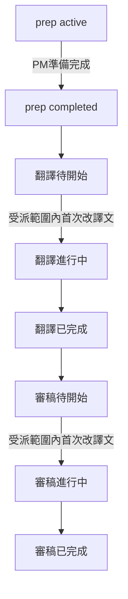

# Phase B-7 — 統一顯示狀態 + 檔案清單／儀表板 UX（2026-06）

> **狀態**：**B-7a 已實作**（2026-06-17）；B-7b／B-7c 規劃中。  
> **上層路線圖**：[`CAT_WORKFLOW_STAGES_AND_REVISION_TRACKING_PLAN_2026-06.md`](./CAT_WORKFLOW_STAGES_AND_REVISION_TRACKING_PLAN_2026-06.md) §4.2.2。  
> **前置**：Phase B 已落地；**B-6 已實作**（`fd67332`、migration `20260616120000` 已 push）— 見 [`CAT_WORKFLOW_PREP_AND_REVIEW_B6_SPEC_2026-06.md`](./CAT_WORKFLOW_PREP_AND_REVIEW_B6_SPEC_2026-06.md)。  
> **延伸**：Phase B 檔案清單步驟欄改版構想見 [`CAT_WORKFLOW_PHASE_B_SPEC_2026-06.md`](./CAT_WORKFLOW_PHASE_B_SPEC_2026-06.md) §11.2；本規格為**產品定案版**並含儀表板。

本文件為 B-7 的**完整實作依據**；欄位命名為草案，**實作前以 migration 與 `cat-cloud-rpc.ts` 為準**，變更時須同步回寫本文件與上層大計畫。

---

## 1. 背景與目標

B-6 已提供 `prep` 步驟、派出閘門與審稿任務完成，但**使用者可見狀態**仍分散：

- 專案檔案清單：Workflow 步驟欄（`_formatWorkflowListCellHtml`）顯示「準備完成」「待開始」等，與產品用語不一致。
- 儀表板「我的受派檔案」：仍讀 **`cat_file_assignments.status`**（按「開啟」即變「翻譯中」），與 Workflow 段落指派脫鉤。

B-7 目標：

1. **儀表板與檔案清單共用同一套顯示狀態**（產品層，與 DB `stage.status` 可分離）。
2. 釐清 **準備中** vs **翻譯待開始**（含派出後、開檔後、尚未改句）。
3. 改版檔案清單「指派對象」欄與儀表板兩區塊（受派檔案、最近使用）。
4. PM 離開閘門、調整狀態選單擴充。
5. 新增 **`first_edited_at`**、**`cat_file_user_access`**；**退役** `cat_file_assignments.status` 作為進度燈號。

**不納入 B-7**：刪除 `cat_file_assignments` 表、合併 `sync_cat_file_assignments_for_case` 與 `sync_cat_workflow_assignments_for_case`（技術債另議）。

---

## 2. 已鎖定產品決策（2026-06-16）

| # | 議題 | 定案 |
|---|------|------|
| 1 | 準備／翻譯語意 | **準備中**：PM 做 MT／填譯文、定翻譯前基準。**翻譯待開始**：`prep` 完成後至**首次在受派範圍內修改譯文**前（含 LMS 派出後、僅開檔未改句） |
| 2 | 開始編輯判定 | 對譯文**任何修改**即算；**不要求**句段確認 |
| 3 | 狀態粒度 | **每人、每階段**（拆段時各自待開始／進行中） |
| 4 | 審稿 | 與翻譯**對稱**：**審稿待開始** = 輪到審稿且尚未在受派範圍內改譯文 |
| 5 | 顯示統一 | 儀表板與檔案清單共用 **`resolveAssignmentDisplayStatus()`**（名稱草案，實作可為 `cat-tool/js/wf-display-status.js`） |
| 6 | PM 改回準備中 | **不**重置翻譯／審稿指派；**不**回寫 LMS `collab_rows[].taskCompleted` |
| 7 | 離開閘門 | **檔案清單**：PM 離開專案頁時，若專案內**任一檔**仍 `prep` 進行中 → 拒絕並列檔名。**編輯器**：僅檢查**目前開啟的檔** |
| 8 | `cat_file_assignments.status` | **不再驅動 UI**；停止「按開啟 → `in_progress`」；保留 `cancelled` 與新建預設 `assigned`（簿記／篩選） |
| 9 | 每人最後開檔 | 新表 **`cat_file_user_access`**（`user_id`, `file_id`, `last_opened_at`） |
| 10 | 首次改句 | **`cat_stage_assignments.first_edited_at`**（nullable timestamptz） |

### 2.1 與 B-6 顯示差異（B-7 取代）

| B-6 現行 | B-7 定案 |
|----------|----------|
| `prep` 完成顯示「準備完成」 | **不顯示** prep 完成列；翻譯列顯示「**翻譯待開始**」 |
| 僅 `prep` active 時顯示準備相關文案 | 清單**僅紅字**顯示「**準備中**」 |
| 儀表板 `assigned`／`in_progress` | 改為 Workflow 指派 + 統一 resolver |
| 列上「標記準備完成」按鈕 | 併入 PM「**調整狀態**」（準備中／翻譯待開始） |

---

## 3. 產品層顯示狀態（與 DB 步驟分離）

### 3.1 狀態詞彙（每人、每 `cat_stage_assignments` 列或整檔等價列）

| 顯示用語 | 條件（概念） |
|----------|--------------|
| **準備中** | 檔案 `prep` 步 `status !== 'completed'`（清單可單獨紅字橫幅，不佔翻譯／審稿 grid） |
| **翻譯待開始** | `prep` 已完成；翻譯階段；該指派 `first_edited_at` 為空；且未完成 |
| **翻譯進行中** | 翻譯階段；`first_edited_at` 已寫入；`workflow_status !== 'completed'` |
| **翻譯已完成** | 翻譯段落 `workflow_status === 'completed'` 或翻譯步 `completed`（與 Phase B 完成規則對齊） |
| **審稿待開始** | 審稿階段已啟動（步驟 `active` 或規格允許之時機）；`first_edited_at` 為空；未完成 |
| **審稿進行中** | 審稿階段；已改句；未完成 |
| **審稿已完成** | 審稿段落或步驟完成 |



### 3.2 DB 與顯示層分離

- LMS **派出**後，DB 仍可將 `translate.status` 設為 `active`（沿用 B-6 `cat_revert_workflow_stages_for_case`）。
- **顯示層**在 `first_edited_at` 為空時仍顯示「翻譯待開始」，直至受派範圍內首次譯文變更寫入。

### 3.3 `resolveAssignmentDisplayStatus()`（草案簽名）

輸入：`fileStages`、`assignment`、`segments`（或快取進度）、`viewerRole`。  
輸出：`{ label, tone }` — `tone` 供 CSS（如準備中 `danger`、待開始 `muted`、進行中 `warning`、已完成 `success`）。

---

## 4. 檔案清單 UX

### 4.1 表頭與欄位

| 項目 | 定案 |
|------|------|
| 表頭 | 「步驟／負責人」→「**指派對象**」 |
| 版面 | 每檔**上下兩列** grid：左欄垂直置中「**翻譯**」「**審稿**」；右欄人名 + 範圍後綴 + 統一顯示狀態 |
| 準備中 | 僅在 `prep` active 時於欄內或欄上方顯示紅字「**準備中**」；**不**顯示「準備完成」 |

觸點：[`cat-tool/index.html`](../cat-tool/index.html) 表頭；[`cat-tool/app.js`](../cat-tool/app.js) `_formatWorkflowListCellHtml`、`_fillFilesWorkflowCellsAsync`。

### 4.2 PM「調整狀態」

在 [`_renderPmAdjustStatusDropdownItems`](../cat-tool/app.js)／[`_openWfAdjustStatusModal`](../cat-tool/app.js) 擴充：

| 選項 | 建議寫入 |
|------|----------|
| **準備中** | `prep` → `active`（**不**清除既有翻譯／審稿指派、**不**動 LMS） |
| **翻譯待開始** | `prep` → `completed` + `enqueueStageSnapshot(..., 'baseline_before_translate')`；`translate` → `pending`；可選清除相關 `first_edited_at`（PM 明確退回基準時） |
| 翻譯執行中／翻譯完成 | 維持 B-4／B-6 現行 |
| 審稿執行中／審稿完成 | 維持 B-6 現行 |

列上獨立「標記準備完成」按鈕（`_markFilePrepReady`）**移除或隱藏**，行為併入「翻譯待開始」。

### 4.3 PM 離開專案檔案清單閘門

| 項目 | 定案 |
|------|------|
| 對象 | **PM+** |
| 觸發 | `btnBackToProjects`、側欄離開 `viewProjectDetail` |
| 條件 | 專案內**任一**連結檔 `prep` 仍 `active` |
| 行為 | 拒絕導覽；toast 或 modal 列出檔名 |

---

## 5. 編輯器離開閘門

| 項目 | 定案 |
|------|------|
| 對象 | **PM+** |
| 觸發 | 側欄導覽離開 `viewEditor`（與 `ensureWorkspaceNoteLeaveResolved` 串接） |
| 條件 | **目前開啟的檔** `prep` 仍 `active` |
| 行為 | 拒絕；提示檔名仍在準備中 |

**不含**：同專案內切換另一檔案（若產品日後要擋，另開需求）。

---

## 6. 儀表板 UX

### 6.1 我的受派檔案

| 項目 | 定案 |
|------|------|
| 資料來源 | **`cat_stage_assignments`**（依 `assignee_user_id`）；[`CatToolPage.tsx`](../src/pages/CatToolPage.tsx) `sendAssignments` 擴充查詢或 RPC |
| 狀態欄 | 「翻譯 · 待開始」等（共用 resolver）；同檔雙階段受派 → **兩行** |
| 隱藏已完成 | 勾選方塊 filter |
| 時間欄 | 「**最後使用時間**」← `cat_file_user_access.last_opened_at` |
| 排序 | 最後使用時間遞增／遞減 |
| 進度 | 受派列範圍內句段完成率（對齊編輯器進度計算） |

`cat_file_assignments` 仍可用於譯者**專案清單可見性**（[`CAT_VIEW_SPEC.md`](./CAT_VIEW_SPEC.md) §3.1），但**不**再驅動此表狀態欄。

### 6.2 最近使用的檔案

| 項目 | 定案 |
|------|------|
| 資料來源 | per-user `cat_file_user_access`，取代全站 `cat_files.last_modified` 排序 |
| 專案 | 顯示所屬專案名；點擊進入該專案檔案清單 |
| 列格式 | 與專案內檔案清單「指派對象」一致（grid + 統一狀態） |
| 排序 | 最後使用時間遞增／遞減 |
| 進度 | 譯者：受派範圍進度；**PM+**：全檔三步驟總體進度 |

觸點：[`cat-tool/app.js`](../cat-tool/app.js) `loadDashboardData`、`renderAssignedFilesView`；[`cat-tool/index.html`](../cat-tool/index.html) 儀表板表頭。

---

## 7. 資料庫與 API

### 7.1 Migration（草案）

```sql
-- cat_stage_assignments
ALTER TABLE public.cat_stage_assignments
  ADD COLUMN IF NOT EXISTS first_edited_at timestamptz;

-- per-user 開檔
CREATE TABLE IF NOT EXISTS public.cat_file_user_access (
  user_id uuid NOT NULL REFERENCES public.profiles(id) ON DELETE CASCADE,
  file_id uuid NOT NULL REFERENCES public.cat_files(id) ON DELETE CASCADE,
  last_opened_at timestamptz NOT NULL DEFAULT now(),
  PRIMARY KEY (user_id, file_id)
);
-- RLS：本人 SELECT/INSERT/UPDATE
```

### 7.2 寫入觸點

| 事件 | 寫入 |
|------|------|
| `openEditor` 成功 | upsert `cat_file_user_access.last_opened_at` |
| 譯文存檔／協作 commit | 若變更落在指派 `line_start`／`line_end` 範圍且 `first_edited_at` 為 null → 設 `first_edited_at = now()` |
| 停止 | `CAT_ASSIGNMENT_STATUS` → `in_progress`（儀表板按開啟） |

### 7.3 雲端 RPC

[`src/lib/cat-cloud-rpc.ts`](../src/lib/cat-cloud-rpc.ts)：

- `db.getRecentFiles`：改依目前使用者 `cat_file_user_access` 排序。
- 新增：`db.upsertFileUserAccess`、`db.listMyStageAssignments`（或擴充 `sendAssignments` 查詢）。

### 7.4 Dexie 離線

- 本機 `stageAssignments` 增 `firstEditedAt`；可選本機 `fileUserAccess` store；離線模式 resolver 行為與雲端對齊或文件註明限制。

### 7.5 `cat_file_assignments` 表（保留、精簡職責）

| 保留用途 | 說明 |
|----------|------|
| 整檔指派關係 | PM 指派、LMS `sync_cat_file_assignments_for_case` |
| 專案可見性 | 譯者專案清單 filter |
| 開檔權限備援 | `resolveFileUnassignedReadOnly` 次要檢查 |
| **`status` 欄** | 僅 `cancelled` 篩選與新建 `assigned`；**不作**儀表板／清單進度 |

---

## 8. 實作波次

| 波次 | 內容 | 狀態 |
|------|------|------|
| **B-7a** | migration + `first_edited_at` 寫入 + `resolveAssignmentDisplayStatus` + 清單 grid／標籤 | **已實作**（migration `20260617120000`） |
| **B-7b** | PM 調整狀態（準備中／翻譯待開始）+ 離開閘門（清單／編輯器） | 規劃中 |
| **B-7c** | 儀表板兩區塊 + `CatToolPage` 查詢 + 停用 `in_progress` 更新 | 規劃中 |

每波次完成後：`npm run sync:cat`、更新本文件狀態欄。

---

## 9. 程式觸點索引

| 區塊 | 路徑 |
|------|------|
| 顯示狀態 | 新 `cat-tool/js/wf-display-status.js` 或 `app.js` 區塊 |
| 清單 UI | `_formatWorkflowListCellHtml`、`_fillFilesWorkflowCellsAsync`、`index.html` |
| PM 調整 | `_renderPmAdjustStatusDropdownItems`、`_openWfAdjustStatusModal`、`_pmApplyPrepState`（新）、`_pmApplyTranslatePendingState`（新） |
| 離開閘門 | `btnBackToProjects`、nav `viewProjectDetail`／`viewEditor` |
| 改句寫入 | 譯文存檔／`applyRemoteCommit` 等 |
| 開檔時間 | `openEditor`、`db.getRecentFiles`、`CatToolPage.sendAssignments` |
| 儀表板 | `renderAssignedFilesView`、`loadDashboardData` |

---

## 10. 驗收清單（白話）

### 10.1 統一狀態

1. 新匯入 → 清單**僅紅字「準備中」**；無「準備完成」字樣。
2. PM 標記準備完成（或調整為「翻譯待開始」）→ 翻譯列顯示「**翻譯待開始**」。
3. LMS 派出後、譯者開檔但**未改任何譯文** → 儀表板與清單仍為「**翻譯待開始**」。
4. 譯者在受派範圍內**改任一譯文**（不必確認句段）→ 該人顯示「**翻譯進行中**」。
5. 拆段：A 已改句、B 未改 → 各自狀態獨立。
6. 審稿：翻譯完成後、審稿人未改句 →「**審稿待開始**」；改句後 →「審稿進行中」。

### 10.2 檔案清單與 PM

1. 表頭為「指派對象」；翻譯／審稿兩列 grid。
2. PM 調整狀態含「準備中」「翻譯待開始」。
3. PM 離開專案頁時若有檔仍在準備中 → 被拒絕並列檔名。
4. PM 離開編輯器時若**目前檔**仍在準備中 → 被拒絕。

### 10.3 儀表板

1. 「我的受派檔案」顯示階段＋統一狀態；可隱藏已完成；最後使用時間可排序。
2. 「最近使用的檔案」含專案連結、與清單一致格式、進度正確。

### 10.4 回歸

1. B-6 派出閘門、prep 編輯鎖、審稿任務完成、Slack 波次 A 仍正常。
2. Phase B 拆分指派、LMS 雙向、開檔 session 不 regression。

---

## 11. 修訂紀錄

| 日期 | 內容 |
|------|------|
| 2026-06-17 | **B-7a 落地**：migration `20260617120000`（`first_edited_at` + RPC）、`wf-display-status.js`、清單「指派對象」grid、譯文存檔寫入 |
| 2026-06-16 | 初稿：產品決策鎖定（統一顯示、翻譯／審稿待開始至首次改句、每人粒度、離開閘門、資料模型、`cat_file_assignments.status` 退役 UI）；檔案清單／儀表板 UX；實作波次與驗收 |
