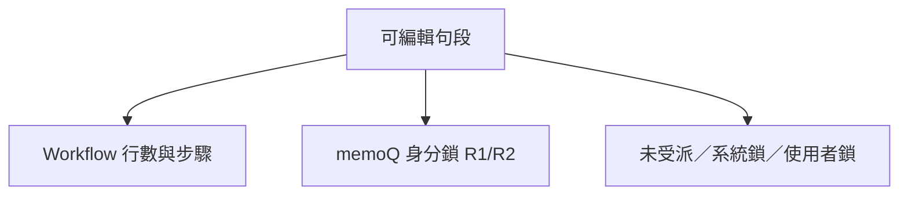

# Phase B — Workflow 框架實作規格（2026-06）

> **狀態**：B-0／B-1／**B-2 已落地**；B-3～B-5 規劃中。  
> **上層路線圖**：[`CAT_WORKFLOW_STAGES_AND_REVISION_TRACKING_PLAN_2026-06.md`](./CAT_WORKFLOW_STAGES_AND_REVISION_TRACKING_PLAN_2026-06.md) §4.2。  
> **前置**：Phase A 已收尾（2026-06-12）。  
> **排序／序號（B-0）**：[`CAT_SORT_AND_DISPLAY_ORDER_SPEC_2026-06.md`](./CAT_SORT_AND_DISPLAY_ORDER_SPEC_2026-06.md)。

本文件為 Phase B 的**完整實作依據**；欄位命名為草案，**實作前以 migration 與 `cat-cloud-rpc.ts` 為準**，變更時須同步回寫本文件。

---

## 1. 已拍板產品決策

| 議題 | 定案 |
|------|------|
| 步驟定義 | **混合**：專案級範本 + 單檔可覆寫；預設兩步 **翻譯 → 審稿** |
| 同一步多人 | **允許**；依**行數範圍**分工（段落指派，如 2A／2B／2C） |
| 步驟流 | **可退回**上一步（**PM 以上**） |
| mqxliff | **也走 Workflow**；memoQ T／R1／R2 仍為**作業身分**（開檔選擇），與內部步驟**獨立** |
| memoQ 鎖定 | **R1／R2 鎖定邏輯保留**（`computeForbiddenForRole`、`isBaselineForbidden`） |
| 雙通道確認 | 內部 Workflow 標記 + 段落「任務完成」**不寫入** mqxliff；memoQ 仍經 `updateMqxliffStatus` 匯出 |
| **確認手勢** | **沿用 Ctrl+Enter／點狀態欄**；一次寫入**內部 + memoQ**（mqxliff）；**取消一併清除** |
| **身分不一致** | 內部審稿步已標、開檔身分仍為 T 等 — **屬正常**，非 bug |
| **內部狀態欄（全格式）** | **綠點**＝翻譯步；**綠外圈**＝審稿步；mqxliff **另加**白色 memoQ 層 |
| **編輯權限** | **B**：有**段落指派**即可編該段，**不必**在整檔 `cat_file_assignments` |
| **離線 Workflow** | **要**（Dexie v23+ 與 Supabase 並行） |
| **進度** | **僅內部**確認（`wf_*`）；**翻譯｜審稿兩段**；**不算** memoQ 白勾 |
| **進度視角** | 受派人員→**己受派範圍**兩段；PM+／未受派→**整檔**兩段（PM+ 自己有受派仍看全檔） |
| **排序／序號** | 見 [`CAT_SORT_AND_DISPLAY_ORDER_SPEC_2026-06.md`](./CAT_SORT_AND_DISPLAY_ORDER_SPEC_2026-06.md) |

---

## 2. 編輯權限三層 AND

可編輯一句段須**同時**通過下列三層（皆為 AND）：

| 層 | 來源 | 程式錨點（現行） |
|----|------|------------------|
| Workflow | 目前步驟、段落指派之列範圍（全清單列序，見排序 spec §6） | Phase B 新增 `computeSegmentEditForbidden` |
| memoQ | 開檔身分 T／R1／R2、句段 `confirmationRole` | [`cat-tool/app.js`](../cat-tool/app.js) `computeForbiddenForRole`、`isDynamicForbidden`、`isBaselineForbidden` |
| 其他 | 段落指派 B、系統鎖、使用者鎖；**整檔** `cat_file_assignments` 不再單獨阻擋已指派段落 | `resolveFileUnassignedReadOnly` 行為須與 B 協調（A-5 基線保留 PM+ 豁免） |

---

## 3. 雙通道確認（mqxliff 與通用檔）

### 3.1 通道對照

| 通道 | 粒度 | 儲存（草案） | 匯出 | UI 操作 |
|------|------|--------------|------|---------|
| **內部 Workflow** | 句段內部標記；段落「任務完成」 | 句段：`wf_trans_confirmed_*`、`wf_review_confirmed_*`（§6）；段落：`cat_stage_assignments.workflow_status` | **不寫** mqxliff | **與 memoQ 同一操作**（Ctrl+Enter／點狀態欄）；依**目前內部步驟**更新綠點／綠圈 |
| **memoQ** | 單句（僅 mqxliff） | `status`、`confirmation_role`、`original_role` | `updateMqxliffStatus` | **同上**；mqxliff 另更新白 ✓／✓+／✓✓ |

**規則**：

- `confirmation_role` = 當次 memoQ 作業身分（`getSessionConfirmRole`），**不**依內部審稿步自動變 R1。
- **確認**：內部與 memoQ（mqxliff）**一次寫入**。
- **取消確認**：內部與 memoQ **一併清除**。
- 非 mqxliff：僅內部通道（綠點／綠圈）；無 memoQ 白字層。

### 3.2 mqxliff 狀態欄視覺（三層疊加）

**僅 mqxliff** 啟用三層；非 mqxliff 僅內部綠點／綠外圈（無白字）。

| 層 | 意義 | 視覺 |
|----|------|------|
| 底層 | 內部翻譯步已標記 | 實心綠點 |
| 中層 | 內部審稿步已標記 | 綠點外 **綠色外圈**（ring） |
| 上層 | memoQ 已確認 | **白色** ✓（T）／✓+（R1）／✓✓（R2）疊在綠底上 |

**尺寸**：狀態欄建議 40–44px 寬，或圖示 16–18px。

**整列底色**：`row-bg-confirmed` 淡綠仍綁 **memoQ 已確認**。

**Tooltip**（兩行）：① 內部步驟／標記人／時間（24 小時制）② memoQ 身分。

**圖例**：綠點＝內部翻譯；外圈＝內部審稿；白字＝memoQ。

### 3.3 完整狀態組合表

內部翻譯（T_wf）、內部審稿（R_wf）、memoQ（MQ）為**獨立布林**。

| T_wf | R_wf | MQ | 建議畫面 |
|:----:|:----:|:--:|----------|
| ✗ | ✗ | ✗ | 空心灰圓 |
| ✓ | ✗ | ✗ | 實心綠點，無白字 |
| ✓ | ✓ | ✗ | 實心綠點 + 綠外圈，無白字 |
| ✗ | ✗ | ✓ | 淡綠空心圓 + 白勾 |
| ✓ | ✗ | ✓ | 實心綠點 + 白 ✓／✓+／✓✓ |
| ✓ | ✓ | ✓ | 實心綠點 + 綠外圈 + 白 ✓／✓+／✓✓ |
| ✗ | ✓ | ✗ | 空心 + 綠外圈 |
| ✗ | ✓ | ✓ | 空心 + 綠外圈 + 白勾 |

---

## 4. 任務完成按鈕

| 項目 | 定案 |
|------|------|
| 位置 | CAT 工具列，**AI 輔助與匯出之間**（[`cat-tool/index.html`](../cat-tool/index.html) 約 758 行） |
| 誰可按 | 譯者與審稿皆可；完成後**仍可編輯** |
| 順序 | 審稿**不必等**翻譯段落全部完成 |
| PM+ | 主按鈕 + **split ▾**（`qfGroup`／提問表單），列出各**段落指派**代標完成 |
| LMS `task_completed` | 所有**連結 CAT 檔**上，全部**譯者**相關指派完成；審稿完成**不單獨**擋此狀態 |

段落「任務完成」寫入 `cat_stage_assignments.workflow_status`，與句段確認（§3）**互不覆寫**。

---

## 5. LMS 協作列整合

### 5.1 資料延伸（[`CollabRow`](../src/data/case-types.ts)）

| 欄位 | 用途 |
|------|------|
| `linkedCatFileId` | 對應 `cat_files.id`（派工對象為**檔案**時） |
| `linkedCatViewId` | 對應 `cat_views.id`（派工對象為**句段集**時）；與 `linkedCatFileId` **互斥**（一列僅綁檔或句段集） |
| `lineRange` 或 `scopeLabel` | 行數範圍或段落名（如 `2A`）；列號語意見排序 spec §6 |
| `collabRowId` | 雙向對 CAT `cat_stage_assignments` |

### 5.2 派出與雙向同步

擴充 [`sync_cat_file_assignments_for_case`](../supabase/migrations/20260508130000_sync_cat_file_assignments_fn_fix_translator_jsonb.sql)（或新 RPC）：

- 協作列 → CAT 翻譯／審稿步驟 + 列範圍／`scopeLabel`
- 寫入 `cat_stage_assignments`（現行僅整檔 `cat_file_assignments`）

**雙向（定案）**：

| 方向 | 內容 |
|------|------|
| LMS → CAT | 改協作列（譯者、分段、列範圍）同步段落指派 |
| CAT → LMS | 「任務完成」、工具列 PM+ 代標完成回寫 `taskCompleted` |
| LMS → CAT | LMS 勾選完成回寫 CAT 段落狀態 |

**撞車**：同一項幾乎同時兩邊修改 → **以最後儲存時間為準**。

### 5.3 LMS 派工 UI

- 選定 CAT **專案**後，可選派工對象：**檔案**或**句段集**（與處理檔案相同 UX）。
- **要拆段派工**（2A、2B）→ **拆幾段就幾列**協作列；整包一句段集不拆 → **一列**。
- **不加** LMS「審稿完成」欄；審稿進度僅在 CAT 查看。

### 5.4 句段集 × Workflow（§5-bis）

- **句段集模式例外**：進入句段集編輯器時畫面為**子集**，但 Workflow **仍分翻譯／審稿階段**（內部綠點／綠圈、段落指派均適用）。
- 列鎖定與 LMS 行數：以**母檔全清單列序**為準（與左欄 ID 一致）；見排序 spec §6。
- mqxliff 句段集：仍用 `file_roles[fileId]`；不跳身分視窗（沿用 A-5／句段集規格）。

### 5.5 教學樣本驗收（文件用）

| 資產 | 指派 |
|------|------|
| 檔案一 | 小明 |
| 檔案二 A 段 | 小華 |
| 檔案二 B 段 | 小華（可同時編輯，**分開按完成** → LMS **兩列**） |
| 檔案二 C 段 | 小王 |

---

## 6. 資料模型（草案）

| 表／Dexie store | 用途 |
|----------------|------|
| `cat_workflow_templates` + `cat_workflow_template_stages` | 專案範本 |
| `cat_file_workflow_stages` | 檔案實例步驟 |
| `cat_stage_assignments` | 段落指派 + `workflow_status` + `collab_row_id` |
| `cat_segments` 新欄 | `wf_trans_confirmed_*`、`wf_review_confirmed_*` |

**雙模式**：Dexie v23+；Supabase migration；[`src/lib/cat-cloud-rpc.ts`](../src/lib/cat-cloud-rpc.ts)。

**與 memoQ 區隔**：`confirmation_role` 僅 mqxliff 匯出通道；勿與 `wf_*` 混用。

---

## 7. 交付切片（建議實作順序）

| 子項 | 交付物 | 主要觸點 |
|------|--------|----------|
| **B-0** | 排序 spec 落地：檔序、句段集 sort、左欄顯示序、篩選 A；更新檔×句段集 UI 規格（UI 可併 B-4 實作） | [`CAT_SORT_AND_DISPLAY_ORDER_SPEC_2026-06.md`](./CAT_SORT_AND_DISPLAY_ORDER_SPEC_2026-06.md)；`app.js` |
| **B-1** | migration、Dexie v23、RPC 範本／檔案步驟；舊檔遷移（§9） | **已落地** `20260612120000` |
| **B-2** | 檔案／句段集清單步驟與負責人；`computeSegmentEditForbidden` | **已落地** `app.js` |
| **B-3** | 三層狀態欄、確認／取消合併、進度兩段 | `app.js`、`style.css` |
| **B-4** | 任務完成 + PM+ split；`CollabRow` 雙向；LMS 選句段集；派出 RPC | `index.html`、`CaseDetailPage.tsx` |
| **B-5** | 篩選第五維；教學案與兩例外檔驗收 | `evaluateSegment`；[`CAT_MQXIFF_FILTER_STATUS_IMPLEMENTATION.md`](./CAT_MQXIFF_FILTER_STATUS_IMPLEMENTATION.md) §2.3 |

---

## 8. 進度 UI（§10）

| 位置 | 顯示 |
|------|------|
| 專案檔案清單、句段集清單進度區 | **翻譯 xx%｜審稿 yy%**（僅內部 `wf_*`） |
| 編輯器左下角 | 同上；受派→己段範圍，PM+→整檔 |

**不算** memoQ 白勾進度。mqxliff `isBaselineForbidden` 字數基準與內部進度**分離**（實作註記於 B-3）。

---

## 9. 舊資料遷移（Workflow 預設已完成）

| 範圍 | 處理 |
|------|------|
| **其餘所有既有檔案** | 內部 Workflow **標為各階段已完成**（不強制分段鎖、不阻擋編輯） |
| **例外**（**不**標完成，走完整 Phase B） | 以 `cat_files.name` **完整字串**比對 |

**例外檔名**（2 個）：

1. `UI 20260610 - Batch 12 - UI (Localized Strings).csv_pq5mp9ubom3yz_zhHK_2026-06-10_10-05-31.xlsx_zho-TW.mqxliff`
2. `CCT6012 ICF CD22CART Amd7_2025-1215.docx_zho-TW.mqxliff`

部署 migration 時可另查 `file_id` 寫入種子；**規格以檔名為準**。檔名變更後須手動更新種子。

---

## 10. 驗收清單（白話）

1. **A-5 回歸**：未受派且無段落指派時仍唯讀；有段落指派可編己段（B）。
2. **確認合併**：Ctrl+Enter 同時更新內部（綠點／綠圈）與 mqxliff 白勾；**取消一併清除**。
3. **匯出**：mqxliff 僅反映 `confirmation_role`／`status`；`wf_*` 不寫 XML。
4. **段落完成**：「任務完成」只更新該段落；不批量改句段確認。
5. **排序 B-0**：句段集左欄 1～N；篩選跳號正常；列鎖與左欄 ID 一致。
6. **進度**：翻譯｜審稿兩段；不含 memoQ；PM+ 看全檔。
7. **LMS**：雙向同步；撞車依最後儲存時間；2A／2B 兩列。
8. **遷移**：兩例外 mqxliff **未**自動標完成；其餘舊檔已標完成。
9. **篩選**：內部 `wf_trans_marked`／`wf_review_marked` 與 memoQ 維度分開（B-5）。

---

## 11. 修訂紀錄

| 日期 | 內容 |
|------|------|
| 2026-06-12 | 初稿：產品決策、雙通道、三層狀態欄、任務完成、LMS、B-1～B-5 |
| 2026-06-12 | **v2**：確認合併、排序 spec／B-0、LMS 雙向、句段集派工、進度兩段、舊檔遷移兩檔例外、編輯權限 B、離線 Workflow |
