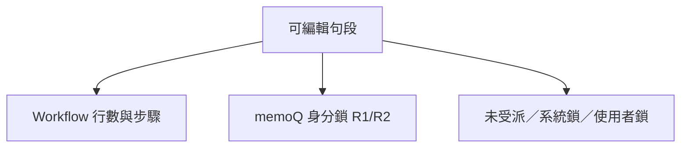

# Phase B — Workflow 框架實作規格（2026-06）

> **狀態**：B-0～B-5／**B-4 v5 已落地並驗收**（`e4a6205`、`92e2208`；含 collab_row_id 修正、檔案清單改版、LMS 同步、任務完成條件）。**開檔熱修** `cee4b03`～（workflow 工具列 TDZ／`allSegments` 誤用，見 §11.7）。  
> **上層路線圖**：[`CAT_WORKFLOW_STAGES_AND_REVISION_TRACKING_PLAN_2026-06.md`](./CAT_WORKFLOW_STAGES_AND_REVISION_TRACKING_PLAN_2026-06.md) §4.2。  
> **前置**：Phase A 已收尾（2026-06-12）。  
> **排序／序號（B-0）**：[`CAT_SORT_AND_DISPLAY_ORDER_SPEC_2026-06.md`](./CAT_SORT_AND_DISPLAY_ORDER_SPEC_2026-06.md)。

本文件為 Phase B 的**完整實作依據**；欄位命名為草案，**實作前以 migration 與 `cat-cloud-rpc.ts` 為準**，變更時須同步回寫本文件。

---

## 1. 已拍板產品決策

| 議題 | 定案 |
|------|------|
| 步驟定義 | **固定兩步** 翻譯 → 審稿；**暫不**提供自訂增減步驟 UI（**B**，日後另案）；DB 範本表保留 |
| 雙角色開檔 | 同一人同檔／句段集兼翻譯+審稿指派 → **開檔詢問本次工作步驟**（§4-bis **A**） |
| 整檔未拆 | 一列協作列 + 一筆整檔 `cat_stage_assignments`（`line_start`／`line_end` 為空） |
| 舊檔補寫 | 已 `related_lms_case_id` 的檔案，同步時 **retroactive** 補 `cat_stage_assignments` |
| 單人案件 | 無 `collab_rows` 時，對連結 CAT 檔自動建立整檔翻譯指派（譯者＝案件 `translator`） |
| 同一步多人 | **允許**；依**行數範圍**分工（段落指派，如 2A／2B／2C） |
| 步驟流 | **可退回**上一步（**PM 以上**） |
| mqxliff | **也走 Workflow**；memoQ T／R1／R2 仍為**作業身分**（開檔選擇），與內部步驟**獨立** |
| memoQ 鎖定 | **R1／R2 鎖定邏輯保留**（`computeForbiddenForRole`、`isBaselineForbidden`） |
| 雙通道確認 | 內部 Workflow 標記 + 段落「任務完成」**不寫入** mqxliff；memoQ 仍經 `updateMqxliffStatus` 匯出 |
| **確認手勢** | **沿用 Ctrl+Enter／點狀態欄**；一次寫入**內部 + memoQ**（mqxliff）；**取消一併清除** |
| **身分不一致** | 內部審稿步已標、開檔身分仍為 T 等 — **屬正常**，非 bug |
| **內部狀態欄（全格式）** | **綠點**＝翻譯步；**綠外圈**＝審稿步；mqxliff **另加**白色 memoQ 層 |
| **編輯權限** | **B**：有**段落指派**即可編該段，**不必**在整檔 `cat_file_assignments` |
| **離線 Workflow** | **要**（Dexie v23+ 與 Supabase 並行） |
| **進度** | **僅內部**確認（`wf_*`）；**翻譯｜審稿兩段**；**不算** memoQ 白勾 |
| **進度視角** | 受派人員→**己受派範圍**兩段；PM+／未受派→**整檔**兩段（PM+ 自己有受派仍看全檔） |
| **排序／序號** | 見 [`CAT_SORT_AND_DISPLAY_ORDER_SPEC_2026-06.md`](./CAT_SORT_AND_DISPLAY_ORDER_SPEC_2026-06.md) |

---

## 2. 編輯權限三層 AND

可編輯一句段須**同時**通過下列三層（皆為 AND）：



| 層 | 來源 | 程式錨點（現行） |
|----|------|------------------|
| Workflow | 目前步驟、段落指派之列範圍（全清單列序，見排序 spec §6） | Phase B 新增 `computeSegmentEditForbidden` |
| memoQ | 開檔身分 T／R1／R2、句段 `confirmationRole` | [`cat-tool/app.js`](../cat-tool/app.js) `computeForbiddenForRole`、`isDynamicForbidden`、`isBaselineForbidden` |
| 其他 | 段落指派 B、系統鎖、使用者鎖；**整檔** `cat_file_assignments` 不再單獨阻擋已指派段落 | `resolveFileUnassignedReadOnly` 行為須與 B 協調（A-5 基線保留 PM+ 豁免） |

---

## 3. 雙通道確認（mqxliff 與通用檔）

### 3.1 通道對照

| 通道 | 粒度 | 儲存（草案） | 匯出 | UI 操作 |
|------|------|--------------|------|---------|
| **內部 Workflow** | 句段內部標記；段落「任務完成」 | 句段：`wf_trans_confirmed_*`、`wf_review_confirmed_*`（§6）；段落：`cat_stage_assignments.workflow_status` | **不寫** mqxliff | **與 memoQ 同一操作**（Ctrl+Enter／點狀態欄）；依**目前內部步驟**更新綠點／綠圈 |
| **memoQ** | 單句（僅 mqxliff） | `status`、`confirmation_role`、`original_role` | `updateMqxliffStatus` | **同上**；mqxliff 另更新白 ✓／✓+／✓✓ |

**規則**：

- `confirmation_role` = 當次 memoQ 作業身分（`getSessionConfirmRole`），**不**依內部審稿步自動變 R1。
- **確認**：內部與 memoQ（mqxliff）**一次寫入**。
- **取消確認**：內部與 memoQ **一併清除**。
- 非 mqxliff：僅內部通道（綠點／綠圈）；無 memoQ 白字層。

### 3.2 mqxliff 狀態欄視覺（三層疊加）

**僅 mqxliff** 啟用三層；非 mqxliff 僅內部綠點／綠外圈（無白字）。

| 層 | 意義 | 視覺 |
|----|------|------|
| 底層 | 內部翻譯步已標記 | 實心綠點 |
| 中層 | 內部審稿步已標記 | 綠點外 **綠色外圈**（ring） |
| 上層 | memoQ 已確認 | **白色** ✓（T）／✓+（R1）／✓✓（R2）疊在綠底上 |

**尺寸**：狀態欄建議 40–44px 寬，或圖示 16–18px。

**整列底色**：`row-bg-confirmed` 淡綠仍綁 **memoQ 已確認**。

**Tooltip**（兩行）：① 內部步驟／標記人／時間（24 小時制）② memoQ 身分。

**圖例**：綠點＝內部翻譯；外圈＝內部審稿；白字＝memoQ。

### 3.3 完整狀態組合表

內部翻譯（T_wf）、內部審稿（R_wf）、memoQ（MQ）為**獨立布林**。

| T_wf | R_wf | MQ | 建議畫面 |
|:----:|:----:|:--:|----------|
| ✗ | ✗ | ✗ | 空心灰圓 |
| ✓ | ✗ | ✗ | 實心綠點，無白字 |
| ✓ | ✓ | ✗ | 實心綠點 + 綠外圈，無白字 |
| ✗ | ✗ | ✓ | 淡綠空心圓 + 白勾 |
| ✓ | ✗ | ✓ | 實心綠點 + 白 ✓／✓+／✓✓ |
| ✓ | ✓ | ✓ | 實心綠點 + 綠外圈 + 白 ✓／✓+／✓✓ |
| ✗ | ✓ | ✗ | 空心 + 綠外圈 |
| ✗ | ✓ | ✓ | 空心 + 綠外圈 + 白勾 |

---

## 4. 任務完成與調整狀態（B-4 v4）

**位置**：[`cat-tool/index.html`](../cat-tool/index.html) 工具列，「預先翻譯」與「匯出檔案」之間（`wfTaskCompleteGroup`）。

### 4.1 一般人（非 PM+）

| 項目 | 定案 |
|------|------|
| 顯示 | **任務完成** 主按鈕（無 ▾）；**有翻譯段落指派時永遠顯示**（不可用時反灰） |
| 條件 | 自己在**本次 session 工作步驟**（§4-bis）下有未完成**翻譯**段落指派 |
| 點擊 | `cat_stage_assignments.workflow_status` → `completed`；LMS 對應列 `taskCompleted=true` |
| 完成後 | 按鈕 **反灰鎖定**（`disabled`，仍可見），直到該段落被改回未完成 |
| 編輯 | 完成後**仍可編輯**句段 |

### 4.2 PM 以上

| 項目 | 定案 |
|------|------|
| 顯示 | **僅**「調整狀態」按鈕（**不**顯示「任務完成」）；**永遠顯示**（無可調段落時反灰） |
| 整檔未拆 | 下拉：**翻譯執行中**／**翻譯完成** |
| 拆段指派 | **Modal**：**每段一個下拉**（執行中／已完成）；列表依 `collab_row_id` 去重 |
| 翻譯完成（整檔） | 翻譯步 `completed`；**審稿步自動 `active`**；該檔**所有**翻譯段落指派 `completed`；LMS 相關列 `taskCompleted=true` |
| 翻譯執行中（整檔） | 翻譯步 `active`；審稿步改回 `pending`（若曾 `active`）；所影響段落與 LMS 列退回未完成 |
| 拆段 | 每段獨立設定狀態 |

**LMS 案件狀態**：全部譯者相關協作列 `taskCompleted` 時，案件可升 `task_completed`；審稿完成**不**單獨擋此狀態。

段落狀態寫入 `cat_stage_assignments.workflow_status`，與句段確認（§3）**互不覆寫**。

---

## 4-bis 開檔工作步驟選擇（調整 A）

**觸發**：同一人對同一檔案或句段集，同時存在翻譯與審稿的 `cat_stage_assignments`。

**UI**：`showWfSessionModal`；選項「本次以翻譯身分工作」／「本次以審稿身分工作」。

**Session**：`currentWfSessionKind: 'translate' | 'review'`（換檔／換句段集重問）。

**影響**（[`cat-tool/app.js`](../cat-tool/app.js)）：

- `computeSegmentEditForbidden` — 以 **session 步驟**的 `file_workflow_stage_id` 過濾指派
- `_workflowConfirmKinds` — Ctrl+Enter 只寫本次步驟的綠點或綠圈
- `refreshWfTaskCompleteToolbar` — 只計本次步驟的未完成指派
- 工具列提示：「目前：翻譯工作」／「目前：審稿工作」

**mqxliff**：Workflow 步驟與 memoQ T／R1／R2 **獨立**；開檔順序：**先** Workflow 步驟（若需）→ **再** memoQ 身分視窗。

**PM+**：編輯鎖仍豁免；確認符號跟 session，避免誤標另一步驟。

---

## 5. LMS 協作列整合

### 5.1 資料延伸（[`CollabRow`](../src/data/case-types.ts)）

| 欄位 | 用途 |
|------|------|
| `linkedCatFileId` | 對應 `cat_files.id`（派工對象為**檔案**時） |
| `linkedCatViewId` | 對應 `cat_views.id`（派工對象為**句段集**時）；與 `linkedCatFileId` **互斥**（一列僅綁檔或句段集） |
| `lineRange` 或 `scopeLabel` | 行數範圍或段落名（如 `2A`）；列號語意見排序 spec §6 |
| `collabRowId` | 雙向對 CAT `cat_stage_assignments` |

### 5.2 派出與雙向同步

**新 RPC**：`sync_cat_workflow_assignments_for_case`（與現有 [`sync_cat_file_assignments_for_case`](../supabase/migrations/20260508130000_sync_cat_file_assignments_fn_fix_translator_jsonb.sql) **並行**；後者保留，僅寫整檔 `cat_file_assignments`）。

- 協作列 → CAT 翻譯步 `cat_stage_assignments` + 列範圍／`scopeLabel` + `collab_row_id`
- 案件 `reviewer` → 審稿步整檔 `cat_stage_assignments`
- 單人案：對 `related_lms_case_id` 連結之 CAT 檔建立整檔翻譯指派
- `workflow_status` ↔ `taskCompleted` 初始對齊；**replace 模型**（先刪除過期翻譯指派，再 upsert）；`updated_at` 供撞車比對
- **列範圍**：留白＝整檔；`N-M`、`N`、`N-`（`line_end=NULL`＝至檔尾）
- **LMS 狀態退回**：案件 `status` 為 `draft`／`inquiry`／`dispatched` 時，連結 CAT 檔 **translate→active、review→pending**

**觸發**：案件 `非已派出→已派出`；`collabRows` 儲存；LMS `taskCompleted` 勾選／取消；**狀態變成** `draft`／`inquiry`／`dispatched`。

**雙向（定案）**：

| 方向 | 內容 |
|------|------|
| LMS → CAT | 協作列變更、`taskCompleted` 取消 → 同步段落指派與 `workflow_status` |
| CAT → LMS | 任務完成、PM 調整狀態 → 回寫 `collab_rows[].taskCompleted` |
| 撞車 | **以最後儲存時間為準**（`updated_at`） |

### 5.3 LMS 派工 UI（B-4 v4）

- **多人協作**：協作列可選 **CAT 檔案**或**句段集**，或 **不使用 1UP CAT**（說明輸入框＋複製＋列範圍）。
- 下拉顯示**純檔名**（無 `檔案：` 前綴）；選檔後 **同分頁** 開 CAT（`buildCatDeepLink`）。
- **權限**：**譯者**永遠不能改綁檔／列範圍；**PM+** 永遠可改；**譯者欄**維持現行（承接後譯者鎖、PM+ 可改）。
- **要拆段派工**（2A、2B）→ **拆幾段就幾列**協作列；整包不拆 → **一列**。
- **不加** LMS「審稿完成」欄；審稿進度僅在 CAT 查看。
- **資料遷移**：舊有 CAT 綁定協作列改為「不使用 1UP CAT」，`segment` 保留舊分段名稱。

### 5.4 句段集 × Workflow（§5-bis）

- **句段集模式例外**：進入句段集編輯器時畫面為**子集**，但 Workflow **仍分翻譯／審稿階段**（內部綠點／綠圈、段落指派均適用）。
- 列鎖定與 LMS 行數：以**母檔全清單列序**為準（與左欄 ID 一致）；見排序 spec §6。
- mqxliff 句段集：仍用 `file_roles[fileId]`；不跳身分視窗（沿用 A-5／句段集規格）。

### 5.5 教學樣本驗收（文件用）

| 資產 | 指派 |
|------|------|
| 檔案一 | 小明 |
| 檔案二 A 段 | 小華 |
| 檔案二 B 段 | 小華（可同時編輯，**分開按完成** → LMS **兩列**） |
| 檔案二 C 段 | 小王 |

---

## 6. 資料模型（草案）

| 表／Dexie store | 用途 |
|----------------|------|
| `cat_workflow_templates` + `cat_workflow_template_stages` | 專案範本 |
| `cat_file_workflow_stages` | 檔案實例步驟 |
| `cat_stage_assignments` | 段落指派 + `workflow_status` + `collab_row_id` |
| `cat_segments` 新欄 | `wf_trans_confirmed_*`、`wf_review_confirmed_*` |

**雙模式**：Dexie v23+；Supabase migration；[`src/lib/cat-cloud-rpc.ts`](../src/lib/cat-cloud-rpc.ts)。

**與 memoQ 區隔**：`confirmation_role` 僅 mqxliff 匯出通道；勿與 `wf_*` 混用。

---

## 7. 交付切片（建議實作順序）


| 子項 | 交付物 | 主要觸點 |
|------|--------|----------|
| **B-0** | 排序 spec 落地：檔序、句段集 sort、左欄顯示序、篩選 A；更新檔×句段集 UI 規格（UI 可併 B-4 實作） | [`CAT_SORT_AND_DISPLAY_ORDER_SPEC_2026-06.md`](./CAT_SORT_AND_DISPLAY_ORDER_SPEC_2026-06.md)；`app.js` |
| **B-1** | migration、Dexie v23、RPC 範本／檔案步驟；舊檔遷移（§9） | **已落地** `20260612120000` |
| **B-2** | 檔案／句段集清單步驟與負責人；`computeSegmentEditForbidden` | **已落地** `app.js` |
| **B-3** | 三層狀態欄、確認／取消合併、進度兩段 | **已落地** `86190c8`、`fafd1c8`（`app.js`、`style.css`、`index.html`） |
| **B-4** | 派出 RPC、任務完成／調整狀態、雙向同步、開檔 session（§4-bis） | **已落地**（B-4 v4） |
| **B-5** | 篩選第五維 | **已落地** `d53b568` |

**B-4 子項**：

| 子項 | 內容 | 狀態 |
|------|------|------|
| B-4a | 規格 v3（本文件） | 已落地 |
| B-4b | `sync_cat_workflow_assignments_for_case` migration | 已落地 |
| B-4c | LMS 協作列綁 CAT 檔 UI | 已落地 |
| B-4d | `showWfSessionModal` + session 觸點 | 已落地 |
| B-4e | 一般人任務完成反灰；PM「調整狀態」+ Modal | 已落地 |
| B-4f | 雙向退回 + retroactive 補寫 | 已落地 |
| B-4g | v4：replace 同步、協作表 UI、N- 列範圍、LMS 狀態退回、工具列常駐、審稿圖示、collab 遷移 | 已落地 |

---

## 8. 進度 UI（§10）

| 位置 | 顯示 |
|------|------|
| 專案檔案清單、句段集清單進度區 | **翻譯 xx%｜審稿 yy%**（內部 `wf_*`＋舊檔 fallback，見下） |
| 編輯器左下角 | **進度：A% / B%**　**句段：x / y / z**　**字數：x / y / z**（翻譯／審稿／總計）；綠色進度條＝翻譯 A% |

**規格原則**：進度以內部 Workflow 為主，**不算** memoQ 白勾為獨立第三段。

**舊檔 fallback（`fafd1c8`，2026-06-10 驗收）**：例外 mqxliff 等「Workflow 翻譯步進行中、句段僅 memoQ 已確認」時，`_isWfTransMarkedEffective`／`_isWfReviewMarkedEffective` 須將已確認句段計入**翻譯**進度（與遷移前綠條一致）；審稿步進行中才將 memoQ 已確認計入**審稿**；狀態欄綠點／綠圈與進度共用同一 effective 規則。**審稿已標⇒翻譯亦視為已標**；每句段獨立顯示審稿層（不限整檔 100%）。

mqxliff `isBaselineForbidden` 字數基準與內部進度**分離**（實作註記於 B-3）。

---

## 9. 舊資料遷移（Workflow 預設已完成）

| 範圍 | 處理 |
|------|------|
| **其餘所有既有檔案** | 內部 Workflow **標為各階段已完成**（不強制分段鎖、不阻擋編輯） |
| **例外**（**不**標完成，走完整 Phase B） | 以 `cat_files.name` **完整字串**比對 |

**例外檔名**（2 個）：

1. `UI 20260610 - Batch 12 - UI (Localized Strings).csv_pq5mp9ubom3yz_zhHK_2026-06-10_10-05-31.xlsx_zho-TW.mqxliff`
2. `CCT6012 ICF CD22CART Amd7_2025-1215.docx_zho-TW.mqxliff`

部署 migration 時可另查 `file_id` 寫入種子；**規格以檔名為準**。檔名變更後須手動更新種子。

---

## 10. 驗收清單（白話）

1. **A-5 回歸**：未受派且無段落指派時仍唯讀；有段落指派可編己段（B）。
2. **確認合併**：Ctrl+Enter 同時更新內部（綠點／綠圈）與 mqxliff 白勾；**取消一併清除**。
3. **匯出**：mqxliff 僅反映 `confirmation_role`／`status`；`wf_*` 不寫 XML。
4. **段落完成**：「任務完成」只更新該段落；不批量改句段確認。
5. **排序 B-0**：句段集左欄 1～N；篩選跳號正常；列鎖與左欄 ID 一致。
6. **進度**：翻譯｜審稿兩段；不含 memoQ；PM+ 看全檔。
7. **LMS**：雙向同步；撞車依最後儲存時間；2A／2B 兩列。
8. **遷移**：兩例外 mqxliff **未**自動標完成；其餘舊檔已標完成。
9. **篩選**：內部 `wf_trans_marked`／`wf_review_marked` 與 memoQ 維度分開（B-5，已落地）。
10. **派出**：協作列綁檔 → 派出後 DB 有 `cat_stage_assignments`；譯者開檔見「任務完成」。
11. **一般人**：完成→反灰；LMS 取消→可再點。
12. **PM**：僅見「調整狀態」（永遠可見）；整檔翻譯完成→審稿步 active；拆段 Modal 每段一個下拉。
13. **A**：雙角色開檔選步驟；確認符號與可編範圍跟 session。
14. **B**：無自訂步驟 UI；檔案固定翻譯+審稿兩步。
15. **v4**：協作表「不使用 1UP CAT」；譯者不能改綁檔／列範圍；LMS 退回 draft/inquiry/dispatched→CAT 翻譯進行中；replace 同步無幽靈列。

---

---

## 11. B-4 v5 規格（已落地）

### 11.0 驗收摘要（2026-06-15）

| 項目 | 結果 |
|------|------|
| Stanford Children's Health 260613／CCT6012 開檔 | 749 句段正常載入 |
| 主管「調整狀態」工具列 | 顯示且可操作 |
| LMS 協作列 `taskCompleted` 與 CAT 段落完成 | migration 後可雙向同步（v5-a） |
| 開檔 Console 無 `allSegments`／`currentWfSessionKind` 錯誤 | 熱修後通過（§11.7） |

---

### 11.1 Bug 修正：`collab_row_id` 型別不符

**根本原因**：

- `cat_stage_assignments.collab_row_id` 欄位型別為 `uuid`。
- LMS 前端產生協作列 ID 的格式為 `cr-${Date.now()}-${i}`（例如 `cr-1781320860619-0`），**不是合法 UUID**。
- `sync_cat_workflow_assignments_for_case` RPC 在 `BEGIN ... EXCEPTION WHEN OTHERS THEN v_collab_row_id := NULL;` 區塊中靜默失敗，導致所有指派的 `collab_row_id` 一律為 `NULL`。
- `_syncLmsForAssignments`／`_emitWfTaskCompleteToLms` 皆以 `if (!a.collabRowId) continue;` 跳過，**CAT→LMS 同步訊號從未送出**。

**已從 Supabase 確認**（2026-06-15，案件 Stanford Children's Health 260613）：
- 三筆 `cat_stage_assignments` 的 `collab_row_id` 均為 `NULL`
- 威儀（344-749）的 `workflow_status = completed`，但 LMS 對應列 `taskCompleted = false`，同步完全斷裂

**修正方案**：

| 步驟 | 內容 |
|------|------|
| Migration | `ALTER TABLE public.cat_stage_assignments ALTER COLUMN collab_row_id TYPE text;` |
| RPC 修正 | 移除 `(v_row->>'id')::uuid` 強制轉型；改以 `v_row->>'id'` 直接取文字；刪除相關 `EXCEPTION` 捕捉 |
| delete 條件 | `collab_row_id` 比對改用 `= ANY(v_valid_collab_row_ids::text[])` |
| CAT JS | `collabRowId` 讀取邏輯不變（已為字串）；`_emitWfTaskCompleteToLms` 與 `_syncLmsForAssignments` 已用字串比對，不需改動 |
| LMS TS | `cat-wf-lms-sync.ts` 中 `collabRowId` 已為 `string`，不需改動 |
| 補寫 | 修正後重新呼叫 `sync_cat_workflow_assignments_for_case` 回填現有指派的 `collab_row_id` |

---

### 11.2 檔案清單步驟欄改版

**現況**（`_formatWorkflowListCellHtml`）：

```
翻譯 · 進行中 · 朱耘廷（Segment #1-343）、威儀（Segment #344-）
審稿 · 待開始 · 威儀
```

一個步驟（stage）所有人共用同一行、同一個步驟狀態。

**新格式**：以 **assignment 為單位**逐行顯示，個人狀態獨立。

```
朱耘廷（Segment #1-343）· 翻譯 進行中
威儀（Segment #344-）· 翻譯 進行中
威儀 · 審稿 待開始
```

- 若無分段指派（整檔一筆），仍顯示一行（人名無範圍後綴）。
- **個別狀態**來源：`cat_stage_assignments.workflow_status`（`assigned`→「進行中」、`completed`→「已完成」）。
- `WF_STAGE_STATUS_LABEL` 補充 `assigned` 對應文字「進行中」。

**實作觸點**：`_formatWorkflowListCellHtml`（`cat-tool/app.js`）。

---

### 11.3 CAT → LMS 狀態升級

#### 11.3.1 非拆段檔案（整檔一筆指派）

- **觸發**：PM 用「調整狀態」將整檔翻譯步設為「翻譯完成」（`_pmApplyWholeFileTranslateState('completed')`）。
- **條件**：LMS 案件 `status` 仍為 `draft`、`inquiry` 或 `dispatched`。
- **動作（實作簡化）**：沿用既有 `CAT_WF_COLLAB_ROWS_BULK` → `setCollabRowsTaskCompletedBulkFromCat`；在 [`cat-wf-lms-sync.ts`](../src/lib/cat-wf-lms-sync.ts) 將升級條件由僅 `dispatched` 擴為 `draft`／`inquiry`／`dispatched`。**不新增** `CAT_WF_FILE_TRANSLATE_COMPLETED` postMessage。
- **限制**：若 LMS 案件狀態已是 `task_completed`、`delivered` 等，**不改動**。

#### 11.3.2 拆段檔案（全部分段完成）

- **觸發**：任一分段 `workflow_status` 更新後，經既有 bulk 同步更新 `collab_rows[].taskCompleted`。
- **條件**：所有協作列 `taskCompleted=true`，**且** LMS 案件 `status` 為 `draft`、`inquiry` 或 `dispatched`。
- **動作**：同 11.3.1（`cat-wf-lms-sync.ts` 條件擴充）。

#### 11.3.3 拆段檔案（個別分段完成 ↔ LMS 任務完成勾選）

**CAT → LMS（已有但因 Bug 未通）**：修正 `collab_row_id` 後，原有的 `CAT_WF_STAGE_ASSIGNMENT_COMPLETED`／`CAT_WF_COLLAB_ROWS_BULK` 機制即可正常更新 LMS 協作列的 `taskCompleted`。

**LMS → CAT（取消勾選時退回）**：
- LMS 上取消勾選「任務完成」→ 呼叫 `sync_cat_workflow_assignments_for_case`（現有邏輯）→ 對應 assignment `workflow_status` 改回 `assigned`。
- 退回時，CAT 端若翻譯步狀態為 `completed`，應同步改回 `active`（與現有 `_pmApplyWholeFileTranslateState('active')` 邏輯一致）。

**LMS 勾選（譯者）— 確認驗證**：

- 對**譯者**而言，勾選前須驗證「受派行號範圍內所有句段是否全部有 `wf_trans_confirmed_at`」。
- **驗證時機**：勾選的瞬間（點擊時），**不**提前反灰（採 B+簡化方案）。
- **驗證機制**：LMS 在勾選時透過 Supabase 查詢 `cat_segments`（[`cat-collab-task-complete.ts`](../src/lib/cat-collab-task-complete.ts)），篩出 `global_id` 在行號範圍內且 `wf_trans_confirmed_at IS NULL` 的句段數量。若 > 0，toast「尚有未確認句段，無法勾選」並中止。
- **PM+**：直接勾選，不驗證確認進度（可強制完成）。

---

### 11.4 任務完成按鈕邏輯強化

#### 11.4.1 一般人（非 PM+）— 可用條件調整

**現況**：按鈕可用條件 = `mineIncomplete.length > 0`（有 `workflow_status ≠ completed` 的翻譯指派）。

**新條件**（AND 邏輯）：

1. 所在 session 步驟為 **翻譯**（`currentWfSessionKind === 'translate'`）
2. 有翻譯段落指派（`hasMineTranslate`）
3. 指派的翻譯步驟狀態為 **active**（`translateStage.status === 'active'`）
4. 受派**行號範圍內所有句段**均已有 `wfTransConfirmedAt`（本地 Dexie 掃描，無網路延遲）

條件 1–3 不變，**新增條件 4**。

**多段指派（同一譯者、同一檔案、多個 collab_row）**：

- 只要**任一分段**滿足條件 1–4，按鈕即可用。
- 按下後開啟 **「完成分段」對話視窗**（參照現有「調整狀態」Modal 樣式），列出所有滿足條件的分段供勾選，確認後逐筆完成。
- 若只有一個分段，直接完成（不彈視窗）。

#### 11.4.2 PM 以上

**現況**：「調整狀態」按鈕在無可調段落時反灰（`disabled = !hasPmTarget`）。

**新規格**：「調整狀態」按鈕**永遠可用**（`disabled = false`），無視確認進度；可強制將任何段落設為完成或退回。

---

### 11.5 LMS 同步函式調整（非新增 postMessage）

| 函式 | 用途 |
|------|------|
| `setCollabRowTaskCompletedFromCat` | 單列完成時，若全部完成且案件 status 為 draft/inquiry/dispatched → 升 `task_completed` |
| `setCollabRowsTaskCompletedBulkFromCat` | 同上（bulk 路徑） |

**不新增** `CAT_WF_FILE_TRANSLATE_COMPLETED` 或 `upgradeToTaskCompletedIfEligible`；Bug 修正後既有 bulk 同步即可觸發升級。

---

### 11.6 交付子項

| 子項 | 內容 | 觸點 |
|------|------|------|
| B-4v5-a | `collab_row_id` 型別修正：migration ALTER TABLE + RPC 改文字比對 + 回填現有指派 | `supabase/migrations/新檔`、`sync_cat_workflow_assignments_for_case` |
| B-4v5-b | 檔案清單步驟欄改版：以 assignment 為單位逐行顯示 | `cat-tool/app.js` `_formatWorkflowListCellHtml` |
| B-4v5-c | CAT→LMS 狀態升級（`cat-wf-lms-sync.ts` 條件擴充） | `src/lib/cat-wf-lms-sync.ts` |
| B-4v5-d | LMS 任務完成勾選：譯者確認驗證 + 取消退回 | `src/lib/cat-collab-task-complete.ts`、`CollaborationTable.tsx` |
| B-4v5-e | 任務完成按鈕：受派範圍句段全確認才可用（Dexie 掃描）；多段選擇 Modal | `cat-tool/app.js` `refreshWfTaskCompleteToolbar` |
| B-4v5-f | PM 調整狀態：永遠可用，無視確認進度 | `cat-tool/app.js` `refreshWfTaskCompleteToolbar` |
| B-4v5-g | sync:cat + 推送 | `npm run sync:cat`；git commit & push |

**建議執行順序**：v5-a（Bug 修正最優先，修好後所有訊號才通）→ v5-b → v5-c → v5-d → v5-e → v5-f → v5-g。

### 11.7 開檔熱修：workflow 工具列變數初始化（2026-06-15）

**背景**：B-4 v5-e 在 `_isAssignmentRangeFullyConfirmed` 掃描句段確認時誤用字數統計區域變數 `allSegments`；`refreshWfTaskCompleteToolbar` 又在 `openEditor` 完成前即被呼叫（`_loadFileWorkflowContext`、`applyTmsIdentityToUI`）。另有多個 workflow 狀態以 `let` 宣告在 `app.js` 後段，LMS 父頁提早送 `TMS_IDENTITY` 時觸發 **TDZ（暫時性死區）**。

**症狀**（Stanford CCT6012 驗收期）：

| 錯誤 | 影響 |
|------|------|
| `ReferenceError: allSegments is not defined` | 開檔卡在「載入中…」、句段 0/0/0、返回鈕失效 |
| `Cannot access '_wfTaskCompleteUiBound' before initialization` | 身分同步時 Console 紅字 |
| `Cannot access 'currentWfSessionKind' before initialization` | 內容可顯示但 Console 仍有紅字 |

**修正**（`cat-tool/app.js`）：

| 項目 | 作法 |
|------|------|
| 句段掃描 | `_isAssignmentRangeFullyConfirmed` 改讀 `currentSegmentsList`（句段未載入時安全回傳 false） |
| TDZ | `let _wfTaskCompleteUiBound`、`let currentWfSessionKind` **前移**至檔案前段（與 `currentFileId` 同區） |
| PM 路徑 | `refreshWfTaskCompleteToolbar` 先判斷 `_isCatPmOrExecutive()` 再掃句段，減少開檔中途多餘計算 |

**Git**：`cee4b03`（`allSegments`／`_wfTaskCompleteUiBound`）、後續 commit（`currentWfSessionKind`）。

**驗收**：CCT6012 開檔 749 句；Console 無上述三錯；主管「調整狀態」可用；左上角返回正常。

---

## 12. 修訂紀錄

| 日期 | 內容 |
|------|------|
| 2026-06-12 | 初稿：產品決策、雙通道、三層狀態欄、任務完成、LMS、B-1～B-5 |
| 2026-06-12 | **v2**：確認合併、排序 spec／B-0、LMS 雙向、句段集派工、進度兩段、舊檔遷移兩檔例外、編輯權限 B、離線 Workflow |
| 2026-06-10 | **B-3 進度修正** `fafd1c8`：編輯器左下角單行三組數字；舊 memoQ 已確認句段納入翻譯進度 fallback；狀態欄 effective 與進度一致 |
| 2026-06-10 | **B-4 v3**：派出 RPC、任務完成／調整狀態分流、雙向退回、開檔步驟選擇 A、固定兩步 B、PM 僅「調整狀態」、翻譯完成→審稿 active |
| 2026-06-10 | **B-4 v4**：replace 同步、協作表 UI（不使用 CAT／同頁開檔）、`N-` 列範圍、LMS 狀態退回、工具列常駐、審稿圖示、collab_rows 遷移 |
| 2026-06-15 | **B-4 v5 實作**：`collab_row_id` text migration、檔案清單 assignment 逐行顯示、LMS 升級條件擴充、譯者勾選驗證、任務完成 Dexie 掃描、PM 調整狀態永遠可用 |
| 2026-06-15 | **開檔熱修** `cee4b03`：`allSegments`→`currentSegmentsList`、`_wfTaskCompleteUiBound` 前移；CCT6012 驗收 |
| 2026-06-15 | **開檔熱修續**：`currentWfSessionKind` 前移；§11.0 驗收摘要、§11.7 紀錄 |
