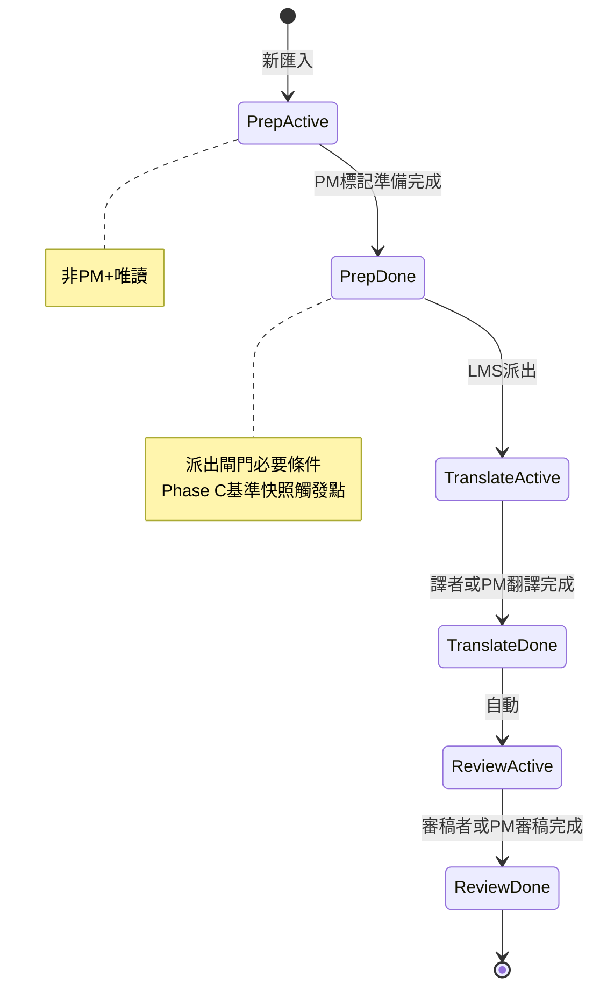

# Phase B-6 — 檔案準備閘門 + 審稿任務完成（2026-06）

> **狀態**：**已實作並驗收**（2026-06-16）；Git `fd67332`；migration `20260616120000_cat_workflow_b6_prep_review.sql` **已 push** 至雲端（見 §11）。  
> **上層路線圖**：[`CAT_WORKFLOW_STAGES_AND_REVISION_TRACKING_PLAN_2026-06.md`](./CAT_WORKFLOW_STAGES_AND_REVISION_TRACKING_PLAN_2026-06.md) §4.2.1（B-6 切片）、§4.3（Phase C 依賴）。  
> **前置**：Phase B 已落地（[`CAT_WORKFLOW_PHASE_B_SPEC_2026-06.md`](./CAT_WORKFLOW_PHASE_B_SPEC_2026-06.md) `e4a6205`～`d7232ab`）。  
> **後續顯示語意**：清單「準備完成」、儀表板 `cat_file_assignments.status` 等由 [**B-7**](./CAT_WORKFLOW_B7_UNIFIED_STATUS_AND_LIST_UX_2026-06.md) 取代（§2.1）。

本文件為 B-6 的**完整實作依據**；欄位命名為草案，**實作前以 migration 與 `cat-cloud-rpc.ts` 為準**，變更時須同步回寫本文件與上層大計畫。

---

## 1. 背景與目標

### 1.1 為何需要第 0 步「檔案準備」

未來 **Phase C 追蹤修訂**需比對「翻譯階段對 AI／機器翻譯或客戶預先準備譯文做了哪些修改」。這要求系統在**正式派出翻譯前**，有一個明確的**基準時點**——譯文內容已就緒、PM 確認可開工。

因此：

- 所有**新匯入**檔案預設處於第 0 步 **檔案準備中**（`prep`）。
- 僅 **PM 以上**可將檔案標為 **準備完成**，並作為 LMS **派出**（案件 `dispatched`）的前置條件。
- **準備完成**時預留 Phase C **基準快照**觸發點（實作可延後，見 §5）。

### 1.2 為何需要審稿任務完成

Phase B 已落地**翻譯**段落「任務完成」與 PM「調整狀態」（翻譯執行中／翻譯完成），但**審稿**僅有句段層 `wf_review_confirmed_*` 與開檔 session，**缺少**與翻譯對稱的段落完成與 PM 整檔／拆段調整。B-6 補齊此缺口。

---

## 2. 已鎖定產品決策（2026-06-15）

| # | 議題 | 定案 |
|---|------|------|
| 1 | 準備中能否編輯譯文 | **A**：僅 **PM+** 可編；譯者／審稿人**唯讀**（可檢視全檔） |
| 2 | 審稿完成是否發 Slack | **暫不**（不擴充 [`slack-case-reply-notify.ts`](../src/lib/slack-case-reply-notify.ts)） |
| 3 | 單人多檔審稿全完是否升 LMS 狀態 | **暫不**（不新增類似翻譯的 `maybeUpgradeCaseTaskCompletedFromCatFiles` 審稿版） |
| 4 | 已派出舊檔 | **是**：migration backfill 將 `prep` 設為 `completed`，免 PM 逐檔點選 |

---

## 3. 三步驟狀態機

在 Phase B 固定兩步（翻譯 → 審稿）之前，插入第 0 步 **prep**。

| `stage_order` | `stage_kind` | 介面標籤 | 預設（新匯入） | 推進條件 |
|---------------|--------------|----------|----------------|----------|
| 0 | `prep` | 檔案準備 | `active` | PM+「標記準備完成」→ `completed` |
| 1 | `translate` | 翻譯 | `pending` | LMS 派出後 → `active`；譯者任務完成或 PM 翻譯完成 → `completed` |
| 2 | `review` | 審稿 | `pending` | 翻譯 `completed` 後 → `active`；審稿者任務完成或 PM 審稿完成 → `completed` |



**與 Phase B 例外檔**：兩檔 mqxliff 檔名例外（見 Phase B §6）在 B-6 仍保留翻譯／審稿特殊遷移；**prep** 對已派出舊檔一律 `completed`（§6.3）。

---

## 4. B-6a 檔案準備（prep）

### 4.1 匯入與建檔

| 觸點 | 行為 |
|------|------|
| 批次匯入精靈 `runBatchImport` | 新檔 `ensure_cat_file_workflow_stages` → `prep=active`，`translate/review=pending` |
| 單檔匯入／GS 匯入 | 同上 |
| **更新作業檔** | **不**重設既有檔的 `prep` 狀態（僅新句段／內容合併） |

### 4.2 PM「標記準備完成」

| 項目 | 定案 |
|------|------|
| 權限 | **PM+** |
| 位置 | 專案**檔案清單**（建議：步驟欄旁或列操作）；可支援多選批次 |
| 確認 | 建議二次確認：「將作為翻譯前基準，確定譯文／MT 已就緒？」 |
| 寫入 | `cat_file_workflow_stages`：`prep.status` → `completed`，`completed_at`；建議另寫 `prep_completed_at`、`prep_completed_by`（檔案步驟層或 `cat_files` 擴充欄） |
| 副作用 | 呼叫 `enqueueStageSnapshot(fileId, prepStageId, 'baseline_before_translate')`（§5，可先 no-op） |

**準備完成後、派出前**：翻譯步仍為 `pending`；譯者若開檔，依 §4.4 唯讀規則（非 PM+ 不可改譯文）。

### 4.3 LMS 派出閘門

| 項目 | 定案 |
|------|------|
| 觸發 | [`CaseDetailPage.tsx`](../src/pages/CaseDetailPage.tsx)「確定指派」／公布後派出（`status` → `dispatched`）**之前** |
| RPC | `cat_case_all_linked_files_prep_ready(p_case_id uuid) returns boolean` |
| 查詢範圍 | `cat_files` 中 `related_lms_case_id = p_case_id` 的**每一檔** |
| 通過條件 | 每檔存在 `prep` 步且 `status = 'completed'`；**無連結 CAT 檔**時視為通過（純 LMS 案件） |
| 失敗 | toast 列出尚未準備完成的檔名；**不**變更案件狀態 |
| 通過後 | 維持現有 [`sync_cat_workflow_assignments_for_case`](../supabase/migrations/20260610140000_sync_cat_workflow_assignments.sql) → `translate=active` |

可選：[`CaseCatToolsPanel.tsx`](../src/components/CaseCatToolsPanel.tsx) 顯示連結檔 prep 狀態，方便 PM 派出前檢查。

### 4.4 編輯鎖（準備中）

在 [`cat-tool/app.js`](../cat-tool/app.js) `computeSegmentEditForbidden` 增加一層（與 Workflow 行數、mqxliff 鎖並列）：

| 條件 | 結果 |
|------|------|
| 當前檔 `prep` 步 `status !== 'completed'` **且** 使用者非 PM+ | **唯讀**（全檔句段；tooltip 說明「檔案準備中，僅 PM 可編輯」） |
| PM+ | 豁免（與現有 PM 編輯鎖豁免一致） |
| `prep` 已 `completed` | 不因此規則鎖定；後續依翻譯／審稿段落指派與 session 判斷 |

### 4.5 檔案清單 UI

| 顯示 | 說明 |
|------|------|
| `prep` + `active` | **檔案準備中**（建議色：灰或藍） |
| `prep` + `completed` | **準備完成**（B-6 現行）；**B-7** 改為不顯示此列、翻譯列顯示「翻譯待開始」 |
| PM 操作 | 「標記準備完成」按鈕（B-6 現行）；**B-7** 併入 PM「調整狀態」 |

實作掛載：`_formatWorkflowListCellHtml`、`_fillFilesWorkflowCellsAsync`（與 Phase B 檔案清單步驟欄共用）。顯示改版見 [B-7 §4](./CAT_WORKFLOW_B7_UNIFIED_STATUS_AND_LIST_UX_2026-06.md)。

---

## 5. B-6b 審稿任務完成

### 5.1 一般人（非 PM+）

| 項目 | 定案 |
|------|------|
| 顯示 | 開檔 `currentWfSessionKind === 'review'` **且** 有待完成**審稿**段落指派時，顯示「任務完成」（與翻譯共用 `#wfTaskCompleteToolbar` 主按鈕，依 session 分流） |
| 可點 | 有待完成審稿指派時常駐可點；該使用者所有審稿段落皆 `completed` 時反灰 |
| 按下 | `_validateAssignmentForReviewTaskComplete` → 受派列號範圍內句段 **`_isWfReviewMarkedEffective`** 皆 true |
| 未通過 | toast（含未確認列號範例）；不寫入狀態 |
| 翻譯 session | 對稱現有審稿 session 擋翻譯完成：toast「請改選審稿身分」 |
| 完成後 | `cat_stage_assignments.workflow_status` → `completed`；審稿步若全段落完成可將 `review` 步 `completed`（與翻譯完成邏輯對稱） |
| LMS | **不**回寫 `collab_rows[].taskCompleted`（審稿與 LMS 翻譯任務完成分離） |
| Slack | **不發** |

### 5.2 PM 以上「調整狀態」

在現有 [`_openWfAdjustStatusModal`](../cat-tool/app.js)／整檔下拉基礎上擴充：

| 模式 | 新增選項 |
|------|----------|
| 整檔未拆 | 下拉增加：**審稿執行中**／**審稿完成**（與翻譯下拉並列或分區） |
| 拆段指派 | Modal 增加**審稿段落**列（每段下拉：執行中／已完成） |
| 審稿完成（整檔） | `review` 步 `completed`；該檔所有審稿段落指派 `completed` |
| 審稿執行中（整檔） | `review` 步 `active`；所影響審稿段落退回 `assigned` |

**LMS 案件 `task_completed`**：仍僅表示**翻譯**協作列全完（延續 Phase B §4.2）；審稿完成**不**單獨擋或升此狀態。

### 5.3 開檔 session（§4-bis 延伸）

[`refreshWfTaskCompleteToolbar`](../cat-tool/app.js) 調整：

- `translate` session → 現有翻譯待完成指派邏輯
- `review` session → `_wfPendingReviewAssignments`、`_wfReviewAssignmentsInContext`

`_workflowConfirmKinds`、狀態欄已依 session 分流，**無需變更**確認手勢。

---

## 6. B-6c Phase C 快照觸發點（hook 規格）

> **實作可延後**至 Phase C；B-6 落地時建議先放 **no-op stub**，避免日後散落觸發點。


### 6.1 建議函式（CAT）

```js
// cat-tool/app.js 或 cat-tool/js/stage-snapshot.js
async function enqueueStageSnapshot(fileId, stageId, reason) {
  // Phase C：寫入 cat_segment_stage_snapshots
  // B-6：no-op
}
```

| `reason` | 觸發時機 |
|----------|----------|
| `baseline_before_translate` | PM 標記準備完成 |
| `post_translate` | 翻譯步驟 `completed`（譯者任務完成或 PM 翻譯完成） |
| `post_review` | 審稿步驟 `completed` |

### 6.2 預留資料表（Phase C 實作時 migration）

對齊大計畫 §4.3：

- `cat_segment_stage_snapshots`（`file_id`, `stage_id`, `segment_id`, `target_text`, `target_tags`, `assignee_user_id`, `snapshotted_at`, `snapshot_reason`）

B-6 migration 可**僅在文件註明**，或建立空表 + RLS 骨架。

---

## 7. 資料庫與遷移

### 7.1 Schema 變更

| 物件 | 變更 |
|------|------|
| `cat_workflow_template_stages.stage_kind` | CHECK 擴充為 `('prep','translate','review')`；預設範本插入 `prep`（order 0） |
| `cat_file_workflow_stages.stage_kind` | 同上 |
| `cat_file_workflow_stages` | 可選：`prep_completed_at timestamptz`、`prep_completed_by uuid`（或僅用 `completed_at` + `stage_kind='prep'`） |
| `ensure_cat_project_default_workflow_template` | 三步範本 |
| `ensure_cat_file_workflow_stages` | 新檔：見 §3 表；**已存在三步則跳過** |

### 7.2 新 RPC

```sql
CREATE OR REPLACE FUNCTION public.cat_case_all_linked_files_prep_ready(p_case_id uuid)
RETURNS boolean
LANGUAGE sql
STABLE
AS $$
  -- 無連結檔 → true
  -- 任一連結檔 prep 非 completed → false
$$;
```

### 7.3 Backfill 規則

| 檔案條件 | `prep` 狀態 |
|----------|-------------|
| 已存在 `related_lms_case_id` **或** 翻譯步已非 `pending`／已 `active`／已 `completed` | `completed` |
| 其餘既有檔（新規則後仍無派出紀錄） | `active`（若尚無 prep 列則插入） |
| 新匯入（B-6 後） | `active` |

**兩檔 mqxliff 例外**：prep backfill 仍 `completed`；翻譯／審稿步保留 Phase B 例外邏輯。

### 7.4 Dexie

- 建議 **v24**：`fileWorkflowStages` store 支援 `stageKind: 'prep'`；離線匯入與 PM 標記準備完成與雲端對齊。

---

## 8. 程式觸點索引

| 區塊 | 路徑 | 函式／元件 |
|------|------|------------|
| Migration | `supabase/migrations/YYYYMMDD_cat_workflow_b6_prep_review.sql` | `ensure_cat_file_workflow_stages`、`cat_case_all_linked_files_prep_ready` |
| 雲端 RPC | [`src/lib/cat-cloud-rpc.ts`](../src/lib/cat-cloud-rpc.ts) | `updateFileWorkflowStageStatus`、`fetchFileWorkflowStages` |
| CAT 準備 UI | [`cat-tool/app.js`](../cat-tool/app.js) | `_markFilePrepReady`、檔案清單步驟欄 |
| CAT 編輯鎖 | [`cat-tool/app.js`](../cat-tool/app.js) | `computeSegmentEditForbidden` |
| CAT 審稿任務完成 | [`cat-tool/app.js`](../cat-tool/app.js) | `_wfReviewAssignmentsInContext`、`_validateAssignmentForReviewTaskComplete`、`refreshWfTaskCompleteToolbar`、`_pmApplyWholeFileReviewState` |
| CAT 調整狀態 Modal | [`cat-tool/index.html`](../cat-tool/index.html) | `#wfAdjustStatusModal` |
| CAT 離線 | [`cat-tool/db.js`](../cat-tool/db.js) | Dexie v24、`ensureFileWorkflowStages` |
| LMS 派出閘門 | [`src/pages/CaseDetailPage.tsx`](../src/pages/CaseDetailPage.tsx) | `handleFinalizeAssign`、公布派出前檢查 |
| Phase C stub | [`cat-tool/app.js`](../cat-tool/app.js) | `enqueueStageSnapshot` |
| 同步 cat | 專案根目錄 | `npm run sync:cat` |

---

## 9. 與波次 A（Slack 修補）的關係

**建議先實作波次 A**，再實作 B-6，避免同時大改 [`CatToolPage.tsx`](../src/pages/CatToolPage.tsx)／[`CaseDetailPage.tsx`](../src/pages/CaseDetailPage.tsx)。

| 波次 A 項目 | 說明 |
|-------------|------|
| CAT 翻譯任務完成 → Slack | `CAT_WF_STAGE_ASSIGNMENT_COMPLETED` 後補 `maybeSendTranslatorCaseReplySlack` |
| LMS 協作表順序 | 先 Slack 再 `allTaskCompleted` 升狀態 |
| 單人多檔翻譯 | `maybeUpgradeCaseTaskCompletedFromCatFiles`（`collabRowId` 為 NULL） |

B-6 **明確不包含**：審稿完成 Slack、單人多檔審稿聚合。

---

## 10. 驗收清單（白話）

### 10.1 檔案準備

1. 團隊版新匯入一檔 → 專案檔案清單顯示「**檔案準備中**」。
2. 譯者開該檔 → 可檢視句段，**無法**修改譯文（橘底或 tooltip 說明）。
3. PM 開同一檔 → **可以**修改譯文。
4. PM 按「標記準備完成」→ 清單改為「**準備完成**」（B-6 現行；**B-7** 改為翻譯列顯示「**翻譯待開始**」，見 [B-7 §10.1](./CAT_WORKFLOW_B7_UNIFIED_STATUS_AND_LIST_UX_2026-06.md)）。
5. 案件已連結該檔、尚未準備完成時 → LMS「確定指派」**失敗**並列出檔名。
6. 全部連結檔準備完成後 → 可正常派出；譯者進入翻譯流程。
7. **舊案**（B-6 前已派出）→ 不需 PM 再點準備完成。

### 10.2 審稿任務完成

1. 翻譯完成、審稿步進行中 → 審稿人開檔選「**本次以審稿身分工作**」→ 工具列出現「任務完成」。
2. 受派範圍內句段審稿未全確認 → 按任務完成 toast 提示。
3. 全確認後按任務完成 → 審稿段落 `completed`、審稿步驟狀態正確。
4. PM「調整狀態」可將整檔或拆段設為「**審稿完成**」。
5. 審稿完成後 → **不**收到 Slack；案件 `task_completed` **不因審稿**單獨改變。

### 10.3 回歸

1. Phase B 翻譯任務完成、LMS 雙向、開檔 session、CCT6012 類拆分指派仍正常。
2. 兩檔 mqxliff 例外檔行為不 regression。

---

## 11. 實作與部署紀錄（2026-06-16）

### 11.1 Git 與程式

| 項目 | 內容 |
|------|------|
| Commit | `fd67332` — `feat(workflow): B-6 檔案準備閘門、審稿任務完成與 CAT 完成 Slack` |
| 波次 A | [`src/pages/CatToolPage.tsx`](../src/pages/CatToolPage.tsx) Slack；[`src/lib/cat-wf-lms-sync.ts`](../src/lib/cat-wf-lms-sync.ts) 單人多檔聚合；[`src/pages/CaseDetailPage.tsx`](../src/pages/CaseDetailPage.tsx) 協作表順序 |
| 波次 B | [`supabase/migrations/20260616120000_cat_workflow_b6_prep_review.sql`](../supabase/migrations/20260616120000_cat_workflow_b6_prep_review.sql)；[`src/lib/cat-prep-dispatch-gate.ts`](../src/lib/cat-prep-dispatch-gate.ts)；[`cat-tool/app.js`](../cat-tool/app.js) prep／審稿／`enqueueStageSnapshot` stub；Dexie v24；`npm run sync:cat` |

### 11.2 雲端 migration

| 步驟 | 說明 |
|------|------|
| `migration repair --status reverted` | `20260614211726`、`20260614221832`、`20260614221842`（遠端孤兒紀錄） |
| `migration repair --status applied` | `20260614160000`、`20260615120000`（本機與遠端 schema 已等價，跳過重跑） |
| 手動補跑 | B-4 v4 協作列 `collab_rows` 資料遷移 + multi_collab `sync_cat_workflow_assignments_for_case` |
| `supabase db push` | 成功套用 **`20260616120000`** |
| 驗證 | `stage_kind` 含 `prep`；402 檔 `prep` backfill 為 `completed` |

### 11.3 已知與 B-7 銜接缺口

- 清單仍顯示「準備完成」（`_prepStageLabel`）。
- 無 PM 離開清單／編輯器 prep 閘門。
- 儀表板仍讀 `cat_file_assignments.status`（`renderAssignedFilesView`）。

---

## 12. 修訂紀錄

| 日期 | 內容 |
|------|------|
| 2026-06-15 | 初稿：產品決策鎖定（prep 僅 PM 可編、審稿暫不 Slack／暫不單人多檔聚合、舊檔 backfill）；三步驟狀態機、派出閘門、審稿任務完成、Phase C hook、程式觸點與驗收 |
| 2026-06-16 | **已實作**：`fd67332`、波次 A+B；§11 部署紀錄；migration 已 push。顯示語意待 [B-7](./CAT_WORKFLOW_B7_UNIFIED_STATUS_AND_LIST_UX_2026-06.md) |
