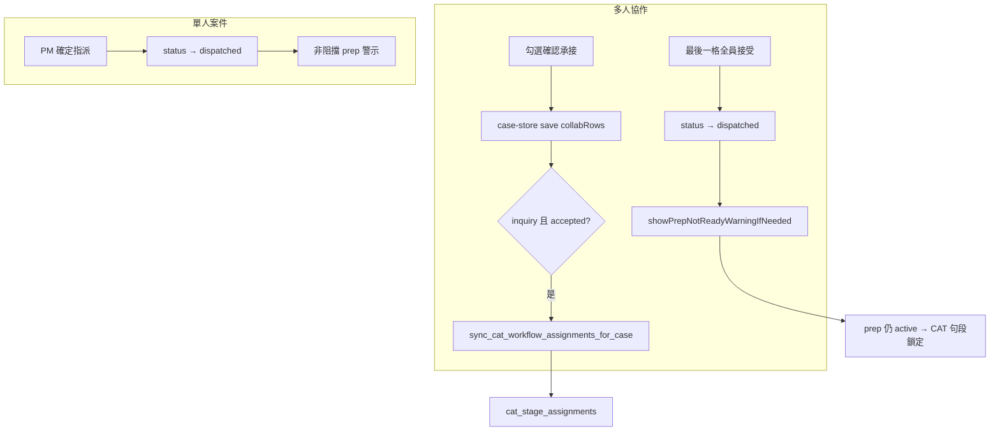

# Prep 閘門移除 + LMS 派出與 CAT 準備狀態解耦（2026-06）

> **狀態**：**已驗收**（2026-06-23）。  
> **Git**：`d247d9a` — `fix(workflow): decouple LMS dispatch from CAT prep gate`  
> **Migration**：`20260623131500_cat_workflow_prep_dispatch_decouple.sql`（曾草稿 `20260623120000`，與同日 `cat_ai_project_settings_batch_introduction` 撞版後更名）  
> **上層**：Phase B-6 [`CAT_WORKFLOW_PREP_AND_REVIEW_B6_SPEC_2026-06.md`](./CAT_WORKFLOW_PREP_AND_REVIEW_B6_SPEC_2026-06.md) §4.3 派出閘門（**本變更取代阻擋式閘門**）。  
> **關聯**：Workflow 同步 [`20260615120000_fix_collab_row_id_text.sql`](../supabase/migrations/20260615120000_fix_collab_row_id_text.sql)；[`src/stores/case-store.ts`](../src/stores/case-store.ts)。

---

## 1. 問題摘要

| # | 症狀 | 根因 |
|---|------|------|
| A | 多人案件最後一格「確認承接」失敗，勾選彈回；toast「無法更新為已派出」 | `CaseDetailPage` 在 `allAccepted` 時呼叫 `assertCaseLinkedFilesPrepReady`，gate 失敗則 **不執行 `save`** |
| B | 非最後一格「確認承接」後 CAT 無段落指派 | `sync_cat_workflow_assignments_for_case` 僅在案件 → `dispatched` 時由 `case-store` 觸發 |
| C | 單人「確定指派」被 prep 閘門擋下 | `handleFinalize` 同樣呼叫 `assertCaseLinkedFilesPrepReady` |
| D | SQL 同步未過濾 `accepted` | 多人路徑僅看譯者名稱，未勾選承接的列也可能建指派 |

**CAT 工具端**（準備中句段鎖定、`禁止編輯，檔案準備中` tooltip）**已符合預期**，本次不修改 `cat-tool/`。

---

## 2. 產品決策（2026-06-23）

| # | 議題 | 定案 |
|---|------|------|
| 1 | LMS 派出 vs CAT prep | **完全解耦**：派出不將 prep 改為完成；prep 也不阻擋派出 |
| 2 | 派出前提示 | **非阻擋** toast：列出尚未準備完成的 CAT 檔名；PM／譯者文案分開 |
| 3 | 多人「確認承接」 | **每格**勾選後即同步 CAT 段落指派（`case-store` 在 `inquiry` + `accepted` 觸發 sync） |
| 4 | SQL 過濾 | 多人同步僅處理 `collab_rows[].accepted = true` 的列 |
| 5 | `cat-prep-dispatch-gate.ts` | **刪除**；RPC `cat_case_linked_files_not_prep_ready` 改由 `CaseDetailPage` 直接呼叫（僅警示用） |

---

## 3. 實作觸點

| 檔案 | 變更 |
|------|------|
| [`supabase/migrations/20260623131500_cat_workflow_prep_dispatch_decouple.sql`](../supabase/migrations/20260623131500_cat_workflow_prep_dispatch_decouple.sql) | `sync_cat_workflow_assignments_for_case` 多人路徑加 `accepted` 過濾 |
| [`src/stores/case-store.ts`](../src/stores/case-store.ts) | `shouldSyncCatWorkflowAssignments`：`inquiry` 且 `collabRows` 含 `accepted` 時觸發 |
| [`src/pages/CaseDetailPage.tsx`](../src/pages/CaseDetailPage.tsx) | 移除 prep gate；新增 `showPrepNotReadyWarningIfNeeded`；派出後非阻擋 toast |
| ~~`src/lib/cat-prep-dispatch-gate.ts`~~ | 已刪除 |

### 3.1 非阻擋 toast 文案

**PM 以上：**

> 以下 CAT 檔案尚未標記準備完成：{檔名}。指派已完成，但譯者開啟後將看到句段鎖定。確認就緒後，請至 CAT 工具標記準備完成。

**譯者：**

> 本案 CAT 作業檔尚未準備完成，開啟後句段為鎖定狀態，暫時無法編輯。如有疑問，請通知專案管理人員至 CAT 工具完成標記。

### 3.2 `sync_cat_workflow_assignments_for_case` 行為（不變部分）

案件為 `draft`／`inquiry`／`dispatched` 時仍呼叫 `cat_revert_workflow_stages_for_case`（translate → active、review → pending），**不修改 prep 步驟**。故派出後 prep 仍為 `active`，譯者開檔句段鎖定。

---

## 4. 驗收步驟

1. **多人／準備中／最後一格**：全員勾選「確認承接」→ 案件「已派出」→ 出現警示 toast（不阻擋）→ 勾選不彈回。
2. **多人／個別承接**：非最後一格勾選後，CAT 儀表板該譯者已見段落指派。
3. **單人／確定指派**：CAT 仍準備中，PM 可成功派出 → 警示 toast。
4. **accepted 過濾**：協作列已填譯者但未勾選承接 → CAT 無該人指派。
5. **CAT 鎖定**：派出後 prep 仍 active，非 PM 開檔全句段 tooltip「禁止編輯，檔案準備中」。

---

## 5. 開發紀錄（摘要）

| 日期 | 項目 |
|------|------|
| 2026-06-23 | 調查 B-6 prep 閘門與理想體驗落差；定案解耦 + 即時 sync + 非阻擋 toast |
| 2026-06-23 | 實作 migration `20260623131500`；`case-store`／`CaseDetailPage`；刪除 `cat-prep-dispatch-gate.ts`；push `d247d9a` |
| 2026-06-23 | 專案擁有者驗收通過（§9） |

---

## 6. 問題發現與調查過程

### 6.1 觸發回報

專案擁有者在**多人協作案件**上操作：協作列逐格勾選「確認承接」，當最後一格勾選時，若連結的 CAT 檔仍處於「檔案準備中」，畫面出現紅色 toast：

- 標題：「無法更新為已派出」
- 內文：「以下 CAT 檔案尚未標記準備完成：Pulse Localization - For translators.xlsx_zho-TW.mqxliff」

同時最後一格的勾選**彈回**（未儲存），案件狀態仍停留在「詢案」。

### 6.2 程式追蹤

[`CaseDetailPage.tsx`](../src/pages/CaseDetailPage.tsx) 多人協作 `CollaborationTable` 的 `onChange` 在 `isInquiry && allAccepted` 時：

1. 先 `await assertCaseLinkedFilesPrepReady`（[`cat-prep-dispatch-gate.ts`](../src/lib/cat-prep-dispatch-gate.ts) → RPC `cat_case_linked_files_not_prep_ready`）
2. gate 失敗則 `return`，**不呼叫 `save(updates)`**
3. 因此 `collabRows` 的最後一筆 `accepted: true` 也沒寫入資料庫

單人案件 `handleFinalize`（「確定指派」）使用同一 gate，同樣會阻擋 `status → dispatched`。

### 6.3 延伸發現（調查對話中釐清）

| 發現 | 說明 |
|------|------|
| 譯者「承接本案」無 gate | 單人詢案譯者自行承接時直接 `save({ status: dispatched })`，從未檢查 prep → 與 PM「確定指派」行為不一致 |
| 非最後一格不 sync | [`case-store.ts`](../src/stores/case-store.ts) 的 `shouldSyncCatWorkflowAssignments` 僅在變更為 `dispatched` 等條件觸發；詢案期間個別承接不會建立 `cat_stage_assignments` |
| SQL 未過濾 `accepted` | [`sync_cat_workflow_assignments_for_case`](../supabase/migrations/20260615120000_fix_collab_row_id_text.sql) 多人迴圈只看 `translator` 非空，未勾選承接的列也可能建指派 |
| 無「先勾選後填名」時間差 | [`CollaborationTable.tsx`](../src/components/CollaborationTable.tsx) 勾選時 `accepted: true` 與 `translator`（空則填登入者）在同一 `updateRow` 原子寫入 |
| CAT 準備中鎖定已正確 | [`cat-tool/app.js`](../cat-tool/app.js) `computeSegmentEditForbidden` 在 `_isFilePrepIncomplete` 時對非 PM+ 回傳唯讀，tooltip「禁止編輯，檔案準備中」 |

### 6.4 與初版 B-6 設計的落差

B-6 §4.3 原訂「派出前每檔 prep 須 completed，否則阻擋」。實際產品需求改為：

- LMS 案件狀態與 CAT prep **互不阻擋**
- 派出後譯者仍可開檔，但 prep 進行中時句段鎖定（既有 CAT 行為）
- PM 在派出時收到**提醒**而非**封鎖**

---

## 7. 產品決策演進（對話紀錄摘要）

| 議題 | 初版 B-6（2026-06-16） | 2026-06-23 定案 |
|------|------------------------|-----------------|
| prep 與 LMS 派出 | 派出前必須 prep 完成（阻擋） | 完全解耦；派出不改 prep 狀態 |
| 提示方式 | 阻擋 + `variant: destructive` toast | 非阻擋警示 toast（PM／譯者文案分開） |
| 多人「確認承接」 | 全員接受後才批次 sync | **選 A**：每格 `accepted` 即 sync |
| SQL 多人同步 | 僅看譯者名稱 | 僅 `accepted = true` 的協作列 |
| `cat-prep-dispatch-gate.ts` | LMS 派出前必查 | 刪除；RPC 僅供派出後警示查詢 |

---

## 8. 實作細節

### 8.1 流程（解耦後）



### 8.2 LMS 前端

**[`CaseDetailPage.tsx`](../src/pages/CaseDetailPage.tsx)**

- 刪除 `import { assertCaseLinkedFilesPrepReady } from "@/lib/cat-prep-dispatch-gate"`
- 新增模組層 `showPrepNotReadyWarningIfNeeded(caseId, isPmOrAbove, toast)`：fire-and-forget 呼叫 RPC `cat_case_linked_files_not_prep_ready`，有結果則顯示非阻擋 toast
- `handleFinalize`：直接 `save({ status: dispatched })` + 成功 toast + prep 警示
- `allAccepted` 路徑：同步 `save(updates)`（含 `status: dispatched`），移除 async gate IIFE

**[`case-store.ts`](../src/stores/case-store.ts)**

擴充 `shouldSyncCatWorkflowAssignments`：

```ts
(nextStatus === "inquiry" &&
  partial.collabRows !== undefined &&
  Array.isArray(partial.collabRows) &&
  partial.collabRows.some((r) => r.accepted))
```

sync 在 DB `update` **成功後**執行，避免樂觀更新與 RPC 讀取競態。個別「確認承接」僅需 `save(updates)`，由 store 觸發 sync，無需在 `CaseDetailPage` 手動呼叫。

### 8.3 資料庫

**[`20260623131500_cat_workflow_prep_dispatch_decouple.sql`](../supabase/migrations/20260623131500_cat_workflow_prep_dispatch_decouple.sql)**

多人協作兩處 `FOR v_row IN SELECT value FROM jsonb_array_elements(v_collab_rows)` 改為：

```sql
FOR v_row IN
  SELECT value FROM jsonb_array_elements(v_collab_rows) AS t(value)
  WHERE coalesce((value->>'accepted')::boolean, false)
LOOP
```

涵蓋「收集 valid_collab_row_ids」與「寫入翻譯段落指派」兩段迴圈。

### 8.4 部署備註

- 首次 migration 檔名 `20260623120000` 與同日 `cat_ai_project_settings_batch_introduction` 版本撞鍵，改為 `20260623131500` 後 `supabase db push` 成功。

---

## 9. 驗收紀錄（2026-06-23）

**結論**：專案擁有者確認**全部通過**。

| # | 驗收項（§4） | 結果 | 備註 |
|---|-------------|------|------|
| 1 | 多人／最後一格／準備中 | 通過 | 不再出現「無法更新為已派出」；勾選保留；出現非阻擋警示 |
| 2 | 多人／個別承接即時指派 | 通過 | 非最後一格勾選後 CAT 可見對應指派 |
| 3 | 單人／確定指派 | 通過 | prep 中仍可派出；有警示 toast |
| 4 | accepted 過濾 | 通過 | 未勾選承接的列不建 CAT 指派 |
| 5 | CAT 句段鎖定 | 通過 | 派出後 prep 仍 active；非 PM tooltip 正確 |

### 9.1 本次未改範圍（驗收時確認仍符合預期）

- CAT 工具 `computeSegmentEditForbidden`、PM「標記準備完成」、prep 步驟狀態機不變
- 單人譯者「承接本案」仍**不**顯示 prep 警示 toast（與 PM「確定指派」略有差異；屬既有行為，見 §10）

---

## 10. 維護邊界

| 項目 | 說明 |
|------|------|
| B-6 §4.3 | 「派出閘門」阻擋邏輯已由本文件取代；prep 步驟、§4.4 編輯鎖、PM 標記準備完成仍有效 |
| RPC 保留 | `cat_case_linked_files_not_prep_ready` 僅供派出後警示，不再作為阻擋條件 |
| 未來擴充 | 若需讓譯者「承接本案」也顯示 prep 警示，於 `handleAcceptCase` 補呼叫 `showPrepNotReadyWarningIfNeeded` 即可 |
| PM 代勾空列 | 協作列譯者欄空白時 PM 勾選承接，仍會自動填入 PM 自己的名字（既有行為，非本次引入） |
