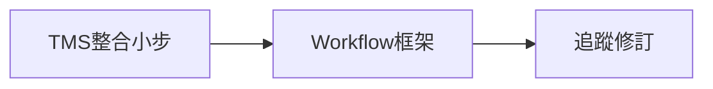

# CAT 工作階段（Workflow）、追蹤修訂與 TMS 整合 — 大計畫（2026-06）

> 本文件整理 **2026-06-10** 產品討論與程式庫可行性評估，作為後續分階段落地的**總規劃**。已落地項目會標註 commit 與專項文件；未落地項目標為**規劃中**，實作前應另開細規格或子文件。

---

## 一、願景摘要

讓 1UP CAT 支援類似專業 CAT／TMS 的**多階段翻譯流程**（例如：翻譯 → 審稿 → 定稿），並能：

1. 依專案或檔案**自訂步驟**（可增減）。
2. 各步驟**指派人員**，負責人可標記「完成」。
3. 產出**階段間追蹤修訂**（檢視 diff、評註、匯出）。
4. 與 **LMS 案件**更深整合（匯入連結、案件頁快速開檔）。

---

## 二、現況盤點（2026-06-10 基線）

### 2.1 可延伸的既有能力

| 能力 | 位置 | 說明 |
|------|------|------|
| 檔案／句段集指派四態 | `cat_file_assignments.status`、`cat_view_assignments.status` | `assigned` → `in_progress` → `completed`／`cancelled` |
| 句段鎖定 | `isLocked`／`isLockedUser`／`isLockedSystem`、`computeForbiddenForRole()` | 目前主要服務 **mqxliff** T／R1／R2 |
| memoQ 確認身分 | `confirmation_role`、`original_role`、`default_mq_role` | 格式限定，非通用 workflow |
| 討論串 | Dexie `guidelineReplies` | 可參考評註回覆 UI |
| Excel 匯出 | `app.js` EXPORT ENGINE | 追蹤修訂匯出可延伸 |
| CAT ↔ LMS 案件綁定 | `cat_files.related_lms_case_id`、專案工具列「連結案件」 | 單檔粒度 |
| 案件→CAT 指派同步 | `sync_cat_file_assignments_for_case` | 案件「已派出」時新增 `cat_file_assignments` |

### 2.2 主要缺口

- **無**通用 workflow 引擎（無 `cat_workflow_stages` 等定義表）。
- **無**句段層級「屬於哪個步驟／哪位譯者」的通用模型（句段集僅 view 層指派）。
- `segment_revision` 為**樂觀鎖計數器**，不是版本歷史。
- **雙模式成本**：離線 Dexie（`db.js`）與 Supabase（migration + `cat-cloud-rpc.ts`）須同步設計。

---

## 三、需求對照與可行性

| # | 需求 | 可行性 | 複雜度（AI 施作） | 狀態 |
|---|------|--------|-------------------|------|
| 1 | 專案／檔案可自訂步驟（增減） | 高 | 中 | 規劃中 |
| 2 | 各步驟指派人員；負責人標記完成 | 高 | 中 | 規劃中 |
| 2-i | 多人同檔 UI（階段名、進度、句段歸屬提示等） | 高 | 低～中 | 規劃中 |
| 2-ii | 非自己負責句段鎖定（可檢視全檔、僅編輯己責） | 高 | 中 | 規劃中 |
| 3 | 階段間追蹤修訂檔案 | 高 | **高** | 規劃中 |
| 3-i | 檔案清單按鈕開啟追蹤修訂檢視 | 高 | 低～中 | 規劃中 |
| 3-ii | 顯示各階段負責人 + diff 呈現 | 高 | 中高 | 規劃中 |
| 3-iii | 可切換是否顯示追蹤標記 | 高 | 低 | 規劃中 |
| 3-iv | 第二階段起：問題類型、嚴重性、備註 | 高 | 中 | 規劃中 |
| 3-v | 前階段人員回覆後階段評註 | 高 | 低～中 | 規劃中 |
| 3-vi | 匯出 Excel／htm | 高 | 中～中高 | 規劃中 |
| 4 | TMS／CAT 進一步整合 | 高 | 低～中 | **部分落地** |
| 4-i | 匯入時詢問連結案件（可跳過） | 高 | 低 | **已落地** `49db7c2` |
| 4-ii | LMS 案件頁「1UP CAT」工具區子區塊與深連結 | 高 | 低～中 | **進行中** |

---

## 四、分階段實作建議

### 建議順序

1. **Phase A — TMS 整合（低投入、高價值）**
2. **Phase B — Workflow 框架（步驟定義 + 指派 + 鎖定）**
3. **Phase C — 追蹤修訂（快照、diff、評註、匯出）**

### 4.1 Phase A：TMS 整合（進行中）

| 子項 | 說明 | 狀態 | 文件／commit |
|------|------|------|----------------|
| **A-1** 一般匯入選填連結案件 | 批次匯入末尾 `showCasePickerForImport()`；`runBatchImport` 傳 `caseInfo`；Excel／XLIFF／PO 建檔後 `updateFile` | **已落地** | [`CAT_IMPORT_CASE_LINK_2026-06.md`](./CAT_IMPORT_CASE_LINK_2026-06.md)；`49db7c2` |
| **A-2** Google Sheet 匯入改為選填 | `btnGsImportStart`：取消案件選擇器＝跳過連結、繼續匯入（與 A-1 同 UX） | **進行中** | 見 [`CAT_IMPORT_CASE_LINK_2026-06.md`](./CAT_IMPORT_CASE_LINK_2026-06.md) |
| **A-3 + A-4** 案件頁「1UP CAT」工具區子區塊 | 「工具」區頂部；查 `cat_files WHERE related_lms_case_id = caseId`（**全部**已連結檔）；PM「1UP CAT」按鈕可新增／變更／移除；譯者僅檔名深連結；與 CAT「連結案件」**雙向同步** | **進行中** | `src/components/case/CaseCatToolsPanel.tsx`、`CaseDetailPage.tsx` |
| **A-5** 未受派譯者全檔唯讀 | 團隊版非 PM+ 且未在 `cat_file_assignments` 受派 → 每格 `locked-system` + `禁止編輯：未受指派，無法編輯檔案`（不用頂部橫幅）；PM+ 豁免 | **進行中** | `cat-tool/app.js`：`resolveFileUnassignedReadOnly` |

### 4.2 Phase B：Workflow 框架（規劃中）

#### 資料模型（草案）

| 表／store | 用途 |
|-----------|------|
| `cat_workflow_templates` | 專案級步驟範本（名稱、順序、可否跳過） |
| `cat_file_workflow_stages` | 某檔案實際套用的步驟實例 |
| `cat_stage_assignments` | `file_id` + `stage_id` + `assignee_user_id` + `status`（延伸現有四態） |
| （可選）`cat_segment_stage_scope` | 句段範圍指派（A 負責 1–100 行等） |

#### 程式觸點（草案）

- 鎖定：重構 `computeForbiddenForRole()` → 通用 `computeSegmentEditForbidden(seg, userContext)`，來源含 stage 指派。
- UI：專案檔案清單顯示「目前步驟／負責人／進度」；編輯器狀態列顯示階段名；工具列「標記本步驟完成」。
- 雙模式：`db.js` v23+ 新 store；Supabase migration + `cat-cloud-rpc.ts`。

#### 產品決策待確認

- 步驟定義綁在**專案範本**還是**每檔案**？
- 同一步驟是否允許**多人**並行（各負責不同句段範圍）？
- 與現有 **mqxliff T/R1/R2** 如何共存（僅 mqxliff 檔？或逐步取代？）

### 4.3 Phase C：追蹤修訂（規劃中）

#### 核心機制

- **快照**：步驟交接時寫入 `cat_segment_stage_snapshots`（`file_id`, `stage_id`, `segment_id`, `target_text`, `target_tags`, `assignee_user_id`, `snapshotted_at`）。
- **Diff**：兩快照間文字 diff；需 **tag-aware** renderer（不可把 tag XML 當純文字 diff）。
- **評註**：`cat_segment_annotations`（`issue_type`, `severity`, `note`）；回覆可沿用 `parentReplyId` 模式。

#### UI／匯出

| 子項 | 說明 |
|------|------|
| C-1 | 檔案清單「追蹤修訂」按鈕 → `viewRevisionTrack` 或 modal |
| C-2 | 顯示各階段負責人 + 刪除線／底線 diff |
| C-3 | 「顯示最終版本」／「顯示修訂標記」切換 |
| C-4 | 審稿人評註（問題類型、嚴重性、備註） |
| C-5 | 譯者回覆評註 |
| C-6 | 匯出 Excel（欄位：原文、各階段譯文、評註） |
| C-7 | 匯出 htm（self-contained HTML；新渲染器） |

#### 建議交付切片

1. 快照 + 基礎並排檢視（無評註）
2. 評註與回覆
3. Excel 匯出
4. htm 匯出

---

## 五、與現有功能的關係

| 現有功能 | 與本計畫關係 |
|----------|----------------|
| 句段集 `cat_views` + `cat_view_assignments` | 可並存；句段集偏「子集協作」，workflow 偏「全檔階段」 |
| memoQ `confirmation_role` | mqxliff 專用；workflow 應為格式中立層 |
| `sync_cat_file_assignments_for_case` | 案件派出時同步譯者；未來可擴充「依步驟寫入 stage assignment」 |
| 批次匯入精靈 | 已加匯入連結案件；見 [`CAT_BATCH_IMPORT_WIZARD_SESSION.md`](./CAT_BATCH_IMPORT_WIZARD_SESSION.md) |

---

## 六、風險與限制

1. **雙模式**：每項新表／欄位需 Dexie + Supabase + RPC 三處一致。
2. **追蹤修訂與 tag**：diff 與匯出是工程量最大風險點。
3. **效能**：大檔全量快照與 diff 需考慮分頁或 lazy load。
4. **權限**：LMS 案件頁查 CAT 檔需確認 RLS 與譯者／PM 可見範圍。

---

## 七、文件與程式索引

| 主題 | 路徑 |
|------|------|
| 本大計畫 | 本文件 |
| 匯入連結案件（已落地） | [`CAT_IMPORT_CASE_LINK_2026-06.md`](./CAT_IMPORT_CASE_LINK_2026-06.md) |
| 批次匯入精靈 | [`CAT_BATCH_IMPORT_WIZARD_SESSION.md`](./CAT_BATCH_IMPORT_WIZARD_SESSION.md) |
| LMS 殼層 UX | [`LMS_CAT_SHELL_SIDEBAR_UX_2026-05.md`](./LMS_CAT_SHELL_SIDEBAR_UX_2026-05.md) |
| 功能路徑 | [`CODEMAP.md`](./CODEMAP.md) |
| 案件頁 | `src/pages/CaseDetailPage.tsx` |
| CAT 嵌入 | `src/pages/CatToolPage.tsx`、`src/lib/cat-cloud-rpc.ts` |

---

## 八、修訂紀錄

| 日期 | 內容 |
|------|------|
| 2026-06-10 | 初稿：可行性評估、三階段路線圖、需求對照表；收錄 `49db7c2` 匯入連結案件 |
