狀態：規劃中

# 1UP 工程改善主計畫

日期：2026-07-03  
維護：本檔為 Fable 5 體檢報告落地後的**權威執行與追蹤文件**；工項細節以引用來源為準，本檔記錄已拍板決策、四階段順序與進度。

---

## 1. 背景與引用來源

2026-07-03，Fable 5 針對本 repo（React TMS、`cat-tool/`、Supabase `1UP TMS`）完成程式體檢，產出 R1–R7（規則）與 W1–W8（工程）共十五項改善建議。

**引用來源（原文未改動）**：[1UP_CODE_HEALTH_AUDIT_FABLE5_2026-07-03.md](1UP_CODE_HEALTH_AUDIT_FABLE5_2026-07-03.md)

本主計畫依專案擁有者與 Cursor 對談拍板，將報告第四部分的線性順序調整為**四階段**執行路線；細部規格、SQL 草案、驗收斷言仍以引用來源第二、三部分為準。

---

## 0. 合併閘門（Fable 5 覆核 2026-07-03）

| 項目 | 說明 |
|------|------|
| **現況（merge 前）** | `main` @ `4f5e79d`；工作分支 `cursor/cat-nav-phase-r-shared-explicit-centering` 超前 **11 commits**（CAT Phase R 捲動 3 + 工程改善 8） |
| **風險** | W5 三個 migration **已套用**遠端 DB，但 migration 檔與前端 W3 變更僅在工作分支 → repo 與 DB 脫鉤 |
| **決策** | **整條工作分支 merge 進 `main`**（專案擁有者確認） |
| **merge 後預期** | Vercel 部署 W3 輪詢優化 + 規則檔 + Playwright spec；migration 檔進版控（`IF NOT EXISTS`／`DROP IF EXISTS` 可 idempotent 對齊已套用 DB） |
| **merge 狀態** | **已完成 2026-07-03** — merge commit `8d0dd74`（`4f5e79d..8d0dd74`）；migration 檔已進 `main`、與已套用 DB 對齊，repo/DB 脫鉤風險解除 |

**分支策略（merge 後強制）**：一工項一分支，從最新 `main` 切出；禁止 unrelated 工項堆在同一 feature 分支。詳見 [`.cursor/rules/architecture.mdc`](../.cursor/rules/architecture.mdc) §7。

---

## 2. 已拍板決策（對談紀錄）

以下為 2026-07-03 對談確認，後續執行不得與此衝突：

| 議題 | 決策 |
|------|------|
| **推送前品質閘門（R2）** | 目標為 lint／typecheck／test 三關全上；**先建測試基礎**，由代理分批安排，不強求一次到位。三關在 vitest 與第一批劇本就緒後才正式列為推送門檻。 |
| **資料庫三修（W5）** | **現在做**；挑低流量時段執行 migration；驗收須 **PM（威儀）＋譯者** 雙角色確認權限與資料可見性不變。 |
| **五模組整併（W1）＋列表瘦身（W4）＋表格 hooks（W2）** | **等自動測試機器人（階段三）建好再開工**；每遷移一項單獨 commit、單獨驗收。 |
| **AGENTS.md 瘦身（R5）** | **最後做**；避免中途大量引用路徑失效。 |
| **`app.js` 只出不進（W7）** | **認可為長期原則**；不影響現有效能與體驗，新功能寫 `cat-tool/js/`，禁止再往 `app.js` 堆功能。 |
| **巨型頁面拆分（W8）** | 碰到才拆，隨日常開發執行，禁止全頁重寫。 |
| **分支策略（Fable 5 覆核後）** | **一工項一分支，從最新 `main` 切出**；禁止在同一 feature 分支堆不相關工項（避免再現本次 11 commits 混雜）；migration 套用 DB 後同一 PR/merge 必含 `supabase/migrations/*.sql`。詳見 [`architecture.mdc`](../.cursor/rules/architecture.mdc) §7。 |

---

## 3. 四階段執行計畫

```mermaid
flowchart LR
  subgraph phase1 [階段一]
    R1[R1 規則檔]
    R7[R7 小修]
    R346[R3 R4 R6 新規則]
  end
  subgraph phase2 [階段二]
    W3[W3 輪詢]
    W5[W5 資料庫]
  end
  subgraph phase3 [階段三]
    Vitest[vitest 基礎]
    W6[W6 CI]
    PW[Playwright]
    R2[R2 三關生效]
  end
  subgraph phase4 [階段四]
    W1[W1 store 工廠]
    W4[W4 列表瘦身]
    W2[W2 table-views]
  end
  subgraph tail [收尾與長期]
    R5[R5 手冊瘦身]
    W7[W7 app.js 凍結]
    W8[W8 頁面拆分]
  end
  phase1 --> phase2 --> phase3 --> phase4 --> tail
```

### 階段一：零風險整理（建立規範）

使用者無感；為後續工項打好規則地基。可一次對話完成。

| 編號 | 白話說明 | 風險 | 驗收 |
|------|----------|------|------|
| **R1** | 把 `claude-ai-acceptance-slack.mdc` 納入版控（本機已有、未追蹤） | 無 | 檔案在 repo 中、`AGENTS.md` 引用可解析 |
| **R7** | 修 `xliff-tag-export.mdc` 重複「### 6.」；新增根目錄 `CLAUDE.md` | 無 | 規則檔編號正確；`CLAUDE.md` 三行入口存在 |
| **R3** | 新增 `architecture.mdc`（`app.js` 凍結、store 工廠、列表欄位、檔案行數警戒等） | 無 | 規則檔存在且 `alwaysApply: true` |
| **R4** | 新增 `testing.mdc`（修 bug 必留回歸測試、Playwright 測試模式、寫入來源追蹤法） | 無 | 規則檔存在且 `alwaysApply: true` |
| **R6** | 新增 `docs-lifecycle.mdc`（文件狀態標記、封存、DEVLOG 彙整） | 無 | 規則檔存在；本檔已標「狀態：規劃中」 |

### 階段二：立即有感的效能修（低風險）

| 編號 | 白話說明 | 風險 | 驗收 |
|------|----------|------|------|
| **W3** | 輪詢備援：分頁在背景時暫停查詢；回前景立即補跑；預設 interval 拉長 | 極低 | 開發者工具 block WebSocket 後 30–60 秒內畫面仍回補；背景分頁不再狂打 DB |
| **W5-A** | 外鍵索引（33→0）、RLS 裸 `auth.uid()` 快取（2→0）、**billing 表同命令 permissive policy 合併**（`invoice_fees`／`invoices`） | 低 | 對應 advisors 項歸零；譯者寫入面 RLS 以 DB 層模擬驗證（本人 ALLOW／他人 DENY，見 §4） |
| **W5-B**（另案） | CAT 四表（`cat_annotation_options`／`cat_assignments`／`cat_file_assignments`／`cat_view_assignments`）**ALL policy 與特定命令 policy 重疊** | 中（安全語意） | 需拆分 ALL 語意後才合併；本次**不做**、不宣稱 advisors 全歸零 |

**W5 執行注意**：migration 分三檔；外鍵索引用一般 `CREATE INDEX IF NOT EXISTS`（比照既有 `perf_indexes.sql`，可單 transaction）。由代理 `supabase db push`，離峰執行。**W5-B 為安全語意變更，維持另案**，因此 advisors 的 multiple-permissive 不會完全歸零屬預期。

### 階段三：建立自動測試機器人（階段四之前置）

**本階段完成前，不得啟動 W1／W2。** 分批執行，順序如下：

1. **vitest 基礎**：確認 `npm run test` 可跑；補第一批單元測試（優先：tag pipeline、merge、mapping 等純函式；比照 `ai-agent-bridge.clientInfo.test.ts`）。
2. **W6 CI（第一版）**：新增 `.github/workflows/ci.yml`；**先** lint + typecheck；vitest 有劇本後加入 `npm run test`。
3. **Playwright**：測試模式環境（見 [CAT_LMS_TEST_MODE_IMPL_PLAN_2026-06.md](CAT_LMS_TEST_MODE_IMPL_PLAN_2026-06.md)）；固定 fixture；e2e 不穩時改 nightly schedule，不擋 push。
4. **R2 正式生效**：三關（lint／typecheck／test）全過才可推送；更新 `AGENTS.md` 推送慣例。

| 編號 | 白話說明 | 風險 | 驗收 |
|------|----------|------|------|
| **W6** | GitHub Actions：push／PR 自動跑檢查 | 無（e2e 可降級） | CI 綠燈；失敗時阻擋合併或推送（依設定） |
| **R2** | 推送前三關門檻寫入 `AGENTS.md` | 無 | 代理推送前實際跑過三關 |

### 階段四：資料層大掃除（中風險，機器人保護）

**前置條件**：階段三 Playwright ＋ vitest 基礎可用。

| 編號 | 白話說明 | 風險 | 驗收 |
|------|----------|------|------|
| **W1** | `createEntityStore` 工廠；五 store 逐一遷移（順序：internal-notes → invoice → client-invoice → fee → case） | 中 | 每遷一個：列表、新增、改欄位、雙分頁 realtime、斷 WS 輪詢回補；Playwright 綠燈 |
| **W4** | 列表 `select("*")` 改欄位常數；詳情頁再抓全欄 | 低 | 列表載入變快；詳情與 realtime 行為不變；併入 W1 最省力 |
| **W2** | 四份 `use-*-table-views` 收斂到 `use-table-views` | 中 | 各列表頁篩選／排序／儲存檢視正常；Playwright 綠燈 |

### 收尾與長期原則

| 編號 | 白話說明 | 時機 | 驗收 |
|------|----------|------|------|
| **R5** | `AGENTS.md` 文件索引搬到 `docs/INDEX.md` | 階段四完成後 | 手冊精簡；grep 修完所有引用 |
| **W7** | `cat-tool/app.js` 只出不進；修到時順勢搬 `cat-tool/js/` | 持續 | 新功能不在 `app.js` 新增；搬遷 commit 與行為 commit 分開 |
| **W8** | 巨型頁面碰到才拆（`CaseDetailPage` 等） | 持續 | 拆分 commit 與功能 commit 分開 |

---

## 4. 進度追蹤

完成每項後更新本節：狀態改為「已驗收」並補 commit 短碼。狀態詞彙：規劃中｜實作中｜已落地待驗收｜已驗收。

### 階段一

- **R1** — 狀態：已驗收（檔案已納入版控）— commit：`f17cd70`（`claude-ai-acceptance-slack.mdc`）
- **R7** — 狀態：已驗收（編號已修、`CLAUDE.md` 存在）— commit：`f17cd70`
- **R3** — 狀態：已驗收（`architecture.mdc` `alwaysApply: true`）— commit：`f17cd70`
- **R4** — 狀態：已驗收（`testing.mdc` `alwaysApply: true`）— commit：`f17cd70`
- **R6** — 狀態：已驗收（`docs-lifecycle.mdc` 存在）— commit：`f17cd70`

### 階段二

- **W3** — 狀態：已落地待驗收 — commit：`f20ee6c`（背景分頁暫停輪詢、回前景補跑、預設 30s）
- **W5-1 外鍵索引** — 狀態：已驗收（DB 已套用，unindexed FK 由 33 → 0）— commit：`f20ee6c`
- **W5-2 裸 auth.uid() 快取** — 狀態：已驗收（bare policy 由 2 → 0）— commit：`f20ee6c`
- **W5-3 合併 billing permissive policy** — 狀態：**已驗收（DB 層 RLS 模擬，2026-07-03）** — migration commit：`f20ee6c`；驗證腳本：[`supabase/tests/w5_billing_rls_check.sql`](../supabase/tests/w5_billing_rls_check.sql)
  - 驗證結果（模擬「譯者一」authenticated 身分）：本人請款 `INSERT` = **ALLOW**、冒名他人請款 `INSERT` = **DENY**（合併後 `invoices_insert` WITH CHECK 正確擋下）；讀取為同 env 全體開放（可見他人請款 11 筆，非 0）。**2026-07-03 擁有者裁定此讀取開放為錯誤（非設計），須修復——修復工項見 §9「W10 譯者讀取收緊」。**
  - **更正先前紀錄**：`2abac01`／`9a4e5af` 所稱「Playwright 雙角色 5/5 通過」**不可信**——測試模式的假人換人（`dev-switch-user`→`verifyOtp`）在自動化環境靜默失效，實際全程以假執行長（管理員）身分執行，並未真正切到譯者。故 W5-3 改以上述 DB 層模擬結案；UI 雙角色驗收待階段三修好換人流程後補（見下）。
- **W5-B CAT 四表（另案）** — `cat_annotation_options`／`cat_assignments`／`cat_file_assignments`／`cat_view_assignments` 為 ALL 與特定命令 policy 重疊，需拆分 ALL 語意（安全語意變更），本次不處理，待評估。

### 階段三

- **vitest 基礎** — 狀態：規劃中 — commit：—
- **W6** — 狀態：規劃中 — commit：—
- **Playwright 測試模式** — 狀態：規劃中 — commit：—
- **R2** — 狀態：規劃中 — commit：—

### 階段四

- **W1**（internal-notes）— 狀態：規劃中 — commit：—
- **W1**（invoice）— 狀態：規劃中 — commit：—
- **W1**（client-invoice）— 狀態：規劃中 — commit：—
- **W1**（fee）— 狀態：規劃中 — commit：—
- **W1**（case）— 狀態：規劃中 — commit：—
- **W4** — 狀態：規劃中 — commit：—（併入 W1 時標註）
- **W2** — 狀態：規劃中 — commit：—

### 收尾與長期

- **R5** — 狀態：規劃中 — commit：—
- **W7** — 狀態：規劃中（長期原則）— commit：—
- **W8** — 狀態：規劃中（長期原則）— commit：—

---

## 5. R／W 對照索引（程式觸點）

執行時可直接開啟下列路徑；細部規格見 [引用來源](1UP_CODE_HEALTH_AUDIT_FABLE5_2026-07-03.md)。

### 規則（R）

| 編號 | 主要觸點 |
|------|----------|
| R1 | [`.cursor/rules/claude-ai-acceptance-slack.mdc`](../.cursor/rules/claude-ai-acceptance-slack.mdc)（已納入版控 `f17cd70`）、[`AGENTS.md`](../AGENTS.md) |
| R2 | [`AGENTS.md`](../AGENTS.md)「推送慣例」、`package.json` scripts（階段三 R2 生效前尚未列為門檻） |
| R3 | [`.cursor/rules/architecture.mdc`](../.cursor/rules/architecture.mdc)（已建 `f17cd70`；分支策略見 §7） |
| R4 | [`.cursor/rules/testing.mdc`](../.cursor/rules/testing.mdc)（已建 `f17cd70`） |
| R5 | [`AGENTS.md`](../AGENTS.md)、待建 `docs/INDEX.md`（階段四後） |
| R6 | [`.cursor/rules/docs-lifecycle.mdc`](../.cursor/rules/docs-lifecycle.mdc)（已建 `f17cd70`） |
| R7 | [`.cursor/rules/xliff-tag-export.mdc`](../.cursor/rules/xliff-tag-export.mdc)、[`CLAUDE.md`](../CLAUDE.md)（已建 `f17cd70`） |

### 工程（W）

| 編號 | 主要觸點 | 備註 |
|------|----------|------|
| W1 | [`src/stores/case-store.ts`](../src/stores/case-store.ts)（第 39–45 行 in-flight 保護）、[`fee-store.ts`](../src/stores/fee-store.ts)、[`invoice-store.ts`](../src/stores/invoice-store.ts)、[`client-invoice-store.ts`](../src/stores/client-invoice-store.ts)、[`internal-notes-store.ts`](../src/stores/internal-notes-store.ts)；待建 `entity-store-factory.ts` | 後四者缺 optimistic 保護 |
| W2 | [`src/hooks/use-case-table-views.ts`](../src/hooks/use-case-table-views.ts)、[`use-client-invoice-table-views.ts`](../src/hooks/use-client-invoice-table-views.ts)、[`use-invoice-table-views.ts`](../src/hooks/use-invoice-table-views.ts)、[`use-internal-notes-table-views.ts`](../src/hooks/use-internal-notes-table-views.ts)、泛用 [`use-table-views.ts`](../src/hooks/use-table-views.ts) | |
| W3 | [`src/lib/realtime-poll.ts`](../src/lib/realtime-poll.ts)（已改：預設 30s、背景暫停、回前景補跑 `f20ee6c`） | 各 store 的 `pollIntervalMs` 仍可個別覆寫 |
| W4 | 上述五 store 的 `load*` 內 `select("*")`；比照 [`src/lib/cat-cloud-rpc.ts`](../src/lib/cat-cloud-rpc.ts) `CAT_FILE_LIST_COLUMNS` | |
| W5 | `supabase/migrations/`、Supabase Dashboard advisors | 前端零改動 |
| W6 | 待建 [`.github/workflows/ci.yml`](../.github/workflows/ci.yml) | 目前不存在 |
| W7 | [`cat-tool/app.js`](../cat-tool/app.js)、[`cat-tool/js/`](../cat-tool/js/)、[`cat-tool/index.html`](../cat-tool/index.html) | 凍結只出不進 |
| W8 | [`src/pages/CaseDetailPage.tsx`](../src/pages/CaseDetailPage.tsx)、[`TranslatorFeeDetail.tsx`](../src/pages/TranslatorFeeDetail.tsx)、[`CasesPage.tsx`](../src/pages/CasesPage.tsx) | 碰到才拆 |

---

## 6. 執行與回報慣例

- 每完成一項：commit → push → 回報 commit 短碼、變更摘要、預計體驗變更、白話驗收步驟（見 [`AGENTS.md`](../AGENTS.md)）。
- **R2 生效後**：推送前須過 lint／typecheck／test。
- **W5**：由代理執行 `supabase db push`；失敗時回報阻擋原因與需人工補步。
- **CAT 變更**：仍須 `npm run sync:cat` 並一併提交 `cat-tool` 與 `public/cat`。
- 本檔進度與引用來源衝突時，以**已拍板決策（§2）**與**本檔階段順序**為準；技術細節以 Fable 5 原文為準。

---

## 7. 相關文件

- [1UP_CODE_HEALTH_AUDIT_FABLE5_2026-07-03.md](1UP_CODE_HEALTH_AUDIT_FABLE5_2026-07-03.md) — Fable 5 體檢報告全文
- [CAT_LMS_TEST_MODE_IMPL_PLAN_2026-06.md](CAT_LMS_TEST_MODE_IMPL_PLAN_2026-06.md) — Playwright 測試模式
- [CAT_LARGE_FILE_VIRTUAL_SCROLL_NAV_DEVLOG_2026-07.md](CAT_LARGE_FILE_VIRTUAL_SCROLL_NAV_DEVLOG_2026-07.md) — 寫入來源追蹤法範例
- [CODEMAP.md](CODEMAP.md) — 功能與路徑對照（驗收後現況摘要寫入處）
- [DEPLOYMENT_CHECKLIST.md](DEPLOYMENT_CHECKLIST.md) — 部署與 migration 檢核

---

## 8. 觀察待排（團隊版大檔抽測，2026-07-03）

來源：Fable 5 於分支預覽（commit `9a4e5af`，含 `21af736`）以團隊版、測試模式（env=test）對 `Test_Big.mqxliff` 前 2000 句人工抽測 CAT 導覽。三項核心場景（Ctrl+Enter 確認跳行 delta=+7px、Ctrl+G 深跳 #1500 delta=+13px、深處點擊 scrollJump=0）全數通過，`+71px` 偏移在團隊版不重現。抽測同時發現三件不擋合併的項目：

| 編號 | 類型 | 內容 | 建議 / 追蹤 |
|------|------|------|-------------|
| **OBS-1** | 效能待排工項 | 團隊版 Ctrl+Enter 確認後，焦點停在原句約 **4.5 秒**才跳下一句（500ms 取樣：前 9 樣本停 #6，第 10 才落 #7）。離線版 Playwright 全綠不會暴露，疑為 team 模式確認寫入／workflow 副作用的同步等待。 | **先量測** team 模式 confirm 路徑哪一段在等網路（比照 [`testing.mdc`](../.cursor/rules/testing.mdc) §5 寫入來源追蹤法），再決定是否改為非同步。Phase S 待辦，見 [DEVLOG](CAT_LARGE_FILE_VIRTUAL_SCROLL_NAV_DEVLOG_2026-07.md)。 |
| **OBS-2** | UX 待評估 | PM 身分在「準備中」檔案按 Ctrl+Enter，「檔案準備中→準備完成？」閘門夾在確認流程中間（符合 B-6 設計，但 PM 自行編輯時體驗突兀）。 | 評估改為**非阻擋提示**（不打斷確認流）。 |
| **OBS-3** | 既有 backlog 複測 | 測試模式下 CAT 儀表板／專案清單「變更紀錄」仍顯示正式環境項目（`WIZA 260703A` 等，含操作者與時間）。 | 沿用 [CAT_LMS_TEST_MODE_IMPL_PLAN_2026-06.md](CAT_LMS_TEST_MODE_IMPL_PLAN_2026-06.md) §13.2 **FIX-1**（已補記 2026-07-03 複測仍在）。 |

**方法論註記**：OBS-1 是「自動化斷言通過 ≠ 體感合格」的實證——機器人只驗跳對／置中，不會嫌慢；真人／AI 實測才會。已據此補 [`testing.mdc`](../.cursor/rules/testing.mdc) 兩條規則。

---

## 9. W10 譯者讀取收緊（擁有者 2026-07-03 裁定）

**背景**：W5-3 驗收時記錄「譯者可見他人請款」為讀取開放；擁有者裁定此為**錯誤而非設計**，須收緊。分支 `cursor/translator-invoice-read-rls`（從 `main` 開，一題一支）。

### 9.1 範圍調查結果（動手前盤點）

**資料庫讀取政策現況**（5 表）：

| 表 | 現行 SELECT policy | 譯者實際可見 | 需修 |
|----|--------------------|--------------|------|
| `invoices` | `Authenticated users can read invoices`：`env = current_env()` | **全部**（同 env） | ✅ 收緊 |
| `invoice_fees` | `Authenticated users can read invoice_fees`：`env = current_env()` | **全部** | ✅ 收緊 |
| `fees` | `Authenticated users can read fees`：`env = current_env()` | **全部**（含他人 client_info 營收） | ✅ 收緊 |
| `client_invoices` | `Admins can select client_invoices`：`is_admin AND env` | 無（已限管理員） | ⛔ 已正確 |
| `client_invoice_fees` | `Admins can select client_invoice_fees`：`is_admin AND env` | 無 | ⛔ 已正確 |

**前端讀取路徑盤點**：

- **路由**：僅 `/settings` 以 `isAdmin` 擋（[`src/App.tsx`](../src/App.tsx) `SettingsRoute`）；`/invoices`、`/fees`、`/client-invoices`、`/cases` **對所有登入者開放**，譯者可進入。
- **列表載入靠 RLS**：`invoice-store`、`fee-store` 的 `load*()` 皆 `select("*").eq("env", …)`，**無使用者過濾**，完全依賴 RLS → 收緊 RLS 後自動只回本人＋管理員，前端零改動。
- **詳情頁**：`InvoiceDetailPage` 由 `useInvoice(id)` 讀 store 清單（RLS 過濾後），直開他人 URL → store 無該筆 → 自動擋。
- **無跨使用者聚合儀表板**：`/` 導向 `/cases`，無彙總全體金額的 dashboard；列表內合計會自然只反映 RLS 可見集合（即為所欲）。**風險註記（低）**：故不需分批。
- **Realtime**：`invoice-store` 收到事件一律 `loadInvoices()` 重查（RLS 過濾）→ 安全；`fee-store` 的 postgres_changes handler **直接套用 payload.new**（非重查），依賴 Supabase Realtime 對 postgres_changes 施行 RLS（RLS 已啟用 → 他人列不會送達）。仍將**加訂閱端防禦過濾**（僅套用 `assignee = 本人 或 isAdmin`）作雙保險，並記錄原因。

### 9.2 設計（待實作）

- 三張表各新增／取代 **單一 SELECT policy**：`env = current_env() AND ( is_admin((select auth.uid())) OR <本人條件> )`
  - `invoices`：本人 = `translator = (select display_name from profiles where id = (select auth.uid()))`
  - `invoice_fees`：本人 = `EXISTS(select 1 from invoices where invoices.id = invoice_fees.invoice_id and invoices.translator = <本人 display_name>)`
  - `fees`：本人 = `assignee = <本人 display_name>`（或 `created_by = (select auth.uid())`）
- 維持 W5 準則：`auth.uid()` 一律 `(select auth.uid())` 包裹；每表每 cmd 單一 permissive，不製造重疊。
- migration 拆獨立檔（`*_w10_translator_read_tighten.sql`），離峰 `supabase db push`。

### 9.3 驗證（缺一不可）

1. DB 層腳本擴充（沿用 `w5_billing_rls_check.sql`）：譯者讀他人 = **0**、讀本人 = 原筆數、PM/執行長讀全部 = 總數不變；寫入斷言（建自己 ALLOW／建他人 DENY）不得回歸。
2. env=test 假人實測（換人流程未修復 → 以 DB 層＋執行長切換人工檢查替代，照實標註）。
3. Realtime：確認譯者 client 不再收他人請款即時事件（含 fee-store 防禦過濾）。
4. 重跑 Supabase advisors，確認無新警告。

### 9.4 狀態

- **範圍調查**：已完成（見 §9.1）。
- **實作**：待擁有者確認後開始（見回報決策點）。
