狀態：規劃中

# 1UP 工程改善主計畫

日期：2026-07-03  
維護：本檔為 Fable 5 體檢報告落地後的**權威執行與追蹤文件**；工項細節以引用來源為準，本檔記錄已拍板決策、四階段順序與進度。

---

## 1. 背景與引用來源

2026-07-03，Fable 5 針對本 repo（React TMS、`cat-tool/`、Supabase `1UP TMS`）完成程式體檢，產出 R1–R7（規則）與 W1–W8（工程）共十五項改善建議。

**引用來源（原文未改動）**：[1UP_CODE_HEALTH_AUDIT_FABLE5_2026-07-03.md](1UP_CODE_HEALTH_AUDIT_FABLE5_2026-07-03.md)

本主計畫依專案擁有者與 Cursor 對談拍板，將報告第四部分的線性順序調整為**四階段**執行路線；細部規格、SQL 草案、驗收斷言仍以引用來源第二、三部分為準。

---

## 2. 已拍板決策（對談紀錄）

以下為 2026-07-03 對談確認，後續執行不得與此衝突：

| 議題 | 決策 |
|------|------|
| **推送前品質閘門（R2）** | 目標為 lint／typecheck／test 三關全上；**先建測試基礎**，由代理分批安排，不強求一次到位。三關在 vitest 與第一批劇本就緒後才正式列為推送門檻。 |
| **資料庫三修（W5）** | **現在做**；挑低流量時段執行 migration；驗收須 **PM（威儀）＋譯者** 雙角色確認權限與資料可見性不變。 |
| **五模組整併（W1）＋列表瘦身（W4）＋表格 hooks（W2）** | **等自動測試機器人（階段三）建好再開工**；每遷移一項單獨 commit、單獨驗收。 |
| **AGENTS.md 瘦身（R5）** | **最後做**；避免中途大量引用路徑失效。 |
| **`app.js` 只出不進（W7）** | **認可為長期原則**；不影響現有效能與體驗，新功能寫 `cat-tool/js/`，禁止再往 `app.js` 堆功能。 |
| **巨型頁面拆分（W8）** | 碰到才拆，隨日常開發執行，禁止全頁重寫。 |

---

## 3. 四階段執行計畫

```mermaid
flowchart LR
  subgraph phase1 [階段一]
    R1[R1 規則檔]
    R7[R7 小修]
    R346[R3 R4 R6 新規則]
  end
  subgraph phase2 [階段二]
    W3[W3 輪詢]
    W5[W5 資料庫]
  end
  subgraph phase3 [階段三]
    Vitest[vitest 基礎]
    W6[W6 CI]
    PW[Playwright]
    R2[R2 三關生效]
  end
  subgraph phase4 [階段四]
    W1[W1 store 工廠]
    W4[W4 列表瘦身]
    W2[W2 table-views]
  end
  subgraph tail [收尾與長期]
    R5[R5 手冊瘦身]
    W7[W7 app.js 凍結]
    W8[W8 頁面拆分]
  end
  phase1 --> phase2 --> phase3 --> phase4 --> tail
```

### 階段一：零風險整理（建立規範）

使用者無感；為後續工項打好規則地基。可一次對話完成。

| 編號 | 白話說明 | 風險 | 驗收 |
|------|----------|------|------|
| **R1** | 把 `claude-ai-acceptance-slack.mdc` 納入版控（本機已有、未追蹤） | 無 | 檔案在 repo 中、`AGENTS.md` 引用可解析 |
| **R7** | 修 `xliff-tag-export.mdc` 重複「### 6.」；新增根目錄 `CLAUDE.md` | 無 | 規則檔編號正確；`CLAUDE.md` 三行入口存在 |
| **R3** | 新增 `architecture.mdc`（`app.js` 凍結、store 工廠、列表欄位、檔案行數警戒等） | 無 | 規則檔存在且 `alwaysApply: true` |
| **R4** | 新增 `testing.mdc`（修 bug 必留回歸測試、Playwright 測試模式、寫入來源追蹤法） | 無 | 規則檔存在且 `alwaysApply: true` |
| **R6** | 新增 `docs-lifecycle.mdc`（文件狀態標記、封存、DEVLOG 彙整） | 無 | 規則檔存在；本檔已標「狀態：規劃中」 |

### 階段二：立即有感的效能修（低風險）

| 編號 | 白話說明 | 風險 | 驗收 |
|------|----------|------|------|
| **W3** | 輪詢備援：分頁在背景時暫停查詢；回前景立即補跑；預設 interval 拉長 | 極低 | 開發者工具 block WebSocket 後 30–60 秒內畫面仍回補；背景分頁不再狂打 DB |
| **W5** | 資料庫三修：外鍵索引、RLS `auth.uid()` 快取、合併重疊 policy | 低 | Supabase advisors 相關項歸零；PM＋譯者雙角色全流程權限正常 |

**W5 執行注意**：migration 分三檔；外鍵索引若用 `CONCURRENTLY` 需拆 transaction。由代理 `supabase db push`，離峰執行。

### 階段三：建立自動測試機器人（階段四之前置）

**本階段完成前，不得啟動 W1／W2。** 分批執行，順序如下：

1. **vitest 基礎**：確認 `npm run test` 可跑；補第一批單元測試（優先：tag pipeline、merge、mapping 等純函式；比照 `ai-agent-bridge.clientInfo.test.ts`）。
2. **W6 CI（第一版）**：新增 `.github/workflows/ci.yml`；**先** lint + typecheck；vitest 有劇本後加入 `npm run test`。
3. **Playwright**：測試模式環境（見 [CAT_LMS_TEST_MODE_IMPL_PLAN_2026-06.md](CAT_LMS_TEST_MODE_IMPL_PLAN_2026-06.md)）；固定 fixture；e2e 不穩時改 nightly schedule，不擋 push。
4. **R2 正式生效**：三關（lint／typecheck／test）全過才可推送；更新 `AGENTS.md` 推送慣例。

| 編號 | 白話說明 | 風險 | 驗收 |
|------|----------|------|------|
| **W6** | GitHub Actions：push／PR 自動跑檢查 | 無（e2e 可降級） | CI 綠燈；失敗時阻擋合併或推送（依設定） |
| **R2** | 推送前三關門檻寫入 `AGENTS.md` | 無 | 代理推送前實際跑過三關 |

### 階段四：資料層大掃除（中風險，機器人保護）

**前置條件**：階段三 Playwright ＋ vitest 基礎可用。

| 編號 | 白話說明 | 風險 | 驗收 |
|------|----------|------|------|
| **W1** | `createEntityStore` 工廠；五 store 逐一遷移（順序：internal-notes → invoice → client-invoice → fee → case） | 中 | 每遷一個：列表、新增、改欄位、雙分頁 realtime、斷 WS 輪詢回補；Playwright 綠燈 |
| **W4** | 列表 `select("*")` 改欄位常數；詳情頁再抓全欄 | 低 | 列表載入變快；詳情與 realtime 行為不變；併入 W1 最省力 |
| **W2** | 四份 `use-*-table-views` 收斂到 `use-table-views` | 中 | 各列表頁篩選／排序／儲存檢視正常；Playwright 綠燈 |

### 收尾與長期原則

| 編號 | 白話說明 | 時機 | 驗收 |
|------|----------|------|------|
| **R5** | `AGENTS.md` 文件索引搬到 `docs/INDEX.md` | 階段四完成後 | 手冊精簡；grep 修完所有引用 |
| **W7** | `cat-tool/app.js` 只出不進；修到時順勢搬 `cat-tool/js/` | 持續 | 新功能不在 `app.js` 新增；搬遷 commit 與行為 commit 分開 |
| **W8** | 巨型頁面碰到才拆（`CaseDetailPage` 等） | 持續 | 拆分 commit 與功能 commit 分開 |

---

## 4. 進度追蹤

完成每項後更新本節：狀態改為「已驗收」並補 commit 短碼。狀態詞彙：規劃中｜實作中｜已落地待驗收｜已驗收。

### 階段一

- **R1** — 狀態：已落地待驗收 — commit：`f17cd70`（`claude-ai-acceptance-slack.mdc` 納入版控）
- **R7** — 狀態：已落地待驗收 — commit：`f17cd70`（xliff 重複編號修正、新增 `CLAUDE.md`）
- **R3** — 狀態：已落地待驗收 — commit：`f17cd70`（`architecture.mdc`）
- **R4** — 狀態：已落地待驗收 — commit：`f17cd70`（`testing.mdc`）
- **R6** — 狀態：已落地待驗收 — commit：`f17cd70`（`docs-lifecycle.mdc`）

### 階段二

- **W3** — 狀態：規劃中 — commit：—
- **W5** — 狀態：規劃中 — commit：—

### 階段三

- **vitest 基礎** — 狀態：規劃中 — commit：—
- **W6** — 狀態：規劃中 — commit：—
- **Playwright 測試模式** — 狀態：規劃中 — commit：—
- **R2** — 狀態：規劃中 — commit：—

### 階段四

- **W1**（internal-notes）— 狀態：規劃中 — commit：—
- **W1**（invoice）— 狀態：規劃中 — commit：—
- **W1**（client-invoice）— 狀態：規劃中 — commit：—
- **W1**（fee）— 狀態：規劃中 — commit：—
- **W1**（case）— 狀態：規劃中 — commit：—
- **W4** — 狀態：規劃中 — commit：—（併入 W1 時標註）
- **W2** — 狀態：規劃中 — commit：—

### 收尾與長期

- **R5** — 狀態：規劃中 — commit：—
- **W7** — 狀態：規劃中（長期原則）— commit：—
- **W8** — 狀態：規劃中（長期原則）— commit：—

---

## 5. R／W 對照索引（程式觸點）

執行時可直接開啟下列路徑；細部規格見 [引用來源](1UP_CODE_HEALTH_AUDIT_FABLE5_2026-07-03.md)。

### 規則（R）

| 編號 | 主要觸點 |
|------|----------|
| R1 | [`.cursor/rules/claude-ai-acceptance-slack.mdc`](../.cursor/rules/claude-ai-acceptance-slack.mdc)（本機已存在、待 commit）、[`AGENTS.md`](../AGENTS.md) |
| R2 | [`AGENTS.md`](../AGENTS.md)「推送慣例」、`package.json` scripts |
| R3 | 待建 [`.cursor/rules/architecture.mdc`](../.cursor/rules/architecture.mdc) |
| R4 | 待建 [`.cursor/rules/testing.mdc`](../.cursor/rules/testing.mdc) |
| R5 | [`AGENTS.md`](../AGENTS.md)、待建 `docs/INDEX.md` |
| R6 | 待建 [`.cursor/rules/docs-lifecycle.mdc`](../.cursor/rules/docs-lifecycle.mdc) |
| R7 | [`.cursor/rules/xliff-tag-export.mdc`](../.cursor/rules/xliff-tag-export.mdc)、待建 [`CLAUDE.md`](../CLAUDE.md) |

### 工程（W）

| 編號 | 主要觸點 | 備註 |
|------|----------|------|
| W1 | [`src/stores/case-store.ts`](../src/stores/case-store.ts)（第 39–45 行 in-flight 保護）、[`fee-store.ts`](../src/stores/fee-store.ts)、[`invoice-store.ts`](../src/stores/invoice-store.ts)、[`client-invoice-store.ts`](../src/stores/client-invoice-store.ts)、[`internal-notes-store.ts`](../src/stores/internal-notes-store.ts)；待建 `entity-store-factory.ts` | 後四者缺 optimistic 保護 |
| W2 | [`src/hooks/use-case-table-views.ts`](../src/hooks/use-case-table-views.ts)、[`use-client-invoice-table-views.ts`](../src/hooks/use-client-invoice-table-views.ts)、[`use-invoice-table-views.ts`](../src/hooks/use-invoice-table-views.ts)、[`use-internal-notes-table-views.ts`](../src/hooks/use-internal-notes-table-views.ts)、泛用 [`use-table-views.ts`](../src/hooks/use-table-views.ts) | |
| W3 | [`src/lib/realtime-poll.ts`](../src/lib/realtime-poll.ts)（預設 3000ms、無 visibility） | 盤點各 store 的 `pollIntervalMs` |
| W4 | 上述五 store 的 `load*` 內 `select("*")`；比照 [`src/lib/cat-cloud-rpc.ts`](../src/lib/cat-cloud-rpc.ts) `CAT_FILE_LIST_COLUMNS` | |
| W5 | `supabase/migrations/`、Supabase Dashboard advisors | 前端零改動 |
| W6 | 待建 [`.github/workflows/ci.yml`](../.github/workflows/ci.yml) | 目前不存在 |
| W7 | [`cat-tool/app.js`](../cat-tool/app.js)、[`cat-tool/js/`](../cat-tool/js/)、[`cat-tool/index.html`](../cat-tool/index.html) | 凍結只出不進 |
| W8 | [`src/pages/CaseDetailPage.tsx`](../src/pages/CaseDetailPage.tsx)、[`TranslatorFeeDetail.tsx`](../src/pages/TranslatorFeeDetail.tsx)、[`CasesPage.tsx`](../src/pages/CasesPage.tsx) | 碰到才拆 |

---

## 6. 執行與回報慣例

- 每完成一項：commit → push → 回報 commit 短碼、變更摘要、預計體驗變更、白話驗收步驟（見 [`AGENTS.md`](../AGENTS.md)）。
- **R2 生效後**：推送前須過 lint／typecheck／test。
- **W5**：由代理執行 `supabase db push`；失敗時回報阻擋原因與需人工補步。
- **CAT 變更**：仍須 `npm run sync:cat` 並一併提交 `cat-tool` 與 `public/cat`。
- 本檔進度與引用來源衝突時，以**已拍板決策（§2）**與**本檔階段順序**為準；技術細節以 Fable 5 原文為準。

---

## 7. 相關文件

- [1UP_CODE_HEALTH_AUDIT_FABLE5_2026-07-03.md](1UP_CODE_HEALTH_AUDIT_FABLE5_2026-07-03.md) — Fable 5 體檢報告全文
- [CAT_LMS_TEST_MODE_IMPL_PLAN_2026-06.md](CAT_LMS_TEST_MODE_IMPL_PLAN_2026-06.md) — Playwright 測試模式
- [CAT_LARGE_FILE_VIRTUAL_SCROLL_NAV_DEVLOG_2026-07.md](CAT_LARGE_FILE_VIRTUAL_SCROLL_NAV_DEVLOG_2026-07.md) — 寫入來源追蹤法範例
- [CODEMAP.md](CODEMAP.md) — 功能與路徑對照（驗收後現況摘要寫入處）
- [DEPLOYMENT_CHECKLIST.md](DEPLOYMENT_CHECKLIST.md) — 部署與 migration 檢核
