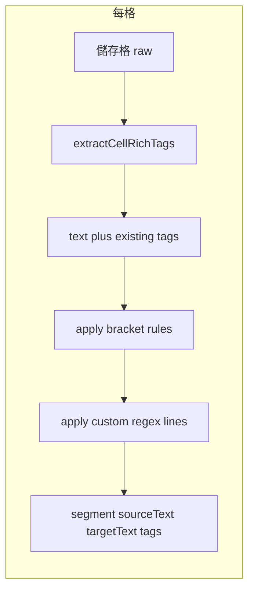

# Excel 匯入：警語與括號／字面 `\n`／自訂正則轉 tag — 工程規格

> **Implementation spec**（實作規格）：供 `cat-tool` 匯入管線實作時對照。  
> **Executive summary**（高層摘要）見 [EXCEL_IMPORT_TAG_WARNING_PLAN.md](./EXCEL_IMPORT_TAG_WARNING_PLAN.md)。  
> **介面預覽稿**（非產品邏輯）：[preview-excel-import-tags/index.html](./preview-excel-import-tags/index.html)

---

## 1. 範圍與非目標

### 1.1 範圍

- **Vanilla CAT**（[`cat-tool/`](../cat-tool/)）專案檔匯入流程中，針對 **Excel 試算表**（`.xlsx`、`.xls`）在**欄位對齊／匯入設定**階段：
  - 顯示**警語**（見 §2）。
  - 可選擇將儲存格內部分文字轉為**行內 tag**（佔位符 `{n}`／`{/n}` 與 `tags` 陣列），規則見 §5–§7。

### 1.2 產品路線（Phrase 式）

- 與 **Phrase／Memsource** 類似之揭露：匯入後可翻譯內容轉為**編輯器內部表示**，**不承諾**整本試算表之圖表、圖片、多數儲存格格式等皆能完整保留。
- 本規格**不**涵蓋「**嚴格 OOXML 原位修補**」（僅改譯文格、其餘 ZIP／XML 位元不變）— 若另案實作須**分文件**描述，避免與本規格混談。

### 1.3 非目標（本波可不實作）

- 匯出階段將 tag **完整寫回**富文字儲存格：見 §9（後續波次；現況匯出多為純文字路徑）。
- 非 Excel 格式（XLIFF、PO 等）之同一套「括號規則」— 除非產品另開需求。

---

## 2. 支援副檔名與警語文案

### 2.1 與產品一致之「支援」敘述

- 主畫面上傳區 `accept` 與使用者可見說明：見 [`cat-tool/index.html`](../cat-tool/index.html) `sourceFileInput`（`.xlsx`、`.xls`、…）。
- **警語中試算表部分**僅宣告：**`.xlsx`**（Excel 2007 以後）、**`.xls`**（舊版 Excel）。
- **不應**在警語中暗示支援 **`.xlsm`、`.ods`** 等；應引導使用者**另存為 `.xlsx`** 後再上傳。
- **Google 試算表**：引導以「下載／另存」為 **`.xlsx`** 再上傳（不宣稱直接連線 Google）。

### 2.2 警語內容（最低限度）

- 可翻譯內容會轉成編輯器內部結構；**多數儲存格格式、圖表、圖片可能無法保留**。
- **行內 tag** 若前後不一致，可能導致日後**匯出失敗**；建議完成後執行品質檢查。
- （不強制）**無需勾選「我已閱讀」**即可繼續— 若法務日後要求再改。

### 2.3 與 `CAT_VIEW_SPEC` 用語

- 使用者可見文案避免簡中慣用「**匹配**」；見 [`docs/CAT_VIEW_SPEC.md`](./CAT_VIEW_SPEC.md) §1.3。

---

## 3. UI／流程（對齊預覽稿）

以下為實作目标版型；細節以 [preview-excel-import-tags/index.html](./preview-excel-import-tags/index.html) 為準。

| 區塊 | 行為 |
|------|------|
| 警語區 | 依 §2；可摺疊詳文 + 一摘要行（實作自行決定）。 |
| 同意 | **不強制**勾選。 |
| Tag 選項（四勾選） | `<>`、`[]`、`{}` 成對括號；以及「**`\n` 純文字換行標記（非儲存格換行）**」— 指字面上 **反斜線 + `n` 兩個字元**，非 Alt+Enter 儲存格換行。 |
| 自訂規則 | 位於四勾選**下方**；「**新增**」一次多一列；每列一個 **regex** 輸入框 + **移除**；欄旁固定提醒「**正則表達式**」。 |
| 靜態說明 | 簡述四個預設選項各代表什麼（可複製預覽頁條列）。 |
| 互動預覽 | 多行文字框輸入範例 +「套用預覽」→ 顯示意結果。**預覽 HTML 內之腳本為 demo**，正式產品須與匯入引擎一致或標註「僅示意」。 |

---

## 4. 建議掛載點（程式錨點，僅備註）

實作時需在「使用者已選 Excel、進入欄位對齊／批次 Excel 設定」之視圖插入上述區塊。現有程式錨點包括（**文件名，不強制唯一入口**）：

- [`cat-tool/app.js`](../cat-tool/app.js)：`wizardStepBatchExcel`、`showBatchExcelConfigModal`、`_refreshBatchExcelStep`、`onBatchExcelSameCfgToggle`、`_batchExcelConfigs`、`runBatchImport`。
- [`cat-tool/index.html`](../cat-tool/index.html)：`wizardStepBatchExcel`、專案內單檔／作業檔匯入相關步驟。
- 句段萃取：`extractSegmentIntoBackup`（含 Rich Text 分支與 `CatToolXlsxRichTags`）。

單檔非批次路徑若有獨立 Excel 設定 modal，應**共用同一套**選項元件或同一設定資料結構，避免兩套行為。

---

## 5. 管線順序（規格）

對**每一個**將匯入為句段的儲存格（原文／譯文依欄位設定）：

1. **Rich Text 萃取**（現行邏輯）：[`cat-tool/js/xlsx-rich-tags.js`](../cat-tool/js/xlsx-rich-tags.js) `extractCellRichTags` → 得到 `text`、**`tags`**（含 `ph`、`xml`、`type`、`pairNum` 等）、**`baseRprXml`** 等。
2. **字串層規則**（本規格新增）：在步驟 1 得到的 `text` 上，依使用者勾選套用「可逆 inline tag」規則（**成對優先，否則 standalone**；見 §6），再套用自訂 regex（見 §7）。
3. 每觸發一段「需包成 tag」之子字串，產生新的 **open/close** tag 物件，**`{n}`、`{/n}` 之數字 n 必須接續**既有 `tags` 中已使用之編號（含步驟 1 已產生者）。
4. **`tag.xml`**：對於字串層規則新增的 tag，`tag.xml` 必須保存「匯出時要還原回原始字串的 token」，例如 `<color=...>`、`</color>`、`[i]`、`[SIGN UP]`、`\\n` 等；匯出時以 placeholder 反向替換回去（見 §9.2）。

---

## 6. 可逆 inline tag（字串層）規格（行為須寫死於實作／測試）

### 6.1 目標輸出形狀（例）

- 原文：`...<color=ColorSkillParams>#4[i]</color>...`
- 匯入後（內容保留、標記轉 tag）：`...{1}#4{2}{/1}...`
  - `{1}` 展開可看到原始 token：`<color=ColorSkillParams>`
  - `{2}` 展開可看到原始 token：`[i]`
  - `{/1}` 展開可看到原始 token：`</color>`

### 6.2 判斷原則：成對優先，否則 standalone（依 token 內容判斷，不依括號種類）

- **成對（open/close）**：
  - 角括號：`<tag ...>` 與 `</tag>`（同名配對）
  - 方括號：`[tag]` 與 `[/tag]`（同名配對）
  - 轉換後：以同一個 `n` 產生 `{n}`（open）與 `{/n}`（close），並把原始 token 分別存入 `tags[].xml`。
- **standalone**：
  - 任何無法（或不需要）成對的 token，例如 `[i]`、`[SIGN UP]`、` ` 等
  - 轉換後：產生單顆 `{n}`（type: standalone），並把原始 token 存入 `tags[].xml`。

### 6.3 不合法時的策略：允許但不轉換

若解析到 open/close 無法正確配對（缺 closing、交錯、結構破損），則：

- **保留原字串**（不插入 `{n}`、不新增 `tags[]`）
- 由使用者自行決定是否關閉該規則或改用自訂 regex

### 6.4 字面 `\\n`（純文字換行標記）

- 比對連續兩字元：**`\\`**（U+005C）+ **`n`**（U+006E），視為 standalone token。
- 轉換後：`{n}\\n` 或 `{n}`（standalone）皆可，但若要支援匯出可逆，`tags[].xml` 必須能還原為字面 `\\n`。
- **不**與儲存格內 Unicode 換行（例如 U+000A）混淆。

---

## 7. 自訂 Regex

### 7.1 語意

- 每列為一段 **JavaScript** `RegExp` 可接受之 pattern 字串（是否允許 flags 另欄— **建議：先僅 pattern，預設 `g` 或產品定義**）。
- 在 regex 中，**`\n`** 通常表示**換行字元**，與 §3「字面 `\n` 兩字元」**不同**；UI 已分離；進階使用者若要在 regex 中比對字面反斜線+n，需依引擎跳脫（如 `\\n`）— **自訂欄旁說明必須保留**。

### 7.2 驗證時機

- **輸入後失焦**或**按下套用預覽／開始匯入**：非法 pattern **顯示錯誤**，並**阻擋**後續動作。
- 錯誤訊息須指出**第幾列**規則失敗。

### 7.3 建議上限（供產品拍板）

| 項目 | 建議初值 | 說明 |
|------|-----------|------|
| 自訂列數上限 | 20～50 | 避免 UI 與效能問題。 |
| 單一 pattern 字元數 | 500～2000 | 避免極長 pattern。 |
| ReDoS | 超時或拒絕過度回溯 | 對大格文字跑 regex 時限制執行時間或長度。 |

---

## 8. 持久化策略（選項，實作前定案）

| 選項 | 優點 | 缺點 |
|------|------|------|
| 僅存於當次匯入會話（記憶體） | 不擴 DB schema | 再匯同一檔需重設。
| 寫入 `file` 或專案設定（IndexedDB／團隊 `cat_files` JSON） | 可重複使用 | 需 migration／RPC 擴充與相容。

本規格**不**預設哪一種；實作 PR 須註明選擇與理由。

---

## 9. 匯出（後續波次）

- 富文字還原理論上使用 [`buildRichTextXml`](../cat-tool/js/xlsx-rich-tags.js) 與 `baseRprXml`。
- **現況**（撰寫時）：[`cat-tool/app.js`](../cat-tool/app.js) Excel 匯出常徑為工作表轉陣列後寫回**純文字**，**未**全面接 `buildRichTextXml`— 詳見程式內匯出註解。
- 本規格**不要求**第一波即完成富文字匯出對齊；若另開 **Excel export v2**，應連結本規格之 tag 結構。

---

## 10. 驗收（實作 PR）

除 [EXCEL_IMPORT_TAG_WARNING_PLAN.md](./EXCEL_IMPORT_TAG_WARNING_PLAN.md) §5 外，另需：

- 自訂 regex **合法／非法**路徑皆有明確回饋；非法時無法進入匯入完成態。
- 產生之 `{n}` 編號在單句內**連續、不重複**，且**不破壞** Rich Text 既有 tag。
- **手測**：含富文字之儲存格 — 確認順序為先萃取再套規則（必要時 log 或斷點檢查）。
- **回歸**：既有純 Excel 匯入（未開任何新選項）行為與現行一致。

---

## 11. 相關文件

- [EXCEL_IMPORT_TAG_WARNING_PLAN.md](./EXCEL_IMPORT_TAG_WARNING_PLAN.md)
- [preview-excel-import-tags/index.html](./preview-excel-import-tags/index.html)
- [xlsx-rich-tags.js](../cat-tool/js/xlsx-rich-tags.js)
- [CAT_VIEW_SPEC.md](./CAT_VIEW_SPEC.md)
- [CODEMAP.md](./CODEMAP.md)（索引列）
