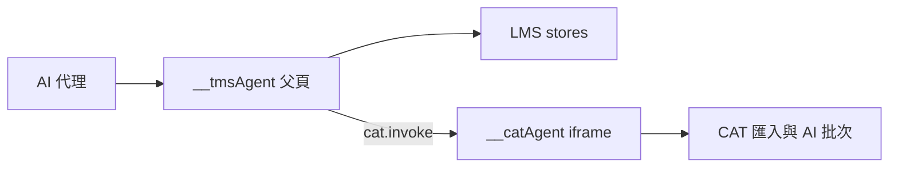

# TMS + CAT AI 整合操作指南（Claude 首讀）

> **狀態**：2026-07-04（含 W9-A DOM 定位標記）  
> **對象**：瀏覽器自動化 AI（Claude in Chrome、`Runtime.evaluate`、Playwright）  
> **預設環境**：`https://talk-hanzi-joy.vercel.app` + **測試模式**（`env=test`，與正式營運資料隔離）  
> **次讀**：LMS API 速查 [`LMS_AI_AGENT_QUICK_GUIDE_FOR_CLAUDE.md`](LMS_AI_AGENT_QUICK_GUIDE_FOR_CLAUDE.md)、CAT API [`CAT_AI_AGENT_BRIDGE_2026-07.md`](CAT_AI_AGENT_BRIDGE_2026-07.md)

---

## 1. 三個全域物件

| 物件 | 位置 | 用途 |
|------|------|------|
| `window.__tmsAgent` | LMS **父頁** | **首選入口**：LMS 全部 API + `cat.invoke` |
| `window.__lmsAgent` | 父頁 | 與 `__tmsAgent.lms` 相同（向後相容） |
| `window.__catAgent` | **CAT iframe 內** | 匯入、AI 批次、describe；或經父頁 `cat.invoke` 呼叫 |

**每次任務開始先探測：**

```javascript
const ok =
  !!window.__tmsAgent &&
  window.__lmsAgent === window.__tmsAgent.lms;
ok; // → true
```

CAT 任務另確認 iframe 已開啟（`/cat/team` 或 `/cat/offline`）：

```javascript
const iframe = document.querySelector('iframe[src*="/cat/"]');
!!iframe?.contentWindow; // → true
```

---

## 2. 環境與測試模式（強制）

本系統**沒有**獨立 staging 網址。線上測試依頂欄 **測試模式**（見 [`CAT_LMS_TEST_MODE_IMPL_PLAN_2026-06.md`](CAT_LMS_TEST_MODE_IMPL_PLAN_2026-06.md)）：

1. 以**真人執行長**登入 `https://talk-hanzi-joy.vercel.app`
2. 點頂欄 **「進入測試模式」** → 切換為假執行長 `test-exec@test.local`
3. 確認橘色警示條：**「測試模式 — 目前所有操作都在測試環境，與正式資料隔離」**
4. 之後 LMS／CAT 雲端寫入皆在 **`env=test`** 測試區

**禁止**以真人帳號在正式區跑建單、匯入、請款等破壞性腳本。測試區資料可用頂欄「重置測試環境」清理。

測試資料標題建議前綴：**`[AI驗收]`** 或任務指定前綴（例如 `[PW] ai-bridge`）。

Playwright 自動化對照：`.env` 設 `PLAYWRIGHT_ENTER_TEST_MODE=1`（見 [`TMS_AI_AGENT_BRIDGE_PHASE2_PLAYWRIGHT_PLAN.md`](TMS_AI_AGENT_BRIDGE_PHASE2_PLAYWRIGHT_PLAN.md)）。

---

## 3. 通用守則

1. **優先 bridge**：填案件、費用、請款、上傳、CAT 匯入／AI 批次設定 — 用 API，**不要**點下拉、日期選擇器、原生 `<input type="file">`。尚無 bridge 方法的區塊（工具區塊欄位、範本選單、多人協作表格、CAT 句段狀態）改用 §11 的穩定 DOM 標記定位，**不要**截圖猜座標。
2. **先探索再寫入**：`__tmsAgent.describe()` 或 `options.get('taskType')` 查合法 label。
3. **錯誤自我修正**：回傳 `{ ok: false, error, allowed? }` 時，用 `allowed` 修正後重送。
4. **時間**：API 用 ISO 8601（`2026-07-01T09:00:00.000Z`）；驗收畫面顯示須為 **24 小時制**。
5. **檔案上傳（LMS）**：`upload.fromBytes` → 將回傳的 `{ name, url, size }` 寫入 `workingFiles`、`sourceFiles` 等欄位。
6. **治理**：bridge **不觸發** Slack 通知、部分變更紀錄、公布時重複標題檢查等 UI 副作用；任務若要求這些效果，需依提示改點 UI 或註明限制。



---

## 4. LMS 建單端到端（測試模式）

以下腳本在父頁 `Runtime.evaluate` 執行（`await` 需 async 包裝）。

### 4.1 建立草稿案件

```javascript
const agent = window.__tmsAgent;
const title = `[AI驗收] 樣本案件 ${Date.now()}`;
const created = await agent.case.create({ title });
if (!created.ok) throw new Error(created.error);
const caseId = created.data.id;
caseId;
```

### 4.2 填寫基本資訊與派案

```javascript
const agent = window.__tmsAgent;
// 先查合法下拉值
const clients = agent.options.get("client");
const assignees = agent.options.get("assignee");
const client = clients.data?.labels?.[0] ?? "";
const translator = assignees.data?.labels?.[0] ?? "";

const updated = await agent.case.update(caseId, {
  client,
  translator: translator ? [translator] : [],
  translationDeadline: "2026-07-15T10:00:00.000Z",
  multiCollab: false,
  workGroups: [
    { workType: "翻譯", billingUnit: "字", unitCount: 1000 },
  ],
});
updated.ok;
```

> `workType`／`billingUnit`／`client` 等須為 `options.get` 回傳的 **label**，不可用自造字串。

### 4.3 上傳作業檔到案件

```javascript
const agent = window.__tmsAgent;
const up = await agent.upload.fromBytes({
  fileName: "sample.txt",
  contentType: "text/plain",
  base64: btoa("AI test content"),
});
if (!up.ok) throw new Error(up.error);

const c = await agent.case.get(caseId);
const files = [...(c.data.workingFiles || []), up.data];
await agent.case.update(caseId, { workingFiles: files });
```

### 4.4 產生費用單

```javascript
const agent = window.__tmsAgent;
const fees = await agent.case.generateFees(caseId);
// fees.data.fees → [{ id, title, path, fullUrl }, ...]
```

或手動：`agent.fee.create({ title: "...", assignee: "...", taskItems: [...] })`。

### 4.5 公布為詢案中

```javascript
await agent.case.update(caseId, { status: "inquiry" });
```

等同 UI「公布」；**Slack 詢案通知等可能不會自動發送**（bridge 限制）。

### 4.6 取得連結

```javascript
agent.navigate.urlFor({ type: "case", id: caseId });
// → { ok, data: { path, fullUrl } }
```

---

## 5. 案件詳情頁區塊對照

頁面路由：`/cases/:id`。完整欄位以 `__tmsAgent.describe().data.case` 為準（程式：[`src/lib/ai-agent-bridge.ts`](../src/lib/ai-agent-bridge.ts)）。

| 區塊 | 主要欄位 | Bridge | 僅 UI／備註 |
|------|----------|--------|-------------|
| 基本資訊 | `title`、`client`、`contact`、`translator`、`reviewer`、交期、`multiCollab`、`collabRows` | `case.update` | 譯者「承接本案」按鈕 |
| 內容性質 | `category`、`billingUnit`、`unitCount` | `case.update` | — |
| 派案來源 | `dispatchRoute` | `case.update` | PM+ 可見 |
| 客戶案件單連結 | `clientCaseLink` | `case.update` | — |
| 本案費用 | 連結之費用單 | `case.generateFees`、`fee.*` | 跳轉用 `navigate.urlFor` |
| 工具 | `executionTool`、`tools`、`questionTools` | `case.update`；`options.getToolSchema` | 1UP CAT 實際指派在 CAT 內 |
| 提問 | `questionForm`、`comments` | `case.update` | — |
| 準則與檔案 | `sourceFiles`、`workingFiles`、`clientGuidelines`、`caseReferenceMaterials` 等 | `upload` + `case.update` | — |
| 案件說明 | `bodyContent`、`inquiryNote`、`processNote` | `case.update` | 富文本複雜時先 `case.get` 再 patch |
| 內部紀錄 | `internalRecords` | `case.update` | — |
| CAT Workflow | 準備完成、檔案指派 | — | 在 CAT 團隊版操作（見 §7–§8） |

### 陣列合併（避免覆蓋整表）

```javascript
await agent.case.update(caseId, {
  workGroups: { mergeById: true, items: [{ id: "既有列id", unitCount: 2000 }] },
});
```

`collabRows`、`taskItems`、`clientInfo.clientTaskItems` 同理。

---

## 6. 費用與請款

### 6.1 費用單 `fee.*`

| 方法 | 說明 |
|------|------|
| `fee.create` / `fee.update` | 草稿費用；`taskItems`、`clientInfo` |
| `fee.update(id, { status: 'finalized' })` | Phase 2 起**可定案**（與初版 bridge 不同） |

`clientInfo` **可部分更新**（未傳的 `clientTaskItems` 會保留）；若傳 `clientTaskItems` 則**整包取代**，或使用 `{ mergeById: true, items: [...] }`。

### 6.2 譯者請款 `invoice.*`

```javascript
const inv = await agent.invoice.create({
  translator: "譯者甲",
  feeIds: [feeId1, feeId2],
  title: "[AI驗收] 請款",
});
await agent.invoice.addFees(inv.data.id, [anotherFeeId]);
```

### 6.3 客戶請款 `clientInvoice.*`

```javascript
const ci = await agent.clientInvoice.create({
  client: "CCJK",
  feeIds: [feeId],
});
```

---

## 7. CAT 架構與導覽

### 7.1 雙層結構

- **外層**：LMS React 殼（側欄、頂欄、網址列）
- **內層**：`<iframe src="/cat/...">` 載入 CAT 本體

**「+ 匯入檔案」在 iframe 內**（`#btnAddFileModal`）。在父頁 `read_page` 只看得到 LMS 標題時，**不代表按鈕不存在** — 請改開 CAT 頁或直接用 `cat.invoke`。

### 7.2 建議進入方式

1. 左欄點 **「CAT 團隊線上版」**（或導向 `/cat/team`）
2. 等待 iframe 載入完成（儀表板或專案畫面出現）
3. 再導向目標 URL 或點側欄

勿在未載入 iframe 時僅改父頁 URL 就斷言「頁面空白」。

### 7.3 外層 URL（團隊版）

前綴：`/cat/team`；離線版將 `team` 改為 `offline`。

| 畫面 | 路徑範例 |
|------|----------|
| 儀表板 | `/cat/team` |
| 專案清單 | `/cat/team/projects` |
| 專案詳情（檔案列表） | `/cat/team/projects/:projectId` |
| 編輯器 | `/cat/team/files/:fileId?p=:projectId` |
| TM 清單／詳情 | `/cat/team/tm`、`/cat/team/tm/:tmId` |
| TB 清單／詳情 | `/cat/team/tb`、`/cat/team/tb/:tbId` |
| AI 準則／設定／範例 | `/cat/team/ai-guidelines`、`ai-settings`、`ai-examples` |

詳見 [`CAT_DEEP_LINK_HISTORY_NAV_2026-06.md`](CAT_DEEP_LINK_HISTORY_NAV_2026-06.md)。

### 7.4 iframe 內側欄 `data-view`

| data-view | 畫面 |
|-----------|------|
| `viewDashboard` | 儀表板 |
| `viewProjects` | 專案清單 |
| `viewProjectDetail` | 專案內檔案列表（由程式切換，無側欄單獨項） |
| `viewEditor` | 句段編輯器 |
| `viewTM` / `viewTbDetail` 等 | TM／TB／AI 頁 |

### 7.5 父頁呼叫 CAT

```javascript
// 父頁；須已開啟 /cat/*
const r = await __tmsAgent.cat.invoke("describe", []);
r.ok && r.data;

// 等同 iframe 內 __catAgent.describe()
```

逾時 120s；失敗常見原因：未開 CAT 頁、方法名錯誤、專案未開啟。

---

## 8. CAT 各模組能力

| 模組 | 導覽 | Bridge API | 備註 |
|------|------|------------|------|
| 儀表板／專案 | URL 或側欄 | `describe()` | 確認 `projectId` |
| 專案詳情＋匯入 | `/cat/team/projects/:id` | **`import.fromBytes`** | 勿在父頁找按鈕 |
| 編輯器 | 開檔後 URL | `describe()`（句數） | **句段編輯無 bridge** → UI |
| TM／TB | `/cat/team/tm` 等 | **無** | 匯入／維護走 UI |
| AI 管理／準則 | `/cat/team/ai-settings` 等 | 設定讀寫 mostly UI | PM／執行長可見 |
| AI 批次翻譯 | 編輯器內 Modal | **`aiBatch.*`** | 見 §10 |
| Workflow 指派、準備完成 | CAT 專案／檔案工具列 | **無** | UI + 雲端 RPC |

---

## 9. CAT 匯入檔案

### 9.1 推薦方式：`import.fromBytes`

**在父頁**（已開啟目標專案 `/cat/team/projects/:projectId`）：

```javascript
const r = await __tmsAgent.cat.invoke("import.fromBytes", [{
  fileName: "sample.mqxliff",
  base64: "BASE64_WITHOUT_PREFIX", // 或 data:...;base64, 前綴亦可
  sourceLang: "en-US",
  targetLang: "zh-TW",
  mqRole: "T_ALLOW_R1", // .mqxliff 建議提供
  caseInfo: { caseId: "lms-case-uuid", caseTitle: "連結的案件標題" }, // 團隊版選填
}]);
r.ok; // → true 表示已進入 runBatchImport
```

**前置條件：**

1. iframe 內 `currentProjectId` 為目標專案（先 `cat.invoke('describe')` 確認 `projectId`）
2. `sourceLang`、`targetLang` **必填**（須為專案支援的語言代碼）
3. 團隊版連結 LMS 案件：選填 `caseInfo`（見 [`CAT_IMPORT_CASE_LINK_2026-06.md`](CAT_IMPORT_CASE_LINK_2026-06.md)）

### 9.2 參數一覽

| 參數 | 必填 | 說明 |
|------|------|------|
| `fileName` | 是 | 含副檔名（`.mqxliff`、`.xlsx`、`.po` 等） |
| `base64` 或 `bytes` | 是 | 檔案內容 |
| `contentType` | 否 | MIME，預設 `application/octet-stream` |
| `sourceLang` / `targetLang` | 是 | 語言對 |
| `mqRole` | mqxliff 建議 | 如 `T_ALLOW_R1` |
| `caseInfo` | 否 | `{ caseId, caseTitle }` 團隊版連結 LMS |
| `excelConfigMap` | Excel 時 | **通常需 UI 精靈先設定**；單獨 fromBytes 易失敗 |

### 9.3 格式限制

| 格式 | bridge 匯入 | 備註 |
|------|-------------|------|
| mqxliff / xliff / po | 支援 | 最常見自動化路徑 |
| Excel | 受限 | 需欄位對應設定；建議 UI 精靈或預先準備 `excelConfigMap` |
| Google Sheet | 不支援 bridge | 僅 UI「從 Google Sheet 匯入」 |

### 9.4 匯入後開啟編輯器

bridge 只負責匯入；開檔進編輯器需：

- UI 點檔案列的編輯按鈕，或
- 導向 `/cat/team/files/:fileId?p=:projectId`

再 `cat.invoke('describe')` 確認 `segmentCount > 0`。

### 9.5 離線版

路徑 `/cat/offline`，API 相同（`__catAgent` 或父頁 `cat.invoke`）；資料在瀏覽器 IndexedDB，不寫雲端。

---

## 10. CAT AI 批次翻譯

### 10.1 流程

1. 已在編輯器且 `segmentCount > 0`
2. `aiBatch.openModal()` 開啟 Modal
3. `aiBatch.setSettings(patch)` 寫入偏好
4. （選用）`aiBatch.previewPrompt()` 預覽 prompt
5. **僅在使用者明確要求時** `aiBatch.run()` — 會呼叫 LLM，**有成本**

父頁範例：

```javascript
await __tmsAgent.cat.invoke("aiBatch.openModal", []);
await __tmsAgent.cat.invoke("aiBatch.setSettings", [{
  batchRefOptions: { tm: true, tb: true, tbNote: false },
  rangeMode: "all",
  batchIntroduction: "請維持正式語氣。",
  handleConfirmed: "skip",
  handleUnconfirmed: "translate",
}]);
const s = await __tmsAgent.cat.invoke("aiBatch.getSettings", []);
s.data?.batchRefOptions;
```

### 10.2 常用 `setSettings` 欄位

| 欄位 | 說明 |
|------|------|
| `batchRefOptions` | `{ tm, tb, tbNote, ... }` 參考來源勾選 |
| `rangeMode` | `all`／`filtered`／`expr` 等 |
| `rangeExpr` | 列範圍運算式（`rangeMode` 為 expr 時） |
| `batchIntroduction` | 批次提示語 |
| `handleConfirmed` / `handleUnconfirmed` | 已確認／未確認句處理（如 `skip`、`translate`） |
| `tmThreshold` / `tmAction` | TM 門檻與動作 |
| `candidatePool` | 進階候選池（物件） |

prefs 依 **user × project** 儲存（團隊版：Supabase；離線：Dexie）。

### 10.3 限制

- `run()` 前 Modal 須已開啟且綁定執行鈕
- 自動驗收預設**不**跑真實 `run()`（成本與不穩定）
- 句段級手動翻譯、QA、確認狀態：**無 bridge**，用編輯器 UI

---

## 11. 非 bridge／DOM 定位標記（W9-A，2026-07-04）

**背景**：§3 守則「優先 bridge」仍為第一原則；但部分區塊（工具區塊欄位、範本選單、多人協作表格、CAT 編輯器句段列）尚無對應 bridge 方法，過去只能截圖猜座標或用不穩定的文字/位置定位。W9-A（[`ENGINEERING_IMPROVEMENT_MASTER_PLAN_2026-07.md`](ENGINEERING_IMPROVEMENT_MASTER_PLAN_2026-07.md) §10）已加入下列**穩定 DOM 標記**，可搭配 `find`（無障礙定位）或 CSS selector 直接命中，取代截圖／座標猜測。2026-07-04 已於正式站以 `find` 逐項驗證 PASS（A3 見下方備註）。

### 11.1 案件詳情頁（`/cases/:id`）— 工具區塊

程式：[`src/pages/CaseDetailPage.tsx`](../src/pages/CaseDetailPage.tsx)。

| 標記 | 對應欄位／元件 | 說明 |
|------|----------------|------|
| `[data-testid="tool-server"]` | 工具欄位「伺服器」 | 文字輸入框 |
| `[data-testid="tool-username"]` | 工具欄位「帳號」／「登入帳號」 | 文字輸入框 |
| `[data-testid="tool-password"]` | 工具欄位「密碼」／「登入密碼」 | 文字輸入框（明碼，非遮罩） |
| `[data-testid="tool-project"]` | 工具欄位「專案」／「專案名稱」 | 文字輸入框 |
| `[data-testid="tool-files"]` | 工具欄位「檔案」／「檔案名稱」 | 檔案欄位（`ToolFileFieldRow`） |
| `[data-testid="tool-field-<fieldId>"]` | 其他自訂欄位標籤（無對照表命中時的 fallback） | `<fieldId>` 為該欄位的內部 id |
| `[data-testid="template-option-<範本名稱>"]` | 範本彈出視窗內的範本選項按鈕 | 需先點「範本」按鈕開啟 popover |
| `button[aria-label="移除工具 <工具名稱或序號>"]` | 工具區塊右上角移除鈕（`X`） | **僅在該案件有 2 種以上工具時渲染**（`canRemoveCaseTool`／`questionTools.length > 1`，須至少保留一種工具）；只有 1 種工具的案件本就不顯示此鈕，屬設計行為，非缺陷 |

### 11.2 多人協作表格（案件詳情頁內）

程式：[`src/components/CollaborationTable.tsx`](../src/components/CollaborationTable.tsx)。

| 標記 | 說明 |
|------|------|
| `[data-collab-id="<rowId>"]` | 掛在每一協作列的容器（`div`），可用來限定該列範圍內再找子元素（例如譯者選單、勾選框） |
| `[data-collab-id="<rowId>"][data-collab-field="translationDeadline"]` | 該列「翻譯交期」日期欄的容器，避免舊版「點日期全寫入第一列」的誤觸 |
| `[data-collab-id="<rowId>"][data-collab-field="reviewDeadline"]` | 該列「審稿交期」日期欄的容器 |

`<rowId>` 為 `CollabRow.id`（可由 bridge `case.get(caseId)` 讀 `collabRows` 陣列取得）。

### 11.3 CAT 編輯器句段列

程式：[`cat-tool/app.js`](../cat-tool/app.js)（`syncRowStatusDataset`）。

| 標記 | 說明 |
|------|------|
| `.grid-data-row[data-seg-id="<segId>"]` | 既有標記，定位到指定句段列（`<segId>` 即句段 id） |
| `.grid-data-row[data-status="<status>"]` | 該列句段的**原始狀態**（例如 `draft`、`confirmed`） |
| `.grid-data-row[data-wf-state="<state>"]` | 該列的**統一顯示五態**（`resolveSegmentConfirmDisplayState` 計算結果，例如 `trans_confirmed`、`review_confirmed`、`orig_confirmed`），與畫面圖示樣式一致但可程式判讀 |

用於篩選／統計句段狀態時，改用 `document.querySelectorAll('.grid-data-row[data-status="confirmed"]')` 等 DOM 查詢，**不要**再靠圖示 CSS class（`.wf-trans`、`.orig-confirmed` 等組合）截圖判讀；Playwright 劇本亦同（見 [`CAT_EDITOR_NAV_PHASE_2_3Q_PLAYWRIGHT_PLAN.md`](CAT_EDITOR_NAV_PHASE_2_3Q_PLAYWRIGHT_PLAN.md) Phase S）。

### 11.4 後續（W9-B／W9-C，未排入本輪）

工具區塊欄位寫入回讀驗證、`case.getCurrentId()`、CAT 編輯器句段查詢／跳轉 API（`__catAgent` 擴充）、`beforeunload` 攔截、語言對打字搜尋、CAT iframe 無障礙樹曝露等項目，依擁有者裁定維持「隨模組碰到時做」／「個案」排程，詳見主計畫 §10 W9-B／W9-C；完成時將回來補本節。

---

## 12. 常見失敗與排錯

| 現象 | 可能原因 | 處理 |
|------|----------|------|
| 看不到「+ 匯入檔案」 | 讀的是**父頁** main，非 iframe | 開 `/cat/team` 或直接用 `import.fromBytes` |
| iframe 只有標題、無 CAT 內容 | 未載入完成或 URL 直打 | 從側欄「CAT 團隊線上版」進入，等待載入 |
| LMS `case.create` 失敗 | 未進測試模式／env 不符 | 進測試模式或確認 admin |
| `ok: false` + `allowed` | 下拉值不合法 | 從 `allowed` 挑選重送 |
| `cat.invoke` 逾時 | 未開 CAT、方法錯、專案未選 | 開 CAT 頁並 `describe()` 確認 |
| `import.fromBytes` 缺語言 | 未傳 `sourceLang`／`targetLang` | 補上專案語言對 |
| Excel 匯入失敗 | 缺欄位設定 | 改 UI 精靈或 mqxliff 測試檔 |

---

## 13. 相關文件索引

| 主題 | 文件 |
|------|------|
| LMS API 速查 | [`LMS_AI_AGENT_QUICK_GUIDE_FOR_CLAUDE.md`](LMS_AI_AGENT_QUICK_GUIDE_FOR_CLAUDE.md) |
| LMS 完整規格／驗收 | [`LMS_AI_AGENT_BRIDGE_2026-06.md`](LMS_AI_AGENT_BRIDGE_2026-06.md) |
| Phase 2（upload、請款、治理） | [`TMS_AI_AGENT_BRIDGE_PHASE2_PLAN.md`](TMS_AI_AGENT_BRIDGE_PHASE2_PLAN.md) |
| CAT API | [`CAT_AI_AGENT_BRIDGE_2026-07.md`](CAT_AI_AGENT_BRIDGE_2026-07.md) |
| CAT URL／上一頁 | [`CAT_DEEP_LINK_HISTORY_NAV_2026-06.md`](CAT_DEEP_LINK_HISTORY_NAV_2026-06.md) |
| 測試模式 | [`CAT_LMS_TEST_MODE_IMPL_PLAN_2026-06.md`](CAT_LMS_TEST_MODE_IMPL_PLAN_2026-06.md) |
| 匯入連結 LMS 案件 | [`CAT_IMPORT_CASE_LINK_2026-06.md`](CAT_IMPORT_CASE_LINK_2026-06.md) |
| Playwright 回歸 | [`TMS_AI_AGENT_BRIDGE_PHASE2_PLAYWRIGHT_PLAN.md`](TMS_AI_AGENT_BRIDGE_PHASE2_PLAYWRIGHT_PLAN.md) |
| W9 AI 可操作性主計畫 | [`ENGINEERING_IMPROVEMENT_MASTER_PLAN_2026-07.md`](ENGINEERING_IMPROVEMENT_MASTER_PLAN_2026-07.md) §10 |
| 程式：LMS bridge | [`src/lib/ai-agent-bridge.ts`](../src/lib/ai-agent-bridge.ts) |
| 程式：CAT bridge | [`cat-tool/js/cat-agent-bridge.js`](../cat-tool/js/cat-agent-bridge.js) |

---

## 14. 開發紀錄

| 日期 | 內容 |
|------|------|
| 2026-07-03 | 初版：整合 LMS 建單、案件頁、CAT 導覽、匯入、AI 批次；預設線上測試模式（commit `a9f0721`） |
| 2026-07-04 | 新增 §11「非 bridge／DOM 定位標記」：W9-A 落地的 `data-testid`／`aria-label`／`data-collab-id`／`data-status`／`data-wf-state` 標記對照表；正式站 `find` 驗證 A1/A2/A4/A5 PASS，A3 釐清為設計行為（commit `64c0948`、merge `af90596`） |
