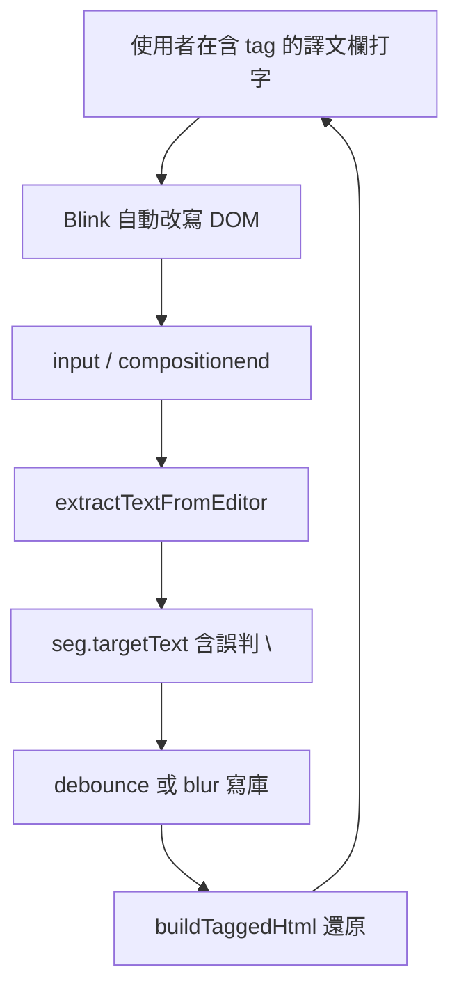

# Bug Report：CAT 譯文欄 contenteditable 換行符號異常

> **初稿調查日期**：2026-05-02（問題背景與根因分析）  
> **實作完成**：2026-05-02；分支 `main`；commit `c4f865d`（訊息：`CAT: 譯文欄換行與貼上—受控 BR、Enter 政策、blur/確認前重建 DOM`）；**手動驗收已由專案擁有者確認通過**  
> **文件更新**：2026-05-02 — 本版寫入「已落地行為」「實作摘要」「後續可選工作」，並標註初稿中哪些敘述已過時  

專案：1UP TMS — CAT 工具（原始碼 `cat-tool/app.js`，同步至 `public/cat/app.js`；部署前慣例執行 `npm run sync:cat`）。  
觸發環境：Chrome／Edge 等 Blink 系瀏覽器；Windows 注音 IME 為主要重現路徑。

---

## 文件用途（本版）

本文同時保存：

1. **問題背景與根因**（除錯與教育用，Part 1／Part 2 前段）  
2. **已定案的產品行為**（Part 1.3）  
3. **已落地的程式變更摘要**（Part 2.4，與 commit 對齊）  
4. **後續可選的改進方向**（Part 2.5，非承諾）  
5. **本聊天／實作追溯**（文末「本聊天／實作紀錄」）

初稿中「僅列方案、尚未改程式」「一句譯文必須單行」等假設**已過時**；請以 **Part 1.3、Part 2.4** 為準。

---

## Part 1 — 白話摘要

### 1.1 發生什麼事（歷史背景）

在 CAT 工具編輯譯文時，曾出現與「莫名出現的換行符號」有關的症狀：

| 你做了什麼 | 你看到什麼 |
|------------|-----------|
| 清空譯文，立刻在這格打字（特別是注音輸入） | 字的前面冒出一個空白行（在「顯示非列印字元」模式下會看到一個 `↵` 符號），怎麼按 Backspace 都刪不掉 |
| 在含有 tag 標籤晶片（藍色／灰色那種小方塊，像 `{1}`、`{/1}`）的譯文裡繼續打字 | 中段或尾端冒出多餘的換行，刪掉後一打字又長回來 |
| 確認句段、再重新打開 | 換行被永久存進資料庫了，每次打開都還在 |

共同點：你**沒有**主動用我們後來約定的「Shift+Enter」插入換行，但編輯器或瀏覽器行為讓內容**看起來像多了一行**。

### 1.2 為什麼會這樣（比喻）

**核心原因**：瀏覽器（Chrome／Edge）為了讓「可編輯區」能顯示游標、在不可編輯的晶片旁塞字，會**自動**在 DOM 裡放版面用換行（` `）或區塊包裝（`
…
`）。這些結構**不一定代表使用者真的要存進句段的換行字元**。

舊版讀取譯文時，**幾乎把所有 ` ` 都當成使用者要的換行**，寫進資料庫；下次載入再畫回來，形成「幽靈結構 → 被當成真換行 → 愈存愈髒」的循環。

額外因素包含：注音組字期間的裝飾節點觸發 sanitize 路徑、裸 **Enter** 觸發瀏覽器預設插入、以及從外部貼上多行純文字等。

### 1.3 已定案的產品行為（實作後）

| 項目 | 行為 |
|------|------|
| 譯文可否多行 | **可以**。一句段內允許多行，以符合地址、條列、原文帶換行等情境。 |
| 單獨 **Enter** | **不插入換行**（攔截預設行為），減少 Blink 插入幽靈 ` `／多餘 `div` 的機會。 |
| **Shift+Enter** | **唯一**鍵盤路徑，在游標處插入**語意換行**：` `，與 `buildTaggedHtml` 由 `\n` 轉出的標記一致，利於抽取與非列印 `↵` 顯示。 |
| **Ctrl+Enter** | 維持既有：**確認句段**（不變）。 |
| 從外部貼上 **純文字**（`text/plain`） | 將 `\r\n`、`\n`、`\r` **替換為單一空格**，避免 Word／網頁多行一次貼入弄髒 DOM。 |
| 從本工具複製、且剪貼簿 **HTML** 含 `class="rt-tag"` | 維持既有：**可保留標籤晶片**（`insertHTML` 路徑）。 |

### 1.4 使用者可感受到的修復效果

- 「沒要換行卻多一行」「刪了又長回來」應**大幅減少**：抽取時會略過常見**幽靈** ` `，且失焦寫庫前、以及確認前會用乾淨的 `buildTaggedHtml` **重建**編輯器 DOM。  
- **需要換行**時請用 **Shift+Enter**。  
- 從記事本等貼上的**多行**純文字會變成**一行**（換行變空格）。

### 1.5 舊版文件中的「待決策」說明（已結案）

初稿曾請產品決定：是否完全禁止 Enter 換行、貼上是否保留換行。**已定案**如上表（允許多行；有意換行用 Shift+Enter；純文字貼上換行變空格）。本節僅供追溯對話脈絡。

---

## Part 2 — 技術細節

### 2.1 症狀表（與 1.1 對照；除錯參考）

| 操作 | 結果 |
|------|------|
| 清空譯文後立即以注音 IME 輸入 | 譯文最前面出現無形換行（非列印模式可見 `↵`），字元位置與預期不符 |
| 在含 `{1}`／`{/1}` 等 tag 晶片的譯文繼續打字 | DOM 出現多餘 ` ` 或區塊包裝；難以用一般刪除清乾淨 |
| 將上述狀態確認後重開 | 多餘換行寫入 `target_text`，載入後由 `buildTaggedHtml` 還原為 ` ` |

共同機制：Blink 自動 DOM 與 `extractTextFromEditor` 線性化不一致時，`\n` 被寫入狀態與資料庫，形成自我強化迴圈。

### 2.2 根本原因（摘要）

仍適用初稿結論，要點如下（不重複貼會過期的行號片段；請在 repo 內搜尋符號名稱）：

1. **Blink**：在空白 `contenteditable`、或在 `contenteditable="false"` 的 tag 晶片附近輸入時，自動插入占位 ` ` 或 `
… ` 包裝。  
2. **舊版抽取**：對 ` ` 一律對應 `\n`，且對根層多個 `div` 兄弟未與「區塊間換行」對齊，與實際儲存字串語意不一致。  
3. **sanitize 路徑**：`compositionend` 後若偵測到裝飾 junk，會以 `extractTextFromEditor` 結果重建；若抽取已含幽靈換行，會一併固化。  
4. **裸 Enter**：舊版未攔截，瀏覽器預設可插入 ` `／`div`。

譯文欄 DOM 類別為 `.rt-editor.grid-textarea`，於建立網格列時掛上 `paste`／`input`／`blur`／`keydown` 等（見 `cat-tool/app.js` 內建立 `.grid-data-row` 的區塊）。

### 2.3 資料流（問題迴圈示意）

實作後在 **D** 與 **G** 兩端加上幽靈判斷、受控 ` `、以及失焦／確認前 **rebuild**，以打斷迴圈。

### 2.4 已實作（與 `c4f865d` 對齊）

以下為行為規格；行號會隨檔案變動，請以符號名稱在 `cat-tool/app.js` 搜尋。

#### Fix A — 線性化與幽靈 BR

- **`isGhostBr(br, root)`**  
  - 若 `br` 帶 `data-cat-nl="1"` → **一律視為真換行**（非幽靈）。  
  - 若為編輯器根節點**僅有的單一子節點**且為 `BR` → 視為幽靈（常見空編輯器占位）。  
  - 若父節點為根節點的**直接子** `DIV`，且該 `div` 內**僅一個**子節點且為 `BR` → 視為幽靈（常見空區塊占位）。  
  - 其餘裸 `BR` 仍輸出 `\n`（相容舊 DOM／舊儲存資料）。

- **`extractSubtree(node, root)`**  
  遞迴：`TEXT` 累加；`non-print-marker` 略過（`np-inline-char` 內再遞迴）；`BR` 依 `isGhostBr`；`rt-tag` 取 `data-ph`；其餘元素遞迴子節點。

- **`extractTextFromEditor(editorDiv)`**  
  對**根層**子節點逐一處理：當索引大於 0 且當前節點為 **`DIV`** 時，先插入 `\n`（對齊 Blink 以 sibling `div` 表達的區塊邊界），再累加 `extractSubtree`。整段邏輯須與 **`getRtEditorTextSegmentsForHighlightMap`** 一致，否則搜尋高亮長度會與 `extractTextFromEditor` 字串長度不符。

#### Fix B — 失焦／確認前正規化（rebuild）

- **`rebuildTargetEditorFromExtractedPlain(editor, seg, row)`**  
  `plain = extractTextFromEditor(editor)` → `setEditorHtml(editor, buildTaggedHtml(plain, effectiveTags(seg)))` → 若有 `row` 則 `updateTagColors(row, plain)` → 回傳 `plain`。

- **呼叫時機**  
  - 譯文欄 **`blur`**：`sanitizeTargetEditorInlineArtifacts` **之後**，以 rebuild 產出之 `plain` 作為寫庫與 undo 快照依據。  
  - **`Ctrl+Enter`** 確認流程：在讀取／寫入目標文字前呼叫 rebuild。  
  - **點狀態圖示確認**（有聚焦之 `targetTa` 時）：同樣 rebuild。  

- **未**在一般 `input` debounce 或每次鍵入強制 rebuild（避免 IME 與效能問題）。`compositionend` 仍主要依 **`sanitizeTargetEditorInlineArtifacts`** 處理裝飾 junk，與初稿設計一致。

#### Fix C — 鍵盤

- **`keydown`**：`Enter` 且未按 `Ctrl`／`Meta` 時，若 `e.isComposing` 則不攔截；否則 **`preventDefault`**；若同時按 **`Shift`** 則呼叫 **`insertCatControlledNewline`**（建立 `br[data-cat-nl="1"]`、調整選區、`dispatchEvent('input')`）。  
- **`Ctrl+Enter`** 分支維持既有確認邏輯。

#### Fix D — 貼上

- **`paste`**：`text/plain` 先 **`plain.replace(/\r\n|\n|\r/g, ' ')`** 再以 `insertText` 插入。

#### `buildTaggedHtml`／`htmlForTmPlainWithPlaceholders`

- 將 `\n` 轉為 **` `**（取代舊版裸 ` `），與 Shift+Enter 插入一致，利於幽靈與語意換行分流。

#### 搜尋高亮、字數、非列印游標

- **`getRtEditorTextSegmentsForHighlightMap`**：與 extract 相同之根層 DIV 前綴；幽靈 BR 不佔位；必要時建立 **`type: 'nl'`、`synthetic: true`** 區段以對齊「根層 div 之間的虛擬換行」長度（該類區段可能無 DOM 節點可供套 `<mark>`）。  
- **`countEditorChars`**：改為 **`extractTextFromEditor(editorEl).length`**。  
- **`getNpCaretOffset`／`setNpCaretOffset`**：遇 `BR` 時若 **`isGhostBr`** 則不計入字元偏移。

### 2.5 未來可進一步修改（非承諾）

1. **游標與線性化完全一致**  
   非列印模式仍用 `TreeWalker` 近似計算 offset；若仍存在「僅根層 sibling `div`、中間無真實 `BR`」等邊界，理論上可能與 `extractTextFromEditor` 的虛擬 `\n` 不完全一致。若收到回報，可改為與 extract **共用單一走訪器**計算 caret offset。

2. **擴充幽靈 BR 規則**  
   若實務上出現誤判（該保留的換行被吃掉，或幽靈仍寫入），可擴充 `isGhostBr` 或針對特定 Chrome 版本做補丁。

3. **貼上政策微調**  
   目前為「換行 → 單一空格」。可選：改為**直接刪除換行不留空白**、或對 **HTML 貼上**另做除格式（需產品決策與迴歸測試）。

4. **搜尋高亮與 `nl` synthetic**  
   若搜尋條件命中「僅落在 synthetic 換行位置」的字元，現況可能無法在 DOM 上套色；若產品需要，可再設計對應策略（例如鄰近文字節點範圍或特殊占位）。

5. **打字中即時 canonicalize**  
   目前刻意不在每次 debounce **強制**整段 `innerHTML` 重建；若未來要「邊打邊洗 DOM」，需重新評估 IME、效能與與協作／undo 的互動。

6. **本文件內歷史 code 引用**  
   初稿中的行號與程式片段僅供理解問題年代；**維運時請以 repo 現況為準**。

### 2.6 驗收方式（實作後）

1. **清空後 IME 輸入**：清除譯文 → 立即用注音輸入數字或短詞 → 失焦或確認 → 重開。預期：`target_text` **無**前導幽靈換行；非列印模式不應無故出現前導 `↵`。  
2. **含 tag 句段長打**：在 `{1}`／`{/1}` 間與周邊連續輸入 → 多次失焦／確認。預期：不應因 Blink 自動包裝而**累積**無意義 `\n`（有意換行須為 Shift+Enter）。  
3. **Enter**：單按 Enter 不應插入新行。  
4. **Shift+Enter**：應插入可持久化的換行；重載後仍在。  
5. **Ctrl+Enter**：仍確認句段。  
6. **純文字多行貼上**：應合併為單行（空白取代換行）。  
7. **搜尋**：`getRtEditorTextSegmentsForHighlightMap` 的 `totalLen` 應與用於比對的扁平字串長度一致（主控台不應出現「字元索引長度與內文不符」之類警告）。

### 2.7 相關程式碼位置（以符號為準）

| 內容 | 檔案 | 符號／區塊 |
|------|------|------------|
| 語意換行輸出 | `cat-tool/app.js` | `buildTaggedHtml`、`htmlForTmPlainWithPlaceholders` |
| 幽靈 BR、抽取、重建、Shift+Enter | `cat-tool/app.js` | `isGhostBr`、`extractSubtree`、`extractTextFromEditor`、`rebuildTargetEditorFromExtractedPlain`、`insertCatControlledNewline` |
| 高亮與字數 | `cat-tool/app.js` | `getRtEditorTextSegmentsForHighlightMap`、`countEditorChars`、`applyRtEditorSearchHighlights` |
| 非列印游標 | `cat-tool/app.js` | `getNpCaretOffset`、`setNpCaretOffset` |
| 譯文欄事件 | `cat-tool/app.js` | 建立 `.grid-data-row` 時對 `.grid-textarea` 綁定之 `paste`、`blur`、`keydown`（含 Ctrl+Enter） |
| 靜態同步 | 專案根 | `npm run sync:cat` → `scripts/sync-cat.mjs` → `public/cat/` |

### 2.8 調查與決策記錄（精簡）

- 使用者明確排除「自己不小心按 Enter」為唯一原因 → 轉查 Blink 自動 DOM 與抽取邏輯。  
- 技術上 **Fix A（抽取）與 Fix B（失焦／確認前 rebuild）** 併用，才較能同時處理「新寫入」與「已髒 DOM／舊資料」。  
- 產品最終：**允許句內多行**；單 Enter 不插行；**Shift+Enter** 為有意換行；純文字貼上之換行改為**空格**。

---

## 本聊天／實作紀錄（供追溯）

| 項目 | 說明 |
|------|------|
| 使用者指示 | 驗收成功後，**更新文件**，完整記錄「本聊天為止尚未記錄的修改」以及「未來可能的進一步修改」。 |
| 程式變更（先前回合已推送） | `cat-tool/app.js`、`public/cat/app.js`；commit **`c4f865d`**（`main`）。 |
| 本文件變更（本回合） | 重寫為「背景 + 已定案行為 + 實作摘要 + 驗收 + 未來工作 + 聊天追溯」；移除與現況矛盾的「尚未實作」「一律禁止換行」敘述。 |
| `docs/CODEMAP.md` | 新增一列索引至本文件，方便從專案地圖跳轉。 |

未在本聊天單獨開列、但與同一主題相關的慣例：**修改 `cat-tool/` 後執行 `npm run sync:cat` 並一併提交 `public/cat/`**（見根目錄 `AGENTS.md`）。
