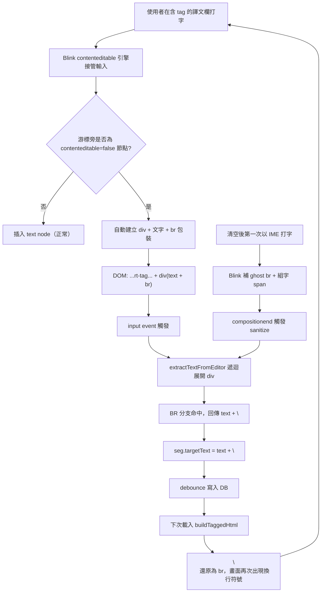

# Bug Report：CAT 譯文欄 contenteditable 換行符號異常

> 調查日期：2026-05-02  
> 專案：1UP TMS — CAT 工具（`cat-tool/app.js`）  
> 觸發環境：Chrome／Edge 等 Blink 系瀏覽器；Windows 注音 IME 為主要重現路徑  
> 調查者：Claude（Cowork）

本文採雙層結構：**Part 1** 用白話說明，給專案擁有者快速掌握問題與決策點；**Part 2** 為技術細節，供日後維運／AI 接手時查閱。

---

## Part 1 — 白話摘要

### 1.1 發生什麼事

在 CAT 工具編輯譯文時，會出現兩種症狀，都跟「莫名出現的換行符號」有關：

| 你做了什麼 | 你看到什麼 |
|------------|-----------|
| 清空譯文，立刻在這格打字（特別是注音輸入） | 字的前面冒出一個空白行（在「顯示非列印字元」模式下會看到一個 `↵` 符號），怎麼按 Backspace 都刪不掉 |
| 在含有 tag 標籤晶片（藍色／灰色那種小方塊，像 `{1}`、`{/1}`）的譯文裡繼續打字 | 中段或尾端冒出多餘的換行，刪掉後一打字又長回來 |
| 確認句段、再重新打開 | 換行被永久存進資料庫了，每次打開都還在 |

共同點：你**沒有**主動按 Enter，但編輯器自己生出換行。

### 1.2 為什麼會這樣（用比喻）

**核心原因**：瀏覽器（Chrome／Edge）為了讓「可編輯區」能正確顯示游標、能在「不能編輯的東西」旁邊塞字，會**自動**在編輯器裡放一些隱形的版面用換行（叫 `<br>`）。這些換行**不是你打的**，是瀏覽器加的。

可是，目前 CAT 工具讀取譯文時，**只要看到換行就一律當作你打的**，存進資料庫。下次打開時，又把這個換行畫回畫面上，於是就形成一個無止盡的循環：

> 瀏覽器自己加的「假換行」→ 被存成「真換行」進資料庫 → 下次打開又畫回畫面 → 看起來像是「刪不掉」

額外的雪上加霜：
- **注音輸入時**：注音組字過程中，瀏覽器會多加一些臨時的視覺裝飾，組字結束後系統會做一次「整理」，但整理時剛好把瀏覽器的假換行一起鎖進去
- **單獨按 Enter 沒擋**：雖然你說沒按 Enter，但目前程式碼也沒擋住裸 Enter，未來會變成另一個入口

### 1.3 要怎麼修（白話）

| 編號 | 一句話說明 | 修了之後會看到什麼變化 |
|------|----------|---------------------|
| **修正 A** | 讀譯文時，學會分辨「瀏覽器加的假換行」和「使用者真的要的換行」 | 新打的字不會再被偷塞換行；資料庫不再被污染 |
| **修正 B** | 在「點到別的地方」或「Ctrl+Enter 確認」時，主動把譯文格的內容「重新整理一次」 | 既有已經被污染的句段，只要重新編輯一次就會自動修好；版面也會更穩定 |
| **修正 C** | 在譯文格裡，一般 Enter 鍵不再產生換行（Ctrl+Enter 確認句段不變） | 減少未來再產生換行的機會。CAT 一句一行的本意更明確 |
| **修正 D** | 從外面（Word／網頁）貼上的多行文字，把換行變成空格 | 貼上後不會再把外面的多行帶進譯文格 |

修正 A 與 B 必須一起做，否則：
- 只做 A：不再「新增」假換行，但**舊資料**裡已經有的換行還是會冒出來
- 只做 B：每次重整都救一筆舊的，但新打的字還是會繼續被污染

### 1.4 你需要決定的事

1. **是否完全禁止在譯文格裡按 Enter 換行？**  
   預設建議：**禁止**。CAT 工具的語意通常是「一個句段就是一行譯文」，硬換行很少見。  
   例外：地址、詩歌、條列。如果這類內容很常見、且原文本來就有換行，可改為「Shift+Enter 才允許硬換行」。

2. **從外面貼上多行文字時，怎麼處理？**  
   預設建議：**換行轉成空格**。  
   例外：如果偶爾要把整段帶換行的譯文一次貼進去，再考慮是否要保留換行，這需要與第 1 項一起想。

3. **是否現在就修？**  
   本文件**只記錄問題與方案**，沒有改任何程式碼。如果決定要修，請另外指示「依本文件 Fix A+B（必選）／C／D 進行修正」，我會切到 Agent 模式實作。

---

## Part 2 — 技術細節

### 2.1 症狀表

| 操作 | 結果 |
|------|------|
| 清空譯文（按「清除譯文」按鈕或全選後刪除）後，立即在該句段以注音 IME 輸入 | 譯文最前面出現一個無形的換行符號（顯示非列印字元模式可見 `↵`），後續輸入卡頓、字元位置不一致 |
| 在已有少量譯文內容的句段繼續打字（特別是含 tag 晶片 `{1}`／`{/1}` 的句段） | 編輯器中段或尾端出現多餘的 `<br>`；按 Backspace 刪不掉，刪掉後一打字又冒出來 |
| 將上述狀態的句段確認後重新開啟 | 多餘換行被永久寫入資料庫的 `target_text`，每次重新載入都會以 `<br>` 形式還原到畫面 |

兩個症狀共同的特徵：使用者**沒有按 Enter 鍵**，但編輯器內部 DOM 卻出現了 `<br>` 節點，並透過 `extractTextFromEditor` 被誤讀為 `\n`，最後寫入資料庫，下次載入再透過 `buildTaggedHtml` 還原為 `<br>`，形成自我強化的循環。

### 2.2 根本原因

問題由四個層面交互造成。主因為瀏覽器層 + 解析層的不對齊。

#### 主因 A：Chrome／Blink 在 contenteditable 內自動插入 `<div>...<br>` 結構

譯文欄的 DOM 是：

```15073:15073:cat-tool/app.js
                <div class="rt-editor grid-textarea" contenteditable="${effectiveLocked ? 'false' : 'true'}" spellcheck="false">${targetHtml}</div>
```

Chrome／Edge 的 contenteditable 引擎在以下兩個情境會**自動修改 DOM**，這些修改不會觸發任何使用者層級的 keydown／beforeinput 事件被現有程式碼攔截：

1. **空白編輯器初次取得焦點**：Blink 會自動補一個 `<br>` 作為「行佔位符」，否則 `<div contenteditable>` 在沒有任何子節點時無法正確顯示游標。
2. **在 `contenteditable="false"` 的內嵌節點（即 rt-tag 晶片）旁邊鍵入內容**：Blink 不會把新文字直接插入為 sibling text node，而是會把新內容包進一個 `<div>`，並在 `<div>` 結尾放一個 `<br>`（規格層面這是「強制斷行的 wrapper」）。

`buildTaggedHtml` 為含 tag 的譯文產出大量 `contenteditable="false"` 的 span：

```14334:14338:cat-tool/app.js
                html += `<span class="${cls}" data-ph="${escapeHtml(tag.ph)}"${pairAttr} contenteditable="false">`;
                if (tag.type === 'close') {
                    html += '<span class="tag-e-pad" aria-hidden="true">\u00A0\u00A0</span>';
                    html += `<span class="tag-content">${escapeHtml(tag.display)}</span>`;
                    html += `<span class="tag-num">${tag.num}</span>`;
```

這正好觸發 Blink 的 `<div>...<br>` 包裝路徑，所以**愈是含 tag 的句段，這個問題愈嚴重**。

#### 次因 B：`extractTextFromEditor` 把 `<div>` 內的尾端 `<br>` 誤讀為 `\n`

```14382:14398:cat-tool/app.js
    function extractTextFromEditor(editorDiv) {
        let text = '';
        for (const node of editorDiv.childNodes) {
            if (node.nodeType === 3) {
                text += node.nodeValue;
            } else if (node.nodeType === 1) {
                if (node.classList && node.classList.contains('non-print-marker')) {
                    if (node.classList.contains('np-inline-char')) text += extractTextFromEditor(node);
                    continue;
                }
                if (node.tagName === 'BR') {
                    text += '\n';
                } else if (node.classList && node.classList.contains('rt-tag')) {
                    text += node.getAttribute('data-ph') || '';
                } else {
                    text += extractTextFromEditor(node);
                }
            }
```

當 Chrome 自動建立 `<div>新文字<br></div>` 時，外層 else 分支對 `<div>` 做遞迴處理，回傳 `"新文字\n"`。這個 `\n` 被當成「使用者輸入的真實換行」寫進 `seg.targetText` 與資料庫。

下次渲染時 `buildTaggedHtml` 把 `\n` 還原為 `<br>`：

```14318:14321:cat-tool/app.js
    function buildTaggedHtml(text, tags, isSource) {
        if (!text) return '';
        if (!tags || !tags.length) {
            return escapeHtml(text).replace(/\n/g, '<br>');
        }
```

```14344:14346:cat-tool/app.js
            } else {
                html += escapeHtml(part).replace(/\n/g, '<br>');
            }
```

形成「Blink 自動 `<br>` → 寫成 `\n` → 重新渲染回 `<br>`」的封閉循環，使用者按 Backspace 也只能刪除文字，無法清掉 Blink 強制重建的 `<br>`。

#### 次因 C：空編輯器 + IME 組字後，ghost `<br>` 被 sanitizer 一併固化

清空句段後，Blink 在編輯器初次取得焦點時插入空 `<br>` placeholder。使用者用注音輸入時，IME 組字過程中 Blink 會額外建立一個帶 inline `style` 的 `<span>` 用來顯示組字底線：

```1291:1300:cat-tool/app.js
    function targetEditorHasDecorativeInlineJunk(el) {
        if (!el || el.nodeType !== 1) return false;
        if (el.querySelector('font')) return true;
        for (const s of el.querySelectorAll('span[style]')) {
            if (s.closest('.rt-tag')) continue;
            const st = (s.getAttribute('style') || '').toLowerCase();
            if (/\bcolor\s*:/.test(st)) return true;
        }
        return false;
    }
```

`compositionend` 時 `sanitizeTargetEditorInlineArtifacts` 偵測到這個 inline span，於是觸發以「`extractTextFromEditor` 結果重建編輯器」的 sanitize 動作：

```1307:1340:cat-tool/app.js
    function sanitizeTargetEditorInlineArtifacts(editor, seg, row, opts = {}) {
        const restoreFocus = opts.restoreFocus !== false;
        if (!editor || editor.contentEditable === 'false') return false;
        if (!targetEditorHasDecorativeInlineJunk(editor)) return false;
        const plain = extractTextFromEditor(editor);
        let off = null;
        try {
            const sel = window.getSelection();
            if (sel && sel.rangeCount && editor.contains(sel.anchorNode)) off = getNpCaretOffset(editor);
        } catch (_) {}
        setEditorHtml(editor, buildTaggedHtml(plain, effectiveTags(seg)));
```

關鍵在 `extractTextFromEditor` 此時已包含 placeholder `<br>` 帶來的 `\n`，於是「使用者第一次打字」就被永久寫死成 `"\n你打的字"`。

#### 次因 D：裸 Enter 鍵未被攔截

`targetInput` 的 keydown 監聽器（[`cat-tool/app.js`](../cat-tool/app.js) 第 15611 行起）只攔截：

- `Backspace` / `Delete`（且僅在非列印字元模式下處理特殊鄰接情形）
- 方向鍵
- `Ctrl+Enter`（見第 15839 行）

```15839:15840:cat-tool/app.js
                    if (e.ctrlKey && e.key === 'Enter') {
                        e.preventDefault();
```

**完全沒有攔截裸 `Enter` 鍵**。當使用者誤按 Enter（或某些 IME 在送出候選字時夾帶 Enter）時，瀏覽器預設行為直接在游標位置插入 `<br>` 或新建 `<div>`。儘管使用者主訴並非自己按 Enter，這仍是擴大攻擊面的次要漏洞，建議一併補上以收窄編輯器可能進入的異常狀態。

### 2.3 資料流



清空場景與打字場景最終都收束到「`extractTextFromEditor` 把 Blink 自動加的 `<br>` 誤讀為 `\n`」。

### 2.4 修正建議

修正分四個層面，互相獨立但建議一起套用，才能完整阻斷上述循環。

#### Fix A（核心）：`extractTextFromEditor` 區分使用者換行 vs Blink 佔位 br

**位置：** [`cat-tool/app.js`](../cat-tool/app.js) 第 14382–14398 行  
**動作：** 在 BR 分支加入「該 BR 是否為塊元素的尾端孤立佔位符」判斷；若是則跳過。

判斷準則：

- BR 位於非頂層的 `<div>` 中、且為該 div 的最後一個 element child
- 或者 BR 為頂層的最後一個 element child、且整個編輯器只有這一個 BR、文字也為空（清空後的 ghost）

實作示意（保留現有結構）：

```js
if (node.tagName === 'BR') {
    const parent = node.parentNode;
    const isPlaceholderInBlock =
        parent && parent !== editorDiv &&
        parent.tagName === 'DIV' &&
        node === parent.lastElementChild;
    const isLoneGhost =
        parent === editorDiv &&
        editorDiv.childNodes.length === 1 &&
        text === '';
    if (!isPlaceholderInBlock && !isLoneGhost) {
        text += '\n';
    }
    continue;
}
```

同時，原本對 `<div>` 走遞迴的 else 分支應改為「先補一個 `\n`（如果不是第一個塊節點），再遞迴」——只有當 `<div>` 是 Blink 為了包裝新輸入而生成的中段 wrapper 時，這個 `\n` 才會出現；經過上述 BR 判斷後就不會重複加。

#### Fix B：normalizeBrowserBlockArtifacts() — 失焦／確認前主動清理

**位置：** [`cat-tool/app.js`](../cat-tool/app.js) 第 1307 行附近，與 `sanitizeTargetEditorInlineArtifacts` 並列  
**動作：** 新增一個函式 `normalizeBrowserBlockArtifacts(editor, seg, row)`，在以下時機呼叫一次：

- `compositionend` 結束時
- `blur` 寫庫前
- `Ctrl+Enter` 確認流程開頭（[`cat-tool/app.js`](../cat-tool/app.js) 第 15839 行 `e.ctrlKey && e.key === 'Enter'` 分支內，現有 `extractTextFromEditor` 之前）

行為：以 Fix A 後的 `extractTextFromEditor` 取得乾淨純文字，重建 innerHTML（透過 `setEditorHtml` + `buildTaggedHtml`），讓 DOM 結構回到「平面 text node + rt-tag span + 必要 BR」的正規狀態，徹底移除 Blink 自動建立的 `<div>` 與孤立 `<br>`。

#### Fix C：攔截裸 Enter 鍵

**位置：** [`cat-tool/app.js`](../cat-tool/app.js) 第 15611 行 keydown handler 開頭  
**動作：** 在所有現有條件之前加入：

```js
if (e.key === 'Enter' && !e.ctrlKey && !e.metaKey && !e.shiftKey && !e.altKey) {
    e.preventDefault();
    return;
}
```

決策提醒：**句段內是否允許多行**為產品決策。若 CAT 模型上「一句譯文 = 一行」是硬規則（與大多數 CAT 工具一致），則這個攔截沒有負面影響。若未來要支援硬換行（例如詩歌、地址），可改為「Shift+Enter 才插入受控的 `<br>`、其餘 Enter 仍攔截」。預設建議全攔截。

#### Fix D：paste handler 清理多行純文字

**位置：** [`cat-tool/app.js`](../cat-tool/app.js) 第 15589 行附近的 paste 監聽器  
**動作：** 對 `text/plain` 來源額外做換行處理：

```js
const plain = cd.getData('text/plain');
if (plain) {
    const cleaned = plain.replace(/\r\n?|\n/g, ' '); // 或保留為空格、依產品決策
    document.execCommand('insertText', false, cleaned);
}
```

理由與 Fix C 同：預設模型為單行譯文。若產品保留多行，可改成把 `\n` 直接插入並讓 Fix A 機制保留為合法的 BR（而非 div 包裝）。

### 2.5 修改優先順序

| 優先 | Fix | 說明 |
|------|-----|------|
| 立即 | **Fix A** | 直接解決「Blink 加的 BR 被當成換行寫入 DB」核心 bug，無此修正其他都治標 |
| 立即 | **Fix B** | 在進 DB 與離開焦點時主動正規化，徹底切斷循環 |
| 建議 | **Fix C** | 收窄編輯器可能進入異常狀態的入口（含部分 IME 送出 Enter 的情境） |
| 建議 | **Fix D** | 防止使用者貼上多行外部文字後也踩到同一條路徑 |

Fix A + Fix B 必須同時上線，否則 Fix A 只能阻止「新寫入」，DB 中既有的 `\n` 仍會在每次載入 → 編輯 → 寫回時被再次翻動。

### 2.6 驗收方式

套用 Fix A + B + C 後：

1. **清空後輸入**：開啟任一句段 → 工具列點「清除譯文」→ 立即用注音 IME 在該句段打 `測試` → 失焦／確認 → 重開該句段。預期：`target_text` 為 `測試`，無前置 `\n`；非列印字元模式不顯示 `↵`。
2. **含 tag 句段繼續打字**：開啟一個含 `{1}`／`{/1}` 的句段 → 在 tag 之間任何位置打字 50 字以上 → 反覆失焦／重新對焦 → 確認。預期：DB 的 `target_text` 完全不含 `\n`；非列印字元模式不出現 `↵`。
3. **裸 Enter 不換行**：在譯文欄按 Enter（單獨）。預期：完全沒有反應（不換行、不確認）。`Ctrl+Enter` 仍照常確認。
4. **既有受污染句段自癒**：開啟先前已被寫入 `\n` 的句段 → 任意點擊一下進入編輯狀態（不打字）→ 失焦。預期：Fix B 在 blur 時呼叫 `normalizeBrowserBlockArtifacts`，將 `\n` 與多餘 BR 一併清掉並寫回 DB。

### 2.7 相關程式碼位置

| 內容 | 檔案 | 行號 |
|------|------|------|
| 譯文欄 DOM 模板（含 contenteditable） | [`cat-tool/app.js`](../cat-tool/app.js) | 15073 |
| `buildTaggedHtml`（`\n` → `<br>`） | [`cat-tool/app.js`](../cat-tool/app.js) | 14318–14349 |
| `extractTextFromEditor`（核心問題點，BR 處理） | [`cat-tool/app.js`](../cat-tool/app.js) | 14382–14398 |
| `setEditorHtml` | [`cat-tool/app.js`](../cat-tool/app.js) | 1346–1354 |
| `targetEditorHasDecorativeInlineJunk` | [`cat-tool/app.js`](../cat-tool/app.js) | 1291–1300 |
| `sanitizeTargetEditorInlineArtifacts` | [`cat-tool/app.js`](../cat-tool/app.js) | 1307–1340 |
| `targetInput` keydown handler 開頭 | [`cat-tool/app.js`](../cat-tool/app.js) | 15611 |
| `Ctrl+Enter` 分支（已有攔截） | [`cat-tool/app.js`](../cat-tool/app.js) | 15839 |
| paste handler | [`cat-tool/app.js`](../cat-tool/app.js) | 約 15589 |
| `applySegmentTextOp`（清空譯文） | [`cat-tool/app.js`](../cat-tool/app.js) | 982–1013 |

### 2.8 調查與決策記錄

- 第一輪假設「使用者誤按 Enter」→ 由使用者在對話中明確排除（「我沒有不小心按到換行」）
- 第二輪轉向 contenteditable 自動行為層；複查 Blink 在 tag 晶片附近輸入時的 `<div>` 包裝行為，與 `extractTextFromEditor` 對 `<div>` 子樹遞迴 + BR 計為 `\n` 的組合，定位主因
- Fix A 不能單獨解決：DB 中既有受污染資料只能透過 Fix B 在 blur／確認時主動重建，否則使用者重新編輯時，Fix A 後的 `extractTextFromEditor` 雖然不會「新增」 `\n`，但既有的 `\n` 仍會被 `buildTaggedHtml` 轉成 `<br>` 顯示在畫面上。Fix B 的「重建」會把舊 `\n` 一併清掉
- Fix C 是否要保留 Shift+Enter：暫定全攔截，理由為 CAT 工具語意層級為「一句段一行譯文」；若產品要支援多行，可後續加白名單
