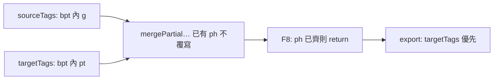

# Bug Report：mqxliff bpt/ept 內層標記不一致（TM `<pt>` vs 原文 `<g>`）

> **建立**：2026-06-04  
> **狀態**：**已修**（`reconcileTargetTagsMarkupFromSource`：匯入／F8／effectiveTags／匯出以 `sourceTags` 內層標記覆寫不一致之 `targetTags`）  
> **專案**：1UP TMS — CAT 工具（`cat-tool/`）  
> **範例檔**：`[zho-TW][16347629][Companion - June 2nd][app-strings-v4_.xml_en.docx].xlf_zho-TW.mqxliff` — `trans-unit id="41"`（列表第 41 行）

本文採雙層結構：**Part 1** 白話摘要；**Part 2** 技術根因、修正與驗收。與 [`bug-report_mqxliff-tag-issues.md`](./bug-report_mqxliff-tag-issues.md) **Bug #7** 對照。

---

## Part 1 — 白話摘要

### 1.1 發生什麼事

- 原文行內標記是 **`<g>`**（群組／格式包一層），譯文卻變成 **`<pt>`**（memoQ 另一種成對標記寫法）。
- 在 CAT 裡按 **F8** 補 tag 時，畫面上**已經有** `{1}`、`{/1}` 小方塊，但**不會**把底層 XML 從 `<pt>` 改回 `<g>`。
- **匯出** mqxliff 後，用 memoQ 開檔會出現「pt 未定義」「譯文多出 pt」「缺少 g」等警告；**只有少數句**（例如第 41 行）會中招，其餘類似句正常。

### 1.2 為什麼常常只有一句壞掉

該句曾被 **翻譯記憶（TM）** 以約 80% 相似度填入；TM 參考句裡用的是 **`<pt x="1">`**，而**本句原文**是 **`<g id="i3">`**。全檔多數句段的 TM 參考與原文一致（都是 `<g>`），所以看起來像「不穩定、唯獨第 41 行」。

### 1.3 與其他已知問題的差別

| 問題 | 現象 | 本 bug |
|------|------|--------|
| Bug #5 部分 `targetTags` | 譯文少幾個 `{N}`，pill 變純文字 | 佔位**齊**，但 **xml 內容錯**（pt vs g） |
| F8 空陣列退化 | 按 F8 後整行變純文字 | 有 pill，但仍是 pt |
| QA「缺少 tag」 | 誤報缺 tag | 不適用（佔位已在） |

### 1.4 需要你決定的事項（已採納）

- **僅 mqxliff**：bpt/ept 內跳脫的 `<g>`／`<pt>` 為 memoQ 常見；其他格式日後再擴充。
- **以原文為準**：不把 `<g>` 自動改成 `<pt>`，與 memoQ「譯文應對齊原文行內 tag」一致。
- **不改譯文字串**：只修正 `targetTags` 的 `xml`／`display`，不動 `targetText` 字面。

---

## Part 2 — 技術細節

### 2.1 範例句段 XML（匯出檔實測）

`trans-unit id="41"`（**不是** `id="13"`）：

**原文**

```xml
<source>Capacity: <bpt id="1" rid="1">&lt;g id="i3"&gt;</bpt>[1]<ept id="2" rid="1">&lt;/g&gt;</ept></source>
```

**譯文（錯誤）**

```xml
<target>人數上限：<bpt id="3" rid="2">&lt;pt x="1"&gt;</bpt>[1]<ept id="4" rid="2">&lt;/pt&gt;</ept></target>
```

**同句 `mq:insertedmatch`（TM 參考，Alpha PM，80%）— 全檔唯一使用 `<pt>` 的 insertedmatch**

```xml
<source>Capacity: <bpt …>&lt;pt x="1"&gt;</bpt>[1]<ept …>&lt;/pt&gt;</ept> players</source>
<target>名額：<bpt …>&lt;pt x="1"&gt;</bpt>[1]<ept …>&lt;/pt&gt;</ept>位玩家</target>
```

對照：`trans-unit id="42"`、`id="60"` 等原文／譯文／TM 皆為 `<g>`，匯出正常。

### 2.2 根因（三層疊加）



| 層 | 位置 | 行為 |
|----|------|------|
| 匯入 | [`cat-tool/js/xliff-build-segments.js`](../cat-tool/js/xliff-build-segments.js) `mergePartialTargetTagsFromSource` | `existingPhs.has(ph)` → **不覆寫**已存在之 `targetTags` 條目（保留 TM 的 pt `xml`） |
| 編輯 | [`cat-tool/app.js`](../cat-tool/app.js) `insertNextMissingTag` | `{1}`、`{/1}` 已在譯文 → **F8 直接 return**；push 僅限 ph 不存在 |
| 編輯 | `mergeTargetTagsFromSourceForPresentPlaceholders` | `existingPhs.size >= presentPhs.size` → **不補、不對齊** |
| 匯出 | [`cat-tool/js/xliff-tag-pipeline.js`](../cat-tool/js/xliff-tag-pipeline.js) | `targetTags.length > 0` → `replacePlaceholders` 用譯文側 **pt** `xml` |

CAT 匯入後句段形狀：原文 `sourceText` 為 `Capacity: {1}[1]{/1}`（`{N}` 對應 bpt/ept）；`sourceTags` 內 `xml` 含 `&lt;g`；`targetTags` 內 `xml` 含 `&lt;pt`。

### 2.3 修正方案（已落地）

**共用**：[`cat-tool/js/xliff-tag-pipeline.js`](../cat-tool/js/xliff-tag-pipeline.js)

| 函式 | 說明 |
|------|------|
| `innerEscapedTagSig(xml)` | 自 bpt/ept 序列化字串取出內層 `&lt;tag`／`&lt;/tag` 簽名（如 `open:g`、`close:pt`） |
| `reconcileTargetTagsMarkupFromSource(sourceTags, targetTags)` | 同 `ph` 且內層簽名與原文不同 → 以 `sourceTags` 條目**覆寫** |

| 步驟 | 觸點 |
|------|------|
| **E1 匯入** | `xliff-build-segments.js`：mqxliff 單段 TU，於 `mergePartialTargetTagsFromSource` **之後**呼叫 reconcile |
| **E2 編輯** | `app.js`：`mergeTargetTagsFromSourceForPresentPlaceholders`、`insertNextMissingTag`（佔位已齊仍 reconcile）、`effectiveTags` 讀取前 |
| **E3 匯出** | `exportXliffFamilyToBlob`：mqxliff 在 `replacePlaceholders` 前對 `tags` 陣列 reconcile |

**靜態輸出**：變更 `cat-tool/` 後須 `npm run sync:cat`；見 [`AGENTS.md`](../AGENTS.md)。

### 2.4 驗收步驟（白話）

1. 匯入含 `trans-unit id="41"` 的 Companion mqxliff（或已開啟之團隊作業檔）。
2. 看第 41 句譯文 tag pill 摘要應為 **`<g>`** 相關，而非 `<pt>`。
3. 匯出 mqxliff，用記事本開該句 `<target>`：bpt/ept 內應為 `&lt;g id="i3"&gt;`／`&lt;/g&gt;`，**不是** `&lt;pt`。
4. memoQ 開匯出檔：該句不應再出現「undefined tag pt」「missing g」（第 42 句等仍正常）。

### 2.5 與 Bug #5 的關係

Bug #5 處理「**缺 ph**」；本 bug 處理「**ph 齊但 xml 內層不同**」。`mergePartialTargetTagsFromSource` 的「已存在不覆寫」對兩者皆適用；reconcile 為互補層。見 [`bug-report_mqxliff-partial-target-tags.md`](./bug-report_mqxliff-partial-target-tags.md) §2.9。

---

## 相關文件

- [`bug-report_mqxliff-tag-issues.md`](./bug-report_mqxliff-tag-issues.md) — Bug #7 總表列  
- [`CAT_MQXLIFF_TM_FIX_IMPLEMENTATION_PLAN.md`](./CAT_MQXLIFF_TM_FIX_IMPLEMENTATION_PLAN.md) — 階段 E  
- [`bug-report_mqxliff-partial-target-tags.md`](./bug-report_mqxliff-partial-target-tags.md) — Bug #5  
- [`bug-report_f8-targettags-empty-fallback-regression.md`](./bug-report_f8-targettags-empty-fallback-regression.md) — F8／effectiveTags  
- [`XLIFF_TAG_PIPELINE.md`](./XLIFF_TAG_PIPELINE.md) — bpt/ept 佔位模型  
- [`CODEMAP.md`](./CODEMAP.md) — 程式路徑索引
