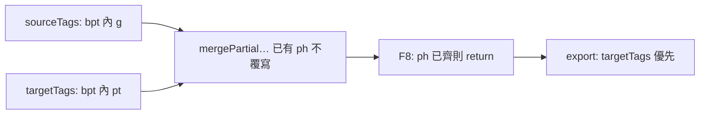

# Bug Report：mqxliff bpt/ept 內層標記不一致（TM `<pt>` vs 原文 `<g>`）

> **建立**：2026-06-04  
> **狀態**：**已修並驗收**（`d1ab161` — `reconcileTargetTagsMarkupFromSource`）  
> **驗收**：產品端依 Companion mqxliff 第 41 句重測通過（匯出 `<target>` 為 `g`、memoQ 無 pt 警告）  
> **專案**：1UP TMS — CAT 工具（`cat-tool/`）  
> **範例檔**：`[zho-TW][16347629][Companion - June 2nd][app-strings-v4_.xml_en.docx].xlf_zho-TW.mqxliff` — `trans-unit id="41"`（列表第 41 行）

本文採雙層結構：**Part 1** 白話摘要；**Part 2** 技術根因、調查、修正與驗收。與 [`bug-report_mqxliff-tag-issues.md`](./bug-report_mqxliff-tag-issues.md) **Bug #7** 對照。

---

## Part 1 — 白話摘要

### 1.1 發生什麼事

- 原文行內標記是 **`<g>`**（群組／格式包一層），譯文卻變成 **`<pt>`**（memoQ 另一種成對標記寫法）。
- 在 CAT 裡按 **F8** 補 tag 時，畫面上**已經有** `{1}`、`{/1}` 小方塊，但**不會**把底層 XML 從 `<pt>` 改回 `<g>`。
- **匯出** mqxliff 後，用 memoQ 開檔會出現「pt 未定義」「譯文多出 pt」「缺少 g」等警告；**只有少數句**（例如第 41 行）會中招，其餘類似句正常。

### 1.2 為什麼常常只有一句壞掉

該句曾被 **翻譯記憶（TM）** 以約 80% 相似度填入；TM 參考句裡用的是 **`<pt x="1">`**，而**本句原文**是 **`<g id="i3">`**。全檔多數句段的 TM 參考與原文一致（都是 `<g>`），所以看起來像「不穩定、唯獨第 41 行」。

### 1.3 與其他已知問題的差別

| 問題 | 現象 | 本 bug |
|------|------|--------|
| Bug #5 部分 `targetTags` | 譯文少幾個 `{N}`，pill 變純文字 | 佔位**齊**，但 **xml 內容錯**（pt vs g） |
| F8 空陣列退化 | 按 F8 後整行變純文字 | 有 pill，但仍是 pt |
| QA「缺少 tag」 | 誤報缺 tag | 不適用（佔位已在） |
| QA「尚有未關閉之標籤」 | 獨立 `<ph>` 誤報 | 無關（見 [`bug-report_qa-tag-unclosed-false-positive_2026-06.md`](./bug-report_qa-tag-unclosed-false-positive_2026-06.md)） |

### 1.4 產品決策（已採納並落地）

- **僅 mqxliff**：bpt/ept 內跳脫的 `<g>`／`<pt>` 為 memoQ 常見；其他格式日後再擴充。
- **以原文為準**：不把 `<g>` 自動改成 `<pt>`，與 memoQ「譯文應對齊原文行內 tag」一致。
- **不改譯文字串**：只修正 `targetTags` 的 `xml`／`display`，不動 `targetText` 字面。

---

## Part 2 — 技術細節

### 2.1 時間軸

| 日期 | 事項 |
|------|------|
| 2026-06-04 | 使用者回報：Companion mqxliff **第 41 行** F8 插入／匯出後 tag 錯誤（譯文 `<pt>`、原文 `<g>`）；同檔其他類似句正常 |
| 2026-06-04 | 比對匯出檔 `Translated_…mqxliff`：鎖定 `trans-unit id="41"`；發現全檔**唯一** `mq:insertedmatch` 內層為 `<pt>`（Alpha PM TM） |
| 2026-06-04 | 對照既有文件：Bug #5「只補缺 ph、已存在不覆寫」、F8 佔位已齊即 return；撰寫本專文與 [`CAT_MQXLIFF_TM_FIX_IMPLEMENTATION_PLAN.md`](./CAT_MQXLIFF_TM_FIX_IMPLEMENTATION_PLAN.md) 階段 E |
| 2026-06-04 | 程式落地並推送 **`d1ab161`**：`innerEscapedTagSig` + `reconcileTargetTagsMarkupFromSource`（E1 匯入／E2 編輯／E3 匯出） |
| 2026-06-04 | **產品驗收成功**：重開檔／F8／匯出後第 41 句為 `g`；memoQ 無 pt 相關錯誤；第 42 句等迴歸正常 |

### 2.2 調查過程（如何鎖定根因）

1. **畫面**：列表第 41 行原文 pill 顯示 `<g id="i3">` 一類資訊，譯文 pill 顯示 `<pt x="1">`（或類似）；第 42 行兩側皆為 `<g id="i4">`。
2. **匯出檔 XML**：開啟 `Translated_[zho-TW][16347629][Companion - June 2nd][app-strings-v4_.xml_en.docx].xlf_zho-TW.mqxliff`，直接讀 `trans-unit id="41"` 的 `<source>`／`<target>`（見 §2.3）。
3. **memoQ 中繼**：同句 `<mq:errors40>` 含 `Tag "pt" is not defined`；`<mq:warnings40>` 含 `Extra tag in target: "pt"`、`Tag "g" is missing from the target` — 證實問題在**譯文 XML 元素型別**，非純顯示。
4. **TM 線索**：同 TU 下 `<mq:insertedmatch matchrate="80">` 的參考句為「Capacity: … `<pt>` … players」；與本句原文「Capacity: … `<g>` …」**無**尾端 `players` 但仍共用相似 TM 殘留。
5. **程式對照**：`mergePartialTargetTagsFromSource` 與 `mergeTargetTagsFromSourceForPresentPlaceholders` 在 **ph 已存在** 時不更新 `xml`；`insertNextMissingTag` 在佔位已齊時 early return；匯出 `tags = targetTags` 優先 — 與「F8 無效、匯出仍 pt」一致。

**易混淆點**：列表「第 41 行」對應 **`trans-unit@id="41"`**，不是 `id="13"` 或其他 TU。

### 2.3 範例句段 XML（修正前匯出檔實測）

`trans-unit id="41"`：

**原文（正確）**

```xml
<source xml:space="preserve" mq:segpart="41" …>Capacity: <bpt id="1" rid="1">&lt;g id="i3"&gt;</bpt>[1]<ept id="2" rid="1">&lt;/g&gt;</ept></source>
```

**譯文（錯誤 — 修正前）**

```xml
<target xml:space="preserve" state="final">人數上限：<bpt id="3" rid="2">&lt;pt x="1"&gt;</bpt>[1]<ept id="4" rid="2">&lt;/pt&gt;</ept></target>
```

**同句 TM 參考（全檔唯一 `<pt>` insertedmatch）**

```xml
<mq:insertedmatch matchtype="0" source="WIZA - Web &amp; Marketing - Master - en-us-zh-TW / Alpha PM" matchrate="80" …>
  <source>Capacity: <bpt …>&lt;pt x="1"&gt;</bpt>[1]<ept …>&lt;/pt&gt;</ept> players</source>
  <target>名額：<bpt …>&lt;pt x="1"&gt;</bpt>[1]<ept …>&lt;/pt&gt;</ept>位玩家</target>
</mq:insertedmatch>
```

**對照句（正常）**

- `trans-unit id="42"`：原文／譯文 bpt/ept 內皆 `&lt;g id="i4"&gt;`。
- `trans-unit id="60"`：同為「Capacity: … `<g id="i6">` …」結構，譯文亦為 `g`。

**CAT 內部表示（匯入後）**

| 欄位 | 第 41 句（錯誤態） |
|------|-------------------|
| `sourceText` | `Capacity: {1}[1]{/1}`（字面 `[1]` 為原文占位，非 XLIFF `{N}`） |
| `sourceTags[].xml` | bpt/ept 序列化字串，內層 `&lt;g id="i3"&gt;`／`&lt;/g&gt;` |
| `targetText` | 已有 `{1}`、`{/1}` |
| `targetTags[].xml` | bpt/ept 序列化字串，內層 **`&lt;pt x="1"&gt;`**／`&lt;/pt&gt;`（來自 TM 譯文） |

### 2.4 根因（三層疊加）



| 層 | 位置 | 修正前行為 |
|----|------|------------|
| 匯入 | [`xliff-build-segments.js`](../cat-tool/js/xliff-build-segments.js) `mergePartialTargetTagsFromSource` | `existingPhs.has(ph)` → **不覆寫**已存在 `targetTags`（保留 TM 的 pt `xml`） |
| 編輯 | [`app.js`](../cat-tool/app.js) `insertNextMissingTag` | `{1}`、`{/1}` 已在譯文 → **F8 return**；僅 ph 不存在時 push |
| 編輯 | `mergeTargetTagsFromSourceForPresentPlaceholders` | `existingPhs.size >= presentPhs.size` → **提前 return**，不對齊內層 |
| 匯出 | [`xliff-tag-pipeline.js`](../cat-tool/js/xliff-tag-pipeline.js) | `targetTags.length > 0` → `replacePlaceholders` 寫回 **pt** |

與 Bug #5 的關係：Bug #5 補「**缺 ph**」；本 bug 在「**ph 齊、xml 內層錯**」。兩者共用「已存在條目不覆寫」假設，需 **reconcile** 互補（見 [`bug-report_mqxliff-partial-target-tags.md`](./bug-report_mqxliff-partial-target-tags.md) §2.9）。

### 2.5 修改過程（`d1ab161`）

#### 設計原則

對 bpt/ept 類 tag：自 `tag.xml` 抽出內層跳脫標記簽名（`open:g`、`close:pt` 等）；若同 `ph` 的 `sourceTags` 與 `targetTags` 簽名不同，**以原文條目覆寫**（`ph`／`pairNum` 不變，只換 `xml`／`display`）。

#### E0 — 共用函式（`xliff-tag-pipeline.js`）

```javascript
function innerEscapedTagSig(xml) {
    // 自 &lt;tag 或 &lt;/tag 取 open:g / close:pt
}
function reconcileTargetTagsMarkupFromSource(sourceTags, targetTags) {
    // 同 ph、srcSig 有值且 tgtSig !== srcSig → targetTags[i] = { ...source }
}
```

掛載於 `window.CatToolXliffTags`，供匯入、編輯器、匯出共用。

#### E1 — 匯入（`xliff-build-segments.js`）

mqxliff 單段 TU：在 `augmentTargetTagsForPlainInlineMemoQ`、`mergePartialTargetTagsFromSource` **之後**呼叫 `reconcileTargetTagsMarkupFromSource(sourceTags, targetTags)`。

→ **開檔即**把 TM 殘留 pt 對齊為原文 g（含已入庫舊檔重匯入場景）。

#### E2 — 編輯器（`app.js`）

| 觸點 | 變更 |
|------|------|
| `mergeTargetTagsFromSourceForPresentPlaceholders` | 移除「ph 已齊即 return」；補缺 ph 後一律 reconcile |
| `insertNextMissingTag` | 若 `missingTags` 為空（佔位已齊），仍執行 reconcile；有變更則 `applyUpdateSegmentTarget` 寫回 `targetTags` |
| `effectiveTags` | 經 merge helper 間接 reconcile，重畫 pill 前對齊 |

→ 使用者對第 41 句**再按一次 F8** 即可修正 `targetTags`，無需刪光佔位重插。

#### E3 — 匯出防線（`xliff-tag-pipeline.js`）

`exportXliffFamilyToBlob`：format 為 `mqxliff` 時，在 `replacePlaceholders` 前對 `tags` 淺拷貝陣列執行 reconcile（以 `seg.sourceTags` 為準）。

→ 即使記憶體／DB 仍殘留 pt，匯出檔也不應再寫入 `<pt>`。

#### 建置

- `npm run sync:cat` → 同步 [`public/cat/`](../public/cat/)。

### 2.6 修正後預期行為（驗收通過）

| 檢查項 | 預期 | 驗收結果 |
|--------|------|----------|
| 開檔第 41 句譯文 pill | 顯示 **g** 相關摘要，非 pt | **通過** |
| F8（佔位已齊） | 仍觸發對齊並寫庫 | **通過** |
| 匯出 `trans-unit id="41"` `<target>` | `&lt;g id="i3"&gt;`／`&lt;/g&gt;` | **通過** |
| memoQ 開匯出檔 | 無 undefined/extra **pt**、無 missing **g**（該句） | **通過** |
| 第 42、60 句等 | 仍為 `g`，無迴歸 | **通過** |

### 2.7 驗收步驟（可重跑）

1. 部署或本機載入含 **`d1ab161`** 之 CAT（`cat-tool`／`public/cat`），**強制重新整理**頁面。
2. 開啟 `[zho-TW][16347629][Companion - June 2nd][app-strings-v4_.xml_en.docx].xlf_zho-TW.mqxliff`（或團隊版同檔）。
3. 定位**列表第 41 行**（原文 `Capacity:`／譯文 `人數上限：`）。
4. 確認譯文 tag pill 為 **g**；可選：對該句再按 **F8** 一次。
5. **匯出** mqxliff，記事本檢視 `trans-unit id="41"` 的 `<target>` 內層為 `g`。
6. memoQ 開匯出檔，確認該句無 pt／缺 g 類警告；抽查第 42 句仍正常。

**若舊作業檔 DB 仍殘留 pt**：重匯入、或開檔後對第 41 句按 F8、或僅匯出（E3 防線）應仍可得到正確 XML。

### 2.8 維護邊界

- **不處理**：裸 `<pt>` 元素（非 bpt/ept 包裝）— 目前 `extractTaggedText` 未將 `<pt>` 列為行內元素；若日後出現需另案。
- **不將 g 改為 pt**：僅單向以原文覆寫譯文 metadata。
- **standalone `<ph>`**：無 bpt 內層 `&lt;tag` 簽名時 reconcile **跳過**，不影響 mq:ch 等 ph。

---

## 相關文件

- [`bug-report_mqxliff-tag-issues.md`](./bug-report_mqxliff-tag-issues.md) — Bug #7 總表列  
- [`CAT_MQXLIFF_TM_FIX_IMPLEMENTATION_PLAN.md`](./CAT_MQXLIFF_TM_FIX_IMPLEMENTATION_PLAN.md) — 階段 E（**已驗收**）  
- [`bug-report_mqxliff-partial-target-tags.md`](./bug-report_mqxliff-partial-target-tags.md) — Bug #5 §2.9  
- [`bug-report_f8-targettags-empty-fallback-regression.md`](./bug-report_f8-targettags-empty-fallback-regression.md) — F8／effectiveTags  
- [`XLIFF_TAG_PIPELINE.md`](./XLIFF_TAG_PIPELINE.md) — bpt/ept 佔位模型  
- [`CODEMAP.md`](./CODEMAP.md) — 程式路徑索引
