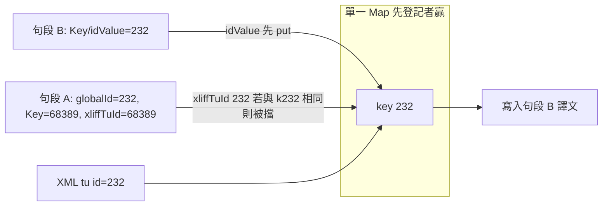

# Bug Report：mqxliff 匯出查找撞鍵（ID 與 Key 數字衝突 → 寫入別句譯文）

> **狀態**：**已修復**（2026-06-03，`340636d`；NED 樣本待產品端複驗）  
> **代表樣本**：`NED 20260601 - Batch 9 - Dialogue Lines (NED)_2.csv_…_zho-TW.mqxliff`（CSV／Excel 衍生 memoQ 雙語）  
> **修正觸點**：[`cat-tool/js/xliff-tag-pipeline.js`](../cat-tool/js/xliff-tag-pipeline.js)、[`cat-tool/js/file-update.js`](../cat-tool/js/file-update.js)、[`cat-tool/app.js`](../cat-tool/app.js)（匯出前警示）  
> **相關（不同症狀）**：[`bug-report_mqxliff-export-segment-lookup-fail_2026-06.md`](./bug-report_mqxliff-export-segment-lookup-fail_2026-06.md)（`4fef922`：查找失敗 → **跳過**、保留舊 XML）

本文採雙層結構：**Part 1** 白話；**Part 2** 技術與維護。

---

## Part 1 — 白話摘要

### 1.1 現象

| 位置 | 預期 | 實際（修正前） |
|------|------|----------------|
| CAT 編輯器（例：ID 223–233） | 譯文與原文列正確 | **正確** |
| 匯出 mqxliff | 與編輯器相同 | **完全不相關的別句譯文** |

**可重現規律（產品端觀察，無例外）**：

- 匯出錯的那一列，畫面上的 **ID**（匯入序號 `globalId`）  
  **剛好等於** 被寫進 XML 那句的 **Key**（試算表／字串 id，存於 `idValue`）。  
- 例：ID **232** 列應為 Key **68389** 的對話；匯出卻變成 Key **232** 那句的譯文。

截圖常見：ID 232→233 遞增，Key 68389→68388 **遞減**（兩欄本來就不是同一套編號）。

### 1.2 與「S1 匯出仍是第一次匯入內容」的差別

| | S1（`4fef922` 已修） | 本 bug |
|--|---------------------|--------|
| 匯出結果 | 舊原文照貼（沒寫入） | **別句譯文**（有寫入、寫錯格） |
| 主因 | `tu.id` 對不到 → 跳過 | 字串 `"232"` **撞鍵** → 對到別句 |

### 1.3 根因（一句話）

匯出把 **`xliffTuId`、`idValue`（Key）、`globalId`（ID 數字）** 全丟進**同一張**查找表，且 **先登記的字串永遠佔用**；當某句 Key 為 `"232"`、另一句 ID 為 232 時，XML 的 `trans-unit id="232"` 會查到 **Key=232 那句**，不是 **ID=232 那句**。

### 1.4 怎麼修

1. **匯出**：`xliffTuId` 獨立表、可覆寫；**不再**把 `globalId`／`rowIdx` 登記進查找表；**移除**「第 N 個 TU = globalId N」序號後備（避免靜默錯寫）。  
2. **更新作業檔**：內容不變時仍 patch `xliffTuId`／`globalId`，方便 backfill。  
3. **匯出前**：若疑似撞鍵對到錯句，Modal 白話警示。

### 1.5 暫時迴避（修正前）

- 勿假設「再更新作業檔」即可；在撞鍵邏輯未修前仍可能錯寫。  
- 緊急：刪檔重匯前請備份譯文。  
- 除錯：`localStorage.setItem('catToolDebugXliffExport','1')` 後匯出，看主控台是否出現 `ambiguous export lookup`。

### 1.6 驗收步驟（修後）

1. 部署含修正的 CAT（`npm run sync:cat` 後的 `public/cat`）。  
2. 開啟 NED 樣本 → 建議用**目前作業 mqxliff** 再跑一次**更新作業檔**（backfill `xliffTuId`）。  
3. 抽查 ID **232–235**：編輯器譯文與匯出 `<target>` 一致；**不得**出現 Key=232 的譯文寫進 ID=232 列（Key 應為 68389 等）。  
4. 回歸 S1：[`bug-report_mqxliff-export-segment-lookup-fail_2026-06.md`](./bug-report_mqxliff-export-segment-lookup-fail_2026-06.md) §2.6。  
5. 匯出時不應出現大量「無法對應」或「可能對錯句」警示。

---

## Part 2 — 技術細節

### 2.1 UI 欄位 vs DB

| UI | DB 欄位 | 說明 |
|----|---------|------|
| **ID** | `globalId` | 匯入掃描序（1、2、3…）；列表預設排序用此欄 |
| **Key** | `idValue` 第一行 | memoQ `x-mmq-context` 或 fallback `trans-unit@id` |
| （無獨立欄） | `xliffTuId` | **匯出主鍵** = `trans-unit@id` |

列表排序預設**不是**依 Key；見 [`app.js`](../cat-tool/app.js) `applySorting`（`col-id` → `globalId`）。

### 2.2 撞鍵機制（修正前）

`registerSegmentExportKeys`（修正前）對同一 `Map` 呼叫 `put`，且 `if (!map.has(k))` 才寫入。

### 2.3 修正內容

#### A. `xliff-tag-pipeline.js`

| 項目 | 說明 |
|------|------|
| `buildSegmentExportLookupMap` | 回傳 `{ byTuId, byAux, get, has }`；`byTuId` 以 `xliffTuId` **覆寫**登記 |
| `registerSegmentExportKeys` | 有句段 `xliffTuId` 時**不**把 `idValue` 灌進 `byAux`；**不**登記 `globalId`／`rowIdx` |
| `findSegmentForTransUnit` | 先 `byTuId` 再 `byAux`；**移除** globalId 序號 fallback |
| `countXliffExportLookupMisses` | 增加 `ambiguous` 計數（`xliffTuId` 與 TU `id` 不一致卻透過輔助鍵命中） |

#### B. `file-update.js`

`contentEqual` 的 `keep`／僅位置 patch 路徑：仍 patch `xliffTuId`、必要時 `globalId`。

#### C. `app.js`

`confirmXliffExportLookupMissesIfNeeded`：`ambiguous > 0` 時追加白話說明（可能對錯句）。

### 2.4 第二風險（已一併移除）

`findSegmentForTransUnit` 曾以 `globalId === tuIndex + 1` 後備：XML 句序與 DB `globalId` 不一致時也會錯寫。已移除；寧可 miss + 警示。

### 2.5 相關文件

- 管線：[`XLIFF_TAG_PIPELINE.md`](./XLIFF_TAG_PIPELINE.md) §4.5、§4.6、§8  
- Cursor：`.cursor/rules/xliff-tag-export.mdc`  
- 查找跳過（已修）：[`bug-report_mqxliff-export-segment-lookup-fail_2026-06.md`](./bug-report_mqxliff-export-segment-lookup-fail_2026-06.md)
- 同檔 NED、**同句** tag 錯（非整句換行）：[`bug-report_mqxliff-targettags-xml-mismatch-f8_2026-06.md`](./bug-report_mqxliff-targettags-xml-mismatch-f8_2026-06.md)（`targetTags`／F8）

### 2.6 除錯檢查清單

1. `xliff-tag-pipeline.js` 是否含 `byTuId`／`byAux`，且無 `globalId` 註冊進匯出 Map。  
2. 問題句 `seg.xliffTuId` 是否等於 XML `trans-unit@id`。  
3. `localStorage catToolDebugXliffExport=1` → 匯出時查 `ambiguous` 警告。  
4. Team：`cat_segments.xliff_tu_id` 是否有值；無則先**更新作業檔**。

---

## 附錄：人工構造測試

1. 兩句：A=`globalId=232`, `idValue=68389`, `xliffTuId=68389`；B=`idValue=232`（無 xliffTuId 或不同 TU）。  
2. XML 中 A 對應 `trans-unit id="68389"`。  
3. 匯出 A 的 `<target>` 必須是 A 的 `targetText`，不得為 B。
