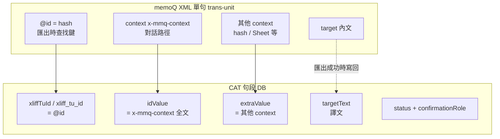

# Bug Report：mqxliff 匯出時句段查找失敗，譯文與確認狀態未寫回 XML

> **狀態**：**已修復並驗收通過**（2026-06-03，產品端實測）  
> **代表樣本**：`【S1】支线-处理后_zh-TW.xliff_zho-TW.mqxliff`（memoQ 遊戲對話／Excel 雙語匯出）  
> **修正 commit**：`4fef922`（完整修復）｜`b0e7f5e`（第一版 partial，已取代）  
> **程式觸點**：[`xliff-build-segments.js`](../cat-tool/js/xliff-build-segments.js)、[`xliff-tag-pipeline.js`](../cat-tool/js/xliff-tag-pipeline.js)、[`file-update.js`](../cat-tool/js/file-update.js)、[`app.js`](../cat-tool/app.js)、[`cat-cloud-rpc.ts`](../src/lib/cat-cloud-rpc.ts)  
> **資料庫**：[`supabase/migrations/20260603120000_cat_segments_xliff_tu_id.sql`](../supabase/migrations/20260603120000_cat_segments_xliff_tu_id.sql)

本文採雙層結構：**Part 1** 白話說明（現象、原因、怎麼修、怎麼驗）；**Part 2** 技術細節（資料流、程式與維護邊界）。

---

## Part 1 — 白話摘要

### 1.1 使用者操作流程（觸發案例）

1. 匯入 mqxliff：`【S1】支线-处理后_zh-TW.xliff_zho-TW.mqxliff`（譯文欄多為原文照貼）。
2. 用另一檔 `260603_zho-TW.mqxliff` 執行**更新作業檔**（專案內檔名不變，底層 XML 換成新版）。
3. 在 CAT 內跑 **AI 翻譯**；編輯器譯文欄與確認狀態看起來正確。
4. 匯出 `Translated_【S1】…mqxliff` → 打開後 **`<target>` 仍是第一次匯入的內容**，**memoQ 確認狀態也回到舊檔**。

### 1.2 現象（修正前）

| 位置 | 預期 | 實際 |
|------|------|------|
| CAT 編輯器譯文欄 | AI／手動譯文 | 正確 |
| CAT 編輯器狀態欄 | 已確認（綠勾等） | 正確 |
| 匯出 mqxliff 的 `<target>` | 與編輯器相同 | **第一次匯入時的原文照貼** |
| 匯出 mqxliff 的 `mq:status`／`target@state` | 與編輯器一致 | **維持舊 XML** |

典型句段（樣本）：ID 2631／2632，原文「打擾一下……」，編輯器已譯、已確認，匯出檔 `<target>` 仍為原文。

### 1.3 根因（一句話）

**匯出時用 XML 的 `trans-unit id`（hash）找句段，但資料庫裡用來建索引的主要是 `idValue`（對話路徑），兩者對不起來 → 整句被跳過 → XML 裡舊的譯文與狀態原封不動留下。**

### 1.4 為什麼編輯器對、匯出錯？

- **編輯器**讀的是資料庫的 `targetText`、`status`（Dexie 或 Supabase），與 XML 無關。
- **匯出**會重新打開 `originalFileBuffer`（更新作業檔後為 `260603…` 那份 XML），逐句把 DB 譯文**寫回**對應的 `<trans-unit>`。
- 若某一句「對不到」DB 句段，程式 `return` 跳過該 TU → 不更新 `<target>`、不更新 `mq:status`。

### 1.5 為什麼「用不同檔名更新作業檔」不是主因？

- 更新作業檔只替換**雲端／本機存的原始 XML**（`originalFileBuffer`），專案列表上的**檔名**仍是 `【S1】…mqxliff`。
- 合併句段時比對的是 **`idValue` 全文**（更新作業檔邏輯），與匯出比對的 **`trans-unit@id`** 是兩套鍵。
- 因此「檔名不同」本身不會直接造成匯出失敗；真正問題是 **匯出鍵與 `idValue` 語意分離**。

### 1.6 第一版修復為何仍失敗（`b0e7f5e`）

曾假設：`idValue` 多行時**第一行**就是 hash，與 `tu.id` 相同。

實務上（遊戲對話 mqxliff）：

- **`idValue`** = `<context context-type="x-mmq-context">` → **對話路徑**（Key 欄的 `DT_DialogueInfo_…`）
- **hash** 常在 **額外資訊**（其他 `context-type`），不在 `idValue` 第一行

故 first-line fallback **多數對不到**，使用者回報「一點改善都沒有」屬預期結果。

### 1.7 第二版怎麼修（`4fef922`）

1. **匯入／更新時**另存 **`xliffTuId`** = `trans-unit` 的 `id`（hash），與顯示用 `idValue` 分開。
2. **匯出**用多鍵查找：`xliffTuId` → `id`／`resname`／`mq:unitId` → `idValue` 各行 → 必要時 `globalId` 序號對齊。
3. **Team 模式**新增 DB 欄位 `xliff_tu_id` 持久化。
4. **匯出前**若仍有句對不到，跳出警示（避免再靜默匯出舊檔）。

### 1.8 驗收結果（2026-06-03）

產品端依下列步驟驗收**成功**：

1. 部署 `4fef922` + `supabase db push`（`xliff_tu_id` 欄位）。
2. Ctrl+F5 重開 CAT。
3. 對 `【S1】…mqxliff` 用 `260603_zho-TW.mqxliff` **再跑一次更新作業檔**（backfill `xliffTuId`）。
4. 匯出；抽查句段（含 2631／2632）：`<target>` 為 AI 譯文，確認狀態與編輯器一致。

---

## Part 2 — 技術細節

### 2.1 資料模型：三種「識別」不要混用



| 欄位 | 來源 | 用途 |
|------|------|------|
| `trans-unit@id` | XML 屬性 | **匯出**時在 XML 中定位 TU |
| `idValue` | `x-mmq-context` 或 fallback `id` | **UI Key**、**更新作業檔** `segmentMatchKey` |
| `xliffTuId` | 匯入時存 `fallbackId`（= `@id`） | **匯出主鍵**（與 `idValue` 分離） |
| `extraValue` | 非 `x-mmq-context` 的 context／note 等 | 額外資訊欄 |

匯入程式（[`xliff-build-segments.js`](../cat-tool/js/xliff-build-segments.js)）：

```javascript
const fallbackId = tu.getAttribute('id') || tu.getAttribute('resname') || tu.getAttribute('mq:unitId') || '';
// …
idValue: keyFromContext || fallbackId,
xliffTuId: fallbackId,
```

### 2.2 匯出失敗機制（修正前）

[`xliff-tag-pipeline.js`](../cat-tool/js/xliff-tag-pipeline.js) `exportXliffFamilyToBlob`：

```javascript
const seg = tuId ? segByTuId.get(tuId) : null;
if (!seg) return;  // 整句跳過：target、mq:status、state 皆不更新
```

`segByTuId` 若僅以 `idValue`（對話路徑）建 key，`get(tuId)`（hash）→ `undefined`。

### 2.3 第二版修正內容

#### A. 匯入／更新

- 所有單段 XLIFF／mqxliff 句段寫入 `xliffTuId`。
- sdlxliff 多段：`xliffTuId` = `` `${fallbackId}#${mid}` ``（與 `idValue` 一致）。
- [`file-update.js`](../cat-tool/js/file-update.js) merge 時 patch `xliffTuId`（incoming 優先，否則保留既有）。

#### B. 匯出查找（`xliff-tag-pipeline.js`）

| 函式 | 職責 |
|------|------|
| `registerSegmentExportKeys` | 註冊 `xliffTuId`、完整 `idValue`、各行、 `globalId`、`rowIdx+1` |
| `resolveTransUnitLookupKeys` | 從 TU 取 `id`、`resname`、`mq:unitId`（含 NS） |
| `findSegmentForTransUnit` | 依序查找；mqxliff 且句數一致時可 `globalId` 序號 fallback |
| `countXliffExportLookupMisses` | 匯出前統計對不到的句數 |

#### C. 匯出前警示（`app.js`）

`confirmXliffExportLookupMissesIfNeeded`：mqxliff／xliff 若 miss > 0，Modal 說明將保留 XML 原內容，建議先更新作業檔。

#### D. Team 資料庫

- Migration：`20260603120000_cat_segments_xliff_tu_id.sql`
- [`cat-cloud-rpc.ts`](../src/lib/cat-cloud-rpc.ts)：`mapSegmentRow`、`db.addSegments`、`db.refreshFileSegments` patch 映射 `xliff_tu_id`
- `apply_cat_segments_patch_batch` 支援 patch `xliff_tu_id`

### 2.4 Commit 對照

| Commit | 說明 | 結果 |
|--------|------|------|
| `b0e7f5e` | `idValue` 第一行 fallback | 遊戲對話檔多數無效 |
| `4fef922` | `xliffTuId` + 多鍵查找 + 匯出前警示 + DB 欄位 | **驗收通過** |

### 2.5 既有專案維護（無 `xliff_tu_id` 的舊句段）

| 做法 | 說明 |
|------|------|
| **建議** | 用**目前作業 mqxliff** 再執行一次「更新作業檔」→ incoming 帶 `xliffTuId` 寫入 DB |
| 替代 | 刪除檔案後重新匯入 |
| 僅部署程式、不 backfill | 可能靠 `globalId` 序號 fallback 部分生效；句數／順序變更時有錯配風險；匯出前可能出現 miss 警示 |

### 2.6 驗收步驟（維運／QA 可重複）

1. Team：確認 migration `20260603120000` 已套用；CAT 靜態檔含 `4fef922`（`xliff-tag-pipeline.js` 內有 `buildSegmentExportLookupMap`）。
2. 開啟目標 mqxliff → **更新作業檔**（現行作業檔）→ 確認譯文仍在。
3. 匯出；**不應**出現「大量句無法對應」警示（或僅極少數可接受）。
4. 下載 `Translated_*.mqxliff`，抽查：
   - `<target>` 與編輯器譯文一致（非原文照貼）。
   - `mq:status`／`target@state` 與編輯器確認狀態一致。
5. （選用）F12 → `localStorage.setItem('catToolDebugXliffExport','1')` 後匯出，觀察是否出現 `globalId order` fallback 警告（表示仍依賴後備路徑，建議補做更新作業檔）。

### 2.7 相關文件

- 管線總覽：[`XLIFF_TAG_PIPELINE.md`](./XLIFF_TAG_PIPELINE.md) §4.5、§8（修復歷史）
- Cursor 規則：`.cursor/rules/xliff-tag-export.mdc`
- 與本問題無關但易混淆：[`bug-report_mqxliff-team-role-persistence.md`](./bug-report_mqxliff-team-role-persistence.md)（T/R1/R2 雲端持久化，另一議題）

---

## 附錄：除錯檢查清單

若匯出仍異常，依序確認：

1. **前端版本**：Network 載入的 `xliff-tag-pipeline.js` 是否含 `xliffTuId`／`findSegmentForTransUnit`。
2. **句段是否有 `xliffTuId`**：Team 查 `cat_segments.xliff_tu_id`；離線可在匯出前於主控台對單句檢查 `seg.xliffTuId`。
3. **是否做過更新作業檔**（backfill）或重匯。
4. **匯出警示**：若 miss 接近 total，代表查找仍失敗，勿當成已修好。
5. **`originalFileBuffer`**：匯出用的是更新後 XML；與編輯器 DB 譯文是否仍為同一批句段（更新時大量刪除／新增會改變對應關係）。
