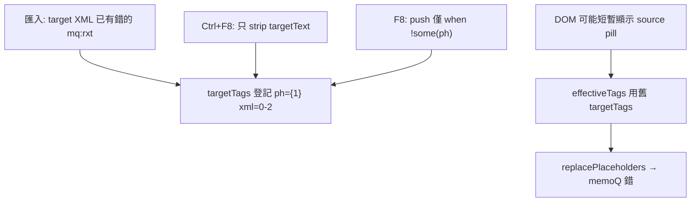

# Bug Report：mqxliff 譯文 targetTags 與原文 xml 不一致（F8／Ctrl+F8 無法改正）

> **狀態**：**已修復**（2026-06-04，`340636d`；NED 樣本 24／62／63 待產品端複驗）  
> **代表樣本**：`NED 20260601 - Batch 9 - Dialogue Lines (NED)_2.csv_…_zho-TW.mqxliff`  
> **程式觸點**：[`cat-tool/app.js`](../cat-tool/app.js)、[`cat-tool/js/xliff-tag-pipeline.js`](../cat-tool/js/xliff-tag-pipeline.js)、[`cat-tool/js/xliff-build-segments.js`](../cat-tool/js/xliff-build-segments.js)  
> **相關（不同症狀）**：[`bug-report_mqxliff-export-lookup-key-collision_2026-06.md`](./bug-report_mqxliff-export-lookup-key-collision_2026-06.md)（整句寫錯格）、[`bug-report_mqxliff-partial-target-tags.md`](./bug-report_mqxliff-partial-target-tags.md)（Bug #5：缺 ph）

本文採雙層結構：**Part 1** 白話與名詞；**Part 2** 技術與維護。

---

## Part 1 — 白話摘要

### 1.1 專有名詞（一句解釋）

| 名詞 | 白話 |
|------|------|
| **mqxliff** | memoQ 用的翻譯檔格式，句段裡有行內 **tag**（小方塊 pill）。 |
| **`mq:rxt`** | memoQ 常見的一種 tag，**`displaytext`** 裡常是說話者編號（例如 `[0-1…`、`[0-2…`）。 |
| **`targetText`** | 譯文「字串」，用 `{1}` 等佔位符代表 tag 位置。 |
| **`targetTags`** | 譯文 tag 的**目錄**（每個 `{1}` 對應一整段 XML）。**匯出 memoQ 主要看這份。** |
| **`sourceTags`** | 原文 tag 目錄；F8 應從這裡拿正確 XML。 |
| **F8** | 快捷鍵：插入下一個「譯文還沒帶」的 tag。 |
| **Ctrl+F8** | 快捷鍵：清除譯文裡所有 tag 佔位符。 |
| **紅／橘 pill** | 原文**紅**＝譯文沒有同內容的 tag；譯文**橘**＝比原文多出或內容不同的 tag。 |

### 1.2 現象

| 位置 | 預期 | 實際（修正前） |
|------|------|----------------|
| 第 **24、62、63** 行（全檔其餘正常） | F8／清除後重插可對齊原文 tag | **試幾遍仍錯** |
| 第 63 行（例） | 原文、譯文 tag 一致（如皆 `[0-1…`） | 原文 **`[0-1…`（紅）**、譯文 **`[0-2…`（橘）** |
| 匯出後在 memoQ | tag 顯示與 CAT 原文一致 | **譯文 tag 顯示錯誤文字** |

### 1.3 根因（一句話）

譯文 **tag 目錄（`targetTags`）** 在匯入時就登記了**錯的 XML**（例如 TM 帶入 `[0-2`），而 **Ctrl+F8 只清字串、不清目錄**，**F8 又不覆寫已存在的 `{1}`**；畫面短暫看似對，重畫／匯出仍用錯目錄。

### 1.4 與其他 mqxliff 問題的差別

| 議題 | 現象 |
|------|------|
| 匯出查找跳過（`4fef922`） | 整句沒寫入，像沒翻 |
| 匯出 ID／Key 撞鍵 | 整句譯文變成**別句** |
| **本議題** | **同一句**，tag 有插，但 **XML／displaytext 錯** |
| Bug #5 部分 targetTags | 譯文**少**幾個 `{N}`，變純文字 |
| Bug #7 bpt pt/g | 同 `{1}` 但 bpt 內層 `<pt>` vs `<g>`（**不含** `mq:rxt`） |

### 1.5 暫時迴避（修正前）

在 memoQ 把該句 **`<target>`** 的 `mq:rxt` 改成與 **`<source>`** 相同，再 **更新作業檔** 或重匯。僅在 CAT 重按 F8 **不可靠**。

### 1.6 驗收步驟（修後）

1. 開啟 NED 樣本，Ctrl+F5 重載 CAT。  
2. 第 **63** 行：原文、譯文 pill 的 `displaytext` **一致**（如皆 `[0-1…`），以**藍色**為主。  
3. **Ctrl+F8 → F8**、篩選、重開檔後仍正確。  
4. 匯出 mqxliff，在 memoQ 看該句 **target tag 文字與原文一致**。  
5. 第 **24** 行：F8 補缺 tag 後 pill 不退化（回歸 Bug #5）。  

---

## Part 2 — 技術細節

### 2.1 資料流

### 2.2 修正前程式缺口

| # | 位置 | 問題 |
|---|------|------|
| 1 | [`app.js`](../cat-tool/app.js) Ctrl+F8 | 未 `targetTags = []`、未寫庫 `target_tags` |
| 2 | `insertNextMissingTag` | `!targetTags.some(ph) push` 不覆寫同 ph |
| 3 | `onSourceTagInsertClick` | 同上 |
| 4 | `mergeTargetTagsFromSourceForPresentPlaceholders` | `existingPhs.has(ph) continue` |
| 5 | [`xliff-tag-pipeline.js`](../cat-tool/js/xliff-tag-pipeline.js) `reconcileTargetTagsMarkupFromSource` | `!innerEscapedTagSig` 時 **continue**，`mq:rxt` standalone 略過 |

### 2.3 修正內容（2026-06-04）

| 項 | 說明 |
|----|------|
| **F1** | `upsertTargetTagFromSource`：同 `ph` 且 xml 簽名不同 → 以 `sourceTags` 覆寫；用於 F8、點原文 tag、`mergeTargetTagsFromSourceForPresentPlaceholders` |
| **F2** | Ctrl+F8：`targetTags = []`，`setEditorHtml(stripped, [])`，`applyUpdateSegmentTarget(..., { targetTags: [] })` |
| **F3** | `reconcileTargetTagsMarkupFromSource`：`innerEscapedTagSig` 皆空時改比完整 `normalizeTagXmlForReconcile(xml)` |
| **F4** | mqxliff 匯入後呼叫 `reconcileTargetTagsMarkupFromSource`（與 mxliff 路徑一致） |

### 2.4 為何只有少數列（24、62、63）

全檔多數 TU 的 `<source>`／`<target>` tag **xml 一致**。僅少數句在進 CAT 前譯文 XML 已帶**不同**的 `mq:rxt`（TM／部分編輯）。第 **24** 行可能**同時**有 Bug #5（缺 ph 子集）。

### 2.5 相關文件

- [`bug-report_mqxliff-bpt-inner-markup-tm-mismatch_2026-06.md`](./bug-report_mqxliff-bpt-inner-markup-tm-mismatch_2026-06.md) — Bug #7（bpt/ept 內層）  
- [`CAT_MQXLIFF_TM_FIX_IMPLEMENTATION_PLAN.md`](./CAT_MQXLIFF_TM_FIX_IMPLEMENTATION_PLAN.md) — 階段 F  
- [`XLIFF_TAG_PIPELINE.md`](./XLIFF_TAG_PIPELINE.md) §4.7  

### 2.6 除錯

1. 選句段 → Console：`seg.sourceTags[0].xml` vs `seg.targetTags[0].xml`。  
2. Ctrl+F8 後確認 `seg.targetTags.length === 0`。  
3. F8 後兩者 xml 應一致；`updateTagColors` 應以藍為主。

---

## 附錄：與 commit `7c9345c` 的關係

**`7c9345c`** 為 **S1 匯出查找失敗** 之文件補遺（`4fef922`），**不包含**本議題。本 bug 需獨立 commit 與驗收。
