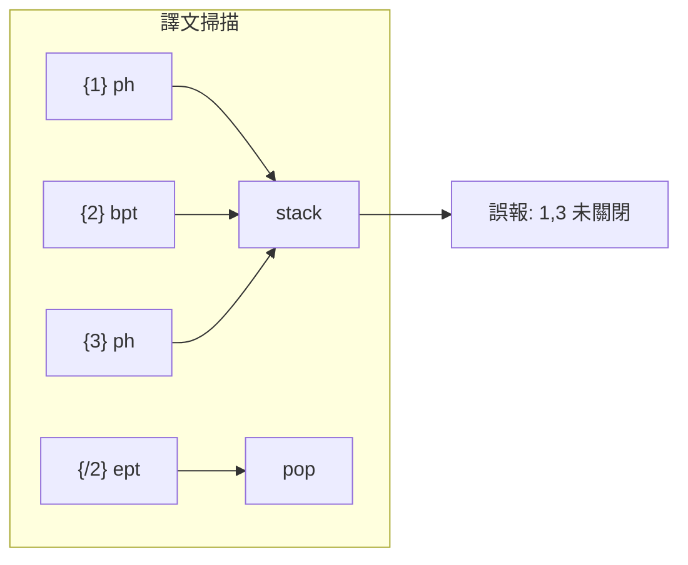

# Bug Report：QA「尚有未關閉之標籤」誤報（獨立 `<ph>` 被當成需配對）

> **建立**：2026-06-04  
> **狀態**：**已修**（`srcPairedNums` 僅對原文含 `{/N}` 的編號做 stack 配對檢查）  
> **專案**：1UP TMS — CAT 工具（`cat-tool/`）  
> **關聯格式**：mqxliff／sdlxliff／一般 XLIFF（含 `<ph>` 獨立佔位與 `<bpt>`／`<ept>` 配對佔位）

---

## 與其他文件的關係

| 文件 | 本質差異 |
|------|----------|
| [`bug-report_cat-qa-tag-parity.md`](./bug-report_cat-qa-tag-parity.md) | 譯文純文字**已含** `{N}`，但舊 QA 只比 `targetTags` 陣列 → 誤報「**缺少 tag**」。**已修**（2026-05-02）。 |
| **本文件** | 譯文 tag **齊全且正確**，但 QA **pair 子項**把原文僅有 `{N}`、無 `{/N}` 的獨立 `<ph>` 當成「已開啟未關閉」→ 誤報「**尚有未關閉之標籤**」。 |

「缺少 tag」「多餘 tag」「標籤順序」三項檢查**不受本 bug 影響**；僅 **開關配對（stack）** 子項有誤。

---

## 1. 症狀

- QA 結果大量出現 **「Tag 檢查」**：`尚有未關閉之標籤：{1}, {2}, {3}…`（單句可列出原文所有編號）。
- 原文／譯文欄 **藍色 tag pill 顯示正常**，與原文 tag 一一對應。
- **重新匯出** XLIFF 後，外部工具檢視 tag **仍正確**，並非檔案或譯文內容錯誤。
- 常見於 **memoQ `<mq:rxt>`／`<ph>`** 等**單一獨立**佔位（畫面上只有 `{N}`，沒有 `{/N}`）。

---

## 2. 根因

**檔案**：[`cat-tool/app.js`](../cat-tool/app.js) → `_qaPushSegmentRuleFindings`（約 22281–22301 行；行號隨版本漂移，以實檔為準）。

Tag 檢查在比完「缺少／多餘／順序」後，另有一段 **stack 掃描** 檢查譯文 `{N}`／`{/N}` 是否成對：

```javascript
const stack = [];
const rePh = /\{\/?(\d+)\}/g;
while ((pm = rePh.exec(scan)) !== null) {
    const full = pm[0];
    const n = pm[1];
    if (!srcNumSet.has(n)) continue;
    if (/^\{\d+\}$/.test(full)) {
        stack.push(n);           // ← 所有 {N} 都推入 stack
    } else if (/^\{\/\d+\}$/.test(full)) {
        // ...pop 或報「關閉標籤與已開啟標籤不成對」
    }
}
if (stack.length) pairMsgs.push(`尚有未關閉之標籤：{${stack.join('}, {')}}`);
```

**問題**：只要是 `{N}`（不含斜線），一律視為「開啟 tag」並推入 stack，**必須**在後文遇到 `{/N}` 才出棧。

但 XLIFF 語意上：

| 來源元素 | 佔位形式 | 是否需 `{/N}` |
|----------|----------|----------------|
| `<ph>`、`<x>`、部分 `<it>` | 僅 `{N}` | **否**（獨立 token） |
| `<bpt>`／`<ept>` 配對 | `{N}` … `{/N}` | **是** |

因此凡原文僅含獨立 `<ph>` 的句段，譯文掃描後 stack 會留下**全部** `{N}` → 整檔可出現數百則「尚有未關閉之標籤」**假陽性**。



---

## 3. 修正方案（已落地）

**原則**：stack 檢查**僅適用**「原文中確實存在 `{/N}`」的編號（即該 tag 在 source 為 bpt/ept 配對）；獨立 `<ph>` 的 `{N}` **不進入** stack。

**檔案**：[`cat-tool/app.js`](../cat-tool/app.js) — `_qaPushSegmentRuleFindings` 內 `pairMsgs`／stack 區塊之前（約 22281 行起；行號隨版本漂移）。

```javascript
// 從原文找出「有閉合標籤 {/N}」的編號 → 僅這些才做開關 stack 檢查
const srcPairedNums = new Set();
for (const m of srcTxt.matchAll(/\{\/(\d+)\}/g)) {
    if (srcNumSet.has(m[1])) srcPairedNums.add(m[1]);
}

// stack 掃描迴圈內，將 continue 條件由 srcNumSet 改為 srcPairedNums：
if (!srcPairedNums.has(n)) continue;
```

| 項目 | 說明 |
|------|------|
| `srcPairedNums` | 自 `sourceText` 掃 `{/N}`，且 `N` 屬原文 tag 編號集合 |
| stack 僅處理 paired | 獨立 `{1}` 不再 push；有 pair 的 `{2}`／`{/2}` 行為不變 |
| 不影響其他子項 | 缺少 tag、多餘 tag、順序檢查邏輯維持現狀 |

**靜態輸出**：變更 `cat-tool/` 後須 `npm run sync:cat`，使 [`public/cat/`](../public/cat/) 與來源一致；見 [`AGENTS.md`](../AGENTS.md)。

---

## 4. 驗收步驟（白話）

1. 部署或本機載入含修正之 `app.js` 後，**強制重新整理** CAT 頁（必要時清快取）。
2. 開啟先前大量誤報的 mqxliff／sdlxliff（原文多為 `<ph>` 獨立 tag）。
3. 執行 **QA → Tag 檢查**。
4. **預期**：譯文 tag 已齊時，**不再**出現「尚有未關閉之標籤：{1}, {2}…」類整批誤報。
5. **負向測試**（應仍報錯）：選一句原文含 `{2}`…`{/2}` 配對的句段，譯文只留 `{2}`、刪除 `{/2}` → 仍應出現「尚有未關閉之標籤」或「關閉標籤與已開啟標籤不成對」類訊息。

---

## 5. 程式觸點速查

| 符號 | 檔案 |
|------|------|
| `_qaPushSegmentRuleFindings` | [`cat-tool/app.js`](../cat-tool/app.js) |
| `pairMsgs`、`stack`、`rePh` 掃描 | 同上（約 22281–22301 行） |
| `srcPairedNums`（新增） | 同上，置於 stack 迴圈前 |
| `runQaChecks` | 同上（呼叫上述 helper） |

---

## 6. 相關文件

- [`bug-report_cat-qa-tag-parity.md`](./bug-report_cat-qa-tag-parity.md) — 「缺少 tag」誤報（已修）  
- [`bug-report_mqxliff-tag-issues.md`](./bug-report_mqxliff-tag-issues.md) — mqxliff tag 總表  
- [`XLIFF_TAG_PIPELINE.md`](./XLIFF_TAG_PIPELINE.md) — `<ph>`／`<bpt>`／`<ept>` 匯入與佔位符  
- [`CODEMAP.md`](./CODEMAP.md) — QA Tag 檢查路徑索引
