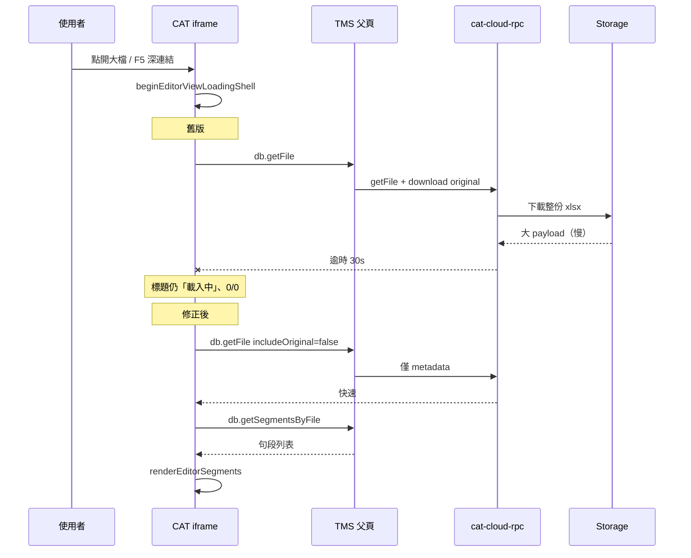

# Bug Report：團隊版大檔開啟編輯器卡在「載入中」（0/0 句段）

> **事件日期**：2026-05-26  
> **狀態**：已修正並驗收（`main` · `4422dae`）  
> **模式**：CAT 團隊線上版（`/cat/team`，iframe + Supabase）  
> **關聯**：2026-05 Storage 搬遷後 `db.getFile` 仍會下載原始檔（見 [incident-report_2026-05-01_rls-and-db-load.md](./incident-report_2026-05-01_rls-and-db-load.md)）；本次為**開檔路徑誤用**導致大檔逾時，非 Storage 設計本身錯誤。

本文採雙層結構：**Part 1** 白話現象與原因；**Part 2** 技術調查、根因、修正與程式觸點。

---

## Part 1 — 白話摘要

### 1.1 使用者看到什麼

| 步驟 | 現象 |
|------|------|
| 正在編輯大型 Excel 作業檔（例：`5.9六周年_繁体中文+zh-TW_翻译_source+target_20260526132851.xlsx`，字數約 **十多萬字**） | 平時可正常翻譯 |
| 在編輯器按 **重新整理（F5）** | 右下角紅色提示：**「上一個檔案已不存在或無權限，已回到首頁」**；或短暫全螢幕「載入中」 |
| 回到專案後再點同一檔案 | 進入編輯器畫面，但標題仍為 **「載入中…」**、句段 **0/0**、中間表格空白，像永遠轉不完 |

使用者回報：**第一次在這份大檔上**遇到；小檔較少觸發。

### 1.2 白話結論：為什麼大檔容易出事

開編輯器時，舊版團隊模式會做兩件「重」的事：

1. **從雲端下載整份原始 Excel**（整個 `.xlsx` 檔）— 檔越大越久。  
2. **再向資料庫索取所有句段** — 字數多通常代表句段也多，要分好幾次查詢。

其中第 1 點對**編輯譯文**其實不必要（畫面上顯示的是已匯入的句段，不是每次重讀 Excel）。大檔下載若超過約 **30 秒**，背景請求會失敗；舊程式又沒把失敗收乾淨，畫面就卡在「載入中」、0/0 句段。

重新整理時還可能多一個問題：父頁（TMS）的**登入身分尚未準備好**，CAT 就已發出雲端請求，被判定無權限或無回應，出現「檔案不存在或無權限」。

### 1.3 修正後行為（概要）

- **開檔**：只載入檔名、語言、句段等必要資料，**不再**下載整份原始 Excel。  
- **開檔失敗**：顯示明確提示並退回專案，不會無限「載入中」。  
- **重新整理深連結**：團隊模式下先等 TMS 送出身分再開檔。  
- **匯出 Excel**：仍會在按下匯出時下載原始檔（需依原檔格式寫回），與開檔分離。

### 1.4 驗收結果（2026-05-26）

產品端回報：**驗收成功** — 同一份十多萬字檔案可正常開啟；重新整理行為符合預期（可回到檔案或明確錯誤，不再 0/0 卡死）。

---

## Part 2 — 技術細節與修正過程

### 2.1 環境與 URL

- 部署：`talk-hanzi-joy.vercel.app`  
- 典型深連結：`/cat/team/files/{fileId}?p={projectId}`  
- iframe 查詢參數：由 [`src/pages/CatToolPage.tsx`](../src/pages/CatToolPage.tsx) `parseCatViewParams` 轉成 `catView=viewEditor`、`catFileId`、`catProjectId`

### 2.2 症狀對照程式行為

| UI 狀態 | 可能程式位置 | 說明 |
|---------|----------------|------|
| 標題「載入中…」 | `beginEditorViewLoadingShell` → `editorFileName.textContent = '載入中…'` | `openEditor` 在 `getFile` 完成前即切到編輯器 view |
| 0/0 句段 | `currentSegmentsList` 仍空或未執行 `renderEditorSegments` | `getFile`／`getSegmentsByFile` 失敗或未完成 |
| Toast「上一個檔案已不存在…」 | `restoreCatRouteFromSession` catch `isNotFound` | 深連結還原 `openEditor` 拋錯且訊息符合 not found／auth |
| 全螢幕「載入中」 | `#catMainRouteLoading` | 深連結 inline script 顯示；`finally` 應隱藏 |

### 2.3 根因（三層）

#### A. 開檔時不必要地下載 Storage 原始檔（主因 · 大檔）

- [`src/lib/cat-cloud-rpc.ts`](../src/lib/cat-cloud-rpc.ts) 的 `db.getFile` 在 2026-05 Storage 搬遷後，對**每一筆** `getFile` 呼叫 `mapFileRowWithOriginalHydrated` → `downloadCatOriginalAsBase64`。  
- [`cat-tool/app.js`](../cat-tool/app.js) 的 `openEditor` 第一個 await 即 `DBService.getFile(fileId)`。  
- **編輯器開檔**只需 metadata + `getSegmentsByFile`；`originalFileBuffer` 用於 Excel **匯出**、更新作業檔等（見 `exportBtn`、`batchExport`、`originalFileBuffer` 檢查）。  
- 大 xlsx（雙語、多工作表）在 Storage 下載 + base64 常超過 iframe RPC **30s**（[`cat-tool/js/data-provider.js`](../cat-tool/js/data-provider.js) `createCloudRpcClient`）。

#### B. `openEditor` 無 `catch`，逾時後 UI 殘留（加重卡死感）

- `openEditor` 僅 `try` / `finally`（`hideCatLoadingOverlay`），**沒有** `catch`。  
- `getFile` 逾時拋錯後：`editorFileName` 仍為「載入中…」、`viewEditor` 已顯示、`gridBody` 空白 → 與使用者截圖一致。

#### C. 深連結還原與 RPC 時序（重新整理時的紅色 Toast）

- 啟動時 [`restoreCatRouteFromSession`](../cat-tool/app.js) 立即 `openEditor`。  
- 父頁 [`CatToolPage.tsx`](../src/pages/CatToolPage.tsx) 的 `CAT_CLOUD_RPC` 在 `!user?.id` 時**直接 return、不回覆** → iframe 端 RPC 等到 timeout。  
- 錯誤訊息有時被歸類為 not found，觸發「上一個檔案已不存在或無權限，已回到首頁」。

### 2.4 修正內容（commit `4422dae`）

| 項目 | 檔案 | 作法 |
|------|------|------|
| `getFile` 可選是否下載原始檔 | `src/lib/cat-cloud-rpc.ts` | `payload.includeOriginal === true` 才 `mapFileRowWithOriginalHydrated`；否則 `mapFileRow(..., { listMode: true })` |
| 團隊 DB 層傳遞參數 | `cat-tool/db.js` | `DBService.getFile(fileId, { includeOriginal })` |
| 開檔用輕量 getFile | `cat-tool/app.js` | `catGetFile(fileId, { includeOriginal: false })` |
| 匯出用完整 getFile | `cat-tool/app.js` | `catGetFile(..., { includeOriginal: true })`（單檔匯出、批次匯出） |
| 開檔錯誤收尾 | `cat-tool/app.js` | `openEditor` 增加 `catch`：toast、退回專案／儀表板、`resetEditorTransientUi` |
| 深連結等身分 | `cat-tool/app.js` | `waitForTmsIdentityReady`；還原 editor 前 `await`（團隊模式） |
| 未登入 RPC 立即回錯 | `src/pages/CatToolPage.tsx` | 回 `CAT_AUTH_NOT_READY`，不靜默丟棄請求 |
| 還原路由 not found 判斷 | `cat-tool/app.js` | 納入 `cat_auth_not_ready`、`tms identity timeout` |

同步：`npm run sync:cat` → `public/cat/`。

### 2.5 程式觸點速查

| 符號／API | 用途 |
|-----------|------|
| `catGetFile(fileId, { includeOriginal })` | 團隊模式統一入口；離線模式忽略 opts |
| `openEditor` | 開檔：`includeOriginal: false` |
| `exportBtn` / `_batchExportBuildBlob` | 匯出：`includeOriginal: true` |
| `waitForTmsIdentityReady` | 深連結還原 editor 前等待 `TMS_IDENTITY` |
| `restoreCatRouteFromSession` | F5／URL 還原；editor 分支呼叫上述邏輯 |

### 2.6 與「檔案太大」的關係

| 因素 | 開檔（修正後） | 匯出（第二次修正後） |
|------|----------------|----------------------|
| Storage 原始 xlsx 體積 | **不下載** | iframe 以 **signed URL** 直接 fetch，不經 postMessage 塞 base64 |
| 句段筆數 | 分頁查詢（每頁 1000），大專案可能十幾秒～約一分鐘 | — |
| 字數／字數統計 | 與開檔卡住無直接因果 | — |

**結論**：十多萬字是重要觸發條件；開檔主因是**開檔誤拉整檔** + **錯誤未收尾**；匯出主因是**匯出仍走 base64 管道**導致逾時或 `CAT_OBJECT_NOT_FOUND`。

### 2.7 驗收步驟（白話）

1. 部署含 `4422dae` 之 Production。  
2. 團隊模式進專案 → 開啟曾卡住之 Excel。  
   - **預期**：標題為檔名、有句段、底部非 0/0。  
3. 編輯器內 F5。  
   - **預期**：回到同一檔或明確錯誤；不應永遠「載入中」。  
4. 編輯器或專案頁匯出大檔 Excel — 應下載成功或顯示「無法取得雲端原始 Excel」白話，而非 `CAT_OBJECT_NOT_FOUND`。

### 2.9 匯出大檔 `CAT_OBJECT_NOT_FOUND`（第二次修正）

**症狀**：開檔已正常，但按「匯出檔案」或專案頁「匯出所選」出現 `匯出發生錯誤: CAT_OBJECT_NOT_FOUND`。

**根因**：`includeOriginal: true` 仍呼叫 `mapFileRowWithOriginalHydrated`（父頁下載整檔 → base64 → postMessage）。大 xlsx 逾時或 Storage 回「Object not found」被誤映射為 `CAT_OBJECT_NOT_FOUND`。

**修法**（與 §2.4 開檔修正互補）：

| 項目 | 作法 |
|------|------|
| `mapFileRowWithOriginalSignedUrl` | `createSignedUrl` 回傳 `originalSignedUrl`，不在 RPC 端下載整檔 |
| `hydrateFile`（async） | iframe 內 `fetch(signedUrl)` → `originalFileBuffer` |
| RPC timeout | `db.getFile` + `includeOriginal` → 120s |
| 錯誤碼 | Storage 缺檔 → `CAT_STORAGE_ORIGINAL_NOT_FOUND` + 白話 alert |
| 專案頁單檔匯出 | 只勾 1 檔 → 直接下載 xlsx，不包 ZIP |

**驗收**：

1. 編輯器匯出 `…132851.xlsx` → 下載 `Translated_*.xlsx`。  
2. 專案頁只勾該檔 →「匯出所選」→ 直接下載單一檔（非 `.zip`）。  
3. 勾選 2 檔以上 → 仍為 `批次匯出_*.zip`。

### 2.10 後續可選優化（未實作）

- 僅對 `db.getSegmentsByFile` 拉長 RPC timeout 或顯示「已載入 x/y 句段」進度。  
- 列表 `getFiles` 已為 listMode；確認無其他路徑在開檔前誤呼叫 hydrated getFile。

---

## 相關文件

- [incident-report_2026-05-01_rls-and-db-load.md](./incident-report_2026-05-01_rls-and-db-load.md) — RLS、Storage、`getFile` 下載設計背景  
- [CODEMAP.md](./CODEMAP.md) — 團隊版 `getFile`／開檔觸點索引  
- [cat-tool/README.md](../cat-tool/README.md) — `sync:cat` 與單一來源約定  
- [LMS_CAT_SHELL_SIDEBAR_UX_2026-05.md](./LMS_CAT_SHELL_SIDEBAR_UX_2026-05.md) — iframe 與 `TMS_IDENTITY` 殼層行為  

## 版本紀錄

| 日期 | commit | 說明 |
|------|--------|------|
| 2026-05-26 | `4422dae` | 修正：開檔不拉原始檔、錯誤收尾、深連結等身分、RPC auth not ready |
| 2026-05-26 | （文件） | 本 bug report 建立；產品驗收通過 |
| 2026-05-26 | （待 push 短碼） | 匯出：signed URL、匯出錯誤白話、專案頁單檔直接下載 |
