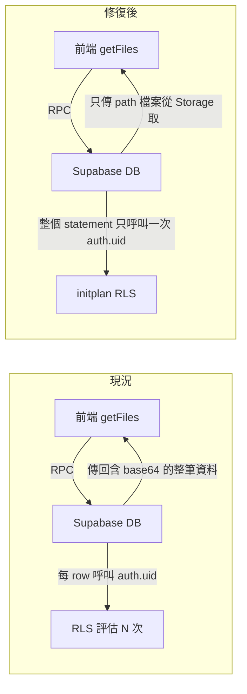

# 今日診斷與修復報告（2026-05-01）

本文記錄當日對 Supabase／CAT 團隊模式異常的診斷、根本原因、已施加修復與後續建議。

---

## 1. 背景 — 症狀

- 前端出現 **`PGRST003`**：`Timed out acquiring connection from connection pool`
- Auth **`/token`**、**`/user`** 回應 **504**
- 部分使用者 **登入卡住** 或 **無法正常讀取資料**

若需一般排查步驟，可一併參考 [`SUPABASE_HEALTH_RUNBOOK.md`](SUPABASE_HEALTH_RUNBOOK.md)。

---

## 2. 根本原因診斷

為 **兩個互相放大** 的問題：

### A. RLS `auth_rls_initplan`（主要 CPU／連線池壓力來源）

- `cat_files`、`cat_segments` 等 CAT 相關表（以及多張業務表）的 RLS policy 中 **直接使用** `auth.uid()`
- 在此種寫法下，Postgres 可能對 **每一列（row）** 重新評估 `auth.uid()`
- 當查詢掃描大量列時，CPU 與 policy 評估成本 **與列數成正比上升**，連帶拖慢連線歸還、使連線池更容易 **滿載／逾時**

**修正方向**：將 `auth.uid()` 改為 **`(SELECT auth.uid())`**，讓該值在 statement 層級以 **initplan** 方式評估（每個 statement 通常只算一次），大幅降低每列重複呼叫的成本。

### B. `cat_files.original_file_base64` 大欄位（次要；尚未搬遷）

- `public.cat_files` 以 **`original_file_base64 text`** 直接存放原始檔案的 base64 字串（見 migration [`supabase/migrations/20260415133000_cat_cloud_core.sql`](../supabase/migrations/20260415133000_cat_cloud_core.sql)）
- 當時資料量約 **46 筆**，合計約 **19 MB** 級別的大文字留在 Postgres 內
- 列表類 RPC（例如 `getFiles`、`getRecentFiles`）若 SELECT 帶出該欄，會造成 **網路傳輸與序列化負擔** 明顯放大
- 前端團隊模式在 [`cat-tool/db.js`](../cat-tool/db.js) 透過 **`hydrateFile`** 將 `originalFileBase64` 還原為 **`originalFileBuffer`**（`base64ToAb`），再供匯出等功能使用

說明：圖中「修復後」同時包含 **RLS 已修復** 與 **Storage 搬遷完成後** 的理想狀態；目前 **Storage 搬遷尚未執行**。

---

## 3. 今日已完成的修復

| 項目 | 說明 |
|------|------|
| Migration | [`supabase/migrations/20260502140000_rls_initplan_fix.sql`](../supabase/migrations/20260502140000_rls_initplan_fix.sql) |
| 內容 | 將既有多張表的 RLS policy 中 **`auth.uid()`**（及相關巢狀呼叫）改為 **`(SELECT auth.uid())`** 等形式，涵蓋 **`cat_files`、`cat_segments`、`cat_projects`、`cat_ai_*`** 等 CAT 表及業務表 |
| 狀態 | 已套用至正式資料庫；變更已納入版控 |

修復效果預期：**降低 DB CPU 與 RLS 開銷**，有助緩解 **連線池逾時** 與 **504** 連鎖現象；**不需**依賴前端部署即可在資料庫端生效。

---

## 4. 後續建議（尚未執行）

### `original_file_base64` → Supabase Storage 搬遷（三階段）

1. **階段一 — 雙寫／回填**  
   - 建立 Storage bucket 與存取策略（依專案慣例與 RLS／signed URL 設計）  
   - 將既有 `original_file_base64` 解碼後上傳，並寫入新欄位（例如 **`original_file_path`** 或等價設計）

2. **階段二 — 應用程式切換讀寫**  
   - 更新雲端 RPC 與 [`cat-tool/db.js`](../cat-tool/db.js)：`createFile`、`updateFile`、`getFile(s)`／`hydrateFile` 等路徑改為 **以 path／URL 取得檔案內容**，避免列表查詢一律帶出巨大 payload  
   - 依 [`AGENTS.md`](../AGENTS.md)／[`cat-tool/README.md`](../cat-tool/README.md)：僅改 **`cat-tool/`**，完成後執行 **`npm run sync:cat`** 並一併提交 `public/cat`

3. **階段三 — 收斂 schema**  
   - 確認無客戶端／無 RPC 再讀取 `original_file_base64` 後，再以 migration **`DROP COLUMN`** 移除該欄，回收空間與簡化 SELECT

**執行時機**：建議 **離峰**；46 筆規模下搬移本體通常可在 **數分鐘** 量級完成，但仍應備份與演練回滾。

---

## 5. 影響評估

| 修復項目 | 對使用者的影響 |
|----------|----------------|
| RLS initplan 修復（已完成） | 通常 **無需停機**； policy 更新後 **立即** 降低資料庫端負載 |
| Storage 搬遷（待執行） | 需 **程式＋schema 協調部署**；切換瞬間可能有極短窗口的相容風險，建議低峰與驗收清單 |

---

## 6. 相關檔案索引

- [`supabase/migrations/20260502140000_rls_initplan_fix.sql`](../supabase/migrations/20260502140000_rls_initplan_fix.sql) — RLS initplan 修正
- [`supabase/migrations/20260415133000_cat_cloud_core.sql`](../supabase/migrations/20260415133000_cat_cloud_core.sql) — `cat_files.original_file_base64` 欄位定義
- [`cat-tool/db.js`](../cat-tool/db.js) — 團隊模式 `hydrateFile`、`abToBase64`、`base64ToAb`、檔案 RPC 包裝（約 L1366–1438）
- [`docs/SUPABASE_HEALTH_RUNBOOK.md`](SUPABASE_HEALTH_RUNBOOK.md) — 連線池、`PGRST003`、504 排查
