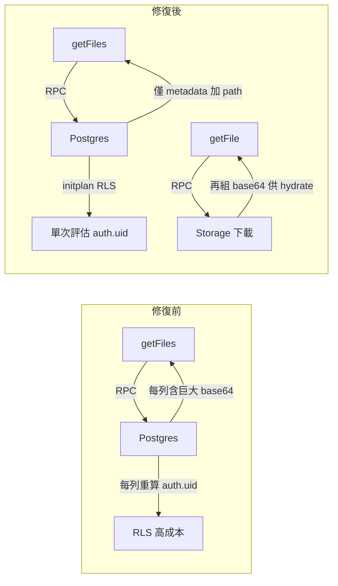

# 今日診斷與修復報告（2026-05-01 起）

本文記錄 **Supabase／CAT 團隊模式** 連線與負載問題的診斷、根因、**已落地修復**、**完整處理時間線**，以及**可選的後續步驟**。實作橫跨數日（含 RLS、Storage 搬遷、部署與回填），以本文件為單一匯總。

---

## 1. 背景 — 症狀

- 前端出現 **`PGRST003`**：`Timed out acquiring connection from connection pool`
- Auth **`/token`**、**`/user`** 回應 **504**
- 部分使用者 **登入卡住** 或 **無法正常讀取資料**

若需一般排查步驟，可一併參考 [`SUPABASE_HEALTH_RUNBOOK.md`](SUPABASE_HEALTH_RUNBOOK.md)。

---

## 2. 根本原因診斷

為 **兩個互相放大** 的問題：

### A. RLS `auth_rls_initplan`（主要 CPU／連線池壓力來源）

- `cat_files`、`cat_segments` 等 CAT 相關表（以及多張業務表）的 RLS policy 中 **直接使用** `auth.uid()`
- 在此種寫法下，Postgres 可能對 **每一列（row）** 重新評估 `auth.uid()`
- 當查詢掃描大量列時，CPU 與 policy 評估成本 **與列數成正比上升**，連帶拖慢連線歸還、使連線池更容易 **滿載／逾時**

**修正方向**：將 `auth.uid()` 改為 **`(SELECT auth.uid())`**，讓該值在 statement 層級以 **initplan** 方式評估（每個 statement 通常只算一次），大幅降低每列重複呼叫的成本。

### B. `cat_files.original_file_base64` 大欄位（次要；**已於 2026-05 搬遷至 Storage**）

- `public.cat_files` 曾以 **`original_file_base64 text`** 直接存放原始檔案的 base64 字串（見 migration [`supabase/migrations/20260415133000_cat_cloud_core.sql`](../supabase/migrations/20260415133000_cat_cloud_core.sql)）
- 當時資料量約 **40～46 筆** 級別，合計約 **十餘 MB** 的大文字留在 Postgres 內
- 列表類 RPC（例如 `getFiles`、`getRecentFiles`）若 `SELECT *` 帶出該欄，會造成 **網路傳輸與序列化負擔** 明顯放大
- 團隊模式資料流：iframe 內 CAT 透過 `postMessage` 呼叫父頁 [`src/lib/cat-cloud-rpc.ts`](../src/lib/cat-cloud-rpc.ts)（`handleCatCloudRpc`），再以使用者的 Supabase 工作階段存取 PostgREST／Storage
- 前端 [`cat-tool/db.js`](../cat-tool/db.js) 的 **`hydrateFile`** 仍依 **`originalFileBase64`** 還原 **`originalFileBuffer`**；**單檔開啟**時由 RPC 自 Storage 下載後填回 base64，列表則不再下載大 payload

**圖示說明**：**RLS** 與 **列表不帶 base64** 兩者皆已落地；**`getFile`** 路徑改為依 **`original_file_path`** 從 **bucket `cat-original-files`** 取檔後再餵給既有 hydrate 邏輯。

---

## 3. 完整處理時間線（對話／實作摘要）

以下為依序發生之重點（非逐句聊天紀錄）：

1. **診斷**：將 **`PGRST003`／504** 與 **連線池／DB 過載** 連結；區分 **RLS 每列成本** 與 **`cat_files` 大欄位** 兩類根因。
2. **RLS migration**：[`supabase/migrations/20260502140000_rls_initplan_fix.sql`](../supabase/migrations/20260502140000_rls_initplan_fix.sql) 納入版控，後續與其他 migration 一併 **`supabase db push`** 套至正式庫。
3. **初版文件**：建立本 incident 報告（僅含症狀、根因、RLS 與「Storage 建議」草稿）。
4. **CAT 原始檔 → Storage（程式與 schema）**  
   - Migration [`supabase/migrations/20260503120000_cat_original_files_storage.sql`](../supabase/migrations/20260503120000_cat_original_files_storage.sql)：bucket **`cat-original-files`**（private）、`cat_files.original_file_path`、**`storage.objects`** 之 authenticated 讀寫刪政策。  
   - [`src/lib/cat-cloud-rpc.ts`](../src/lib/cat-cloud-rpc.ts)：`db.createFile` 預先產生 `fileId` 並上傳 Storage；`db.getFiles`／`db.getRecentFiles` 改為**精簡欄位**（不 SELECT `original_file_base64`）；`db.getFile` 若有 path 則 **download** 後組 **base64**（含舊資料 fallback）；`db.updateFile`／`db.deleteFile`／`db.deleteProject` 連動 **刪除／覆寫 Storage 物件**。  
   - 回填腳本 [`scripts/backfill-cat-original-files.mjs`](../scripts/backfill-cat-original-files.mjs) 與 **`npm run backfill:cat-original-files`**（需 **`SUPABASE_SERVICE_ROLE_KEY`**，見下文）。
5. **`supabase db push` 曲折**  
   - 正式庫 **`schema_migrations`** 中有本地缺少檔名的版本 → 補占位檔 [`20260429234626_remote_history_placeholder.sql`](../supabase/migrations/20260429234626_remote_history_placeholder.sql)、[`20260430205338_remote_history_placeholder.sql`](../supabase/migrations/20260430205338_remote_history_placeholder.sql)（僅對齊歷史，不重複語意 DDL）。  
   - 另有「本地有、遠端尚未套用」之版本時間序早於遠端最後一筆 → 使用 **`supabase db push --include-all`**。  
   - [`supabase/migrations/20260502130000_perf_indexes.sql`](../supabase/migrations/20260502130000_perf_indexes.sql)：**由 `CREATE INDEX CONCURRENTLY` 改為一般 `CREATE INDEX IF NOT EXISTS`**，以便在 **單一 transaction** 內套用；若索引已存在，Postgres 可能出現 **`already exists, skipping`** 之 NOTICE，屬預期。
6. **前端部署**：Vercel **Production**（專案 **`talk-hanzi-joy`**）。本機 **`vercel deploy`** 產生 **`.vercel/`** 連結目錄 → 已加入根目錄 [`.gitignore`](../.gitignore)，避免誤提交。
7. **回填與驗收**  
   - 於本機 **PowerShell** 設定 **`SUPABASE_URL`** 與 **`SUPABASE_SERVICE_ROLE_KEY`**（Dashboard → **Project Settings → API** → **Legacy** 分頁之 **`service_role`** JWT；勿與 publishable／`sb_secret_` 混淆）。  
   - 執行 **`npm run backfill:cat-original-files`**。  
   - 驗證摘要（正式庫一次抽樣）：**`storage.objects`** 於 **`cat-original-files`** 約 **45** 筆；**`cat_files`** 具 **`original_file_path`** 約 **45** 筆；**非空 `original_file_base64`** **0** 筆。  
   - 使用者端回報：**CAT 團隊模式列表與開檔正常，且明顯較快**。
8. **Repo 收尾**：刪除暫存 **`migration_sql.tmp`**；**`.gitignore`** 納入 **`.vercel`** 並推送。

---

## 4. 已完成修復總表

| 軌道 | 內容 | 狀態 |
|------|------|------|
| **RLS initplan** | [`20260502140000_rls_initplan_fix.sql`](../supabase/migrations/20260502140000_rls_initplan_fix.sql)：`auth.uid()` → **`(SELECT auth.uid())`** 等 | 已上正式庫、已進版控 |
| **效能索引** | [`20260502130000_perf_indexes.sql`](../supabase/migrations/20260502130000_perf_indexes.sql)（非 CONCURRENTLY，利於 `db push`） | 已上正式庫 |
| **其他延宕 migration** | 例如 [`20260430074500_cat_file_assignments_self_insert.sql`](../supabase/migrations/20260430074500_cat_file_assignments_self_insert.sql)、[`20260501140000_cat_projects_question_form_columns.sql`](../supabase/migrations/20260501140000_cat_projects_question_form_columns.sql) 等，經 **`db push --include-all`** 補齊 | 已上正式庫 |
| **CAT 原始檔 Storage** | [`20260503120000_cat_original_files_storage.sql`](../supabase/migrations/20260503120000_cat_original_files_storage.sql) + [`cat-cloud-rpc.ts`](../src/lib/cat-cloud-rpc.ts) + 回填腳本 + 正式站部署 | 已上線並驗收 |

**RLS** 修復可在 DB 端生效；**Storage** 軌道需 **migration + 前端部署 + 回填** 三者完成後，列表才能真正「變輕」。

---

## 5. 影響評估（使用者視角）

| 項目 | 影響 |
|------|------|
| RLS initplan | 通常無需停機；降低 DB CPU 與 policy 成本，緩解連線池壓力 |
| CAT 原始檔改 Storage | 列表 RPC **payload 大減**；開單檔時多一次 Storage 讀取（實測仍較原「每列帶 base64」流暢） |
| `db push --include-all` 與占位 migration | 修正 **本地／遠端 migration 歷史不一致**；新環境請勿隨意刪除占位檔名 |

---

## 6. 潛在後續步驟（可選、待時機）

以下 **非必須立即執行**；請在業務低風險窗口與備份習慣下進行。

| 項目 | 說明 |
|------|------|
| **`DROP COLUMN original_file_base64`** | 正式庫已無非空 base64、且線上穩定一段時間後，可新增 migration **刪除欄位** 以回收空間。屆時應再檢視 [`src/lib/cat-cloud-rpc.ts`](../src/lib/cat-cloud-rpc.ts) 是否仍寫入／讀取該欄，並更新 [`src/integrations/supabase/types.ts`](../src/integrations/supabase/types.ts) 等型別；可一併簡化 fallback 分支。 |
| **Storage 孤兒物件** | 若曾使用 **舊版** 刪檔／刪專案路徑而未清 Storage，理論上可能有殘留物件；屬 **低優先** 清理，可定期比對 **`cat_files.original_file_path`** 與 **`storage.objects`**。 |
| **監控與容量** | 持續依 [`SUPABASE_HEALTH_RUNBOOK.md`](SUPABASE_HEALTH_RUNBOOK.md) 觀察連線池、慢查詢、**Storage 與 DB 磁碟**用量。 |

---

## 7. 相關檔案索引

- [`supabase/migrations/20260502140000_rls_initplan_fix.sql`](../supabase/migrations/20260502140000_rls_initplan_fix.sql) — RLS initplan  
- [`supabase/migrations/20260502130000_perf_indexes.sql`](../supabase/migrations/20260502130000_perf_indexes.sql) — 索引（可於 transaction 內套用）  
- [`supabase/migrations/20260503120000_cat_original_files_storage.sql`](../supabase/migrations/20260503120000_cat_original_files_storage.sql) — bucket、`original_file_path`、Storage policies  
- [`supabase/migrations/20260429234626_remote_history_placeholder.sql`](../supabase/migrations/20260429234626_remote_history_placeholder.sql)、[`20260430205338_remote_history_placeholder.sql`](../supabase/migrations/20260430205338_remote_history_placeholder.sql) — 與正式庫 migration 歷史對齊  
- [`src/lib/cat-cloud-rpc.ts`](../src/lib/cat-cloud-rpc.ts) — 團隊模式 RPC／Storage 連動  
- [`scripts/backfill-cat-original-files.mjs`](../scripts/backfill-cat-original-files.mjs) — 一次性回填（service role）  
- [`cat-tool/db.js`](../cat-tool/db.js) — `hydrateFile`、團隊模式 RPC 包裝（無須因 Storage 改路徑而必改，除非欲支援「僅 path、前端再拉檔」）  
- [`supabase/migrations/20260415133000_cat_cloud_core.sql`](../supabase/migrations/20260415133000_cat_cloud_core.sql) — 原始 `original_file_base64` 欄位定義  
- [`docs/SUPABASE_HEALTH_RUNBOOK.md`](SUPABASE_HEALTH_RUNBOOK.md) — 連線池、`PGRST003`、504  
